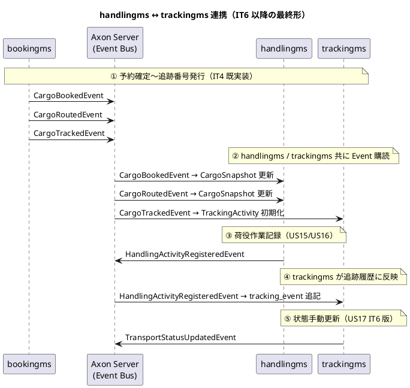

# ADR-0012: handlingms と trackingms の責務分離

IT5 で新設する `handlingms`（荷役マイクロサービス）と、IT6 以降で新設予定の `trackingms`（追跡マイクロサービス）の責務範囲を明確に定義し、両者の境界・通信パターン・Saga 適用方針を確定する。

日付: 2026-05-18

## ステータス

提案

## コンテキスト

IT5 で `handlingms` を新設し、US15（荷役作業を記録する）・US16（引取作業を記録する）・US17（貨物状態を手動更新する）を実装する。同時に IT6 で `trackingms` を新設し US18（追跡情報を照会する）を実装する予定である。

`docs/design/architecture_backend.md` のコンテキストマップでは両サービスは独立したマイクロサービスとして定義されており、`tracking <.. handling : HandlingActivityRegisteredEvent (Axon Event Bus)` のイベント連携が示されている。

しかし以下の点で責務境界が暗黙であり、IT5 着手前に明文化する必要がある。

1. **US17 状態手動更新の所属コンテキスト**: 「貨物状態の更新」は荷役（`handlingms`）と追跡（`trackingms`）のどちらの責務か
2. **Read Model 構築の所属**: 追跡情報の Read Model（`tracking_event`）は `handlingms` の Projection か `trackingms` の Projection か
3. **Saga 適用範囲**: `bookingms` → `handlingms` → `trackingms` の連鎖を Saga / ProcessManager で調整するか、Event 連携で結果整合性のみとするか
4. **IT5 単独運用時の暫定構成**: `trackingms` が存在しない IT5 期間中、追跡照会機能（IT6 で実装）の前提となる Read Model をどこで構築するか

### IT4 コードレビュー H4 指摘

IT4 バグ修正レビュー（`docs/review/IT4_bugfix_review_20260518.md`）の高優先度指摘 H4:

> `sendAndWait` 連鎖は分散デッドロックの温床。IT5 の handlingms 設計前に Saga 化方針を確定すべき

bookingms 内の `assign-route` → `confirm` → `issue-tracking` の連鎖でさえ `sendAndWait` の同期ブロッキングが懸念されており、IT5 以降の `bookingms` ↔ `handlingms` ↔ `trackingms` 連携でこのパターンを踏襲することは設計負債となる。

## 決定事項

### 1. 責務範囲の明確化

| 範囲 | handlingms（IT5 新設） | trackingms（IT6 新設予定） |
|------|----------------------|--------------------------|
| **Aggregate** | `HandlingActivity` | `TrackingActivity` |
| **主責務** | 港湾での荷役作業の記録（受領・積込・荷降し・引取・税関通過） | 貨物の現在状態・位置・追跡履歴の照会 |
| **書き込みコマンド** | `RegisterHandlingActivityCommand`（US15/US16） | `UpdateTransportStatusCommand`（US17 IT6 版）, `RegisterExceptionCommand`（US19-US20） |
| **発行イベント** | `HandlingActivityRegisteredEvent`, `UnexpectedHandlingDetectedEvent` | `TrackingInitializedEvent`, `TransportStatusUpdatedEvent`, `CargoDeliveredEvent` |
| **購読イベント** | `CargoBookedEvent`, `CargoRoutedEvent`（`CargoSnapshot` ACL 更新用） | `HandlingActivityRegisteredEvent`（追跡履歴反映用）, `CargoTrackedEvent` |
| **Read Model** | `handling_activity`, `handling_itinerary_snapshot`, `claim_verification` | `tracking_event`, `tracking_summary`, `tracking_exception` |
| **API エンドポイント** | `/api/v1/handling/**` | `/api/v1/tracking/**` |

### 2. US17（貨物状態を手動更新する）の暫定実装方針

US17 は本来 `trackingms` の責務（`TransportStatus` を扱うため）であるが、IT5 単独運用時は `trackingms` が存在しない。よって以下の暫定構成を採用する。

#### IT5 暫定構成

- US17 を `handlingms` 内で実装する
- `UpdateCargoStatusCommand` を `HandlingActivity` Aggregate に追加し、`CargoStatusUpdatedEvent` を発行
- handlingms 内の Projection が `handling_activity` テーブルに状態手動更新を記録（`handling_type = 'MANUAL_UPDATE'` 等の追加列ではなく、別テーブル `cargo_status_history` を使用することで、責務分離を物理層でも担保）
- API エンドポイントは暫定的に `/api/v1/handling/activities/{trackingNumber}/status`

#### IT6 移行方針

- `trackingms` 新設時に `UpdateTransportStatusCommand` を `TrackingActivity` Aggregate へ移管
- API エンドポイントを `/api/v1/tracking/{trackingNumber}/status` へ移行（旧エンドポイントは Deprecation Warning 後に削除）
- `cargo_status_history` テーブルは IT6 で `trackingms` 側に移行し、handlingms の Projection から除外

### 3. Read Model の暫定構築

`trackingms` が存在しない IT5 期間中、追跡照会の前提となる Read Model は以下の暫定構成で維持する。

| Read Model | IT5 実装 | IT6 以降 |
|-----------|---------|---------|
| 荷役作業履歴（`handling_activity`） | handlingms 内 Projection | 同左（handlingms 責務） |
| 追跡履歴（`tracking_event` 相当） | **作成しない**（IT6 で trackingms 新設時に handlingms の `HandlingActivityRegisteredEvent` を購読して構築） | trackingms 内 Projection |
| 貨物状態手動更新履歴 | handlingms 内 `cargo_status_history` | trackingms 内 `tracking_event` へマージ |

### 4. Saga / ProcessManager 適用方針

#### IT5 では Saga を採用しない

理由:

- IT5 のスコープでは `bookingms` ↔ `handlingms` 間の連鎖コマンド発行は不要（`HandlingActivity` は単一 Aggregate 操作で完結）
- IT4 から継承した bookingms 内の `sendAndWait` 連鎖は単一サービス内に閉じており、Saga 化のメリットが小さい
- Saga 導入には学習コストと運用コスト（Saga Store の運用・補償アクション設計）が発生する

#### IT6 以降の判断基準

以下のいずれかが発生した時点で Saga 導入を ADR で再評価する:

1. **bookingms ↔ handlingms ↔ trackingms の連鎖コマンド発生**: 例えば「予約確定 → 自動的に追跡を初期化 → 初期荷役予定を仮登録」のような自動連携が要件化した場合
2. **`sendAndWait` 連鎖の深さが 3 段以上**: 現在は 1 段（bookingms 内）だが、サービス境界をまたぐ 3 段以上の同期連鎖が発生したらタイムアウト・デッドロックリスクが顕在化する
3. **補償アクションが必要な業務トランザクション**: 「途中で失敗したら巻き戻す」要件（例: 引取作業記録失敗時の予約状態巻き戻し）

#### Saga 採用時の方針

採用が決定した場合は以下の方針に従う:

- Axon Framework 5 の `@Saga` + `JdbcSagaStore` を使用
- `BookingSagaManager` のように、トリガーとなる集約（`bookingms` の `Cargo`）側に Saga を配置
- 補償アクションは「キャンセル系コマンド」として明示的に実装

### 5. イベント連携パターン

## 結果

### 採用される構成

| 観点 | IT5（handlingms 単独） | IT6 以降（handlingms + trackingms） |
|------|----------------------|----------------------------------|
| US15/US16 実装場所 | handlingms | handlingms（変更なし） |
| US17 実装場所 | **handlingms 暫定** | trackingms 移管 |
| 状態手動更新 API | `/api/v1/handling/activities/{tn}/status` 暫定 | `/api/v1/tracking/{tn}/status` 移行 |
| Read Model（追跡履歴） | **構築しない** | trackingms 内 Projection |
| Saga | **未採用** | 必要時に ADR で再評価 |
| 連鎖コマンド | `sendAndWait` 維持（bookingms 内のみ） | Saga 検討（境界またぐ場合） |

### 利点

1. **責務境界の明確化**: handlingms = 荷役作業の記録、trackingms = 追跡情報の管理 として責務が明確
2. **段階的実装**: IT5 で handlingms を確立し、IT6 で trackingms を追加する段階的な複雑度増加
3. **Saga 採用判断の先送り**: 実需要が明確になってから Saga 導入を判断することで、過剰設計を回避
4. **API 互換性の維持**: US17 の暫定エンドポイント → IT6 移行時に Deprecation Warning を経由することで破壊的変更を最小化

### トレードオフ

1. **US17 実装の移管コスト**: IT5 → IT6 の移管時に `UpdateCargoStatusCommand` を `handlingms` から `trackingms` へ移動する必要がある（推定 2-3 SP）
2. **暫定エンドポイントの存在期間**: `/api/v1/handling/activities/{tn}/status` は IT5〜IT6 の 1 イテレーション期間のみ存在し、フロントエンドの追従が必要
3. **`cargo_status_history` テーブルの移動**: IT6 で物理的なデータ移行が必要（既存データを `tracking_event` へマージ）

### IT6 計画への申し送り

- [ ] trackingms 新設時に US17 を移管する SP（推定 2-3 SP）を計画に組み込む
- [ ] `cargo_status_history` テーブルから `tracking_event` テーブルへのデータ移行スクリプトを Flyway で管理する
- [ ] 旧 API エンドポイント `/api/v1/handling/activities/{tn}/status` の Deprecation Warning を 1 イテレーション期間実装した後に削除する
- [ ] Saga 導入の判断基準（連鎖深さ 3 段以上、補償アクション必要）を満たすか IT6 着手時に再評価する

## 関連

- [ADR-0001 Axon Framework 採用](0001-axon-framework-adoption.md)
- [ADR-0004 マイクロサービス分割方針](0004-microservice-decomposition.md)
- [ADR-0008 Axon 5.1 Spring Boot 統合パターン](0008-axon-5-spring-boot-integration-pattern.md)
- [バックエンドアーキテクチャ](../design/architecture_backend.md)
- [ドメインモデル設計](../design/domain-model.md)
- [IT4 バグ修正コードレビュー](../review/IT4_bugfix_review_20260518.md)
- [IT5 イテレーション計画](../development/iteration_plan-5.md)
