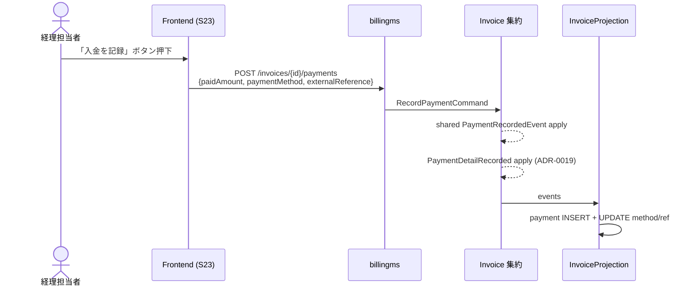

# ADR-0020: 決済機関 webhook 受信設計（部分入金 + 取引番号トレース）

IT7 は経理担当者が S23 で「入金確認」ボタン押下時のみ完全一致入金を受理する設計だった。IT8 で payment テーブルに payment_method / external_reference を反映する経路（ADR-0019 PaymentDetailRecorded）を実装したが、実際の決済機関（Stripe / GMO / Square 等）からの webhook 通知を受け取って自動で入金を反映する経路は未実装である。本 ADR では IT9（または優先度判断により IT10）で実装する webhook 受信エンドポイント、署名検証、idempotency キー、部分入金フローの設計を確定する。

日付: 2026-06-05

## ステータス

提案中（IT9 着手時に確定 / 一部は IT10 持ち越し可）

## コンテキスト

### IT8 終了時点の入金フロー



問題点（IT9 で解決）:

1. **完全一致のみ**: `paidAmount != totalAmount` の場合 `IllegalArgumentException`。部分入金を受け取れない。
2. **手動入力依存**: 経理担当者が決済機関ダッシュボードと照合して `externalReference` を手入力する必要がある。タイポ・遅延の温床。
3. **遅延通知の未対応**: 決済機関の確定タイミング（数時間〜数日）と請求書の状態が乖離する。

### IT9 で実装する webhook 受信

決済機関は HTTP POST で webhook を送信する。billingms 側は:

1. webhook を受信して署名検証
2. event type に応じて RecordPaymentCommand（または新規の RecordPartialPaymentCommand）を発火
3. idempotency-key（webhook の冪等性キー）で重複処理を防ぐ
4. 失敗時は決済機関の retry policy に任せる（4xx は処理失敗扱いで再送 / 5xx は一時失敗扱い）

## 決定

### 1. 決済機関選定

**MVP: Stripe**（HEROku Add-on or 直接連携、Day 0 から利用可能）。

| 比較項目 | Stripe | GMO ペイメントゲートウェイ | Square |
|---------|--------|---------------------------|--------|
| Java SDK | 公式（成熟） | 公式（やや古い） | 公式（活発） |
| webhook 署名検証 | HMAC-SHA256 + Stripe-Signature header | HMAC-SHA256（拡張）+ 独自仕様 | HMAC-SHA256 + x-square-signature |
| 部分入金通知 | `payment_intent.partially_funded` 等の event types | 拡張対応必要 | `payment.created` で amount を含む |
| 日本市場対応 | 〇（Stripe Japan 経由） | ◎（国内決済機関最大） | △（飲食特化） |
| Heroku Add-on | 〇 | × | × |
| ドキュメント | 充実（英文中心） | 日本語中心 | 充実 |

**選定理由**:
- Java SDK の成熟度（特に webhook 署名検証ヘルパが公式提供）
- Heroku Add-on で本番環境への投入が一貫している
- Cargo Tracker は国際物流業務ユースケース、英文・国際決済の親和性が高い
- 国内特化が必要になった段階で GMO へ多重対応する設計余地を残す（ADR-0015 の adapter パターンと同様、`PaymentGatewayAcl` interface を切る）

### 2. webhook 受信エンドポイント

```
POST /api/v1/billing/webhooks/payment-gateway
Headers:
  Stripe-Signature: t=...,v1=...,v0=...
  Content-Type: application/json
Body: Stripe Event オブジェクト
```

**配置**:
- billingms の `interfaces/rest/webhook/PaymentGatewayWebhookController` に配置
- gatewayms はバイパス（webhook は外部からの直接 POST、JWT 認証なし）
- 代わりに HMAC 署名検証を必須化（`STRIPE_WEBHOOK_SECRET` env で検証）

**処理フロー**:

1. リクエスト body の生バイトを取得
2. `Stripe-Signature` ヘッダから timestamp + signature を抽出
3. HMAC-SHA256 で signed payload を再計算して照合（公式 `Webhook.constructEvent()`）
4. event type を判定
5. RecordPaymentCommand（または部分入金用の新コマンド）を発行
6. 202 Accepted を返却（同期処理が遅い場合はキューイング）

### 3. 部分入金対応

#### 3.1 ドメインモデル拡張

`Invoice` 集約に `BalanceTracker` 値オブジェクトを追加:

```java
public record BalanceTracker(
        BigDecimal totalAmount,
        BigDecimal paidAmountSum,
        BigDecimal remainingAmount
) {
    public boolean isFullyPaid() {
        return remainingAmount.signum() == 0;
    }
}
```

#### 3.2 状態遷移の追加

| 状態 | 説明 |
|------|------|
| INVOICED | 発行済、入金未着 |
| PARTIALLY_PAID（新規） | 部分入金あり、残高ありの状態 |
| PAID | 全額入金完了 |
| OVERDUE | 支払期限超過 |

`PARTIALLY_PAID → PAID` の遷移は、累計 `paidAmountSum == totalAmount` で確定。

#### 3.3 既存 RecordPaymentCommand との関係

完全一致のみ受理する既存 `RecordPaymentCommand` は IT9 で `RecordPaymentCommand` に統合し、`isPartial: boolean` フィールドを追加。または、新規 `RecordPartialPaymentCommand` を別途用意し、既存 fully-paid 経路は維持する。後方互換性のため後者を選択（既存テストへの破壊的変更を避ける）。

### 4. Idempotency キー

Stripe の webhook は再送される可能性がある。billingms 側で重複処理を回避するため:

- `Stripe Event ID`（`evt_...`）を idempotency キーとして利用
- `webhook_processed` テーブルを追加し、processed event id を記録
- 同 event id を受信したら即座に 200 OK を返す（再処理しない）

#### 4.1 webhook_processed テーブル

```sql
CREATE TABLE webhook_processed (
    event_id          VARCHAR(100) PRIMARY KEY,
    event_type        VARCHAR(80) NOT NULL,
    payment_id        VARCHAR(100),
    invoice_id        VARCHAR(100),
    processed_at      TIMESTAMP NOT NULL,
    UNIQUE (event_id)
);
```

### 5. PaymentDetailRecorded 補完 event との接続

ADR-0019 で導入した `PaymentDetailRecorded` の `externalReference` フィールドを Stripe Event ID（`evt_...`）または PaymentIntent ID（`pi_...`）で埋める。これにより:

- S23 詳細画面で経理担当者が Stripe ダッシュボードに遷移可能（externalReference + 決済機関ベース URL を組合せて URL 生成）
- 監査要件（決済機関の取引番号を払出帳に残す）を満たす
- 部分入金時も各 payment 行に individual な `externalReference` が記録される

### 6. 失敗時のリトライ戦略

- **署名検証失敗**: 400 Bad Request、Stripe は再送しない（攻撃疑い）
- **idempotency キーで重複**: 200 OK（即座に返す）
- **command 実行失敗（IllegalStateException 等）**: 500 Internal Server Error、Stripe は exponential backoff で再送
- **command 実行成功**: 202 Accepted

## 結果

### Positive

- 経理担当者の手作業（入金確認 + externalReference 入力）を webhook で自動化
- 部分入金フローを domain model レベルで明示し、業務ルールが集約に閉じる
- Stripe Java SDK の成熟度により実装コストが低い
- Idempotency キーで「Stripe の at-least-once」性質に耐える

### Negative

- 部分入金導入で Invoice 集約 + 状態遷移 + UI が変更され、影響範囲が広い
- webhook 受信は外部公開 endpoint のため、HMAC 検証以外にも以下が必要:
  - rate limiting（同一 IP からの flood 対策）
  - 監視（Stripe ダッシュボードの webhook delivery success rate + 自前 metrics）
  - リトライ時の重複処理対策（webhook_processed テーブル）
- 国内決済機関対応（GMO 等）時は `PaymentGatewayAcl` interface を切って adapter パターン化が必要（IT10 以降）

### Neutral

- IT9 の 1 ストーリーとして「Stripe webhook 受信 + 部分入金対応」を切り出す（4-5SP 想定）
- ADR-0019 の `PaymentDetailRecorded` 設計は本 ADR で前提として使用される（変更なし）
- Heroku Add-on の Stripe ダッシュボードアクセス権限は経理担当者の RBAC と連携可能（Stripe Connect / Restricted API key）

## 関連 ADR

- [ADR-0012 cross-service idempotency and transactions](0012-cross-service-idempotency-and-transactions.md) — 集約発火型 + webhook idempotency キー
- [ADR-0015 billingms cross-service and shipper ACL](0015-billingms-cross-service-and-shipper-acl.md) — adapter パターン（IT10 で PaymentGatewayAcl に応用）
- [ADR-0019 PaymentDetailRecorded 補完イベント](0019-payment-detail-recorded-event.md) — externalReference を webhook event ID で埋める接続点

## 実装スケジュール

| イテレーション | 内容 |
|---------------|------|
| IT8（現行）| ADR-0020 起票 + PaymentDetailRecorded の externalReference カラム準備（ADR-0019 で完了） |
| IT9 候補 | Stripe Java SDK 統合、webhook controller、HMAC 検証、webhook_processed テーブル、完全入金経路の webhook 自動化 |
| IT10 候補 | 部分入金対応（PARTIALLY_PAID 状態追加、BalanceTracker、S23 部分入金履歴 UI） |
| 将来 | GMO / Square 等への adapter パターン展開 |
