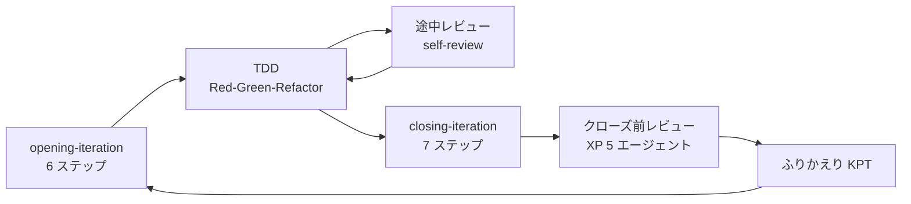

# 第 1 章：AI 駆動開発の全体像

## この章の狙い

以降の章を読むための前提を固定します。**どんな体制で、何を用意し、20 イテレーションで何が起きたか**を数字で示し、本シリーズがどの問いに答えようとしているかを明確にします。

## 体制

| 項目 | 内容 |
| :--- | :--- |
| 人間 | 1 名（開発者・プロダクトオーナー・レビュー依頼者を兼ねる） |
| AI | Claude Code（実装・テスト・ドキュメント・レビュー） |
| 分業 | 一部タスクを Codex に委譲（MCP 経由） |
| 期間 | 2026-08-06 〜 2026-08-13（8 日） |
| 成果 | 36 ストーリー・117SP・テスト 1,578 件・v2.1.0 出荷 |

**この体制の特徴は「人間がコードをほとんど書かない」ことではありません。** 特徴は、**人間が判断に専念できるだけの記録を AI に書かせ続けた**ことです。計画・完了報告・ふりかえり・ジャーナル・レビュー記録・ADR がイテレーションごとに残っており、その総量は実装コードに匹敵します。

そして本シリーズの主要な発見は、**その記録自体が繰り返し実態からずれた**ことです（主題 M2・M3）。

## 用意した仕組み

AI 駆動開発で最初に決めるのは「毎回どう頼むか」ではなく **「頼まなくても同じ手順が走る状態をどう作るか」** です。本プロジェクトでは 4 層で用意しました。

| 層 | 実体 | 役割 |
| :--- | :--- | :--- |
| 規範 | `CLAUDE.md` | ペルソナ・実行ルール・確認要否の境界・完了報告の様式 |
| 手順 | `.claude/skills/`（56 Skill） | 分析・開発・レビュー・計画・運用の各作業を明文化 |
| 自律 | Ralph Loop | Stop hook による継続実行。人間の再投入なしに次のタスクへ進む |
| 記憶 | エージェントメモリ・`docs/journal/` | 失敗の教訓を次のセッションへ持ち越す |

それぞれ第 2 章・第 3 章・第 4 章・第 8 章で扱います。ここでは **4 層が揃って初めて「イテレーションを回す」が成立した**ことだけ押さえてください。Skill だけでは自律しないし、自律だけでは同じ失敗を繰り返します。

## イテレーションの回し方

1 イテレーションは次の形で進みます。

**開始と終了を Skill で固定したことが、8 日で 20 回転できた理由の大半です。** 毎回「次に何をするか」を人間が指示していたら、この回数は回りません。

一方で、**固定した手順が抜けた回もあります**。途中レビュー（Try T6）は IT14・IT15 と 2 イテレーション連続で落とされ、IT16 で初めて実施されました。そしてそのとき、**IT16 自身が定めた規則を IT16 の実装が破っている**ことが見つかりました（`retrospective-16.md` K1）。

## 20 イテレーションの推移

| IT | 期間 | 局面 | SP | テスト累計 |
| ---: | :--- | :--- | ---: | ---: |
| 1 | 08-06 | 序盤 | 9 | 96 |
| 2 | 08-06 | 序盤 | 7 | — |
| 3 | 08-06〜07 | 中盤 | 8 | — |
| 4 | 08-07 | 中盤 | 8 | 530 |
| 5 | 08-07 | 中盤 | 7 | 581 |
| 6 | 08-08 | 中盤 | 8 | — |
| 7 | 08-08 | 終盤 | 8 | 794 |
| 8 | 08-08 | 終盤 | 8 | 870 |
| 9 | 08-08〜09 | 終盤 | 8 | 926 |
| 10 | 08-09 | 終盤 | 10 | — |
| 11 | 08-09 | 終盤 | 10 | — |
| 12 | 08-09 | 終盤 | 5 | 1,165 |
| 13 | 08-10 | 精算 | 6 | 1,256 |
| 14 | 08-10 | 精算 | 5 | 1,306 |
| 15 | 08-11 | 精算 | 5 | 1,377 |
| 16 | 08-11 | 整流 | **0** | 1,410 |
| 17 | 08-11 | 整流 | **0** | — |
| 18 | 08-12 | 見積 | 5 | — |
| 19 | 08-12 | 出荷と是正 | **0** | 1,558 |
| 20 | 08-13 | 出荷と是正 | **0** | 1,578 |

「—」は完了報告書にテスト数の記載が無い回です。**数えていない回がある**こと自体が記録の粒度を示しています（主題 M3）。

出典は `source/java-2/docs/development/iteration_report-N.md`、局面の定義は `development_strategy.md` です。

### 3 つの読みどころ

**1. IT1〜IT9 は計画 SP と実績 SP が 9 回連続で一致しました**（平均 7.89SP）。見積が当たったというより、**「終わるまでがイテレーション」だった**というのが実態に近く、この一致自体は品質の指標になりません。

**2. SP 0 のイテレーションを 4 回置いています**（IT16・17・19・20）。新規ストーリーを作らず、未達の受入基準・技術的負債・宣言だけされた規則を返す回です。**20 回のうち 5 分の 1 が返済に充てられた**ことになります。これは計画外の遅延ではなく、IT16 の時点で局面として設計されました。

**3. テストは 96 件から 1,578 件へ増えました。** ただし本シリーズが繰り返し扱うのは「テストが増えたこと」ではなく、**そのうち何件が実際に判別していたか**です（主題 M1）。IT11 では安全装置 22 件を数え上げて壊したところ 3 件が空振りしました。IT12 では同じ手順で 21 件を壊し、空振りは 0 件でした。**差は「壊すタイミング」** — IT12 は各コミットの中で「作った直後に壊す」を行っています。

## 何が守り、何が守らなかったか（結論の先出し）

第 14 章で総括する内容を、先に要約します。**この記事は結論を伏せません。**

| 仕組み | 効いたか | 根拠 |
| :--- | :--- | :--- |
| Skill による手順の固定 | **効いた** | 8 日 20 回転。開始・終了の抜けが激減 |
| 破壊検証（作った安全装置を壊す） | **効いた** | 空振りを毎 IT 実測で検出。IT16 で 3 件、IT20 でレビューが 3 種類 |
| マルチパースペクティブレビュー | **効いた** | 全 IT で高優先度の指摘。IT20 では tester が実際にプローブを書いて実測で示した |
| 負債返済枠を IT 序盤の独立コミットに置く | **効いた** | 6 IT 連続で機能。「余力次第」時代は 3 IT 連続繰り越し |
| ADR・コメント・遷移表による規則の宣言 | **効かなかった** | ADR-009 は 7 IT のあいだ半分守られず、違反が 5 本増えた |
| 件数・進捗の自己申告 | **効かなかった** | 起票時と実測が 5 回連続でずれた。記録 34 件に対し実測 249 件 |

**「効かなかった」2 つはいずれも文章です。** AI は文章を速く大量に書けるため、**規則を宣言した瞬間に守った気になる**という失敗が人間の開発より高頻度で起きます。対処は一貫していて、**規則を同じ変更の中で検査に落とす**ことでした（第 7 章）。

## 本シリーズの限界

先に述べておきます。

| 限界 | 内容 |
| :--- | :--- |
| 単一構成の実績 | モデル・ツール・言語がいずれも 1 通り。比較の根拠を持たない |
| 開発者 1 名 | 複数人チームでの AI 運用（レビューの分担・コンフリクト）は扱えない |
| 8 日という期間 | 数か月スケールで初めて出る劣化（依存の陳腐化・要員交代）は観測されていない |
| 題材の性質 | 業務システム。機械学習・リアルタイム制御・大規模データ処理には一般化できない |

そのうえで、**主題 M1〜M5 は構成に依存しません**。「緑であることは守られていることの根拠にならない」は、どの言語・どのモデルでも成立します。

## 次章

[第 2 章：Skill 体系で開発プロセスを固定する](02-skills.md) では、56 の Skill が何を明文化し、`CLAUDE.md` との役割分担をどう置いたかを扱います。
