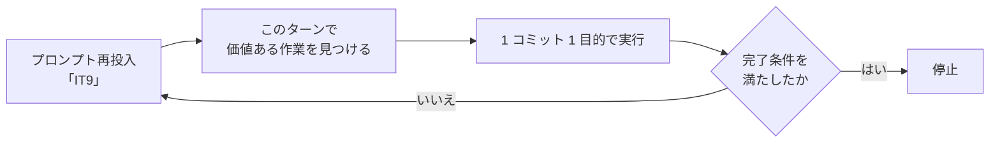

# 第 4 章：Ralph Loop と自律実行の境界

## 解こうとした問題

**Skill があっても、人間が「次をやって」と言わなければ止まります。**

第 3 章のライフサイクルは、`opening-iteration` → 実装 → レビュー → `closing-iteration` という一連の工程です。工程が定義されていても、**工程と工程のあいだで人間の再投入を待つ**なら、8 日で 20 回転はできません。

同時に、止まらないことにも危険があります。**AI が「やることが無くなった」状態でも回り続けると、価値の無い作業を発掘し始めます。**

## 仕組みの中身

本プロジェクトは Ralph Loop（Claude Code のプラグイン）を使っています。導入手順は `README.md` にあります。

```text
/ralph-loop "<プロンプト>" --max-iterations <数値> --completion-promise "<完了テキスト>"
```

仕組みは単純です。**Stop hook が、同じプロンプトを繰り返し再投入します。** `--completion-promise` に指定したテキストが出力されるか、`--max-iterations` に達するまで続きます。

実際の運用では、プロンプトは「IT9」のような **イテレーション番号だけ**でした。



**各ターンで「現在のイテレーションで次にやる価値ある作業」を自分で見つける**ことになります。これが Ralph Loop 運用の本質で、指示の粒度が「IT 番号」まで粗くなるかわりに、**何をすべきかの判断が AI 側に移ります**。

### 判断を移した先の順序を決めておく

判断を移す以上、順序を決めておかないと発掘が場当たりになります。イテレーションが 100% 達成した後の再投入では、次の順序で残作業を点検する運用が確立しました。

1. マルチパースペクティブレビューの実施
2. レビュー指摘の次イテレーションへの統合
3. 「実装済みだが反映漏れ」の前倒し完了（ADR ステータス・CHANGELOG・README）
4. 計画書の DoD・成功基準・デモ項目を完了実態に合わせて更新
5. ふりかえりへのレビュー結果反映
6. 索引への新規ファイル追加
7. 関連メモリの保存

**この順序は、第 3 章の `closing-iteration` の 7 ステップとほぼ一致します。** Ralph Loop は新しい工程を作るのではなく、**既にある工程を人間の再投入なしで進める**ための仕組みです。

## 自律実行の境界

**止めどきを決めることが、回し続けることと同じくらい重要でした。**

### end-of-life 状態

次をすべて満たすと、そのイテレーションで AI が単独でできることは尽きています。

- AI 単独完結可能な実装タスクがすべて完了している
- 関連ドキュメント（計画・報告・ジャーナル・索引・CHANGELOG・README・ADR・レビュー）が最新
- 中間レビューの低優先度も解消済み
- 次イテレーション計画のスケルトンが作成済み
- 関連メモリの保存も済んでいる

**この状態でも Stop hook は止まりません。** AI 側からループを止める手段が無いためです。

対処として、応答を段階的に縮める運用を定めました。

| ターン | 応答 |
| ---: | :--- |
| 1〜2 | 詳細な状況報告 ＋ 停止推奨 |
| 3〜5 | 簡潔な状況報告 ＋ 停止推奨 |
| **6 以降** | **1〜3 行の最小限応答**（「新規変更なし。`/ralph-loop:cancel-ralph` でループ停止、または人間判断の残作業に進んでください」程度） |

> 同じ停止推奨を毎ターン長文で繰り返すと、ユーザーへの提供価値が下がるばかりか、
> **context window を消費し、本当に意味のある作業への余裕が失われる。**

### 新規発掘の禁止

end-of-life で最も避けるべきは、**やることを作り出すこと**です。

| 許容 | 禁止 |
| :--- | :--- |
| 前ターン出力の微修正・タイポ修正 | **判断済みの項目を前倒し実施すること** |
| ドキュメント間の整合性チェック | 新しいスコープを発掘すること |
| （ただし 3 ターン以上続いたら最小応答へ移行） | |

> 中間レビューで「次リリース以降検討」「持ち越し」と明示判定した項目を前倒し実施するのは
> **判断のブレ**なので避ける（判断したターンと前倒し実施するターンの間で根拠が変わらない限り、
> **判断を尊重する**）。

**「手が空いているから前倒しする」は、判断を上書きする行為です。** 根拠が変わっていないのに結論を変えると、記録に残った判断が信用できなくなります。

### 人間判断が必要な領域

AI 単独で完結できない作業は、境界として明示されています。

| 領域 | 例 |
| :--- | :--- |
| 環境・インフラ | staging 環境の構築、環境変数、外部システム接続 |
| 業務判断 | 認可範囲の変更、正典が食い違ったときの決着 |
| 出荷 | リリースの可否 |

第 12 章で見た IT16 の例がこれに当たります。`ui_design.md` と `SecurityConfig` の認可が食い違ったとき、**認可を広げるのはテストで既成事実にしてよい変更ではない**として実装を動かさず、両文書に食い違いを明記して閉じました。

## 実際に働いたか — そして、記録が無いこと

**ここで正直に書いておくべきことがあります。**

`java/take-6` の 20 イテレーションのふりかえり・完了報告書・ジャーナルを全文検索しても、**Ralph Loop への言及は 1 件もありません**。導入手順が `README.md` にあり、運用パターンがエージェントメモリに残っているだけです。

つまり Ralph Loop は、**この開発を実際に駆動していながら、成果物の記録には一切現れていません。**

これは主題 M3（記録は実態より小さくなる）の、最も大きな実例かもしれません。ふりかえりが記録するのは**イテレーションの中で起きたこと**であり、**イテレーションを回している仕組みそのもの**は対象外です。手順として `closing-iteration` に組み込まれていない情報は、第 8 章で見たジャーナルと同じく落ちます。

**本章の記述は、そのためエージェントメモリと `README.md` を出典としています。** 他章がふりかえりの実測値を引用しているのに対し、この章だけは**運用の記録から再構成したもの**です。読者は、他章より確度が一段低いものとして扱ってください。

## 働かなかったケース

### 1. ループは AI 側から止められない

構造上の制約です。`--completion-promise` が設定されていない、あるいは条件を満たさない場合、**完了を宣言してもループは続きます**。

本プロジェクトの `CLAUDE.md` は、完全完了時の合い言葉を「Simple made easy.」と定めています。ただしこれは規律としての完了宣言であり、**ループの停止条件ではありません**。両者を混同すると、「宣言したのに止まらない」ことに戸惑って無意味な作業を始めます。

### 2. 記録に残らないものは改善されない

Ralph Loop 運用そのものについて、20 回のふりかえりは何も語っていません。**ふりかえりの対象になっていない仕組みは、良くも悪くもなりません。**

第 2 章で見たとおり、Skill はふりかえりの Try が反映されて育ちました。Ralph Loop 運用にはその回路がありません。

### 3. 判断の粒度が粗くなる

プロンプトが「IT9」だけになるということは、**そのターンで何をするかの判断が毎回 AI に委ねられる**ということです。順序を決めておいたのはこのためですが、**順序に無い状況（計画外の依頼・想定外の失敗）では、判断の質がそのターンの文脈に依存します**。

IT19 で計画外の作業が 16h（工数の 18%）を占め、**超過が確定した時点で落とす順序を見直していなかった**のは、この形の一例と読めます。

## この仕組みのまとめ

| 原則 | 根拠 |
| :--- | :--- |
| 工程間の再投入を自動化する | 8 日 20 回転は人間の再投入では回らない |
| **判断を移す先の順序を先に決める** | 決めないと発掘が場当たりになる |
| **end-of-life を判定基準で定義する** | 止めどきが無いと価値の無い作業が始まる |
| 応答は段階的に縮める | context window は有限 |
| **判断済みの項目を前倒ししない** | 根拠が変わらないのに結論を変えると記録が信用できなくなる |
| 人間判断の領域を明示する | 認可・環境・出荷は既成事実にしてよい変更ではない |
| **回している仕組み自体もふりかえりの対象にする** | 20 回のふりかえりに Ralph Loop の記述が 1 件も無い |

## 次章

第 1 部はここで終わりです。第 2 部（第 5〜8 章）では、この仕組みの上で実際に品質を守った規律を扱います。

- [第 5 章：TDD と「破壊検証」](05-destructive-verification.md)
