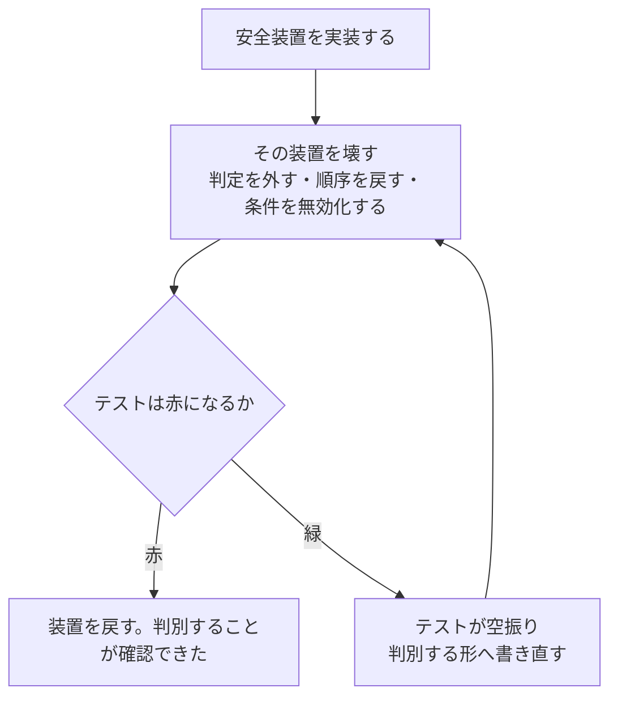

# 第 5 章：TDD と「破壊検証」

## 解こうとした問題

**テストが緑であることは、そのテストが何かを守っている根拠になりません。**

これは AI 駆動開発に固有の問題ではありません。ただし AI はテストを速く大量に書くため、**「テストがある」状態と「テストが判別する」状態の乖離が、人手の開発より速く広がります**。

IT1 で見つかった 4 件が出発点でした。

| 対象 | 実態 |
| :--- | :--- |
| ログアウトのテスト | 未認証状態から始めており、**セッション破棄が壊れていても常に緑** |
| 脆弱性スキャン | Gradle の依存を見ておらず、**緑だったのは何も検査していなかったから** |
| アカウントロック | 失敗回数の更新が非原子で、並行した試行ではロックが成立しない |
| 利用者シード | 「本番では適用しない」というコメントが何も強制していない |

**4 件とも実装中は緑で、CI も通っていました。**

## 仕組みの中身

対処は 1 行で書けます。**作った安全装置を実際に壊し、テストが赤になることを確認する。**

これを本プロジェクトでは「破壊検証」と呼び、IT2 から IT20 まで 19 イテレーション継続しました。手順は次の形に落ち着きます。

**壊し方は装置ごとに具体的です。** 実際に記録された壊し方の例を挙げます。

| 装置 | 壊し方 |
| :--- | :--- |
| 楽観的ロック | `WHERE` 句から `version` を外す |
| 業務タイムゾーンの時計 | UTC に戻す |
| ページ送りの LIMIT | 外す |
| 読み戻しの並び順 | `ORDER BY` を逆順にする |
| 経由回数の上限（枝刈り） | 判定を外す |
| 期限の日付単位比較 | 素朴な時刻比較に戻す |
| 荷役種別の網羅 | 種別を 1 つ追加する（**コンパイルエラーになれば実行時より強い**） |
| H2 方言スモーク | PostgreSQL 専用構文に戻す |

## 実際に働いたか

### 空振りは毎イテレーション見つかった

**19 イテレーション継続して、空振りが出なくなることはありませんでした。**

| IT | 壊した件数 | 空振り | 備考 |
| ---: | ---: | ---: | :--- |
| 2 | 5 | — | 遷移表を壊すと 4 件落ちた |
| 3 | 6 | — | 読み戻し順序を壊すと 6 件落ちた |
| 4 | 7 | 1 | 逆走チェックのテストが判別していなかった |
| 5 | 11 | 2 | 乗降区間の絞り込み・ロック切れの除外 |
| 6 | 19 | **4** | レビューで追加検出。入口は回したが出口を回していなかった |
| 7 | 11 | — | 入口と出口の両方を壊す形に拡張 |
| 10 | 10 | **0**（ただし検証対象外に 3 件の欠陥） | 自分で選んだリストの限界 |
| 11 | 22 | **3** | **機械的に数え上げる方式へ変更** |
| 12 | 21 | **0** | 各コミットの中で「作った直後に壊す」 |
| 14 | 6 | 0 | |
| 15 | 8 | 0 | |
| 16 | — | 3 | |
| 19 | — | 5 | |

### 「選び方」が結果を決めていた

IT10 と IT11 の対比が、この規律の核心です。

| IT | リストの作り方 | 結果 |
| ---: | :--- | :--- |
| 10 | **自分で選ぶ** | 10 件全部赤。**選ばなかった 3 件が壊れていた** |
| 11 | **機械的に数え上げる** | 22 件中 **3 件が空振り** |

> **選び方を変えたら、見つかるものが変わった。**
>
> — `retrospective-11.md`

自分で選ぶと全部赤になります。**当然です — 自信のあるものを選ぶからです。** 破壊検証が意味を持つのは、リストを自分で作らないときだけでした。

### 「壊すタイミング」が空振りを消した

IT11（22 件中 3 件空振り）と IT12（21 件中 0 件空振り）の違いは、装置の品質ではありません。

> IT11 は実装をまとめてから数え上げたが、本 IT は**各コミットの中で「作った直後に壊す」**を行った。
> **間に合わせで足した検査が混ざる余地がない。**
>
> — `retrospective-12.md` K2

**まとめてから数えると、「数え上げのために足したテスト」が混ざります。** それは判別する形になっていません。

### 検査が設計を良くした

破壊検証の副次効果として、**壊しやすい場所へ規則を移す**という設計改善が起きました（IT17・ADR-022）。

荷降し手配の規則は `MyBatisHandlingQueryService` の中にあり、確かめるには実 PostgreSQL の起動と承認・荷降しのデータ作成が必要でした。**判断だけを application 層へ出し、7 本の単体テストで固定**しています。

**壊しやすさは、テスト容易性の別名です。** 破壊検証を続けると、壊しにくい場所が自然に浮き上がります。

## 働かなかったケース

### 1. リストに載せなかったものは守られない

IT10 の限界がそれです。

> **共通するのは「自分で選んだ装置しか検証していない」ことである。**
> 破壊検証は強力だが、リストを自分で作る限り、リストに載せなかったものは守られない。
> IT9 のふりかえりで「安全装置は入口と出口の両方を壊す」と書いたが、
> **そもそも安全装置として認識していないものは、入口も出口も無い。**
>
> — `retrospective-10.md` P1

### 2. 「作った守り」にしか向かない

IT13 では破壊検証 8 件すべてを赤にできましたが、**既存のテストが空振りしていました**。

「確定後は税率が変わっても金額が動かない」というテストが、`reconstruct` に保存値そのものを渡していたため、**再計算する実装でも緑**になっていたのです。

> その検証は**「作った守り」にしか向けていなかった**。
>
> — `retrospective-13.md` P4

**破壊検証はそのイテレーションで作った装置を対象にします。** 過去のイテレーションで作られた装置は、誰かが疑わない限り検証されません。

### 3. 検査自身が空振りする

第 12 章で見たとおり、**検査を増やす回は検査の欠陥を増やす回**でした。

- `\w` は日本語を拾わない（メソッド名が日本語のプロジェクトで、全件素通り）
- 最後の列挙子には区切り記号が付かない（末尾 1 件だけが違反扱いになる）
- ソースを読む検査が、Javadoc だけの変更でビルドキャッシュに阻まれて走らない
- 名簿方式が、名簿に無いものを黙って通す

対処は**メタテスト**です。検査に対して既知の違反フィクスチャを与え、実際に検出することを確かめます。ただしフィクスチャの作り方にも罠があります。

> **「最小の違反例」だけだとメタテスト緑でも実コードの違反を見逃す。**
> 実コードの形で作る。

### 4. 粒度は常に一歩遅れる

IT19・IT20 で確認された構造です。

| 事故 | 検査の粒度 |
| :--- | :--- |
| 新しいサービスを載せ忘れる | 型単位で見る検査を作った |
| 次に増えたのは**メソッド** | メソッド単位へ拡張 |
| 次に外したのは**呼び出しの形**（メソッド参照・リフレクション） | ここに届いていない |

> IT19 のふりかえり Try「検査を書くときは過去に起きた事故の粒度で Red を作る」は、
> 型とメソッドの粒度までは効いた。**呼び出しの形の粒度には届かなかった。**
>
> — `retrospective-20.md` P1

**破壊検証は「いま知っている壊れ方」しか確かめられません。** これは原理的な限界であり、レビュー（第 6 章）が補います。

## この規律のまとめ

| 効く条件 | 根拠 |
| :--- | :--- |
| リストを機械的に数え上げる | 自分で選ぶと全部赤になる（IT10 vs IT11） |
| 各コミットの中で、作った直後に壊す | まとめてからだと間に合わせが混ざる（IT12） |
| 入口と出口の両方を壊す | 判定は壊しても、判定結果の行き先を壊していない（IT6） |
| 検査自身にメタテストを与える | 何も見ない検査が緑のまま増える（IT17） |
| フィクスチャは実コードの形で作る | 最小の違反例だけでは実コードを見逃す |

**そして、これだけでは足りません。** 20 イテレーションのうち、全緑の状態からレビューが高優先度の指摘を出さなかった回はありません。次章はその話です。

## 次章

[第 6 章：マルチパースペクティブレビュー](06-review.md)
