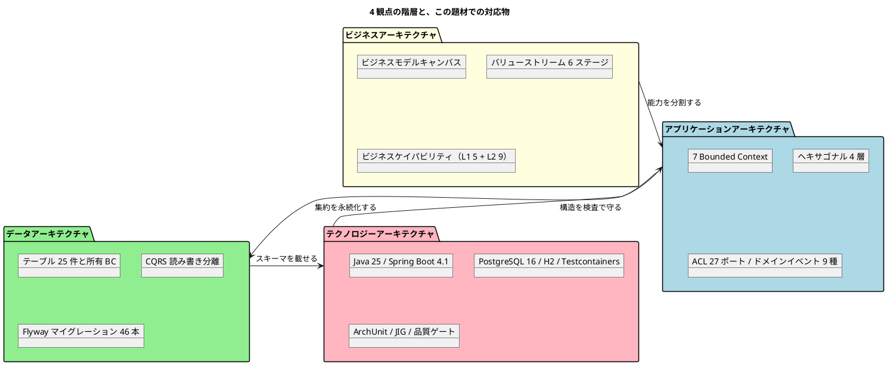

# 第 1 章：4 つの観点と、貫通の地図

| 項目 | 内容 |
| :--- | :--- |
| 対象 | シリーズ全体 |
| 一次資料 | `docs/strategy/business_architecture.md`・`docs/design/`・`docs/adr/` |
| 主題 | 業務の能力は、どこまで実装の構造に貫通しているか |

## なぜ観点を分けるのか

アーキテクチャ図を 1 枚で描くと、必ず異なる性質の判断が同じ平面に並びます。

「荷主に輸送状況を透明に見せる」は**業務が要求したこと**です。「Tracking を独立した BC にする」は**その要求を分割した結果**です。「`tracking_activity` テーブルを Tracking BC が所有する」は**分割をデータに落とした結果**で、「`MapperTableOwnershipTest` が SQL の越境を検査する」は**落とした結果を守る仕掛け**です。

この 4 つは因果で繋がっていますが、**変更の理由が違います**。業務要求が変われば 1 段目から作り直しになりますが、検査の実装を変えても業務要求は動きません。観点を分けるのは、**どの変更がどこまで波及するかを分離するため**です。

本シリーズでは以下の 4 層で切ります。

**最後の矢印（テクノロジー → アプリケーション）が逆向きなのが、この題材の特徴です。** アーキテクチャの規則をドキュメントに書くだけでは守られないため、テクノロジー層の検査コードがアプリケーション層の構造を縛り返しています。第 10 章の主題です。

## 題材 — 何を扱うシステムか

荷主が国際貨物の輸送を予約し、経路が割り当てられ、港湾で荷役が記録され、追跡され、到着後に精算される——その一連の業務です。

一次資料は業務の価値をこう定義しています。

| # | ビジネスプリンシプル | 根拠 |
| :--- | :--- | :--- |
| 1 | 輸送の安全性と期日遵守 | 荷主の最も基本的な要求であり、信頼の基盤 |
| 2 | 輸送状況の透明性 | 荷主の不安を解消し、業務判断を支援する |
| 3 | 業務の効率性と正確性 | 運用コスト削減と顧客満足度向上の両立 |
| 4 | 例外への迅速な対応 | 例外対応の品質がサービス全体の信頼性を左右する |

> 転記元：`docs/strategy/business_architecture.md`「ビジネスプリンシプル」

**この 4 つが、第 2 章以降で扱うすべての構造の出発点です。** 特に 4 番目（例外への迅速な対応）は、Tracking Context に例外イベントの集約を立て、`idx_tracking_exception_unresolved` という部分インデックスまで作らせています。**業務プリンシプルがデータアーキテクチャの物理設計に届いている数少ない例**であり、第 7 章で扱います。

## ガイディングプリンシプル — 一次資料が観点ごとに置いた指針

興味深いことに、参照元の一次資料は **4 観点それぞれに 1 行のプリンシプルを置いています**。

| カテゴリ | プリンシプル | 説明 |
| :--- | :--- | :--- |
| ビジネスアーキテクチャ | 顧客中心の価値提供 | すべてのビジネスプロセスは荷主・荷受人への価値提供を起点に設計する |
| アプリケーションアーキテクチャ | ドメイン駆動設計 | 境界付けられたコンテキストに基づきシステムを分割し、ビジネスドメインの変化に追従できる構造を維持する |
| データアーキテクチャ | データの一貫性と追跡可能性 | 貨物の状態・位置・履歴を一貫して追跡可能にし、透明性を確保する |
| テクノロジーアーキテクチャ | 標準準拠と相互運用性 | UN/LOCODE 等の国際標準に準拠し、港湾・税関・運送会社等の外部システムとの連携を容易にする |

> 転記元：`docs/strategy/business_architecture.md`「ガイディングプリンシプル」

**このうち 4 番目は、実装では成立していません。** ADR-006 が「外部システム連携は実装せず内部シミュレーションで代替する」と決めたため、**相互運用の相手が存在しません**。UN/LOCODE への準拠だけが残り、連携容易性は検証されていない状態です。

**ただし、これは失敗ではありません。** ADR-006 は「実体のない連携先に対する契約テストは契約を保証しない」という理由でその判断を下しています。プリンシプルが実装で降りきらなかったとき、**降りきらなかったことを ADR として名前で残すか、黙って落とすか**が分かれ目です。この題材は前者を選んでいます。第 9 章と第 11 章で扱います。

## 各観点で何を見るか

### ビジネスアーキテクチャ（第 2〜3 章）

ビジネスモデルキャンバス・バリューストリーム 6 ステージ・ケイパビリティマップを読み、**成熟度のヒートマッピング**が何を「新規に必要」と判定したかを見ます。この判定が、そのままシステム化の対象範囲になっています。

そこから要件定義（RDRA 2.0）とユーザーストーリーを経て、**ケイパビリティ L1 と Bounded Context がどこまで一致したか**を突き合わせます。

### アプリケーションアーキテクチャ（第 4〜6 章）

7 つの BC の責務と、共有カーネルを **2 要素に限定した判断**（ADR-005）を見ます。次にヘキサゴナルの 4 層（`domain` / `application` / `infrastructure` / `interfaces`）と、**ポートを定義する側とアダプタを実装する側が別の BC にある**という配置規則（ADR-012）を扱います。

最後に BC 間連携を、同期の ACL（27 ポート）と非同期のドメインイベント（9 種）の 2 系統で見ます。**どちらを選ぶかの判断基準**が第 6 章の中心です。

### データアーキテクチャ（第 7〜8 章）

概念／論理データモデルと、テーブル 25 件それぞれの所有 BC を見ます。**所有の表が「正典」と名乗りながら 4 イテレーション空白だった**という事故も扱います。

第 8 章は CQRS です。書き込み側（集約 → リポジトリ）と読み取り側（クエリサービス → ビュー）が MyBatis の上でどう分かれているかと、Flyway 46 本がスキーマをどう進化させたかを見ます。

### テクノロジーアーキテクチャ（第 9〜10 章）

Java 25 / Spring Boot 4.1 / MyBatis / Thymeleaf + htmx というスタックの選定理由と、**用途別に 3 つの DB を使い分ける戦略**（ADR-003）を扱います。

第 10 章は本シリーズの要です。ArchUnit 12 ルール・JIG による設計ドキュメント生成・Checkstyle / SpotBugs / JaCoCo のレイヤ別カバレッジ・依存ロック——**アーキテクチャの規則を人間の注意力ではなくビルドで守る**仕組みを列挙します。

## 読み方

各観点は独立に読めます。ただし **1 つだけ順序があります**。第 11 章（総括）は他のすべての章を前提にしています。

急ぐ場合の最短経路は次のとおりです。

| 関心 | 読む章 |
| :--- | :--- |
| DDD の戦略的設計の実例が見たい | 第 4 章 → 第 6 章 |
| CQRS の実装の実際が見たい | 第 8 章 |
| アーキテクチャをどう守るかが知りたい | 第 10 章 → 第 11 章 |
| 業務分析からの落とし込みが見たい | 第 2 章 → 第 3 章 → 第 4 章 |

次章から、いちばん上の層から降りていきます。
