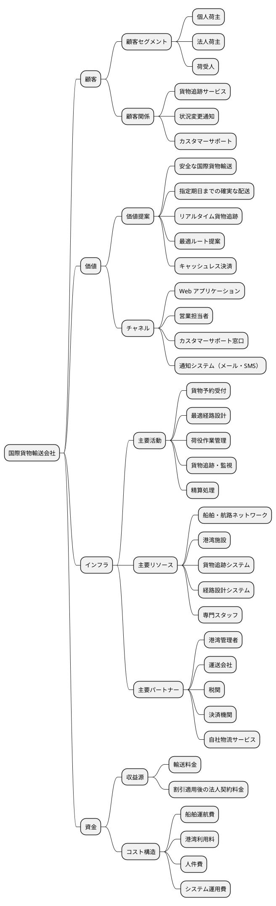
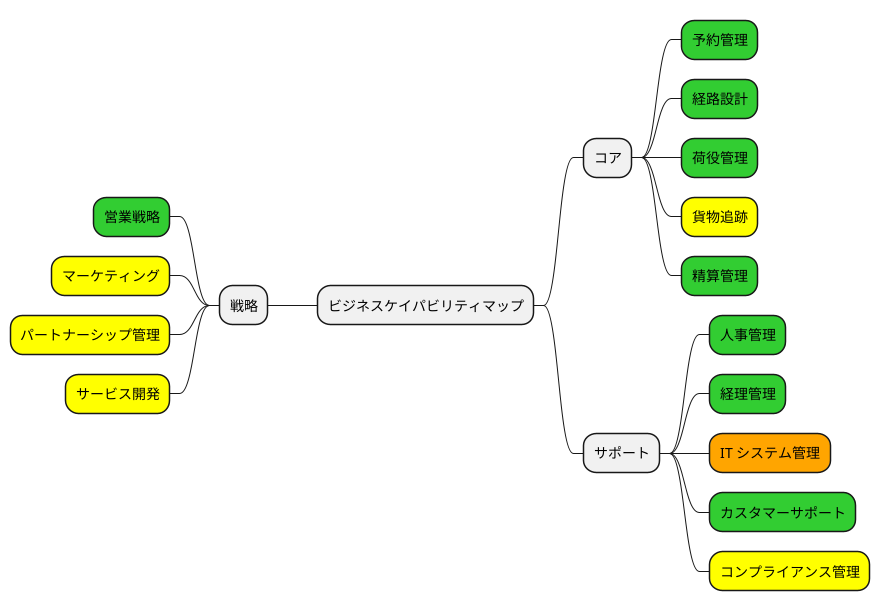
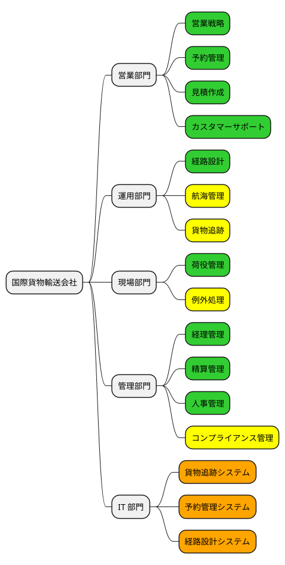
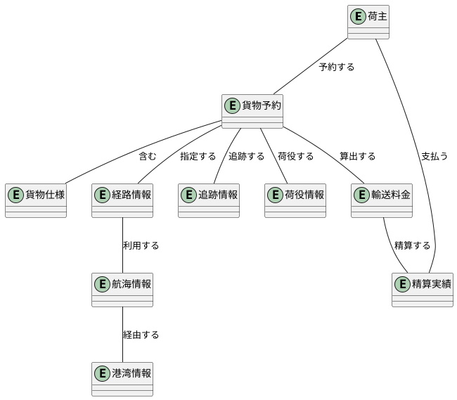

# 第 2 章：ビジネスモデルとケイパビリティ

| 項目 | 内容 |
| :--- | :--- |
| 観点 | ビジネスアーキテクチャ |
| 一次資料 | `docs/strategy/business_architecture.md`・`docs/strategy/inception-deck.md` |
| 主題 | 何を価値として、どの能力で届けるのか |

## この観点が答える問い

ビジネスアーキテクチャが答えるのは 3 つです。

1. **誰に、どんな価値を届けるのか**（ビジネスモデルキャンバス）
2. **その価値はどの流れで生まれるのか**（バリューストリーム）
3. **流れを支える能力のうち、どれが足りないのか**（ケイパビリティマップとヒートマッピング）

3 番目が重要です。**ケイパビリティマップは「何ができるか」の一覧ではなく、「何が足りないか」を判定するための道具**です。判定結果がそのままシステム化のスコープになります。

## ビジネスモデルキャンバス

一次資料は 9 ブロックを 4 群（顧客・価値・インフラ・資金）にまとめて記述しています。



> 転記元：`docs/strategy/business_architecture.md`「ビジネスモデルキャンバス」

### ここから下流に効いた 3 点

**（1）顧客セグメントが「個人荷主／法人荷主」に割れている。**

これは後の実装で `ShipperType`（個人／法人）という値オブジェクトになり、さらに収益源の「割引適用後の法人契約料金」と結びついて **`CorporateContract` と `DiscountRate`** になります。第 6 章で扱う `ShipperDiscountPort` は、この 1 行から生まれた ACL です。

**（2）「荷受人」が顧客セグメントに入っている。**

荷主（発注者）と荷受人（受取人）が別のセグメントであることは、実装では**認証を必要としない公開追跡画面**（`PublicTrackingController`）として現れます。荷受人はアカウントを持ちません。持たない利用者に価値を届けるという要求が、`PublicRateLimitFilter`（ADR-011）という防御まで引き連れています。

**（3）主要リソースに「貨物追跡システム」「経路設計システム」が並んでいる。**

**システムそのものが主要リソースとして数えられている**のがこの事業の特徴です。船舶や港湾施設と同じ列に置かれています。この位置づけがヒートマッピングで「新規に必要」の判定を引き出します。

## バリューストリーム

価値が生まれる流れは 6 ステージです。

| ステージ | 説明 | 提供価値 | 関連ケイパビリティ |
| :--- | :--- | :--- | :--- |
| 見積・提案 | 荷主の輸送要件を確認し、ルートと料金を提案する | 輸送ルートと費用の事前確認 | 見積作成、カスタマーサポート |
| 予約受付 | 荷主情報と貨物仕様を登録し、予約を確定する | 効率的な予約処理 | 予約受付、予約管理システム |
| 経路設計 | 最適な輸送経路を設計し、航海スケジュールに組み込む | 最適ルートによる効率的輸送 | 経路設計、航海スケジュール管理、経路設計システム |
| 荷役・輸送 | 積込・荷降し等の荷役作業を実施し、貨物を輸送する | 安全な貨物取扱い | 荷役作業、例外処理 |
| 追跡・監視 | 貨物の位置と状態をリアルタイムで追跡・監視する | リアルタイム追跡による透明性 | 追跡管理、貨物追跡システム |
| 配送完了・精算 | 貨物を荷受人に引き渡し、輸送料金を精算する | 確実な配送と正確な精算 | 精算処理、経理管理 |

> 転記元：`docs/strategy/business_architecture.md`「バリューストリーム詳細」

**この 6 ステージは、後の Bounded Context とほぼ 1 対 1 になります。**

| バリューストリーム | Bounded Context |
| :--- | :--- |
| 見積・提案 | Estimation |
| 予約受付 | Booking（＋ Shipper） |
| 経路設計 | Routing |
| 荷役・輸送 | Handling |
| 追跡・監視 | Tracking |
| 配送完了・精算 | Billing |

**この一致は偶然ではなく、設計上の意図です。** バリューストリームのステージは「業務の担当者が交代する場所」で切られており、DDD の境界づけられたコンテキストが「同じ言葉が同じ意味を持つ範囲」で切られる以上、両者は同じ切れ目に落ちやすくなります。

ただし **2 つずれています**。

- **予約受付が Booking と Shipper の 2 BC に割れた。** 荷主の登録は予約とライフサイクルが違う（荷主は予約をまたいで存在し続ける）ため、集約が分かれました
- **荷役・輸送が Handling として独立したのは後からです。** 当初の ADR-002 は Handling を Tracking の内側に置いていました。実装すると同じ BC の中で `HandlingType` と `TrackingEventType` を別々に定義しており、**統合されていたのではなく境界が引かれていなかった**と判明して ADR-010 で分離しています

**バリューストリームは境界の初期案としては有効だが、正解ではない**——これがこの題材から取れる結論です。第 4 章で詳しく扱います。

## ビジネスケイパビリティとヒートマッピング

ケイパビリティを戦略・コア・サポートの 3 群に分け、成熟度で色を付けたものがヒートマッピングです。



> 転記元：`docs/strategy/business_architecture.md`「ヒートマッピング」（グリーン＝成熟度高／イエロー＝中／レッド＝低／オレンジ＝新規に必要）

### 判定が意味していること

**オレンジ（新規に必要）は「IT システム管理」の 1 つだけです。**

これは業務の能力が既に存在していることを意味します。荷主は既に予約を取り、経路設計者は既に経路を引き、荷役作業員は既に作業を記録しています。**足りないのは、それを支える情報システムだけ**です。

**この判定が、このプロジェクトの性格を決めています。** 業務プロセスを再設計するのではなく、既存の業務プロセスをシステムに写す仕事です。だからこそ **ユビキタス言語が既に業務側に存在し**、実装はそれを借りるだけで済んでいます。`Voyage`（航海）・`CarrierMovement`（運送区間）・`Leg`（輸送区間）といった語が実装にそのまま現れるのはこのためです。

**イエロー（成熟度中）が「貨物追跡」であることも効いています。** コアケイパビリティのうち唯一の中成熟であり、価値提案の「リアルタイム貨物追跡」に対して現状が届いていないという判定です。実装で Tracking Context が CQRS の読み取り最適化を最も強く適用している BC になったのは、この判定の帰結です（第 8 章）。

### ケイパビリティ階層

L1（大分類）と L2（細分類）に階層化されています。

| レベル | ケイパビリティ | 分類 | 成熟度 |
| :--- | :--- | :--- | :--- |
| L1 | 予約管理 | コア | 高 |
| L2 | 荷主登録 | コア | 高 |
| L2 | 貨物仕様管理 | コア | 高 |
| L2 | 見積作成 | コア | 高 |
| L1 | 経路設計 | コア | 高 |
| L2 | 航海管理 | コア | 中 |
| L2 | ルート最適化 | コア | 高 |
| L1 | 荷役管理 | コア | 高 |
| L2 | 作業記録 | コア | 高 |
| L2 | 例外処理 | コア | 中 |
| L1 | 貨物追跡 | コア | 中 |
| L2 | 位置情報管理 | コア | 中 |
| L2 | 状態通知 | コア | 中 |
| L1 | 精算管理 | コア | 高 |
| L1 | IT システム管理 | サポート | 新規 |

> 転記元：`docs/strategy/business_architecture.md`「ケイパビリティ階層化」

**L2 の「見積作成」が L1 の「予約管理」の下にぶら下がっている**のに注意してください。ビジネス上は予約の一部（予約前の照会）として扱われています。

しかし実装では **Estimation は独立した Bounded Context** です。集約 `Estimate` を持ち、専用のテーブル（`estimate` / `route_candidate`）を所有します。**ビジネスケイパビリティの階層と、システムの境界は一致しませんでした。**

理由は「同じ言葉が違う意味を持つ」からです。見積の段階では貨物はまだ存在せず、あるのは輸送の**要件**（`EstimateSpecification`）だけです。予約の段階では貨物が存在し、`CargoSpecification` になります。**同じ「貨物仕様」という語が 2 つの意味を持つ**ため、境界を引くのが正しい判断でした。

これが本章の最も重要な観察です。

> **ケイパビリティの階層は、コンテキストの境界を決めない。** 決めるのは言葉の意味が変わる場所である。

第 3 章で、ケイパビリティと BC の対応を全件突き合わせます。

## 組織マップ — 誰がその能力を持つか



> 転記元：`docs/strategy/business_architecture.md`「組織マップ」

**組織マップは、実装ではロール（RBAC）になります。** 営業部門 → `ROLE_SALES`、運用部門の経路設計 → `ROLE_ROUTER`、現場部門 → `ROLE_HANDLER`、管理部門 → 経理のロール、という対応です。

そして **ロールは画面の到達性を決めます**。第 8 章で扱う `findAwaitingRouting()`（経路割り当て待ち）は `ROLE_ROUTER` の作業入口であり、既定の並び順が「希望期限の昇順」なのは**経路設計者が朝いちばんに見るのは切羽詰まっている順だから**です。

```java
    /**
     * 経路割り当て待ちの予約（US06 / US08。経路設計者の作業入口）。
     *
     * <p>対象は引き渡し済み（{@code ROUTE_PROPOSED}）で経路が未割り当てのもの。
     * <strong>既定の並び順は希望期限の昇順</strong>である（`ui_design.md`）。
     * 経路設計者が朝に見るのは「どれが一番切羽詰まっているか」であり、
     * **予約 ID 順では役に立たない**。
     */
    Page<BookingView> findAwaitingRouting(PageRequest page);
```

> 転記元：`apps/cargo-tracker/src/main/java/com/example/cargotracker/booking/application/internal/queryservices/BookingQueryService.java`

**組織マップの部門が、クエリの ORDER BY にまで届いています。** ビジネスアーキテクチャが実装のどこまで貫通するかの、最も細かい例です。

## 情報マップ — データアーキテクチャへの引き渡し

ビジネス観点で識別された情報の実体です。



> 転記元：`docs/strategy/business_architecture.md`「情報マップ」

**10 の情報実体が、最終的に 25 テーブルになります。** 増えた分は履歴・通知・申請・訂正といった**業務の例外側**です。第 7 章で全件の対応を追います。

## この章の要点

| 観察 | 内容 |
| :--- | :--- |
| ヒートマッピングの結論 | 業務能力は揃っており、**足りないのは情報システムだけ**（オレンジは IT のみ） |
| バリューストリーム 6 ステージ | BC とほぼ 1 対 1。**ただし予約受付は 2 つに割れ、荷役は後から独立した** |
| ケイパビリティ階層 | **BC の境界とは一致しない。** 見積は予約の L2 だが独立 BC になった |
| 組織マップ | RBAC のロールになり、**クエリの既定ソート順にまで届いている** |
| 情報マップ | 10 実体 → 25 テーブル。増分は業務の例外側 |

次章では、このケイパビリティが要件・ユーザーストーリーを経て Bounded Context に落ちる過程を追います。
