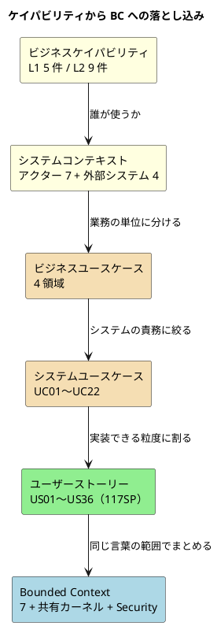

# 第 3 章：ケイパビリティから境界づけられたコンテキストへ

| 項目 | 内容 |
| :--- | :--- |
| 観点 | ビジネスアーキテクチャ（アプリケーションアーキテクチャへの引き渡し） |
| 一次資料 | `docs/requirements/requirements_definition.md`（RDRA 2.0）・`user_story.md` |
| 主題 | 業務の能力は、どういう経路でシステムの境界になったのか |

## 4 段の落とし込み

ビジネスケイパビリティは、そのままでは実装に落ちません。この題材では 4 段を経ています。



**最後の矢印（US → BC）だけが方向が違います。** 上の 4 段は「分割」ですが、最後だけは「再統合」です。**ストーリーは業務の流れの順に並んでいるのに、BC は言葉の意味の範囲でまとまる**ため、両者は交差します。この交差が第 4 章以降のすべての設計判断の起点です。

## システムコンテキスト — 誰が境界の外にいるか

RDRA 2.0 の最上層は「システム価値」です。まず境界の外側を確定します。

| 種別 | アクター | 役割 |
| :--- | :--- | :--- |
| ヒューマン | 荷主 | 貨物の輸送を依頼し、見積確認・ルート選択・予約確定・追跡確認を行う |
| ヒューマン | 荷受人 | 貨物の到着を待ち、追跡情報を確認する |
| ヒューマン | 営業担当者 | 見積作成・荷主情報登録・貨物予約登録・予約確定を行う |
| ヒューマン | 経路設計者 | 最適ルート設計・航海スケジュール管理・追跡番号発行を行う |
| ヒューマン | 追跡管理者 | 貨物状態更新・追跡情報管理・例外対応を行う |
| ヒューマン | 荷役作業員 | 積込・荷降し・受領・引取等の荷役作業を実施し記録する |
| ヒューマン | 経理担当者 | 輸送料金算出・割引適用・精算処理を行う |
| コンピュータ | 通知システム | 荷主・荷受人への状況変更通知（メール/SMS）を送信する |
| コンピュータ | 港湾管理システム | 港湾施設の利用状況を提供する |
| コンピュータ | 決済機関 | 精算処理の決済を実行する |
| コンピュータ | 税関 | 輸出入申告情報の連携を受け付ける |

> 転記元：`docs/requirements/requirements_definition.md`「アクター一覧」

### ヒューマンアクターは実装に届いた。コンピュータアクターは届かなかった

**7 つのヒューマンアクターは、すべて RBAC のロールとして実装されています。** 前章で見たとおり、ロールは画面の到達性とクエリの既定ソート順まで決めています。

**4 つのコンピュータアクターは、1 つも実装されていません。** ADR-006 が「外部システム連携は実装せず内部シミュレーションで代替する」と決めたためです。

| 外部システム | 設計上の役割 | 実装 |
| :--- | :--- | :--- |
| 通知システム | メール／SMS 送信 | `booking_notification` テーブルに送信記録を書くのみ。実送信なし |
| 港湾管理システム | 港湾施設の利用状況提供 | 航海の積載可能量を内部データで持つ（`VoyageCapacityPort`） |
| 決済機関 | 決済実行 | `payment` テーブルに入金記録を書くのみ |
| 税関 | 輸出入申告連携 | `customs_declaration` を内部で管理（`CustomsStatusChangedEvent`） |

**「連携しない」を選んだ結果、外部との境界が内部の集約に置き換わっています。** 通知システムというアクターは消え、代わりに「通知を送ったという記録」を持つ集約 `BookingNotification` が Booking Context に生まれました。

これは設計上の負債ではなく、**境界の引き直し**です。ADR-006 は理由をこう述べています——実体のない連携先に対する契約テストは契約を保証しない。**保証しないテストを緑にするより、連携が無いことを構造で示すほうが正直**という判断です。

第 9 章で、この判断がテクノロジースタックから WireMock と Spring WebClient を消していることを確認します。

## ユーザーストーリー — US01〜US36

ストーリーは 36 本、117 ストーリーポイントです。

| US | 内容 | 対応 BC |
| :--- | :--- | :--- |
| US01 | 輸送見積を作成する | Estimation |
| US02・US03・US32 | 荷主／法人荷主を登録する・訂正する | Shipper |
| US04・US05 | 貨物予約を登録する／危険物・冷凍貨物 | Booking |
| US06 | 予約情報を経路設計者に引き渡す | Booking → Routing |
| US07・US08・US10 | 航海スケジュール検索・経路候補算出・条件調整 | Routing |
| US09・US11 | 経路を選択・確定する／予約に紐付ける | Routing → Booking |
| US12・US13 | 確定経路を荷主に通知する／予約を確定する | Booking |
| US14 | 追跡番号を発行する | Booking → Tracking |
| US15・US16・US35・US36 | 荷役作業・引取作業の記録／引取確認コード／訂正 | Handling |
| US17・US18 | 貨物状態を手動更新する／追跡情報を照会する | Tracking |
| US19・US20・US28 | 遅延・破損・紛失・誤配の例外処理 | Tracking（＋ Routing） |
| US21・US22・US23 | 輸送料金算出・法人割引・精算処理 | Billing |
| US24・US25 | 航海スケジュールの新規登録・更新 | Routing |
| US26・US27・US31・US33 | ログイン・ログアウト・アカウント保護・解除 | Security |
| US29 | 通関申告を登録・管理する | Handling |
| US30 | 輸送中の予約キャンセルを承認する | Booking（＋ Billing） |
| US34 | 荷主が自社の予約を照会する | Booking（＋ Security） |

> 転記元：`docs/requirements/user_story.md`「ストーリー一覧」（BC 列は本記事で実装から対応付けたもの）

### ストーリーが 1 つの BC に収まらない場所が、連携点になる

上の表で「A → B」や「A（＋ B）」と書いた 8 本が、**そのまま第 6 章で扱う BC 間連携の一覧になります**。

| ストーリー | 越境の内容 | 実装された連携手段 |
| :--- | :--- | :--- |
| US06 | 予約を経路設計の対象にする | `RoutableBookings`（ACL・問い合わせ） |
| US09・US11 | 確定した経路を予約に書き戻す | `CargoRoutedEvent`（ドメインイベント） |
| US14 | 予約に対して追跡番号を発行する | `TrackingPort`（ACL・状態変更） |
| US15 | 荷役の記録を追跡と予約に伝える | `HandlingActivityRegisteredEvent` |
| US22 | 荷主の契約割引率を請求に使う | `ShipperDiscountPort`（ACL・問い合わせ） |
| US28 | 誤配を検知して経路を再設計する | `CargoExceptionRaisedEvent` ほか |
| US30 | 輸送中のキャンセルにキャンセル料を請求する | `CargoCancelledEvent` |
| US34 | 荷主が自分の予約だけを見る | `ShipperId`（共有カーネル・ADR-013） |

**越境の手段が 3 種類に分かれている**のが見どころです。問い合わせだけなら ACL、状態を変えるなら ACL でも「失敗が届く先」を名簿に登録し（ADR-021）、事実の伝播ならドメインイベントで結果整合にする（ADR-009）。判断基準は第 6 章で扱います。

## ユースケース番号がずれている

本章で 1 つ、一次資料の不整合を記録しておきます。

`user_story.md` のストーリー一覧は各 US に対応 UC を持ちます。

```text
| US01 | 輸送見積を作成する         | UC01 | 高 |
| US02 | 荷主を登録する             | UC02 | 高 |
| US04 | 貨物予約を登録する         | UC03 | 高 |
| US13 | 予約を確定する             | UC11 | 高 |
```

一方 `requirements_definition.md` の付録「ユースケース一覧」はこうです。

```text
| UC01 | 輸送見積作成       | 貨物輸送予約 | 営業担当者     |
| UC02 | 荷主・貨物予約登録 | 貨物輸送予約 | 営業担当者     |
| UC04 | 予約確定           | 貨物輸送予約 | 営業担当者、荷主 |
| UC_R01 | 予約情報引き渡し | 経路設計     | 営業担当者     |
```

**UC02 が指すものが違います。** ストーリー側では「荷主登録」、要件定義側では「荷主・貨物予約登録」です。さらに要件定義側は経路設計のユースケースに `UC_R01`〜`UC_R07` という別系統の採番を使っているのに対し、ストーリー側は連番の `UC04`〜`UC10` を使っています。

**どちらかが古いのではなく、両方が現役です。** ストーリーの粒度が細かくなった際に UC を割り直し、要件定義側の付録がその改訂に追随しなかった形です。

**これは実装には影響していません。** 実装が参照するのは US 番号だけで、UC 番号は Javadoc にも現れません。だからこそ **誰も気づかないまま残りました**。

> **検査されていないトレーサビリティは、いずれ切れる。**

この題材は、実装に届く規則（BC の境界・テーブルの所有・ポートの配置）を軒並み ArchUnit や独自テストに落としています（第 10 章）。**落とされなかったのは、実装に届かない規則です。** UC 番号の対応はその 1 つでした。

第 11 章で、貫通が破れた箇所としてもう一度扱います。

## ケイパビリティと BC の突き合わせ

前章のケイパビリティ L1 と、実装の Bounded Context を並べます。

| ケイパビリティ L1 | 成熟度 | Bounded Context | 一致 |
| :--- | :--- | :--- | :--- |
| 予約管理 | 高 | **Booking** ＋ **Shipper** ＋ **Estimation** | 1 : 3 |
| 経路設計 | 高 | **Routing** | 1 : 1 |
| 荷役管理 | 高 | **Handling** | 1 : 1 |
| 貨物追跡 | 中 | **Tracking** | 1 : 1 |
| 精算管理 | 高 | **Billing** | 1 : 1 |
| IT システム管理 | 新規 | （BC ではない。技術基盤） | — |
| （対応なし） | — | **Security**（支援サブドメイン。ADR-007） | 0 : 1 |
| （対応なし） | — | **Shared**（共有カーネル。ADR-005） | 0 : 1 |

**5 つの L1 のうち 4 つは 1 対 1 で BC になりました。** 割れたのは「予約管理」だけです。

割れた理由は前章で述べたとおり、**同じ語が違う意味を持つ場所で境界が引かれた**からです。

| BC | 「貨物の仕様」に相当するもの | ライフサイクル |
| :--- | :--- | :--- |
| Estimation | `EstimateSpecification` | 見積の作成から失効まで。貨物は存在しない |
| Booking | `CargoSpecification` | 予約の登録から精算まで。貨物が存在する |
| Shipper | （持たない） | 荷主は予約をまたいで存在し続ける |

そして **BC 側から見て、ケイパビリティに対応物を持たないものが 2 つあります**。

- **Security** は業務の能力ではなく、システムを持ったことで生じた責務です。ADR-007 は「支援サブドメイン」として位置づけ、**共有カーネルには入れない**と決めています。認証は全 BC が必要としますが、共有すると全 BC が Security のモデルに依存するためです
- **Shared**（共有カーネル）は `Location` と `ShipperId` の 2 要素のみです。ADR-005 の判断であり、第 4 章の中心的な話題になります

**ビジネス側に対応物を持たない BC が現れるのは正常です。** 逆に、ビジネス側に対応物を持たない BC が**多い**なら、それは技術的関心事で分割している兆候です。この題材では 2 つ（うち 1 つは 2 クラスのみ）に抑えられています。

## この章の要点

| 観察 | 内容 |
| :--- | :--- |
| ヒューマンアクター 7 | すべて RBAC のロールとして実装に届いた |
| コンピュータアクター 4 | **1 つも実装されていない**（ADR-006）。境界が内部の集約に置き換わった |
| ストーリー 36 本 | うち 8 本が単一 BC に収まらず、**そのまま BC 間連携の一覧になった** |
| UC 番号 | **要件定義とストーリーで採番がずれたまま両方が現役。** 実装に届かない規則は検査されず、切れた |
| ケイパビリティ L1 5 件 | 4 件は BC と 1 : 1。「予約管理」だけが 3 BC に割れた |

次章から、アプリケーションアーキテクチャに降ります。まず 7 つの Bounded Context の全体像です。
