# 第 4 章：コンテキストマップ — 7 つの業務領域

| 項目 | 内容 |
| :--- | :--- |
| 観点 | アプリケーションアーキテクチャ |
| 一次資料 | `docs/design/architecture_backend.md`・ADR-005 / 007 / 010 / 012 |
| 主題 | 業務をどこで割り、割った境界を何で守るのか |

## パッケージのトップレベルが BC である

この実装の最も重要な構造上の約束は、次の 1 行です。

> **トップレベルパッケージは Bounded Context と 1 対 1 である**（ADR-010）

```text
com.example.cargotracker/
├── booking/       予約
├── shipper/       荷主
├── routing/       経路
├── estimation/    見積
├── tracking/      追跡
├── handling/      荷役
├── billing/       請求
├── shared/        共有カーネル
├── security/      支援サブドメイン（認証・認可）
└── demo/          動作確認用データ投入（BC ではない）
```

**この約束が守られているかは、ビルドが検査します。**

```java
    @ArchTest
    static final ArchRule すべてのクラスはBC集合のいずれかに属する =
            classes()
                    .should().resideInAnyPackage(
                            "com.example.cargotracker",
                            "com.example.cargotracker.booking..",
                            "com.example.cargotracker.shipper..",
                            "com.example.cargotracker.routing..",
                            "com.example.cargotracker.tracking..",
                            // 荷役。**独立した BC である**（ADR-010）
                            "com.example.cargotracker.handling..",
                            "com.example.cargotracker.billing..",
                            "com.example.cargotracker.estimation..",
                            "com.example.cargotracker.shared..",
                            // 認証・認可の支援サブドメイン。共有カーネルではない（ADR-005）
                            "com.example.cargotracker.security..",
                            ...
                    .because("トップレベルパッケージは Bounded Context と 1 対 1 である（ADR-010）");
```

> 転記元：`apps/cargo-tracker/src/test/java/com/example/cargotracker/PackageStructureTest.java`

**なぜこの検査が必要か。** ArchUnit の BC 間参照禁止ルールは `slices().matching("com.example.cargotracker.(*)..")` で書かれています。**トップレベルパッケージを BC の単位とみなす**という前提の上に立っているため、規約から外れたパッケージを 1 つ足すだけで、そのパッケージは分離ルールの対象外になります。**検査が静かに無効化される**わけです。

だから **BC 集合そのものを検査対象にしています**。この二段構えは第 10 章の主題です。

## コンテキストマップ

一次資料が定義するコンテキストマップです。

```plantuml
@startuml
title コンテキストマップ

package "Booking Context" as booking #LightBlue {
  class Cargo <<Aggregate Root>>
  class CargoSpecification <<Value Object>>
  class CargoItinerary <<Value Object>>
  class BookingStatus <<Enum>>
}

package "Shipper Context" as shipper #Lavender {
  class Shipper <<Aggregate Root>>
  class ShipperCode <<Value Object>>
  class ShipperType <<Enum>>
  class CorporateContract <<Value Object>>
}

package "Estimation Context" as estimation #Wheat {
  class Estimate <<Aggregate Root>>
  class RouteCandidate <<Value Object>>
  class EstimateStatus <<Enum>>
}

package "Routing Context" as routing #LightGreen {
  class Voyage <<Aggregate Root>>
  class BookingRouteProposal <<Aggregate Root>>
  class CarrierMovement <<Entity>>
  class RoutingStatus <<Enum>>
}

package "Tracking Context" as tracking #LightYellow {
  class TrackingActivity <<Aggregate Root>>
  class TrackingNumber <<Value Object>>
  class TransportStatus <<Enum>>
  class TrackingExceptionEvent <<Entity>>
}

package "Handling Context" as handling #LightCoral {
  class HandlingActivity <<Aggregate Root>>
  class CustomsDeclaration <<Aggregate Root>>
  class CorrectionRequest <<Aggregate Root>>
  class HandlingType <<Enum>>
}

package "Billing Context" as billing #LightPink {
  class Invoice <<Aggregate Root>>
  class Reminder <<Aggregate Root>>
  class Money <<Value Object>>
  class DiscountPolicy <<Value Object>>
}

package "Shared Kernel" as shared #WhiteSmoke {
  class Location <<Value Object>>
  class ShipperId <<Value Object>>
}

booking --> shared : uses Location, ShipperId
shipper --> shared : uses ShipperId
routing --> shared : uses Location
tracking --> shared : uses Location
estimation --> shared : uses Location

booking ..> shipper : ShipperExistenceChecker (ACL)
booking ..> routing : VoyageCapacityPort / RouteRelaxations (ACL)
booking ..> tracking : TrackingPort / CargoExceptions (ACL)
routing ..> booking : RoutableBookings / CargoRouteAssignments (ACL)
handling ..> booking : CargoSnapshots (ACL)
estimation ..> routing : RouteCandidateSource (ACL)
billing ..> shipper : ShipperDiscountPort / ShipperContactPort (ACL)
billing ..> tracking : TrackingStatusPort (ACL)
billing ..> booking : BillableCargoPort / BookingSettlementPort (ACL)
shipper ..> security : LinkedAccounts (ACL)

booking <.. tracking : CargoRoutedEvent
tracking <.. handling : HandlingActivityRegisteredEvent
billing <.. booking : CargoCancelledEvent

note right of shared
  共有カーネルは Location と
  ShipperId の 2 要素のみ（ADR-005）
  VoyageNumber・TransportStatus・
  RoutingStatus は各コンテキスト所有
end note

@enduml
```



> 一次資料の `docs/design/architecture_backend.md`「コンテキストマップ」をもとに、実装のクラス名・ポート名に合わせて本記事で更新したもの

## 7 つの BC

| BC | 集約ルート | 責務 | 主要アクター |
| :--- | :--- | :--- | :--- |
| **Booking** | `Cargo`・`CancellationRequest`・`BookingNotification` | 予約の登録・経路割り当て・確定・キャンセル・通知記録 | 荷主、営業担当者 |
| **Shipper** | `Shipper` | 荷主の登録・訂正、契約割引率の保持 | 営業担当者 |
| **Routing** | `Voyage`・`BookingRouteProposal` | 航海スケジュール管理、経路候補の算出と提案 | 経路設計者 |
| **Estimation** | `Estimate` | 予約前の輸送見積とルート候補 | 営業担当者 |
| **Tracking** | `TrackingActivity` | 貨物の現在状態・輸送ステータス・例外イベント | 追跡管理者、荷主、荷受人 |
| **Handling** | `HandlingActivity`・`CustomsDeclaration`・`CorrectionRequest` | 港湾・税関での荷役作業の記録と訂正 | 荷役作業員、税関 |
| **Billing** | `Invoice`・`Reminder` | 運賃算出・請求書・入金・督促 | 経理担当者 |

集約は **13 個**（7 BC 合計 12 ＋ Security の `UserAccount`）です。

### 「1 BC = 1 集約」ではない

Booking が 3 集約、Handling が 3 集約、Billing と Routing が 2 集約を持ちます。**分かれ方に共通の理由があります**。

| BC | 主集約 | 別集約 | 分けた理由 |
| :--- | :--- | :--- | :--- |
| Booking | `Cargo` | `CancellationRequest` | 承認待ちの**申請**は貨物と別のライフサイクルを持つ |
| Booking | `Cargo` | `BookingNotification` | 通知の送信記録は貨物の状態ではなく**事実の履歴** |
| Handling | `HandlingActivity` | `CorrectionRequest` | 訂正の**申請**は元の記録と別に承認される |
| Handling | `HandlingActivity` | `CustomsDeclaration` | 通関は荷役とは別の相手（税関）との往復を持つ |
| Billing | `Invoice` | `Reminder` | 督促は請求書に紐づくが**送るたびに増える** |
| Routing | `Voyage` | `BookingRouteProposal` | 航海はマスタ、提案は予約ごとのトランザクション |

**「申請」「記録」「督促」が別集約になる**のがこの実装の傾向です。いずれも「主集約の状態を変える前に、別の主体の承認や送信が挟まる」ものです。トランザクション整合の範囲を主集約に閉じるため、別の集約に切り出されています。

## 共有カーネルを 2 要素に限定する（ADR-005）

共有カーネルに置かれているのは 2 つだけです。

```text
shared/domain/model/valueobjects/
├── Location.java     UN/LOCODE で表す場所
└── ShipperId.java    荷主の識別子（UUID）
```

**当初は 4 要素の候補がありました。** `VoyageNumber`（航海番号）・`TransportStatus`（輸送状態）・`RoutingStatus`（経路状態）も「全 BC が使う」ように見えたためです。

ADR-005 はこれらを共有カーネルから外し、**各コンテキストの所有**としました。理由は「同じ語が BC ごとに違う意味を持つ」からです。

| 語 | 所有 BC | 他 BC での意味 |
| :--- | :--- | :--- |
| `TransportStatus` | Tracking | Booking にとっては `BookingStatus`（予約の進行）であり、輸送の物理状態ではない |
| `RoutingStatus` | Routing | Booking にとっては「経路が付いたか」という 2 値でしかない |
| `VoyageNumber` | Routing | Handling にとっては作業が発生した便の識別子で、スケジュールを持たない |

**共有カーネルに入れると、意味の違いが消えます。** 消えると、片方の BC の都合で列挙子を 1 つ足したときに、もう片方の BC が対応していない値を受け取ります。

そこで **ポートが運ぶのは素の値だけ**という規則が生まれました。

```java
    /**
     * 契約割引率を引く。
     *
     * @param shipperId 荷主 ID（UUID の文字列表現）
     * @return 契約割引率（0.0000〜0.3000）。<strong>個人荷主・未設定・不明な荷主は空</strong>。
     */
    Optional<BigDecimal> findContractDiscountRate(String shipperId);
```

> 転記元：`billing/application/internal/outboundservices/acl/ShipperDiscountPort.java`

このポートは `BigDecimal` を返し、Shipper が持つ `DiscountRate` 値オブジェクトを返しません。Javadoc は理由をこう書いています。

> 運ぶのは**素の値だけ**である（ADR-005）。Shipper の `DiscountRate` を返すと、Billing が Shipper のドメインを参照することになる（ArchUnit ルール 4）。

**共有カーネルを絞ると、越境の通貨が素の値になります。** これは型の情報を捨てる代償を払っていますが、代わりに「片方の BC の型変更が他方をコンパイルエラーにする」ことが無くなります。第 5 章・第 6 章で、この代償の払い方を詳しく見ます。

## Security は共有カーネルではない（ADR-007）

認証・認可は全 BC が必要とします。にもかかわらず、`security` は**支援サブドメイン**として独立した BC に置かれています。

理由は共有カーネルと同じです。**共有すると全 BC が Security のモデルに依存します。** `UserAccount` や `Role` を共有カーネルに置けば、ロールを 1 つ追加するだけで全 BC が影響範囲になります。

代わりに ADR-013 がこう決めています。

> 利用者と荷主の紐付けは Security Context が共有カーネルの `ShipperId` だけで持つ

`ShipperId` は既に共有カーネルにあります。**新しい共有物を作らずに紐付けを実現している**わけです。US34（荷主が自社の予約を照会する）はこの紐付けで動きます。

紐付けの向きも意図的です。Shipper が Security を知るのではなく、Security が `ShipperId` を持ちます。**荷主は利用者アカウントを持たなくても存在できる**（営業担当者が代行登録する）という業務の事実に合わせた向きです。

## Handling が独立するまで — 境界は 1 回では決まらない

ADR-002 は当初、Handling を Tracking の内側のモジュールとしていました。荷役イベントは追跡イベントの一種だ、という見立てです。

実装した結果、ADR-010 が **ADR-002 を置き換えました**。一次資料の記述を引用します。

> **ADR-002 は Tracking 内のモジュールとしていたが、実装すると言語は分岐していた。**
> `HandlingType` と `TrackingEventType`、`HandlingVoyageNumber` と `TrackingVoyageNumber`、
> `CargoBookingId` と `TrackingBookingId` を同じ BC の中で別々に定義しており、
> **統合されていたのではなく境界が引かれていなかった**（ADR-010）。
>
> 転記元：`docs/design/architecture_backend.md`「Handling Context」

**この診断の仕方が本章で最も再利用価値のある知見です。**

> **1 つの BC の中に、同じ概念の型が 2 つ現れたら、それは境界である。**

統合された BC であれば、`HandlingType` と `TrackingEventType` は 1 つの型になるはずでした。ならなかったのは、**荷役作業員が語る「作業の種類」と、追跡管理者が語る「イベントの種類」が違う言葉だから**です。統合の判断が間違っていたことを、コードが型の重複という形で示していました。

**ドキュメント上の境界と、コード上の境界がずれたとき、正しいのはコードの側でした。** 第 10 章で扱う JIG（バイトコードから設計ドキュメントを生成するツール）が導入されているのは、このずれを目視ではなく生成物の差分で見つけるためです。

## 依存の向きを一方通行に保つ（ADR-012）

BC 間の参照は循環しがちです。

- Booking は Tracking に追跡番号を発行させる（Booking → Tracking）
- Tracking は目的地と推定到着日を表示したい（Tracking → Booking）

**これで循環します。** ADR-012 の解決策は 2 段です。

**（1）ドメイン層とアプリケーション層は BC をまたがない。** 実装上は、他 BC のクラスをこれらの層で参照することを ArchUnit が禁じています。

**（2）残る循環はインフラ層に閉じ込める。** ポート（インタフェース）は呼び出す側の BC のアプリケーション層に置き、アダプタ（実装）は呼ばれる側の BC のインフラ層に置きます。

```text
billing/application/internal/outboundservices/acl/ShipperDiscountPort.java  ← 呼ぶ側が定義
shipper/infrastructure/acl/ShipperDiscountAdapter.java                      ← 呼ばれる側が実装
```

**依存の向きは Shipper → Billing の 1 本だけになります。** Billing は Shipper を知らず、Shipper が Billing のインタフェースを実装しに来ます（依存性逆転）。

**（3）それでも足りない循環は、ドメインイベントで断ちます。** Tracking が Booking の目的地を知りたい件は、`CargoRoutedEvent` として Booking から Tracking へ**押し出す**ことで解決しました。

```java
/**
 * 貨物に経路が割り当てられた（US11 / ADR-012）。
 *
 * <p>Booking Context が発行し、Tracking Context が購読する。
 *
 * <p><strong>この経路が存在する理由は循環の解消である。</strong> 追跡は目的地と
 * 推定到着日を表示するが、それを Booking へ問い合わせると Tracking → Booking の
 * 参照が生まれ、Booking → Tracking（追跡番号の発行）と合わせて循環する（ADR-012）。
 */
public record CargoRoutedEvent(
        UUID bookingId,
        String destinationUnlocode,
        LocalDate estimatedArrivalDate) {
}
```

> 転記元：`shared/domain/event/CargoRoutedEvent.java`

**この Javadoc は、イベントの存在理由を「循環の解消」と明記しています。** ドメインイベントを「疎結合のため」と一般論で説明するのではなく、**どの循環を断つために存在するか**を名指ししています。第 6 章の主題です。

## この章の要点

| 観察 | 内容 |
| :--- | :--- |
| BC = トップレベルパッケージ | 約束そのものを ArchUnit が検査する。規約外のパッケージは分離ルールを静かに無効化するため |
| 7 BC / 13 集約 | 「申請」「記録」「督促」が別集約になる。承認や送信が挟まる単位で切れている |
| 共有カーネル 2 要素 | 同じ語が BC ごとに違う意味を持つものは共有しない。**越境の通貨は素の値** |
| Security | 全 BC が使うが共有カーネルではない。既存の `ShipperId` で紐付ける（ADR-013） |
| Handling の独立 | **同じ概念の型が 1 BC 内に 2 つ現れたら、それは境界である**（ADR-010） |
| 依存の向き | ポートは呼ぶ側、アダプタは呼ばれる側。残る循環はドメインイベントで断つ（ADR-012） |

次章では、BC の内側——ヘキサゴナルの 4 層とポートの置き場所を見ます。
