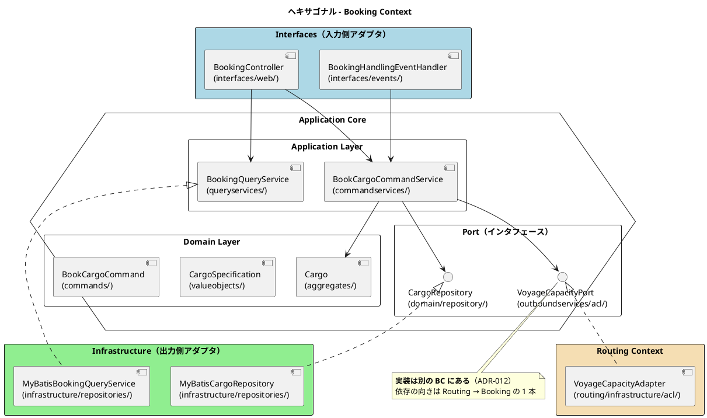

# 第 5 章：ヘキサゴナルの 4 層とポートの置き場所

| 項目 | 内容 |
| :--- | :--- |
| 観点 | アプリケーションアーキテクチャ |
| 一次資料 | `docs/design/architecture_backend.md`・ADR-004 / 012 / 022 / 024 |
| 主題 | BC の内側をどう積み、依存の向きを何で保証するのか |

## 4 層の責務

すべての BC が同じ 4 層を持ちます。

| レイヤー | パッケージ | 責務 | 依存方向 |
| :--- | :--- | :--- | :--- |
| **Domain** | `domain/model/{aggregates,entities,valueobjects,commands}/`・`domain/repository/` | ビジネスルール・不変条件・集約・値オブジェクト・出力ポート interface | 外部に依存しない |
| **Application** | `application/internal/{commandservices,queryservices,outboundservices/acl}/` | ユースケース実行・読み取り側の規則・BC 間 ACL の出力ポート定義 | Domain のみ |
| **Infrastructure** | `infrastructure/{repositories,acl,config}/` | 永続化（MyBatis）・BC 間 ACL アダプタ・BC 固有構成 | Application / Domain |
| **Interfaces** | `interfaces/{web,events}/` | 画面 Controller・イベントハンドラ | Application |

> 転記元：`docs/design/architecture_backend.md`「レイヤー責務一覧」（実装のパッケージに合わせて整理）



## ポートが 2 種類あることが、この構造の核心

図に 2 つのインタフェースが出てきます。**置き場所が違います。**

| ポートの種類 | 置き場所 | 実装の置き場所 | 例 |
| :--- | :--- | :--- | :--- |
| **リポジトリ**（技術との境界） | `domain/repository/` | 同じ BC の `infrastructure/repositories/` | `CargoRepository` |
| **ACL ポート**（他 BC との境界） | `application/internal/outboundservices/acl/` | **別の BC** の `infrastructure/acl/` | `VoyageCapacityPort` |

**リポジトリはドメイン層にあり、ACL ポートはアプリケーション層にあります。** 同じ「出力ポート」なのに層が違うのは、境界の相手が違うからです。

- リポジトリが隠すのは **永続化技術**です。集約は自分がどう保存されるかを知る必要がないので、ドメイン層にインタフェースが立ちます（ADR-024）
- ACL ポートが隠すのは **他の BC の業務モデル**です。これは技術ではなく業務の境界であり、**ドメイン層に置くと「他 BC が存在すること」がドメインの語彙に入ってしまいます**

だから ACL ポートはユースケースの都合（アプリケーション層）に置かれます。

### 実装が別 BC にある効果

```text
booking/application/internal/outboundservices/acl/VoyageCapacityPort.java   ← Booking が定義
routing/infrastructure/acl/VoyageCapacityAdapter.java                       ← Routing が実装
```

**Booking のコードのどこにも `routing` パッケージは現れません。** Booking は「航海の積載可能量を教えてくれる何か」を要求するだけで、それが Routing であることを知りません。

依存の矢印は `Routing → Booking` の 1 本だけです。Routing 側は Booking のポートを実装するために Booking のパッケージを import しますが、**それはインタフェース 1 個だけ**です。

**この配置は、どちらの BC が「相手の言葉に合わせるか」を決めています。** ポートを定義した側（Booking）の語彙が正で、実装する側（Routing）が翻訳します。ACL（腐敗防止層）が「防止」しているのは、**Routing の語彙が Booking に流れ込むこと**です。

## Domain 層に置いてはいけないもの

ArchUnit のルールは、ドメイン層への流入を 3 方向から止めています。

```java
    static final ArchRule ドメイン層はインフラ層に依存しない = ...
    static final ArchRule ドメイン層はSpringに依存しない = ...
    static final ArchRule ドメイン層はMyBatisに依存しない = ...
```

3 番目が単独で存在する理由が示唆的です。

```java
    /**
     * ADR-004: ドメイン層が MyBatis の型に依存しない。
     *
     * <p><strong>「ドメイン層はインフラ層に依存しない」だけでは足りない。</strong>
     * {@code org.apache.ibatis} は {@code ..infrastructure..} に含まれないため、
     * ドメインの集約に {@code @Results} や {@code @Param} を直接付けても、
     * 依存方向のルールは緑のまま通る。
     */
```

> 転記元：`apps/cargo-tracker/src/test/java/com/example/cargotracker/PackageStructureTest.java`

**「インフラ層に依存しない」というルールは、外部ライブラリを守備範囲に含みません。** `org.apache.ibatis` も `org.springframework` も自分たちのパッケージツリーの外にあるからです。層の名前で書いたルールには、**ライブラリという穴が開いています**。

この題材はその穴を、ライブラリのパッケージを名指しする 2 本のルールで塞いでいます。**層の構造を守るルールと、技術の混入を防ぐルールは別物**という認識です。

## Interfaces 層からリポジトリを見せない

CQRS の入口にあたる規則です。

```java
    /**
     * CQRS: {@code interfaces} 層がリポジトリを直接参照しない（IT1 ふりかえり Try T6）。
     *
     * <p>画面が必要とするのは「表示したい形のデータ」であり、集約ではない。
     * Controller がリポジトリを直接呼ぶと、集約を 1 件ずつ読んで画面で組み立てる
     * コードが自然に生まれ、**一覧を開くたびに N+1 のクエリが飛ぶ**。
     */
    @ArchTest
    static final ArchRule 画面層はリポジトリを直接参照しない =
            noClasses()
                    .that().resideInAPackage("..interfaces..")
                    .should().dependOnClassesThat().resideInAPackage("..domain.repository..")
                    .because("読み取りはクエリサービスを経由する（CQRS のクエリ側）");
```

**このルールの根拠が性能である**ことに注目してください。設計の美しさではなく、「一覧を開くたびに N+1 のクエリが飛ぶ」という具体的な失敗を防いでいます。

CQRS を採用する理由づけとして、これは強い形です。「読み書きを分離すべきだから」ではなく、**分離しないと何が起きるかを名指ししている**からです。第 8 章で読み取り側の実装を見ます。

## 共有領域は 3 つに分かれ、それぞれ別のルールで守られている

`shared` パッケージは共有カーネルだけではありません。3 つの領域を持ち、**それぞれ違うルールが効いています**。

| 領域 | 内容 | 守るルール |
| :--- | :--- | :--- |
| `shared.domain.model` | 共有カーネル（`Location`・`ShipperId`） | 名前が `Location` / `ShipperId` で始まるものだけ |
| `shared.domain.event` | BC 間で運ぶドメインイベント 9 種 | トップレベルは `record` かつ `〜Event`。ネストも `record` |
| `shared.application` | ページング・監査値・利用者文脈 | **完全修飾名で 6 クラスを列挙** |

### なぜ完全修飾名で列挙するのか

`shared.application` のルールがいちばん厳しく書かれています。

```java
    static final ArchRule 共有アプリケーション層はBC横断の約束のみ =
            classes()
                    .that().resideInAPackage("com.example.cargotracker.shared.application..")
                    .and().areNotAnnotatedWith(java.lang.annotation.Retention.class)
                    .should().haveFullyQualifiedName(
                            "com.example.cargotracker.shared.application.paging.Page")
                    .orShould().haveFullyQualifiedName(
                            "com.example.cargotracker.shared.application.paging.PageRequest")
                    ...
```

Javadoc が理由を書いています。

> **完全修飾名で並べる**（IT11 / C25）。単純名で照合していると、
> `shared.application.billing.Page` のような**許可された名前の別クラス**を作れば素通りできた。
> 名前は約束ではなく、置き場所が約束である。

**名簿方式の検査は、名簿の書き方まで攻撃対象になります。** 単純名で許可すると、同じ名前の別クラスを別パッケージに作れば通ってしまいます。

さらに深刻な理由も書かれています。

> ここは「全 BC のアプリケーション層から使えるもの置き場」に見えるため、共有カーネル以上に肥大化しやすい。
> ルール 4 が `..shared..` を依存先から除外しているため、**ここに何を置いても BC 間参照の検査を素通りする**。

**BC 間参照を禁じるルールが `shared` を除外していることが、`shared` を抜け道にします。** 共有領域は「例外として許可された場所」であり、**例外の中身を別のルールで縛らないと、例外が本体を侵食します**。

この題材は、`shared` の 3 領域すべてに個別のルールを立てることでそれを防いでいます。**共有カーネルを持つなら、その中身を検査する仕組みまでが一体である**——第 10 章に繋がる観察です。

## Application 層の内部分割

`application/internal/` の下は 3 つに分かれます。

| ディレクトリ | 役割 | 依存 |
| :--- | :--- | :--- |
| `commandservices/` | ユースケースの実行（状態を変える） | 集約・リポジトリ・ACL ポート |
| `queryservices/` | 読み取り側のインタフェースとビュー（CQRS） | なし（インタフェースと record のみ） |
| `outboundservices/acl/` | 他 BC への出力ポート定義 | なし（インタフェースのみ） |

Booking の `commandservices` には 14 本のコマンドサービスがあります（`BookCargoCommandService`・`ConfirmBookingCommandService`・`CancelBookingCommandService`・`IssueTrackingNumberCommandService` ほか）。

**1 ユースケース = 1 クラスです。** 「BookingService」のような包括的なサービスを置かず、業務の操作ごとに分けています。効果は 2 つあります。

- **依存が最小になる。** 追跡番号を発行するサービスだけが `TrackingPort` を注入します。予約を登録するサービスは Tracking を知りません
- **ユースケースの一覧がパッケージのファイル一覧になる。** システムが何をできるかが、ディレクトリを開けば分かります

### 読み取り側の「規則」はどこに置くか（ADR-022）

`queryservices/` に置かれるのは **インタフェースとビュー（record）だけ**で、実装はインフラ層にあります。

```text
booking/application/internal/queryservices/
├── BookingQueryService.java      インタフェース
├── BookingView.java              画面表示用の record
├── BookingSearchCriteria.java    検索条件
├── DeadlineUrgency.java          期限の切迫度（規則）
└── CancellationQueryService.java

booking/infrastructure/repositories/
├── MyBatisBookingQueryService.java   実装
├── BookingQueryMapper.java           MyBatis マッパー
└── BookingQueryRow.java              SQL の行
```

**`DeadlineUrgency`（期限の切迫度）がアプリケーション層にあることが ADR-022 の主張です。**

> 読み取り側の「規則」は application 層に置き、「問い合わせ」は infrastructure に残す

「期限まで 3 日以内なら警告色」という判断は業務の規則であり、SQL の都合ではありません。SQL に `CASE WHEN` で書くと、**同じ規則が画面ごとのクエリに散ります**。

この配置は `ReadSideRuleLocationTest` という専用のテストが検査しています。

## ADR-024 — ドメインモデルを構成要素ごとに分ける

`domain/model/` の下は 4 つに分かれています。

```text
domain/model/
├── aggregates/     集約ルート
├── entities/       集約の内側で同一性を持つもの
├── valueobjects/   値オブジェクト・列挙・識別子
└── commands/       業務の要求をまとめた型（該当が無ければ作らない）
```

**「該当が無ければ作らない」が明記されています。** 実際、Billing には `entities/` がありません。`Invoice` と `Reminder` はどちらも集約ルートであり、集約の内側で同一性を持つものが無いためです。

**空のディレクトリを規約で強制しない**という判断です。パッケージ構成を「型」として押しつけると、中身の無いディレクトリが並び、**構成が業務の実態を語らなくなります**。

## この章の要点

| 観察 | 内容 |
| :--- | :--- |
| ポートは 2 種類 | リポジトリは Domain（技術の境界）、ACL ポートは Application（業務の境界） |
| ACL の実装は別 BC | ポートを定義した側の語彙が正。実装する側が翻訳する |
| 層のルールには穴がある | 「インフラ層に依存しない」は外部ライブラリを守らない。**ライブラリを名指しする別ルールが要る** |
| 画面 → リポジトリ禁止 | 根拠が設計の美しさではなく **N+1 という具体的な失敗** |
| `shared` は 3 領域 | BC 間参照の検査が `shared` を除外する以上、**例外の中身を別のルールで縛る** |
| 名簿は完全修飾名で | 単純名の許可は、同名の別クラスで素通りできる |
| 1 ユースケース 1 クラス | 依存が最小になり、**ディレクトリがシステムの機能一覧になる** |

次章では、BC 同士がどう繋がるか——ACL 27 ポートとドメインイベント 9 種の使い分けを見ます。
