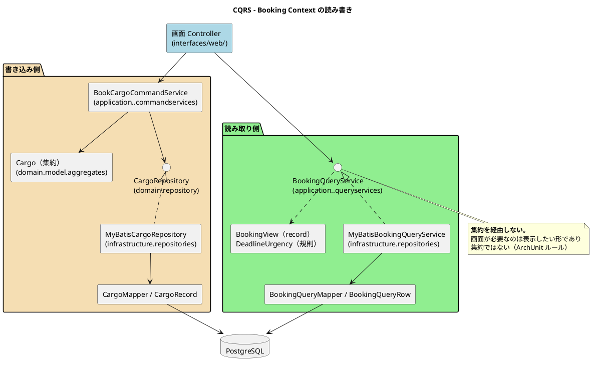

# 第 8 章：CQRS の読み書き分離とスキーマの進化

| 項目 | 内容 |
| :--- | :--- |
| 観点 | データアーキテクチャ |
| 一次資料 | `docs/design/data-model.md`・ADR-003 / 004 / 022 |
| 主題 | 書き込みと読み取りを分けると、何が別々になるのか |

## 読み書きで通る道が違う



**書き込み側と読み取り側が、DB の手前まで完全に別の道です。** 共有しているのはテーブルだけです。

| | 書き込み側 | 読み取り側 |
| :--- | :--- | :--- |
| 入口 | `〜CommandService` | `〜QueryService` |
| ドメイン | 集約を経由する | **経由しない** |
| ポート | `domain/repository/` | `application/internal/queryservices/` |
| 実装 | `MyBatis〜Repository` | `MyBatis〜QueryService` |
| MyBatis マッパー | `CargoMapper` | `BookingQueryMapper` |
| 行の型 | `CargoRecord` | `BookingQueryRow` |
| 返す型 | 集約（`Cargo`） | ビュー（`BookingView`） |

**マッパーも行の型も別々です。** 同じテーブルを読むのに 2 つのマッパーがあります。

これは重複に見えますが、**変更の理由が違います**。`CargoMapper` は集約の構造が変わったときに変わり、`BookingQueryMapper` は画面の表示内容が変わったときに変わります。**1 つにまとめると、画面の都合で集約のロードが変わります。**

## MyBatis を選んだ理由（ADR-004）

> 永続化に MyBatis を採用し JPA / Hibernate を採用しない

`tech_stack.md` は理由をこう書いています。

> XML マッパーによる SQL の明示的管理、**CQRS の Read Model クエリ最適化との親和性**

**CQRS と ORM は相性が悪い**という判断です。ORM はオブジェクトグラフのロードを自動化しますが、読み取り側が欲しいのはオブジェクトグラフではなく**表示に最適化した 1 行**です。

`BookingView` の Javadoc がその実際を語ります。

```java
/**
 * 貨物予約の画面表示用データ（CQRS のクエリ側）。
 *
 * <p>荷主名は {@code shipper} テーブルを JOIN して 1 回の SQL で取る。
 * **予約 1 件ごとに荷主を引き直すと、一覧を開くたびに N+1 のクエリが飛ぶ。**
 * これは BC 間の直接参照ではない。読み取り側の SQL であり、Booking の
 * ドメインモデルは Shipper のモデルを知らないままである。
 */
```

> 転記元：`booking/application/internal/queryservices/BookingView.java`

### 読み取り側の JOIN は BC 分離を破らないのか

**破ります。厳密には。** `booking` の読み取り SQL が `shipper` テーブルを JOIN しており、第 7 章の所有の規則からすると越境です。

Javadoc の主張は「ドメインモデルは知らないままである」——つまり **Java の型としての結合は生じていない**というものです。`BookingView.ShipperSummary` は Booking が定義した record であり、Shipper の `Shipper` 集約とは無関係です。

**この扱いは、ADR-015 の `MapperTableOwnershipTest.ALLOWED` に理由とともに記載する形で例外として認められています。** 「黙って通す」のではなく、**越境していることを名前で残す**という第 6 章・第 7 章と同じ扱いです。

**トレードオフを認識した上で越境しているか、認識せずに越境しているか**が分かれ目です。ここでは前者であることが Javadoc と名簿の両方に残っています。

## 読み取り側にも「規則」がある（ADR-022）

読み取り側は「ただのデータ取得」ではありません。**規則が入ります。**

```java
booking/application/internal/queryservices/
├── BookingQueryService.java      インタフェース（どの一覧を引けるか）
├── BookingView.java              表示用の record（何を見せるか）
├── BookingSearchCriteria.java    検索条件
└── DeadlineUrgency.java          期限の切迫度（規則）
```

ADR-022 の決定はこうです。

> 読み取り側の「規則」は application 層に置き、「問い合わせ」は infrastructure に残す

**「期限まで何日なら警告か」は業務の規則です。** SQL の `CASE WHEN` に書くと、同じ規則が画面ごとのクエリに散ります。テンプレートに書くと、画面の数だけ散ります。

`ReadSideRuleLocationTest` が配置を検査します。

`BookingView` は述語も持ちます。

> **述語は残す。** `isRouted()` のような判断をテンプレートに書き下すと、同じ規則が画面の数だけ散る。

**ビューは「データの入れ物」ではなく、「表示のための判断を持つ型」です。** 一方で、単に入れ子を辿るだけの委譲アクセサは削られています。

> **委譲するアクセサは畳んだ。** テンプレートは `booking.delivery().origin()` のように入れ子をそのまま辿る。
> 分割の効能は入れ子側で完結しており、**委譲の層はテンプレート互換のためだけに存在していた**。

**判断を持つメソッドは残し、転送するだけのメソッドは消す**という基準です。

### 引数の取り違えを型で防ぐ

`BookingView` はもう 1 つ、記録に値する変遷を持っています。

> **意味のまとまりごとに入れ子へ分けている。** 以前は 34 個の要素が一列に並んでおり、
> **同じ型の引数を取り違えてもコンパイルが通った**。`shipperName` と `shipperEmail`、
> `origin` と `destination` のように、隣り合う同型の引数は入れ替えても何も起きない。

`record` の要素を 34 個並べると、**すべて `String` の引数が延々と続きます**。取り違えてもコンパイラは何も言いません。

いまの形は 7 要素で、それぞれが入れ子の record です。

```java
public record BookingView(
        String bookingId,
        ShipperSummary shipper,
        CargoSpec cargo,
        Delivery delivery,
        Status status,
        Tracking tracking,
        Actions actions) {
```

**入れ子にすると、`ShipperSummary` の位置に `Delivery` を渡せなくなります。** 型が違うからです。**構造を分けることが、そのまま型の検査になっています。**

これは読み取り側特有の問題です。書き込み側は集約が引数を受け取るので、集約のコンストラクタで検証できます。読み取り側は集約を経由しないため、**型の構造だけが唯一の防御**になります。

## 書き込み側 — 楽観的ロックを `boolean` で返す

リポジトリの契約が特徴的です。

```java
public interface CargoRepository {

    /** 新規登録する。 */
    void save(Cargo cargo);

    /**
     * 更新する。
     *
     * <p>楽観的ロックにより、読み取り時から version が変わっていれば更新しない。
     *
     * @return 更新できたなら {@code true}。他の更新が先行していたなら {@code false}
     */
    @CheckReturnValue
    boolean update(Cargo cargo);
```

> 転記元：`booking/domain/repository/CargoRepository.java`

**例外ではなく `boolean` を返します。** そして `@CheckReturnValue` が付いています。理由は Javadoc にあります。

> **楽観的ロックの結果を返すメソッドには `@CheckReturnValue` を付ける。**
> IT6 では戻り値 `boolean` で衝突を知らせる 3 か所で結果を捨てており、
> 衝突すると荷役だけが記録されて追跡も誤配も黙って落ちていた。

**戻り値で失敗を伝える設計は、呼び出し側が無視できます。** 例外なら無視できませんが、`boolean` は捨てられます。

対策として選ばれたのが**静的解析への委譲**です。

> IT5 の Try「例外を投げる経路を `grep` で数える」は例外については守れていたが、
> **戻り値で結果を返す安全装置には同じ数え方が適用されていなかった**。
> **規律はあったが適用範囲が狭かった。**
> 人が毎回 `grep` する運用に戻さず、SpotBugs に数えさせる。

**「人が毎回 grep する運用に戻さず」**——第 10 章の主題そのものです。規律を人の手順に置くと、適用範囲が狭いことに気づけません。ツールに数えさせれば、適用漏れが赤になります。

第 6 章の ADR-021（`BookingSettlementPort.settle` の戻り値が捨てられていた）と同じ失敗が、**BC 内のリポジトリでも起きていた**ことになります。同じ形の欠陥が 2 か所で発生し、片方はアノテーション、もう片方は名簿で対処されました。

## Flyway — 46 本のマイグレーション

```text
db/migration/
├── common/       V1〜V41（41 本）— H2 と PostgreSQL の両方で実行
├── postgresql/   V101〜V104（4 本）— PostgreSQL のみ
├── h2/           V103（1 本）— H2 のみ
├── seed/         V800・V801 — 動作確認用の利用者（local / dev / test）
└── demo/         V900〜V905 — 動作確認用の業務データ（local / dev）
```

適用先はプロファイルで切り替わります。

```yaml
  flyway:
    enabled: true
    locations: classpath:db/migration/common,classpath:db/migration/{vendor}
```

> 転記元：`apps/cargo-tracker/src/main/resources/application.yml`

そして設定ファイルのコメントが重要な判断を書いています。

> **本番の locations に seed / demo を含めない。** コメントで「本番では適用しない」と
> 書いても、common に置いた時点で全環境に適用される。**配置で守る。**

**「配置で守る」**——コメントによる約束ではなく、ディレクトリを分けて設定で選ぶ形にしています。この考え方は本シリーズを通じて繰り返し現れます。

### V1 の 20 テーブルから 25 テーブルへ

初期スキーマ（`V1__init.sql`）が 20 テーブルを作り、以降 40 本のマイグレーションで 5 テーブルが追加され、多数の `ALTER` が積まれました。

追加されたテーブルを見ると、**業務の例外側が後から生えている**ことが分かります。

| 追加テーブル | マイグレーション | 追加の理由 |
| :--- | :--- | :--- |
| `customs_status_history` | V24 | 通関状態の変更履歴（US29） |
| `handling_correction` | V27 | 引取記録の訂正・取り消し申請（US36） |
| `invoice_reminder` | V37 | 督促の記録（ADR-017） |
| `booking_cancellation` | V38 | 予約キャンセルの申請（US30） |
| `route_candidate` | （Estimation 追加時） | 見積のルート候補（US01） |

**「履歴」「訂正」「督促」「申請」——第 4 章で見た『後から生えた集約』と同じ顔ぶれです。** 業務の主経路は最初に見えていて、**例外経路と承認経路が後から出てくる**というパターンです。

### 既存マイグレーションを編集しない

ルールは 6 つです。

- バージョン番号は連番とし、欠番を作らない
- **既存マイグレーションファイルの編集は禁止**（Flyway チェックサム検証）
- ロールバックは Undo ではなく **Forward マイグレーション + Expand-Contract パターン**（Undo は Flyway Community Edition では実行できない）
- `common/` の DDL は **H2 と PostgreSQL の両方で動く構文に限る**（ADR-003）
- PostgreSQL 固有の構文は `postgresql/` に隔離する
- **`h2/` は原則として空にする。** ここにテーブル定義が増え始めたら、共通部分が分岐している兆候であり設計を見直す合図

**最後のルールが優れています。** `h2/` の中身の量が、環境差の健全性を測る指標になっています。ディレクトリのファイル数が設計の警報になる形です。

実際に `h2/` には 1 本だけ例外が入っています。

> **例外は「名前の付き方」の違いである**（ADR-020）。名前を付けずに書いた制約は DBMS が自動で命名するため
> （PostgreSQL は `invoice_booking_id_key`、H2 は `CONSTRAINT_74D6` のような通し番号）、
> **それを落とす DDL だけは共通に書けない**。この場合でもスキーマは分岐しておらず、両者は同じ結果に着地する。
> **制約には最初から名前を付ける**のが再発防止である。

**例外を許すだけでなく、なぜ例外なのか・どうすれば起きなかったかまで書いています。**

### マイグレーションが業務判断を語る

マイグレーション SQL のコメントが、単なる技術メモではなく業務の判断を書いています。

```sql
-- 請求書に種別を持たせる（US30。ADR-020）。
--
-- V1 は `booking_id UUID NOT NULL UNIQUE` に「UNIQUE 制約で二重請求を防止する」と
-- 書いた。**その判断は正しかったが、想定していた請求書は 1 種類だけだった。**
--
-- US30 でキャンセル料の請求書が生まれる。輸送料金の請求書が既にある予約には
-- **2 枚目が入らない** — 輸送中の貨物をキャンセルした荷主に、キャンセル料を
-- 請求する手段がシステムに無い。
--
-- **二重請求の防止は捨てない。** 防ぐ対象を「予約ごとに 1 枚」から
-- 「予約と種別の組ごとに 1 枚」へ狭める。
--
-- **既存の行はすべて輸送料金である**（キャンセル料はまだ存在しない）。
-- 既定値で埋めることで、列が無かったころの行も読める。
ALTER TABLE invoice
    ADD COLUMN invoice_type VARCHAR(20) NOT NULL DEFAULT 'TRANSPORT';

ALTER TABLE invoice
    ADD CONSTRAINT chk_invoice_type
        CHECK (invoice_type IN ('TRANSPORT', 'CANCELLATION'));

-- **口約束にしない**。種別ごとの二重請求は、ここが防ぐ。
ALTER TABLE invoice
    ADD CONSTRAINT uq_invoice_booking_type UNIQUE (booking_id, invoice_type);
```

> 転記元：`apps/cargo-tracker/src/main/resources/db/migration/common/V36__invoice_type.sql`

**3 つのことをやっています。**

1. **前の判断を否定せず、範囲を狭める。** 「二重請求の防止は捨てない。防ぐ対象を狭める」
2. **既存行の扱いを明示する。** 「既定値で埋めることで、列が無かったころの行も読める」
3. **制約をアプリケーションに任せない。** 「口約束にしない。種別ごとの二重請求は、ここが防ぐ」

**2 番目は不変条件を後から追加するときの一般則です。** 列が無かった頃の行は、新しい不変条件を満たしません。既定値で埋められるなら埋め、埋められないなら**復元時には検査せず新規受け入れ時だけ検査する**という選択になります。

## この章の要点

| 観察 | 内容 |
| :--- | :--- |
| 読み書きは DB の手前まで別の道 | マッパーも行の型も別。**変更の理由が違うから分ける** |
| MyBatis を選んだ理由 | ORM が自動化するオブジェクトグラフは、読み取り側が欲しい形ではない |
| 読み取り側の JOIN | 越境だが**認識した上で名簿に理由とともに残している** |
| 読み取り側にも規則がある | 切迫度・述語は application 層。SQL やテンプレートに書くと散る（ADR-022） |
| ビューの入れ子 | **構造を分けることが型の検査になる。** 34 要素の一列は取り違えが通る |
| `boolean` の戻り値 | 捨てられる。人の `grep` ではなく **SpotBugs に数えさせる** |
| Flyway の配置 | 「本番では適用しない」をコメントではなく **配置で守る** |
| `h2/` のファイル数 | **環境差の健全性を測る指標。** 増え始めたら共通部分が分岐している |
| マイグレーションのコメント | 前の判断を否定せず範囲を狭め、既存行の扱いを書き、**制約を DB に置く** |

次章からテクノロジーアーキテクチャです。この構造が何の上で動いているかを見ます。
