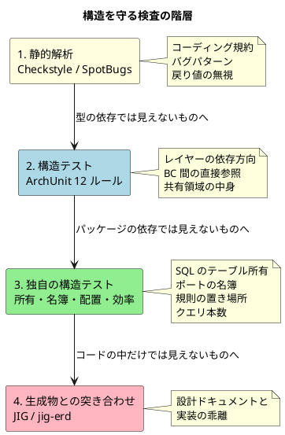

# 第 10 章：アーキテクチャを検査に落とす

| 項目 | 内容 |
| :--- | :--- |
| 観点 | テクノロジーアーキテクチャ（アプリケーション／データ観点への逆流） |
| 一次資料 | `build.gradle`・`src/test/java/`・`docs/design/test_strategy.md` |
| 主題 | 決めた構造を、何が守り続けるのか |

## この章の主張

第 1 章の図で、テクノロジー層からアプリケーション層へ **逆向きの矢印**を引きました。本章がその中身です。

> **アーキテクチャの規則は、検査に落とさなければ守られない。**

本シリーズがここまでに扱った規則を並べます。

| 規則 | 出典 | 落とし先 |
| :--- | :--- | :--- |
| トップレベルパッケージ = BC | ADR-010 | ArchUnit |
| 共有カーネルは 2 要素のみ | ADR-005 | ArchUnit |
| ドメイン層は MyBatis に依存しない | ADR-004 | ArchUnit |
| 画面層はリポジトリを直接参照しない | CQRS | ArchUnit |
| テーブルには所有 BC がある | ADR-015 | `MapperTableOwnershipTest` |
| 状態を変える同期ポートは失敗の届け先を持つ | ADR-021 | `CrossContextPortPolicyTest` |
| 読み取り側の規則は application 層 | ADR-022 | `ReadSideRuleLocationTest` |
| JPA を本番に持ち込まない | ADR-004 | `verifyProductionDependencies` |
| H2 は本番成果物に含めない | ADR-003 | `verifyProductionDependencies` |
| イベント購読は `AFTER_COMMIT` | ADR-009 | `EventualConsistencyListenerPhaseTest` |
| 楽観的ロックの戻り値を捨てない | データモデル判断 8 | SpotBugs ＋ `@CheckReturnValue` |

**ほぼすべての ADR に、対応する検査があります。** これがこの題材の最大の特徴です。

## 検査の 4 層



**下の層ほど、扱う対象が「コードの外」に近づきます。**

## 第 1 層：静的解析

| ツール | バージョン | 設定 |
| :--- | :--- | :--- |
| Checkstyle | 13.9.0 | `maxWarnings 0`（警告ゼロを強制） |
| SpotBugs | 4.10.3 | `effort MAX` / `reportLevel LOW`（最も厳しい設定） |
| JaCoCo | 0.8.15 | 全体 LINE 0.75 / BRANCH 0.65 ＋ レイヤ別 |

**SpotBugs の設定が最も厳しい水準**（effort MAX・confidence LOW）である点に注目してください。第 8 章で見た `@CheckReturnValue` による戻り値の検査は、この設定でこそ機能します。

### レイヤ別カバレッジ — 目標値をそのまま閾値にしない

`build.gradle` のコメントが、この題材で最も実務的な判断の 1 つを書いています。

```groovy
// 閾値は実測に追随させる（§6.3 の引き上げ手順）。**目標値をそのまま閾値にしない。**
// 届いていない目標を閾値にすると、閾値を満たすためのテストを書くことになる。
// 現在値と目標（§6.1）の差は下表のとおりで、差が埋まった時点で引き上げる。
//
//   レイヤー         行（実測 / 閾値 / 目標）   分岐（実測 / 閾値 / 目標）
//   domain           89.0 / 85 / 85            74.9 / 70 / 80   ← 分岐が目標に未達
//   application      91.3 / 85 / 80            64.1 / 60 / 75   ← 分岐が目標に未達
//   interfaces       92.3 / 85 / 70            67.5 / 60 / —
//   infrastructure   97.6 / 90 / 75            81.6 / 75 / —

def coverageLayers = [
        domain        : [pattern: '**/domain/**', line: 0.85, branch: 0.70],
        application   : [pattern: '**/application/**', line: 0.85, branch: 0.60],
        interfaces    : [pattern: '**/interfaces/**', line: 0.85, branch: 0.60],
        infrastructure: [pattern: '**/infrastructure/**', line: 0.90, branch: 0.75],
]
```

> 転記元：`apps/cargo-tracker/build.gradle`

**「届いていない目標を閾値にすると、閾値を満たすためのテストを書くことになる」**——カバレッジ目標を運用する際の核心です。

閾値は**実測をわずかに下回る値**に置かれています。これは「これ以上下げない」ためのラチェットであり、「ここまで上げよ」という目標ではありません。**目標との差は表としてコメントに残り、埋まったら閾値を上げます。**

さらに `element = 'PACKAGE'` を使わない理由も書かれています。

> パッケージ 1 つずつに閾値を課すと、**列挙型 1 個だけのパッケージが分岐 0 件で落ちる**など、
> レイヤーの健全性と関係のない理由で赤になる。

**検査の粒度が細かすぎると、意味のない赤が出ます。** 意味のない赤は「例外設定」を誘発し、例外設定が増えると検査全体が信用されなくなります。レイヤー単位の合計で判定するのは、その回避です。

## 第 2 層：ArchUnit 12 ルール

| # | ルール | 守る対象 |
| :--- | :--- | :--- |
| 1 | すべてのクラスは BC 集合のいずれかに属する | 検査の前提そのもの |
| 2 | ドメイン層はインフラ層に依存しない | レイヤーの依存方向 |
| 3 | ドメイン層は Spring に依存しない | ドメインの POJO 性 |
| 4 | ドメイン層は MyBatis に依存しない | ADR-004 |
| 5 | アプリケーション層はインフラ層に依存しない | DIP |
| 6 | 共有カーネルは `Location` と `ShipperId` のみ | ADR-005 |
| 7 | 共有アプリケーション層は BC 横断の約束のみ | ADR-005 |
| 8 | 共有イベントは事実を運ぶレコードのみ | ADR-005 / 009 |
| 9 | 共有イベントのネストした型もレコード | 不変性 |
| 10 | 画面層はリポジトリを直接参照しない | CQRS |
| 11 | コンテキスト間でクラスを直接参照しない | BC 分離 |
| 12 | ドメイン層とアプリケーション層は BC をまたがない | ADR-012 |

（ほかに `EntityEncapsulationTest` が集約のカプセル化を検査します）

### `allowEmptyShould(true)` を使わない

```java
 * <p>{@code allowEmptyShould(true)} は使わない。**何も検査していないルールを緑にすると、
 * 実装が入った後も検査されていないことに気づけなくなる。**
```

> 転記元：`PackageStructureTest.java`

**第 9 章の「緑だが何も検査していない」がここにも出てきます。** 対象クラスが 0 件のとき、ArchUnit は既定で失敗します。それを許可する設定を入れると、**対象が生まれた後も緑のまま**になります。

### すべてのルールが「破って赤になること」を確認済み

```java
 * <p><strong>各ルールは違反を作って赤になることを確認済みである</strong>（ADR-005 の
 * コンプライアンス欄が定める手続き）。ADR-012 のルールは IT8 のレビューで、
 * 他 BC の ACL ポートを注入するとルール 4 は緑のまま**本ルールだけが赤**になることを
 * 実装者以外が確かめている。
```

**「破って赤になる」ことの確認が手続きとして定められています。** 検査を書いただけでは、それが働くかは分かりません。テストのテストが要ります。

そして **「実装者以外が確かめる」**という点も明記されています。検査を書いた本人は、自分が想定した違反しか作れません。

### 除外の書き方が攻撃対象になる

ルール 11（BC 間の直接参照禁止）のコメントが、除外設定の危険を 3 つ書いています。

```java
                    // ignoreDependency の引数は (依存元, 依存先)。**向きを逆にすると
                    // 「shared から他 BC への依存」を無視することになり、狙いと反対に働く**
                    .ignoreDependency(alwaysTrue(), resideInAPackage("..shared.."))
                    ...
                    // **除外するのはポートのパッケージだけである。** 集約や値オブジェクトへの
                    // 直接参照（booking → shipper.domain.model.Shipper 等）は引き続き落ちる。
                    // ここを "..shipper.." のように BC 単位で緩めると、ACL を通す動機が消える。
                    .ignoreDependency(alwaysTrue(), resideInAPackage("..outboundservices.acl.."))
```

**「BC 単位で緩めると、ACL を通す動機が消える」**——除外を必要以上に広く書くと、検査は緑のまま設計が崩れます。除外はパッケージ単位で最小に切るのが原則です。

**除外の引数の向きを間違えると、検査が真逆に働く**という指摘も重要です。除外設定そのものが、レビューすべき設計判断になっています。

## 第 3 層：独自の構造テスト

ArchUnit は Java の型の依存しか見ません。**見えないものを見るテストが 20 本以上あります。**

| テスト | 検査対象 | 見ているもの |
| :--- | :--- | :--- |
| `MapperTableOwnershipTest` | ADR-015 | **SQL のテーブル名**（Java の依存では見えない） |
| `CrossContextPortPolicyTest` | ADR-021 | ポートの名簿と実装の一致 |
| `ReadSideRuleLocationTest` | ADR-022 | 読み取り側の規則の置き場所 |
| `DashboardCardTargetTest` | ADR-014 | ダッシュボードのカードが遷移先を持つか |
| `MigrationLocationsTest` | ADR-003 | マイグレーションの配置 |
| `DataModelDocumentSchemaTest` | — | **設計文書とスキーマの一致** |
| `AdrGuardScopeTest` | — | ADR の検査が実在するか |
| `EventualConsistencyPropagationTest` | ADR-009 | イベントが実際に伝播するか |
| `EventualConsistencyListenerPhaseTest` | ADR-009 | 購読が `AFTER_COMMIT` か |
| `H2DialectSmokeTest` / `H2DialectCoverageTest` | ADR-003 | 全クエリが H2 でも解釈できるか |
| `ListQueryEfficiencyTest` / `ListQueryMeasurementTest` | CQRS | **クエリの発行本数**（N+1 の検出） |
| `RecordComponentCountTest` | — | record の要素数（34 要素の再発防止） |
| `PackageInfoPresenceTest` | — | `package-info.java` の存在 |
| `NarrowParseCatchTest` | — | `catch` の範囲が解析だけに絞られているか |
| `DelegatingAccessorRatchetTest` | — | 委譲アクセサの数（負債のラチェット） |
| `SelfLinkResolvesTest` | — | ドキュメント内リンクの解決 |
| `WideTableReadabilityTest` | — | 幅の広いテーブルの可読性 |
| `PersistenceMarkerCallerTest` | — | 永続化マーカーの呼び出し元 |
| `CheckMessageOriginTest` | — | 検証メッセージの出所 |
| `SourceScanTest` | — | ソーススキャナ自身の検査 |

**`SourceScan` という自作のソーススキャナ**があり、それ自体のテストもあります。バイトコードでは見えないもの（コメント・catch の範囲・アクセサの形）を、ソースコードのテキストとして検査しています。

### `DelegatingAccessorRatchetTest` — 負債を凍結する

**返済しないと決めた負債を、増えないように固定する**テストです。

第 8 章で見た「委譲アクセサは畳んだ」という判断の前段階で、委譲アクセサが 249 個ありました。すべてを一度に消すのは大きすぎるため、**現在数を上限として固定**し、増えたら赤にしています。

**ラチェット（逆回転しない歯車）方式**です。負債を認め、悪化だけを止める形です。「後で直す」と書くだけでは増え続けます。

### `AdrGuardScopeTest` — 検査があることを検査する

**ADR が「この規則を検査で守る」と書いたなら、その検査が実在することを検査します。**

ADR に「コンプライアンス」欄を書く運用（第 7 章で見た楽観的ロックの例）と対になっています。**書いただけの約束を検出する仕組み**です。

## 第 4 層：生成物との突き合わせ

**コードの中だけでは、設計ドキュメントとの乖離は見つかりません。**

| ツール | バージョン | 生成するもの |
| :--- | :--- | :--- |
| JIG | 2026.7.4 | バイトコードからドメインモデル図・パッケージ関連図・業務機能一覧 |
| jig-erd | 0.2.2 | Flyway が構築した実スキーマから ER 図 |
| Graphviz | 12.x 以降 | 上記の描画 |

`tech_stack.md` の理由づけが本章の主題そのものです。

> **設計書の図を手で更新し続ける運用は必ず破綻するため、
> 乖離を人間の注意力ではなく生成物の差分で検出する。**

そして生成物の扱いにも規律があります。

> **生成物はコミットしない。** `build/jig/` と `build/jig-erd/` は Git 管理外とする。
> 生成物をコミットすると「**コードを変えたのに図が古い**」状態がリポジトリに固定されるため、
> 必要なときに生成する運用とする。

### 生成物は正典ではない

jig-erd の位置づけが明確に限定されています。

> **jig-erd は関連に着目した「ざっくりした」ER 図である。** PK・データ型・制約は扱わないため、
> それらの正典は `data-model.md` のままである。jig-erd で確認するのは**テーブルと外部キーの
> 関係が設計どおりか**であり、カラム定義の詳細ではない。

**生成物が正典を置き換えるわけではありません。** 生成できるのは構造だけで、「なぜその構造か」は生成できません。**生成物の役割は、正典と実装がずれたことを教えることです。**

第 7 章の `route_candidate` 誤りは、**正典と検査が同じ誤りを共有していた**ために突合では見つかりませんでした。ER 図とテーブル定義は正しかったのに、所有の表だけが誤っていた——**複数の系統から生成された情報を突き合わせることの意味**がここにあります。

## `verifyProductionDependencies` — ADR を依存で守る

```groovy
tasks.register('verifyProductionDependencies') {
    group = 'verification'
    description = '本番の実行クラスパスに、採用しないと宣言した依存が無いことを検証する'

    // ADR で明示的に排除した依存。キーは依存の座標の一部、値は根拠。
    def forbidden = [
            'com.h2database'            : 'ADR-003: H2 はローカル起動のみ。本番の成果物に含めない',
            'wiremock'                  : 'ADR-006: 外部連携が無いため WireMock は採用しない',
            'spring-cloud-contract'     : 'ADR-006: 契約テストの対象が存在しない',
            // ORM のみを対象とする。hibernate-validator は Bean Validation の実装であり
            // ADR-004 の対象外である（org.hibernate で一括除外すると誤検知する）。
            'org.hibernate.orm'         : 'ADR-004: 永続化は MyBatis。JPA / Hibernate は採用しない',
            'jakarta.persistence'       : 'ADR-004: JPA の API を本番に持ち込まない',
    ]
    // ADR-003 は開発環境向けに `-PincludeH2=true` での opt-in を認めている。
    // **認めた抜け道を検証が知らないと、正当な手順がビルドを落とす。**
    // 逆に、opt-in していないのに H2 が入っていれば落ちる。
    if (project.hasProperty('includeH2')) {
        forbidden.remove('com.h2database')
    }
```

> 転記元：`apps/cargo-tracker/build.gradle`

**3 つの設計が読み取れます。**

**（1）禁止の理由が値として書かれている。** 違反時のメッセージに ADR 番号が出ます。**検査が赤になったとき、なぜダメなのかがその場で分かります。**

**（2）除外の粒度が慎重。** `org.hibernate` で一括除外すると `hibernate-validator`（Bean Validation の実装で、ADR-004 の対象外）まで巻き込みます。`org.hibernate.orm` に絞っています。

**（3）認めた抜け道を検査が知っている。** ADR-003 が認めた `-PincludeH2=true` を検査が理解します。コメントが理由を書いています——**「認めた抜け道を検証が知らないと、正当な手順がビルドを落とす」**。

**検査が正当な手順を妨げると、検査そのものが外されます。** 例外を認めるなら、検査が例外を知っている必要があります。

## この章の要点

| 観察 | 内容 |
| :--- | :--- |
| ほぼ全 ADR に検査がある | 決めた規則を、**人の注意力ではなくビルドが守る** |
| 検査は 4 層 | 静的解析 → ArchUnit → 独自テスト → 生成物との突き合わせ |
| 目標値を閾値にしない | **届いていない目標を閾値にすると、閾値を満たすためのテストを書くことになる** |
| 検査の粒度 | 細かすぎると意味のない赤が出て、例外設定が検査全体の信用を壊す |
| `allowEmptyShould` | 対象 0 件を緑にすると、**対象が生まれた後も緑のまま** |
| 破って赤になる確認 | 検査を書いただけでは働くか分からない。**実装者以外が確かめる** |
| 除外の書き方 | 広すぎる除外は検査を無力化する。**除外そのものがレビュー対象** |
| ラチェット | 返済しない負債は**増えないように凍結する** |
| 生成物は正典ではない | 生成できるのは構造だけ。**役割は「ずれたことを教える」こと** |
| 抜け道を検査が知る | **検査が正当な手順を妨げると、検査が外される** |

次章で、4 観点を貫通させたときに何が繋がり、何が切れたかを総括します。
