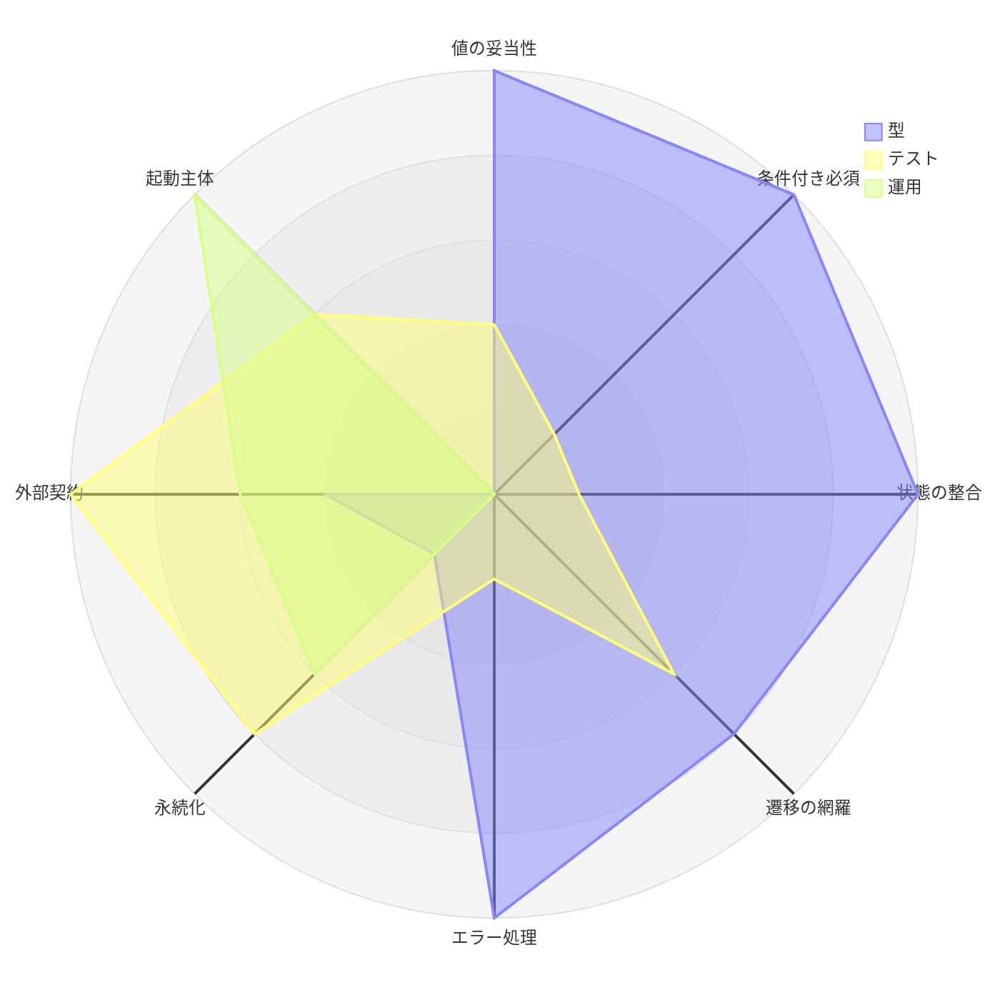
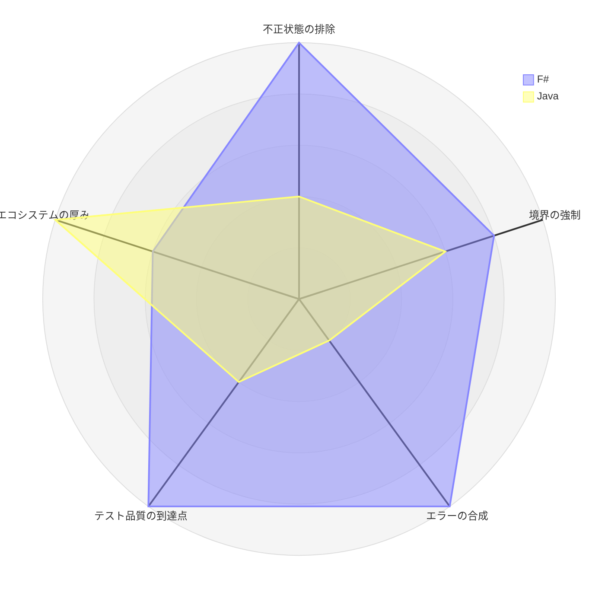

# 第 10 章：型で守れたもの・守れなかったもの

## この章の狙い

8 イテレーションを終えた時点で、関数型ドメインモデリングが**何を解決し、何を解決しなかったか**を整理します。

## 型で守れたもの

### 1. 値の妥当性

単一ケース DU + スマートコンストラクタにより、値が存在する時点で検証済みであることが保証されました。

```fsharp
type Location = private Location of string
type Weight = private Weight of decimal
type DiscountRate = private DiscountRate of decimal
```

効用は 2 つあります。

- **再検査が不要** — ドメイン層でもインフラ層でも、値の妥当性を疑う必要がない
- **取り違えが起きない** — `BookingId` と `TrackingNumber` はどちらも中身が `string` だが別の型

2 つ目は、コンテキストをまたぐ場面で特に効きました。Booking の `VoyageNumber` と Routing の `VoyageNumber` を別型にしたことで、境界を越える箇所で必ず明示的な変換を書くことになり、それが ACL の実体になっています。

### 2. 条件付き必須

和型にデータを埋め込むことで、「A のときは B が必須」という要件から検査コードが消えました。

```fsharp
type CargoType =
    | General
    | Hazardous of HazardousDeclaration
    | Refrigerated of TemperatureRequirement

type HandlingType =
    | Receive
    | Load of VoyageNumber
    | Unload of VoyageNumber
    | Customs
    | Claim

type ShipperKind =
    | Individual
    | Corporate of ContractNumber * DiscountRate
```

3 箇所すべてで、集約側に条件付き必須の検査がありません。**書き忘れる余地がない**ためです。

姉妹シリーズで見た通り、Java は実行時検査を書き、Go はさらに逆方向（一般貨物に温度条件がある）の検査まで書きました。どちらも正しい対処ですが、書かなければ通ってしまう点は変わりません。

### 3. 状態と付随データの整合

状態にデータを持たせることで、「その状態のときだけ存在するデータ」が型で表現されました。

```fsharp
type BookingState =
    | Preliminary
    | RoutingRequested
    | RouteProposed of CargoItinerary
    | Confirmed of CargoItinerary
    | Delivered of CargoItinerary
    | Settled of CargoItinerary
    | Cancelled of reason: string

type PaymentState =
    | Pending of dueDate: DateTimeOffset
    | Confirmed of paidAt: DateTimeOffset
    | Overdue of dueDate: DateTimeOffset
    | Refunded of refundedAt: DateTimeOffset

type ExceptionResolution =
    | Unresolved of escalated: bool
    | Resolved of resolvedAt: DateTimeOffset
```

この技法の効用が最も出たのは、**パターンマッチが状態確認とデータ取得を兼ねる**点です。

```fsharp
| RouteProposed itinerary, ConfirmBooking -> ...
```

1 行で「経路提案済みであることの確認」と「旅程の取得」が済みます。null チェックが要りません。

姉妹シリーズの TypeScript 実装が「paidAt 復元・入金確認の順序」でバグを出したのは、状態と時刻が別フィールドだったためです。片方だけ設定された中間状態が存在しうる構造でした。

### 4. 状態遷移の網羅

遷移を `match (state, command)` の 1 関数に集めたことで、状態やコマンドを追加したときに直す場所が 1 箇所になりました。

Java 実装は IT5 で `requireStatus` を抽出したものの、全メソッドへの適用完了は IT10 でした。**5 イテレーションかかった作業が、最初から発生していません**。

さらに、キャンセル可能状態の表現に差が出ました。

```java
// Java: 許可する状態を列挙する。状態追加時に追加を忘れると静かに壊れる
private static final EnumSet<BookingStatus> CANCELLABLE_STATUSES =
        EnumSet.of(PRELIMINARY, ROUTE_PROPOSED, CONFIRMED, TRACKING_ISSUED, IN_TRANSIT);
```

```fsharp
// F#: 「キャンセル済み以外すべて」と書ける。状態が増えても意図どおり動く
| Cancelled _, Cancel _ -> Error(InvalidStateTransition(...))
| _, Cancel reason -> Ok({ cargo with State = Cancelled reason }, [...])
```

### 5. エラー処理の書き忘れ

`Result` を返す関数は、呼び出し側が結果を処理しないとコンパイルが通りません。

```fsharp
asyncResult {
    let! shipperId = ShipperId.ofString cmd.ShipperId
    let! routeSpec = RouteSpecification.create origin destination cmd.ArrivalDeadline
    let! exists = shipperChecker.Exists shipperId
    do! if exists then Ok() else Error(NotFound("Shipper", cmd.ShipperId))
    // ...
}
```

例外方式との差は、**忘れられるかどうか**です。例外は catch しなくても書けます。`Result` は無視すると型が合いません。

副次的に、成功経路だけを読めば処理の本筋が読める、という可読性も得られました。

### 6. テストの削減

型で排除した状態については、テストが不要になりました。

| 書かなくてよくなったテスト | 理由 |
| :--- | :--- |
| 「危険物なのに申告が null なら例外」 | 状態が作れない |
| 「一般貨物に温度条件を渡したら」 | 渡す方法がない |
| 「最低温度 > 最高温度」 | 作れない |
| 「解決済みなのに解決時刻が null」 | 作れない |
| 「経路提案済みなのに旅程が null」 | 作れない |

代わりに書くのは「不正入力から `create` が `Error` を返す」だけで、検証点が値オブジェクトに 1 本化されています。

### 7. カバレッジの維持

8 イテレーションを通して、カバレッジは全体 89〜94%、ドメイン層 85〜90% の帯に収まりました。

| | F# | Java（姉妹シリーズ） |
| :--- | :--- | :--- |
| 初期 | 91.9% | 93% |
| 最終 | 89.0% | 80.9% |
| 最低 | 89.0% | 80% |
| ブランチ | — | 74%（目標未達） |

Java 実装は新しいコンテキストを追加するたびに低下し、最終的にブランチカバレッジ 74% で目標未達のままリリースしました。

差の要因は 2 つです。**テストしにくいコードの割合が構造的に低い**こと（ドメインが純粋関数）と、**層別の閾値を CI で強制した**こと（全体 80% / ドメイン層 85%）。後者は言語に依存しない実践であり、Java 実装でも採れたはずのものです。

## 型で守れなかったもの

### 1. 永続化との往復

型はメモリ上の一貫性を保証しますが、DB との往復までは守りません。

```fsharp
    /// 【往復非対称の注意】`Cancelled reason` の reason は booking_status カラムに保持しないため、
    /// ラウンドトリップで理由は失われ空文字で復元される（cancellation_reason 化は将来）。
```

`Cancelled of reason: string` という型は「キャンセルには理由がある」と主張しますが、DB がそれを保持していないため、復元すると空文字になります。

**型の主張とスキーマの実態が食い違う**という問題は、和型を使うほど起きやすくなります。DU のペイロードは、テーブルのカラムに素直には対応しないためです。

この実装の対処は、非対称であることをコメントで明示することでした。姉妹シリーズの Rust 実装が貨物種別に和型ではなく enum + `Option` を選んだのは、この摩擦を避ける判断です。

### 2. 誰が起動するか

支払期限の超過検出のように、ユーザー操作で起きないイベントの起動主体は、型の外側の問題です。

```fsharp
| Pending dueDate, MarkOverdue now when now > dueDate -> ...
```

`now` を引数で受けているのでテストはできます。しかし「実際の `now` を誰が渡すか」は合成ルートの配線であり、書き忘れてもコンパイルは通ります。

姉妹シリーズでは Haskell 実装（`Main` 未配線）と Rust 実装（レビューで 3 視点が重複指摘）が同じ問題に当たりました。**型の強い言語ほど「ドメインは完璧だが誰も呼んでいない」状態に陥りやすい**とも言えます。

### 3. 外部システムとの契約

決済機関の応答形式は型システムの外にあります。ポートで抽象化しても、**アダプタが相手の実態と合っているか**は契約テストでしか確かめられません。

IT8 で成功・4xx・5xx の 3 系統を固定したのがその対処です。ポートの型が正しくても、5xx のときにアダプタが何を返すかは実装次第です。

### 4. 通知が届くこと

`ShipperNotifier` ポートが `Ok` を返しても、メールが届いた保証はありません。post-commit ディスパッチも同様で、ベストエフォートです。

```fsharp
// 発火はベストエフォートとし、失敗しても確定済みの結果を巻き戻さない
// （実消費への差し替え時はディスパッチャ側でリトライ/DLQ を担う）。
```

分散した副作用の信頼性は、リトライや DLQ という**運用の仕組み**で担保します。型はここに手が届きません。

### 5. 業務用語と型名の一致

`Delivered` と `Settled` の業務的な差は、型からは読み取れません。DU のケース名は開発者が付けた名前であり、それが現場の言葉と一致しているかをコンパイラは検証しません。

姉妹シリーズで見た通り、Ruby 実装では「補償費用が請求を増やすのか減らすのか」が業務判断として未確定のまま実装されていました。項目名が `CompensationAmount` であっても、符号の意味は型から決まりません。

**ユビキタス言語の一致は、型ではなくレビューで守るもの**です。

### 6. 静かな打ち切り

経路探索の `maxLegs = 3` は、実装上の発散防止ですが、利用者から見れば業務上の制限です。

```fsharp
    /// 探索の最大乗継段数（発散防止・直行 + 最大 2 回乗継まで）。
    let private maxLegs = 3
```

ふりかえりでも「制限は明示的ドキュメント化が薄い」と記録されました。「候補なし」が「経路がない」のか「制限に引っかかった」のか、利用者には区別できません。

型は制限の存在を伝えません。`RouteCandidate list` という戻り値の型は、それが網羅的な結果かどうかを語らないためです。

## 図で見る守備範囲

ここまでの内容を 2 つの図にまとめます。

> **この評価について**：以下は計測値ではなく、**本シリーズの各章で確認した事実にもとづく 5 段階の定性評価**です。8 イテレーションを通じて、各関心事をどの手段にどれだけ依存して守ったかを示します。

### 関心事ごとの防御手段

同じ 8 つの関心事に対して、「型」「テスト」「運用・レビュー」がそれぞれどれだけ効いたかを重ねます（図中のラベルは短縮形です。対応は下表を参照してください）。



**型の曲線が左半分だけに張り出し、右半分で崩れる**のがこの手法の全体像です。

| 関心事（図中ラベル） | 型 | テスト | 運用 | 根拠 |
| :--- | ---: | ---: | ---: | :--- |
| 値の妥当性 | 5 | 2 | 0 | スマートコンストラクタ。テストは `create` が `Error` を返すことの確認のみ |
| 条件付き必須 | 5 | 1 | 0 | `CargoType`・`HandlingType`・`ShipperKind` の和型。集約側に検査コードなし |
| 状態と付随データの整合（状態の整合） | 5 | 1 | 0 | `BookingState`・`PaymentState`・`ExceptionResolution` が値を内包 |
| 状態遷移の網羅（遷移の網羅） | 4 | 3 | 0 | 網羅性検査が漏れを検出。ただし「許可された遷移が正しいか」はテストが要る |
| エラー処理の記述漏れ（エラー処理） | 5 | 1 | 0 | `Result` を無視すると型が合わない |
| 永続化の往復（永続化） | 1 | 4 | 3 | キャンセル理由が復元で失われる。統合テストとコメントで補った |
| 外部システムとの契約（外部契約） | 2 | 5 | 3 | ポート型は書けるが、契約は成功・4xx・5xx の 3 系統テストで固定（ADR-0014） |
| 起動主体の配線（起動主体） | 0 | 3 | 5 | 期限超過チェックを誰が呼ぶか。IT7 で受入残として記録し IT8 で消化 |

右 3 軸（永続化・外部契約・起動主体）は、**型が 2 以下に落ち、テストと運用が肩代わりしています**。IT8 が新規ストーリーゼロで 13 SP を要したのは、この領域を固める回だったからです。

「状態遷移の網羅」で型が 4 に留まる点も実務的です。網羅性検査は**書き漏らし**を防ぎますが、書いた遷移表が業務的に正しいかは検証しません。

### 姉妹シリーズの 5 軸で見た F# と Java

同じ題材を Java で実装した場合との対比です。軸の定義は [モノリスアーキテクチャ実装比較 第 12 章](../monolith-architecture/12-comparison.md) の「10 言語の特性比較」節と同じものを使います。



形がほぼ反転します。F# が凹むのはエコシステムの厚みだけで、そこは Java が 5 です。

数値の裏付けを並べます。

| 軸 | F# | Java | 差の中身 |
| :--- | ---: | ---: | :--- |
| 不正状態の排除 | 5 | 2 | 6 種の DU で排除 ↔ 集約コンストラクタでの実行時検査 |
| 境界の強制 | 4 | 3 | プロジェクト参照 + ArchUnitNET ↔ ArchUnit（IT1 で違反が発生） |
| エラーの合成 | 5 | 1 | `validation { and! }` で全エラー収集 ↔ 例外 + 別途 Bean Validation |
| テスト品質 | 5 | 2 | 89〜94% を層別閾値で維持 ↔ branch 74% で目標未達のままリリース |
| エコシステム | 3 | 5 | Giraffe（薄い）↔ Spring Boot（認証・移行・API doc が標準） |

ただし **テスト品質の差は型がもたらしたものではありません**。姉妹シリーズで見た通り、Ruby（型の支援が最も薄い）が 95.95% で最上位です。F# が 5 なのは層別閾値（全体 80% / ドメイン層 85%）を CI で強制したためで、これは Java でも採れた実践でした。

型が直接効いたのは左 3 軸（不正状態・境界・エラー合成）です。

## 手法の運用コスト

関数型ドメインモデリングは無料ではありません。8 イテレーションで見えたコストを挙げます。

### 判断が増える

「どこまで型に持ち上げるか」を毎回決める必要があります。この実装が採らなかった選択肢を並べます。

| 箇所 | 採らなかった選択 | 理由 |
| :--- | :--- | :--- |
| 旅程の非空 | `NonEmptyList` 型 | 永続化との往復が煩雑 |
| 通貨の整合 | `Money<'Currency>`（型パラメータ） | DB 復元時に型を決められない |
| 状態遷移 | 状態ごとに別の型 | 型の数が状態数だけ増える |
| 解決時の対応内容 | `Resolved of DateTimeOffset * string option` | 単に手が回らなかった（緩み） |
| 例外の指定 | 例外 ID の DU | 同上（`index: int` のまま） |

最後の 2 つは「そうすべきだができていない」箇所です。**型で守れる範囲と、実際に守った範囲は一致しません**。

### 意味のない分岐が生じる

型が要求する網羅が、実務的に無意味な腕を生むことがあります。

```fsharp
    let totalAmount (invoice: Invoice) : Money =
        match Money.add invoice.FinalAmount invoice.TaxAmount with
        | Ok m -> m
        | Error _ -> invoice.FinalAmount // 通貨不一致は発生しない（同一通貨で構築）
```

`Error` の腕は到達しませんが、書かないとコンパイルが通りません。コメントで理由を残すのが実務的な対処です。

### 変換コードが増える

コンテキストごとに型を分けると、境界での変換が必要になります。

```fsharp
    /// TrackingStatus を Shared の TransportStatus へ写像する
    /// ケースの追加・変更はコンパイルエラーとしてここに伝播する（BC 分離・網羅変換）。
    let toTransportStatus (status: TrackingStatus) : TransportStatus =
        match status with
        | NotReceived -> TransportStatus.NotReceived
        // ... 9 ケース
```

9 行の機械的な写像です。型を共有すれば不要ですが、共有すると片方の変更が黙って他方に波及します。**冗長さと引き換えに、影響の可視化を買っている**構図です。

## どういうときに向くか

8 イテレーションの実績から言えることを整理します。

### 向く

- **状態遷移が厳密な業務** — 予約・請求・例外処理はいずれも状態機械であり、DU が直接効く
- **条件付き必須が多い業務** — 種別ごとに必要な情報が違う場面
- **中核の業務領域** — 型に持ち上げるコストを払う価値がある複雑さがある
- **ドメインを純粋に保てる設計** — ポートで副作用を締め出せるアーキテクチャ

### 向かない・効きにくい

- **CRUD 中心の業務** — 不変条件が少なければ、型の投資が回収できない
- **スキーマが頻繁に変わる領域** — DU と DB の往復コストが繰り返し発生する
- **外部連携が主体のシステム** — 型の外側の割合が高く、契約テストの比重が上がる
- **長大なイベント履歴を持つ集約** — 状態の導出が性能上成立しない

## 結論

関数型ドメインモデリングは、**業務ルールのうち「構造」に関する部分を型に移す手法**です。

- 「A のときは B が必須」は型で消える
- 「この状態のときだけ C を持つ」も型で消える
- 「この遷移は許されない」は網羅性検査が守る

一方で、次のものは型の外に残ります。

- 誰が起動するか
- 実際に届くか
- 業務の言葉と一致しているか
- 永続化を往復して壊れないか

このプロジェクトが 402 件のテストと 89% のカバレッジで着地できたのは、**型で守れる領域を型で守り、守れない領域をテストと ADR とふりかえりで守った**からです。型は前半を安くしますが、後半を消してはくれません。

姉妹シリーズの [第 12 章](../monolith-architecture/12-comparison.md) で、10 言語すべてに共通して現れた問題——未配線のサービス、ロール別の到達性、繰り越される負債、境界値のバグ——を挙げました。**そのどれも、F# 実装でも起きています**。型の強さは、この一覧の外側を安くするだけです。

---

- 前の章：[第 9 章：IT8 実務品質への引き上げ](09-iteration-08.md)
- [目次に戻る](index.md)
- 姉妹シリーズ：[モノリスアーキテクチャ実装比較](../monolith-architecture/index.md)
