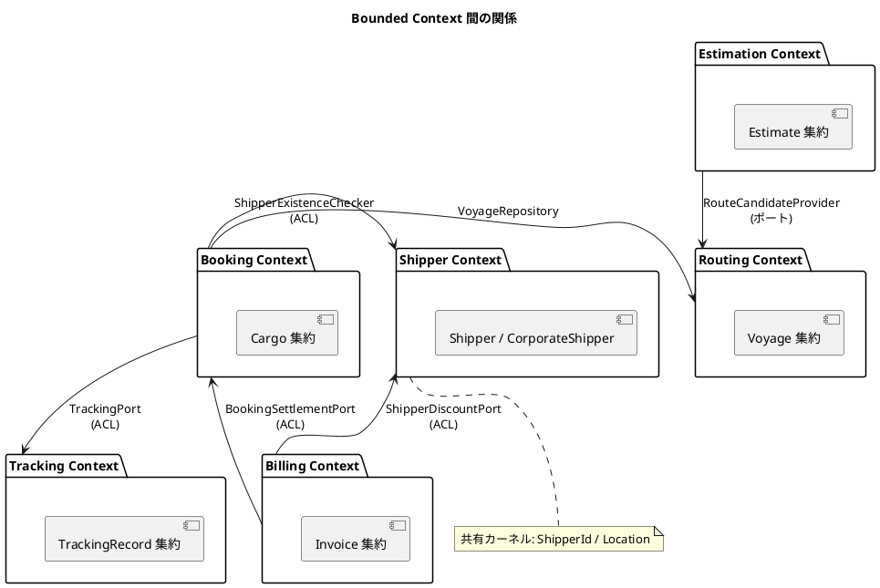
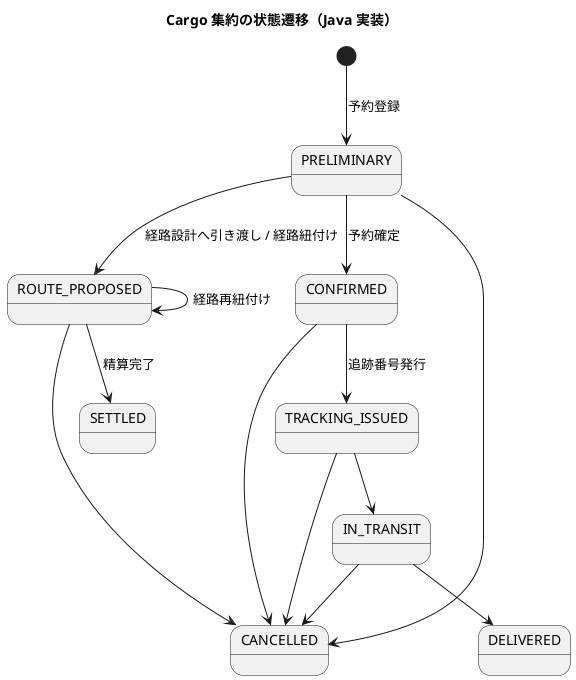

# 第 1 章：モノリスアーキテクチャの全体像

## この章の狙い

10 言語すべてが共有している設計方針を先に押さえます。以降のイテレーション章は、この方針を各言語がどう実現したかの記録です。

## なぜモノリスか

このシステムは、マイクロサービスに分割せず単一デプロイ単位で作られています。理由は 3 つです。

1. **トランザクション境界が集約に閉じている** — 予約確定・精算・荷役記録はいずれも単一集約の更新であり、分散トランザクションを必要としない
2. **チームが 1 つ** — サービス分割の主要な効用は組織のスケールだが、開発者 1 名 + AI ペアプログラミングでは分割コストだけが残る
3. **ドメイン境界がまだ動く** — Estimation と Routing の分界点は IT3〜IT5 で実際に動いた。プロセス境界で固めていたら移動コストが跳ね上がっていた

その代わり、**内部の境界は厳格に守る**方針を取りました。単一プロセスであることは、依存を自由に張ってよい理由にはなりません。

## 業務領域の評価とパターン選択

Java 実装のアーキテクチャ設計書では、パターン選択を次のように評価しています。

| 評価軸 | 判定 | 根拠 |
| :--- | :--- | :--- |
| 業務領域カテゴリー | 中核の業務領域 | 通関・積み替え・例外処理という複雑なビジネスルールを持つ |
| データ構造の複雑さ | 複雑 | エンティティ間の関係が多く、コンテキスト間でデータを変換する必要がある |
| 特殊要件 | あり | 金額を扱う、荷役履歴の監査記録が必要、状態遷移が厳密 |

この評価から、3 つのパターンを組み合わせています。

- **ドメインモデル** — ビジネスルールをドメインオブジェクトに閉じ込め、手続き的なロジックを排除する
- **ポートとアダプター（ヘキサゴナル）** — ドメインを技術的関心事から独立させ、テスト容易性を確保する
- **CQRS** — Booking / Tracking の読み書き負荷特性の違いに対応し、クエリを読み取り最適化モデルで返す

イベントソーシングは採用していません。監査要件は荷役履歴（`TrackingActivityEvent`）の追記で満たせるため、全集約をイベント列で表現する複雑さを引き受ける理由がありませんでした。

## Bounded Context



コンテキストをまたぐ参照は必ずポート（インターフェース）を経由します。Booking Context は Shipper Context のリポジトリを直接呼びません。呼ぶのは `ShipperExistenceChecker` という「荷主が存在するか」だけを問う細いインターフェースです。

このルールは IT1 のふりかえりで **違反として検出されたもの**です。当初 Booking Context は `ShipperRepository` を直接注入していました。IT2 で ACL を導入し、`ShipperId` を共有カーネルへ移動し、同時に **ArchUnit テストでルールを機械的に守らせる**ところまでを対応としています。設計原則は文書に書いただけでは守られない、という教訓が最初のイテレーションで出ています。

## レイヤ構成

Java 実装のパッケージ構造は、Bounded Context を第一階層、レイヤを第二階層に置きます。

```
com.example.cargotracker
├── booking/
│   ├── domain/model/           # 集約・値オブジェクト・ドメインイベント・リポジトリ IF
│   ├── application/internal/
│   │   ├── commandservices/    # ユースケース実行（書き込み）
│   │   ├── queryservices/      # 読み取り最適化（CQRS のクエリ側）
│   │   ├── eventhandlers/      # ドメインイベント購読
│   │   └── outboundservices/   # ACL ポート定義
│   ├── infrastructure/
│   │   ├── repositories/       # MyBatis 実装
│   │   └── services/           # ACL アダプター実装
│   └── interfaces/
│       ├── rest/               # REST Controller + DTO
│       └── web/                # Thymeleaf Controller
├── shipper/ estimation/ routing/ tracking/ billing/   # 同じ構造
└── shared/                     # 共有カーネル + 横断設定
```

依存の向きは `interfaces → application → domain` の一方向で、`infrastructure` は `domain` が定義したインターフェースを実装する側に立ちます。ポートは **ドメイン側に置き、実装をインフラ側に置く**、という依存性逆転がこの構造の要です。

たとえば経路候補の取得ポートは、ドメイン層に置かれています。

```java
// estimation/domain/model/port/RouteCandidateProvider.java
public interface RouteCandidateProvider {
    List<RouteCandidate> findCandidates(
            Location origin,
            Location destination,
            LocalDate arrivalDeadline,
            CargoType cargoType
    );
}
```

実装は 2 つあり、IT3 ではスタブ（`StubRouteCandidateProvider`）、IT4 で実データ連携（`VoyageRouteCandidateProvider`）に差し替えられました。**ポートを先に切ってあったから差し替えで済んだ**という点が、このイテレーションの設計判断の効き所です。

## 言語ごとのモジュール分割単位

同じ「コンテキストごとに分ける」方針でも、何で分けるかは言語のモジュール機構で変わります。

| 言語 | 分割単位 | 境界の強制手段 |
| :--- | :--- | :--- |
| Java | パッケージ | ArchUnit テスト |
| C# | 名前空間（単一プロジェクト内） | ArchUnitNET |
| F# | プロジェクト（`.fsproj`） | プロジェクト参照 + ArchUnitNET |
| Scala | パッケージ | ArchUnit |
| Haskell | モジュール階層 | モジュール公開リストと `import` 規約 |
| Flix | `mod` | 自作 `arch-lint`（メタテスト付き） |
| Rust | **クレート**（`domain-booking` 等） | Cargo の依存グラフ（コンパイラが強制） |
| Go | パッケージ | go-arch-lint |
| Ruby | packs（Packwerk） | Packwerk の静的検証 |
| TypeScript | ディレクトリ + NestJS モジュール | dependency-cruiser |

この表の分かれ目は **「境界違反がいつ検出されるか」** です。

Rust だけがコンパイル時に落ちます。`domain-booking` クレートが `domain-shipper` を `Cargo.toml` に書いていなければ、そもそも参照できません。他の言語は、境界違反を書けてしまい、専用の lint／アーキテクチャテストが CI で拾う構図になります。実際 Java の IT1 では違反が書けてしまい、ArchUnit を追加するまで検出できませんでした。Rust 実装がレビューで「BC 独立は全 IT 中もっとも厳格」と評価されているのは、規律ではなくビルドシステムがそうさせているからです。

F# はプロジェクト分割によって、これに近い強制力を得ています。`.fsproj` の参照グラフに加えて F# のファイル順序制約があるため、循環参照が構造的に作れません。

## CQRS の適用範囲

全コンテキストに CQRS を適用しているわけではありません。適用しているのは読み書きの形が食い違う箇所だけです。

- **コマンド側** — 集約を再構築し、ドメインメソッドを呼び、リポジトリで保存する
- **クエリ側** — 集約を経由せず、表示に必要な形の DTO を SQL で直接組み立てる

たとえば追跡情報の照会（US18）は、`TrackingRecord` 集約を復元してから画面用に詰め替えるのではなく、`TrackingQueryService` が `TrackingDetailDto` を直接返します。荷役履歴と予約情報を結合した読み取り専用のビューは、書き込みモデルの形とは一致しないためです。

この判断は、データアクセス層に「SQL を明示的に書けること」を要求します。10 言語すべてが SQL を隠さないライブラリを選んでいるのはそのためです。

| 言語 | データアクセス | SQL の書き方 |
| :--- | :--- | :--- |
| Java | MyBatis | XML マッパーに手書き |
| C# | Dapper | 文字列 SQL + マッピング |
| F# | Donald | 文字列 SQL + レコードへの関数的マッピング |
| Scala | ScalikeJDBC | SQL interpolation |
| Haskell | 手書き SQL | クエリ関数を明示定義 |
| Rust | sqlx | `query_as!` マクロで**コンパイル時に SQL を検証** |
| Go | 手書き SQL | 標準 `database/sql` |
| TypeScript | Kysely | 型安全な SQL ビルダー |
| Ruby | Active Record + Query Object | 書き込みは AR、読み取りは `select_all` / Arel |
| Flix | JDBC | 文字列 SQL |

Ruby だけが書き込みに ORM（Active Record）を使い、読み取りだけ生 SQL に落とす二段構えです。フルスタックフレームワークの規約に乗る利得を書き込み側で取り、CQRS のクエリ最適化を読み取り側で取る折衷になっています。

Rust の `sqlx::query_as!` は、ビルド時に実 DB のスキーマに対して SQL を検証します。**カラム名の typo がコンパイルエラーになる**のは、この 10 言語の中で唯一の性質です。

## ドメインイベント

コンテキスト間の通知はドメインイベントで疎結合にしています。単一プロセス内なのでメッセージブローカーは使いません。

| 言語 | イベント基盤 |
| :--- | :--- |
| Java | Spring `ApplicationEventPublisher` |
| C# | MediatR（`INotification`） |
| Scala | Play のアプリケーション層で自前ディスパッチ |
| Ruby | `ActiveSupport::Notifications`（`DomainEvents` でラップ） |
| TypeScript | `@nestjs/event-emitter` |
| Rust | tokio `broadcast` チャネル |
| Go | 自作イベントディスパッチャ |
| Haskell / F# / Flix | 関数として明示的に呼ぶ（購読の暗黙性を避ける） |

関数型 3 言語がフレームワークのイベント機構を使わないのは偶然ではありません。「どこで誰が購読しているか分からない」ことが、効果を型で追える言語の利点と真っ向から衝突するためです。Haskell 実装は購読関係をアプリケーション組み立て（`AppDeps`）の一箇所に集約する方式を取っています。

なお Ruby 実装では、この暗黙性が実際にテストを壊しました。イベント購読を起動時に登録する構成にしたところ、購読レジストリを `reset!` するテストが後続のテストを汚染したのです。対処は「テストヘルパの共通 `before` で毎回 `reset!` → 再登録する」という構成の作り直しでした。

## 状態遷移という共通の難所

このシステムで最も設計判断が分かれるのは、`BookingStatus`（予約状態）の遷移です。



遷移可否をどこに置くかで、実装は 3 派に分かれます。

1. **集約のメソッド内でガードする（Java・C#・Ruby・TypeScript・Go）** — `confirm()` の先頭で現在状態を検査し、不正なら例外／エラーを返す
2. **状態そのものに遷移表を持たせる（Scala・Haskell・Flix）** — `canTransitionTo` という純粋関数を状態型に用意し、集約メソッドはそれを問い合わせる
3. **型で遷移前状態を表現する（F#）** — 判別共用体で状態ごとに別のケースを持ち、遷移関数の引数型で不正な呼び出しを排除する

Java は当初 1 の方式を各メソッドに散らして書いており、IT5 で `requireStatus()` として抽出しました。ふりかえりでは「状態遷移ガードが 1 箇所に集約されている」ことを IT5 の成功基準に明記しています。散らばったガードは、状態を追加したときに追随漏れを起こすためです。

```java
// booking/domain/model/aggregates/Cargo.java（IT5 で抽出）
public void requireStatus(Set<BookingStatus> expected) {
    if (!expected.contains(status)) {
        throw new IllegalStateException(
                "現在の状態では操作できません。許可された状態: "
                + expected.stream().map(BookingStatus::getDisplayName).toList()
                + "、現在: " + status.getDisplayName());
    }
}
```

一方 Haskell は最初から遷移表を状態型の側に置いています。

```haskell
-- Cargotracker/Booking/Domain/Model/State/BookingStatus.hs
canTransitionTo :: BookingStatus -> BookingStatus -> Bool
canTransitionTo Draft Submitted = True
canTransitionTo Submitted RouteProposed = True
canTransitionTo Submitted Cancelled = True
canTransitionTo RouteProposed RouteAssigned = True
-- ...
canTransitionTo _ _ = False
```

この違いは、単なる好みではありません。**遷移表が 1 つの関数に集まっていれば、状態を追加したときに直す場所が 1 箇所**です。Java は IT5 まで、その 1 箇所を持っていませんでした。

## テスト戦略の共通形

全言語が同じピラミッドを採っています。

| 層 | 内容 | 実行速度 |
| :--- | :--- | :--- |
| ドメイン単体テスト | 集約・値オブジェクトの不変条件と状態遷移 | 最速（DB なし） |
| アプリケーション単体テスト | コマンドサービスをポートのモックで駆動 | 速い |
| 統合テスト | 実 DB（インメモリまたは Testcontainers）に対するリポジトリ・HTTP | 中 |
| アーキテクチャテスト | コンテキスト間依存・レイヤ依存の検証 | 速い |
| E2E テスト | Playwright によるブラウザ操作 | 遅い |

Java 実装は最終的に単体・統合 323 件 + Playwright E2E 98 件に到達しました。他言語も同水準です（Haskell 889 examples、Flix 782 件、TypeScript 597 件、Ruby 429 examples など。粒度が違うため件数の直接比較には意味がありません）。

重要なのは件数ではなく、**アーキテクチャテストが全言語に存在する**ことです。モジュラーモノリスは、境界を守る自動テストがなければ数イテレーションで泥団子に戻ります。

## 次の章から

第 2 章以降は、Java の IT1 から IT10 までを順に追います。各章の最後で、そのイテレーションのユーザーストーリーを他 9 言語がどう実装したかを比較します。

- [第 2 章：IT1 荷主登録と貨物予約の基盤](02-iteration-01.md)
