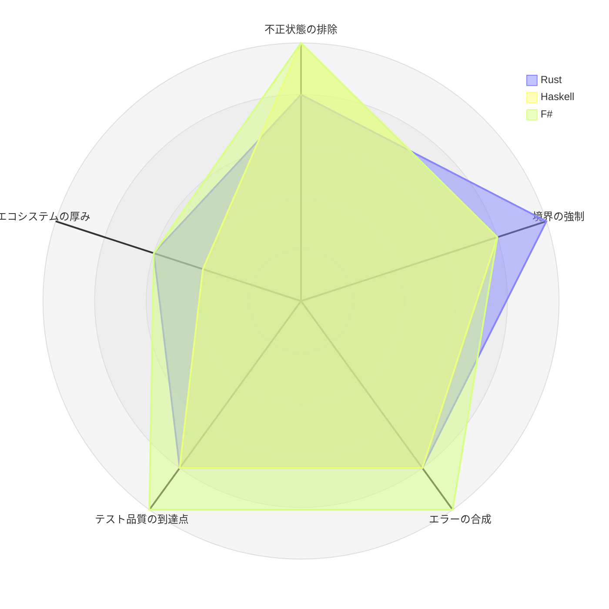
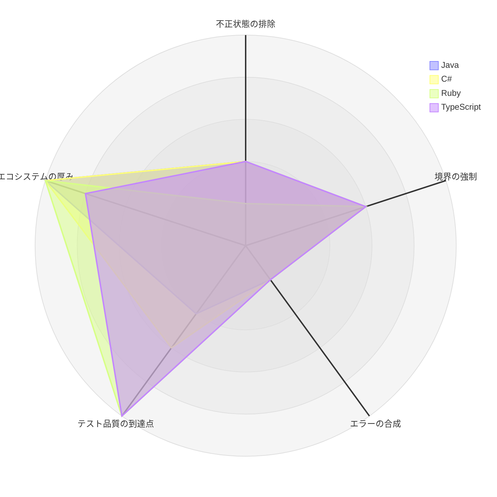
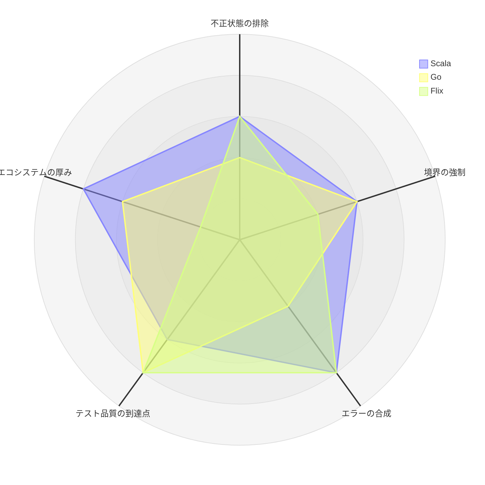

# 第 12 章：10 言語横断まとめ

## この章の狙い

10 の実装が同じ題材を作り終えました。何が言語で決まり、何が設計判断で決まり、何が言語に関係なく起きたのかを整理します。

## 言語で決まったこと

### 1. 不正状態を表現できるかどうか

最も明確な差が出たのは、条件付き必須（「法人なら契約番号が必須」「危険物なら申告が必須」）の表現です。

| 表現方法 | 言語 | 不正状態の検出 |
| :--- | :--- | :--- |
| 和型が追加情報を内包 | Haskell・F#・Rust（荷主）| **コンパイル時** |
| 種別 enum + オプショナルフィールド | Java・C#・Scala・Go・Rust（貨物）・Flix | 実行時（コンストラクタ） |
| 動的検査 | Ruby・TypeScript | 実行時（ファクトリ） |

```haskell
-- Haskell: 「危険物だが申告なし」という値が作れない
data CargoType
  = General
  | Hazardous !HazardousDeclaration
  | Refrigerated !TemperatureRequirement
```

```java
// Java: 実行時に検査するしかない
if (this.cargoType == CargoType.HAZARDOUS && this.hazardousDeclaration == null) {
    throw new IllegalArgumentException("hazardousDeclaration is required for HAZARDOUS cargo");
}
```

ただし、和型を持つ言語が常にそれを選んだわけではありません。**Rust は荷主では和型を使い、貨物では enum + Option を使いました**。理由は永続化です。DB のテーブルは「種別カラム + nullable な追加カラム」という形で、和型を素直にマッピングできません。

つまり、この差は「言語が決めた」のではなく「言語が選択肢を与え、永続化の都合が選ばせた」ものです。

### 2. 境界違反がいつ検出されるか

| 検出タイミング | 言語 | 手段 |
| :--- | :--- | :--- |
| コンパイル時 | **Rust** | クレートの依存グラフ |
| コンパイル時（部分的） | F#・Haskell | プロジェクト参照・モジュール公開リスト |
| テスト実行時 | Java・C#・Scala・Go・TypeScript・Ruby・Flix | ArchUnit / go-arch-lint / Packwerk / dependency-cruiser / 自作 lint |

Rust の評価は IT8 のレビューで「BC 独立は全 IT 中もっとも厳格」でした。開発者の規律ではなくビルドシステムの帰結です。

対して Java は IT1 で境界違反を書いてしまい、ArchUnit を追加するまで検出できませんでした。テスト実行時に検出する方式は有効ですが、**ルールを書き忘れた領域は守られません**。Go 実装では新しいコンテキストを追加した際に `go-arch-lint` の allowlist 更新を忘れ、逆にビルドが赤になっています。ルールが厳しいほど、ルール自体のメンテナンスコストが上がります。

### 3. エラーの伝え方

| 方式 | 言語 | 全エラー収集 |
| :--- | :--- | :--- |
| 例外 | Java・C#・Ruby・TypeScript | 別途バリデーション層が必要 |
| `Result` / `Either` | F#・Rust・Scala・Haskell・Flix | 適用的合成で可能 |
| 多値返却 | Go | 手作業で蓄積 |

F# 実装は `FsToolkit.ErrorHandling` の `validation` コンピュテーション式で、ドメイン層の検証だけでフォームの全エラーを一度に返せます。Java は最初のエラーで例外を投げるため、フォームの全項目のエラーを返すには Bean Validation を別に通す必要があります。

これは UX に直結する差です。1 項目直すたびに次のエラーが出る画面と、全部まとめて出る画面の違いになります。

### 4. テストの書き方の文化

| 言語 | 特徴的なテスト技法 |
| :--- | :--- |
| Go | テーブル駆動テスト（標準的な書き方） |
| Haskell | hedgehog によるプロパティベーステスト |
| F# | FsCheck によるプロパティベーステスト |
| Rust | mockall によるポートのモック生成 |
| Java・C#・Scala | JUnit / xUnit / ScalaTest による例示ベース |

第 10 章で見た通り、例外処理のように分岐が多い領域では、テーブル駆動やプロパティベースのほうが網羅しやすくなります。Java のブランチカバレッジが 74% に留まったのは、例示ベースのテストで組み合わせを網羅しきれなかったためです。

**言語のテスト文化が、そのままカバレッジの到達点に効いている**という相関が見て取れます。

## 設計判断で決まったこと

言語に関係なく、設計者が選べた領域です。

### 1. 状態遷移ルールをどこに置くか

| 方式 | 言語 | 状態追加時の変更箇所 |
| :--- | :--- | :--- |
| 遷移表を状態型に持たせる | Scala・Haskell・Flix | 1 箇所（遷移表） |
| 集約メソッド内でガード | Java・C#・Go・Ruby・TypeScript・Rust | 各メソッド |
| 型で遷移元を表現 | F#（部分的） | 型の追加 |

Java は IT5 で `requireStatus` として抽出しましたが、全メソッドへの適用完了は IT10 でした。**5 イテレーションかかった作業が、最初に遷移表方式を選んでいれば発生していません**。

これは言語の制約ではありません。Java でも `BookingStatus` に `canTransitionTo` を書けます。設計の選択の問題です。

### 2. 状態機械の粒度

Java は「経路設計へ引き渡した」と「経路が紐付いた」を同じ `ROUTE_PROPOSED` で表しました。Scala・Haskell は `RouteProposed` / `RouteAssigned` に分けました。

Java 版では状態を見ても経路の有無が分からず、`cargoItinerary != null` を見る必要があります。**IT3 の粗い状態設計が、IT5 のコードの読みにくさとして返ってきた**形です。

### 3. ドメインイベントの発行方式

| 方式 | 言語 | 発行漏れの検出 |
| :--- | :--- | :--- |
| 集約が溜め、リポジトリ保存時に発行 | C# | 集約の単体テストで検出可能 |
| アプリケーション層で明示的に発行 | Java・Scala・TypeScript ほか | コマンドサービスのテストが必要 |
| 関数として明示的に呼ぶ | Haskell・F#・Flix | 呼び出しが型に現れる |

Java 実装では、IT6 で「イベント発行の一貫性」が課題として挙がり、IT10 の成功基準に「`assignItinerary` 完了時に `CargoRoutedEvent` が発行されている（テストで明示）」が残りました。**発行漏れが 5 イテレーション気づかれなかった**わけです。

### 4. 集約の可変・不変

Java 実装は `Cargo`（不変）・`Invoice`（可変）・`TrackingRecord`（可変）と揺れました。意図的な使い分けではなく、書かれた時期の違いです。

Rust・Haskell・F# は言語の性質上ほぼ不変に統一されます。**明示的なガイドラインがない限り、一貫性は時間とともに失われる**という一般則が、Java 実装で観察されました。

### 5. テスト DB を本番と揃えるか

| テスト DB | 言語 |
| :--- | :--- |
| Testcontainers（実 PostgreSQL） | C#・F#・Scala・Rust・Go・TypeScript・Haskell |
| インメモリ DB（H2） | Java・Flix |
| 実 PostgreSQL | Ruby |

Java 実装は H2 の不具合に IT2 から IT9 まで悩まされ続けました（長時間セッション後のチェック制約失敗）。移行は繰り返し検討されましたが、最後まで実施されていません。

テストの実行速度と、本番との差分によるコスト。この 10 実装を見る限り、後者のほうが高くつきました。

## 言語に関係なく起きたこと

ここが最も重要な部分です。10 実装すべてに現れた問題は、言語選択では解決しません。

### 1. 実装したのに駆動していない

複数の実装で、同じ形の問題が起きました。

| 実装 | 内容 |
| :--- | :--- |
| Haskell | `OverdueCheckCommand` は実装・テスト済みだが `Main` 未配線 |
| Rust | `CheckOverdueService` 未配線（レビューで 3 視点が重複指摘） |
| Java | `RouteCandidateProvider` が `cargoType` を引数に取りながら使っていない |
| Flix | 差し戻し・キャンセルに画面からの入口がない |

すべて **テストは緑**です。単体テストは「呼べば正しく動く」ことを検証しますが、「誰かが呼んでいる」ことは検証しません。

対処として実効性が確認されているのは 2 つです。

- **HTTP レベルの受入テスト**で、実際のエンドポイントを叩いて結果を検証する（Rust）
- **E2E テストが UI を経由する**（URL 直接 POST では導線の欠落を見逃す。Flix の教訓）

### 2. ロールと状態の到達性が抜ける

画面を作り、受入基準を満たし、テストも緑。しかし **そのロールのユーザーがナビゲーションから辿り着けない**。あるいは **その状態のレコードから次の操作を起動できない**。

複数の実装のふりかえりに、対処が記録されています。

- 画面実装の DoD に「個別画面 + ナビゲーション（navbar / dashboard / 検証テスト）の両方を確認」を入れる
- UI 設計書・navbar・dashboard・検証テストの 4 点が一致していることを確認する
- ボタンの出し分けは、集約の述語（`canCancel()` など）をそのまま呼ぶ

最後の項目が本質的です。「キャンセルボタンを出すか」の条件をテンプレート側に手書きすると、集約の遷移可能条件と乖離します。集約の述語を呼べば、常に一致します。

### 3. 「余力次第」のタスクは永久に繰り越される

Java 実装の SonarQube スキャンは IT1〜IT4 の 4 回連続で落ち、IT5 でゴール文に書き込んでようやく実行されました。IT5 レビューの技術的負債 H-1〜H-9 は IT10 まで持ち越されました。

Ruby 実装のふりかえりにも同じ構造が記録されています。技術的負債の返済枠を「余力次第」に置くと、余力が生まれないため固定化する。

対処は 2 つしかありません。

- イテレーション序盤の独立したコミット枠で先に着手する
- 正直にスコープ外と宣言し、計画から外す

Scala 実装は pre-commit フックにフルテストを追加し、「実行を忘れる」余地を消しました。Rust は `cargo audit` / `cargo deny` を DoD に組み込み、緑でないとクローズしない運用にしました。**仕組みで強制した項目だけが継続します**。

### 4. 境界値は最後まで残る

リリース前後に、全実装が境界値テストを集中的に追加しています。

| 実装 | 境界のバグ |
| :--- | :--- |
| Go | 支払期限（DATE・00:00）と到着（TIMESTAMP）の比較で、期限当日着を誤って期限超過と判定 |
| TypeScript | 割引率逆算による請求書復元クラッシュ |
| Ruby | 連番から配列インデックスを計算する際の負値による末尾誤削除 |
| C# | MarkOverdue 境界・二重発行 |

金額・日付・連番。この 3 つに集中しています。正常系は早く固まりますが、境界は業務データが実際にそこに乗るまで顕在化しません。

**機能実装と同時に境界を洗い出す**ほうが、リリース前にまとめて追加するより安く済みます。境界値分析は古典的なテスト技法ですが、10 実装のうち、実装と同時に体系的に適用したものはありませんでした。

### 5. 受入基準を満たすことと業務が回ることは別

レビューの user-representative（ユーザー代表）視点が検出した問題は、受入基準に書かれていないものでした。

- 出港済みの便が航海一覧に混ざり、一覧全体が信用されなくなる（Flix）
- 料金調整の補償費用が、増額なのか減額なのか業務判断として未確定（Ruby）
- 期限超過チェックを誰が起動するのか決まっていない（Haskell・Rust）

いずれも「仕様通りだが使えない」類の問題です。Flix 実装のふりかえりは、これを「一覧は『毎朝どう使うか』から確かめる」と表現しています。

### 6. コメントは検証されない

Flix 実装の IT10 で、コード中のコメントに書かれた制約（「〜しない」「〜まで確かめる」）と実装が食い違うケースが 4 件見つかりました。

Java の `RouteCandidateProvider` が `cargoType` を受け取りながら使っていない件も同じ性質です。ポートのシグネチャが「貨物種別で絞り込む」と宣言しているのに、実装が無視しています。コンパイラも lint も検出しません。

**コメントやシグネチャに書いた制約は、テストに落とすか、書かないかのどちらか**です。

## 10 言語の特性比較

ここまでの内容を 5 軸で図示します。

> **この評価について**：以下は計測値ではなく、**本記事の各章で確認した事実にもとづく 5 段階の定性評価**です。同一題材・同一要件という条件下での相対比較であり、言語そのものの優劣を示すものではありません。各スコアの根拠は後掲の表に示します。

### 評価軸

| 軸 | 何を見るか | 5 の基準 | 1 の基準 |
| :--- | :--- | :--- | :--- |
| 不正状態の排除 | 条件付き必須を型で表現できたか | 和型にデータを内包し、実行時検査が不要 | 動的検査のみ |
| 境界の強制 | BC 間の依存違反がいつ検出されるか | コンパイル時（ビルドが落ちる） | 自作 lint で検出精度に課題 |
| エラーの合成 | 失敗をどう伝え、どう束ねるか | `Result` + 適用的合成で全エラー収集 | 例外のみ・別途検証層が必要 |
| テスト品質の到達点 | 最終カバレッジと閾値の強制状況 | 90% 超を CI 閾値で維持 | 目標未達のままリリース |
| エコシステムの厚み | 認証・DB 移行・API doc が標準で揃うか | フレームワーク標準でほぼ充足 | 主要機能を自作 |

### 型システム重視の 3 言語



3 言語とも左上（型による防御）に張り出し、エコシステムで凹みます。Rust は境界の強制が唯一の 5 で、クレートの依存グラフがコンパイル時に効くためです。F# のエラー合成 5 は `validation { and! }` による全エラー収集、テスト 5 は層別閾値（全体 80% / ドメイン層 85%）の CI 強制によります。

### エコシステム重視の 4 言語



形が反転します。右下（エコシステムとテスト）に張り出し、エラー合成は 4 言語とも 1 です。

注目すべきは **Ruby と TypeScript のテスト品質が 5** である点です。型の支援が最も薄い 2 言語が、カバレッジでは最上位（95.95% / 94.05%）に来ています。閾値を CI で強制したためであり、**テスト品質は言語ではなく運用で決まる**ことがはっきり出ています。

対して Java のテスト 2 は、ブランチカバレッジ 74% で目標未達のままリリースした実績によります。閾値をハードゲート化していなかったことが差になりました。

### 中間の 3 言語



Scala は ADT を持ちながら荷主・貨物種別に `Option` フィールドを選んだため、不正状態の排除は 3 に留まります（永続化との往復を優先した判断）。

Flix はエコシステム 1 が際立ちます。テンプレートも `arch-lint` も自作しており、その `arch-lint` が IT2 で実コードの違反を 0 件しか検出できなかった経緯から、境界の強制も 2 としました。一方で和型と網羅性検査は効いており、テストは 782 件に達しています。

### 全 10 言語のスコアと根拠

| 言語 | 不正状態 | 境界 | エラー | テスト | エコ | 主な根拠 |
| :--- | ---: | ---: | ---: | ---: | ---: | :--- |
| F# | 5 | 4 | 5 | 5 | 3 | 6 種の DU で不正状態を排除／`validation` で全エラー収集／層別閾値を CI 強制 |
| Haskell | 5 | 4 | 4 | 4 | 2 | `CargoType` が追加情報を内包／モジュール公開リスト／889 examples |
| Rust | 4 | 5 | 4 | 4 | 3 | 荷主は和型・貨物は enum + `Option`／クレート境界がコンパイル時／`cargo audit` を DoD |
| Scala | 3 | 3 | 4 | 3 | 4 | ADT を持つが `Option` を選択／ArchUnit／pre-commit フルテスト |
| Flix | 3 | 2 | 4 | 4 | 1 | 網羅性検査は活用／自作 lint の検出漏れ／テンプレート等を自作 |
| Go | 2 | 3 | 2 | 4 | 3 | 逆方向の不整合まで実行時検査／go-arch-lint（allowlist 更新漏れ）／層別カバレッジ 94.4% |
| TypeScript | 2 | 3 | 1 | 5 | 4 | 実行時検査／dependency-cruiser／全体 94.05%・新規 92.1% |
| C# | 2 | 3 | 1 | 3 | 5 | 実行時検査＋null 許容参照型／ArchUnitNET／85% ハードゲート化は繰り越し |
| Java | 2 | 3 | 1 | 2 | 5 | 実行時検査／ArchUnit（IT1 で違反発生）／branch 74% で目標未達のままリリース |
| Ruby | 1 | 3 | 1 | 5 | 5 | 動的検査／Packwerk／全体 95.95%・新規 91.7% |

### 図から読めること

1. **型の防御力とエコシステムの厚みは、この 10 実装では逆相関している** — 左上に張り出す言語は右下が凹み、その逆も成り立ちます。両方 4 以上なのは Scala のみで、それも不正状態の排除が 3 です
2. **テスト品質だけは軸が独立している** — Ruby（不正状態 1）と F#（同 5）がどちらもテスト 5 です。型の強さはテストの到達点を決めません
3. **境界の強制は 3 に集中する** — 10 言語中 6 言語が 3 です。lint やアーキテクチャテストで守る方式は、言語を問わず同程度の強度に落ち着きます。5 は Rust だけです

3 番目が実務上いちばん重要です。**大半の言語では、BC の独立性はビルドではなく規律とツールで守る**ことになります。本章冒頭で見た通り、そのツール自体のメンテナンス漏れ（Go の allowlist 更新忘れ、Flix の lint 検出漏れ）が実際に起きています。

## 言語選択の実務的な指針

この 10 実装から言えることを、選択の観点でまとめます。

### 型で守りたいものが多いなら

**Rust・Haskell・F#** が有利です。

- 条件付き必須を和型で表現でき、実行時検査が不要
- Rust はクレート境界でコンテキスト独立性がコンパイル時に守られる
- ただし永続化層のマッピングコードは厚くなる

### エコシステムの成熟を取るなら

**Java・C#・Ruby・TypeScript** が有利です。

- 認証・認可・マイグレーション・API ドキュメントが標準で揃う
- 開発者の調達が容易
- ただし境界の防御は自分でルールを書く必要がある

### 中間

**Scala・Go** は両者の中間に位置します。Scala は ADT を持ちながら JVM のエコシステムを使え、Go は境界検証ツールが充実しています。ただし Scala は和型を持ちながら選ばなかった（永続化の都合）、Go は和型がないため実行時検査に頼る、という形でそれぞれ制約があります。

### どれを選んでも変わらないこと

- 未配線のサービスは緑のテストの下に隠れる
- ロール別・状態別の到達性は意識しないと抜ける
- 「余力次第」の項目は消化されない
- 境界値のバグは最後に出る
- 受入基準を満たしても業務が回るとは限らない

**言語選択で解決できるのは、この一覧の外側だけです。**

## 参考

- 実装リポジトリ: 各言語版 Cargo Tracker（DDD・ヘキサゴナル・CQRS のモノリス実装）
- [ドメインモデル設計ガイド](../../reference/ドメインモデル設計ガイド.md)
- [アーキテクチャ設計ガイド](../../reference/アーキテクチャ設計ガイド.md)
- [データモデル設計ガイド](../../reference/データモデル設計ガイド.md)

---

- 前の章：[第 11 章：IT10 輸送料金算出とリリース 2.0](11-iteration-10.md)
- [目次に戻る](index.md)
