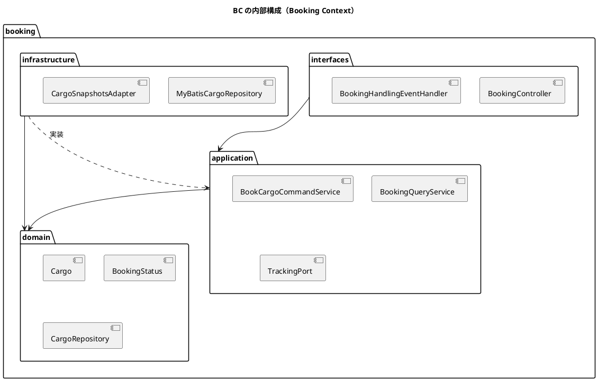
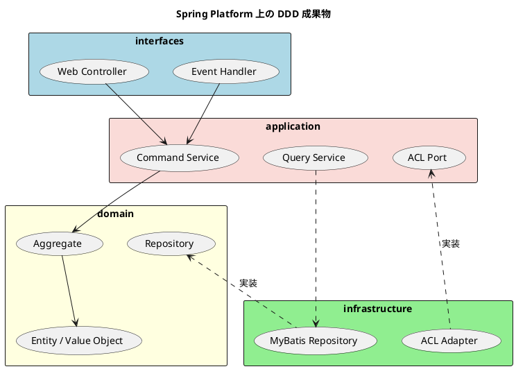

# 第 3 章：Spring Platform × モジュラーモノリス

第 2 章で設計した Cargo Tracker のドメインモデルを、Spring Platform 上でどう実装するかを扱います。主眼は「Spring を使う」こと自体ではなく、**ドメイン境界を壊さずに Spring を外側へ配置する方法**です。

本章のコードはすべて参照実装から転記しています。以降のパスは `docs/article/source/java-2/apps/cargo-tracker/` からの相対です。Java のパスは `src/main/java/com/example/cargotracker/` を省いて記します。

## Spring プラットフォーム

Spring Platform は 1 つのフレームワークではなく、Spring Framework を中核としたプロジェクト群です。モジュラーモノリスで使うのはその一部だけであり、**何を使わないかを決めることが、境界を保つ最初の作業になります**。

### Spring Boot: 機能

起動クラスは標準的な `@SpringBootApplication` です。BC の数とその一覧が、ここに宣言されています。

```java
/**
 * 国際貨物輸送管理システムの起動クラス。
 *
 * <p>本システムはモジュラーモノリスであり、6 つの境界付けられたコンテキスト
 * （booking / shipper / routing / tracking / billing / estimation）と共有カーネルで構成される。
 * 各 BC はトップレベルパッケージに 1 対 1 で対応する。
 *
 * <p>外部システムとの HTTP 連携は行わない（ADR-006）。経路算出・通関・決済・港湾・通知は
 * いずれも内部シミュレーションとして実装する。
 */
@SpringBootApplication
@ConfigurationPropertiesScan
public class CargoTrackerApplication {

    public static void main(String[] args) {
        SpringApplication.run(CargoTrackerApplication.class, args);
    }
}
```

転記元: `CargoTrackerApplication.java`

実際のトップレベルパッケージには `handling` もあり、業務 BC は 7 つです。Javadoc は 6 つのまま追随していません。**BC の数のような基本的な事実でも、コメントは実装から離れます。**次章以降で見る ArchUnit のルールが、コメントではなくコードとして境界を検証するのはこのためです。

Spring Boot から使っているのは次の starter です。

```groovy
implementation 'org.springframework.boot:spring-boot-starter-web'
implementation 'org.springframework.boot:spring-boot-starter-thymeleaf'
implementation 'org.springframework.boot:spring-boot-starter-validation'
implementation 'org.springframework.boot:spring-boot-starter-security'
implementation "org.mybatis.spring.boot:mybatis-spring-boot-starter:${mybatisStarterVersion}"
implementation 'org.springframework.boot:spring-boot-flyway'
implementation 'org.springframework.boot:spring-boot-starter-actuator'
```

転記元: `build.gradle`

Web・画面・入力検証・認証・永続化・マイグレーション・運用エンドポイントで、モジュラーモノリスに要るものはこれで足ります。**分散に関わる starter は 1 つも入っていません。**

### Spring Cloud

Spring Cloud はサービスディスカバリ・分散設定・サーキットブレーカ・メッセージングを担うプロジェクト群です。**本実装では採用していません。**単一プロセスであり、BC 間の呼び出しはメソッド呼び出しに閉じるためです。

採用しない判断は、宣言としてではなくビルドの検証として残されています。

```groovy
// ADR で明示的に排除した依存。キーは依存の座標の一部、値は根拠。
def forbidden = [
        'com.h2database'            : 'ADR-003: H2 はローカル起動のみ。本番の成果物に含めない',
        'wiremock'                  : 'ADR-006: 外部連携が無いため WireMock は採用しない',
        'spring-cloud-contract'     : 'ADR-006: 契約テストの対象が存在しない',
        'org.hibernate.orm'         : 'ADR-004: 永続化は MyBatis。JPA / Hibernate は採用しない',
        'jakarta.persistence'       : 'ADR-004: JPA の API を本番に持ち込まない',
]
```

転記元: `build.gradle`（`verifyProductionDependencies`）

**「採用しない」はコメントでは守られません。**誰かが依存を 1 行足しても、テストは緑のままになります。このタスクは本番の実行クラスパスを走査し、宣言に反する依存が入っていればビルドを落とします。

分散が要るようになったとき、Spring Cloud がどこに入るかは第 4 章で扱います。

### Spring Framework のまとめ

Spring Boot が「組み立て」を担うのに対して、Spring Framework は BC の内側と外側をつなぐ道具を提供します。本実装で使っているのは次の 4 つに絞られます。

| 機能 | 使う場所 | 使わない場所 |
| :--- | :--- | :--- |
| DI | インフラ層の `@Configuration`、アプリケーション層の `@Service` | ドメイン層 |
| 宣言的トランザクション | アプリケーションサービス（`@Transactional`） | ドメイン層 |
| アプリケーションイベント | BC 間の状態伝播（`ApplicationEventPublisher`） | 同一 BC 内の呼び出し |
| Spring MVC | インターフェース層の `@Controller` | それ以外のすべて |

いずれも interfaces / application / infrastructure の 3 層に閉じており、**ドメイン層に Spring は現れません**。これは規約ではなく検査で固定されています。

```java
@ArchTest
static final ArchRule ドメイン層はSpringに依存しない =
        noClasses()
                .that().resideInAPackage("..domain..")
                .should().dependOnClassesThat().resideInAPackage("org.springframework..")
                .because("ドメイン層は Spring フレームワークに依存してはならない");
```

転記元: `src/test/java/com/example/cargotracker/PackageStructureTest.java`

フレームワークに縛られたドメインは、フレームワークの都合で設計が歪みます。第 4 章の EDA、第 5 章の CQRS/ES へ実装方式を替えられるのは、ドメイン層がこのルールで守られているからです。

## モジュラーモノリスとしての Cargo Tracker

モジュラーモノリスは、**1 つのプロセスの中に BC の境界を保つ**構成です。デプロイの単位はひとつであり、トランザクションは 1 つのデータベースで閉じます。得られるのは強い整合性と単純な運用、払うのは「境界が言語機能では強制されない」という代償です。

### 境界づけられたコンテキスト

トップレベルパッケージが BC と 1 対 1 で対応し、その宣言はパッケージ自身が持ちます。

```java
/**
 * 予約コンテキスト。貨物予約の受付・旅程管理・BookingStatus の状態遷移を責務とする。
 *
 * <p>本パッケージは境界付けられたコンテキストのルートである。トップレベルパッケージと
 * BC は 1 対 1 に対応し、ArchUnit の slices ルールがこの前提を検証する
 * （docs/design/test_strategy.md §3.3 ルール 4・5）。
 *
 * <p>他の BC のクラスを直接参照してはならない。連携は ACL ポートまたは
 * ドメインイベントを経由する（docs/design/domain-model.md「BC 間 ACL ポート一覧」）。
 */
package com.example.cargotracker.booking;
```

転記元: `booking/package-info.java`

各 BC の内側は 4 層に分かれます。BC ごとに層を持つのであって、**層ごとに BC を持つのではありません**。この向きを逆にすると、`controller` パッケージにすべての BC の入口が集まり、境界は名前だけのものになります。



#### インターフェース層（interfaces）

外部からの入口です。`interfaces/web` に画面の `@Controller`、`interfaces/events` に他 BC のイベント購読を置きます。

**この層はリポジトリを直接参照しません。**参照すると、画面がドメインの不変条件を通らずにデータへ届く経路ができます。禁止は ArchUnit ルール `画面層はリポジトリを直接参照しない` が守っています。

#### アプリケーション層（application）

ユースケースの層です。`application/internal` の下がさらに 3 つに分かれます。

| パッケージ | 役割 |
| :--- | :--- |
| `commandservices` | 状態を変えるユースケース。トランザクション境界を持つ |
| `queryservices` | 読み取り。インターフェースを定義し、実装はインフラ層 |
| `outboundservices/acl` | 他 BC・マスタへの出力ポート（利用する側が定義する） |

#### ドメイン層（domain）

業務の知識だけを置きます。`domain/model` に集約・エンティティ・値オブジェクト・コマンド、`domain/repository` に出力ポートとしてのリポジトリインターフェースを置きます。

**Spring にも MyBatis にも依存しません。**この層だけを取り出しても、そのままコンパイルできます。

#### インフラストラクチャ層（infrastructure）

技術的な実現です。`infrastructure/repositories` に MyBatis のリポジトリ実装と Mapper、`infrastructure/acl` に他 BC のポートに対するアダプタを置きます。

依存の向きに注意が要ります。**インフラ層はドメイン層に依存し、その逆はありません**（依存性逆転）。リポジトリのインターフェースがドメイン層にあり、実装がインフラ層にあるのはそのためです。

#### 共有カーネル

BC をまたいで同じ意味を持つものだけを `shared` に置きます。本実装で共有カーネルに入っているのは **2 つだけ**です。

```java
/**
 * 地点。UN/LOCODE で識別する港・内陸地点。<strong>共有カーネル</strong>（ADR-005）。
 *
 * <p>共有カーネルに置いてよいのは本クラスと {@code ShipperId} の 2 要素のみである。
 * UN/LOCODE は国際標準であり、港の識別という意味はどの BC でも同一で解釈が分岐しない。
 */
public record Location(String unlocode) {

    private static final Pattern FORMAT = Pattern.compile("[A-Z]{2}[A-Z0-9]{3}");

    public Location {
        if (unlocode == null || !FORMAT.matcher(unlocode).matches()) {
            throw new IllegalArgumentException(
                    "地点は UN/LOCODE（英大文字 5 文字）で指定します: " + unlocode);
        }
    }
}
```

転記元: `shared/domain/model/valueobjects/Location.java`

2 要素という制限は ArchUnit ルール `共有カーネルはLocationとShipperIdのみ` が強制しています。**共有カーネルは放っておくと太ります。**「どうせ同じだから」で移した型は、BC ごとに解釈が分かれた瞬間に、どちらの BC も直せないものになります。

代償もあります。同じ名前の値オブジェクトが複数の BC に別々に定義され（`Money` は routing と billing に、`KnownPorts` は booking・routing・estimation に）、予約を指す識別子も BC の数だけあります（`BookingId` / `RoutingBookingId` / `TrackingBookingId`）。**これは重複ではなく、境界を分けたことの代金です。**

### ドメインモデルの実装

ドメインモデルの実装は、第 2 章で識別した集約・エンティティ・値オブジェクトを Java の型に落とす作業です。ここで守るべきことは 1 つ、**業務のルールがドメイン層の外に漏れないこと**です。

#### 集約

Booking Context の集約ルートは `Cargo` です。予約 1 件の一貫性境界であり、状態を変える操作はすべてこのクラスを通ります。

##### 集約クラスの実装

集約は普通の Java クラスです。フレームワークの基底クラスもアノテーションもありません。

```java
public class Cargo {

    private final BookingId bookingId;
    private final ShipperId shipperId;
    private final CargoSpecification cargoSpecification;
    private final RouteSpecification routeSpecification;
    private final long version;

    private CargoProgress progress;
    private CargoMisroute misroute = CargoMisroute.none();
    private CargoClaim claim = CargoClaim.none();

    private Cargo(
            BookingId bookingId,
            ShipperId shipperId,
            CargoSpecification cargoSpecification,
            RouteSpecification routeSpecification,
            CargoProgress progress,
            long version) {
        ...
    }
```

転記元: `booking/domain/model/aggregates/Cargo.java`

コンストラクタは `private` です。集約を作る道は 2 つに限られます。**新しく預かるときの `book` と、保存された状態から戻す `reconstruct`** です。この 2 つを分けることが、あとの 2 節の前提になります。

##### ドメインの豊かさ

`Cargo` には **setter がありません**。状態を変える手段は業務のことばで名づけた振る舞いだけです。

```java
/**
 * 貨物。Booking Context の集約ルート。
 *
 * <p>状態遷移の規則は {@link BookingStatus} が持ち、本クラスは
 * 「どのコマンドをいつ実行してよいか」を集約の文脈で判断する。
 *
 * <p><strong>Setter を持たない。</strong> 状態を変える手段は業務のことばで名づけた
 * 振る舞い（{@link #cancel()} 等）に限る。Setter を生やすと、不変条件を通らずに
 * 状態を書き換える経路ができる。
 */
```

転記元: `booking/domain/model/aggregates/Cargo.java`

公開されている振る舞いは、そのまま業務の操作の一覧になります。

| 振る舞い | 業務の操作 |
| :--- | :--- |
| `assignToRouting()` | 経路設計者に引き渡す |
| `assignItinerary(CargoItinerary)` | 確定した経路を割り当てる |
| `confirm(ClaimCode)` | 予約を確定する |
| `issueTrackingNumber(BookingTrackingNumber)` | 追跡番号を発行する |
| `startTransport()` | 輸送を開始する |
| `completeDelivery(Instant)` | 引き渡しを完了する |
| `revertDelivery()` | 引き渡しを取り消す |
| `settle()` | 精算する |
| `cancel()` / `approveCancel()` | キャンセルする／承認して反映する |
| `markMisrouted(MisrouteDetection)` | 誤配を記録する |

対になる `canConfirm()`・`canCancelImmediately()` のような述語も持ちます。**画面のボタン出し分けはこの述語を呼びます。**押せるのに実行すると失敗するボタンは、利用者から見て壊れているのと同じだからです。

これがゲッターとセッターだけの**貧血ドメインモデル**との違いです。貧血モデルでは、上の表の各行がサービスクラスへ散らばります。散らばったロジックは、次に同じ業務を触る人から見えなくなります。

##### 状態の永続化

集約の状態は、保存された値をそのまま復元します。

```java
/**
 * 永続化された状態から復元する。
 *
 * <p><strong>状態は保存された値をそのまま使い、履歴から導出しない。</strong>
 * 導出すると、ユニットテストが緑のままでも別リクエストで状態が巻き戻る。
 */
public static Cargo reconstruct(
        BookingId bookingId,
        ShipperId shipperId,
        CargoSpecification cargoSpecification,
        RouteSpecification routeSpecification,
        CargoProgress progress,
        long version) {
    return new Cargo(bookingId, shipperId, cargoSpecification, routeSpecification,
            progress, version);
}
```

転記元: `booking/domain/model/aggregates/Cargo.java`

**現在の状態を直接読む方式**であり、イベントを再生して状態を組み立てる方式（イベントソーシング）ではありません。両者の違いは第 5 章で扱います。

書き込みはリポジトリが引き受けます。永続化の操作は**その集約だけに作用します**。

```java
@Override
@Transactional
public boolean updateRouting(Cargo cargo) {
    if (mapper.updateRouting(toRecord(cargo)) != 1) {
        return false;
    }
    CargoRecord stored = mapper.findByBookingId(cargo.bookingId().value());
    long cargoId = stored.getId();
    mapper.deleteLegs(cargoId);
    ...
}
```

転記元: `booking/infrastructure/repositories/MyBatisCargoRepository.java`

経路状態と旅程を **1 つの操作として書きます**。片方だけが残ると「割り当て済なのに区間が無い」という、業務上あり得ない状態がデータとして成立してしまいます。集約が一貫性の境界であるとは、**保存もその単位で行う**ということです。

戻り値の `boolean` は楽観的ロックの結果です。読み取り時から `version` が変わっていれば更新しません。

##### 集約間の参照

**集約は他の集約のインスタンスを持ちません。**同じ BC 内なら識別子で参照し、BC をまたぐなら ACL ポートを経由します。

```java
/**
 * 追跡番号の発行を依頼する出力ポート（Booking → Tracking の ACL）。
 *
 * <p><strong>採番も追跡レコードの作成も Tracking の仕事である。</strong> Booking が
 * 受け取るのは発行された番号の文字列だけであり、{@code TrackingActivity} や
 * {@code TransportStatus} を知らない（ADR-005・ArchUnit ルール 4）。
 */
public interface TrackingPort {

    String issue(UUID bookingId, String destinationUnlocode, LocalDate estimatedArrivalDate);
}
```

転記元: `booking/application/internal/outboundservices/acl/TrackingPort.java`

**ポートを定義するのは利用する側、実装するのは提供する側**です。Booking が `TrackingPort` を定義し、Tracking 側の `infrastructure/acl` が実装します。依存の向きは Booking から Tracking への 1 方向に保たれます。

運ぶのは素の値（`UUID` と `String`）だけです。ドメインの型を渡すと、受け取った BC が相手のドメインを参照することになります。

##### イベント

BC をまたぐ状態の伝播はイベントで行います。運ぶのは**起きた事実**だけです。

```java
/**
 * 荷役作業が登録された（US15）。
 *
 * <p>Handling Context が発行し、Tracking Context と Booking Context が購読する。
 * <strong>購読側は互いを知らない。</strong> 追跡は輸送状態を進め、予約は誤配の反映と
 * 輸送開始を行うが、どちらも相手が何をするかを知らずに自分の仕事をする。
 *
 * <p><strong>運ぶのは起きた事実だけである。</strong> 「輸送状態を LOADED にせよ」ではなく
 * 「JPOSA で V001 に積み込んだ」を伝える。どう解釈するかは購読側が決める。
 * 命令を運ぶと、発行側が購読側の都合を知ることになる。
 */
public record HandlingActivityRegisteredEvent(
        UUID bookingId,
        String trackingNumber,
        String handlingType,
        Instant completionTime,
        String locationUnlocode,
        String voyageNumber,
        boolean misrouted) {
}
```

転記元: `shared/domain/event/HandlingActivityRegisteredEvent.java`

イベントは BC ごとではなく `shared/domain/event` にまとめて置かれ、9 件すべてが `record` です。これは共有カーネル（2 要素）とは別の区画であり、**「起きた事実」は誰のものでもない**という整理です。

ここで DDD の教科書的な説明との差が 1 つあります。**本実装のイベント発行は集約ではなくアプリケーション層が行います。**`ApplicationEventPublisher` を注入しているのは 8 クラスで、いずれもコマンドサービスかアダプタです。集約に発行機構を持たせると、ドメイン層が Spring に依存してしまうためです。**「イベントは集約から発行する」という原則と、「ドメイン層をフレームワークから隔離する」という原則が衝突し、後者を採っています。**

#### エンティティ

エンティティは集約の内側で同一性を持つものです。本実装で `domain/model/entities` を持つのは **routing と tracking の 2 BC だけ**であり、他の BC の集約は値オブジェクトだけで足りています。集約の内側に同一性が要るかは、BC ごとに違います。

##### エンティティクラスの実装

Routing Context の `ProposedRoute`（経路候補）を例に見ます。

```java
/**
 * 経路候補 1 件（US08）。
 *
 * <p><strong>選べない候補も残す</strong>（{@code domain-model.md} ビジネスルール 6）。
 * 一覧から消すと「なぜあの便が出てこないのか」を利用者が確認できなくなり、
 * 存在しない便を探し続けることになる。選べない理由は候補自身が持つ。
 */
public final class ProposedRoute {

    private final VoyageNumber voyageNumber;
    private final Path path;
    private final Timing timing;
    private final Money estimatedCost;
    private final Handling handling;
    private final boolean deadlineSatisfied;
    private final int priority;
```

転記元: `routing/domain/model/entities/ProposedRoute.java`

集約と同じく、フレームワークに依存しない普通のクラスです。`final` フィールドで構成され、外から状態を書き換える手段はありません。

##### エンティティと集約の関係

エンティティは**単独では存在しません**。生存期間は集約ルートに従います。

```java
/**
 * 経路コンテキストの集約の内側で同一性を持つもの。
 *
 * <p><strong>単独では存在しない。</strong> 生存期間は集約ルートに従い、取り出すのも保存するのもルート経由である。
 *
 * <p><strong>パッケージを分けたことで、ルートだけに開いていた操作を公開せざるを得なくなった</strong>
 * （ADR-024）。呼んでよいのはいまも集約ルートだけである。
 */
package com.example.cargotracker.routing.domain.model.entities;
```

転記元: `routing/domain/model/entities/package-info.java`

ここに 1 つトレードオフがあります。**エンティティを別パッケージに切り出すと、Java のパッケージプライベートによる保護が効かなくなります。**同じパッケージにいる限りコンパイラが止めていた越境が、止まらなくなるのです。本実装はその分をテスト（`EntityEncapsulationTest`）で埋めています。**構造を整理した代金を、検査で払っている**形です。

##### エンティティ状態の構築

エンティティを組み立てるのは集約ルートです。外から直接 `new` することはありません。リポジトリが行の集合を読み、ルートを復元する過程でエンティティも組み立てられます。

##### エンティティ状態の永続化

保存も同じくルート経由です。エンティティだけを単独で保存する API はリポジトリに存在しません。`MyBatisCargoRepository.updateRouting` が旅程の区間を丸ごと入れ替えていたのと同じ形で、**エンティティの永続化は集約の永続化操作の一部**として行われます。

#### 値オブジェクト

値オブジェクトは識別子を持たず、値が等しければ同じものとして扱えるものです。本実装では `record` として実装します。Booking Context だけで 30 を超える値オブジェクトがあり、**集約の状態のほとんどは値オブジェクトでできています**。

##### 値オブジェクトクラスの実装

`CargoSpecification`（貨物仕様）は、種別・重量・寸法・個数・品名をひとまとまりで扱います。

```java
/**
 * 貨物仕様。種別・重量・寸法・個数・品名をひとまとまりで扱う。
 *
 * <p><strong>種別と特別な情報の組み合わせはここが守る</strong>（US05）。
 * 「危険物なのに申告が無い」「一般貨物なのに温度条件がある」という組み合わせを作らせない。
 * <strong>DB の CHECK では書かない</strong> — 種別が増えるたびに条件が伸びて読めなくなる。
 */
public record CargoSpecification(
        CargoType cargoType,
        Weight weight,
        Dimensions dimensions,
        Quantity quantity,
        Description description,
        HazardousDeclaration hazardous,
        TemperatureRequirement temperature) {
```

転記元: `booking/domain/model/valueobjects/CargoSpecification.java`

**5 つを個別の引数として持ち回ると、順序を間違えても型が同じ限り気づけません。**まとめること自体が、間違いを型で止める仕掛けになります。

##### 値オブジェクトと集約の関係

値オブジェクトは集約の中に埋め込まれ、識別子を持たないため**まるごと差し替えられます**。`Cargo` が状態を進めるときも、フィールドを書き換えるのではなく新しい値に差し替えます。

```java
private void transition(BookingCommandType command) {
    this.progress = progress.withStatus(progress.status().transitionBy(command));
```

転記元: `booking/domain/model/aggregates/Cargo.java`

`progress` は `CargoProgress` という値オブジェクトです。差し替えであるため、**途中の状態が外から観測されることがありません**。

##### 値オブジェクトの構築

`record` のコンパクトコンストラクタで不変条件を検証します。**不正な値オブジェクトは存在できません。**

```java
public CargoSpecification {
    if (cargoType == null) {
        throw new IllegalArgumentException("貨物種別は必須です");
    }
    if (weight == null) {
        throw new IllegalArgumentException("重量は必須です");
    }
    // **種別を変えた後に残った入力は捨てる。** 「危険物でないのに申告がある」形を
    // 残すと、種別で分岐する処理がどちらを信じてよいか分からなくなる
```

転記元: `booking/domain/model/valueobjects/CargoSpecification.java`

##### 値オブジェクトの永続化

値オブジェクトは集約の列として保存され、単独のテーブルを持ちません。復元には別の経路が用意されています。

```java
/**
 * 永続化された値から復元する。
 *
 * <p><strong>種別と申告の整合はここでは求めない。</strong> 危険物・冷凍の列が無かった
 * ころに登録された予約（IT1〜IT8）には申告が無い。整合を求めると
 * <strong>保存できたものが読めなくなり</strong>、その予約の追跡もキャンセルも
 * できなくなる。到着期限の未来日チェックを復元時に行わないのと同じ判断である。
 *
 * <p>**新しく預かるときの守りは変わらない。** 申告の無い危険物は登録できない。
 */
public static CargoSpecification reconstruct(
```

転記元: `booking/domain/model/valueobjects/CargoSpecification.java`

**新規作成の検証と復元の検証は同じではありません。**ルールは時間とともに厳しくなり、過去のデータはその時点のルールで保存されています。復元にも同じ検証をかけると、昔のデータが読めなくなります。この非対称は、状態を保存する方式に固有のものです。イベントソーシングでは同じ問題が別の形（イベントのバージョニング）で現れます。

#### ドメインルール

業務のルールはドメイン層に置きます。`Cargo` の状態遷移がその代表です。

```java
// 遷移表（domain-model.md）の #2〜#10。#1 は遷移元を持たない新規作成のため含めない。
table.get(PRELIMINARY).put(BookingCommandType.ASSIGN_TO_ROUTING, ROUTE_PROPOSED);
// #3 は状態を変えない。RoutingStatus のみが ROUTED になる
table.get(ROUTE_PROPOSED).put(BookingCommandType.ROUTE_CARGO, ROUTE_PROPOSED);
table.get(ROUTE_PROPOSED).put(BookingCommandType.CONFIRM_BOOKING, CONFIRMED);
table.get(CONFIRMED).put(BookingCommandType.ASSIGN_TRACKING_NUMBER, TRACKING_ISSUED);
table.get(TRACKING_ISSUED).put(BookingCommandType.START_TRANSPORT, IN_TRANSIT);
table.get(IN_TRANSIT).put(BookingCommandType.COMPLETE_DELIVERY, DELIVERED);
table.get(DELIVERED).put(BookingCommandType.SETTLE_BOOKING, SETTLED);
```

転記元: `booking/domain/model/valueobjects/BookingStatus.java`

設計文書の状態遷移表を、そのまま実行可能な形にしたものです。**表に無い遷移はすべて拒否されます。**

```java
public BookingStatus transitionBy(BookingCommandType command) {
    BookingStatus next = TRANSITIONS.get(this).get(command);
    if (next == null) {
        throw new InvalidBookingStatusTransitionException(this, command);
    }
    return next;
}
```

転記元: `booking/domain/model/valueobjects/BookingStatus.java`

規則を 1 か所に集めることの意味は、**同じ判断を 2 か所に書かない**ことです。画面のボタン出し分けは `canTransitionBy` を呼び、集約の検査も同じ述語を通ります。2 か所に書けば、必ず片方だけが更新されます。

ドメインルールが置けない場合もあります。「荷主が存在すること」は BC をまたぐ確認であり、集約からは検証できません。この種のルールはアプリケーション層に上がります（後述）。

#### コマンド

状態を変える操作の入力です。Booking Context のコマンドオブジェクトは 1 つだけです。

```java
/**
 * 貨物予約の登録コマンド（遷移表 #1。US04）。
 *
 * <p>荷主の<strong>存在</strong>は本コマンドでは検証しない。BC をまたぐ確認であり、
 * ドメインモデルから他 BC を参照することはできない（ADR-005 / ADR-007）。
 * 存在確認は {@code ShipperExistenceChecker} ACL ポートを通じてコマンドサービスが行う。
 */
public record BookCargoCommand(
        ShipperId shipperId,
        CargoSpecification cargoSpecification,
        RouteSpecification routeSpecification) {}
```

転記元: `booking/domain/model/commands/BookCargoCommand.java`

他の操作（確定・キャンセル・追跡番号発行）はコマンド型を介さず、コマンドサービスの引数で受けます。**「DDD だから全操作をコマンド型にする」わけではありません。**引数が多く、組み合わせに意味がある操作だけが型を持ちます。

#### クエリ

読み取りは書き込みと別のインターフェースに分けます。

```java
/**
 * 貨物予約の読み取り（CQRS のクエリ側）。
 *
 * <p>実装はインフラ層に置く（ArchUnit ルール 3）。
 */
public interface BookingQueryService {

    Page<BookingView> search(BookingSearchCriteria criteria, PageRequest page);

    Page<BookingView> findAwaitingRouting(PageRequest page);
```

転記元: `booking/application/internal/queryservices/BookingQueryService.java`

返すのは集約ではなく `BookingView` という読み取り専用の型です。**集約を画面へ渡すと、画面から状態を動かせてしまいます。**

分離は責務の分離であって、格納の分離ではありません。**読み取り専用のテーブルもビューも作らず、書き込みと同じテーブルを SELECT します。**格納から分ける CQRS は第 5 章で扱います。

### ドメインモデルサービスの実装

ドメインモデルを外の世界とつなぐ層です。第 2 章で見たとおり、受信・アプリケーション・送信の 3 種類に分かれます。

#### 受信サービス

外部からドメインモデルを呼ぶ入口です。本実装の受信サービスは 2 種類あります。

| 種別 | 置き場所 | 実装 |
| :--- | :--- | :--- |
| 画面からの操作 | `interfaces/web` | Thymeleaf + htmx の `@Controller` |
| 他 BC からの通知 | `interfaces/events` | `@TransactionalEventListener` |

**どちらもアプリケーション層より内側には触れません。**リポジトリを直接呼ぶ受信サービスは、ArchUnit が止めます。

#### RESTful API

**本実装に REST API はありません。**`@RestController` は 0 件、`interfaces/rest` パッケージも存在しません。

設計文書のパッケージ構成には `interfaces/rest` が規定されており、**正典と実装が食い違っている箇所**です。理由は外部連携が無いこと（ADR-006）で、API を作っても呼ぶ相手がいません。

**書籍の構成をそのまま写すと、使われないパッケージが残ります。**必要になっていない層を先に作ると、そこに何を置くべきかの判断が失われ、置き場所に迷ったクラスの避難所になります。REST が要るのは、プロセスの外から呼ばれるようになったときです。それは第 4 章の主題です。

#### ネイティブ Web API

画面は Thymeleaf + htmx で構成し、**HTML の断片を返して部分更新します**。

```java
@GetMapping("/new/specification")
public String specificationFields(
        @ModelAttribute("form") BookingForm form,
        @RequestParam(name = ATTR_CARGO_TYPE, defaultValue = "GENERAL") String cargoType,
        Model model) {
    ...
    // **入力済みの値を持ち帰る。** 種別を選び直しただけで申告が消えると、
    // UN 番号のような書類から転記する値を二度入力することになる
    // （フォーム全体を hx-include で送っているのは、そのためである）
    return "booking/_specification :: fields";
}
```

転記元: `booking/interfaces/web/BookingController.java`

戻り値の `booking/_specification :: fields` は Thymeleaf のフラグメント指定です。JSON を返して JavaScript で組み立てるのではなく、**サーバがすでに組み立てた HTML の一部を返します**。

この選択は、クライアント側の状態管理を持たないことと引き換えです。画面の状態はサーバにあり、フロントエンドのビルドもスキーマ共有も要りません。**単一プロセスであることの利益を、画面まで貫いた形**です。

#### アプリケーションサービス

ユースケースの順序を制御し、トランザクション境界を持ちます。

```java
@Transactional
public Result book(BookCargoCommand command, String actor) {
    if (!shipperExistenceChecker.exists(command.shipperId())) {
        return Result.shipperNotFound();
    }

    // 港マスタに無い港は、外部キー違反（500）ではなく業務のエラーとして返す。
    List<Location> unknownPorts = knownPorts.findUnknown(List.of(
            command.routeSpecification().origin(),
            command.routeSpecification().destination()));
    if (!unknownPorts.isEmpty()) {
        return Result.unknownPorts(unknownPorts);
    }

    Cargo cargo = Cargo.book(command);
    cargoRepository.save(cargo);
    ...
    return Result.booked(cargo);
}
```

転記元: `booking/application/internal/commandservices/BookCargoCommandService.java`

このメソッドが担っているのは 4 つです。**BC をまたぐ確認**（荷主の存在・港マスタ）、**集約の生成**、**保存**、**結果の組み立て**。業務のルールそのものは `Cargo.book` の中にあり、ここには**ありません**。

荷主の存在確認がここにある理由は明確です。ドメインモデルから他 BC を参照できない以上、**集約の外側が確認の場所になります**。

戻り値も集約ではありません。

```java
/**
 * 登録の結果。
 *
 * <p><strong>集約そのものを返さない。</strong> 呼び出し側（画面）が要るのは
 * 「どの予約ができたか」だけである。可変の集約を渡すと、画面から状態を
 * 動かせてしまい、<strong>不変条件を通らない経路ができる</strong>。
 */
public record Result(
        Outcome outcome,
        com.example.cargotracker.booking.domain.model.valueobjects.BookingId bookingId,
        List<Location> unknownPorts) {
```

転記元: `booking/application/internal/commandservices/BookCargoCommandService.java`

#### アプリケーションサービス：イベント

他 BC のイベントを受けて自分の集約を進めるのも、アプリケーションサービスの仕事です。購読は `interfaces/events` が受け、判断はアプリケーション層に委ねます。

```java
@TransactionalEventListener(phase = TransactionPhase.AFTER_COMMIT)
public void on(HandlingActivityRegisteredEvent event) {
    // **どの種別が何を意味するかは予約が決める**（ADR-009）。
    // ここでするのは、起きた事実をそのまま渡すことだけである
    var result = applyService.apply(event.bookingId(), event.misrouted(), event.handlingType(),
            event.locationUnlocode(), event.completionTime());

    switch (result) {
        case NOT_FOUND, CONFLICTED -> skips.recordSkip(
                SUBSCRIBER, result.name(), String.valueOf(event.bookingId()));
        default -> { /* 反映できた */ }
    }
}
```

転記元: `booking/interfaces/events/BookingHandlingEventHandler.java`

`AFTER_COMMIT` で受けるのが要点です。**発行側のトランザクションがコミットしてから購読側が動きます。**コミット前に動くと、発行側が巻き戻ったときに購読側だけが残ります。

同時に、これは**結果整合を受け入れた**ということでもあります。購読側の処理が失敗しても、発行側のトランザクションはすでに確定しています。本実装にはリトライも Transactional Outbox もありません。代わりに、取りこぼしを**数える**仕組みを置いています（`skips.recordSkip`）。

**結果整合を選ぶこと自体は判断ですが、取りこぼしを見えなくすることは判断ではなく事故です。**画面に返せない失敗は、件数として残さなければ誰も気づけません。

#### 送信サービス

ドメインモデルから外へ出る側です。2 種類あります。

| 種別 | 置き場所 | 役割 |
| :--- | :--- | :--- |
| リポジトリ | `domain/repository`（定義）／ `infrastructure/repositories`（実装） | 集約の永続化 |
| ACL アダプタ | `application/internal/outboundservices/acl`（定義）／ 提供側 BC の `infrastructure/acl`（実装） | 他 BC への問い合わせ・依頼 |

どちらも**インターフェースは内側、実装は外側**です。

```java
/**
 * {@link CargoSnapshots} の実装（ACL のアダプタ）。
 *
 * <p><strong>渡すのは素の値だけである。</strong> {@code Cargo} や {@code Leg} を
 * そのまま渡すと、荷役モジュールが Booking のドメインを参照することになる
 * （ArchUnit ルール 4）。
 *
 * <p>写しは<strong>その場で作って渡すだけ</strong>であり、保存しない。保存すると、
 * 予約が変わったときに古い写しで誤配を判定することになる。
 */
@Component
public class CargoSnapshotsAdapter implements CargoSnapshots {
```

転記元: `booking/infrastructure/acl/CargoSnapshotsAdapter.java`

このクラスは **Handling が定義したポートを Booking が実装したもの**です。Handling は貨物の予定経路を知りたいだけであり、`Cargo` を知る必要はありません。渡されるのは素の値だけです。

**モジュラーモノリスの境界はここで試されます。**同じプロセスの中にいる以上、`Cargo` を直接渡すことは技術的には可能です。それをしないと決め、ArchUnit ルール `コンテキスト間でクラスを直接参照しない` で固定しています。

### 実装のまとめ

DDD の成果物が Spring 上のどこに実装されたかを整理します。

| DDD の成果物 | 実装 | 置き場所 |
| :--- | :--- | :--- |
| 集約 | フレームワーク非依存の普通のクラス | `<bc>/domain/model/aggregates` |
| エンティティ | 同上（routing・tracking のみ） | `<bc>/domain/model/entities` |
| 値オブジェクト | `record` | `<bc>/domain/model/valueobjects` |
| ドメインルール | `enum` の遷移表・値オブジェクトの検証 | `<bc>/domain/model` |
| コマンド | `record`（型を持つのは 3 BC のみ） | `<bc>/domain/model/commands` |
| クエリ | インターフェース + View 型 | `<bc>/application/internal/queryservices` |
| ドメインイベント | `record` | `shared/domain/event` |
| 受信サービス | `@Controller` / `@TransactionalEventListener` | `<bc>/interfaces` |
| アプリケーションサービス | `@Service` + `@Transactional` | `<bc>/application/internal/commandservices` |
| 送信サービス | `@Repository` / `@Component` | `<bc>/infrastructure` |



Spring が現れるのは外側の 3 層だけであり、中心の `domain` には現れません。**この形を保つことが、モジュラーモノリスで DDD を実装するということ**です。

## まとめ

- Spring Boot の役割は「組み立て」に限定し、分散のための Spring Cloud は採用していません。採用しないという宣言は、ビルドの検証タスクとして強制されています。
- BC はトップレベルパッケージに 1 対 1 で対応し、その内側を interfaces / application / domain / infrastructure の 4 層に分けます。**層ごとに BC を持つのではなく、BC ごとに層を持ちます。**
- 集約は setter を持たず、業務のことばで名づけた振る舞いだけを公開します。状態は保存された値から復元し、永続化は集約単位で行います。
- 共有カーネルは 2 要素に絞り、BC 間の連携は ACL ポートとドメインイベントに限ります。値オブジェクトや識別子の重複は、境界を分けたことの代金として受け入れています。
- 教科書どおりにならなかった箇所が 2 つあります。イベントの発行は集約ではなくアプリケーション層が行い（ドメイン層を Spring から隔離するため）、REST API は実装されていません（呼ぶ相手がいないため）。**原則が衝突したとき、どちらを採ったかを記録することが設計です。**

次章では、この構成をイベント駆動（EDA）へ展開します。BC が同じプロセスにいなくなったとき、本章で「メソッド呼び出しに閉じる」と書いたものが何に変わるのかを見ていきます。
