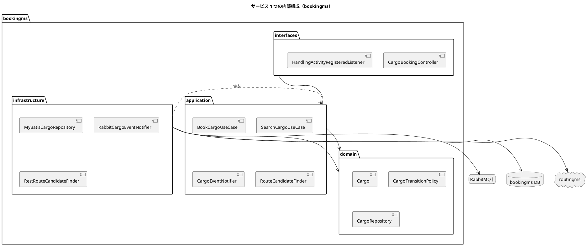
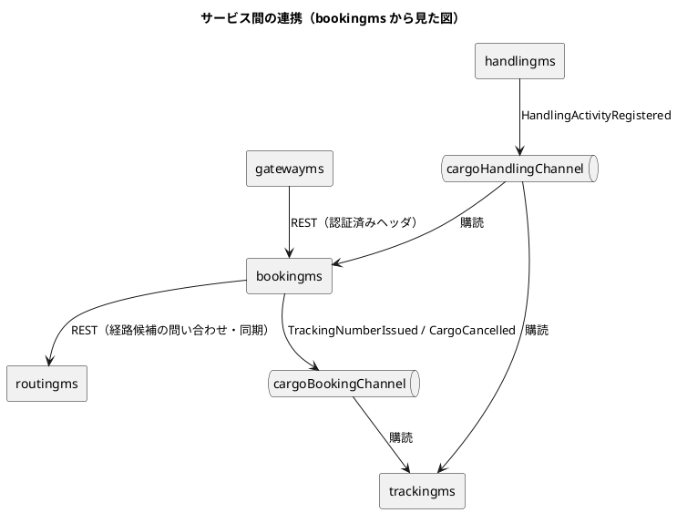

# 第 4 章：Spring Platform × EDA

第 3 章では、BC の境界を 1 つのプロセスの中に保ちました。この章では BC をプロセスごと分け、境界を越える通信をイベントとサービス間 API に置き換えます。

**参照元の実装が変わります。**第 3 章までが `docs/article/source/java-2`（モジュラーモノリス）だったのに対し、本章は `docs/article/source/java-3`（マイクロサービス）です。**続きではなく別実装であり、設計判断がそのまま引き継がれているわけではありません。**同じ Cargo Tracker を別の構成で実装したものとして読んでください。

以降のパスは `docs/article/source/java-3/apps/backend/` からの相対です。Java のパスは `<サービス>/src/main/java/com/example/` を省いて記します（`bookingms/domain/...` は `bookingms/src/main/java/com/example/bookingms/domain/...` を指します）。

## Spring プラットフォーム

### Spring Boot: 機能

**サービスごとに独立した Spring Boot アプリケーション**になります。起動クラスは各サービスに 1 つずつあり、第 3 章のような BC 一覧の宣言はありません。**サービスの一覧はビルドの構成が持ちます。**

```java
@SpringBootApplication
public class BookingApplication {

    public static void main(String[] args) {
        SpringApplication.run(BookingApplication.class, args);
    }
}
```

転記元: `bookingms/BookingApplication.java`

デプロイの単位は Gradle のモジュールです。第 3 章の実装が単一モジュールだったのに対し、こちらは **8 つのサービスと共有ライブラリ 1 つ**に分かれます。

```groovy
rootProject.name = 'cargo-tracker-microservices'

include 'shared'
include 'gatewayms'
include 'authms'
include 'bookingms'
include 'routingms'
include 'trackingms'
include 'handlingms'
include 'billingms'
include 'simulationms'
```

転記元: `settings.gradle`

各サービスが使う starter は、第 3 章とほぼ同じ顔ぶれに 1 つだけ加わります。

```groovy
implementation 'org.springframework.boot:spring-boot-starter-web'
implementation 'org.springframework.boot:spring-boot-starter-validation'
implementation 'org.springframework.boot:spring-boot-starter-actuator'
implementation 'org.mybatis.spring.boot:mybatis-spring-boot-starter:4.0.1'
implementation 'org.springframework.boot:spring-boot-starter-flyway'
implementation 'org.springframework.boot:spring-boot-starter-amqp'
```

転記元: `bookingms/build.gradle`

加わったのは `spring-boot-starter-amqp` です。**プロセスが分かれた瞬間に、メッセージングが必要になります。**第 3 章では BC 間の通知が `ApplicationEventPublisher` で足りていましたが、それは購読側が同じ JVM にいたからです。

画面用の starter（Thymeleaf）は消えています。画面は別のフロントエンドが担い、各サービスは REST を提供する側に回ります。

### Spring Cloud

第 3 章では採用していなかった Spring Cloud が、ここで初めて登場します。ただし**使うのは Gateway だけ**です。

```groovy
implementation 'org.springframework.cloud:spring-cloud-starter-gateway-server-webflux:5.0.1'
```

転記元: `gatewayms/build.gradle`

Gateway は入口を 1 つにまとめ、パスでサービスへ振り分けます。

```yaml
          routes:
            - id: authms
              uri: ${AUTHMS_URI:http://localhost:8081}
            - id: bookingms
              uri: ${BOOKINGMS_URI:http://localhost:8082}
            - id: routingms
              uri: ${ROUTINGMS_URI:http://localhost:8083}
              predicates:
                - Path=/api/v1/voyages/**,/api/v1/routes/**
```

転記元: `gatewayms/src/main/resources/application.yml`

Gateway が担うのは**認証と JWT の署名検証**です。各サービスは Gateway が付与した検証済みのヘッダを信頼し、**ロールに基づく認可だけ**を行います。

```java
/**
 * 予約コンテキストの REST エンドポイント。
 *
 * <p>HTTP と業務の境界である。<strong>ここで行うのはロールに基づく認可（403）だけ</strong>で、
 * 認証（401）と JWT の署名検証は API Gateway が担う（ADR-004）。Gateway が付与した
 * 検証済みクレーム（{@code X-Authenticated-*}）を信頼する。
 *
 * <p><strong>業務の不変条件をここに書かない。</strong> 入力検証は利用者への案内であり、
 * モデルの正しさはドメイン層が担保する。
 */
package com.example.bookingms.interfaces.rest;
```

転記元: `bookingms/interfaces/rest/package-info.java`

**Spring Cloud Stream は使っていません。**メッセージングは `spring-boot-starter-amqp`、つまり素の AMQP です。抽象化のレイヤを 1 枚重ねる代わりに、交換機とルーティングキーを自分で名指しする形を採っています。この選択の代償は、あとの「送信サービス：メッセージブローカー」で見ます。

### Spring Framework のまとめ

Spring の役割は第 3 章と変わりません。変わったのは**イベントの運び方**だけです。

| 機能 | 第 3 章（モジュラーモノリス） | 本章（マイクロサービス） |
| :--- | :--- | :--- |
| DI | 同じ | 同じ |
| 宣言的トランザクション | 同じ（1 DB） | サービスごとの DB に閉じる |
| イベント | `ApplicationEventPublisher` | RabbitMQ（`RabbitTemplate` / `@RabbitListener`） |
| Web | `@Controller`（画面） | `@RestController`（API） |

ドメイン層がフレームワークを知らない点も変わりません。

```java
/**
 * 業務の言葉と規則を置く層。もっとも内側であり、どの層にも依存しない。
 *
 * <p>構成の詳細は各サブパッケージの説明を参照。依存は常に外から内へ向かう。
 */
package com.example.bookingms.domain;
```

転記元: `bookingms/domain/package-info.java`

**この一貫性が、実装方式の切り替えを可能にしています。**第 3 章のドメイン層と本章のドメイン層は、置かれている技術基盤が違っても同じ規律で書かれています。

## EDA としての Cargo Tracker

### 境界づけられたコンテキスト

BC の切り方は第 3 章と同じです。変わったのは**境界の強度**です。

```java
/**
 * 予約コンテキスト（bookingms）。荷主管理・貨物予約・旅程管理・見積・状態遷移・キャンセル承認を責務とする。
 *
 * <p>本パッケージは境界付けられたコンテキストのルートである。マイクロサービスと BC は
 * 1 対 1 に対応し、独立した Spring Boot アプリケーションとしてデプロイする（ADR-001）。
 *
 * <p><strong>他のサービスのクラスを直接参照してはならない。</strong> 連携は HTTP または
 * メッセージング経由であり、共有してよいのは共有カーネル（{@code com.example.shared}）に
 * 限る。この前提は ArchUnit の {@code serviceIsolationRule} が検証する。
 */
package com.example.bookingms;
```

転記元: `bookingms/package-info.java`

第 3 章では「他の BC を直接参照してはならない」が**規律**でした。ここでは**クラスパスが分かれているため、参照しようとしてもコンパイルが通りません**。境界を守るコストは下がり、代わりに越境の手段を自分で作る必要が生まれます。

#### 境界づけられたコンテキスト：パッケージング

1 つの BC が 1 つの Gradle モジュールであり、1 つのデプロイ単位です。**データベースもサービスごとに分かれます**（Database per Service）。

`shared` モジュールだけが全サービスから参照されます。中身は 2 種類に限られます。

| 中身 | 置き場所 | 例 |
| :--- | :--- | :--- |
| 共有カーネル | `shared/domain/model` | `Location` |
| 認証の約束 | `shared/auth` | `AuthenticatedUser`・`Role` |

**業務の型は入りません。**ここに集約や業務イベントを置くと、片方の都合による変更が全サービスの再デプロイになります。

#### 境界づけられたコンテキスト：パッケージ構造

各サービスの内側は、第 3 章と同じ 4 層です。**プロセスを分けても、層の構成は変える理由がありません。**



##### インターフェース層（interfaces）

外部からの入口です。**入口が 2 種類に増えます。**

| パッケージ | 入口 |
| :--- | :--- |
| `interfaces/rest` | 画面・他サービスからの HTTP |
| `interfaces/events` | メッセージブローカーからのイベント |

```java
/**
 * イベント購読とメッセージ変換を置く package。
 * 他サービスから届く契約メッセージをユースケース呼び出しへ変換する。
 */
package com.example.bookingms.interfaces.events;
```

転記元: `bookingms/interfaces/events/package-info.java`

**イベントの購読は「入口」です。**インフラ層ではなくインターフェース層に置かれているのは、外から来る要求を受ける点で REST と同じ役割だからです。

##### アプリケーション層（application）

ユースケースと出力ポートを置きます。構成は第 3 章と同じ 3 つですが、クラス名の付け方が違います。

| パッケージ | 命名 |
| :--- | :--- |
| `commandservices` | `BookCargoUseCase`・`AssignRouteUseCase`（`UseCase` 接尾辞） |
| `queryservices` | `SearchCargoUseCase` |
| `outboundservices/acl` | `CargoEventNotifier`・`RouteCandidateFinder`（`Port` 接尾辞は付けない） |

```java
/**
 * 他サービスやメッセージングへ出るための ACL port を置く package。
 * 外部の型や通信方式をユースケースから隠す。
 */
package com.example.bookingms.application.internal.outboundservices.acl;
```

転記元: `bookingms/application/internal/outboundservices/acl/package-info.java`

**「外部の型や通信方式をユースケースから隠す」がこの層の役目です。**ユースケースは「追跡番号を発行したことを伝える」としか知らず、それが AMQP なのか HTTP なのかを知りません。

##### ドメイン層（domain）

業務の言葉と規則だけを置きます。第 3 章と同じく、フレームワークに依存しません。

サブパッケージの構成も第 3 章と同じです。`entities` を持つのは **routingms と trackingms の 2 つだけ**であり、bookingms の集約は値オブジェクトだけで足ります。**サービスに分けても、集約の内側に同一性が要るかどうかは業務が決めます。**

##### インフラストラクチャ層（infrastructure）

技術との接点です。**接点が 3 つに増えます。**

| パッケージ | 相手 |
| :--- | :--- |
| `infrastructure/repositories` | 自分のデータベース（MyBatis） |
| `infrastructure/acl` | 他サービス（REST）・メッセージブローカー（AMQP） |
| `infrastructure/config` | Bean の組み立て・交換機とキューの宣言 |

```java
/**
 * 外側の技術（DB・メッセージング・暗号）とのアダプタを置く層。
 *
 * <p>構成の詳細は各サブパッケージの説明を参照。依存は常に外から内へ向かう。
 */
package com.example.bookingms.infrastructure;
```

転記元: `bookingms/infrastructure/package-info.java`

### ドメインモデル：実装

#### コアドメインモデル：実装

##### 集約／エンティティ／値オブジェクト

###### 集約クラスの実装

Booking Context の集約ルートは第 3 章と同じ `Cargo` ですが、**実装が不変クラスになっています**。

```java
/**
 * 貨物予約（集約ルート）。
 *
 * <p>予約番号は永続化の経路（DB シーケンス）で採番する。集約側で組み立てると、
 * シーケンスと衝突した番号を発行できてしまう（[ADR-011]）。
 *
 * <p><strong>可否の判定は {@link CargoTransitionPolicy} が持つ。</strong>集約に散らすと、
 * 状態を足したときに直す場所が増える。復元は {@link CargoRestoration}、貨物仕様の
 * 不変条件は {@code CargoSpecificationRules} にある——どちらも責務が違う。
 */
public final class Cargo {

    private final Long id;
    private final BookingId bookingId;
    private final Long shipperId;
    private final CargoStatus status;
    private final CargoSpecification specification;
    private final RouteSpecification routeSpecification;
```

転記元: `bookingms/domain/model/aggregates/Cargo.java`

**フィールドがすべて `final` です。**状態を変える操作は自身を書き換えず、新しい `Cargo` を返します。

```java
    public Cargo requestRouting() {
        // 理由ごとに文言を分ける。断りの文言は「何を直せばよいか」を伝えるものであり、
        // 1 つにまとめると利用者は次に何をすればよいか分からない
        transitions().reasonCannotRequestRouting().ifPresent(reason -> {
            throw new IllegalStateException(reason);
        });
```

転記元: `bookingms/domain/model/aggregates/Cargo.java`

第 3 章の `Cargo` は可変で、`void assignToRouting()` が自身の状態を進めていました。**同じ業務、同じ集約でも、実装の選択は 1 つに定まりません。**不変にすると、途中の状態を持つインスタンスが存在しなくなる代わりに、全項目を運ぶ写しの生成が必要になります。

```java
    /**
     * <p><strong>書き忘れると、その項目だけが読み戻しで消える。</strong>写しを作る道具は
     * 全項目を運ぶ責任を持つ。
     */
    private Cargo withHandling(CargoStatus newStatus, String locationUnLocode, Instant at,
            Misroute newMisroute) {
```

転記元: `bookingms/domain/model/aggregates/Cargo.java`

###### 業務属性によるドメインの豊かさ

集約は業務の操作と、その可否を答える述語を対で持ちます。ここは第 3 章と同じ形です。

```java
    /**
     * いま経路設計を依頼できるか。
     *
     * <p><strong>可否は集約が答える。</strong>画面やモックが状態名を見比べて同じ判断を
     * 組み立てると、規則が 3 か所に分かれ、片方だけ直る形になる（IT6 ふりかえり Try 5）。
     */
    public boolean canRequestRouting() {
        return transitions().reasonCannotRequestRouting().isEmpty();
    }
```

転記元: `bookingms/domain/model/aggregates/Cargo.java`

**分散すると、この規律の重みが増します。**画面が別のプロセスにいる以上、画面側で状態名を見比べて判断を組み立てることは技術的に容易です。それをやると、規則がサービスとフロントエンドの 2 か所に分かれ、片方だけが更新されます。

もう 1 つ、分散ならではの工夫があります。**できない理由を返す述語**です。

```java
    public Optional<String> reasonCannotCancel() {
```

転記元: `bookingms/domain/model/aggregates/Cargo.java`

`boolean` ではなく理由の文字列を返します。API の向こう側にいる利用者は、断られたときに**何を直せばよいか**を画面から知る必要があります。

###### エンティティ／値オブジェクトの実装

値オブジェクトは `record` です。第 3 章と同じ方針であり、集約の状態の大半を値オブジェクトが占めます。

エンティティを持つのは routingms（`RouteRecommendation`）と trackingms（`TrackingExceptionEvent`）です。**第 3 章と同じ 2 つの BC** であり、プロセスを分けたことによる変化はありません。

共有カーネルはさらに絞られ、**`Location` の 1 つだけ**になりました。第 3 章では `ShipperId` も共有していましたが、荷主が bookingms の内側に入ったため共有する理由が消えています。

```java
package com.example.shared.domain.model;
```

転記元: `shared/src/main/java/com/example/shared/domain/model/Location.java`

#### ドメインモデルの操作

##### コマンド

コマンドは**素の値で受けます**。

```java
/**
 * 貨物予約の登録要求。
 *
 * <p>地点は UN/LOCODE のまま受け取り、実在の確認と業務タイムゾーンの解決はユースケースが行う。
 * ここで {@code Location} に変換すると、存在しない地点コードが「名称不明の地点」として通る。
 */
public record BookCargoCommand(
        Long shipperId,
        CargoType type,
        BigDecimal weightKg,
        Integer quantity,
        String description,
```

転記元: `bookingms/domain/model/commands/BookCargoCommand.java`

第 3 章の `BookCargoCommand` が `CargoSpecification` や `RouteSpecification` という値オブジェクトを受け取っていたのに対し、こちらは `BigDecimal` と `String` で受けます。**組み立ては境界の外で行い、検証はユースケースが行う**という分担です。

理由は Javadoc にあるとおりで、**実在の確認がデータベースを要する**ためです。地点マスタを引かずに `Location` を作ると、存在しないコードが型の上では正しいものとして通ってしまいます。

##### クエリ

読み取りは専用のユースケースです。

```java
/**
 * 貨物予約を探す。
 *
 * <p>件数の上限を必ず置く。上限が無いと、予約が増えた日に一覧が開かなくなる。
 * 上限で切ったことは総件数と合わせて示す（黙って切ると「全件見た」と受け取られる）。
 */
@Service
public class SearchCargoUseCase {

    /** 一覧に返す件数の上限。 */
    public static final int DEFAULT_LIMIT = 100;
```

転記元: `bookingms/application/internal/queryservices/SearchCargoUseCase.java`

返すのは集約ではなく `CargoSummary` の一覧です。第 3 章の `BookingView` と同じ考え方であり、**集約を API の向こうへ出しません**。

分散で新しく要るのが**上限と切り捨ての明示**です。

```java
    public record Result(List<CargoSummary> cargoes, long totalCount, int limit) {

        /** 上限で切られているか。画面が「全件ではない」ことを示せるようにする。 */
        public boolean truncated() {
            return totalCount > cargoes.size();
        }
    }
```

転記元: `bookingms/application/internal/queryservices/SearchCargoUseCase.java`

**黙って切ると「全件見た」と受け取られます。**同一プロセスなら呼び出し側がページングの都合を知っていますが、API の向こう側は知りません。

##### ドメインイベント

BC をまたぐ通知はイベントです。ここが第 3 章から最も大きく変わります。

イベントの型は `shared` ではなく、**発行側のアプリケーション層**に置かれます。

```java
/**
 * 追跡番号を発行したことを、他のサービスへ伝える中身（[ADR-022] 決定 2）。
 *
 * <p>載せるのは<strong>相手が自分の集約を作るのに要るもの</strong>だけである。ID だけだと
 * trackingms が bookingms へ問い合わせることになり、非同期にした意味が消える
 * （同期の依存が戻り、bookingms が落ちていると追跡が作れない）。予約の全部も載せない——
 * 載せるほど受け手が Booking の言葉に縛られる。
 *
 * <p>ここは <strong>application/port</strong> にある。ドメインもユースケースも「何を伝えるか」
 * だけを知り、AMQP か Kafka かは知らない。
 */
public record TrackingNumberIssued(
        String trackingNumber,
        String bookingId,
        String originUnLocode,
        String destinationUnLocode,
        LocalDate arrivalDeadline,
        LocalDate estimatedArrival,
        Instant occurredAt) {
}
```

転記元: `bookingms/application/internal/outboundservices/acl/TrackingNumberIssued.java`

**何を載せるかが設計判断になります。**ID だけだと受け手が問い合わせに来るため、非同期にした意味が消えます。全部載せると、受け手が発行側の語彙に縛られます。その中間を選ぶのがイベントの設計です。

型を共有しない代わりに、**契約を共有します**。

```java
/**
 * 追跡番号を発行したことのイベント契約（[ADR-022]）。
 *
 * <p><strong>両側が同じ 1 つを読む。</strong>これまでは項目の名簿と交換機・ルーティングキーが
 * プロデューサ側（bookingms）とコンシューマ側（trackingms）の両方に写しとして置かれていた。
 * 写しがずれると「送っているのに届かない」形で壊れ、しかも<strong>送り手はエラーにならない</strong>。
 *
 * <p>ここに置くのは<strong>契約であって実装ではない</strong>。イベントの DTO は BC ごとに
 * 持つ（相手の型を持ち込まない）。共有するのは「両者が合意した名前と項目」だけである。
 */
public final class TrackingNumberIssuedContract {
```

転記元: `shared/src/testFixtures/java/com/example/shared/contract/TrackingNumberIssuedContract.java`

置き場所が `testFixtures` である点が重要です。**本番のコードはこれを読みません。**読ませると業務の契約が共有カーネルに入り込み、片方の変更が両サービスの再デプロイになります。

契約は項目だけではありません。**交換機そのものも契約です。**

```java
/**
 * 交換機そのものの契約（[ADR-022] 決定 4）。
 *
 * <p><strong>名前が一致しているだけでは足りない。</strong>交換機は、耐久性・自動削除・引数まで
 * 含めて同じでなければ再宣言できない。食い違うと、後から接続したほうが
 * {@code PRECONDITION_FAILED - inequivalent arg} で落ちる。しかも既存の交換機は
 * <strong>宣言し直せない</strong>ため、落ちたサービスは後続のキュー宣言まで止まる。
 *
 * <p>IT7 の kind 統合で実際に踏んだ。Testcontainers は毎回まっさらな交換機を作るので、
 * <strong>この壊れ方はテストでは出ない</strong>。守っているのが各サービスのコメントだけ
 * だったため、契約として置き直す。
 */
public final class EventExchangeContract {
```

転記元: `shared/src/testFixtures/java/com/example/shared/contract/EventExchangeContract.java`

**テストが通ることと、実環境で動くことは同じではありません。**毎回まっさらな環境を作るテストでは、既存の交換機と食い違うという壊れ方が原理的に起きません。

#### ドメインモデルサービス

##### 受信サービス

###### REST API

第 3 章では**存在しなかった** REST API が、ここでは中心的な入口になります。

```java
@RestController
@RequestMapping("/api/v1/bookings")
public class CargoBookingController {

    private final BookingUseCases useCases;
    private final CargoRepository cargoes;
    private final LocationRepository locations;
    private final Validator validator;
```

転記元: `bookingms/interfaces/rest/CargoBookingController.java`

利用者の情報は Gateway が付けたヘッダから受け取ります。

```java
    @GetMapping
    public BookingListResponse search(
            @RequestHeader(AuthenticatedUser.USER_ID_HEADER) String userId,
            @RequestHeader(name = AuthenticatedUser.ROLES_HEADER, required = false) String roles,
```

転記元: `bookingms/interfaces/rest/CargoBookingController.java`

入口が使うユースケースは 1 つにまとめて注入します。

```java
/**
 * 貨物予約の入口が使うユースケースをまとめる。
 *
 * <p>予約は 1 つの画面から複数の操作（登録・検索・引き渡し・経路の割り当て・差し戻し）を
 * 行うため、入口が扱うユースケースが増え続ける。**引数の並びで受け取ると、足すたびに
 * コンストラクタが伸び、テストの組み立ても壊れる**。まとめて 1 つで受ける。
 *
 * <p>まとめるのは「入口が使うもの」であって、業務上の関係ではない。ユースケースどうしは
 * ここでも互いを知らない。
 */
@Component
public record BookingUseCases(
        BookCargoUseCase bookCargo,
        SearchCargoUseCase searchCargo,
```

転記元: `bookingms/interfaces/rest/BookingUseCases.java`

###### イベントハンドラ

もう 1 つの入口がメッセージの購読です。**相手の型は使いません。**

```java
/**
 * handlingms のイベントを受ける、<strong>bookingms 側の</strong>受け皿
 * （[ADR-023] 決定 5・[ADR-025] 決定 1）。
 *
 * <p>相手の型を直接デシリアライズすると、相手のドメインの変更がこちらのコンパイルを壊す。
 * <strong>知らない項目は無視する</strong>（相手が項目を足しても、こちらは壊れない）。
 *
 * <p>trackingms にも同じ形の受け皿がある。<strong>共有しない</strong>——共有すると、
 * 片方の都合で項目を足したときにもう片方が巻き込まれる（BC の独立性）。
 */
public record HandlingActivityRegisteredMessage(String trackingNumber, String bookingId,
        String type, String locationUnLocode, Instant completionTime, String voyageNumber,
        boolean offRoute, Instant occurredAt) {
}
```

転記元: `bookingms/interfaces/events/HandlingActivityRegisteredMessage.java`

**同じイベントに対して、購読側の数だけ受け皿があります。**重複に見えますが、共有すると片方の都合がもう片方を巻き込みます。第 3 章で値オブジェクトの重複を「境界を分けた代金」と呼んだのと同じ構図です。

購読そのものは薄く保ちます。

```java
    @RabbitListener(queues = CargoEventChannels.HANDLING_QUEUE)
    public void onHandlingActivityRegistered(HandlingActivityRegisteredMessage message) {
        // **offRoute はイベントが運ぶ**（[ADR-022] の契約に既にある・[ADR-026] 決定 1）。
        // 新しいイベントを作らない——交換機を増やすほど移行の手順が要る
        advanceBooking.advance(message.trackingNumber(), message.type(),
                message.locationUnLocode(), message.completionTime(), message.offRoute());
    }
```

転記元: `bookingms/interfaces/events/HandlingActivityRegisteredListener.java`

例外の扱いが第 3 章と対照的です。

```java
/**
 * 「荷役作業を記録した」を受け取って予約を進める（US30・[ADR-025] 決定 1）。
 *
 * <p><strong>例外を握りつぶさない。</strong>握りつぶすと、受け取れなかったイベントが
 * 正常に処理されたことになり、デッドレターにも届かない（[ADR-022] 決定 4）。
 */
@Component
public class HandlingActivityRegisteredListener {
```

転記元: `bookingms/interfaces/events/HandlingActivityRegisteredListener.java`

第 3 章では、取りこぼしを捕まえて件数に記録していました。ここでは**捕まえないことが正解**です。例外がブローカーまで伝わることで、メッセージがデッドレターキューへ回されます。**失敗を引き受ける仕組みが基盤側にあるかどうかで、正しい書き方が反転します。**

##### アプリケーションサービス

###### アプリケーションサービス：コマンド／クエリの委譲

ユースケースの役割は第 3 章と同じです。**入力の実在確認・集約の生成・保存**を順に行い、業務のルールは集約に委ねます。

```java
    public Cargo book(BookCargoCommand command) {
        if (command.shipperId() == null || shippers.findById(command.shipperId()).isEmpty()) {
            throw new IllegalArgumentException("指定された荷主が見つかりません: " + command.shipperId());
        }

        Location origin = locationOf(command.originUnLocode(), "出発地");
        Location destination = locationOf(command.destinationUnLocode(), "目的地");

        // 到着期限は目的地の暦で判断する。UTC で判断すると、時差の分だけ
        // 受付が拒否される時間帯ができる（ADR-010）
        ZoneId destinationZone = locations.timeZoneOf(command.destinationUnLocode())
                .orElseThrow(() -> new IllegalArgumentException(
                        "目的地の業務タイムゾーンが登録されていません: " + command.destinationUnLocode()));

        RouteSpecification route = RouteSpecification.of(origin, destination,
                command.departureDate(), command.arrivalDeadline(), destinationZone, clock);

        return cargoes.save(Cargo.book(command.shipperId(), specificationOf(command), route));
    }
```

転記元: `bookingms/application/internal/commandservices/BookCargoUseCase.java`

役割分担も明文化されています。

```java
 * <p>荷主と地点が実在することはここで確かめる。集約は「実在するもの同士の組み合わせ」の
 * 妥当性だけを見る。存在しない荷主 ID を通すと、誰の貨物か分からない予約が保存される。
 */
@Service
public class BookCargoUseCase {
```

転記元: `bookingms/application/internal/commandservices/BookCargoUseCase.java`

**第 3 章で「BC をまたぐ確認だから集約の外」と説明した境目が、ここでは「自分の DB を引く必要があるから集約の外」に変わっています。**理由は違いますが、結論は同じです。集約は自分が持つ値だけで判断できることを判断します。

##### 送信サービス

出力ポートはアプリケーション層に定義し、実装をインフラ層に置きます。この形も第 3 章と同じです。**相手が 3 種類に増えます。**

###### 送信サービス：リポジトリクラス

自分のデータベースへの永続化です。実装は MyBatis で、第 3 章と同じ構成です。

```java
package com.example.bookingms.infrastructure.repositories;

import com.example.bookingms.domain.repository.CargoRepository;
```

転記元: `bookingms/infrastructure/repositories/MyBatisCargoRepository.java`

変わったのは**データベースがサービス専用になった**ことです。第 3 章では 1 つのデータベースに全 BC のテーブルがあり、JOIN しようと思えばできました。ここでは他サービスのテーブルは接続先にすら存在しません。

###### 送信サービス：REST API

他サービスへの同期呼び出しです。**イベント駆動にしても、すべてが非同期になるわけではありません。**

```java
/**
 * 経路候補を routingms へ取りに行く ACL（[ADR-019]）。
 *
 * <p>routingms の型はここから先へ出さない。{@link RouteCandidateResponse} で受け、
 * Booking Context の {@link CargoItinerary} へ変換する。
 *
 * <p><strong>利用者ヘッダ（[ADR-007]）は伝播しない。</strong>この呼び出しは
 * 「システムが経路候補を引く」ものであり、利用者の代理ではない。伝播すると、
 * routingms 側の認可が「呼び出し元の利用者が経路設計者か」を見ることになり、
 * bookingms の中で完結する処理（確定時の再検証）がロールに依存する。
 * サービス間の信頼はネットワーク境界（Gateway より内側）で担保する。
 */
public class RestRouteCandidateFinder implements RouteCandidateFinder {
```

転記元: `bookingms/infrastructure/acl/RestRouteCandidateFinder.java`

**問い合わせは同期、通知は非同期**という分け方です。経路候補は「いま答えが要る」ものであり、イベントで解決できません。

呼び出し元が誰かという問題も生まれます。

```java
    /**
     * このサービス自身を表す主体。
     *
     * <p>利用者 ID と取り違えられない形にする。利用者と同じ見た目にすると、監査ログで
     * 「誰がやったのか」が分からなくなる。
     */
    public static final String SYSTEM_PRINCIPAL = "system:bookingms";
```

転記元: `bookingms/infrastructure/acl/RestRouteCandidateFinder.java`

**同一プロセスなら存在しなかった問題です。**メソッド呼び出しに「誰として呼ぶか」はありません。

###### 送信サービス：メッセージブローカー

イベントの発行です。**ここだけがメッセージ基盤を知ります。**

```java
/**
 * 予約のイベントを RabbitMQ へ流す（[ADR-022]）。
 *
 * <p><strong>ここだけがメッセージ基盤を知る。</strong>ドメインもユースケースも
 * {@link CargoEventNotifier} という「何を頼むか」しか知らない
 * （`eventPublishingOnlyInMessagingInfrastructureRule` が検査する）。
 */
public class RabbitCargoEventNotifier implements CargoEventNotifier {

    private final RabbitTemplate rabbitTemplate;
```

転記元: `bookingms/infrastructure/acl/RabbitCargoEventNotifier.java`

発行のタイミングが重要です。

```java
    /**
     * コミットしたあとに送る（[ADR-022] 決定 6）。
     *
     * <p>コミット前に出すと、<strong>ロールバックした予約のイベントが飛ぶ</strong>。
     * 存在しない予約の追跡ができ、荷主は追えるのに貨物が無い状態になる。
     *
     * <p><strong>ここで決めるのは、トランザクションの境目がインフラの関心だからである。</strong>
     * ユースケースに「コミット後に呼べ」と作法を課すと、入口が増えた数だけ破られる。
     */
    private void afterCommit(Runnable send) {
        if (!TransactionSynchronizationManager.isSynchronizationActive()) {
            send.run();
            return;
        }
```

転記元: `bookingms/infrastructure/acl/RabbitCargoEventNotifier.java`

第 3 章の `@TransactionalEventListener(AFTER_COMMIT)` と**同じ判断を、自分で書いています**。Spring が購読側で用意していた仕組みが、プロセスをまたぐと発行側の責務になります。

流れ先の名前は定数にまとめます。

```java
/**
 * イベントの流れ先の名前（[ADR-022]）。
 *
 * <p>文字列を配線のあちこちに書くと、片方だけ直したときに「送っているのに届かない」形で壊れる。
 * 送り手と受け手は別のサービスなので、<strong>名前は写しになる</strong>。写しであることを
 * 契約テストが突き合わせる。
 */
public final class CargoEventChannels {

    public static final String EXCHANGE = "cargoBookingChannel";

    /** 追跡番号を発行したことのルーティングキー。 */
    public static final String TRACKING_NUMBER_ISSUED = "cargo.tracking-number-issued";
```

転記元: `bookingms/infrastructure/acl/CargoEventChannels.java`

**「届かない」を防ぐ仕掛けが 2 段あります。**

```java
    /** 荷役のイベントのデッドレター。 */
    public static final String HANDLING_DEAD_LETTER_QUEUE =
            "bookingms.handling-activity-registered.dlq";

    /**
     * どのキューにも結びつかなかったイベントの行き先（[ADR-022] 決定 4）。
     *
     * <p>デッドレターが守るのは「受け取ったが処理できなかった」だけである。ルーティングキーの
     * 綴りが違う・購読側がまだ配線されていない場合、イベントは<strong>どのキューにも入らず
     * 黙って消える</strong>。しかも発行側は成功を返すため、どこにも異常が残らない。
     *
     * <p>交換機に予備の行き先（alternate-exchange）を持たせ、行き場のないイベントをここへ流す。
     */
    public static final String UNROUTABLE_EXCHANGE = "cargo.unroutable";
```

転記元: `bookingms/infrastructure/acl/CargoEventChannels.java`

デッドレターが守るのは「受け取ったが処理できなかった」だけです。**綴り違いや配線漏れは、デッドレターに入る前に消えます。**この 2 つは守る範囲が違うため、両方が要ります。

#### 実装のまとめ

第 3 章と本章で、DDD の成果物の実装がどう変わったかを並べます。

| 成果物 | 第 3 章（モジュラーモノリス） | 本章（マイクロサービス） |
| :--- | :--- | :--- |
| BC の単位 | トップレベルパッケージ | Gradle モジュール = デプロイ単位 |
| BC 間の境界 | ArchUnit で守る規律 | クラスパスが分かれ、参照できない |
| 集約 | 可変クラス | 不変クラス（操作が新インスタンスを返す） |
| エンティティ | 2 BC に存在（routing・tracking） | 同じ 2 サービスに存在 |
| 共有カーネル | `Location`・`ShipperId` の 2 つ | `Location` の 1 つ |
| コマンド | 値オブジェクトを受ける | 素の値を受ける（実在確認が DB を要する） |
| BC 間の問い合わせ | ACL ポート（メソッド呼び出し） | ACL ポート（REST） |
| BC 間の通知 | `ApplicationEventPublisher` | RabbitMQ（交換機・ルーティングキー） |
| 発行のタイミング | `@TransactionalEventListener(AFTER_COMMIT)` | 発行側で `afterCommit` を自作 |
| 購読の失敗 | 捕まえて件数に記録する | 捕まえない（デッドレターへ回す） |
| イベントの型 | `shared/domain/event` に 1 つ | 発行側と購読側が別々に持つ |
| 型の共有 | 同じ `record` を参照 | 契約（`testFixtures`）だけを共有 |
| 入口 | 画面（Thymeleaf + htmx） | REST + イベント購読 |
| データベース | 1 つ（全 BC 共通） | サービスごと |



**左で 1 行だったものが、右では 1 節になります。**同じ「BC 間の通知」が、片方では 1 つのアノテーションで済み、もう片方では交換機・ルーティングキー・受け皿・契約・デッドレター・予備の行き先を要します。

### まとめ

- 参照元が第 3 章と異なり、8 つのサービスに分かれたマイクロサービス実装です。**続きではなく別実装**であり、同じ業務を別の構成で実装したものとして読む必要があります。
- 4 層のパッケージ構造は変わりません。**プロセスを分けても、層の構成を変える理由はありません。**変わったのは外側との接点の数（DB・他サービス・ブローカー）です。
- 境界を守るコストは下がりました。他サービスのクラスは参照しようとしてもコンパイルが通りません。代わりに、越境の手段（REST・イベント・契約）を自分で作る必要が生まれます。
- 第 3 章でフレームワークが与えていた保証が、いくつか手作業に変わりました。コミット後の発行、イベントの型の一致、失敗の記録がその例です。**保証が消えたのではなく、誰が引き受けるかが変わっています。**
- 購読の失敗に対する正しい書き方は、第 3 章と**逆になりました**。基盤が失敗を引き受ける仕組み（デッドレター）を持つかどうかで、例外を捕まえるべきかが反転します。**プラクティスは文脈を伴って初めて意味を持ちます。**

イベント駆動にしても、集約の現在状態を直接読み書きする点は第 3 章と同じです。次章では、状態そのものをイベントの列として保存する方式（Event Sourcing）と、読み書きを別のモデルに分ける CQRS を扱います。
