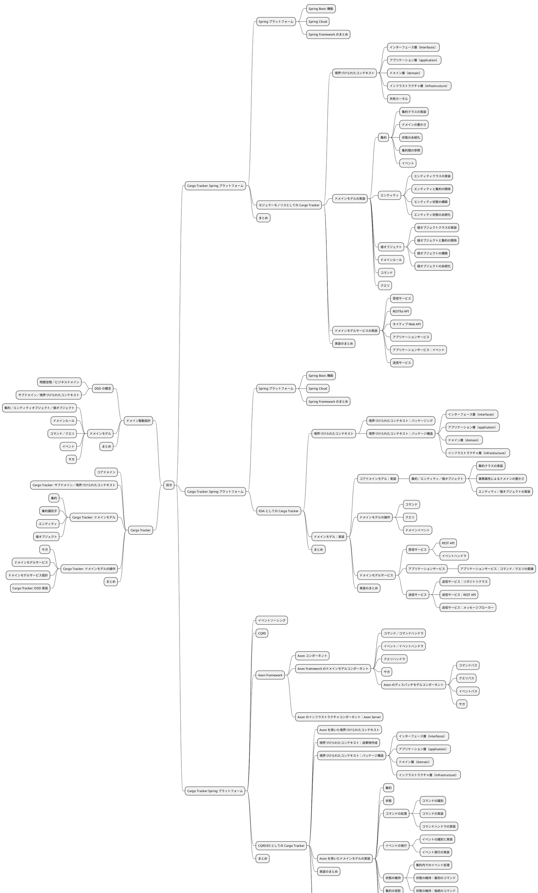

# エンタープライズ Java における実践的ドメイン駆動設計 — アウトライン

## 1. 記事の位置づけ

| 項目 | 内容 |
| :--- | :--- |
| タイトル | エンタープライズ Java における実践的ドメイン駆動設計 |
| 題材 | Cargo Tracker（国際貨物輸送管理） |
| 主眼 | DDD の概念を Cargo Tracker 実装へ落とし、Spring Platform で段階的に実装戦略を比較する |
| 想定読者 | DDD の基礎を知っており、Java/Spring で実装判断を具体化したい開発者 |

## 2. 章構成（章別計画）

| 章 | 仮ファイル名 | 主題 | この章で示すこと |
| :--- | :--- | :--- | :--- |
| 第 1 章 | `01-ddd-fundamentals.md` | ドメイン駆動設計 | 問題空間、サブドメイン、境界づけられたコンテキスト、集約、イベント、サガの最小整理 |
| 第 2 章 | `02-cargo-domain-model.md` | Cargo Tracker のドメインモデル | コアドメイン、集約識別子、エンティティ、値オブジェクト、ドメインサービス設計 |
| 第 3 章 | `03-spring-modular-monolith.md` | Spring Platform × モジュラーモノリス | BC 単位の実装、受信/送信サービス、RESTful API、アプリケーションサービス |
| 第 4 章 | `04-spring-eda.md` | Spring Platform × EDA | パッケージ構造（interfaces/application/domain/infrastructure）とドメインイベント中心の実装 |
| 第 5 章 | `05-spring-cqrs-es-axon.md` | Spring Platform × CQRS/ES（Axon） | イベントソーシング、CQRS、Axon コンポーネントによるモデル/サービス実装 |
| 第 6 章 | `06-conclusion.md` | まとめ | 3 つの実装アプローチ（モノリス/EDA/CQRS-ES）の使い分け指針 |

## 3. 各章の共通フォーマット

1. 章のゴール
2. 設計（DDD 観点）
3. 実装（コード/パッケージ/責務分離）
4. トレードオフ（採用理由と非採用理由）
5. 章末まとめ

## 4. 執筆順序

1. 第 1 章（DDD の前提）
2. 第 2 章（Cargo Tracker 固有モデル）
3. 第 3〜5 章（実装アプローチ比較）
4. 第 6 章（比較結果と選択指針）

## 5. 各章の詳細展開

各章の節構成は冒頭のマインドマップに対応します。用語表記は[用語対応表](glossary.md)を正とします。

### 第 1 章：ドメイン駆動設計

- DDD の概念
  - 問題空間／ビジネスドメイン
  - サブドメイン／境界づけられたコンテキスト
- ドメインモデル
  - 集約／エンティティオブジェクト／値オブジェクト
  - ドメインルール
  - コマンド／クエリ
  - イベント
  - サガ
- まとめ

### 第 2 章：Cargo Tracker のドメインモデル

- コアドメイン
- Cargo Tracker: サブドメイン／境界づけられたコンテキスト
- Cargo Tracker: ドメインモデル
  - 集約
  - 集約識別子
  - エンティティ
  - 値オブジェクト
- Cargo Tracker: ドメインモデルの操作
  - サガ
  - ドメインモデルサービス
  - ドメインモデルサービス設計
  - Cargo Tracker: DDD 実装
- まとめ

### 第 3 章：Spring Platform × モジュラーモノリス

- Spring プラットフォーム
  - Spring Boot: 機能
  - Spring Cloud
  - Spring Framework のまとめ
- モジュラーモノリスとしての Cargo Tracker
  - 境界づけられたコンテキスト
    - インターフェース層（interfaces）
    - アプリケーション層（application）
    - ドメイン層（domain）
    - インフラストラクチャ層（infrastructure）
    - 共有カーネル
  - ドメインモデルの実装
    - 集約
      - 集約クラスの実装
      - ドメインの豊かさ
      - 状態の永続化
      - 集約間の参照
      - イベント
    - エンティティ
      - エンティティクラスの実装
      - エンティティと集約の関係
      - エンティティ状態の構築
      - エンティティ状態の永続化
    - 値オブジェクト
      - 値オブジェクトクラスの実装
      - 値オブジェクトと集約の関係
      - 値オブジェクトの構築
      - 値オブジェクトの永続化
    - ドメインルール
    - コマンド
    - クエリ
  - ドメインモデルサービスの実装
    - 受信サービス
    - RESTful API
    - ネイティブ Web API
    - アプリケーションサービス
    - アプリケーションサービス：イベント
    - 送信サービス
  - 実装のまとめ
- まとめ

### 第 4 章：Spring Platform × EDA

- Spring プラットフォーム
  - Spring Boot: 機能
  - Spring Cloud
  - Spring Framework のまとめ
- EDA としての Cargo Tracker
  - 境界づけられたコンテキスト
    - 境界づけられたコンテキスト：パッケージング
    - 境界づけられたコンテキスト：パッケージ構造
      - インターフェース層（interfaces）
      - アプリケーション層（application）
      - ドメイン層（domain）
      - インフラストラクチャ層（infrastructure）
  - ドメインモデル：実装
    - コアドメインモデル：実装
      - 集約／エンティティ／値オブジェクト
        - 集約クラスの実装
        - 業務属性によるドメインの豊かさ
        - エンティティ／値オブジェクトの実装
    - ドメインモデルの操作
      - コマンド
      - クエリ
      - ドメインイベント
    - ドメインモデルサービス
      - 受信サービス
        - REST API
        - イベントハンドラ
      - アプリケーションサービス
        - アプリケーションサービス：コマンド／クエリの委譲
      - 送信サービス
        - 送信サービス：リポジトリクラス
        - 送信サービス：REST API
        - 送信サービス：メッセージブローカー
    - 実装のまとめ
  - まとめ

### 第 5 章：Spring Platform × CQRS/ES（Axon）

- イベントソーシング
- CQRS
- Axon Framework
  - Axon コンポーネント
  - Axon Framework のドメインモデルコンポーネント
    - コマンド／コマンドハンドラ
    - イベント／イベントハンドラ
    - クエリハンドラ
    - サガ
    - Axon のディスパッチモデルコンポーネント
      - コマンドバス
      - クエリバス
      - イベントバス
      - サガ
  - Axon のインフラストラクチャコンポーネント：Axon Server
- CQRS/ES としての Cargo Tracker
  - Axon を用いた境界づけられたコンテキスト
  - 境界づけられたコンテキスト：成果物作成
  - 境界づけられたコンテキスト：パッケージ構造
    - インターフェース層（interfaces）
    - アプリケーション層（application）
    - ドメイン層（domain）
    - インフラストラクチャ層（infrastructure）
  - Axon を用いたドメインモデルの実装
    - 集約
    - 状態
    - コマンドの処理
      - コマンドの識別
      - コマンドの実装
      - コマンドハンドラの実装
    - イベントの発行
      - イベントの識別と実装
      - イベント発行の実装
    - 状態の維持
      - 集約内でのイベント処理
      - 状態の維持：最初のコマンド
      - 状態の維持：後続のコマンド
    - 集約の投影
    - クエリハンドラ
      - クエリの識別
      - クエリの実装
      - クエリハンドラの実装
    - サガ
  - 実装のまとめ
  - Axon を用いたドメインモデルサービスの実装
    - 受信サービス
      - REST API
      - イベントハンドラ
  - アプリケーションサービス
- まとめ

### 第 6 章：まとめ

マインドマップには対応ノードを持たない、シリーズ全体を締める章です。

- 3 つの実装アプローチの比較
  - モジュラーモノリス
  - EDA
  - CQRS/ES（Axon）
- 適用判断の観点
  - チーム規模と運用コスト
  - 境界づけられたコンテキストの独立性
  - 同期／非同期の整合性要件
- 次の実装ステップ
