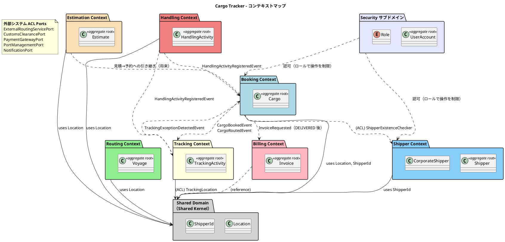

# 第 1 章：ドメイン駆動設計 — 概念と、この実装での対応物

このシリーズは、国際貨物輸送管理システム **Cargo Tracker** を題材に、DDD の概念が Java と Spring のコードとしてどこに現れるかを追います。

扱うのは 1 つの実装 —— `docs/article/source/java-2/` に収録された Spring Boot 実装です。20 イテレーションを経て出荷され、7 つの業務コンテキストと支援サブドメイン、25 本の ADR を持ちます。

**この実装は、書籍『Practical Domain-Driven Design in Enterprise Java』の構造を実際に適用したものです。** 設計ドキュメントは「Practical DDD in Enterprise Java (Chapter 3) のパッケージ構造に準拠する」と明記し、ADR は同書の `bookingms` を参照実装として名指ししています。**したがって本シリーズは書籍の要約ではなく、適用した結果の報告です。**

そして報告である以上、**うまくいかなかった箇所も同じ比重で扱います。** 書籍の構成を写したまま使って壊れた箇所があり、設計ドキュメントが実装から離れた箇所があります。それらは瑕疵ではなく、この記事が書くに値する部分です。

## この章のゴール

1. DDD の各要素が、この実装のどのパッケージ・どの型に対応するかを言えること
2. **対応物が無い要素については「無い」と言えること**
3. 第 2 章・第 3 章のどこに何が書いてあるかを把握すること

**この章は地図です。** 個々のモデルは[第 2 章](02-cargo-domain-model.md)、Spring 上の配置と検査は[第 3 章](03-spring-modular-monolith.md)で扱います。

## 問題空間 — 何を解こうとしているか

Cargo Tracker が扱うのは、国際貨物輸送の一連の業務です。

| 業務 | 内容 |
| :--- | :--- |
| 見積 | 輸送の概算を出す |
| 予約 | 荷主から貨物を預かる |
| 経路設計 | 航海スケジュールから経路を組む |
| 追跡 | 輸送中の状態と例外を追う |
| 荷役 | 積み込み・陸揚げ・引き渡しを記録する |
| 精算 | 請求し、入金を確認する |

**モデルを分ける線は、この業務の切れ目に引かれています。** Web 層・サービス層・DB 層といった技術の層で分けるのではありません。技術で分けると、1 つの業務変更がすべての層に波及します。

## サブドメインと境界づけられたコンテキスト

業務の切れ目が、そのまま境界づけられたコンテキスト（BC）になります。



転記元: [`docs/design/domain-model.md`](../../source/java-2/docs/design/domain-model.md)

**この図は設計であり、いくつかの点で実装と一致しません。** `CargoBookedEvent` と `TrackingExceptionDetectedEvent` は実装に存在せず、`InvoiceRequested` も同様です。実在するイベントは後述の 9 件です。

**読み方の注意として、これを最初に置いておきます。** この実装の設計ドキュメントは丁寧に書かれていますが、20 イテレーションのあいだに実装が動いた分だけ古くなっています。本シリーズは、**設計ドキュメントの記述と実コードを区別して示し、食い違いは食い違いとして扱います。**

### 業務パッケージは 7 つ、それに支援サブドメインが 1 つ

| パッケージ | 位置づけ |
| :--- | :--- |
| `booking` / `shipper` / `routing` / `tracking` / `handling` / `billing` / `estimation` | 業務の BC |
| `security` | 認証・認可の支援サブドメイン（ADR-007。業務 BC ではない） |
| `shared` | 共有カーネル（`Location` と `ShipperId` の 2 つのみ —— ADR-005） |

`handling` は当初 `tracking` の一部として設計されており（ADR-002）、後から独立した BC に昇格しました（ADR-010）。**境界の数は、設計時に決めて終わりにはなりませんでした。**

そのため、**起動クラスの Javadoc も設計ドキュメントの前文も「6 つ」と書いたまま**残っています。詳しくは[第 3 章](03-spring-modular-monolith.md)と[第 2 章](02-cargo-domain-model.md)で扱います。

## ドメインモデルの構成要素

各 BC の `domain/model` は、DDD の構成要素ごとにサブパッケージへ分かれています。

| サブパッケージ | 入れるもの |
| :--- | :--- |
| `aggregates` | 集約ルート |
| `entities` | 集約の内側で同一性を持つもの |
| `valueobjects` | 値オブジェクト・列挙・**識別子** |
| `commands` | 業務の要求を 1 つの型にまとめたもの（**該当が無ければ作らない**） |

出典: [`ADR-024`](../../source/java-2/docs/adr/024-domain-model-split-by-building-block.md)

**この分割は書籍の `bookingms` に倣ったものです。** ただし識別子の置き場だけは書籍と異なります。理由と、写したまま使って壊れた経緯は[第 2 章](02-cargo-domain-model.md)で扱います。

### 「該当が無ければ作らない」が守られている

この表で注目すべきは最後の但し書きです。**用意した分類を埋めることが目的ではありません。**

実際、`entities` のサブパッケージを持つのは `routing` と `tracking` だけで、そこに入っているのは `ProposedRoute` と `TrackingExceptionEvent` の 2 つです。**集約の内側で同一性を持つものは、この業務にはほとんどありませんでした。** 残りはすべて値オブジェクトです。

DDD の分類を並べると全部を埋めたくなりますが、この実装は空のまま残しています。

## ドメインルール

業務規則は集約と値オブジェクトの内側に置かれ、**画面にもデータベースにも複製されません。**

代表例が予約状態の遷移規則です。設計ドキュメントに「BookingStatus 状態遷移表（正典）」があり、`BookingStatus` 列挙型がそれを実行可能な形にしています。

```java
/**
 * 予約状態。
 *
 * <p><strong>遷移の正典は {@code docs/design/domain-model.md}「BookingStatus 状態遷移表」である。</strong>
 * 本列挙型はその表を実行可能な形にしたものであり、表に無い遷移はすべて拒否する。
 * 画面のボタン出し分け（{@code ui_design.md}）は独自の判定を持たず、
 * {@link #canTransitionBy} を呼ぶ。**同じ規則を 2 か所に書くと、必ず片方だけが更新される。**
 */
public enum BookingStatus {
```

転記元: [`booking/domain/model/valueobjects/BookingStatus.java`](../../source/java-2/apps/cargo-tracker/src/main/java/com/example/cargotracker/booking/domain/model/valueobjects/BookingStatus.java)

**「同じ規則を 2 か所に書くと、必ず片方だけが更新される」** —— この 1 文が、この実装のドメインルールの扱い方を要約しています。画面のボタン表示も、クエリ側の SQL も、独自の判定を持ちません。

規則を 1 か所に集めても、その 1 か所を間違えれば業務は壊れます。実際に壊れた例（遷移表の `for` ループに状態を 1 つ足したために、輸送中の貨物を営業担当者が消せた）は[第 2 章](02-cargo-domain-model.md)で扱います。

## コマンドとクエリ

更新はコマンド、参照はクエリに分かれています。パッケージも別です。

| 種別 | 置き場 |
| :--- | :--- |
| 更新 | `application/internal/commandservices/` |
| 参照 | `application/internal/queryservices/` |

この分離は業務パッケージすべてで徹底されています。読み取り側の実装がどうなっているかは[第 3 章](03-spring-modular-monolith.md)で扱います。

### コマンドオブジェクトは 3 つしかない

ここで、DDD の解説を読んで実装に入る人がつまずきやすい点があります。

**設計ドキュメントの「コマンド一覧」には Booking だけで 10 個以上のコマンドが並びます** —— `BookCargoCommand`、`AssignToRoutingCommand`、`RouteCargoCommand`、`ConfirmBookingCommand`……。ところが**型として存在するコマンドオブジェクトは、システム全体で 3 つだけ**です。

| 型 | BC |
| :--- | :--- |
| `BookCargoCommand` | `booking` |
| `RegisterVoyageCommand` | `routing` |
| `RegisterHandlingCommand` | `handling` |

出典: 各 BC の `domain/model/commands/`

残りはコマンドサービスのメソッド引数として直接受け取られます。**コマンドオブジェクトを作る基準がはっきりしています。**

```java
/**
 * 予約コンテキストの業務の要求を 1 つの型にまとめたもの。
 *
 * <p><strong>呼び出し側が組み立て、集約が受け取る。</strong> 引数を並べる代わりに型にすることで、
 * 同じ型の引数を取り違えてもコンパイルが通る形を避ける。
 *
 *
 * <p>他の BC のクラスを直接参照してはならない（ArchUnit ルール 4）。
 */
package com.example.cargotracker.booking.domain.model.commands;
```

転記元: [`booking/domain/model/commands/package-info.java`](../../source/java-2/apps/cargo-tracker/src/main/java/com/example/cargotracker/booking/domain/model/commands/package-info.java)

**理由は「引数の取り違えを防ぐ」ことです。** 予約の登録は荷主 ID・貨物仕様・ルート仕様の 3 つを受け取ります。

```java
public record BookCargoCommand(
        ShipperId shipperId,
        CargoSpecification cargoSpecification,
        RouteSpecification routeSpecification) {}
```

転記元: [`booking/domain/model/commands/BookCargoCommand.java`](../../source/java-2/apps/cargo-tracker/src/main/java/com/example/cargotracker/booking/domain/model/commands/BookCargoCommand.java)

一方、「予約を確定する」は追加の入力を持ちません。**運ぶものが無い操作に型を作っても、名前が増えるだけです。**

### では遷移規則はどうやってコマンドを識別するのか

**コマンドの「種別」だけを列挙型で持っています。**

```java
/**
 * 予約に対するコマンドの種別。
 *
 * <p>{@code domain-model.md}「コマンド一覧」に対応する。状態遷移の可否は
 * コマンドの種別だけで決まるため、遷移規則は本列挙型を引数に取る
 * （{@link BookingStatus#transitionBy}）。
 *
 * <p>コマンドオブジェクト（{@code BookCargoCommand} 等）はイテレーションごとに
 * 追加されるが、遷移表は最初から全 10 遷移が確定している。**遷移規則の実装を
 * コマンドオブジェクトの実装まで待つと、その間だけ表に無い遷移が通ってしまう。**
 */
public enum BookingCommandType {
```

転記元: [`booking/domain/model/valueobjects/BookingCommandType.java`](../../source/java-2/apps/cargo-tracker/src/main/java/com/example/cargotracker/booking/domain/model/valueobjects/BookingCommandType.java)

**種別と実体を分けたことに、はっきりした理由があります。** 遷移表は最初から全 10 遷移が決まっているのに、コマンドオブジェクトはイテレーションごとに増えます。規則の実装を実体の実装まで待つと、**その間だけ表に無い遷移が通ります。**

**規則は、それを起こす操作より先に実装できます。** これは DDD の教科書的な分類からは出てこない、イテレーティブな開発の側から来た判断です。

## イベント

BC を越える連携のうち、**「起きた事実を他の BC が自分のモデルに反映する」ものだけ**がドメインイベントです。

| 種別 | 扱い | 例 |
| :--- | :--- | :--- |
| **状態の伝播**（起きた事実を他 BC が自分のモデルに反映する） | **ドメインイベント** | 荷役登録 → 追跡の輸送状態・予約の誤配と輸送開始 |
| **問い合わせ**（読むだけ。状態を変えない） | 同期（ACL ポート） | 予定ルートの参照（`CargoSnapshots`）、便の空き容量（`VoyageCapacityPort`） |
| **コマンド**（利用者の操作そのもので、可否をその場で返す必要がある） | 同期（ACL ポート） | 経路の割り当て（`CargoRouteAssignments`）、追跡番号の発行（`TrackingPort`） |

引用元: [`ADR-009`](../../source/java-2/docs/adr/009-domain-events-for-cross-context-propagation.md)

同じ ADR が、イベントにしない理由も書いています。

> **コマンドをイベントにしない理由**は、拒否の理由を利用者に返せなくなるためである。経路の割り当ては「端点が予約と一致しない」「その状態では割り当てられない」を経路設計者にその場で伝える必要がある。イベントにすると、画面は「割り当てました」と表示した後に、どこにも表示されない失敗が起きる。

引用元: [`ADR-009`](../../source/java-2/docs/adr/009-domain-events-for-cross-context-propagation.md)

**「すべての境界越えをイベントにする」ではありません。** 判断の基準は、失敗を利用者に返す必要があるかどうかです。

### この判断は一度反転している

ADR-009 で最も参考になるのは、**この決定が改訂によって逆向きになっている**ことです。

> **改訂 1（2026-08-08）**: 当初は「BC 間 ACL は同期・同一トランザクションで呼ぶ」と決めた。
> **本改訂で判断を反転し、状態の伝播はドメインイベントによる結果整合とする。**
>
> 反転の理由は「**1 つの操作が 3 つの集約を 1 トランザクションで更新する形が、集約境界の
> 原則からの逸脱として重すぎた**」ことである。当初案はその逸脱を「業務上あり得ない中間状態を
> 作らないため」と正当化していたが、その代償として **BC 間の結合が強く、片方の遅延が
> もう片方を止める**構造を選んでいた。荷役は最も頻度の高い操作であり、**追跡や予約の
> 都合で荷役の記録が失敗してはならない**。順序が逆だった。
>
> 改訂前の記述は「代替案」の節に残す。**判断の経緯を追えるようにするためである。**

引用元: [`ADR-009`](../../source/java-2/docs/adr/009-domain-events-for-cross-context-propagation.md)

**決め手は DDD の原則ではなく、業務上どちらが落ちてはいけないかでした。** 荷役の記録は現場の作業そのものであり、追跡や予約の都合で失敗してはなりません。同期にすると、その順序が逆になります。

反転の前に何が起きていたかも記録されています。

> 一方 `architecture_backend.md` の「イベント駆動設計」節は、`ApplicationEventPublisher` と `@TransactionalEventListener(AFTER_COMMIT)` による結果整合を実装方針としてコード例つきで規定していた。**実装と設計書で故障モードがまるで違う。**

引用元: [`ADR-009`](../../source/java-2/docs/adr/009-domain-events-for-cross-context-propagation.md)

**設計書と実装が、別々の故障モードを持っていました。** 片方は「両方成功するか両方起きないか」、もう片方は「先に成功して後から反映される（あるいは反映されない）」です。どちらが正しいかを決めないまま実装が先行していた、と ADR は書いています。

### イベントは 9 つ、すべて `record`

実在するドメインイベントは `shared/domain/event` にまとめられています。

| イベント | 発行元 |
| :--- | :--- |
| `CargoCancelledEvent` | `booking` |
| `CargoRoutedEvent` | `booking` |
| `CargoExceptionRaisedEvent` / `CargoExceptionResolvedEvent` | `tracking` |
| `CargoStatusUpdatedEvent` | `tracking` |
| `ClaimCancelledEvent` | `handling` |
| `CustomsStatusChangedEvent` | `handling` |
| `HandlingActivityRegisteredEvent` | `handling` |
| `VoyageRescheduledEvent` | `routing` |

出典: [`shared/domain/event/`](../../source/java-2/apps/cargo-tracker/src/main/java/com/example/cargotracker/shared/domain/event)

**BC ごとの `domain/event` はありません。** 設計ドキュメントのパッケージ構成は BC ごとの配置を規定していますが、実装は `shared` にまとめています。理由はパッケージの Javadoc が書いています。

```java
 * <p><strong>共有カーネル（{@code shared.domain.model}）ではない。</strong> ここに置くのは
 * 「起きた事実」だけであり、業務の判断は含まない。ADR-005 が 2 要素に限っているのは
 * 共有カーネルの話であり、イベントはその制限の対象ではない。
```

転記元: [`shared/domain/event/package-info.java`](../../source/java-2/apps/cargo-tracker/src/main/java/com/example/cargotracker/shared/domain/event/package-info.java)

**イベントが運ぶのは事実だけで、命令ではありません。**

```java
/**
 * 荷役作業が登録された（US15）。
 *
 * <p>Handling Context が発行し、Tracking Context と Booking Context が購読する。
 * <strong>購読側は互いを知らない。</strong> 追跡は輸送状態を進め、予約は誤配の反映と
 * 輸送開始を行うが、どちらも相手が何をするかを知らずに自分の仕事をする。
 *
 * <p><strong>運ぶのは起きた事実だけである。</strong> 「輸送状態を LOADED にせよ」ではなく
 * 「JPOSA で V001 に積み込んだ」を伝える。どう解釈するかは購読側が決める。
 * 命令を運ぶと、発行側が購読側の都合を知ることになる。
 */
public record HandlingActivityRegisteredEvent(
        UUID bookingId,
        String trackingNumber,
        String handlingType,
        Instant completionTime,
        String locationUnlocode,
        String voyageNumber,
        boolean misrouted) {
}
```

転記元: [`shared/domain/event/HandlingActivityRegisteredEvent.java`](../../source/java-2/apps/cargo-tracker/src/main/java/com/example/cargotracker/shared/domain/event/HandlingActivityRegisteredEvent.java)

**「輸送状態を LOADED にせよ」ではなく「JPOSA で V001 に積み込んだ」** —— この違いが、イベントを命令の非同期版にしないための線です。命令を運べば、発行側は購読側が何をするかを知ることになります。

## サガ — 実装クラスは存在しない

複数の BC にまたがる一連の処理を、DDD ではサガと呼びます。**この実装に `Saga` という型はありません。** `ProcessManager` もありません。

代わりに、**イベントの購読が連鎖します。** 荷役の登録を例に、実物を追います。

### 1. 荷役が事実を発行する

```java
        // **コミットしてから購読側が動く**（AFTER_COMMIT）。ここで発行するのは
        // 「起きた事実」であり、誰が何をするかは知らない
        eventPublisher.publishEvent(new HandlingActivityRegisteredEvent(
```

転記元: [`RegisterHandlingCommandService.java`](../../source/java-2/apps/cargo-tracker/src/main/java/com/example/cargotracker/handling/application/internal/commandservices/RegisterHandlingCommandService.java)

**発行側はこの時点で自分の仕事を終えています。** 荷役作業だけを保存し、事実を発行します。

### 2. 3 つのハンドラが、互いを知らずに反応する

| 購読者 | すること |
| :--- | :--- |
| `TrackingHandlingEventHandler` | 追跡イベントを記録し、輸送状態を進める |
| `TrackingMisrouteEventHandler` | 誤配なら例外を起票する |
| `BookingHandlingEventHandler` | 誤配の反映と輸送開始を予約に反映する |

出典: [`tracking/interfaces/events/`](../../source/java-2/apps/cargo-tracker/src/main/java/com/example/cargotracker/tracking/interfaces/events)・[`booking/interfaces/events/`](../../source/java-2/apps/cargo-tracker/src/main/java/com/example/cargotracker/booking/interfaces/events)

**翻訳はそれぞれの購読側が行います。**

```java
 * <p>荷役種別を追跡イベント種別へ翻訳するのはここである。値が同じでも
 * 「荷役として何をしたか」と「追跡の上で何が起きたか」は別の事実であり、
 * <strong>対応づけは受け取る側の仕事</strong>である。
```

転記元: [`TrackingHandlingEventHandler.java`](../../source/java-2/apps/cargo-tracker/src/main/java/com/example/cargotracker/tracking/interfaces/events/TrackingHandlingEventHandler.java)

誤配の起票にも、同じ形の判断があります。

```java
 * <p><strong>荷役の登録から起票する。</strong> 誤配は「予定ルートに無い作業が
 * 記録された」ことで成立する。追跡管理者が手で起票するものではない
 * （手で起票できると、荷役の記録が無いのに誤配の例外だけがある状態を作れる）。
```

転記元: [`TrackingMisrouteEventHandler.java`](../../source/java-2/apps/cargo-tracker/src/main/java/com/example/cargotracker/tracking/interfaces/events/TrackingMisrouteEventHandler.java)

### サガと呼べるのか

**この連鎖には、サガの教科書的な特徴の一部がありません。**

| サガの一般的な要素 | この実装 |
| :--- | :--- |
| 一連の手順を持つ調整役 | **無い。** 発行側は購読側を知らず、購読側は互いを知らない |
| 補償トランザクション | **無い。** 失敗しても巻き戻さない |
| 進行状態の永続化 | **無い。** サガのインスタンスに相当するものが無い |
| 再試行 | **無い。** 取りこぼしは数えて記録するだけ |

**あるのは「事実を発行し、それぞれが自分の責務で反応する」という形だけです。** これをサガと呼ぶかは定義の問題ですが、**呼び方より、何が無いかを知っているほうが実務では役に立ちます。**

失敗したときに何が起きるか（そして起きないか）は[第 3 章](03-spring-modular-monolith.md)の「取りこぼしをどう扱うか」で扱います。

## トレードオフ — 分類は、決めただけでは足りない

ADR-009 は「状態の伝播はイベント、問い合わせとコマンドは同期」という分類を与えました。**分類そのものは正しく、いまも有効です。**

問題は、**「状態の伝播」と「コマンド」の線引きが人の判断に委ねられていた**ことでした。

IT14 で、それが実際の欠陥になりました。入金確認の後に予約を精算済みにする同期ポートは `boolean` を返す契約なのに、呼び出し側が戻り値を捨てていました。結果として「入金確認済みだが予約が精算済みでない」請求書が、ログにも画面にも残りません。**テストは全緑のままです。**

この経験から出た ADR-021 は、判断基準を差し替えました。

> **問うべきは戻り値の使われ方ではなく、失敗が人に届くかである。**

引用元: [`ADR-021`](../../source/java-2/docs/adr/021-cross-context-state-change-must-name-where-failure-surfaces.md)

**そして、その基準を検査に落としました。** BC を越えて状態を変える同期ポートは名簿に登録され、名簿に無いものを足すとテストが赤くなります。名簿の中身は[第 3 章](03-spring-modular-monolith.md)で見ます。

**DDD の分類を決めることと、その分類が守られることは別の作業です。** このシリーズが繰り返し扱うのはその差です。

## この実装での対応物

DDD の語彙と、この実装の対応をまとめます。**対応物が無いものの行も残します。**

| DDD の概念 | この実装での対応物 | 置き場 |
| :--- | :--- | :--- |
| 境界づけられたコンテキスト | トップレベルパッケージ（業務 7 ＋支援 1） | `com.example.cargotracker.<bc>` |
| 共有カーネル | `Location`・`ShipperId` の 2 つのみ | `shared/domain/model/valueobjects/` |
| 集約ルート | `Cargo`・`Voyage`・`Invoice` ほか | `<bc>/domain/model/aggregates/` |
| エンティティ | `ProposedRoute`・`TrackingExceptionEvent` の**2 つだけ** | `<bc>/domain/model/entities/` |
| 値オブジェクト | 大多数のモデル型（識別子・列挙を含む） | `<bc>/domain/model/valueobjects/` |
| ドメインサービス | `RouteSearchService` ほか | `<bc>/domain/model/`（直下） |
| リポジトリ | interface はドメイン、実装はインフラ | `<bc>/domain/repository/` ／ `<bc>/infrastructure/repositories/` |
| コマンド（型） | **3 つだけ。** 種別は列挙型で別に持つ | `<bc>/domain/model/commands/` |
| ドメインイベント | 9 つ。すべて `record` | `shared/domain/event/` |
| 腐敗防止層 | ポートは利用側 BC、実装は提供側 BC | `<bc>/application/internal/outboundservices/acl/` ／ `<bc>/infrastructure/acl/` |
| **サガ / プロセスマネージャ** | **無い。** イベント購読の連鎖が役割を果たす | —— |
| **イベントストア** | **無い。** 集約は現在状態を直接 UPDATE する | —— |
| **イベントソーシング** | **無い** | —— |
| **読み取りモデル専用のテーブル** | **無い。** クエリ側は書き込み側と同じテーブルを読む | —— |
| **REST API** | **無い。** 受信側は画面 Controller のみ | —— |

**下 5 行が、このシリーズの範囲を決めています。** Event Sourcing や CQRS の完全な形を扱うには、それを持つ実装が要ります。**無いものについて設計を語ることはしません。**

## この先の読み方

| 章 | 扱うこと |
| :--- | :--- |
| [第 2 章](02-cargo-domain-model.md) | 集約・識別子・値オブジェクト・ドメインサービスの中身。**境界を分けたことで払った代金**（同じ UUID を包む識別子が 4 つある、`Money` が 2 つある） |
| [第 3 章](03-spring-modular-monolith.md) | Spring 上の配置と、**境界を守っている検査**（ArchUnit・ソース走査・依存の禁止リスト）。結果整合の取りこぼしの扱い |

**第 3 章から読んでも構いません。** むしろ、実装の現物を先に見たい場合はそちらが入口として適しています。本シリーズは実装を先に確定させてから概念の章を書いており、この章は最後に書かれています。

実装アプローチの比較（EDA・CQRS/ES）は、対応する実装を参照元に収録できた時点で扱います。現時点で書けるのはここまでです。
