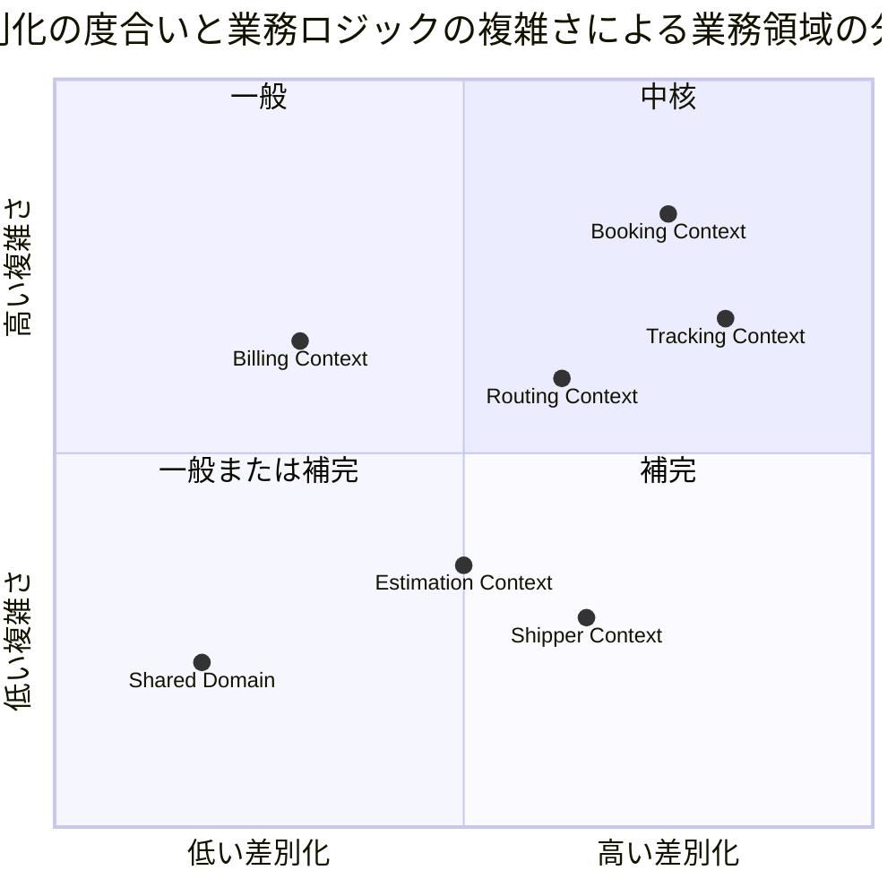

# 第 2 章：Cargo Tracker のドメインモデル

前章では、Cargo Tracker を Spring Boot 上へ配置する方法を見ました。この章はその内側 —— **どの業務ルールが、どの型に入っているか**の話です。

DDD の解説は「集約・エンティティ・値オブジェクトをこう分ける」というところで終わりがちです。この章が扱うのはその先で、**分けたことで何を払ったか**まで含みます。境界を引けば必ず代金が発生します。この実装はその代金を払い続けることを選んでおり、選んだ理由が記録に残っています。

前章と同じく、設計ドキュメントからの引用と実コードからの引用は区別します。**両者が食い違っている箇所は、食い違ったまま示します。**

## この章のゴール

1. どの業務ルールがどの型に入っているかを、BC 単位でたどれること
2. **同じ予約を指す識別子が BC の数だけある**理由と、それを消さない判断を説明できること
3. 設計ドキュメントのモデル図を、実装の現状と突き合わせて読めること

## コアドメイン — どこに投資するかを先に決める

境界を引く前に、**どの業務領域が中核なのか**が決まっています。`domain-model.md` は差別化の度合いと業務ロジックの複雑さで業務領域を分類しています。



転記元: [`docs/design/domain-model.md`](../../source/java-2/docs/design/domain-model.md)

**Booking と Tracking が中核です。** 貨物予約の受付から輸送完了までの整合を扱う部分が、この事業を他と分ける部分だという判断です。

一方 **Shared Domain は左下** —— 差別化にも複雑さにも寄与しない領域として置かれています。この位置づけが、後で見る「共有カーネルを 2 要素に限る」判断の土台になります。**分類は「何を作るか」だけでなく「何を増やさないか」の計画にも使われています。**

## 境界づけられたコンテキストと共有カーネル

### BC と集約ルート

業務パッケージと、そこに置かれた集約ルートは次のとおりです。

| BC | 集約ルート | 代表的なドメインサービス |
| :--- | :--- | :--- |
| `booking` | `Cargo` / `CancellationRequest` / `BookingNotification` | `DischargeCandidates` |
| `routing` | `Voyage` / `BookingRouteProposal` | `RouteSearchService` / `FreightEstimator` |
| `handling` | `HandlingActivity` / `CustomsDeclaration` / `CorrectionRequest` | `ClaimCodeMatch` |
| `tracking` | `TrackingActivity` | —— |
| `billing` | `Invoice` / `Reminder` | `FreightChargeCalculator` |
| `estimation` | `Estimate` | —— |
| `shipper` | `Shipper` | —— |
| `security` | `UserAccount` | —— |

出典: 各 BC の `domain/model/aggregates/`（[`booking`](../../source/java-2/apps/cargo-tracker/src/main/java/com/example/cargotracker/booking/domain/model/aggregates) ほか）

**集約ルートを 1 つしか持たない BC のほうが多い**のが読み取れます。BC は集約の入れ物ではなく、**業務の言葉が通じる範囲**として切られています。

### 設計ドキュメントは「6 つ」と書きながら 7 つ挙げている

前章で見た起動クラスの Javadoc と同じずれが、ドメインモデルの設計ドキュメントにもあります。

> 本ドキュメントは、国際貨物輸送管理システムの DDD（ドメイン駆動設計）戦術的設計を定義する。システムは以下の **6 つ**の境界付けられたコンテキスト（Bounded Context）と共有ドメイン（共有カーネル）で構成される。

引用元: [`docs/design/domain-model.md`](../../source/java-2/docs/design/domain-model.md)（強調は引用者）

**直後の表には 7 つ並んでいます。** Booking / Shipper / Routing / Tracking / **Handling** / Billing / Estimation です。Handling は当初 Tracking の一部として扱われており（ADR-002）、後から独立した BC に昇格しました（ADR-010）。表は更新され、**前文の件数だけが取り残されました。**

同じ表の Handling の行が、その経緯を書いています。

> **独立した境界付けられたコンテキスト**（ADR-010。ADR-002 を置き換えた）

引用元: [`docs/design/domain-model.md`](../../source/java-2/docs/design/domain-model.md)

**境界の数は、設計時に決めて終わりにはなりませんでした。** そして数が動いたとき、更新されるのは表で、文章は残ります。この章で扱う設計ドキュメントは、いずれもこの性質を持っています。

### 共有カーネルは 2 つだけ

BC 間で型を共有してよいのは `Location` と `ShipperId` の 2 つだけです。

```java
/**
 * 荷主識別子。<strong>共有カーネル</strong>（ADR-005）。
 *
 * <p>共有カーネルに置いてよいのは {@code Location} と本クラスの 2 要素のみである。
 * 識別子は値としての同一性のみを持ち、業務的な振る舞いを持たないため、
 * BC 間で共有するコストが極めて低い。
 *
 * @param value UUID
 */
public record ShipperId(UUID value) {

    public ShipperId {
        if (value == null) {
            throw new IllegalArgumentException("荷主 ID は必須です");
        }
    }

    public static ShipperId generate() {
        return new ShipperId(UUID.randomUUID());
    }

    public static ShipperId of(String value) {
        return new ShipperId(UUID.fromString(value));
    }
}
```

転記元: [`shared/domain/model/valueobjects/ShipperId.java`](../../source/java-2/apps/cargo-tracker/src/main/java/com/example/cargotracker/shared/domain/model/valueobjects/ShipperId.java)

**この 2 つに絞ったのは、最初からそうだったからではありません。** ADR-005 が書き残しているのは、2 つの設計ドキュメントが食い違っていた状態です。

> | ドキュメント | 共有カーネルの範囲 |
> | :--- | :--- |
> | `architecture_backend.md` | `Location`（UN/LOCODE）**のみ** |
> | `domain-model.md` | `Location` + `ShipperId` + `TransportStatus` + `RoutingStatus` |
>
> 共有カーネルはシステムで最も変更コストが高い部分である。範囲が曖昧なままだと「どこにも属さないもの置き場」に劣化し、時間とともに肥大化する。

引用元: [`ADR-005`](../../source/java-2/docs/adr/005-shared-kernel-scope.md)

`TransportStatus` を外した理由が、この ADR の中心です。

> - `TransportStatus` は **Tracking の集約状態そのもの**であり、Tracking の業務ルールの表現である。集約の内部状態を共有カーネルに置くことは、集約のカプセル化を BC 境界を越えて破ることに等しい
> - 共有カーネルに置くと、**Tracking に新しい輸送状態を 1 つ追加するだけで Booking・Handling・Billing の再ビルドとレビューが強制される**。最も変更されうる部分に最も高い変更コストを課す配置になっている
> - 他コンテキストが必要としているのは「Tracking の状態そのもの」ではなく「自分の関心事に翻訳された状態」である。たとえば Billing が知りたいのは `DELIVERED` かどうかの一点であり、9 値すべてではない

引用元: [`ADR-005`](../../source/java-2/docs/adr/005-shared-kernel-scope.md)

**判断の基準が「共有すると何が起きるか」で書かれています。** 共有カーネルに何を置くかは、DDD の分類の問題ではなく**変更コストの配分の問題**として扱われています。

この 2 要素という制限は、前章で見た ArchUnit の `共有カーネルはLocationとShipperIdのみ` が強制しています。**認証の `UserAccount` を `shared` に入れなかった**のも同じ理由です。設計ドキュメントはこう書いています。

> **認証・認可を `shared/` に置かない理由**: 共有カーネルの構成要素は `Location` と `ShipperId` の 2 つのみと定めている（ADR-005）。`UserAccount` を shared に入れると、ロールを 1 つ増やすだけで全 BC の再ビルドとレビューを強制する。ArchUnit ルール 6 が `shared.domain.model` を検査対象として、この境界を固定している。

引用元: [`docs/design/architecture_backend.md`](../../source/java-2/docs/design/architecture_backend.md)

## ドメインモデルを構成要素で分ける — 書籍の構成を写して、直した

各 BC の `domain/model` は、DDD の構成要素ごとにサブパッケージへ分かれています。**この分割は書籍の実装に倣ったものです。**

```java
 * <p><strong>構成要素ごとにサブパッケージへ分けている</strong>（ADR-024）。
 *
 * <ul>
 *   <li>{@code aggregates} —— 集約ルートとその識別子</li>
 *   <li>{@code entities} —— 集約の内側で同一性を持つもの</li>
 *   <li>{@code valueobjects} —— 値オブジェクトと列挙</li>
 *   <li>{@code commands} —— 業務の要求をまとめた型</li>
 * </ul>
 *
 * <p><strong>ここ（直下）に残すのはドメインサービスと例外である。</strong>
 * どれにも属さないためであり、参照実装（practical-ddd-in-enterprise-java）も
 * サービスの置き場を持たない。
 */
package com.example.cargotracker.booking.domain.model;
```

転記元: [`booking/domain/model/package-info.java`](../../source/java-2/apps/cargo-tracker/src/main/java/com/example/cargotracker/booking/domain/model/package-info.java)

ADR-024 が経緯を記録しています。

> 各 BC の `domain/model` は 1 つのパッケージにすべてを入れていた。実測で **140 クラス**あり、最大の Booking は 35 クラスが 1 階層に並んでいた。
>
> パッケージを開いたとき、**どれが集約ルートでどれが値オブジェクトなのかは、クラスを開くまで分からない**。
>
> 参照実装（`practical-ddd-in-enterprise-java` の `bookingms`）は `domain/model` を **aggregates / entities / valueobjects / commands** に分けている。

引用元: [`ADR-024`](../../source/java-2/docs/adr/024-domain-model-split-by-building-block.md)

**本シリーズの題材である書籍が、ここで参照実装として名指しされています。** 前章で見た `architecture_backend.md` のパッケージ構成に続いて 2 度目です。

### 写したまま使うと壊れた

興味深いのは、**書籍の構成をそのまま写した結果、この分割が狙った利得を自分で打ち消した**ことです。

> **識別子は `valueobjects` に置く。** 識別子は値オブジェクトである。参照実装は `BookingId` を `aggregates` に置いているが、**それに倣うと集約ルートの数が読めなくなる**（下記「得たもの」が最初の 1 回で壊れた）。

引用元: [`ADR-024`](../../source/java-2/docs/adr/024-domain-model-split-by-building-block.md)

ふりかえりには、より率直に書かれています。

> ADR-024 は「集約ルートの数が目に見える」ことを利得に挙げながら、**識別子を `aggregates` に同居させたため数が読めなくなり**、本文の「Booking は 4」も誤りだった。`entities` も 8 件中 6 件が record（同一性を持たない）だった。
>
> **参照実装の構成をそのまま写したことが原因である。** 参照実装が `BookingId` を `aggregates` に置いているのを、意味を確かめずに真似た。

引用元: [`retrospective-19.md`](../../source/java-2/docs/development/retrospective-19.md)

そこから出た Try が次のものです。

> | **T3** | **参照実装を写すときは、1 クラスずつ「なぜそこか」を言えるか確かめる** | P4 の再発防止。構成だけを写すと、その構成が持つ意味が抜ける | P4 |

引用元: [`retrospective-19.md`](../../source/java-2/docs/development/retrospective-19.md)

**これは本シリーズの読者に対する警告でもあります。** 書籍の構成は「そう分けると何が読めるようになるか」という意図とセットになっています。分類だけを写すと、意図が抜けたまま形だけが残ります。

直した結果、`entities` に残ったのは 2 つだけになりました。

> 直した結果、`entities` に残ったのは `ProposedRoute` と `TrackingExceptionEvent` の 2 つだけである。

引用元: [`ADR-024`](../../source/java-2/docs/adr/024-domain-model-split-by-building-block.md)

**「エンティティ」に該当するものは、実際にはほとんどありませんでした。** 集約の内側で同一性を持つものは 2 つで、残りはすべて値オブジェクトです。DDD の分類を用意すると埋めたくなりますが、この実装は空のまま残しています。

### 分割で失ったもの

ADR-024 は「失ったもの」の節を持っています。

> **パッケージプライベートで守っていた境界が壊れた。**
>
> 分割前、集約の内側だけに開いていた操作は「同じパッケージにいること」で守られていた。javac が越境を止めていたのである。サブパッケージに分けると同じパッケージではなくなるため、**メソッドを `public` にせざるを得なくなった**。

引用元: [`ADR-024`](../../source/java-2/docs/adr/024-domain-model-split-by-building-block.md)

**構成要素で分けることには、コンパイラの保証を手放すという代金があります。** この実装はその代金を、検査で買い戻しました。

```java
/**
 * <strong>{@code entities} の生成・変更メソッドを、呼んでよい相手だけが呼んでいること</strong>
 * （ADR-024 の代償を返す検査。IT20 / D5）。
 *
 * <p>ADR-024 で {@code domain/model} を構成要素ごとのサブパッケージへ分けた結果、
 * <strong>それまで javac が止めていた越境が止まらなくなった</strong>。分割前は
 * 集約ルートと同じパッケージにいることでパッケージプライベートが境界になっていたが、
 * サブパッケージへ移すと {@code public} にせざるを得ない。
 */
```

転記元: [`EntityEncapsulationTest.java`](../../source/java-2/apps/cargo-tracker/src/test/java/com/example/cargotracker/EntityEncapsulationTest.java)

この検査の判定方法に、設計上の重要な選択があります。

```java
 * <p><strong>「集約ルート以外は呼べない」と一般化して書かない。</strong> そう書くと
 * {@code ProposedRoute.of} を集約ルートへ移すことになり、探索と提案の分離が壊れる
 * （{@code of} の 6 引数はすべて探索の途中でしか作れない）。ADR-024 が定めているのは
 * <strong>メソッドごとに相手を書き分けた表</strong>であり、規則を一般化することは
 * 規則の書き換えである。
 *
 * <p><strong>型名だけで判定しない。</strong> {@code raise} や {@code resolve} は
 * 他の型にも存在する（{@code ExceptionOccurrence.raise} は値オブジェクト、
 * {@code TrackingExceptionCommandService.resolve} はコマンドサービス）。
 * 判定は<strong>（呼び先の型・メソッド名・呼び元の型）の 3 つ組</strong>で行う。
```

転記元: [`EntityEncapsulationTest.java`](../../source/java-2/apps/cargo-tracker/src/test/java/com/example/cargotracker/EntityEncapsulationTest.java)

**規則を一般化すると、検査は書きやすくなりますが設計が変わります。** 「集約ルートだけが呼べる」という一般則は簡潔ですが、それを満たすためにドメインサービスの責務を集約へ寄せることになります。この検査は、簡潔さより設計を優先しました。

検査できないものも、黙って外さずに書いてあります。

```java
 * <p><strong>リフレクション（{@code Method.invoke}）は検査できない。</strong>
 * バイトコードに呼び先の型もメソッド名も現れないためである。
 * {@code reconstruct} と同じく、<strong>外していることをここに書いて外す</strong>。
```

転記元: [`EntityEncapsulationTest.java`](../../source/java-2/apps/cargo-tracker/src/test/java/com/example/cargotracker/EntityEncapsulationTest.java)

## 集約

`Cargo` が Booking の集約ルートです。

```java
public class Cargo {

    private final BookingId bookingId;
    private final ShipperId shipperId;
    private final CargoSpecification cargoSpecification;
    private final RouteSpecification routeSpecification;
    private final long version;
```

転記元: [`booking/domain/model/aggregates/Cargo.java`](../../source/java-2/apps/cargo-tracker/src/main/java/com/example/cargotracker/booking/domain/model/aggregates/Cargo.java)

可変なのは進捗を表す 3 つだけです。

```java
    private CargoProgress progress;
    private CargoMisroute misroute = CargoMisroute.none();
    private CargoClaim claim = CargoClaim.none();
```

転記元: [`booking/domain/model/aggregates/Cargo.java`](../../source/java-2/apps/cargo-tracker/src/main/java/com/example/cargotracker/booking/domain/model/aggregates/Cargo.java)

`progress` の Javadoc に、予約状態と経路状態の関係が書かれています。

```java
    /**
     * 予約がどこまで進んだか（状態・経路・追跡番号）。
     *
     * <p><strong>経路は予約状態とは別に動く。</strong> 経路を確定しても
     * {@code BookingStatus} は変わらない（遷移表 3）。
     */
```

転記元: [`booking/domain/model/aggregates/Cargo.java`](../../source/java-2/apps/cargo-tracker/src/main/java/com/example/cargotracker/booking/domain/model/aggregates/Cargo.java)

**2 つの状態を 1 つにまとめなかったこと**が、この集約の設計判断です。経路を割り当てても予約は確定しません。両者を 1 つの列挙にすると、その独立性が消えます。

### 集約ルートが `record` のこともある

集約ルートは必ずしもクラスではありません。Billing の `Reminder` は `record` です。

```java
/**
 * 督促の記録（IT14 レビュー C3）。
 *
 * <p><strong>「気づく手段」は次の行動へ繋ぐ。</strong> 支払期限を過ぎた請求書を
 * 数えるところまでは US23 で作った。<strong>そこから何をしたかが残らない</strong>と、
 * 二重に催促するか、逆に誰も連絡しないまま月をまたぐ。
 *
 * <p><strong>伝えた内容は空でよい。</strong> 電話で伝えたことだけが事実の場合がある。
 * <strong>いつ・誰が</strong>は空にできない — それが記録の本体だからである。
 *
 * @param remindedAt 督促した日時
 * @param remindedBy 督促した人
 * @param note       伝えた内容。<strong>無ければ {@code null}</strong>
 */
public record Reminder(Instant remindedAt, String remindedBy, String note) {
```

転記元: [`billing/domain/model/aggregates/Reminder.java`](../../source/java-2/apps/cargo-tracker/src/main/java/com/example/cargotracker/billing/domain/model/aggregates/Reminder.java)

**状態遷移を持たない集約は不変でよい**ということです。「集約ルートは可変クラス」という形から入ると、この選択肢は出てきません。

## 集約識別子 — 同じ予約を指す型が BC の数だけある

Booking の予約識別子はこれです。

```java
/**
 * 予約識別子。
 *
 * @param value UUID
 */
public record BookingId(UUID value) {

    public BookingId {
        if (value == null) {
            throw new IllegalArgumentException("予約 ID は必須です");
        }
    }
```

転記元: [`booking/domain/model/valueobjects/BookingId.java`](../../source/java-2/apps/cargo-tracker/src/main/java/com/example/cargotracker/booking/domain/model/valueobjects/BookingId.java)

**そして Routing にも、Tracking にも、Handling にも、同じ UUID を包む別の型があります。**

```java
/**
 * Routing Context が扱う予約 ID。
 *
 * <p><strong>Booking の {@code BookingId} を参照しない。</strong> 値は同じ UUID だが、
 * BC をまたいで型を共有すると片方の都合が他方に伝わる（ADR-005・ArchUnit ルール 4）。
 * 共有カーネルに上げる案も採らない。共有カーネルは {@code Location} と
 * {@code ShipperId} の 2 要素に限る。
 *
 * @param value 予約 ID
 */
public record RoutingBookingId(UUID value) {
```

転記元: [`routing/domain/model/valueobjects/RoutingBookingId.java`](../../source/java-2/apps/cargo-tracker/src/main/java/com/example/cargotracker/routing/domain/model/valueobjects/RoutingBookingId.java)

```java
/**
 * 予約参照 ID（Tracking Context 固有の型）。
 *
 * <p>Booking の {@code BookingId} を参照しない（ADR-005・ArchUnit ルール 4）。
 * 追跡が知る必要があるのは「どの予約の追跡か」という事実だけである。
 *
 * @param value 予約 ID
 */
public record TrackingBookingId(UUID value) {
```

転記元: [`tracking/domain/model/valueobjects/TrackingBookingId.java`](../../source/java-2/apps/cargo-tracker/src/main/java/com/example/cargotracker/tracking/domain/model/valueobjects/TrackingBookingId.java)

Handling では名前まで変わります（`CargoBookingId`）。**Handling にとってそれは「貨物の予約」であり、予約そのものではないからです。**

| BC | 型 | 中身 |
| :--- | :--- | :--- |
| `booking` | `BookingId` | `UUID` |
| `routing` | `RoutingBookingId` | `UUID` |
| `tracking` | `TrackingBookingId` | `UUID` |
| `handling` | `CargoBookingId` | `UUID` |

**4 つの型が、まったく同じ値を包んでいます。** DRY の観点からは明らかな重複です。1 つにまとめれば型変換のコードは消えます。

まとめない理由は、`RoutingBookingId` の Javadoc がそのまま書いています ——「**BC をまたいで型を共有すると片方の都合が他方に伝わる**」。`BookingId` に `generate()` を足す、あるいは検証を強める、といった Booking 側の都合が、Routing と Tracking と Handling の再ビルドを引き起こします。**識別子は「業務的な振る舞いを持たないから共有が安い」はずですが、それは共有カーネルに上げた `ShipperId` のように、全 BC が対等に使う場合の話です。**

対照的なのが `ShipperId` です。荷主 ID は共有カーネルに上げられています。**違いは所有者です。** 荷主 ID は Shipper のものであると同時にどの BC のものでもなく、予約 ID は Booking のものです。**BC が所有する識別子は共有しない**という線が引かれています。

## エンティティ

`entities` に残った 2 つのうち、`ProposedRoute` を見ます。

```java
/**
 * 経路候補 1 件（US08）。
 *
 * <p><strong>選べない候補も残す</strong>（{@code domain-model.md} ビジネスルール 6）。
 * 一覧から消すと「なぜあの便が出てこないのか」を利用者が確認できなくなり、
 * 存在しない便を探し続けることになる。選べない理由は候補自身が持つ。
 */
public final class ProposedRoute {
```

転記元: [`routing/domain/model/entities/ProposedRoute.java`](../../source/java-2/apps/cargo-tracker/src/main/java/com/example/cargotracker/routing/domain/model/entities/ProposedRoute.java)

**「選べない候補も残す」がこの型を値オブジェクトでなくエンティティにしている理由**です。候補は一覧の中で個別に識別され、優先順位を持ち、選べない理由を自分で説明します。

内部の持ち方にも判断があります。

```java
    /**
     * 航海のどの区間に乗り、どの区間で降りるか（区間の添字）。
     *
     * <p><strong>時刻の範囲ではなく添字で持つ。</strong> 「乗る区間から降りる区間まで」は
     * 本来ならば航海の並びの上の位置であり、時刻はその結果にすぎない。時刻の範囲で
     * 絞ると、同じ港を 2 度通る航海では<strong>どの周回の区間なのかを時刻から
     * 逆算していることになる</strong>（レビュー L1）。
     *
     * <p>探索が選んだ位置をそのまま持ち回れば、逆算は要らない。
     */
```

転記元: [`routing/domain/model/entities/ProposedRoute.java`](../../source/java-2/apps/cargo-tracker/src/main/java/com/example/cargotracker/routing/domain/model/entities/ProposedRoute.java)

**同じ港を 2 度通る航海**という業務の事実が、データの持ち方を決めています。時刻で持てば一見自然ですが、周回する航路では時刻から位置を逆算することになります。

## 値オブジェクト — 組み合わせの正しさを引き受ける

`CargoSpecification` は、貨物種別と申告情報の整合を守ります。

```java
/**
 * 貨物仕様。種別・重量・寸法・個数・品名をひとまとまりで扱う。
 *
 * <p>US04 の受入基準「貨物種別・重量・寸法・個数・品名を入力できる」は、
 * 画面でもひとつの入力ブロックとして現れる（{@code ui_design.md}「貨物情報」）。
 * **5 つを個別の引数として持ち回ると、引数の順序を間違えても型が同じ限り気づけない。**
 *
 * <p><strong>種別と特別な情報の組み合わせはここが守る</strong>（US05）。
 * 「危険物なのに申告が無い」「一般貨物なのに温度条件がある」という組み合わせを作らせない。
 * <strong>DB の CHECK では書かない</strong> — 種別が増えるたびに条件が伸びて読めなくなる。
 */
public record CargoSpecification(
        CargoType cargoType,
        Weight weight,
        Dimensions dimensions,
        Quantity quantity,
        Description description,
        HazardousDeclaration hazardous,
        TemperatureRequirement temperature) {
```

転記元: [`booking/domain/model/valueobjects/CargoSpecification.java`](../../source/java-2/apps/cargo-tracker/src/main/java/com/example/cargotracker/booking/domain/model/valueobjects/CargoSpecification.java)

**2 つの理由でまとめられています。** 1 つは引数の取り違え防止、もう 1 つは組み合わせの不変条件です。後者は DB の CHECK 制約でも書けますが、種別が増えるたびに条件式が伸びるため型の側に置いています。

### 復元は検査を緩める

この値オブジェクトには、生成用の `create` とは別に `reconstruct` があります。

```java
    /**
     * 永続化された値から復元する。
     *
     * <p><strong>種別と申告の整合はここでは求めない。</strong> 危険物・冷凍の列が無かった
     * ころに登録された予約（IT1〜IT8）には申告が無い。整合を求めると
     * <strong>保存できたものが読めなくなり</strong>、その予約の追跡もキャンセルも
     * できなくなる。到着期限の未来日チェックを復元時に行わないのと同じ判断である。
     *
     * <p>**新しく預かるときの守りは変わらない。** 申告の無い危険物は登録できない。
     *
     * <p><strong>呼んでよいのはリポジトリの復元処理だけである。</strong>
     * 「検査を通したくない」ときの抜け道に使わない — 使えば、申告の無い危険物を
     * <strong>新しく作れてしまう</strong>。テストで危険物を組み立てるときは
     * {@link #create} に申告を渡す（申告を用意する手間こそが、
     * 業務でそれが必須であることの現れである）。
     */
```

転記元: [`booking/domain/model/valueobjects/CargoSpecification.java`](../../source/java-2/apps/cargo-tracker/src/main/java/com/example/cargotracker/booking/domain/model/valueobjects/CargoSpecification.java)

**不変条件を後から強めると、既存データが読めなくなります。** 「不正な状態を表現不可能にする」という原則をそのまま適用すると、要件が増えた瞬間に過去のレコードが復元できなくなります。この実装は**入口と復元で守りの強さを変える**ことでそれを避けています。

同時に、その緩和が抜け道にならないよう Javadoc で釘を刺し、**テストで使うことも禁じています**。「申告を用意する手間こそが、業務でそれが必須であることの現れである」という一文が、テストのしやすさと設計の正しさが衝突したときの立場を示しています。

## ドメインルールの置き場 — 遷移表を実行可能にする

`BookingStatus` は、予約状態の遷移規則を持つ列挙型です。

```java
/**
 * 予約状態。
 *
 * <p><strong>遷移の正典は {@code docs/design/domain-model.md}「BookingStatus 状態遷移表」である。</strong>
 * 本列挙型はその表を実行可能な形にしたものであり、表に無い遷移はすべて拒否する。
 * 画面のボタン出し分け（{@code ui_design.md}）は独自の判定を持たず、
 * {@link #canTransitionBy} を呼ぶ。**同じ規則を 2 か所に書くと、必ず片方だけが更新される。**
 */
public enum BookingStatus {
```

転記元: [`booking/domain/model/valueobjects/BookingStatus.java`](../../source/java-2/apps/cargo-tracker/src/main/java/com/example/cargotracker/booking/domain/model/valueobjects/BookingStatus.java)

遷移表はコードの中で組み立てられます。

```java
    private static Map<BookingStatus, Map<BookingCommandType, BookingStatus>> buildTransitionTable() {
        Map<BookingStatus, Map<BookingCommandType, BookingStatus>> table =
                new EnumMap<>(BookingStatus.class);
        for (BookingStatus status : values()) {
            table.put(status, new EnumMap<>(BookingCommandType.class));
        }

        // 遷移表（domain-model.md）の #2〜#10。#1 は遷移元を持たない新規作成のため含めない。
        table.get(PRELIMINARY).put(BookingCommandType.ASSIGN_TO_ROUTING, ROUTE_PROPOSED);
        // #3 は状態を変えない。RoutingStatus のみが ROUTED になる
        table.get(ROUTE_PROPOSED).put(BookingCommandType.ROUTE_CARGO, ROUTE_PROPOSED);
        // #4 の事前条件「RoutingStatus = ROUTED」は状態だけでは判定できないため Cargo が守る
        table.get(ROUTE_PROPOSED).put(BookingCommandType.CONFIRM_BOOKING, CONFIRMED);
        table.get(CONFIRMED).put(BookingCommandType.ASSIGN_TRACKING_NUMBER, TRACKING_ISSUED);
        table.get(TRACKING_ISSUED).put(BookingCommandType.START_TRANSPORT, IN_TRANSIT);
        table.get(IN_TRANSIT).put(BookingCommandType.COMPLETE_DELIVERY, DELIVERED);
        table.get(DELIVERED).put(BookingCommandType.SETTLE_BOOKING, SETTLED);
```

転記元: [`booking/domain/model/valueobjects/BookingStatus.java`](../../source/java-2/apps/cargo-tracker/src/main/java/com/example/cargotracker/booking/domain/model/valueobjects/BookingStatus.java)

**各行が設計ドキュメントの表の行番号と対応しています。** 表とコードのどちらを見ても同じ規則にたどり着きます。

### 画面のボタンも同じ規則を呼ぶ

```java
    /**
     * コマンドを実行できるか。
     *
     * <p>画面のボタン出し分けはこの述語をそのまま呼ぶ。**「押せるのに実行すると失敗する」
     * ボタンは、利用者から見て壊れているのと同じである。**
     */
    public boolean canTransitionBy(BookingCommandType command) {
        return TRANSITIONS.get(this).containsKey(command);
    }
```

転記元: [`booking/domain/model/valueobjects/BookingStatus.java`](../../source/java-2/apps/cargo-tracker/src/main/java/com/example/cargotracker/booking/domain/model/valueobjects/BookingStatus.java)

**ドメインの不変条件と画面の表示条件を同じ規則から導く**ことで、両者がずれません。前章で見た「クエリ側の SQL に状態の表示名とキャンセル可否を書かない」という判断も、同じ狙いです。

### ループを 1 つ間違えると、輸送中の貨物が消せた

この遷移表の組み立てには、実際に起きた欠陥の記録が埋め込まれています。

```java
        // #9 輸送開始前のキャンセル。**営業担当者の操作で即座に確定する。**
        // DELIVERED 以降はキャンセルできない（引き渡し済み貨物の取り消しは返送であり別業務）
        for (BookingStatus cancellable :
                new BookingStatus[] {PRELIMINARY, ROUTE_PROPOSED, CONFIRMED, TRACKING_ISSUED}) {
            table.get(cancellable).put(BookingCommandType.CANCEL_BOOKING, CANCELLED);
        }

        // #10 輸送中のキャンセル（承認を伴う。US30）。
        // **#9 と同じループに入れてはならない。** 同じループに入れると、
        // 輸送中の貨物を営業担当者がボタン 1 つで消せてしまう。
        // 貨物は船の上にあり、**どこで降ろすかを決めないままキャンセルすると
        // 荷役の現場は行き先の無い荷物を抱える**
        table.get(IN_TRANSIT).put(BookingCommandType.APPROVE_CANCEL, CANCELLED);
```

転記元: [`booking/domain/model/valueobjects/BookingStatus.java`](../../source/java-2/apps/cargo-tracker/src/main/java/com/example/cargotracker/booking/domain/model/valueobjects/BookingStatus.java)

設計ドキュメントの側に、何が起きていたかが書かれています。

> **`IN_TRANSIT` からのキャンセルは他の状態と同一視しない**（遷移 #10）。貨物が船上にあるため「どこで降ろすか」の判断とキャンセル料の発生を伴う。**コマンドそのものを分ける**（`CANCEL_BOOKING` / `APPROVE_CANCEL`）。IT15 まで両者は同じコマンドで表に登録されており、**コメントは #9 と #10 を分けて説明しながら実装は同一視していた** —— 結果として輸送中の貨物を営業担当者がボタン 1 つで消せた

引用元: [`docs/design/domain-model.md`](../../source/java-2/docs/design/domain-model.md)

**コメントは正しく、コードが間違っていました。** 説明文が設計を語り、実装がそれを守っていない —— この形は前章から繰り返し出てきます。ここでは `for` ループに状態を 1 つ足すだけで業務上の重大な穴が開きました。

### 正典の表のほうが遅れていたこともある

逆向きのずれも記録されています。

> **遷移 #11（引き渡しの取り消し）は IT20 で表に足した。** 実装（`Cargo.revertDelivery`）と散文（`:1523`）には IT13 からあったが、**表だけが追随していなかった**。表は「表に無い遷移はすべて拒否する」と自称しているため、**穴が空いたままでは「遷移が変わらないこと」を確かめる基準にならない**

引用元: [`docs/design/domain-model.md`](../../source/java-2/docs/design/domain-model.md)

**「正典」を名乗る文書が、正典であり続けるとは限りません。** 正典が正典であるためには、実装が変わるたびに更新される必要があります。それを保証する仕組みが無ければ、正典という呼称は期待にすぎません。

## ドメインモデルサービス

集約にも値オブジェクトにも入らない業務計算は、`domain/model` 直下に置かれます。

| クラス | BC | 担当 |
| :--- | :--- | :--- |
| `RouteSearchService` | `routing` | 経路候補の探索 |
| `FreightEstimator` | `routing` | 概算費用の算出 |
| `FreightChargeCalculator` | `billing` | 請求額の算出 |
| `DischargeCandidates` | `booking` | 荷降ろし候補の判定 |
| `ClaimCodeMatch` | `handling` | 引取確認コードの照合 |

出典: [`ADR-024`](../../source/java-2/docs/adr/024-domain-model-split-by-building-block.md)（`InvalidBookingStatusTransitionException` を含む 6 クラスとして記載）

経路探索は、業務の制約そのものを持っています。

```java
/**
 * 経路候補を探す（US08）。
 *
 * <p>探すのは<strong>1 つの航海の中で、出発地から目的地までを乗り通せる区間</strong>で
 * ある。途中の港から乗ることも、途中の港で降りることもできる。
 * 複数の航海を乗り継ぐ経路は本システムでは扱わない
 * （{@code proposed_route} が航海番号を 1 つだけ持つことに対応する）。
 *
 * <p><strong>打ち切りの条件を持つ。</strong> 経由回数の上限を超える候補は作らない。
 * 上限が無いと、港と航海が増えるほど候補が増え、経路設計者は選べなくなる。
 */
public class RouteSearchService {
```

転記元: [`routing/domain/model/RouteSearchService.java`](../../source/java-2/apps/cargo-tracker/src/main/java/com/example/cargotracker/routing/domain/model/RouteSearchService.java)

**「扱わない」ことがはっきり書かれています。** 乗り継ぎを扱わないという制限は、テーブルの構造（航海番号を 1 つだけ持つ）と対応しています。

費用の算出は、探索から分離されています。

```java
/**
 * 概算費用の算出（ADR-008）。
 *
 * <p><strong>実際の運賃ではない。</strong> 本システムは運賃表も港間の距離も持たない。
 * 材料が無いことを認めた上で、持っている値（重量・所要日数）から目安を出す。
 *
 * <p>単価と割増率は<strong>設定値として外から与える</strong>。ソースを変えずに
 * 調整できることが、この式が暫定であることの証拠になる。
 */
public final class FreightEstimator {
```

転記元: [`routing/domain/model/FreightEstimator.java`](../../source/java-2/apps/cargo-tracker/src/main/java/com/example/cargotracker/routing/domain/model/FreightEstimator.java)

**「材料が無いことを認めた上で」という書き方が、この実装の姿勢を表しています。** 運賃表が無いのに正確な運賃を計算するふりをせず、暫定であることを構造（外部設定）で示しています。

### 3 つの層の分担

| 置き場 | 担当 | 例 |
| :--- | :--- | :--- |
| 集約 | 状態遷移と不変条件 | `Cargo.confirm()` |
| ドメインサービス | 複数オブジェクトにまたがる業務計算 | `RouteSearchService.search()` |
| アプリケーションサービス | ユースケースの順序制御・トランザクション・BC 越境 | `BookCargoCommandService.book()` |

前章で見た `BookCargoCommandService` が荷主の存在確認を担っていたのは、この分担の帰結です。**荷主が存在するかは Booking のデータだけでは決まらない**ため、集約にもドメインサービスにも置けません。

## 境界を分けた代償 — 同じ名前の型が複数ある

ここまで見てきた分割には、目に見える代金があります。**同じ名前の型が、複数の BC に別々に定義されています。**

| 型名 | 定義されている BC |
| :--- | :--- |
| `Money` | `routing` / `billing` |
| `HazardousDeclaration` | `booking` / `estimation` |
| `DiscountRate` | `shipper` / `billing` |
| `KnownPorts`（ACL ポート） | `booking` / `routing` / `estimation` |

**これは実装の怠慢ではありません。** Billing の `Money` が、なぜ別の型なのかを自分で説明しています。

```java
/**
 * 請求で扱う金額（US21。{@code domain-model.md}「金額の丸め規則」）。
 *
 * <p><strong>金額計算は法的・会計的な争いの対象になりうる。</strong> 丸めの規則と
 * 適用順序を仕様として固定する。順序が決まっていないと、
 * <strong>同じ入力でも実装者によって請求額が変わる</strong>。
 */
```

転記元: [`billing/domain/model/valueobjects/Money.java`](../../source/java-2/apps/cargo-tracker/src/main/java/com/example/cargotracker/billing/domain/model/valueobjects/Money.java)

そして、同じ Javadoc が Routing の `Money` との違いを名指しします。

```java
 * <p><strong>Routing の {@code Money} とは別の型である。</strong> 概算費用（ADR-008）は
 * 経路候補の並べ替え用であり、請求額ではない。BC をまたいで型を共有すると、
 * <strong>並べ替えの物差しが請求に流れ込む</strong>（ADR-005）。
```

転記元: [`billing/domain/model/valueobjects/Money.java`](../../source/java-2/apps/cargo-tracker/src/main/java/com/example/cargotracker/billing/domain/model/valueobjects/Money.java)

Routing 側の `Money` を見ると、違いは明白です。

```java
/**
 * 金額。Routing Context が扱う概算費用の型（ADR-008）。
 *
 * <p><strong>通貨を必ず伴う。</strong> 単位の無い金額は金額ではない。
 */
```

転記元: [`routing/domain/model/valueobjects/Money.java`](../../source/java-2/apps/cargo-tracker/src/main/java/com/example/cargotracker/routing/domain/model/valueobjects/Money.java)

**Routing の `Money` は `BigDecimal` をそのまま保持し、Billing の `Money` は最小通貨単位の整数で保持します。** 丸め規則も違います。名前が同じでも、業務上まったく別のものです。

**同じ名前は、同じ概念を意味しません。** 経路候補を並べる物差しと、荷主に請求する金額は、たまたま「金額」と呼ばれているだけです。統合すれば、片方に必要な丸め規則がもう片方に持ち込まれます。

## 設計図はどこまで信じられるか

`domain-model.md` は BC ごとにドメインモデル図（PlantUML のクラス図）を持っています。**本章はそれを転記しません。** Booking の図が実装から大きく離れているためです。

| 図に描かれているもの | 実装 |
| :--- | :--- |
| `Cargo` が `delivery: Delivery` を持つ | `Delivery` は**存在しない**。`CargoProgress` / `CargoMisroute` / `CargoClaim` の 3 つ |
| `Cargo` が `bookingAmount: Money` を持つ | `booking` に `Money` は**存在しない** |
| `Cargo` が `cargoType` / `dimensions` / `quantity` / `description` / `hazardousDeclaration` / `temperatureRequirement` を直接持つ | `CargoSpecification` にまとめられている |
| `CargoHandlingActivity` 値オブジェクト | **存在しない** |
| `ShipperId` が `shipperType: ShipperType` を持つ | `ShipperId` は `UUID` 1 つのみ |
| `Delivery` が `transportStatus: TransportStatus` / `routingStatus: RoutingStatus` を持つ | **ADR-005 で両者は所有 BC に戻された** |

出典: [`docs/design/domain-model.md`](../../source/java-2/docs/design/domain-model.md)「Booking Context - ドメインモデル」と各実装ファイルの突き合わせ

**図の陳腐化を、文書自身が部分的には認識しています。** 同じ節の実装状況メモにはこう書かれています。

> `CargoSpecification` は設計図には無いが、種別・重量・寸法・個数・品名をひとまとまりで扱うために IT2 で導入した。画面でも 1 つの入力ブロックとして現れる。

引用元: [`docs/design/domain-model.md`](../../source/java-2/docs/design/domain-model.md)

**散文で「図には無い」と断ってあり、図そのものは更新されていません。** 更新のコストが高い成果物ほど、こうして注釈で回避されます。

この文書は同時に、突き合わせの手段を用意しています。

> **本ドキュメントは「設計」である。** 実装されたドメインモデルは JIG で可視化できる（`./gradlew jigReports` → `build/jig/domain.html`・`glossary.html`）。本ドキュメントの集約・値オブジェクト一覧と JIG の出力を突き合わせることで、**設計したモデルが実際にコードとして存在するか**を確認できる。

引用元: [`docs/design/domain-model.md`](../../source/java-2/docs/design/domain-model.md)

**可視化は乖離を見せますが、赤くはしません。** 前章で見た ArchUnit やソース走査型の検査が「規則を破ったらビルドを止める」のに対し、JIG が示すのは現状です。**乖離に気づくかどうかは人に委ねられており、この図はその委ね方が機能しなかった例です。**

## トレードオフ — 重複を消さない判断

この章で見た重複を整理します。

| 重複 | 消す方法 | 消さない理由 |
| :--- | :--- | :--- |
| 予約識別子 4 種 | 共有カーネルに上げる | Booking 側の都合が 3 BC の再ビルドを引き起こす |
| `Money` 2 種 | 共通の金額型を作る | 並べ替えの物差しと請求額で丸め規則が違う |
| `HazardousDeclaration` 2 種 | 同上 | 見積と予約で必須の条件が異なりうる |
| `KnownPorts` 3 種 | 共通の ACL ポートにする | ポートは利用側 BC が定義するという原則に反する |

**どれも「消せるが消さない」という判断です。** そして、この判断が正しくなくなる条件もはっきりしています。

**BC が実際には独立して変更されないなら、この代金は無駄です。** 予約 ID の形式変更が常に 4 BC 同時の作業になるなら、型を分けている意味はありません。分割の価値は「片方だけを変えられる」ことにあり、片方だけを変えたことが一度も無いなら、払っているのはコストだけです。

この実装が 20 イテレーションを通じて BC ごとに別々のイテレーションで手を入れ続けたことが、判断の裏づけになっています。**同じ構造を短命なプロジェクトへ持ち込むなら、判断は変わります。**

## まとめ

この章では、Cargo Tracker のドメインモデルを型の単位で見ました。

### モデルの構造

1. 業務領域を差別化と複雑さで分類し、Booking と Tracking を中核とした。分類は「増やさない」判断（共有カーネル）にも使われている
2. 共有カーネルは `Location` と `ShipperId` の 2 つだけ。集約の内部状態（`TransportStatus`）を共有カーネルに置くことは、境界を越えてカプセル化を破ることに等しい（ADR-005）
3. `domain/model` は構成要素ごとに分かれる。**この構成は書籍の実装に倣った**（ADR-024）
4. 集約ルートは可変クラスとは限らない（`Reminder` は `record`）。エンティティに該当するものは 2 つしか無い
5. ドメインルールは型に閉じ込め、画面のボタン表示も同じ述語を呼ぶ

### 払った代金

1. 同じ UUID を包む予約識別子が BC の数だけある
2. `Money` / `HazardousDeclaration` / `DiscountRate` / `KnownPorts` が複数 BC に別々にある
3. 構成要素で分けたことで、javac が止めていた越境が止まらなくなった —— それを `EntityEncapsulationTest` が買い戻している

### そして、書籍の構成を写すことについて

`domain/model` の分割は書籍の `bookingms` に倣ったものですが、**倣ったまま写した部分は同じイテレーションの中で作り直されました**。識別子を `aggregates` に置いたために「集約ルートの数が読める」という利得が最初の 1 回で壊れ、ふりかえりは「参照実装を写すときは、1 クラスずつ『なぜそこか』を言えるか確かめる」という Try を残しています。

**構成は、それが何を読めるようにするかとセットで初めて意味を持ちます。** 本シリーズが書籍の目次をなぞるのではなく適用結果から書いているのは、この理由によります。

次章では、ここで見たモデルが Spring Boot 上でどう配置され、どの検査に守られているかを扱います（→ [第 3 章](03-spring-modular-monolith.md)）。
