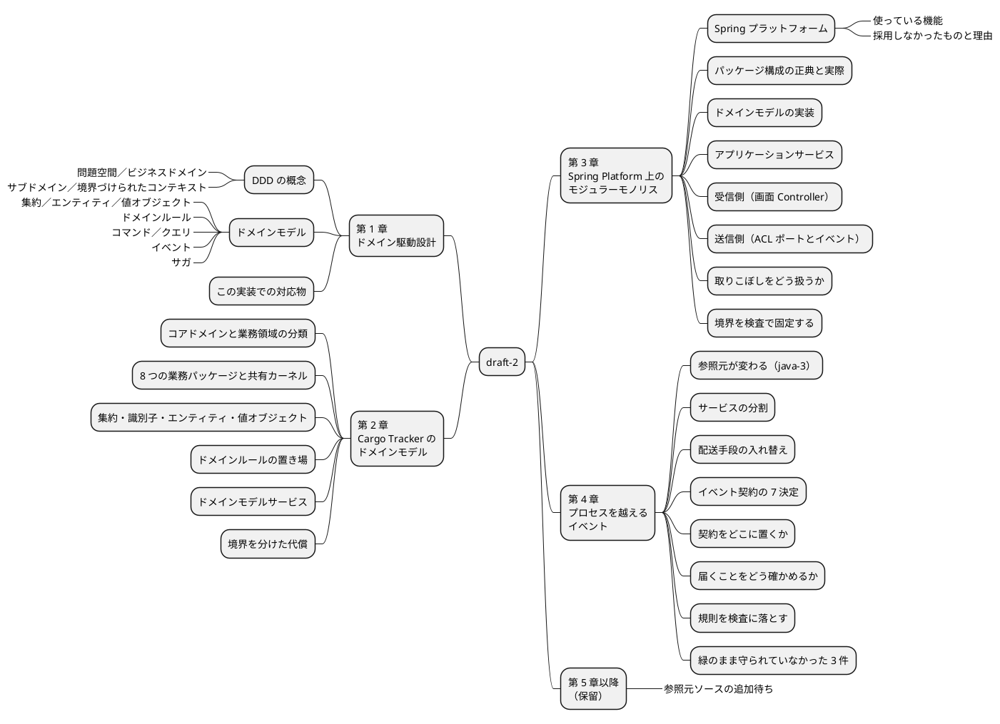

# エンタープライズ Java における実践的ドメイン駆動設計 — 執筆アウトライン（draft-2）

本ドキュメントは記事シリーズ **「エンタープライズ Java における実践的ドメイン駆動設計」** の第 2 稿の計画書です。章立て・各章の主題・引用元・執筆順序を定めます。記事本文ではありません。

前稿は [draft-1](../draft-1/outline.md) です。**draft-2 は前稿の書き直しであり、増補ではありません。** 何を変えるかは §2 に記します。

## 1. この改稿の位置づけ

| 項目 | 内容 |
| :--- | :--- |
| シリーズ名 | エンタープライズ Java における実践的ドメイン駆動設計 |
| 記事ディレクトリ | `docs/article/practical-ddd-in-enterprise-java/draft-2/` |
| 参照元実装 | `docs/article/source/java-2/apps/cargo-tracker/`（`java/take-6`。単一 Gradle モジュール）。**第 4 章のみ** `docs/article/source/java-3/apps/backend/`（`java/take-7`。8 サービス + 共有ライブラリ） |
| 参照元一次資料 | `docs/article/source/java-2/docs/`（`design/` 11 本・`adr/` 25 本ほか） |
| 題材 | 国際貨物輸送管理システム（Cargo Tracker） |
| **今回の章数** | **4**（第 1〜4 章） |
| 保留 | 第 5 章以降（CQRS/ES・総括）。**参照元ソースの追加待ち**（§5） |
| 前稿 | draft-1（全 6 章・1,190 行） |

### 想定読者

DDD の用語（エンティティ・値オブジェクト・集約・境界づけられたコンテキスト）を一度は読んだが、**Java と Spring でそれをどこにどう置くかの判断がつかない**開発者。

### この記事が扱わないこと

| 対象外 | 理由 |
| :--- | :--- |
| DDD の用語解説・パターンカタログ | 既刊書籍が扱う。本シリーズは適用結果の側から書く |
| 20 イテレーションの時系列 | [実践 DDD in Spring Boot](../../practical-ddd-spring-boot/index.md) が扱う |
| XP プラクティスとモデルの関係 | [XP によるドメイン駆動設計の実践](../../xp-domain-driven-design/index.md) が扱う |
| 多言語比較 | [モノリスアーキテクチャ実装比較](../../monolith-architecture/index.md) が扱う |
| Axon Framework / Event Sourcing | **どちらの参照元実装にも存在しない**（§2 の P1）。java-3 も現在状態を直接 UPDATE する |

## 2. draft-1 の何を変えるか

draft-1 は**書籍の目次をそのまま章立てに採用し、コードだけを別の実装（`source/java-2`）から引いた**ため、目次と参照元が噛み合っていません。draft-2 はこの噛み合わせを直します。

| # | draft-1 の状態 | draft-2 での扱い |
| :--- | :--- | :--- |
| **P1** | **第 5 章が構想である。** 冒頭で「現行リポジトリには Axon 実装は含まれていません」と断ったうえで、移行時の設計差分を記述している。`org.axonframework`・`@Aggregate`・`@EventSourcingHandler`・`EventStore` はいずれも参照元に 1 件も無い | **参照元にある範囲だけを章にする。** Axon / Event Sourcing の章は立てない。§5 の保留に移す |
| **P2** | **第 3 章と第 4 章が同じ実装を二度説明している。** `CargoTrackerApplication`・`package-info.java`・`BookingQueryService`・`ShipperExistenceChecker` とその Adapter を両章がそれぞれ引用している。書籍がプラットフォーム別に独立した章を持つ構成をそのまま持ち込んだ結果 | **1 実装＝1 章に統合する。** 実装の章は第 3 章のみとし、「Spring プラットフォーム」節の重複を解消する |
| **P3** | **コード引用が転記になっていない。** `public void confirm(ClaimCode issued) { ... }` のように本体を `{ ... }` で省略した引用が全章にわたる。読者は同じものを手元で再現できない | **実ファイルからそのまま転記する。** 長い完成コードは `<details>` に畳み、本文には差分だけを載せる |
| **P4** | **「Spring Claud」（Spring Cloud の誤記）を節として立てている。** しかも参照元は Spring Cloud を使っていない。`spring-cloud-contract` は `build.gradle` の**採用しない依存の一覧**に「ADR-006: 契約テストの対象が存在しない」という理由つきで載っている | **節ごと削除する。** 代わりに「**採用しなかったものと、その理由が実行可能な検査になっている**」ことを第 3 章で扱う |
| **P5** | **設計ドキュメントと実装の区別が無い。** draft-1 は設計文書の記述を実装の説明として書いている。実際には両者が食い違う箇所が複数ある（§3 の M3） | **「設計にこう書いてある」と「コードがこうなっている」を分けて書く。** 一致していない箇所は一致していないと書く |
| **P6** | **RESTful API の節がある。** 「URL 設計と HTTP メソッドは RESTful なリソース操作に沿っています」と書いているが、**`interfaces/rest` パッケージは全 BC で存在せず、`@RestController` も `@ResponseBody` も 0 件**である。実体は Thymeleaf + htmx の `@Controller`（27 件） | **REST の節を立てない。** 受信側は画面 Controller として書き、**設計の正典が `interfaces/rest/` を規定しながら実装に無い**ことを M3 の例として扱う |
| **P7** | **章の構成が揃っていない。** 「この章のゴール」があるのは第 1 章だけで、トレードオフの節はどの章にも無い（draft-1 のアウトライン §3 は共通フォーマットを定めていたが、本文が従っていない） | **§7 の共通フォーマットを全章に適用する。** ゴールとトレードオフを必ず置く |
| **P8** | **参照元の書き方が揺れている。** `docs/article/source/java-2/apps/...` のフルパスと、`.../booking/domain/...` の省略形が混在し、いずれもリンクになっていない | **相対リンクに統一する。** 既存シリーズの書式に合わせる |
| **P9** | **境界を実際に守っている仕組みに触れていない。** ArchUnit にも ADR にも言及が無く、「BC 間は ACL ポートとイベントに限る」という規則がどう強制されているかが書かれていない | **第 3 章の中核に据える。** 宣言と強制を対で示す |
| **P10** | シリーズが `docs/article/index.md`・`mkdocs.yml` のいずれにも未登録で、読者が辿り着けない | 第 3 章の完成時点で登録する（§11） |

### draft-1 から引き継ぐもの

- 第 1 章→第 2 章→第 3 章の**概念→モデル→実装**という降り方
- 第 1 章の「用語の暗記ではなく、業務の境界とモデルをコード上でどこに置くか」という主眼
- BC 一覧・集約一覧・値オブジェクトの選び方といった、事実として正しい記述
- 「本実装は JSON API 中心ではなく、サーバサイド HTML を返す構成です」という観察（draft-1 第 3 章。**これは正しい**。ただし同じ章の RESTful API の節と矛盾している）

## 3. 通底する主題

draft-2 の背骨は次の 4 つです。各章はこのいずれかを具体例で示します。

| # | 主題 | 根拠 |
| :--- | :--- | :--- |
| **M1** | **書籍の構造は、この実装に実際に適用されている。しかも、写して失敗した記録まで残っている** | 参照は 2 系統ある。(1) `design/architecture_backend.md` のレイヤー責務一覧が「Practical DDD in Enterprise Java (Chapter 3) のパッケージ構造に準拠する」と明記。(2) **ADR-024 が `practical-ddd-in-enterprise-java` の `bookingms` を参照実装として名指し**し、`domain/model` の building block 分割をそこから採っている（4 つの `domain/model/package-info.java` も同書を挙げる）。さらに `retrospective-19.md` が**「参照実装の構成をそのまま写したことが原因である」**と失敗を記録し、Try T3「参照実装を写すときは 1 クラスずつ『なぜそこか』を言えるか確かめる」を残している。本シリーズは書籍の要約ではなく**適用結果の報告**として書ける |
| **M2** | **境界は宣言しただけでは守られない** | ArchUnit（`PackageStructureTest`・`EntityEncapsulationTest`）、依存グラフに現れないものを `.java` を読んで検査するソース走査型テスト群、`verifyProductionDependencies`（ADR で採用しないと決めた依存が本番クラスパスに無いことを検証）が実在する |
| **M3** | **実装は設計文書を裏切る。裏切った箇所こそ書く価値がある** | §3.1 の一覧 |
| **M4** | **写したコードは必ず古くなる** | `design/test_strategy.md` 自身が「旧版は 6 ルール分のコードを写して『10 件』と書いており、実装が 12 件になっても追随しなかった」と記録し、**写しをやめる**判断をしている。記事も同じ規律で書く（§7） |

### 3.1 設計文書と実装の食い違い（M3 の実例）

**本調査で確認できたものだけを挙げます。** 各章でこの表の該当行を扱います。

| # | 設計文書の記述 | 実装 | 扱う章 |
| :--- | :--- | :--- | :--- |
| D1 | `architecture_backend.md` のパッケージ構成の正典が `interfaces/rest/`（＋`dto/`・`transform/`）を規定し、Booking の例にも `CargoBookingController` を挙げている | **`interfaces/rest` は全 BC で存在しない。** `@RestController` 0 件・`@ResponseBody` 0 件。受信側は `interfaces/web` の `@Controller` のみ | 第 3 章 |
| D2 | `architecture_backend.md` の CQRS 適用方針が「MyBatis の **XML マッパー**で JOIN クエリを直接記述」と書いている | **Mapper XML は 1 件も無い**（`src/` 配下の `.xml` が 0 件）。SQL はすべてアノテーション記述。`application.yml` の `mybatis.mapper-locations` は該当ファイルが無いまま残っている | 第 3 章 |
| D3 | `CargoTrackerApplication.java` の Javadoc が「6 つの境界付けられたコンテキスト」と列挙している | 業務パッケージは **8 つ**（`handling` が ADR-010 で独立 BC 化、`security` が ADR-007 の支援サブドメイン）。Javadoc が追随していない | 第 1 章 |
| D4 | `domain-model.md` の概要が「6 つの境界付けられたコンテキスト」と書きながら、同じ表に 7 つ列挙している | 同上（D3 と同じ取り残し） | 第 2 章 |
| D5 | `architecture_backend.md` のドメインイベント一覧が `CargoBookedEvent` を挙げている（「**未実装**」の注記つき） | `shared/domain/event` に**存在しない**。実在するイベントは別の 9 件 | 第 1 章 |
| D6 | パッケージ構成の正典が BC ごとの `domain/event/` を規定し、Booking の例に `booking/domain/event/` を挙げている | イベントは **`shared/domain/event` に集約**されている（BC ごとの `domain/event` は無い） | 第 1 章 |
| D7 | `domain-model.md` の Booking Context ドメインモデル図が `Delivery`・`Money`・`CargoHandlingActivity` を描き、`ShipperId` に `shipperType` を持たせ、`Delivery` に `TransportStatus` / `RoutingStatus` を持たせている | **6 か所すべて実装に無い。** `Cargo` は `CargoProgress` / `CargoMisroute` / `CargoClaim` を持ち、`ShipperId` は `UUID` 1 つのみ。`TransportStatus` / `RoutingStatus` は ADR-005 で所有 BC に戻された。**同じ節の散文は「`CargoSpecification` は設計図には無い」と断っており、図が古いことを部分的には認識している** | 第 2 章 |
| D8 | `domain-model.md` の BookingStatus 状態遷移表が「表に無い遷移はすべて拒否する」と自称している | **遷移 #11（引き渡しの取り消し）は IT13 から実装にあったのに、表への追加は IT20 だった。** 今度は**正典の側が実装より遅れていた**（現在は解消済み）。文書自身がこの経緯を記録している | 第 2 章 |

**この表は執筆前に必ず再確認します。** 本アウトラインの作成時、当初は「`test_strategy.md` の ArchUnit 表（12 行）が実装に追随していない」という行を立てていましたが、`PackageStructureTest` の `@ArchTest` を数えると **12 件で一致**しており、誤りでした。**設計文書と実装がずれている「はず」という予断で書くと、記事のほうが実態からずれます。** §10 の完了条件で各行の再確認を義務づけます。

### 3.2 M1 が本シリーズの存在理由である

書籍は Jakarta EE・MicroProfile・Spring・Axon の 4 プラットフォームを並べますが、本シリーズが扱うのは「その構造を現在の Spring Boot で 20 イテレーション回すと何が残り、何が変わったか」です。

たとえば書籍の Chapter 3 が JPA / EclipseLink を使うのに対し、参照元は **JPA を本番クラスパスから機械的に締め出しています**。

```groovy
'org.hibernate.orm'         : 'ADR-004: 永続化は MyBatis。JPA / Hibernate は採用しない',
'jakarta.persistence'       : 'ADR-004: JPA の API を本番に持ち込まない',
```

転記元: `source/java-2/apps/cargo-tracker/build.gradle`（`verifyProductionDependencies`）

**同じパッケージ構造を採りながら、永続化の選択は反転しています。** この差と理由を書くのが draft-2 の付加価値であり、書籍の紹介記事との分かれ目です。

## 4. 章構成（今回の範囲）



| 章 | ファイル名 | 主題 | 主題との対応 |
| :--- | :--- | :--- | :--- |
| 第 1 章 | `01-ddd-fundamentals.md` | ドメイン駆動設計 — 概念と、この実装での対応物 | M1・M3 |
| 第 2 章 | `02-cargo-domain-model.md` | Cargo Tracker のドメインモデル | M1・M3 |
| 第 3 章 | `03-spring-modular-monolith.md` | Spring Platform 上のモジュラーモノリス | M1・M2・M3・M4 |
| 第 4 章 | `04-spring-eda.md` | プロセスを越えるイベント — マイクロサービス版の Cargo Tracker | M1・M2・M4 |

**ファイル名は draft-1 から変えません。** 章の中身は書き直しますが、扱う範囲は同じであり、稿の対比を追いやすくするためです。

### 4 章で完結するか

**しません。** 第 4 章の末尾も総括ではなく、**次に何が要るか**で閉じます。読者に対しては「実装アプローチの比較は続編で扱う」と明示し、現時点で書けないことを書けるふりをしません（P1 の再発防止）。

## 5. 第 4 章（成立）と第 5 章以降（保留）

### 第 4 章 — 着手条件が満たされました

保留の理由は「参照元の BC 間連携が**同一 JVM 内の `ApplicationEventPublisher`** であり、プロセスを跨ぐイベント基盤が無い」ことでした。着手条件は「メッセージングを使う実装が `docs/article/source/` に収録されること」です。

`java/take-7`（マイクロサービス版）を [`source/java-3/`](../../source/java-3) に収録して条件が満たされたため、第 4 章を起こしました。

| 項目 | 値 |
| :--- | :--- |
| ファイル | `04-spring-eda.md`（draft-1 から変えない） |
| 主題 | プロセスを越えるイベント — マイクロサービス版の Cargo Tracker |
| 参照元 | `source/java-3/`（8 サービス + 共有ライブラリ・Database per Service・RabbitMQ） |
| 中心の一次資料 | ADR-022「サービス間のドメインイベント契約」（7 決定・決定ごとの検査表・後日談 3 件） |

**参照元が第 1〜3 章と違うことを、章の冒頭で明示します。** 続きではなく別実装であり、設計判断がそのまま引き継がれているわけではないためです。この断りを省くと、読者は 2 つの実装を 1 つのものとして読みます。

**draft-1 の P2（第 3 章と同じコードを別の見出しで再説明する）を繰り返さないこと**が、この章の成立条件でもありました。本章が引くコードは、第 3 章が引いたものと 1 行も重なりません。

### 第 5 章以降（保留）

**参照元ソースが追加されるまで着手しません。** 書かないと決めた理由ごと残します。

| 章 | 主題 | 保留の理由 | 着手条件 |
| :--- | :--- | :--- | :--- |
| 第 5 章 | CQRS / Event Sourcing | コマンドとクエリの分離は両実装に実在するが、**イベントストアも投影テーブルも無い**。java-2 は `CREATE VIEW` 0 件・`outbox` 0 件・`@Async` 0 件、**java-3 も Outbox を入れておらず**（[ADR-022] のネガティブに「残っている窓」として明記）、集約は MyBatis で現在状態を直接 UPDATE する | Event Sourcing 実装が `docs/article/source/` に収録されること |
| 第 6 章 | 実装アプローチの比較と選択指針 | **第 4 章で比較軸が 1 つ増えた**（モジュラーモノリス／マイクロサービス）が、書籍が並べる 4 アプローチのうち CQRS/ES が欠けたままである。2 つで「選択指針」を名乗ると、選ばなかった選択肢を評価していないまま推奨することになる | 第 5 章が成立すること |

### 保留章の参照元候補

| 候補 | 状態 |
| :--- | :--- |
| 書籍付属ソース（Jakarta EE / MicroProfile / Spring Cloud Stream / Axon の 4 実装） | **未収録。** 収録する場合は `docs/article/source/` 配下への追加と `source/README.md` の更新が必要 |
| `java/take-7` 系での Event Sourcing 実装 | 未着手 |

**どちらを採るかは決めません。** ソースが収録された時点で、本アウトラインの §5 を書き換えて章を起こします。

## 6. 各章の詳細展開

### 第 1 章：ドメイン駆動設計 — 概念と、この実装での対応物

**この章のゴール**：DDD の各要素が、参照元のどのパッケージ・どの型に対応するかを言えるようになること。**対応物が無い要素については「無い」と言えるようになること。**

| 節 | 内容 | 主な引用元 |
| :--- | :--- | :--- |
| 問題空間／ビジネスドメイン | 見積→予約→経路設計→追跡→荷役→精算の業務の流れ。技術レイヤではなく**業務責務の切れ目**で分ける | `design/domain-model.md` §概要 |
| サブドメインと境界づけられたコンテキスト | 業務 BC 7 つ＋ Security 支援サブドメイン＋共有カーネル。**中核／補完／汎用の分類**（`domain-model.md` の quadrantChart）と、それが投資判断であること。**D3 —— 起動クラスの Javadoc が「6 つ」と書いたまま追随していない**ことを最初の M3 の例として置く | `design/domain-model.md` §境界付けられたコンテキスト概要（コンテキストマップの PlantUML を転記）、`CargoTrackerApplication.java` |
| 集約・エンティティ・値オブジェクト | 3 者の責務分担。**`domain/model/` の内側が building block で分かれている**こと（ADR-024）。**エンティティのサブパッケージを持つのは `routing` と `tracking` だけ**であり、集約の内側に同一性を持つものが要るかは BC ごとに違うこと | `design/architecture_backend.md` §パッケージ構成、ADR-024、`routing/domain/model/entities/`・`tracking/domain/model/entities/` |
| ドメインルール | ルールを画面ではなく集約に置く。状態遷移表が正典であること | `design/domain-model.md` §BookingStatus 状態遷移表（正典） |
| コマンドとクエリ | **コマンドオブジェクトを持つのは 3 BC だけで、しかも各 1 クラス**（`BookCargoCommand` / `RegisterVoyageCommand` / `RegisterHandlingCommand`）。他の操作は Command 型を介さずコマンドサービスの引数で受ける。**「DDD だから全操作をコマンドにする」わけではない**という実例。CQRS への踏み込みは第 3 章 | `booking/domain/model/commands/`・`routing/`・`handling/` の同パッケージ |
| イベント | BC 間の**状態の伝播**だけがイベント。問い合わせとコマンドは同期（ADR-009）。**イベントは BC ごとではなく `shared/domain/event` に集約**され、すべて `record` である。**D5・D6** をここで扱う | ADR-009、`shared/domain/event/package-info.java` |
| サガ | 単一トランザクションで閉じない業務連鎖。**参照元にサガの実装クラスは無い**。イベント購読の連鎖がその役割を果たしていることを、実際の連鎖 1 本（荷役の登録 → 追跡と予約の更新）で示す | `handling/.../RegisterHandlingCommandService`、`tracking/interfaces/events/`・`booking/interfaces/events/` |
| この実装での対応物（章末） | DDD 要素 → パッケージ → 代表的な型の対応表。**対応物が無い要素の行も残す**（サガ・イベントストア） | `design/architecture_backend.md` §レイヤー責務一覧 |

**トレードオフ節で扱うこと**：ADR-009 が「状態の伝播はイベント、問い合わせとコマンドは同期」と分類したが、**その線引きが判断に委ねられていたために IT14 で実際の欠陥になった**こと（ADR-021。入金確認後に予約を `SETTLED` にするポートの戻り値を呼び出し側が捨てており、失敗がログにも画面にも残らなかった）。分類は決めただけでは足りないという例として置きます。

### 第 2 章：Cargo Tracker のドメインモデル

**この章のゴール**：どの業務ルールがどの型に入っているかを BC 単位でたどれること。**境界を分けたことで何を払ったかを説明できること。**

| 節 | 内容 | 主な引用元 |
| :--- | :--- | :--- |
| コアドメイン | Booking を中核に置いた根拠。業務領域の分類（差別化 × 複雑さ） | `design/domain-model.md` §概要 |
| BC と共有カーネル | 各 BC の集約ルート一覧。**共有カーネルは `Location` と `ShipperId` の 2 つだけ**（ADR-005）で、Security を shared に入れなかった理由。**D4** をここで扱う | `design/domain-model.md`、ADR-005・ADR-007 |
| 集約 | BC ごとの一貫性境界。Booking の `Cargo` を主例に、他 BC は一覧で示す。**`Reminder` だけが `record` の集約ルート**である点にも触れる | `design/domain-model.md` §1〜7 の一覧、`booking/domain/model/aggregates/`、`billing/domain/model/aggregates/Reminder.java` |
| 集約識別子 | BC ごとに識別子の型を分ける判断（`BookingId` / `RoutingBookingId` / `TrackingBookingId` / `CargoBookingId`）。**同じ予約を指す識別子が BC の数だけある**こと | 各 BC の `domain/model/valueobjects/` |
| エンティティ | 集約の内側で同一性を持つもの（`ProposedRoute`・`TrackingExceptionEvent`）。ADR-024 の分割で**javac のパッケージプライベートが止めていた越境が止まらなくなった**こと、それを `EntityEncapsulationTest` が（型・メソッド・呼んでよい相手）の 3 つ組で埋めていること | ADR-024、`design/test_strategy.md`、`EntityEncapsulationTest` |
| 値オブジェクト | 不変条件を 1 か所で守る。`CargoSpecification` が貨物種別と申告情報の整合を引き受ける例 | `booking/domain/model/valueobjects/CargoSpecification.java` |
| ドメインルールの置き場 | 状態遷移表を enum に閉じ込め、画面のボタン表示条件と遷移条件を同じ規則にする（`BookingStatus`） | `design/domain-model.md` §BookingStatus 状態遷移表、`booking/domain/model/valueobjects/BookingStatus.java` |
| ドメインモデルサービス | 集約に入らない業務計算。`RouteSearchService`（経路探索）・`FreightEstimator`（概算運賃）・`FreightChargeCalculator`（請求額）・`DischargeCandidates`・`ClaimCodeMatch`。集約／ドメインサービス／アプリケーションサービスの 3 分割 | `routing/domain/model/`、`billing/domain/model/`、`booking/domain/model/`、`handling/domain/model/` |
| **境界を分けた代償** | **同じ名前の値オブジェクトが複数 BC に別々に定義されている** — `Money`（routing / billing）、`HazardousDeclaration`（booking / estimation）、`DiscountRate`（shipper / billing）、`KnownPorts`（booking / routing / estimation）。共有カーネルを 2 要素に絞った以上これは重複ではなく**独立の代金**であること、それでも払う理由 | 各 BC の `domain/model/valueobjects/`、ADR-005 |

**トレードオフ節で扱うこと**：識別子と値オブジェクトの重複は、共有カーネルを増やせばすぐ消せます。消さなかった理由（ADR-005 が共有カーネルの肥大化を止めており、ArchUnit がそれを強制している）と、その判断が間違いになる条件を書きます。

**図**：`design/domain-model.md` の BC 別ドメインモデル図（PlantUML）を Booking と Routing の 2 枚に絞って転記します。7 枚全部は載せません。

### 第 3 章：Spring Platform 上のモジュラーモノリス

**この章のゴール**：ドメイン境界を壊さずに Spring を外側へ置く配置と、それを守る検査を再現できること。

| 節 | 内容 | 主な引用元 |
| :--- | :--- | :--- |
| Spring プラットフォーム | 起動クラスと、実際に使っている starter（web / thymeleaf / security / validation / actuator / MyBatis / Flyway）。**単一 Gradle モジュールであり、`settings.gradle` に `include` が 1 つも無い**こと ——「モジュラーモノリスのモジュールは Gradle のモジュールではない」。Spring の役割を DI・トランザクション境界・Web 入出力・イベント購読の 4 つに限定していること | `build.gradle`、`settings.gradle`、`CargoTrackerApplication.java` |
| **採用しなかったものと理由** | `verifyProductionDependencies` が ADR の「採用しない」宣言を**本番の実行クラスパスに対して**検証している。H2・WireMock・spring-cloud-contract・Hibernate ORM・jakarta.persistence の 5 件と根拠。**検査対象が `runtimeClasspath` ではなく `productionRuntimeClasspath` である理由**（developmentOnly は前者に載る）と、**ADR-003 が認めた `-PincludeH2=true` の抜け道を検査自身が知っている**こと | `build.gradle`、ADR-003・ADR-004・ADR-006 |
| パッケージ構成の正典と実際 | 全 BC 共通の 4 層構成。`domain/{model,repository}` と `model/` 内側の building block 分割。**旧版が互換性のない 2 構成を併記していた経緯と、ADR-024 で階層を 1 段深くした判断**。そのうえで **D1（`interfaces/rest` が正典にあって実装に無い）・D6（`domain/event` が BC ごとでなく shared）** を示し、**正典は実装より先に書かれ、後から動く**ことを扱う | `design/architecture_backend.md` §パッケージ構成（全 BC 共通の正典）、ADR-024 |
| ドメインモデルの実装 | ドメイン層が Spring にも MyBatis にも依存しないこと。それを ArchUnit の `ドメイン層はSpringに依存しない` / `ドメイン層はMyBatisに依存しない` が強制していること | `booking/domain/`、`PackageStructureTest` |
| アプリケーションサービス | ユースケースの順序制御とトランザクション境界。コマンドサービスとクエリサービスの分離が 8 パッケージすべてで徹底されていること | `booking/application/internal/` |
| 受信側 | **画面 Controller のみ**（Thymeleaf + htmx）。HTML フラグメントを返して部分更新する構成。**REST は無い**（D1） | `booking/interfaces/web/`、`routing/interfaces/web/` |
| 読み取り側 | クエリサービスが返す View 型。**read model 専用のテーブルもビューも無く、書き込み側と同じテーブルを SELECT する**（D2 とあわせて扱う）。**規則は application 層・問い合わせは infrastructure**（ADR-022）と、その分け方の見分け方。**クエリサービスの実装形態が 2 種類混在**していること（interface ＋ MyBatis 実装 / 具象クラスが書き込み側リポジトリを直接使う 3 件） | ADR-022、各 BC の `application/internal/queryservices/`・`infrastructure/repositories/`、`db/migration/` |
| 送信側 | ACL ポートは**利用側 BC が定義し、提供側 BC が実装する**（依存性逆転）。依存方向を `infrastructure/acl` に閉じる（ADR-012）。**BC 越しに状態を変える同期ポートは 4 つだけ**で、`CrossContextPortPolicyTest` の名簿がそれを固定している（ADR-021）。名簿に無い状態変更ポートを足すとテストが赤くなる | `*/application/internal/outboundservices/acl/`、`*/infrastructure/acl/`、`CrossContextPortPolicyTest`、ADR-009・012・021 |
| **取りこぼしをどう扱うか** | 購読はすべて `@TransactionalEventListener(AFTER_COMMIT)`。**リトライも Outbox も無い**（`@Retryable` / `@Async` / `outbox` すべて 0 件）。代わりに `EventualConsistencySkips` が Micrometer カウンタに**取りこぼしを数えて**記録し、`EventualConsistencyListenerPhaseTest` と `EventualConsistencyPropagationTest` が「AFTER_COMMIT 以外の購読」「記録の漏れ」を検出する。**結果整合を諦めずに、諦めた分を可視化する**という選択 | `shared/infrastructure/observability/EventualConsistencySkips.java`、`booking/interfaces/events/`、`application.yml` |
| 同期プロジェクション | 予約の一覧が荷役のテーブルを JOIN するのをやめ、**荷役の登録が運んできた事実を自分の列に写す**ようにした判断（ADR-009）。Mapper のコメントに IT11 で JOIN していた経緯が残っている。Event Sourcing でなくてもイベントは読み取りモデルを作れる | `booking/.../BookingQueryMapper`、ADR-009 |
| 境界を検査で固定する | ArchUnit が何を守っているか（**コードも件数も写さず、守っているものだけを載せる**）。依存グラフに現れないものを `.java` を読んで検査するソース走査型テスト群（`MapperTableOwnershipTest` は `data-model.md` の表自身を読んで突合するため、**片方だけ直すと赤くなる**）。**レイヤー別の JaCoCo 閾値**（domain と infrastructure で別の下限） | `design/test_strategy.md` §3.3、`PackageStructureTest`、`build.gradle` |
| 次に何が要るか（章末） | 単一 JVM のイベントで足りなくなる条件。Transactional Outbox・Event Sourcing がどこから要るか。**「まだ無い」と書いて閉じる** | `design/architecture_backend.md` の設計注意 |

**トレードオフ節で扱うこと**：Jakarta EE の JPA / EclipseLink に対して MyBatis を選んだ判断（ADR-004）の代償 —— SQL を自分で持つことと引き換えに何を失ったか。`MapperTableOwnershipTest` や `WideTableReadabilityTest` のような検査が要るようになったこと自体がその代金である、という筋で書きます。

**図**：ヘキサゴナルアーキテクチャ図（Booking Context の例）と CQRS のコマンド・クエリ分離図を `design/architecture_backend.md` から転記します。**ただし前者は `CargoBookingController (interfaces/rest/)` を含むため、図が正典側の記述であることを注記します**（D1）。

### 第 4 章：プロセスを越えるイベント — マイクロサービス版の Cargo Tracker

**この章のゴール**：BC をプロセスに分けたとき、イベント駆動が**何を新しく要求するか**を列挙できること。**「発行するコードを書いた」ことと「相手に届くこと」が別である**理由を説明できること。

**参照元は `source/java-3`（`java/take-7`）です。** 第 1〜3 章と違うことを冒頭で明示します。

| 節 | 内容 | 主な引用元 |
| :--- | :--- | :--- |
| 参照元が変わります | 2 実装の対照表。**続きではなく別実装**であり、設計判断が引き継がれているわけではないこと。draft-1 の P2 を繰り返さないため、引くコードは第 3 章と重ねない | — |
| サービスの分割 | `settings.gradle` の 8 サービス（第 3 章の「`include` が 1 つも無い」と対になる）。Database per Service。**ADR-001 が「7 つ」と書いたまま `simulationms` に追随していない**ことを M3 の例として置く | `apps/backend/settings.gradle`、`design/architecture_backend.md`、ADR-001 |
| 配送手段の入れ替え | **正典は Spring Cloud Stream、実装は素の AMQP**（`spring-cloud-stream` 依存 0 件・`StreamBridge` 0 件・`spring-cloud-contract` 0 件）。M2 の例。そのうえで、ドメインとユースケースは出力ポートしか知らず**変わったのは実装クラスの中身だけ**であること——ヘキサゴナルの配置がプロセス境界で代金を回収する | `design/architecture_backend.md`、ADR-001、`RabbitCargoEventNotifier`、`TrackingNumberIssuedListener` |
| イベント契約の 7 つの決定 | ADR-022 の決定 1〜7 を実装から辿る。**一覧の半分が「出さない」ことの記録**であること（廃止 1・発行しない 1・実装しない 2）。デッドレターと予備の交換機（alternate-exchange）が**守る範囲が違う**こと。`default-requeue-rejected: false` が無いと設定は働かないこと。`afterCommit` の**前提が崩れると機構が丸ごと素通りする**こと | ADR-022、`CargoEventChannels`、`BookingConfig`、`trackingms/application.yml` |
| 契約をどこに置くか | `shared/src/testFixtures/contract/` に**両側が同じ 1 つを読む**。共有するのは契約であって型ではない。`__TypeId__` に載る**プロデューサの型名がコンシューマのクラスパスに無い**こと——それでも読めることが ACL の成立根拠。交換機は名前だけでなく**引数まで含めて契約** | `TrackingNumberIssuedContract`、`EventExchangeContract` |
| 届くことをどう確かめるか | 実 RabbitMQ の往復テスト 5 観点。**送る形を本番と揃える**（受け皿クラスを送ると `__TypeId__` が自分の型名になり、確かめたいものが抜け落ちる）。プロデューサ側にも契約テストを置く（片側だけでは守れない）。**名簿を手で書かず DTO の要素から導く** | `EventRoundTripTestBase`、`TrackingNumberIssuedRoundTripTest`、両側の契約テスト |
| 規則を検査に落とす | `eventPublishingOnlyInMessagingInfrastructureRule` の**由来**（「誰も触らない」→「触ってよい場所に絞る」。消さずに絞る）と**掛け漏れ**（bookingms だけに適用され trackingms が無検査だった）。**否定の決定も検査に落とす**（`doesNotSubscribeTo`・`TrackingPublishesNothingTest`）。判定を**呼び出し箇所**で行う理由 | `HexagonalArchitectureRules`、`EventSubscriptionRules`、`TrackingPublishesNothingTest` |
| 全テスト緑のまま守られていなかったもの | ADR-022 の後日談 3 件。共通するのは**検査が本番と違う条件で回っていた**こと。3 件目は、プロデューサ側が明示的に戒めていた罠をコンシューマ側だけが踏んでいた | ADR-022「後日談（IT6 のクローズレビュー）」 |
| この実装にまだ無いもの | Outbox 無し（コミット後・発行前の窓）、イベントストア無し、デッドレターからの戻しは手動。**無いものを無いと書く** | ADR-022、ADR-001 |
| モジュラーモノリスとの対比 | 9 項目の対照表。**左で 1 行だったものが右では 1 節になる**。払った代金が検査の量に現れること（`TrackingNumberIssuedEvent` 1 本に対し契約 3 + 4・往復 5 の計 12 本） | 両実装 |

**トレードオフ節で扱うこと**：得たもの（予約の確定が trackingms の可用性に縛られない・独立したデプロイとスケール）と、払った代金（イベント 1 本あたりの検査量・結果整合・後方互換の管理）。モジュラーモノリスでは**同じ保証の大半をコンパイラが黙って与えていた**こと。

**この章が扱わないこと**：Kafka との比較（実装に無い）、Saga のオーケストレーション（実装に無い）、CQRS の投影（第 5 章の保留事項）。

## 7. 各章の共通フォーマット

draft-1 は共通フォーマットを定めながら本文が従っていませんでした（P7）。draft-2 は次を**全章に必ず置きます**。

1. **この章のゴール** — 読み終えて何が言えるようになるか（箇条書き 3 点以内）
2. **本文** — §6 の節構成
3. **トレードオフ** — 採用した理由と、**採用しなかった選択肢が失わせたもの**
4. **まとめ** — 章の要点と次章への接続

### 引用の規律

M4 に従い、次を守ります。**この規律は文書に書いただけでは守られません**（`test_strategy.md` が同じ規律を定めた前例がある）。§10 の完了条件で確認します。

| 規律 | 内容 |
| :--- | :--- |
| 転記元の明示 | コードブロックの直後に「転記元: `source/java-2/...`」を 1 行。相対リンクにする |
| **省略しない** | `{ ... }` で本体を省いた引用をしない。長い場合は `<details>` に畳むか、引用範囲を狭める |
| **数を写さない** | 「ルールは 12 件」のように**実装が増えれば古くなる数**を本文に書かない。件数に触れる必要がある場合は「IT17 時点」のように基準時点を添える。**バージョン番号も同様**（Spring Boot・Java のバージョンは「調査時点」と明記する） |
| 設計と実装の区別 | 設計文書からの引用と実コードからの引用を混ぜない。食い違う場合は §3.1 の表に追加し、該当章で扱う |
| 無いものは無いと書く | 参照元に存在しない機構（サガ・Outbox・リトライ・イベントストア・REST）は、**無いことを明記する**。ぼかさない |
| 実行可能性 | 読者が実行するコマンドは、コピーしてそのまま動く形にする |

### 図の活用方針

参照元の設計ドキュメントには PlantUML が多数あります。**記事のために描き起こさず、実物を出典つきで転記します。**

| 章 | 使う図（転記元） |
| :--- | :--- |
| 第 1 章 | コンテキストマップ（`design/domain-model.md`） |
| 第 2 章 | 業務領域の quadrantChart（`design/domain-model.md`）**のみ** |
| 第 3 章 | ヘキサゴナルアーキテクチャ図・CQRS のコマンド／クエリ分離図（`design/architecture_backend.md`） |

> **第 2 章で計画から逸脱した（執筆時に判明）。** 当初は Booking Context・Routing Context のドメインモデル図（PlantUML のクラス図）を転記する計画だったが、**Booking の図が実装から大きく離れていた**ため転記をやめた。図には `Delivery`・`Money`・`CargoHandlingActivity` があるが実装に無く、`ShipperId` は `shipperType` を持たず、`Delivery` の `TransportStatus` / `RoutingStatus` は ADR-005 で所有 BC に戻っている。
>
> **注記つきで載せる選択も採らなかった。** 第 3 章のヘキサゴナル図（`interfaces/rest` を含む）は 1 か所の差であり注記で足りるが、第 2 章の主題は**ドメインモデルそのもの**であり、6 か所ずれた図を「これがモデルです」と示すことは読者を誤らせる。**代わりに差分を表にして、図の陳腐化そのものを M3 の題材として扱った**（第 2 章「設計図はどこまで信じられるか」）。
>
> Routing の図は、Booking を外した以上 1 枚だけ載せる理由が無くなったため見送った。両 BC ともコード引用で代替している。
>
> 第 1 章はコンテキストマップのみを使う。quadrantChart は第 2 章へ移した（業務領域の分類は「どこに投資するか」の話であり、モデルの章の導入に置くほうが自然なため）。

`mkdocs.yml` は `plantuml_markdown` 拡張と `superfences` の `plantuml` / `mermaid` カスタムフェンスを設定済みで、転記した図はそのまま描画されます。

**図にも D1 のような正典と実装の差が含まれます。** 差がある図はそのまま載せたうえで注記します。図を黙って直すと、出典が実物でなくなります。

## 8. 引用元の対応

| 章 | 主な引用元 |
| :--- | :--- |
| 第 1 章 | `source/java-2/docs/design/domain-model.md`、`architecture_backend.md`、`docs/adr/009・021`、`apps/.../CargoTrackerApplication.java`、`apps/.../shared/domain/event/` |
| 第 2 章 | `source/java-2/docs/design/domain-model.md`、`docs/adr/005・007・010・024`、`apps/.../{booking,routing,billing,handling}/domain/` |
| 第 3 章 | `apps/cargo-tracker/build.gradle`・`settings.gradle`、`apps/.../booking/{application,infrastructure,interfaces}/`、`apps/.../shared/infrastructure/observability/`、`apps/.../src/test/.../{PackageStructureTest,EntityEncapsulationTest,CrossContextPortPolicyTest}`、`source/java-2/docs/design/{architecture_backend,test_strategy}.md`、`docs/adr/003・004・006・009・012・021・022・024` |

**参照元は収録済みです。** `docs/article/source/java-2/` は既存 4 シリーズのために収録されており、draft-2 はこれをそのまま引用します。**追加収録は不要**です（保留章に着手する時点では必要になります —— §5）。

## 9. 執筆順序

| 順 | 対象 | 理由 |
| :--- | :--- | :--- |
| 1 | 第 3 章 | **実装が一次資料であり、事実の確定が最も確実。** 概念の章を先に書くと「こう整理したからこう実装した」という後知恵になる（draft-1 がこの順で書かれ、参照元に無いものまで書いた） |
| 2 | 第 2 章 | 第 3 章で確定した実装を、モデルの側から説明し直す |
| 3 | 第 1 章 | 下 2 章が確定してから、概念と対応物の表を作る |
| 4 | `draft-2/index.md` | 全章確定後 |
| 5 | `docs/article/index.md`・`mkdocs.yml`・`source/README.md` への登録 | 章が揃ってから一括（P10） |

**第 3 章から書きます。** draft-1 の失敗は概念先行で章立てを決めたことに起因するため、順序を反転させます。

## 10. 完了条件

第 3 章までの各章について、次をすべて満たしたときに完了とします。

- [ ] 引用したコードが `source/java-2/` の実ファイルと**一字一句一致**している
- [ ] `{ ... }` による本体省略が 0 件
- [ ] 転記元の相対リンクが全コードブロックに付いており、リンク切れが 0 件
- [ ] 「この章のゴール」「トレードオフ」「まとめ」が置かれている
- [ ] 設計文書からの引用と実コードからの引用が区別されている
- [ ] **参照元に存在しない機構を実在するように書いていない**（サガ・Outbox・リトライ・イベントストア・REST・Mapper XML）
- [ ] **基準時点を添えずに件数・バージョンを書いていない**
- [ ] **§3.1 の該当行を、執筆時に実ファイルで数え直して確認した**（予断で食い違いを書かない）
- [ ] §3.1 の該当行が、担当章で実際に扱われている
- [ ] Markdown Lint（`operating-docs`）を通している

## 11. 前提整備

| 項目 | 状態 |
| :--- | :--- |
| 参照元実装 `source/java-2/apps/` | **完了**（既存シリーズで収録済み） |
| 参照元一次資料 `source/java-2/docs/` | **完了**（同上） |
| 記事ディレクトリ `draft-2/` | **作成済み** |
| `draft-2/index.md` | **完了**（章一覧・読む順序・参照元・保留章の状態） |
| **第 3 章** `03-spring-modular-monolith.md` | **完了。** §10 の完了条件をすべて確認済み（コード転記 34 箇所の実ファイル一致・相対リンク 21 本の解決・`{ ... }` 省略 0 件・Markdown Lint は MD013 のみ） |
| **第 2 章** `02-cargo-domain-model.md` | **完了。** §10 の完了条件をすべて確認済み（コード・引用 44 箇所の実ファイル一致・相対リンク 21 本の解決・`{ ... }` 省略 0 件・Markdown Lint は MD013 のみ）。**§7 の図の方針から逸脱あり**（下記 §7 の注記） |
| **第 1 章** `01-ddd-fundamentals.md` | **完了。** §10 の完了条件をすべて確認済み（コード・引用 19 箇所の実ファイル一致・**コンテキストマップ 70 行は `diff` で完全一致**・相対リンク 16 本 + 章内 2 本の解決・`{ ... }` 省略 0 件・Markdown Lint は MD013 のみ） |
| `docs/article/index.md` のシリーズ一覧追記 | **未登録**（draft-1 の時点から未登録。冒頭の件数表記・読む順序も要更新） |
| `mkdocs.yml` の nav | **未登録**（draft-1 の時点から未登録） |
| `docs/article/source/README.md` の引用元シリーズ追記 | 未着手（`java-2/` の行に本シリーズを併記する） |
| PlantUML 描画環境 | **完了**（`mkdocs.yml` に設定済み） |

サンプル実装は既存（`java/take-6` の実績）であり、**新規に TDD で作る対象はありません**。したがって `creating-article` の「3. 環境準備」「6. CI」は適用対象外です。代わりに §10 の一致確認を各章の完了条件とします。

## 12. 決定事項

| # | 論点 | 決定 |
| :--- | :--- | :--- |
| Q1 | 参照元をどこに置くか | **`source/java-2` のまま**。書籍付属ソースへ乗り換えず、既存の収録資産を使う。`architecture_backend.md` が書籍 Chapter 3 のパッケージ構造に準拠すると明記しており、**書籍の構造を適用した実装として読める**ため接地に無理が無い（M1） |
| Q2 | 章数 | **初回は 3 章まで**。第 4 章以降は参照元ソースの追加待ちとして §5 に保留を明記する。**書けないものを構想で埋めない**（P1 の再発防止）。→ **2026-09-02 に第 4 章が成立**（§5）。`java/take-7` を `source/java-3/` に収録し、着手条件を満たした |
| Q3 | draft-1 のファイルをどうするか | **残す。** draft-2 は上書きではなく別ディレクトリの改稿とし、稿の対比を追えるようにする。ファイル名は draft-1 と揃える |
| Q4 | 書籍そのものの扱い | **比較対象として言及するが、書籍のコードは引用しない。** 書籍付属ソースは未収録であり、引用すれば「読者が手元で辿れない参照」を作ることになる。書籍との差（JPA と MyBatis など）は**参照元側の ADR を根拠に**書く |
| Q5 | Axon / Event Sourcing | **扱わない。** 参照元に `org.axonframework` は存在しない。draft-1 第 5 章の構想記述は draft-2 に引き継がない |
| Q6 | EDA を独立章にするか | **`source/java-2` だけを参照元とする限りは、しない。** BC 間連携は同一 JVM 内の `ApplicationEventPublisher` であり、モジュラーモノリスの章で扱いきれる。独立章にすると draft-1 の P2（同じコードの二度説明）を再現する。→ **参照元が増えたので独立章にする**（§5）。第 4 章が引くのは `source/java-3` のコードだけであり、第 3 章と 1 行も重ならない。P2 の条件は「同じ実装を二度説明すること」であって「EDA を独立章にすること」ではない |
| Q7 | REST API をどう扱うか | **節を立てず、無いものとして書く。** 設計の正典が `interfaces/rest/` を規定しているのに実装が持たない差（D1）は、隠さず M3 の例として扱う |
| Q8 | 執筆順序 | **第 3 章 → 第 2 章 → 第 1 章**。実装を先に確定させる（§9） |
| Q9 | 設計文書と実装の食い違いをどう扱うか | **§3.1 に一覧として集約し、各章で該当行を扱う。** 食い違いは記事の瑕疵ではなく主題（M3）である。ただし**新しく見つけたら §3.1 に追記してから本文を書く**という順序を守り、思いつきで本文に混ぜない |
| Q10 | 件数・バージョンの書き方 | **本文に固定の件数を書かない。** 書く場合は基準時点（IT 番号・調査日）を添える。§10 の完了条件で機械的に確認する |
| Q11 | 食い違いの調べ方 | **必ず実ファイルを数えて確認してから §3.1 に書く。** 本アウトラインの作成時、伝聞で「ArchUnit の表が実装に追随していない」と書きかけたが、数えると一致していた。**「設計文書は実装からずれているものだ」という予断が、記事を実態からずらす** |
