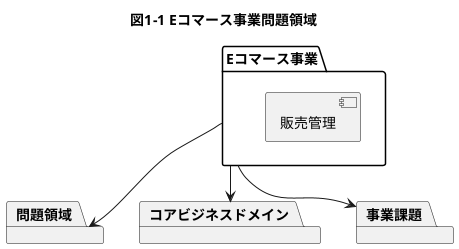
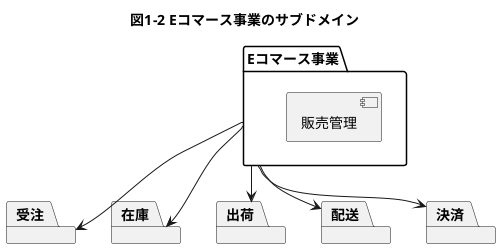
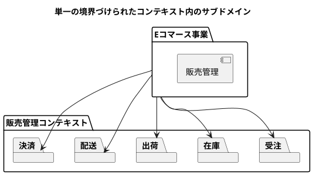
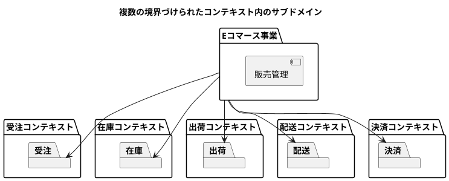
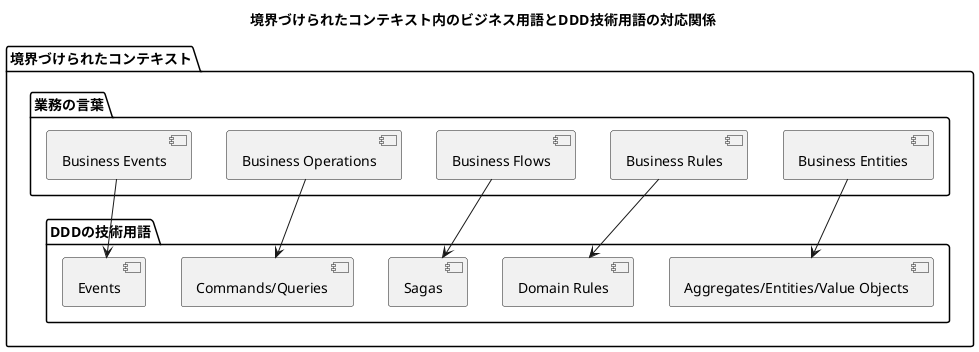
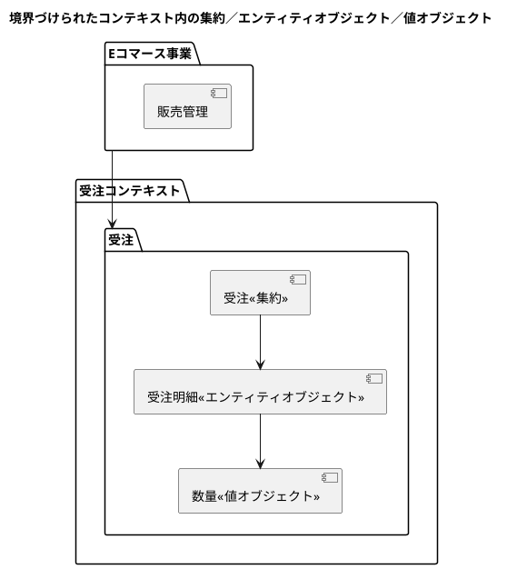
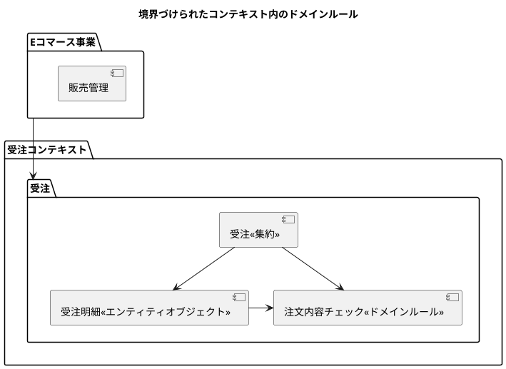
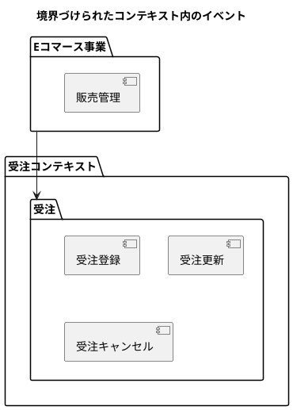
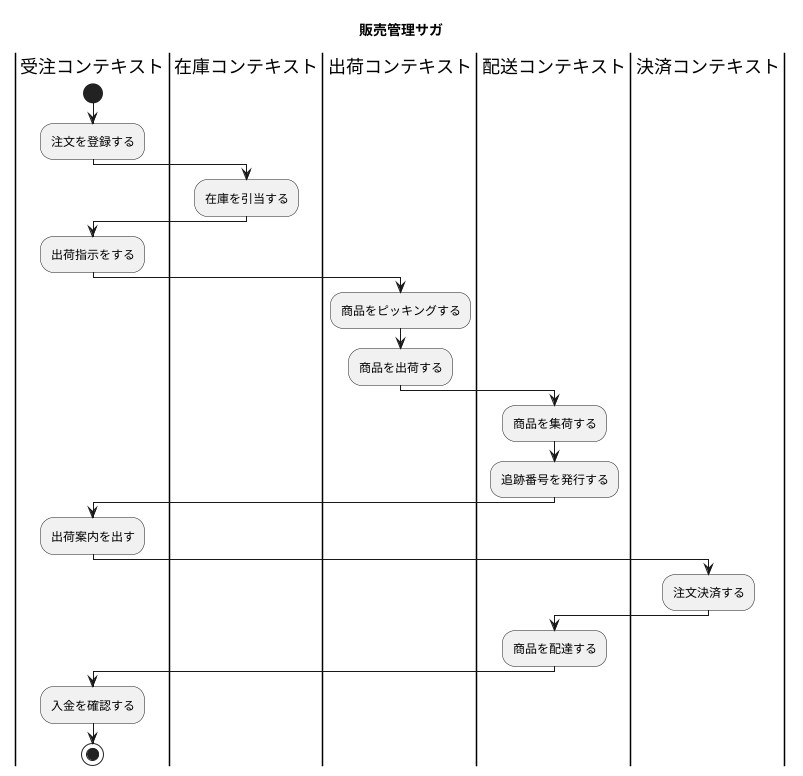

# 第 1 章：ドメイン駆動設計

- ドメイン駆動設計はソフトウェアの設計と開発に強固でシステマティックなアプローチを提供します。
- この記事では2つのパートに分けて、DDD の概念と実装の詳細を説明します。
- DDDモデリング概念
  - 最初の2章は戦略的設計の概念を紹介します。
  - 参照実装を通じてモデリングの考え方を示します。
- DDD実装
　- エンタープライズJavaを使って3つの異なる実装を紹介します。
    - 最初の実装はSpring Bootによるモノリシックアーキテクチャを基本としたDDD実装詳細の解説。
    - 次の実装はSpring Bootによるマイクロサービスアーキテクチャを基本としたDDD実装詳細の解説。
    - 最後の実装はSpring BootとAxon Frameworkによるマイクロサービスアーキテクチャを基本としたDDD実装詳細の解説。

## DDD の概念

- 最初のこの記事の意図を明確するためDDDクイックガイドを進めます。

### 問題空間／ビジネスドメイン

- 問題空間またはビジネスドメインがDDDの始点となります。
- DDDを使って解決するための主要なビジネス課題を明確にします。
- 具体例としてEコマース事業を使います。図1-1 Eコマース事業問題領域
- 問題領域/ビジネスドメインは常に企業の価値提案に変換されます。



### サブドメイン／境界づけられたコンテキスト

- 主要なビジネスドメインを特定したら次にやることはサブドメインに分割することです。
- 理想的なサブドメインの分割は事業のケイパビリティを関連性のある業務機能ごとに分割することです。
- 図1-2 Eコマース事業のサブドメイン
  - 受注サブドメイン - 顧客からの注文を管理するケイパビリティ
  - 在庫サブドメイン - 商品の在庫を管理するケイパビリティ
  - 出荷サブドメイン - 商品の出荷を管理するケイパビリティ
  - 配送サブドメイン - 商品の配送を管理するケイパビリティ
  - 決済サブドメイン - 商品の決済を管理するケイパビリティ



- 問題領域として特定したサブドメインを解決領域に変換するために、境界づけられたコンテキストを定義します。
- 境界づけられたコンテキストは特定のビジネスドメイン/サブドメインに対する設計ソリューションです。
- Eコマース事業においては販売管理コンテキストとしてまとめて解決領域を定義することもそれぞれ個別のコンテキストとして解決領域を定義することもできます。





- 境界づけられたコンテキストが単一の関連性の強い単位でまとめらている限りアプリケーションの配置方法に制限はありません。
- 複数の境界づけられたコンテキストをモノリシックアプリケーションとしてデプロイすることも、マイクロサービスとしてデプロイすることもできます。

## ドメインモデル

- ドメインソリューションでもっとも重要でクリティカルな箇所が境界づけられたコンテキストのドメインモデルの確立です。
- ドメインモデルは特定の境界づけられたコンテキスト内のコアビジネスロジックの実装です。
- 業務の言葉では以下が特定されます。
  - Business Entities
  - Business Rules
  - Business Flows
  - Business Operations
  - Business Events
- DDDの技術用語では以下に変換されます。
  - Aggregates/Entities/Value Objects
  - Domain Rules
  - Sagas
  - Commands/Queries
  - Events



### 集約／エンティティオブジェクト／値オブジェクト

- 集約は境界づけられたコンテキスト内での中心的なビジネスオブジェクトです。
- 集約は境界づけられたコンテキスト内の一貫性のスコープを定義します。
- 境界づけられたコンテキストのあらゆる局面で集約内で開始から終了までを扱います。
- エンティティオブジェクトは識別子を持つが集約なしには存在できないビジネスオブジェクトです。
- エンティティオブジェクトは集約のライフサイクルに従い生成・消滅します。
- 値オブジェクトは識別子をもたず、集約、エンティティオブジェクト内で簡単に差し替え可能なビジネスオブジェクトです。



- 受注は受注コンテキスト内の集約です。受注なしには受注コンテキスト内には何も存在しません。
- 受注明細は受注の集約内に存在するエンティティオブジェクトです。受注ID識別子を持ちますが受注無しには存在しません。 受注が削除されれば受注明細も削除されます。
- 数量は受注明細のエンティティオブジェクト内に存在する値オブジェクトです。識別子をもたず、受注集約内でとりかえ可能です。

### ドメインルール

- ドメインルールは純粋な業務ルール定義です。境界づけられたコンテキスト内の集約に関するビジネスロジックの実行をサポートします。



- 注文内容チェックドメインルールは受注可能な注文（数量・金額）を判定するために使われます。

### コマンド／クエリ

- コマンド/クエリは集約/エンティティオブジェクト両方の状態変化または集約/エンティティオブジェクトへの問い合わせなど境界づけられたコンテキスト内での操作の種類を表すものです。

```plantuml
title 境界づけられたコンテキスト内のコマンド/クエリ

package "Eコマース事業" {
    [販売管理] as SalesManagement
}

package 受注コンテキスト {
    package "受注" {
      package コマンド {
          [受注登録]
          [受注更新]
          [受注キャンセル]
      }
      package クエリ {
          [受注照会] 
          [受注一覧照会]
      }
    }
}


"Eコマース事業" --> "受注"
```

- 受注コンテキスト内のコマンドには受注登録、更新、キャンセルなど状態を変更する操作が含まれます。
- 受注コンテキスト内のクエリには受注一覧照会、受注照会など問い合わせ操作が含まれます。

### イベント

- イベントは境界づけられたコンテキスト内の集約/エンティティオブジェクトの状態変化に関する全ての出来事を取得します。



### サガ

- DDDモデリングの最終局面としてビジネスドメイン内のプロセス/ワークフローをあぶりだします。
- サガは単一の境界づけられたコンテキストまたは複数の境界づけられたコンテキストかに制約されないが主に複数の境界づけられたコンテキストをまたぐ場合に使われます。
- サガは複数の境界づけられたコンテキストをまたいだビジネスイベントに作用しそれぞれの境界づけられたコンテキストに介入することでビジネスプロセスオーケストレーションを実現します。



- もし販売管理のビジネスプロセスを並べたなら以下の流れになる。
  - 顧客が注文をして受注担当が注文を登録する。
  - 受注担当者は受注した商品を在庫引当する。
  - 受注担当者は注文の出荷指示をする。
  - 出荷担当者は出荷指示を基に商品をピッキングして出荷する。
  - 配送担当は集荷した商品の追跡番号を発行する。
  - 受注担当者は追跡番号を添付した出荷案内を出す。
  - 受注担当者は注文決済をする。
  - 受注担当者は入金を確認する。

## まとめ

- まず、DDDを使って解決したい主要な問題領域、事業課題を明確にする。
- 明確になったら問題領域を複数のケイパビリティまたはサブドメインに分割する。境界づけられたコンテキストを決めることで解決領域に進むことができる。
- 境界づけられたコンテキストで確立された解決領域を深堀する。それぞれの境界づけられたコンテキストに含まれる集約/運用/フローを特定することも含まれる。

