# 第 2 章：Cargo Tracker のドメインモデル

- Cargo Tracker プロジェクトはこの記事に置ける第1級リファレンス実装です。
- この実装はDDD界隈で長くDDDテクニック実装として参照されています。
- Cargo Tracker アプリケーションは物流企業で使われます。
- このアプリケーションは予約、経路、追跡そして荷役に関する物流業務の全ライフサイクルを管理するケイパビリティを提供します。
- このアプリケーションは運用担当者、顧客そして港湾労働者に使ってもらうことを意図しています。
- この章ではまずDDD-specific Domain Modeling processに従ってDDD実装を進めていきます。
- このモデリングの意図は 高レベルと低レベルのDDDアーティファクトセットを取得することです。
- 高レベルでは下位レベルの実装を要求します。 一方で低レベルでは上位レベルの実装を要求します。
- このドメインモデリングプロセスはモノリシックまたはマイクロサービスのいずれに取り組むとしても有効です。

## コアドメイン

- DDD精神にのっとって始めるにあたりまずCargo Trackerのコアドメイン/問題領域を定義します。
- コアドメインを特定するにあたりコアドメインのDDD成果物を定義します。この過程で4つの成果物を定義します。
  - コアドメインのサブドメイン/境界づけられたコンテキスト
  - ドメインモデル
  - ドメインサガ
  - ドメインモデルサービス

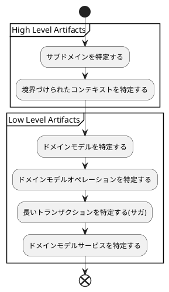

## Cargo Tracker: サブドメイン／境界づけられたコンテキスト

- いくつかのサブドメインを特定するため各業務領域をサブドメインとして分類する。
- Cargo Trackerドメインにおいて、4つの業務領域を持っている。
  - Booking(予約) - 貨物予約は以下の領域を全て網羅する
    - 貨物予約
    - 貨物経路割当
    - 貨物変更(予約された荷物の仕向け変更)
    - 貨物キャンセル
  - Routing(経路) - 貨物旅程は以下の領域を全て網羅する
  　- 経路仕様に基づいた旅程割当の最適化
  　- 貨物を輸送する機械の航路管理
  - Handling(荷役) - 貨物が割り当てられた経路を進むにつれて貨物の検査/荷役が発生する。この領域は荷役にかかわるすべてのオペレーションを網羅する
  - Tracking(追跡) - 顧客は包括的で詳細かつ最新の荷物情報を欲している。追跡業務はここにケイパビリティをあたえる
- それぞれの業務領域はDDDパラダイムではサブドメインに分類される。
- 問題領域のサブドメインを特定する一方で解決策を決定する必要がある。前の章で見たように境界づけられたコンテキストの概念を使う。
- 境界づけられたコンテキストは主要問題領域のソリューションデザインであり、各境界づけられたコンテキストは単一のサブドメインにも複数のサブドメインにもマッピングできる。
- 今回のケースでは単一のサブドメインごとにそれぞれ境界づけられたコンテキストをマッピングすることを想定する。
- サブドメインを特定する必要性はモノリシック、マイクロサービスいずれのアーキテクチャスタイルに関係はない。

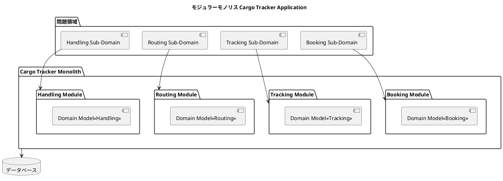

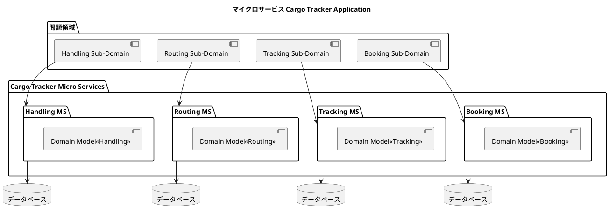

- 設計ソリューションのサブドメインは境界づけられたコンテキストを経由してモノリス、マイクロサービスいずれのアーキテクチャでもデプロイすることで完結する。
- 業務領域のコンセプトを使って、複数のサブドメインにコアドメインを分割して境界づけられたコンテキストをソリューションとして特定する。
- 境界づけられたコンテキストは開発ソリューションにより異なった設計をとる。
- モノリシックアーキテクチャの文脈ではモジュールとして実装する。
- マイクロサービスアーキテクチャの文脈では分割したマイクロサービスとして実装する。
- 境界づけられたコンテキストの設計実装はオリジナルのサブドメインごとの境界づけられたコンテキストへのマッピング定義で決定されます。
- 境界づけられたコンテキストが最終ソリューションです。
- 次は各境界づけられたコンテキストからドメインモデルを抽出します。

## Cargo Tracker: ドメインモデル

- 境界づけられたコンテキストのドメインモデルはDDD-ベースアーキテクチャの基盤であり業務の意図を表現するために使われます。
- ドメインモデルの特定は以下の成果物を含みます。
  - コアドメインモデル - 集約、集約識別子、エンティティそして値オブジェクト
  - ドメインモデルオペレーション - コマンド,クエリそしてイベント

### 集約

- ドメインモデル設計の局面で最も基本的で重要なことは境界づけられたコンテキスト内の集約を特定することです。
- 集約は境界づけられたコンテキストと関連する全ての状態とビジネスルールを取り扱う責務を持ちます。

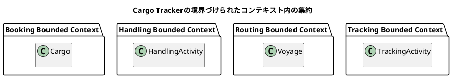

### 集約識別子

- 集約識別子はビジネスキーを使って実装します。

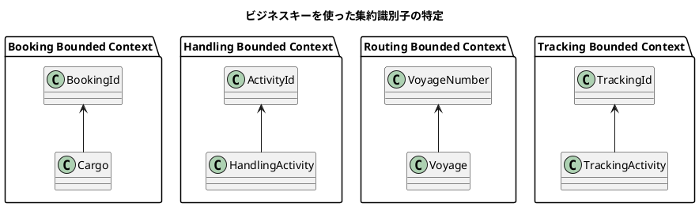

- 各境界づけられたコンテキストはエンティティと値オブジェクトを経由して実装した集約との関連を通じてドメインロジックを表現します。

### エンティティ

- 境界づけられたコンテキスト内のエンティティは識別子を持つが集約なしには存在できません。

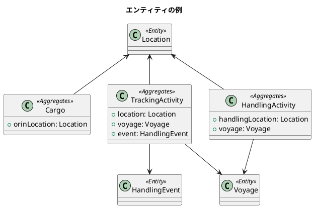

### 値オブジェクト

- 値オブジェクトは境界づけられたコンテキスト内で識別子を持たず集約内部で取り換え可能です。

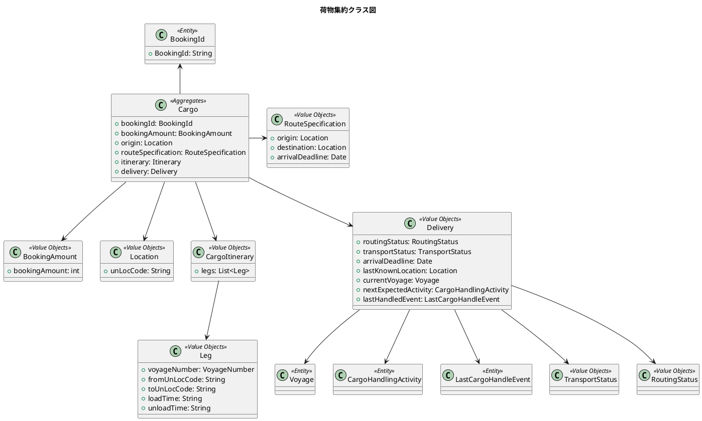

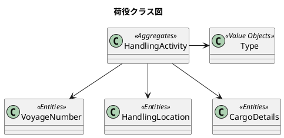

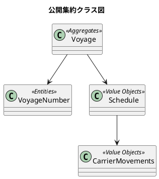

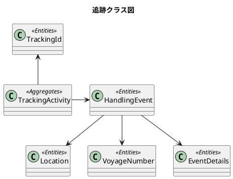

## Cargo Tracker: ドメインモデルの操作

- Cargo Trackerの境界づけられたコンテキストによりアウトラインを作成しコアドメインモデルを引き出しました。
- 次は境界づけられたコンテキスト内で発生するドメインモデルオペレーションを明確にします。
- 境界づけられたコンテキスト内のオペレーションとして
  - コマンド : 境界づけられたコンテキスト内ので要求されるステータスの変更
  - クエリ：境界づけられたコンテキスト内の状態の要求
  - イベント：境界づけられたコンテキスト内の状態の変更の通知

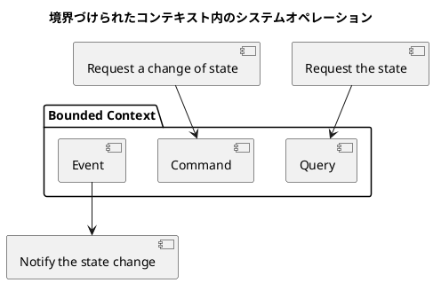

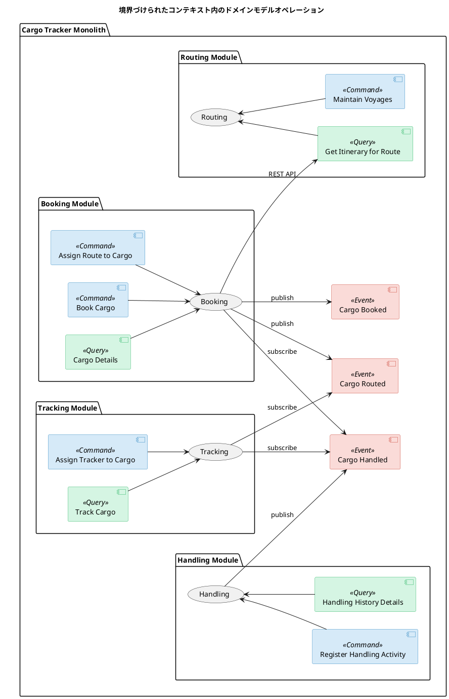

### サガ

- サガはマイクロサービスアーキテクチャの適用する場合、最初に使われます。
- サガは `イベントコレオグラフィ` または `イベントオーケストレーション` のいずれかのパターンで実装されます。
  - コレオグラフィベースの実装はマイクロサービス内で直接発火、購読を開始します。
  - オーケストレーションベースの実装は中央制御コンポーネントを介してライフサイクルを管理します。

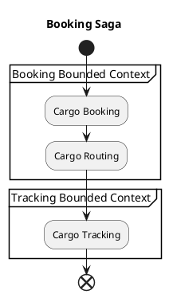

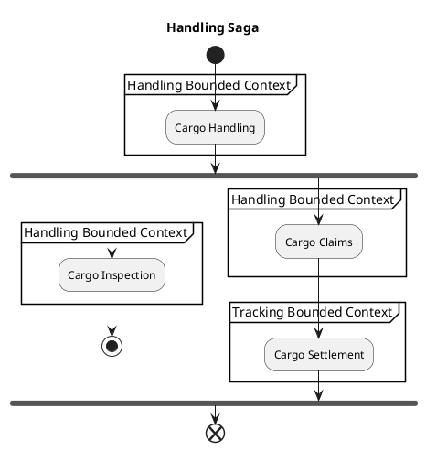

- 予約サガは荷物予約、経路設定、追跡のビジネスオペレーションを含みます。荷物の予約から経路設定、最後に追跡番号を発行します。追跡番号は顧客が荷物の現在位置を追跡するために使われます。
- 荷役サガは荷物の積み下ろし、検査、要求、到着までのビジネスオペレーションを含みます。航路の港ごとに行われ最終仕向けへの顧客からの要求に対応します。
- いづれのサガも境界づけられたコンテキスト内/マイクロサービスをまたいだ一貫整合性を最後まで維持することが求められます。

### ドメインモデルサービス

- ドメインモデルサービスは2つの主要な理由から使われます。
  - 良く定義されたインターフェースを経由して境界づけられたコンテキスト内のドメインモデルを外部で利用可能にするため。
  - 境界づけられたコンテキスト内の状態をデータストアに保存し、境界づけられたコンテキスト内の状態の変更を外部のメッセージブローカーに公開するため。他の境界づけられたコンテキストとやり取りするため。
- 境界づけられたコンテキストのドメインモデルサービスには３つのタイプがあります。
  - インバウンドサービス:ドメインモデルを外部とやり取りするための良く定義されたインターフェースの実装。
  - アウトバウンドサービス:外部レポジトリ/他の境界づけられたコンテキストとのやり取りするための実装。
  - アプリケーションサービス:ドメインモデルとインバウンド・アウトバウンドサービスの間のファサード。

```plantuml
@startuml

title モノリスアーキテクチャ内のドメインモデルサービス

skinparam component {
    BackgroundColor<<Inbound Services>> #D6EAF8
    BackgroundColor<<Outbound Services>> #D5F5E3
    BackgroundColor<<Application Services>> #FADBD8
}

package "Cargo Tracker Monolith" {
  package "Booking Module" {
    [REST API] <<Inbound Services>> as 1_1
    [Event API] <<Inbound Services>> as 1_2
    [Web API] <<Inbound Services>> as 1_3
    [Repositories] <<Outbound Services>> as 1_4
    [Brokers] <<Outbound Services>> as 1_5
    usecase BookingDomainModel<<Application Services>> [
      Booking Domain Model 
    ] 
    
    1_1 --> BookingDomainModel
    1_2 --> BookingDomainModel 
    1_3 --> BookingDomainModel 
    BookingDomainModel --> 1_4 
    BookingDomainModel --> 1_5 
  }

  package "Tracking Module" {
    [REST API] <<Inbound Services>> as 2_1
    [Event API] <<Inbound Services>> as 2_2
    [Web API] <<Inbound Services>> as 2_3
    [Repositories] <<Outbound Services>> as 2_4
    [Brokers] <<Outbound Services>> as 2_5
    usecase TrackingDomainModel<<Application Services>> [
      Tracking Domain Model 
    ] 
    
    2_1 --> TrackingDomainModel
    2_2 --> TrackingDomainModel 
    2_3 --> TrackingDomainModel 
    TrackingDomainModel --> 2_4 
    TrackingDomainModel --> 2_5
  }
  
  package "Routing Module" {
    [REST API] <<Inbound Services>> as 3_1
    [Event API] <<Inbound Services>> as 3_2
    [Web API] <<Inbound Services>> as 3_3
    [Repositories] <<Outbound Services>> as 3_4
    [Brokers] <<Outbound Services>> as 3_5
    usecase RoutingDomainModel<<Application Services>> [
      Routing Domain Model 
    ] 
    
    3_1 --> RoutingDomainModel
    3_2 --> RoutingDomainModel 
    3_3 --> RoutingDomainModel 
    RoutingDomainModel --> 3_4 
    RoutingDomainModel --> 3_5
  }
  
  package "Hnadling Module" {
    [REST API] <<Inbound Services>> as 4_1
    [Event API] <<Inbound Services>> as 4_2
    [Web API] <<Inbound Services>> as 4_3
    [Repositories] <<Outbound Services>> as 4_4
    [Brokers] <<Outbound Services>> as 4_5
    usecase HandlingDomainModel<<Application Services>> [
      Handling Domain Model 
    ] 
    
    4_1 --> HandlingDomainModel
    4_2 --> HandlingDomainModel 
    4_3 --> HandlingDomainModel 
    HandlingDomainModel --> 4_4 
    HandlingDomainModel --> 4_5
  } 
}

package "External Services" {
  database DB_1 [
    CargoTracker DB
  ]
  queue BUS_1 [
    Event Bus
  ]
}

"Cargo Tracker Monolith" --> "External Services"

@enduml
```

```plantuml
@startuml

title マイクロサービスアーキテクチャ内のドメインモデルサービス

skinparam component {
    BackgroundColor<<Inbound Services>> #D6EAF8
    BackgroundColor<<Outbound Services>> #D5F5E3
    BackgroundColor<<Application Services>> #FADBD8
}

package "Cargo Tracker Microservice" {
  package "Booking Microservice" {
    [REST API] <<Inbound Services>> as 1_1
    [Event API] <<Inbound Services>> as 1_2
    [Repositories] <<Outbound Services>> as 1_4
    [Brokers] <<Outbound Services>> as 1_5
    usecase BookingDomainModel<<Application Services>> [
      Booking Domain Model 
    ] 
    
    1_1 --> BookingDomainModel
    1_2 --> BookingDomainModel 
    BookingDomainModel --> 1_4 
    BookingDomainModel --> 1_5 
  }

  package "Tracking Microservice" {
    [REST API] <<Inbound Services>> as 2_1
    [Event API] <<Inbound Services>> as 2_2
    [Repositories] <<Outbound Services>> as 2_4
    [Brokers] <<Outbound Services>> as 2_5
    usecase TrackingDomainModel<<Application Services>> [
      Tracking Domain Model 
    ] 
    
    2_1 --> TrackingDomainModel
    2_2 --> TrackingDomainModel 
    TrackingDomainModel --> 2_4 
    TrackingDomainModel --> 2_5
  }
  
  package "Routing Microservice" {
    [REST API] <<Inbound Services>> as 3_1
    [Event API] <<Inbound Services>> as 3_2
    [Repositories] <<Outbound Services>> as 3_4
    [Brokers] <<Outbound Services>> as 3_5
    usecase RoutingDomainModel<<Application Services>> [
      Routing Domain Model 
    ] 
    
    3_1 --> RoutingDomainModel
    3_2 --> RoutingDomainModel 
    RoutingDomainModel --> 3_4 
    RoutingDomainModel --> 3_5
  }
  
  package "Hnadling Microservice" {
    [REST API] <<Inbound Services>> as 4_1
    [Event API] <<Inbound Services>> as 4_2
    [Repositories] <<Outbound Services>> as 4_4
    [Brokers] <<Outbound Services>> as 4_5
    usecase HandlingDomainModel<<Application Services>> [
      Handling Domain Model 
    ] 
    
    4_1 --> HandlingDomainModel
    4_2 --> HandlingDomainModel 
    HandlingDomainModel --> 4_4 
    HandlingDomainModel --> 4_5
  } 
}

package "External Services" {
  database DB_1 [
    Booking DB
  ]
  database DB_2 [
    Routing DB
  ]
  database DB_3 [
    Tracking DB
  ]
  database DB_4 [
    Handling DB
  ]
  queue BUS_1 [
    Message Broker
  ]
}

"Cargo Tracker Microservice" --> "External Services"

@enduml
```

### ドメインモデルサービス設計

- ヘキサゴナルアーキテクチャパターンはモデルと設計を一致させる手助けとドメインモデルをサポートするサービスの実装に完全に適合します。

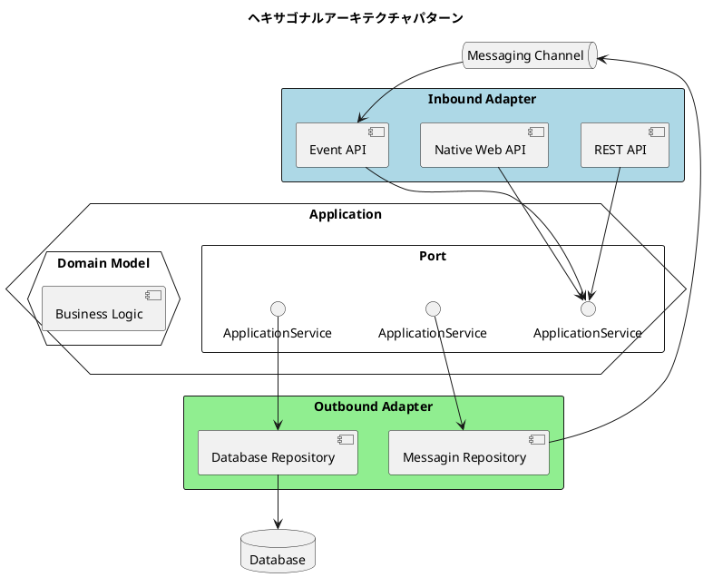

- ヘキサゴナルアーキテクチャはドメインモデルを実装するにあたって`ポートとアダプター`のコンセプトを使います。
- ヘキサゴナルアーキテクチャのポートはインバウンドとアウトバウンドの2種類があります。
  - インバウンドポートはドメインモデルのビジネスオペレーションのインターフェースを提供します。
  - アウトバウンドポートはドメインモデルに要求される技術的操作に対するインターフェースを提供します。
- ヘキサゴナルアーキテクチャのアダプターはインバウンドアダプターとアウトバウンドアダプターの2種類があります。
  - インバウンドアダプターはドメインモデルを利用する外部クライアントとしての実現性を提供します。
  - アウトバウンドアダプターは特定のレポジトリに対する実装を提供します。
- これが DDD仕様設計プロセスです。サブドメイン/境界づけられたコンテキストを解決領域に切り出し、各境界づけられたコンテキストごとのドメインモデルを詳細化して、境界づけられたコンテキスト内のドメインモデルオペレーションを詳細化してそして最後にドメインモデルに要求されるドメインモデルサポートサービスに到達します。
- この設計プロセスはマイクロサービスアーキテクチャであれモノリスアーキテクチャであれ変わることなく適用します。

### Cargo Tracker: DDD 実装

- 実装に入るにあたって以下のトピックに従って実装を進めていきます。
  - Spring Bootプラットフォームを使った DDDベースモノリスアーキテクチャ
  - Spring Bootプラットフォームを使った DDDベースマイクロサービスアーキテクチャ
  - Axonフレームワークを使った DDDベースマイクロサービスアーキテクチャ

## まとめ

- Cargo Tracker参照アプリケーションの概要とアプリケーションのサブドメイン/境界づけられたコンテキストを決定した。
- 集約、エンティティ、値オブジェクトを含むCargo Trackerのコアドメイン明確にした。また、Cargo Trackerアプリケーションのドメインモデルオペレーションとサガも確立した。
- ヘキサゴナルアーキテクチャを使ってCargo Trackerのドメインモデルが要求するドメインモデルサービスを決定した。

