# 第 4 章：Spring Platform × EDA

- アプリケーション設計のための様々なDDD成果物をモデルリングプロセスを進めてCargo Trackerアプリケーション設計を詳細化した。
  - 荷物追跡問題領域/コアドメインに特定してCargo Trackerアプリケーションを問題領域のソリューションに割り当てた。
  - Cargo Trackerアプリケーションのサブドメイン/境界づけられたコンテキストを特定した。
  - 集約、エンティティ、値オブジェクトそしてドメインルールを含むドメインモデルを各境界づけられたコンテキスト毎に詳細化した。
  - 境界づけられたコンテキストで要求されるサポートドメインサービスを特定した。
  - 境界づけられたコンテキスト内の様々なオペレーションを特定した。（コマンド、クエリ、イベントそしてサガ）
  - Spring プラットフォームを使ったモノリシック版Cargo Trackerアプリケーションを実装した。
- この章ではCargo Trackerアプリケーションをマイクロサービスアーキテクチャを使って設計しこれまで同様にDDDアーティファクトをSpringプラットフォームで実装します。

## Spring プラットフォーム

- Spring Platform(https://spring.io/)はエンタープライズアプリケーションを構築するJavaの主流フレームワークです。
- 第 3 章で見たプロジェクトポートフォリオは変わりません。変わるのは**どの区画を使うか**です。
  - Core Infrastructure Projects:第 3 章と同じく中核として使います
  - Data Operations and Management Projects:Spring AMQP がここで加わります
  - Cloud Technologies Projects:Spring Cloud Gateway がここで加わります
  - Other Projects:springdoc-openapi による API ドキュメント

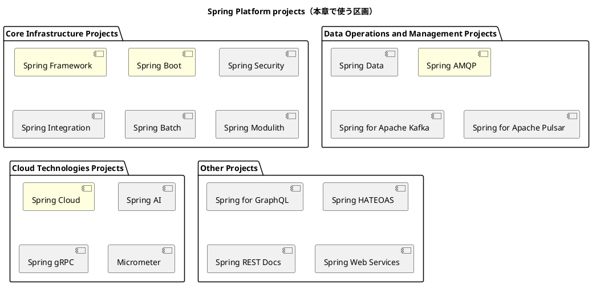

> 色を付けたものが本章の実装で実際に使われている区画です。第 3 章では Core Infrastructure Projects だけで足りていました。

### EDA プラットフォームへの要求

- BC をプロセスへ分けると、プラットフォームへの要求はモジュラーモノリスの上位集合になります。
- 分類は第 3 章と同じ 5 つです。**分類そのものは変わらず、各分類の中身が外部化されます。**
  - Business Logic Patterns:サービスの内側の業務ロジック
  - Communication Patterns:サービスをまたぐ通信
  - Distributed Transaction Management Patterns:整合性の担保
  - Deployment Patterns:配置と成果物
  - Readiness Patterns:運用準備（可観測性）

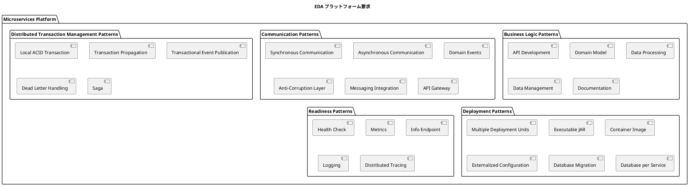

- それぞれの要求を、Spring プロジェクトポートフォリオと本章の実装へ対応づけます。
- **第 3 章から変わった行に印を付けます。**

| 分類 | 要求 | 対応する Spring プロジェクト | 本章での実装 | 第 3 章から |
| :--- | :--- | :--- | :--- | :--- |
| Business Logic | API Development | Spring Framework（Spring MVC）／Spring Boot | `interfaces.rest` の `@RestController` | 変更（画面 → API） |
| Business Logic | Domain Model | （フレームワーク非依存のプレーン Java） | `domain.model` の集約・値オブジェクト | 同じ |
| Business Logic | Data Processing | Spring Framework（`@Transactional`） | `application.internal.commandservices` の UseCase | 同じ |
| Business Logic | Data Management | MyBatis Spring Boot Starter | `infrastructure.repositories` の Mapper 実装 | 同じ |
| Business Logic | Documentation | springdoc-openapi | サービスごとの `/swagger-ui` | 同じ |
| Communication | Synchronous Communication | Spring Framework（`RestClient`） | `RestRouteCandidateFinder`（サービス間 HTTP） | **変更**（DI → HTTP） |
| Communication | Asynchronous Communication | Spring AMQP | `RabbitTemplate` / `@RabbitListener` | **変更**（プロセス内 → ブローカー） |
| Communication | Domain Events | Spring AMQP | `TrackingNumberIssued` などの契約イベント | **変更** |
| Communication | Anti-Corruption Layer | Spring Framework（インターフェース + 実装） | `outboundservices.acl` + `infrastructure.acl` | 同じ |
| Communication | Messaging Integration | Spring AMQP（Spring Cloud Stream は不採用） | 交換機とルーティングキーを直接名指しする | **追加** |
| Communication | API Gateway | Spring Cloud Gateway | `gatewayms` | **追加** |
| Distributed Transaction | Local ACID Transaction | Spring Framework（`@Transactional`） | サービス自身の DB に閉じる | 範囲が縮小 |
| Distributed Transaction | Transaction Propagation | Spring Framework | UseCase をトランザクション境界とする | 同じ |
| Distributed Transaction | Transactional Event Publication | Spring Framework（`TransactionSynchronizationManager`） | `RabbitCargoEventNotifier` の `afterCommit` | **変更**（購読側の注釈 → 発行側の自作） |
| Distributed Transaction | Dead Letter Handling | Spring AMQP | デッドレターキューと予備の交換機 | **追加** |
| Distributed Transaction | Saga | Axon Framework など | 本章では未使用（第 5 章で導入） | 同じ |
| Deployment | Multiple Deployment Units | Spring Boot | 8 サービスを個別に起動する | **変更**（単一 → 複数） |
| Deployment | Executable JAR | Spring Boot（`bootJar`） | サービスごとの実行可能 JAR | 単位が増加 |
| Deployment | Container Image | Spring Boot ＋ Dockerfile | サービスごとの `Dockerfile` | 単位が増加 |
| Deployment | Externalized Configuration | Spring Boot（環境変数／Profile） | 既定値つき環境変数と `application-product.yml` | 同じ |
| Deployment | Database Migration | Flyway | サービスごとの `db/migration` | 単位が増加 |
| Deployment | Database per Service | （構成上の判断） | `booking_db` / `routing_db` / `tracking_db` … | **追加** |
| Readiness | Health Check | Spring Boot Actuator | `/actuator/health`（probes 有効） | 単位が増加 |
| Readiness | Metrics | Spring Boot Actuator ／ Micrometer | `/actuator/metrics` | 単位が増加 |
| Readiness | Info Endpoint | Spring Boot Actuator | `/actuator/info` | 単位が増加 |
| Readiness | Logging | Spring Boot（Logback） | 既定構成 | 同じ |
| Readiness | Distributed Tracing | Micrometer Tracing | **未導入** | **必要になったが無い** |

- Business Logic Patterns はほとんど変わりません。**業務ロジックの書き方は配置の仕方に依存しません。**
- Communication Patterns と Distributed Transaction Management Patterns が、プロセスの外へ出ます。
  - 第 3 章では DI・アプリケーションイベント・単一 DB のローカルトランザクションで満たしていました。
  - 本章ではそれぞれ HTTP・メッセージブローカー・サービスごとの DB に置き換わります。
  - **置き換えると要求が 2 つ増えます**（Messaging Integration と Dead Letter Handling）。届かないことが起こりうるからです。
- Deployment Patterns と Readiness Patterns は、要求そのものは変わらず**単位が 8 倍になります**。
  - Spring Boot と Actuator が提供する部分は据え置きです。
  - 増えるのは「同じことを 8 回やる」コストであり、これは自動化で吸収する種類のものです。
- 一方 Distributed Tracing は、**分散したことで初めて必要になり、まだ導入されていません**。
  - 第 3 章では「分散構成となる第 4 章以降の検討事項」と書きました。本章の実装でもまだ検討事項のままです。
  - 1 つの要求を追ってサービスを 3 つ跨いだとき、いまは各サービスのログを時刻で突き合わせるしかありません。

### Spring Boot: 機能

- 前節の要求一覧のうち、Deployment Patterns と Readiness Patterns の大半は Spring Boot が肩代わりします。
- ここは第 3 章と変わりません。**変わるのは、同じ肩代わりをサービスの数だけ用意することです。**

#### 自動構成とスターター

- 各サービスが宣言するスターターは、第 3 章の一覧から画面用のものが抜け、メッセージング用のものが加わった形です。

```gradle
implementation 'org.springframework.boot:spring-boot-starter-web'
implementation 'org.springframework.boot:spring-boot-starter-validation'
implementation 'org.springframework.boot:spring-boot-starter-actuator'
implementation 'org.springdoc:springdoc-openapi-starter-webmvc-ui:3.0.2'
implementation 'org.mybatis.spring.boot:mybatis-spring-boot-starter:4.0.1'
implementation 'org.springframework.boot:spring-boot-starter-flyway'
implementation 'org.springframework.boot:spring-boot-starter-amqp'
```

転記元: `bookingms/build.gradle`

- 抜けたのは `spring-boot-starter-thymeleaf` と `spring-boot-starter-security` です。
  - 画面は別のフロントエンド（`apps/frontend`）が担います。
  - 認証は Gateway に集約したため、各サービスは Spring Security を持ちません。
- 加わったのは `spring-boot-starter-amqp` です。**プロセスが分かれた瞬間に、メッセージングが必要になります。**
- 共有ライブラリもスターターと同じく依存として宣言します。

```gradle
implementation project(':shared')
```

転記元: `bookingms/build.gradle`

- **1 行の依存が、8 サービスすべてを同時に壊しうる場所です。**共有カーネルを 2 要素に絞る判断（第 3 章）が、ここでは「再デプロイの範囲」という形で効いてきます。

#### 起動クラスとコンポーネントスキャン

- `@SpringBootApplication` を付けたクラスのパッケージが、コンポーネントスキャンの起点になります。

```java
@SpringBootApplication
public class BookingApplication {

    public static void main(String[] args) {
        SpringApplication.run(BookingApplication.class, args);
    }
}
```

転記元: `bookingms/BookingApplication.java`

- 第 3 章との違いは**スキャンの範囲**です。
  - 第 3 章の起動クラスは全 BC のトップレベルパッケージの親にあり、それがすべての BC を 1 プロセスにまとめる根拠でした。
  - 本章の起動クラスは 1 つの BC の親にしかいません。**他の BC はクラスパスに存在しないため、スキャンしようがありません。**
- 起動クラスに BC の一覧が現れないのもこのためです。サービスの一覧はビルドの構成が持ちます。

```gradle
include 'shared'
include 'gatewayms'
include 'authms'
include 'bookingms'
include 'routingms'
include 'trackingms'
include 'handlingms'
include 'billingms'
include 'simulationms'
```

転記元: `settings.gradle`

#### 外部化された設定

- 設定は**既定値つきの環境変数**で受けます。Profile 別ファイルは本番（Heroku）向けの 1 つだけです。

```yaml
spring:
  application:
    name: bookingms
  datasource:
    url: ${DB_URL:jdbc:h2:mem:booking_db;MODE=PostgreSQL;DATABASE_TO_LOWER=TRUE;DEFAULT_NULL_ORDERING=HIGH}
  rabbitmq:
    host: ${RABBITMQ_HOST:localhost}
    port: ${RABBITMQ_PORT:5672}
```

転記元: `bookingms/src/main/resources/application.yml`

- 分散で新しく現れるのが**相手の所在**です。第 3 章にはメソッド呼び出ししかなく、相手の住所という概念がありませんでした。

```yaml
  # **相手の所在は環境ごとに上書きする。**
  #
  # 既定値は**開発機（localhost）を指す**。クラスタの中では自分自身を指すことになり、
  # 入れ忘れても起動は成功して、その相手を使う操作だけが失敗する
  # ——IT5（経路の確定）と IT12（見積の候補）で 2 度踏んだ。
  # **デプロイの手順（k8s マニフェスト・deploy.js）が必ず渡す。**
  routing-service:
    # 経路の確定時に候補の成立を確かめる先（ADR-019 決定 2）
    base-url: ${APP_ROUTING_SERVICE_BASE_URL:http://localhost:8083}
```

転記元: `bookingms/src/main/resources/application.yml`

- **既定値があることが、この設定の危険な点です。**
  - 設定漏れが起動失敗にならず、その相手を使う操作だけが失敗します。
  - 第 3 章の自動構成で見た「起動は成功するが効いていない」と同じ失敗の形が、分散では相手ごとに現れます。
- 設定の受け取り方は 2 通りあり、本章の実装では大半が `@Value` です。

```java
    /** 業務日付は業務タイムゾーンで判断する。UTC で判断すると「当日」の扱いがずれる時間帯ができる。 */
    @Bean
    public Clock clock(@Value("${app.business-time-zone:Asia/Tokyo}") String zoneId) {
        return Clock.system(ZoneId.of(zoneId));
    }
```

転記元: `bookingms/infrastructure/config/BookingConfig.java`

- `@ConfigurationProperties` を使うのは gatewayms と simulationms の 2 つだけです。
  - 第 3 章が `@ConfigurationPropertiesScan` で型として受けていたのに対し、こちらは 1 つずつの値として受けています。
  - **設定項目が少ないうちは差が出ませんが、綴り間違いが起動時に判明しない点は変わりません。**

#### 成果物の切り分け

- 成果物はサービスごとの実行可能 JAR とコンテナイメージです。

```dockerfile
FROM eclipse-temurin:25-jre-alpine
WORKDIR /app

# Heroku Container Runtime は $PORT を注入する。ローカル・kind では既定値を使う。
ENV PORT=8082

RUN addgroup -S spring && adduser -S spring -G spring
COPY build/libs/*.jar /app/app.jar
USER spring
```

転記元: `bookingms/Dockerfile`

- Deployment Patterns の Multiple Deployment Units・Executable JAR・Container Image は、この組み合わせで満たされます。
- **第 3 章と判断が分かれた箇所があります。**H2 の扱いです。

```gradle
runtimeOnly 'org.springframework.boot:spring-boot-h2console'
runtimeOnly 'com.h2database:h2'
runtimeOnly 'org.postgresql:postgresql'
developmentOnly 'org.springframework.boot:spring-boot-devtools'
```

転記元: `bookingms/build.gradle`

- 第 3 章の実装は H2 を `developmentOnly` に置き、本番成果物から締め出したうえで、それをビルドの検証タスクで強制していました。
- 本章の実装では H2 が `runtimeOnly` にあり、**本番の実行クラスパスに入ります**。既定の接続先も H2 のインメモリです。
- **同じ題材でも、実装ごとに判断は分かれます。**どちらが正しいかではなく、
  - 第 3 章は「設定ミスで本番が H2 につながる経路そのものを消す」ことを選び、
  - 本章は「どのサービスも DB 無しで起動できる」ことを選んだ、という違いです。
- 8 つのサービスを開発機で同時に立ち上げる構成では、後者の利便が効きます。**代わりに、締め出しを保証していた検査は失われます。**

#### 運用エンドポイント（Actuator）

- Readiness Patterns は Actuator の公開設定に集約されます。ここも第 3 章と同じ形です。

```yaml
management:
  endpoints:
    web:
      exposure:
        include: health,info,metrics
  endpoint:
    health:
      probes:
        enabled: true
      show-details: when-authorized
```

転記元: `bookingms/src/main/resources/application.yml`

- 第 3 章と違うのは `probes: enabled` です。
  - Kubernetes の liveness / readiness プローブ用に `/actuator/health/liveness` と `/actuator/health/readiness` が分かれます。
  - **単一プロセスなら「動いているか」の 1 つで足りますが、8 つのサービスが互いを待つ構成では「起動したか」と「要求を受けられるか」を分ける必要があります。**
- **監視の対象は 8 倍になります。**Readiness Patterns の要求は変わっていませんが、それを満たす作業量は配置の数に比例します。

### Spring Cloud

- 第 3 章では採用していなかった Spring Cloud が、ここで登場します。ただし**使うのは Gateway だけ**です。

```gradle
implementation 'org.springframework.cloud:spring-cloud-starter-gateway-server-webflux:5.0.1'
```

転記元: `gatewayms/build.gradle`

- Gateway は入口を 1 つにまとめ、パスでサービスへ振り分けます。

```yaml
          routes:
            - id: authms
              uri: ${AUTHMS_URI:http://localhost:8081}
            - id: bookingms
              uri: ${BOOKINGMS_URI:http://localhost:8082}
            - id: routingms
              uri: ${ROUTINGMS_URI:http://localhost:8083}
              predicates:
                - Path=/api/v1/voyages/**,/api/v1/routes/**
```

転記元: `gatewayms/src/main/resources/application.yml`

- Gateway が担うのは**認証と JWT の署名検証**です。各サービスは Gateway が付与した検証済みのヘッダを信頼し、**ロールに基づく認可だけ**を行います。

```java
/**
 * 予約コンテキストの REST エンドポイント。
 *
 * <p>HTTP と業務の境界である。<strong>ここで行うのはロールに基づく認可（403）だけ</strong>で、
 * 認証（401）と JWT の署名検証は API Gateway が担う（ADR-004）。Gateway が付与した
 * 検証済みクレーム（{@code X-Authenticated-*}）を信頼する。
 *
 * <p><strong>業務の不変条件をここに書かない。</strong> 入力検証は利用者への案内であり、
 * モデルの正しさはドメイン層が担保する。
 */
package com.example.bookingms.interfaces.rest;
```

転記元: `bookingms/interfaces/rest/package-info.java`

- **Spring Cloud Stream は使っていません。**メッセージングは `spring-boot-starter-amqp`、つまり素の AMQP です。
  - 抽象化のレイヤを 1 枚重ねる代わりに、交換機とルーティングキーを自分で名指しする形を採っています。
  - この選択の代償は、あとの「送信サービス：メッセージブローカー」で見ます。
- Cloud Technologies Projects の他のプロジェクト（サービスディスカバリ・分散設定・サーキットブレーカ）も採用していません。
  - サービスの所在は環境変数で渡し、設定はコンテナの環境に持たせています。
  - **8 サービス程度では、専用の基盤を入れるより設定で足ります。**要るかどうかを決めるのは規模です。

### Spring Framework のまとめ

- Spring Framework の役割は第 3 章と変わりません。変わったのは**イベントの運び方**だけです。

| 機能 | 第 3 章（モジュラーモノリス） | 本章（マイクロサービス） |
| :--- | :--- | :--- |
| DI | 同じ | 同じ |
| 宣言的トランザクション | 同じ（1 DB） | サービスごとの DB に閉じる |
| イベント | `ApplicationEventPublisher` | RabbitMQ（`RabbitTemplate` / `@RabbitListener`） |
| Web | `@Controller`（画面） | `@RestController`（API） |

- ドメイン層がフレームワークを知らない点も変わりません。

```java
/**
 * 業務の言葉と規則を置く層。もっとも内側であり、どの層にも依存しない。
 *
 * <p>構成の詳細は各サブパッケージの説明を参照。依存は常に外から内へ向かう。
 */
package com.example.bookingms.domain;
```

転記元: `bookingms/domain/package-info.java`

- **この一貫性が、実装方式の切り替えを可能にしています。**
  - 第 3 章のドメイン層と本章のドメイン層は、置かれている技術基盤が違っても同じ規律で書かれています。
  - 差し替わったのは外側だけです。

## EDA としての Cargo Tracker

### 境界づけられたコンテキスト

- マイクロサービスアーキテクチャスタイルでは各境界づけられたコンテキスト毎に自己完結した独立したデプロイ単位として他の境界づけられたコンテキストと依存関係をもちません。
- Cargo Trackerアプリケーションを複数のマイクロサービスに分割するパターンは、今まで通りコアドメインをビジネスケイパビリティ/サブドメインそしてそれぞれ分割された境界づけられたコンテキストのソリューションの組み合わせに分割するのと同じです。
- Spring Bootアプリケーションとして生成されるアーティファクトは自己完結ファットJARファイルとして必要な依存関係と設定を含みます。
- ファットJARファイルは組み込みWebコンテキストもランタイムに含みます。
- これにより他の外部アプリケーションサーバーを必要としません。

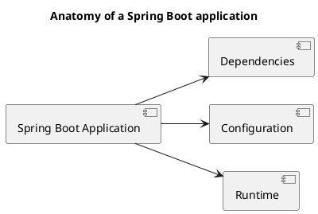

- マイクロサービスはそれぞれの状態を保存するデータストアを必要とする。
- Database per service patternを採用する。このパターンはマイクロサービス毎に個別のデータストアを持ちます。

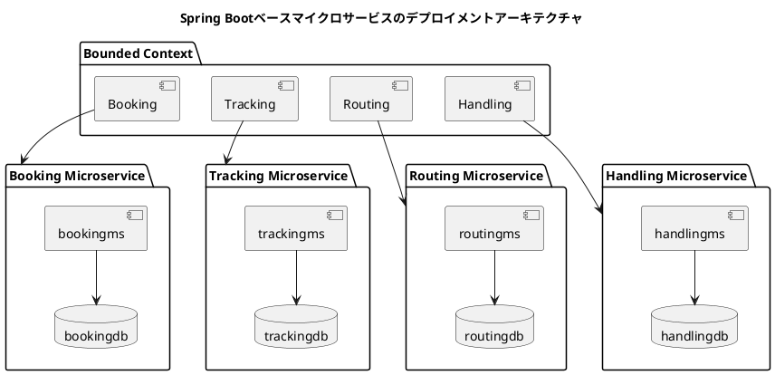

#### 境界づけられたコンテキスト：パッケージング

- パッケージングを開始するにあたって最初にやることをは一般的なSpring Bootアプリケーションを作ることです。
- 以下の構成のプロジェクトを作ります。
  - Group - com.example.cargotracker
  - Artifact - bookingms
  - Dependencies - Spring Web Starter, MyBatis Spring Boot Starter, and Spring Cloud Stream
- 構築したプロジェクトはJARファイル(bookingms.jar)にまとめれます。そして `java -jar bookingms.jar` コマンドを使って起動します。

#### 境界づけられたコンテキスト：パッケージ構造

- パッケージングの構造を決定したので次は境界づけられたコンテキストの各パッケージ構造を定義します。
- 境界づけられたコンテキストの上位レベルのパッケージ構造は以下のようになります。

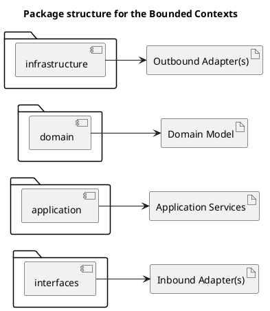

##### インターフェース層（interfaces）

- このパッケージはコミュニケーションプロトコルで分類された境界づけられた全てのコンテキストインバウンドインターフェイスを包含します。
- 具体的には予約の境界づけられたコンテキストはコマンドと呼ばれる状態変更リクエストを送るREST APIsを提供します。同様にクエリと呼ばれる状態取得リクエストを送るREST APIsを提供します。これらのグループは `rest` パッケージに分類されます。
- 他の境界づけられたコンテキストで生成された様々なイベントを購読するイベントハンドラは `eventhandlers` パッケージに分類されます。
- これら2つのパッケージに加えて `transform` パッケージも含みます。これは入ってくるAPIリソース/イベントデータをドメインモデルで要求されるコマンド/クエリモデルに変換するために使われます。

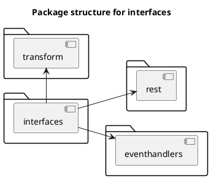

##### アプリケーション層（application）

- アプリケーションサービスは境界づけられたコンテキストのドメインモデルのためのファサードの役割を果たします。
- ドメインモデルの根底となる仕事をコマンド/クエリに割り当てるファサードサービスを提供します。
- アプリケーションサービスの役割として
  - コマンドとクエリ割当として参加する
  - コマンド/クエリプロセッシングに必要なインフラコンポーネントを呼び出す
  - ドメインモデルの根底となる中心的関心毎(ロギング、セキュリティ、メトリクス)を提供する
  - 他の境界づけられたコンテキストを呼び出せるようにする

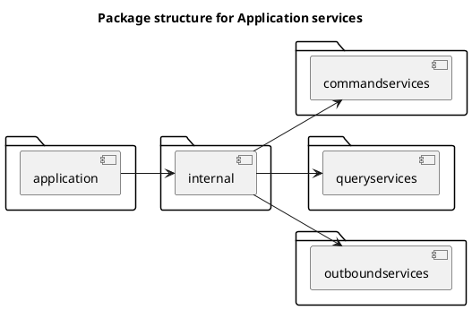

##### ドメイン層（domain）

- このパッケージは境界づけられたコンテキストのドメインモデルを含みます。
- 以下が境界づけられたコンテキストの中心的なクラスです。
  - Aggregates
  - Entities
  - Value Objects
  - Commands
  - Events

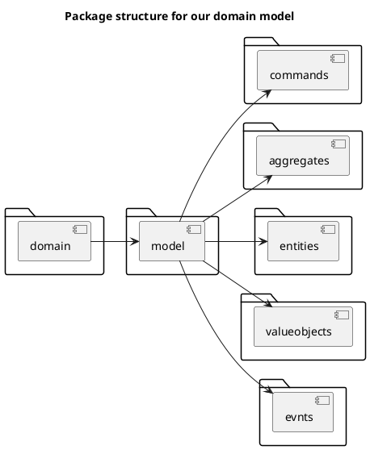

##### インフラストラクチャ層（infrastructure）

- インフラストラクチャパッケージには3つの主要な目的があります。
  - 境界づけられたコンテキストがその状態の操作を受け付けたときに操作を実行する根底となるレポジトリの実装を決める。
  - 境界づけられたコンテキストが状態の変更イベントを扱うときに操作を実行する根底となるイベントブローカーの実装を決める。
  - インフラストラクチャレイヤーのSpring Boot特有の設定を決める。

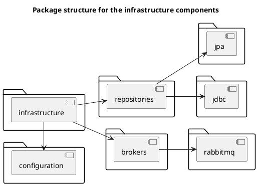

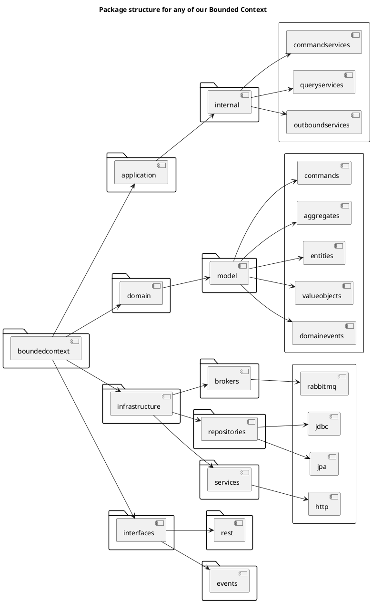

- Cargo Trackerマイクロサービスアプリケーションに置ける境界づけられたコンテキストの完全な実装です。
- 各境界づけられたコンテキストはSpring Bootアプリケーションのfat JARアーティファクトとして実装されます。
- 境界づけられたコンテキストは明確に関心毎が分離されたパッケージ構造のモジュールとして正しく分類されます。

### Cargo Tracker 実装

- 続いてDDDとSpring Boot/Spring Cloudを適用したマイクロサービスアプリケーションの実装に入ります。
- 2つのグループのアーティファクトを実装する必要があります。
  - コアドメイン/ビジネスロジックを含むドメインモデル
  - コアドメインモデルをサポートするサービスとなるドメインモデルサービス

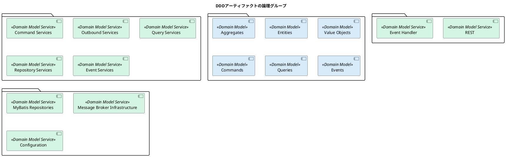

- Cargo Trackerマイクロサービスアプリケーションでは各境界づけられたコンテキストで実行されるコマンド、各境界づけられたコンテキストで提供されるクエリ、各境界づけられたコンテキストで購読・発行さるイベントを持っている

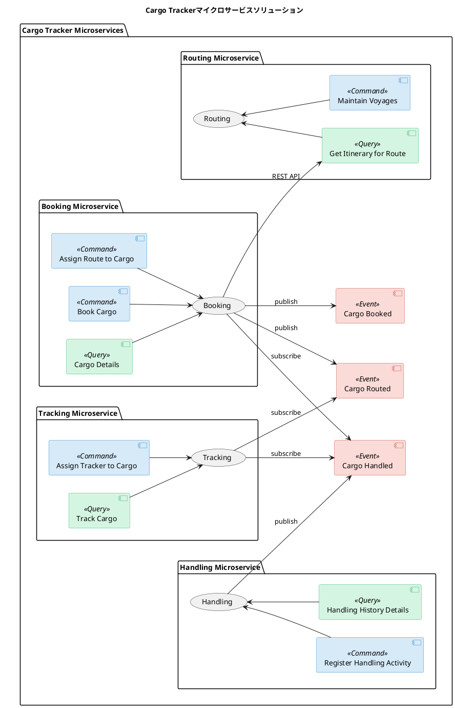
### ドメインモデル：実装

- ドメインモデルは境界づけられたコンテキストの中心的機能であり関係するアーティファクトを早い段階で明確にします。
- ドメインモデルアーティファクトは以下を必要とします。
  - コアドメインモデル - 集約、エンティティそして値オブジェクト
  - ドメインモデルオペレーション - コマンド、クエリそしてイベント

#### コアドメインモデル：実装

- 境界づけられたコンテキストのコアドメイン実装は境界づけられたコンテキストのビジネス意図を表すアーティファクトをカバーしている。
- ハイレベルの観点では集約、エンティティそして値オブジェクトの特定と実装です。

##### 集約／エンティティ／値オブジェクト

- 集約はドメインモデルの中心です。

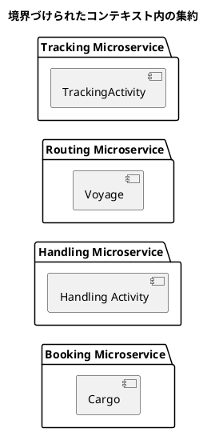

- 集約の実装は以下に従います。
  - 集約クラスの実装
  - 業務属性によるドメインの豊かさ
  - エンティティ/値オブジェクトの実装

###### 集約クラスの実装

###### 業務属性によるドメインの豊かさ

- どの境界づけられたコンテキストの集約でも境界づけられたコンテキストのビジネス言語を明解に表現するべきです。
- getterやsetterしかない貧血集約はビジネス言語が表したいことが複数のレイヤーに漏れ出てしまいDDDの原則に反することになります。
- ドメインリッチな集約をどうやって実装するか？答えは業務属性と業務メソッドにあります。
- 集約の業務属性は集約状態を属性として技術ではなく業務用語を使って表現するべきです。
- 状態をビジネスコンセプトに変換するには貨物集約の以下の属性に従います。
  - Origin Location of the cargo
  - Booking Amount of the cargo
  - Route specification(Origin Location, Destination Location,Destination Arrival Deadline)
  - Itinerary that the cargo is assigned to based on the Route Specification.Legs that the cargo might be routed through to get to the destination
  - Delivery Progress of the cargo aainst its Route Specification and Itinerary assigned to it.The Delivery Progress provides details on the Routing Status,Transport Status,Current Voyage of the cargo,Last Known Location of the cargo, Next Expected Activity, and the Last Activity that occurred on the cargo.

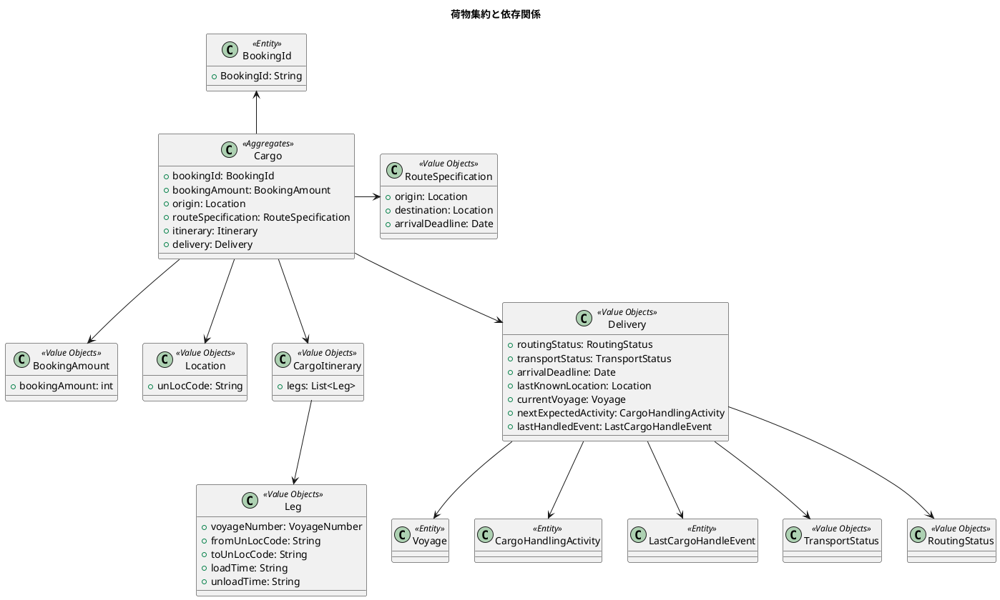

###### エンティティ／値オブジェクトの実装

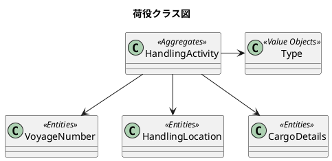

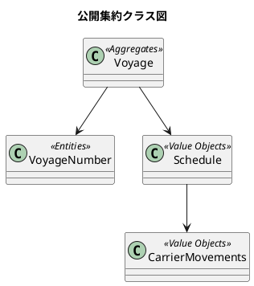

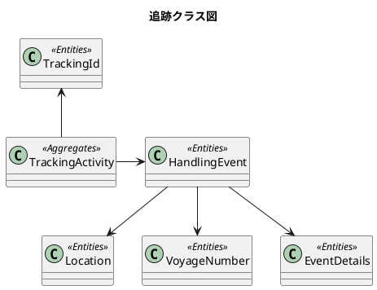

#### ドメインモデルの操作

- 境界づけられたコンテキストのドメインモデルの操作は境界づけられたコンテキストの集約の状態に関連するものです。
- インバウンド操作（コマンド/クエリ）とアウトバウンド操作（イベント）を含みます。

##### コマンド

- 境界づけられたコンテキストのコマンドの実装は以下の手順に従います。
  - コマンドの特定と実装
  - コマンドを実行するコマンドハンドラの特定と実装
- コマンドの特定には集約の状態に影響を及ぼす操作に注目します。
- コマンドを特定したらコマンドのSpring Boot 実装は一般的なPOJOで実装します。
- コマンドハンドラの目的は入力コマンドを実行して集約の状態を決めることです。コマンドハンドラは集約のドメインモデル内で唯一の状態を変更できる場所です。
- Springフレームワークにコマンドハンドラを実装する特別な仕組みはないのでコマンドハンドラの実装は集約内にメソッドを定義します。

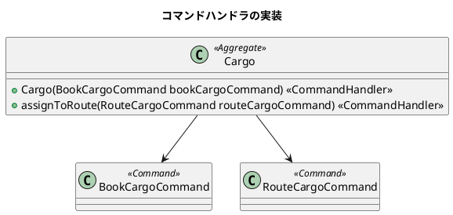

##### クエリ

- 境界づけられたコンテキスト内のクエリは外部の利用者に向けて境界づけられたコンテキストの状態を提供する責務を持ちます。
- クエリハンドラは境界づけられたコンテキスト内の集約の状態を表す役割を果たします。

##### ドメインイベント

- 境界づけられたコンテキスト内のイベントは境界づけられたコンテキストの集約の状態変更をイベントとして公開するすべての操作です。
- ドメインイベントはマイクロサービスアーキテクチャにおいて中心的な役割を果たします。そして強固なマナーに従ってクリティカルに実装されます。
- 分散マイクロサービスアーキテクチャにおいてイベントはコレオグラフィメカニズムを使って様々なマイクロサービスベースアプリケーションの境界づけられたコンテキスト間の状態とトランザクションの一貫性を維持します。

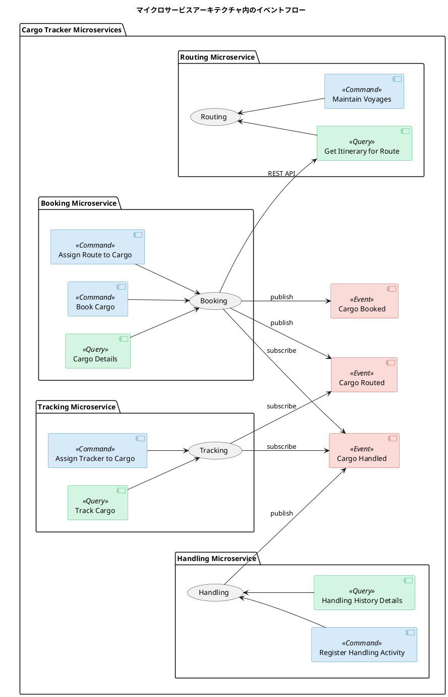

- 強固なイベント駆動コレオグラフィアーキテクチャの実装には4つのステージがあります。
  - 境界づけられたコンテキストから発生させる必要のあるドメインイベントを登録する
  - 境界づけられたコンテキストから公開する必要のあるドメインイベントを発生させる
  - 境界づけられたコンテキストから発生したイベントを公開する
  - 他の境界づけられたコンテキストから公開されたイベントを購読する
- アーキテクチャの複雑さを考慮して実装は複数のエリアに分割する
  - ドメインイベントの登録は集約で実装する
  - イベントの発生/公開はアウトバウンドサービスで実装する
  - イベントの購読はインターフェイス/インバウンドサービスでハンドリングする

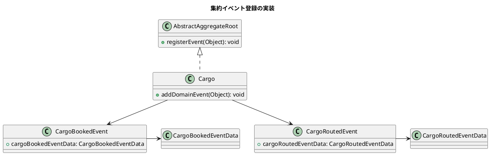

- コマンドの実行の後に集約がドメインイベントを登録する。イベントの登録は常に集約メソッドのコマンドハンドラとして実装します。

#### ドメインモデルサービス

- ドメインモデルサービスは2つの主要な理由から使われます。
- 良く定義されたインターフェイスを介して境界づけられたコンテキストの状態を外部で使えるようにするため。
- 境界づけられたコンテキストの状態をデータストアに永続化して、境界づけられたコンテキストの状態の変更を外部のメッセージブローカーに公開または他の境界づけられたコンテキストとやり取りするための外部との統合のため。
- ドメインモデルサービスは3種類あります。
  - 受信サービス
  - アプリケーションサービス
  - 送信サービス


```plantuml
@startuml

title ドメインモデルサービス実装サマリ

skinparam component {
    BackgroundColor<<Inbound Services>> #D6EAF8
    BackgroundColor<<Outbound Services>> #D5F5E3
    BackgroundColor<<Application Services>> #FADBD8
}

usecase ExternalConsumers [
  External Consumers 
] 

package "Bounded Context - Domain Model Services" {
  [Inbound Services]
  [Application Services]
  [Domain Model]
  [Outbound Services]
  
  [Inbound Services] --> [Application Services]
  [Application Services] -> [Outbound Services]
  [Application Services] --> [Domain Model]
}

[Other Bounded Contexts]

database DB_1 [
  Database
]
queue BUS_1 [
  Message Broker
]

ExternalConsumers --> [Inbound Services]
[Outbound Services] -> DB_1 : State Storage 
[Outbound Services] --> [Other Bounded Contexts]
[Outbound Services] --> BUS_1 : State Events 

@enduml
```

##### 受信サービス

- 受信サービス（ヘキサゴナルアーキテクチャにおける受信アダプタ）はコアドメインモデルの最も外側のゲートウェイとしての役割を果たします。
- Cargo Trackerアプリケーションでは2つのタイプの受信サービスを提供します。
  - 境界づけられたコンテキストのオペレーションの実行を外部に利用可能にするRESTベースのAPIレイヤー
  - メッセージブローカー経由で実行するイベントのためのSpring Cloud Streamベースのイベントハンドリングレイヤー

###### REST API

- REST APIの責務は外部利用者からの境界づけられたコンテキストに対する振る舞いのHTTPリクエストを受け取ることです。
- リクエストはコマンドまたはクエリに分類できます
- REST APIレイヤーのレスポンスは境界づけられたコンテキストのドメインモデルで認識されるコマンド/クエリモデルでに変換して以降の処理をアプリケーションサービスレイヤーに委譲します。

```plantuml
@startuml

title REST API実装ダイアグラム

class CargoBookingCommandService {
+ bookCargo(BookCargoCommand) : BookingID
}

class CargoBookingController {
+cargoBookingCommandService: cargoBookingCommandService
--
+bookCargo(BookCargoResource): Response
}

class BookCargoCommand

class BookCargoCommandDTOAssembler {
+ toCommandFromDTO(BookCargoResource): BookCargo
}

class BookCargoResource

CargoBookingCommandService <-- CargoBookingController
CargoBookingCommandService -> BookCargoCommand
CargoBookingController -> BookCargoCommandDTOAssembler
CargoBookingController -> BookCargoResource
BookCargoCommand <-- BookCargoCommandDTOAssembler
BookCargoCommandDTOAssembler --> BookCargoResource

@enduml
```

```plantuml
@startuml

title 受信サービス実装プロセスサマリ

Client -> RESTAPI
RESTAPI -> DTOAssemblers
DTOAssemblers -> RESTAPI
RESTAPI -> ApplicationService
ApplicationService -> RESTAPI
Client <- RESTAPI

@enduml
```

1. インバウンドはコマンド/クエリ要求がREST APIから来る。APIクラスはSpring Web MVCプロジェクトを使って実装される。
2. REST APIクラスはリソースデータをドメインモデルで要求されるコマンド/クエリデータフォーマットに変換するアッセンブラコンポーネントを使う。
3. コマンド/クエリデータはアプリケーションサービスで追加処理を行う。

###### イベントハンドラ

- イベントハンドラはインバウンド/インターフェイスレイヤー内に配置され境界づけられたコンテキストを購読するために作られます。
- イベントハンドラは一般的なコマンドオペレーションプロセスとペイロードデータを持ったイベント受け取ります。

```plantuml
@startuml

title イベントハンドラ実装ダイアグラム

class CargoTrackingService {
+ assignTrackingId(TrackingDetailsCommand trackingDetailsCommand): void
}

class CargoRoutedEventHandler {
+ receiveEvent(CargoRoutedEvent, CargoRoutedEventData): void
}

class TrackingDetailsCommand

class TrackCargoCommandDTOAssembler {
+ toCommandFromDTO(CargoRoutedEvent eventData): TrackingDetailsCommand
}

class CargoRoutedEvent

CargoTrackingService <-- CargoRoutedEventHandler
CargoTrackingService -> TrackingDetailsCommand
TrackingDetailsCommand <-- TrackCargoCommandDTOAssembler
CargoRoutedEventHandler -> TrackCargoCommandDTOAssembler
CargoRoutedEventHandler -> CargoRoutedEvent
TrackCargoCommandDTOAssembler --> CargoRoutedEvent

@enduml
```

```plantuml
@startuml

title イベントハンドラの実装プロセスサマリ

MessageBroker -> EventHandler
EventHandler -> DTOAssemblers
DTOAssemblers -> EventHandler
EventHandler -> ApplicationServices
ApplicationServices -> EventHandler

@enduml
```

1. イベントハンドラはメッセージブローカーからインバウンドイベントを受け取る
2. イベントハンドラはアセンブラコンポーネントを使ってリソースデータをドメインモデルで要求されるコマンドデータフォーマットに変換する
3. コマンドデータはアプリケーションサービスに送信して処理を継続する

##### アプリケーションサービス

###### アプリケーションサービス：コマンド／クエリの委譲

ユースケースの役割は第 3 章と同じです。**入力の実在確認・集約の生成・保存**を順に行い、業務のルールは集約に委ねます。

```java
    public Cargo book(BookCargoCommand command) {
        if (command.shipperId() == null || shippers.findById(command.shipperId()).isEmpty()) {
            throw new IllegalArgumentException("指定された荷主が見つかりません: " + command.shipperId());
        }

        Location origin = locationOf(command.originUnLocode(), "出発地");
        Location destination = locationOf(command.destinationUnLocode(), "目的地");

        // 到着期限は目的地の暦で判断する。UTC で判断すると、時差の分だけ
        // 受付が拒否される時間帯ができる（ADR-010）
        ZoneId destinationZone = locations.timeZoneOf(command.destinationUnLocode())
                .orElseThrow(() -> new IllegalArgumentException(
                        "目的地の業務タイムゾーンが登録されていません: " + command.destinationUnLocode()));

        RouteSpecification route = RouteSpecification.of(origin, destination,
                command.departureDate(), command.arrivalDeadline(), destinationZone, clock);

        return cargoes.save(Cargo.book(command.shipperId(), specificationOf(command), route));
    }
```

転記元: `bookingms/application/internal/commandservices/BookCargoUseCase.java`

役割分担も明文化されています。

```java
 * <p>荷主と地点が実在することはここで確かめる。集約は「実在するもの同士の組み合わせ」の
 * 妥当性だけを見る。存在しない荷主 ID を通すと、誰の貨物か分からない予約が保存される。
 */
@Service
public class BookCargoUseCase {
```

転記元: `bookingms/application/internal/commandservices/BookCargoUseCase.java`

**第 3 章で「BC をまたぐ確認だから集約の外」と説明した境目が、ここでは「自分の DB を引く必要があるから集約の外」に変わっています。**理由は違いますが、結論は同じです。集約は自分が持つ値だけで判断できることを判断します。

##### 送信サービス

出力ポートはアプリケーション層に定義し、実装をインフラ層に置きます。この形も第 3 章と同じです。**相手が 3 種類に増えます。**

###### 送信サービス：リポジトリクラス

自分のデータベースへの永続化です。実装は MyBatis で、第 3 章と同じ構成です。

```java
package com.example.bookingms.infrastructure.repositories;

import com.example.bookingms.domain.repository.CargoRepository;
```

転記元: `bookingms/infrastructure/repositories/MyBatisCargoRepository.java`

変わったのは**データベースがサービス専用になった**ことです。第 3 章では 1 つのデータベースに全 BC のテーブルがあり、JOIN しようと思えばできました。ここでは他サービスのテーブルは接続先にすら存在しません。

###### 送信サービス：REST API

他サービスへの同期呼び出しです。**イベント駆動にしても、すべてが非同期になるわけではありません。**

```java
/**
 * 経路候補を routingms へ取りに行く ACL（[ADR-019]）。
 *
 * <p>routingms の型はここから先へ出さない。{@link RouteCandidateResponse} で受け、
 * Booking Context の {@link CargoItinerary} へ変換する。
 *
 * <p><strong>利用者ヘッダ（[ADR-007]）は伝播しない。</strong>この呼び出しは
 * 「システムが経路候補を引く」ものであり、利用者の代理ではない。伝播すると、
 * routingms 側の認可が「呼び出し元の利用者が経路設計者か」を見ることになり、
 * bookingms の中で完結する処理（確定時の再検証）がロールに依存する。
 * サービス間の信頼はネットワーク境界（Gateway より内側）で担保する。
 */
public class RestRouteCandidateFinder implements RouteCandidateFinder {
```

転記元: `bookingms/infrastructure/acl/RestRouteCandidateFinder.java`

**問い合わせは同期、通知は非同期**という分け方です。経路候補は「いま答えが要る」ものであり、イベントで解決できません。

呼び出し元が誰かという問題も生まれます。

```java
    /**
     * このサービス自身を表す主体。
     *
     * <p>利用者 ID と取り違えられない形にする。利用者と同じ見た目にすると、監査ログで
     * 「誰がやったのか」が分からなくなる。
     */
    public static final String SYSTEM_PRINCIPAL = "system:bookingms";
```

転記元: `bookingms/infrastructure/acl/RestRouteCandidateFinder.java`

**同一プロセスなら存在しなかった問題です。**メソッド呼び出しに「誰として呼ぶか」はありません。

###### 送信サービス：メッセージブローカー

イベントの発行です。**ここだけがメッセージ基盤を知ります。**

```java
/**
 * 予約のイベントを RabbitMQ へ流す（[ADR-022]）。
 *
 * <p><strong>ここだけがメッセージ基盤を知る。</strong>ドメインもユースケースも
 * {@link CargoEventNotifier} という「何を頼むか」しか知らない
 * （`eventPublishingOnlyInMessagingInfrastructureRule` が検査する）。
 */
public class RabbitCargoEventNotifier implements CargoEventNotifier {

    private final RabbitTemplate rabbitTemplate;
```

転記元: `bookingms/infrastructure/acl/RabbitCargoEventNotifier.java`

発行のタイミングが重要です。

```java
    /**
     * コミットしたあとに送る（[ADR-022] 決定 6）。
     *
     * <p>コミット前に出すと、<strong>ロールバックした予約のイベントが飛ぶ</strong>。
     * 存在しない予約の追跡ができ、荷主は追えるのに貨物が無い状態になる。
     *
     * <p><strong>ここで決めるのは、トランザクションの境目がインフラの関心だからである。</strong>
     * ユースケースに「コミット後に呼べ」と作法を課すと、入口が増えた数だけ破られる。
     */
    private void afterCommit(Runnable send) {
        if (!TransactionSynchronizationManager.isSynchronizationActive()) {
            send.run();
            return;
        }
```

転記元: `bookingms/infrastructure/acl/RabbitCargoEventNotifier.java`

第 3 章の `@TransactionalEventListener(AFTER_COMMIT)` と**同じ判断を、自分で書いています**。Spring が購読側で用意していた仕組みが、プロセスをまたぐと発行側の責務になります。

流れ先の名前は定数にまとめます。

```java
/**
 * イベントの流れ先の名前（[ADR-022]）。
 *
 * <p>文字列を配線のあちこちに書くと、片方だけ直したときに「送っているのに届かない」形で壊れる。
 * 送り手と受け手は別のサービスなので、<strong>名前は写しになる</strong>。写しであることを
 * 契約テストが突き合わせる。
 */
public final class CargoEventChannels {

    public static final String EXCHANGE = "cargoBookingChannel";

    /** 追跡番号を発行したことのルーティングキー。 */
    public static final String TRACKING_NUMBER_ISSUED = "cargo.tracking-number-issued";
```

転記元: `bookingms/infrastructure/acl/CargoEventChannels.java`

**「届かない」を防ぐ仕掛けが 2 段あります。**

```java
    /** 荷役のイベントのデッドレター。 */
    public static final String HANDLING_DEAD_LETTER_QUEUE =
            "bookingms.handling-activity-registered.dlq";

    /**
     * どのキューにも結びつかなかったイベントの行き先（[ADR-022] 決定 4）。
     *
     * <p>デッドレターが守るのは「受け取ったが処理できなかった」だけである。ルーティングキーの
     * 綴りが違う・購読側がまだ配線されていない場合、イベントは<strong>どのキューにも入らず
     * 黙って消える</strong>。しかも発行側は成功を返すため、どこにも異常が残らない。
     *
     * <p>交換機に予備の行き先（alternate-exchange）を持たせ、行き場のないイベントをここへ流す。
     */
    public static final String UNROUTABLE_EXCHANGE = "cargo.unroutable";
```

転記元: `bookingms/infrastructure/acl/CargoEventChannels.java`

デッドレターが守るのは「受け取ったが処理できなかった」だけです。**綴り違いや配線漏れは、デッドレターに入る前に消えます。**この 2 つは守る範囲が違うため、両方が要ります。

#### 実装のまとめ

第 3 章と本章で、DDD の成果物の実装がどう変わったかを並べます。

| 成果物 | 第 3 章（モジュラーモノリス） | 本章（マイクロサービス） |
| :--- | :--- | :--- |
| BC の単位 | トップレベルパッケージ | Gradle モジュール = デプロイ単位 |
| BC 間の境界 | ArchUnit で守る規律 | クラスパスが分かれ、参照できない |
| 集約 | 可変クラス | 不変クラス（操作が新インスタンスを返す） |
| エンティティ | 2 BC に存在（routing・tracking） | 同じ 2 サービスに存在 |
| 共有カーネル | `Location`・`ShipperId` の 2 つ | `Location` の 1 つ |
| コマンド | 値オブジェクトを受ける | 素の値を受ける（実在確認が DB を要する） |
| BC 間の問い合わせ | ACL ポート（メソッド呼び出し） | ACL ポート（REST） |
| BC 間の通知 | `ApplicationEventPublisher` | RabbitMQ（交換機・ルーティングキー） |
| 発行のタイミング | `@TransactionalEventListener(AFTER_COMMIT)` | 発行側で `afterCommit` を自作 |
| 購読の失敗 | 捕まえて件数に記録する | 捕まえない（デッドレターへ回す） |
| イベントの型 | `shared/domain/event` に 1 つ | 発行側と購読側が別々に持つ |
| 型の共有 | 同じ `record` を参照 | 契約（`testFixtures`）だけを共有 |
| 入口 | 画面（Thymeleaf + htmx） | REST + イベント購読 |
| データベース | 1 つ（全 BC 共通） | サービスごと |

```plantuml
@startuml

title サービス間の連携（bookingms から見た図）

rectangle "gatewayms" as gw
rectangle "bookingms" as b
rectangle "routingms" as r
rectangle "trackingms" as t
rectangle "handlingms" as h
queue "cargoBookingChannel" as ex1
queue "cargoHandlingChannel" as ex2

gw --> b : REST（認証済みヘッダ）
b --> r : REST（経路候補の問い合わせ・同期）
b --> ex1 : TrackingNumberIssued / CargoCancelled
ex1 --> t : 購読
h --> ex2 : HandlingActivityRegistered
ex2 --> b : 購読
ex2 --> t : 購読

@enduml
```

**左で 1 行だったものが、右では 1 節になります。**同じ「BC 間の通知」が、片方では 1 つのアノテーションで済み、もう片方では交換機・ルーティングキー・受け皿・契約・デッドレター・予備の行き先を要します。

### まとめ

- 参照元が第 3 章と異なり、8 つのサービスに分かれたマイクロサービス実装です。**続きではなく別実装**であり、同じ業務を別の構成で実装したものとして読む必要があります。
- 4 層のパッケージ構造は変わりません。**プロセスを分けても、層の構成を変える理由はありません。**変わったのは外側との接点の数（DB・他サービス・ブローカー）です。
- 境界を守るコストは下がりました。他サービスのクラスは参照しようとしてもコンパイルが通りません。代わりに、越境の手段（REST・イベント・契約）を自分で作る必要が生まれます。
- 第 3 章でフレームワークが与えていた保証が、いくつか手作業に変わりました。コミット後の発行、イベントの型の一致、失敗の記録がその例です。**保証が消えたのではなく、誰が引き受けるかが変わっています。**
- 購読の失敗に対する正しい書き方は、第 3 章と**逆になりました**。基盤が失敗を引き受ける仕組み（デッドレター）を持つかどうかで、例外を捕まえるべきかが反転します。**プラクティスは文脈を伴って初めて意味を持ちます。**

イベント駆動にしても、集約の現在状態を直接読み書きする点は第 3 章と同じです。次章では、状態そのものをイベントの列として保存する方式（Event Sourcing）と、読み書きを別のモデルに分ける CQRS を扱います。
