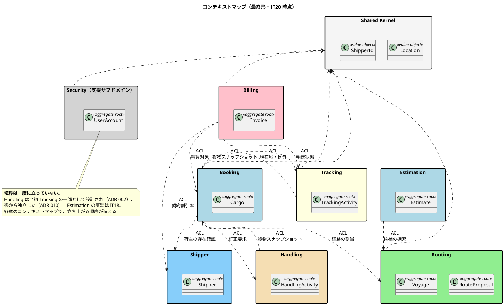
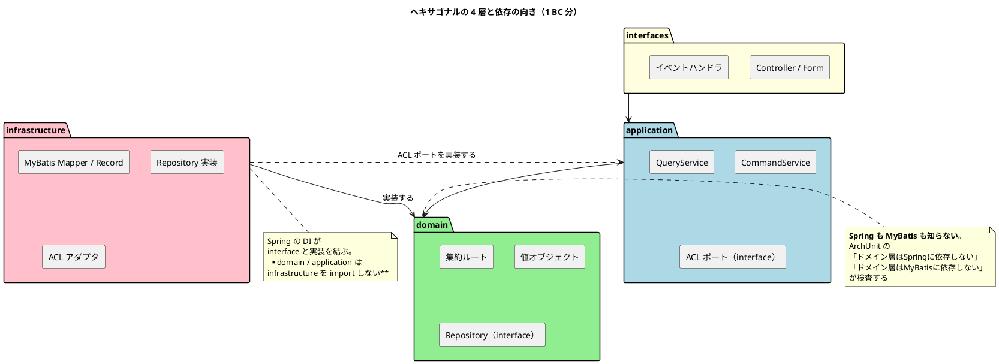

# 第 1 章：Spring Boot で DDD を書く土台

本シリーズは、国際貨物輸送管理システム（Cargo Tracker）を Spring Boot で実装した 20 イテレーションを、そのままの順で辿ります。第 2 章以降が 1 イテレーション 1 章です。

この章では、20 回を通して変わらなかった土台だけを先に置きます。**変わったものは各イテレーションの章で扱います。**

## 何を作るのか

貨物の見積・予約・経路設計・追跡・荷役・精算を扱う業務システムです。関係する役割は荷主・営業担当者・経路設計者・追跡管理者・荷役作業員・経理担当者の 6 種類で、それぞれに画面があります。

| 項目 | 内容 |
| :--- | :--- |
| ユーザーストーリー | US01〜US36（117SP） |
| イテレーション | 20 |
| 出荷 | v2.1.0 |
| 実装 | 553 ファイル（`src/main/java`） |
| テスト | 167 ファイル（`src/test/java`） |
| 設計判断の記録 | ADR 25 本 |

## モジュラーモノリスという前提

デプロイ単位は 1 つです。しかし内部は境界づけられたコンテキスト（Bounded Context、以下 BC）ごとに分かれており、**BC 間の参照は 1 種類の経路だけに絞っています**。

最終的に立った BC は 7 つです。ただし **これらが最初から 7 つあったわけではありません。** Handling は当初 Tracking の一部として設計され、後から独立しました（ADR-010 が ADR-002 を置き換えています）。Estimation にいたっては、実質的な立ち上げは 18 回目のイテレーションです。

| パッケージ | 責務 | 立ち上がった時期 |
| :--- | :--- | :--- |
| `shipper` | 荷主・法人契約 | IT1 |
| `booking` | 貨物予約・旅程・状態遷移 | IT2 |
| `routing` | 航海スケジュール・経路探索 | IT3 |
| `tracking` | 追跡・輸送例外 | IT6 |
| `handling` | 荷役作業の記録 | IT6（ADR-010 で独立） |
| `billing` | 料金算出・請求・精算 | IT13 |
| `estimation` | 輸送見積 | IT18 |
| `shared` | 共有カーネル（`Location` / `ShipperId` のみ） | IT1 |
| `security` | 認証・認可（支援サブドメイン） | IT1 |

`security` は共有カーネルではなく**支援サブドメイン**として置いています（ADR-005）。

最終的なコンテキストマップは次のとおりです。**矢印は依存の向き**（下流 → 上流）で、すべて ACL ポートかドメインイベントを経由します。


「全 BC が使うから共有カーネル」とすると、共有カーネルは際限なく太ります。

## パッケージ構成

全 BC が同じ内部構成を持ちます。ヘキサゴナルアーキテクチャの 4 層を、パッケージ名でそのまま表現しています。

```text
com.example.cargotracker.<bc>
├── domain
│   ├── model
│   │   ├── aggregates      … 集約ルート
│   │   ├── valueobjects    … 値オブジェクト・列挙
│   │   └── commands        … コマンド
│   └── repository          … リポジトリのインタフェース
├── application
│   └── internal
│       ├── commandservices    … ユースケース（更新系）
│       ├── queryservices      … ユースケース（参照系）＋ View
│       └── outboundservices
│           └── acl            … 他 BC へ問い合わせる出力ポート
├── infrastructure
│   ├── repositories        … MyBatis Mapper・Record・リポジトリ実装
│   ├── acl                 … 他 BC の ACL ポートに対する実装（Adapter）
│   └── config
└── interfaces
    ├── web                 … Controller・Form
    └── events              … ドメインイベントのハンドラ
```

依存の向きを図にすると次のようになります。**外側から内側への一方向**しかありません。



この構成は `docs/design/architecture_backend.md` を正典とし、`package-info.java` に責務を書いています。ドキュメントとコードの両方に置くのは、**どちらか片方だけだと必ず片方が古くなる**ためです。

`booking/package-info.java` は次のようになっています。

```java
/**
 * 予約コンテキスト。貨物予約の受付・旅程管理・BookingStatus の状態遷移を責務とする。
 *
 * <p>本パッケージは境界付けられたコンテキストのルートである。トップレベルパッケージと
 * BC は 1 対 1 に対応し、ArchUnit の slices ルールがこの前提を検証する
 * （docs/design/test_strategy.md §3.3 ルール 4・5）。
 *
 * <p>他の BC のクラスを直接参照してはならない。連携は ACL ポートまたは
 * ドメインイベントを経由する（docs/design/domain-model.md「BC 間 ACL ポート一覧」）。
 */
package com.example.cargotracker.booking;
```

## 越境の 1 点：ACL ポート

BC どうしは、直接クラスを参照しません。**参照してよいのは `application/internal/outboundservices/acl` に置いたインタフェース経由だけ**です。

```java
/**
 * 予約コンテキストが他の BC・マスタへ問い合わせる出力ポート（ACL）。
 *
 * <p><strong>ポートを定義するのは利用する側である。</strong> 実装は提供側の BC に置く。
 * ここは BC 間の<strong>唯一の許可された越境点</strong>であり、
 * ArchUnit ルール 4 はこのパッケージだけを除外する。
 */
package com.example.cargotracker.booking.application.internal.outboundservices.acl;
```

重要なのは 2 点です。

1. **ポートを定義するのは利用する側**。Booking が Shipper に問い合わせたいなら、インタフェースは Booking に置きます。提供側が「使ってほしい形」を押しつけると、利用側のことばが提供側のことばに侵食されます
2. **除外するのはこのパッケージだけ**。「Booking BC 全体を除外」にすると ACL を置く動機が消えます。ArchUnit の BC 分離ルールは ACL パッケージのみを除外します

同期の問い合わせでは足りない場面（他 BC の状態を変える／変わったことを知らせる）にはドメインイベントを使います（ADR-009）。この使い分けは第 7 章・第 12 章で扱います。

## 技術選定

| 領域 | 採用 | 判断 |
| :--- | :--- | :--- |
| 言語 | Java 25（LTS） | ADR-001 |
| フレームワーク | Spring Boot 4.x | ADR-001 |
| 永続化 | MyBatis（手書き SQL） | **JPA を採らない**（ADR-004） |
| DB | PostgreSQL（ローカル補助に H2） | ADR-003 |
| 画面 | Thymeleaf ＋ htmx | サーバサイドレンダリング |
| マイグレーション | Flyway（`common` / `postgresql` / `h2`） | 方言差を分ける |
| 外部連携 | 内部シミュレーション | **外部サービスと繋がない**（ADR-006） |

### なぜ JPA ではなく MyBatis か

DDD の集約を JPA のエンティティとして書くと、集約の形が O/R マッパーの都合に引っ張られます。遅延ロード・双方向関連・識別子の生成戦略はすべてドメインの外側の事情です。

MyBatis を選ぶと、集約は **ただの POJO** のまま置けます。永続化は `infrastructure/repositories` の `Mapper` と `Record`（永続化用の別クラス）が引き受け、集約は永続化を知りません。

代償は手書き SQL の量です。それは受け入れています。

### ビルド設定で目を引く点

`build.gradle` には、DDD とは直接関係しないが効いた設定が 2 つあります。

```groovy
// 依存のロック。**脆弱性スキャン（Trivy）が実際に依存を見るために必要である。**
// ロックファイルが無いと、Trivy は Gradle の依存を解決できず 0 件で緑になる。
// 「緑だが何も検査していない」状態は、スキャンが無いより危険である。
dependencyLocking {
    lockAllConfigurations()
}
```

もう 1 つは JIG プラグインです。**コードから設計ドキュメントを生成し、`docs/design` との乖離を検出する手段**として入れています。

## データモデリングをどう進めたか

DDD の本を読むと「ドメインモデルが先、テーブルは後」と書かれています。しかしこのプロジェクトは、**序盤にデータモデリングをかなり先まで進めています**。その進め方と、それが何を招いたかは、本シリーズを通しての観察対象です。

### 分析フェーズで概念 → 論理まで引く

開発に入る前に `docs/design/data-model.md` で概念データモデル・論理データモデル・テーブル定義まで作っています。ドメインモデル設計（`domain-model.md`）と並行し、**BC ごとにテーブルを割り当てた状態**まで進めました。

| 段階 | 成果物 | 粒度 |
| :--- | :--- | :--- |
| 概念データモデル | 全 BC のエンティティと主要リレーション | ER 図 1 枚 |
| 論理データモデル | BC ごとの ER 図 | 20 テーブル |
| テーブル定義 | 列・型・制約・索引 | DDL に落とせる粒度 |

設計方針も先に決めています。

- **ID 戦略**: サロゲートキー（`BIGSERIAL`）＋業務キー（`VARCHAR`）の併用。一部は `UUID`
- **命名規則**: スネークケース
- **監査カラム**: 全テーブルに `created_at` / `updated_at`
- **マイグレーションの分割**: `db/migration/common`（両 DB 共通）と `db/migration/{vendor}`（ベンダー固有）

### IT1 で 20 テーブルを一括作成する

そして **IT1 の `V1__init.sql` で 20 テーブルすべてを作ります**。この時点で実装があるのは `shipper` と `users` / `user_roles` だけです。`invoice` は 13 回目、`estimate` は 18 回目のイテレーションまで使われません。

```text
CREATE TABLE location            CREATE TABLE tracking_activity
CREATE TABLE users               CREATE TABLE tracking_handling_event
CREATE TABLE user_roles          CREATE TABLE tracking_exception_event
CREATE TABLE shipper             CREATE TABLE handling_activity
CREATE TABLE cargo               CREATE TABLE customs_declaration
CREATE TABLE voyage              CREATE TABLE invoice
CREATE TABLE carrier_movement    CREATE TABLE invoice_line_item
CREATE TABLE booking_route_proposal  CREATE TABLE payment
CREATE TABLE proposed_route      CREATE TABLE estimate
CREATE TABLE leg                 CREATE TABLE route_candidate
```

**なぜこうしたのか。** 業務の全体像が先に見えていること、そして「テーブルを作る作業」が各イテレーションのボトルネックにならないことが利点です。ウォーキングスケルトンを最短で通すという IT1 のゴールに対しては、これは効きました。

### その後は差分マイグレーションで育てる

V1 で終わりではありません。**最終的に `common` だけで V41 まで積み上がっています**。20 イテレーションで 40 本の差分マイグレーションを足したことになります。

差分の内容は、値オブジェクトの追加（`V3__cargo_specification.sql`）、状態の追加（`V30__invoice_charge_status.sql`）、一意制約の追加（`V35__payment_one_per_invoice.sql`）など、**ドメインモデルが動いた分だけ**です。

つまり実際に起きたのは「先に全部作って終わり」ではなく、**骨格を先に置き、肉付けはイテレーションごとに差分で行う**という進め方でした。

### 先に作ることの代償

このアプローチには 2 つの代償があり、どちらもこのプロジェクトで実際に表面化しました。

**1. テーブルがあると「揃っている」と誤認する**

`V3__cargo_specification.sql` のコメントがそれを記録しています。

```sql
-- 貨物仕様のうち、寸法・個数・品名のカラムを追加する（US04 の受入基準）。
--
-- V1 は cargo テーブルを作成したが、これらのカラムを作っていなかった。
-- data-model.md には記載があったため、テーブルの存在だけを見ると揃っていると
-- 誤認する状態だった（IT2 計画時の突合で発覚）。
```

**2. 要求されていないテーブルが残る**

`invoice_line_item` は V1 で作られましたが、13 回目のイテレーションで**使わないと決まりました**（ADR-016）。受入基準のどこにも明細行の要求が無かったためです。

```markdown
| 守るもの | 守り手 | 対象範囲 |
| `invoice_line_item` を使わない | **守らない。** | **検査の外。** テーブルは残っており、マッパーから引いても落ちない |
```

**先に作ったテーブルは、使わないと決めた後も残ります。** 「要求元のないものは作らない」という原則と、「先にデータモデルを引く」という進め方は、ここで正面から衝突しました。

### 乖離は目視ではなく生成物で検出する

設計ドキュメントの ER 図と実際のスキーマは、放っておけば必ずずれます。`data-model.md` は対処をこう定めています。

> **本ドキュメントの ER 図は「設計」である。** 実際に Flyway が構築したスキーマの ER 図は jig-erd で生成できる（`./gradlew jigErd`）。**設計と実装の乖離は、図を目視で見比べるのではなく生成物との差分で検出する。**

手で図を更新し続ける運用は、マイグレーションを追加したのに図だけ古い、という状態を必ず生みます。

### テーブルの所有も BC が持つ

DDD 側の規律として、**テーブルにも所有 BC があります**。`booking` のマッパーが `handling_activity` を読んではいけません。

この規則は最初から検査されていたわけではなく、11 回目のイテレーションで**検査を 1 件も破らずに BC 間の結合が増えた**ことをきっかけに ADR-015 として起票されました。Java のクラスを 1 つも参照せず SQL だけで越境すると、ArchUnit にも JIG にも映らないためです。

> **ArchUnit が緑であることが、越境していないことの根拠にならない**

この経緯は第 12 章で扱います。

## 宣言した規則は、検査に落とす

このプロジェクトで最も効いた土台が ArchUnit です。`PackageStructureTest` に 12 本のルールがあり、すべて有効かつ緑です。

```java
@AnalyzeClasses(packages = "com.example.cargotracker")
class PackageStructureTest {

    @ArchTest
    static final ArchRule ドメイン層はSpringに依存しない =
            noClasses()
                    .that().resideInAPackage("..domain..")
                    .should().dependOnClassesThat().resideInAPackage("org.springframework..")
                    .because("ドメイン層は Spring フレームワークに依存してはならない");
}
```

ルール名を日本語にしているのは、**落ちたときのメッセージがそのまま設計の説明になる**ためです。

12 本のうち、いくつかは「あるルールだけでは足りない」ことが分かって後から足されました。代表例が MyBatis です。

```java
/**
 * ADR-004: ドメイン層が MyBatis の型に依存しない。
 *
 * <p><strong>「ドメイン層はインフラ層に依存しない」だけでは足りない。</strong>
 * {@code org.apache.ibatis} は {@code ..infrastructure..} に含まれないため、
 * ドメインの集約に {@code @Results} や {@code @Param} を直接付けても、
 * 依存方向のルールは緑のまま通る。
 */
@ArchTest
static final ArchRule ドメイン層はMyBatisに依存しない =
        noClasses()
                .that().resideInAPackage("..domain..")
                .should().dependOnClassesThat().resideInAPackage("org.apache.ibatis..")
                .because("永続化技術はドメインモデルに現れてはならない（ADR-004）");
```

同じテストクラスにはもう 1 つ、運用上の決めごとが書かれています。

```java
/**
 * <p>{@code allowEmptyShould(true)} は使わない。**何も検査していないルールを緑にすると、
 * 実装が入った後も検査されていないことに気づけなくなる。**
 *
 * <p><strong>各ルールは違反を作って赤になることを確認済みである</strong>
 */
```

**ルールを書いたことと、ルールが働くことは別**です。本シリーズでは、検査を入れたのに空振りしていた回（第 17 章）も扱います。

## 三つの観点で読む

第 2 章以降は、各イテレーションの実装を **戦略的 DDD・戦術的 DDD・ユビキタス言語** の 3 つの観点から読み直す節を必ず置きます。「DDD で作った」で終わらせず、**その回に実際に働いた道具立てはどれか**を毎回はっきりさせるためです。

### 戦略的 DDD — 境界をどこに引くか

扱うのは BC の分割・統合と、BC どうしの関係です。

| 道具立て | このプロジェクトでの現れ方 |
| :--- | :--- |
| 境界づけられたコンテキスト | 7 つのトップレベルパッケージ。ArchUnit が「1 パッケージ = 1 BC」を検査する |
| サブドメインの種別 | 中核（Booking / Routing）・支援（Security）・汎用（通知・港マスタ） |
| 共有カーネル | `shared` に置いてよいのは `Location` と `ShipperId` だけ（ADR-005） |
| 腐敗防止層（ACL） | `outboundservices/acl` のポート。BC 間で唯一許された越境点 |
| 顧客／供給者 | ポートを定義するのは利用側、実装するのは提供側 |
| 公開ホストサービス | ドメインイベント。**誰が購読しているかを発行側は知らない**（ADR-009） |

**境界は最初から正しくありません。** Handling は Tracking の一部として設計され、後から独立しました（ADR-010 が ADR-002 を置き換えています）。境界が動いた回では、何がきっかけで動いたかを書きます。

### 戦術的 DDD — 境界の内側をどう組み立てるか

| 道具立て | Spring Boot 上での置き場 |
| :--- | :--- |
| 集約・集約ルート | `domain/model/aggregates`。POJO。Spring にも MyBatis にも依存しない |
| 値オブジェクト | `domain/model/valueobjects`。`record` のコンパクトコンストラクタが不変条件の置き場 |
| リポジトリ | インタフェースは `domain/repository`、実装は `infrastructure/repositories` |
| ドメインサービス | 集約に属さない業務ロジック（経路探索・料金算出） |
| ドメインイベント | `shared/domain/event` のレコード。ハンドラは `interfaces/events` |
| ファクトリ | 集約の static ファクトリメソッド（`Cargo.book(...)` の形） |

**集約が Spring も MyBatis も知らない**ことは ArchUnit で検査しています。「POJO のままにする」という宣言だけでは守られません（第 1 章の `ドメイン層はMyBatisに依存しない` を参照）。

### ユビキタス言語 — 業務のことばがどこまで届いたか

業務のことばが要件・設計ドキュメント・クラス名・DB のカラム名・画面の表示までひと続きになっているかを見ます。

このプロジェクトの特徴は、**ことばが離れる箇所を明示的に決めている**ことです。

- 列挙子名（`PRELIMINARY`）は利用者に見せず、`displayName()`（「仮予約」）を通す
- ArchUnit のルール名を日本語にして、落ちたときのメッセージがそのまま設計の説明になるようにする
- 集約の Javadoc に「なぜそうしたか」を業務のことばで書く

そして**離れてしまった箇所**もあります。設計ドキュメントの記述が実装と食い違ったまま数イテレーション残った例（第 18 章・第 20 章）は、ことばの管理が失敗した記録です。

## 各章の読み方

第 2 章以降は、すべて同じ節構成です。

| 節 | 内容 |
| :--- | :--- |
| このイテレーションのゴール | 何が動くようになるか |
| 扱うユーザーストーリー | ID・要点・SP |
| 前イテレーションからの引き継ぎ | ふりかえりの Try と持ち越し |
| 実装 | ドメイン → アプリケーション → インフラ → 画面 の順に実コード |
| DDD の観点 | 戦略的 DDD / 戦術的 DDD / ユビキタス言語。**動かなかった観点はそう書く** |
| 設計判断 | このイテレーションで決めたこと（ADR があれば ID） |
| このイテレーションの学び | 効いたこと・効かなかったこと |

コードはすべて [`docs/article/source/java-2/apps/`](../source/java-2/apps) の実ファイルから転記しています。

---

- 前: [シリーズ概要](index.md)
- 次: [第 2 章：IT1 ウォーキングスケルトンを 1 本通す](02-iteration-01.md)
