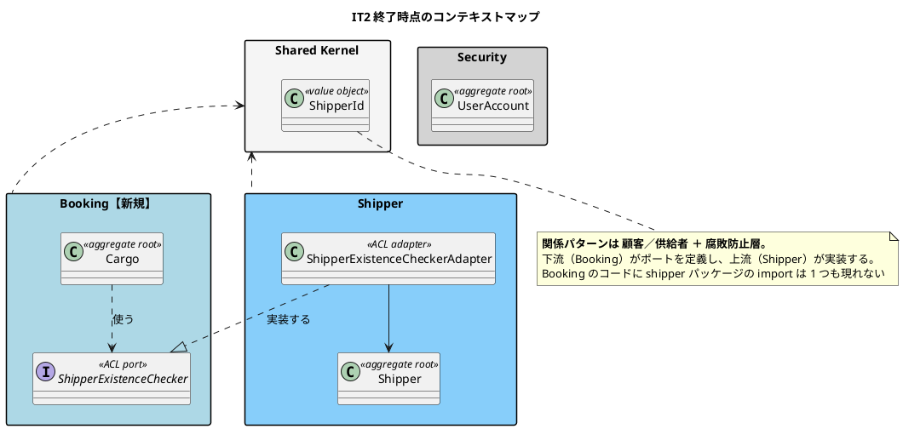
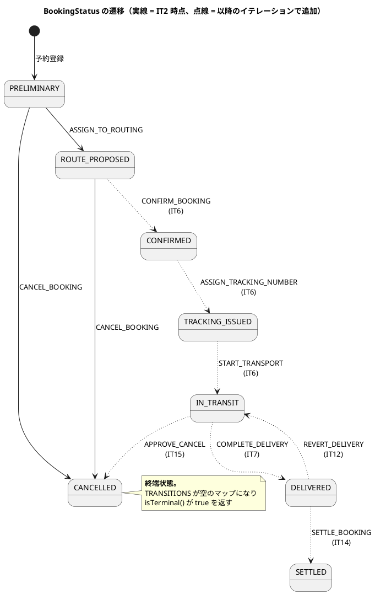
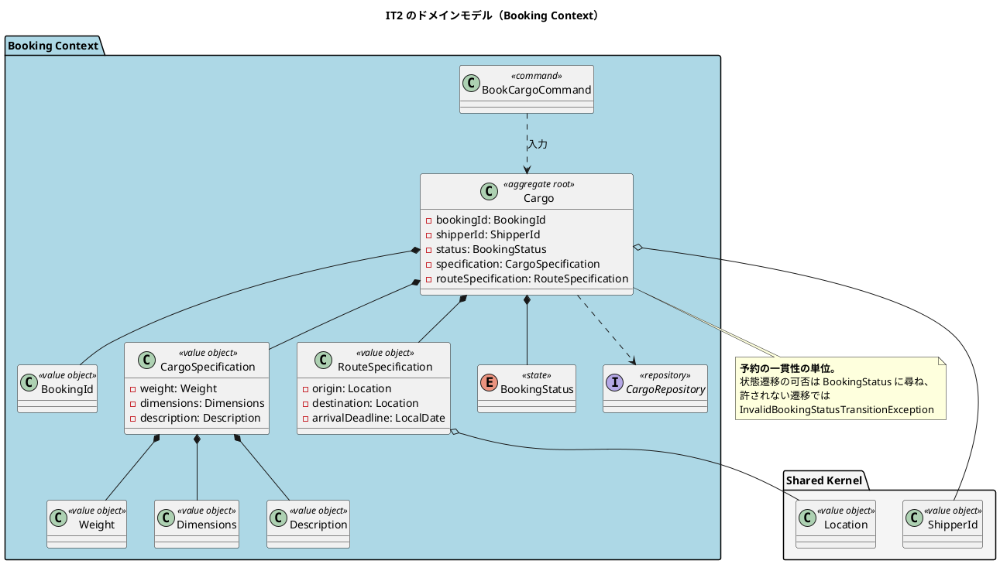
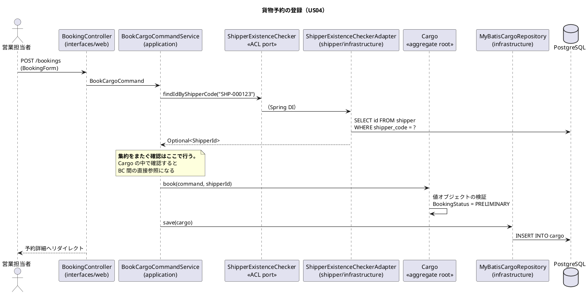

# 第 3 章：IT2 Cargo 集約と最初の ACL ポート

## このイテレーションのゴール

**貨物予約を登録し、荷主情報を訂正できるようにする。** Booking Context の `Cargo` 集約と `BookingStatus` の遷移規則を確立し、Booking → Shipper の ACL ポートを**最初の 1 本**として通します。

BC が 2 つになるため、このイテレーションで初めて **越境**が発生します。

### このイテレーション終了時点のコンテキストマップ

**BC が 2 つになり、最初の越境が発生します。**



## 扱うユーザーストーリー

| ID | ストーリー | SP |
| :--- | :--- | ---: |
| US04 | 貨物予約を登録する | 5 |
| US32 | 荷主情報を訂正する | 2 |
| | **合計** | **7** |

US04 の受入基準のうち 2 項目は、このイテレーションでは満たせないため他へ移しました。

| 元の受入基準 | 移し先 | 理由 |
| :--- | :--- | :--- |
| 経路設計者に予約登録の通知が送信される | US06 | US06 のストーリーそのもの |
| 見積情報との整合性が確認される | Release 2.0 | 見積はまだ存在しない。**存在しない前提への受入基準は満たしようがない** |

**消したのではなく移しました。** 移し先を `user_story.md` に書いています。満たせない受入基準を黙って消すと、後で誰も気づけません。

## 前イテレーションからの引き継ぎ

IT1 のふりかえりから 2 つを計画に落としました。

- **返済の枠を時間として最初に確保する** — IT1 では計画外の作業（レビュー指摘の修正・脆弱性対応）が実績 SP に現れませんでした。「余力次第の返済枠」は繰り越されて固定化します
- **`Clock` を差し替えるテストを書く** — IT1 で注入する設計にしながら 1 本も書いていませんでした

## 実装

### Cargo 集約と状態遷移

`Cargo` が Booking Context の集約ルートです。予約の状態は `BookingStatus` が持ちます。

このプロジェクトで一貫している方針が、ここで最初に現れます。**状態遷移表を実行可能にする**ことです。

```java
/**
 * 予約状態。
 *
 * <p><strong>遷移の正典は {@code docs/design/domain-model.md}「BookingStatus 状態遷移表」である。</strong>
 * 本列挙型はその表を実行可能な形にしたものであり、表に無い遷移はすべて拒否する。
 * 画面のボタン出し分け（{@code ui_design.md}）は独自の判定を持たず、
 * {@link #canTransitionBy} を呼ぶ。**同じ規則を 2 か所に書くと、必ず片方だけが更新される。**
 */
public enum BookingStatus {

    /** 仮予約。予約登録直後。 */
    PRELIMINARY("仮予約", "bg-warning text-dark"),
    /** 経路提案済。経路設計者に引き渡した状態。 */
    ROUTE_PROPOSED("経路提案済", "bg-primary"),
    /** 確認済。経路が割り当てられ予約が確定した状態。 */
    CONFIRMED("確認済", "bg-success"),
    // …
```

遷移そのものは `EnumMap` の表として組み立てます。

```java
private static Map<BookingStatus, Map<BookingCommandType, BookingStatus>> buildTransitionTable() {
    Map<BookingStatus, Map<BookingCommandType, BookingStatus>> table =
            new EnumMap<>(BookingStatus.class);
    for (BookingStatus status : values()) {
        table.put(status, new EnumMap<>(BookingCommandType.class));
    }

    // 遷移表（domain-model.md）の #2〜#10。#1 は遷移元を持たない新規作成のため含めない。
    table.get(PRELIMINARY).put(BookingCommandType.ASSIGN_TO_ROUTING, ROUTE_PROPOSED);
    // …
    return table;
}
```

> この表は最終形です。IT2 の時点では `PRELIMINARY` → `ROUTE_PROPOSED` とキャンセルまでしかありません。**表が育つ様子は以降の章で追えます。**




判定は `canTransitionBy` の 1 メソッドに集約します。

```java
/**
 * コマンドを実行できるか。
 *
 * <p>画面のボタン出し分けはこの述語をそのまま呼ぶ。**「押せるのに実行すると失敗する」
 * ボタンは、利用者から見て壊れているのと同じである。**
 */
public boolean canTransitionBy(BookingCommandType command) {
    return TRANSITIONS.get(this).containsKey(command);
}
```

**画面が独自に条件を書かない**、という規律です。Thymeleaf のテンプレートに `th:if="${status == 'PRELIMINARY'}"` を書き始めると、一覧・詳細・待ち一覧で少しずつ違う判定になり、状態が増えたときにどこを直せばよいか分からなくなります。

### このイテレーションのドメインモデル



### 最初の ACL ポート

予約登録には荷主 ID が要ります。しかし Booking は Shipper のクラスを参照できません（ArchUnit ルール 4）。

利用側である Booking が、必要な契約だけをインタフェースとして定義します。

```java
/**
 * 荷主の存在確認（Booking → Shipper の ACL ポート）。
 *
 * <p><strong>本ポートが返すのは「存在するか」だけである。</strong> 荷主の名称や
 * 契約割引率を返し始めると、Booking が Shipper のモデルを知ることになり、
 * ACL を挟んだ意味が失われる。表示用の荷主名は Booking のクエリ側が
 * 読み取り専用の SQL で取得する（CQRS のクエリ側）。
 */
public interface ShipperExistenceChecker {

    boolean exists(ShipperId shipperId);

    /**
     * 荷主コードから荷主 ID を引く。
     *
     * <p>予約登録は荷主コード（{@code SHP-999999}）で荷主を指定する。**UUID の
     * 荷主 ID を覚えている利用者はいない。** 返すのは識別子だけであり、
     * 荷主の名称や割引率は境界の外に出さない。
     */
    java.util.Optional<ShipperId> findIdByShipperCode(String shipperCode);
}
```

実装は**提供側**の Shipper に置きます。

```java
/**
 * {@link ShipperExistenceChecker} の実装（Shipper 側のアダプタ）。
 *
 * <p><strong>実装を Shipper 側に置くのは、依存の向きを一方向に保つためである。</strong>
 * Booking 側に置くと、Booking のインフラ層が Shipper のリポジトリを知ることになり、
 * ACL を挟んでも Booking → Shipper の実体依存が残る。
 */
@Component
public class ShipperExistenceCheckerAdapter implements ShipperExistenceChecker {

    private final ShipperRepository shipperRepository;

    @Override
    public Optional<ShipperId> findIdByShipperCode(String shipperCode) {
        if (shipperCode == null || shipperCode.isBlank()) {
            return Optional.empty();
        }
        return shipperRepository.findByShipperCode(shipperCode.strip())
                .map(Shipper::id);
    }
}
```

Spring の DI がこの 2 つを結びます。**Booking のコードには `shipper` パッケージの import が 1 つも現れません。**

予約登録の流れを通してみると、越境が 1 点に絞られていることが分かります。




### 集約をまたぐ確認はアプリケーション層で

荷主が存在するかの確認を、`Cargo` 集約の中で行いたくなります。しかしそれをすると集約が ACL ポートを持つことになり、ドメイン層が BC 間の越境を知ります。

置き場はコマンドサービスです。

```java
/**
 * 予約コンテキストのユースケース（更新系）。
 *
 * <p>集約をまたぐ確認（荷主の存在・港マスタの照合）は<strong>ここで行う</strong>。
 * 集約の中で確認しようとすると BC 間の直接参照になる。
 */
package com.example.cargotracker.booking.application.internal.commandservices;
```

### 「テーブルはあるのに列が無い」

IT1 で `cargo` テーブルは作成済みでした。**しかし US04 の受入基準が要求する列がありませんでした。**

```sql
-- 貨物仕様のうち、寸法・個数・品名のカラムを追加する（US04 の受入基準）。
--
-- V1 は cargo テーブルを作成したが、これらのカラムを作っていなかった。
-- data-model.md には記載があったため、テーブルの存在だけを見ると揃っていると
-- 誤認する状態だった（IT2 計画時の突合で発覚）。
--
-- いずれも NULL 許容である。domain-model.md がオプション項目と定めており、
-- 重量だけが分かっていて寸法は未計測、という予約は業務上ありふれている。

ALTER TABLE cargo ADD COLUMN dimension_length NUMERIC(10, 3);
ALTER TABLE cargo ADD COLUMN dimension_width  NUMERIC(10, 3);
ALTER TABLE cargo ADD COLUMN dimension_height NUMERIC(10, 3);
```

**序盤にデータモデルを先まで引くアプローチの、最初の代償です。** テーブルの一覧を見ると 20 個そろっているため「データモデルは済んでいる」と読んでしまいます。実際にはテーブルの粒度でしか済んでおらず、列の粒度では済んでいませんでした。

見つかったのは、IT2 の計画時に**受入基準とテーブル定義を 1 項目ずつ突き合わせた**からです。以降、イテレーション計画の段階でこの突合を行う運用になります。

**先に引いた設計は「作業が終わっている」ことを意味しません。** 突き合わせる相手はテーブルの有無ではなく、そのイテレーションが扱う受入基準です。

もう 1 本、`V4__shipper_code_sequence.sql` は IT1 からの持ち越し（C5）の返済です。

```sql
-- 荷主コードの採番をシーケンスに移す（IT1 持ち越し C5）。
--
-- これまでは MAX(shipper_code) + 1 で採番していた。**2 人が同時に登録すると
-- 両者が同じ最大値を読み、同じ荷主コードを採番する。**
--
-- **既存データとの整合（setval）はここに置かない。** setval は H2 に存在せず、
-- common/ に置くとローカル起動が落ちる（実測）。PostgreSQL 固有の処理は
-- postgresql/ に隔離する（ADR-003）。
```

2 点あります。**採番は業務キーの生成であり、ドメインの都合でスキーマが動いた**こと。そして **`common` に方言を漏らさない**という運用がここで実地に確かめられたことです。後者は「本番の DB では緑だがローカル起動だけが落ちる」という形で現れ、以降のマイグレーションでも繰り返し効きます。

### CQRS のクエリ側

表示用の一覧は、集約を組み立てずに読み取り専用の SQL で取ります（`application/internal/queryservices` の `BookingQueryService` と `BookingView`）。

一覧に荷主名を出したいからといって ACL ポートに `findName()` を足すと、Booking が Shipper のモデルを知り始めます。**書き込み側の境界と、読み取り側の都合を分ける**のが CQRS を採る理由です。

## DDD の観点

### 戦略的 DDD

**BC が 2 つになり、コンテキストマップに最初の関係が引かれました。**

| 項目 | 内容 |
| :--- | :--- |
| 関係パターン | 顧客／供給者 ＋ 腐敗防止層（ACL） |
| 上流・下流 | Booking（下流・顧客）→ Shipper（上流・供給者） |
| 越境点 | `ShipperExistenceChecker` ただ 1 つ |

**ポートを定義するのは下流（利用側）である**という決めごとが、このイテレーションで確立しました。上流が「使ってほしい形」を押しつける（＝共有カーネルや公開ホストサービスに寄せる）と、下流のことばが上流のことばに侵食されます。Booking が欲しいのは「この荷主コードは実在するか」だけであり、Shipper の `Shipper` 集約ではありません。

ポートの Javadoc に書かれた一文が、ACL の本質です。

> 荷主の名称や契約割引率を返し始めると、Booking が Shipper のモデルを知ることになり、ACL を挟んだ意味が失われる。

**ACL は「翻訳する層」であると同時に「渡さない層」**です。渡す情報を最小にすることでしか、境界は保てません。

### 戦術的 DDD

| 道具立て | このイテレーションでの現れ方 |
| :--- | :--- |
| 集約ルート | `Cargo`。予約の一貫性の単位 |
| 値オブジェクト | `BookingId` / `CargoSpecification` / `RouteSpecification` / `Weight` / `Dimensions` / `Description` |
| **列挙型による状態機械** | `BookingStatus`。**遷移表を `EnumMap` として持つ** |
| コマンド | `BookCargoCommand`（`domain/model/commands`） |
| リポジトリ | `CargoRepository` |

戦術面での中心は **状態遷移を集約の外の列挙型に置いた**ことです。

集約 `Cargo` は「今の状態でこのコマンドを実行してよいか」を `BookingStatus` に尋ね、許されない遷移では `InvalidBookingStatusTransitionException` を投げます。状態機械を `if` の連なりとして集約に書き下ろすのではなく、**表として宣言する**形です。表は設計ドキュメントの状態遷移表と 1 対 1 に対応します。

もう 1 つは **コマンドを型にした**ことです。`BookCargoCommand` があることで、Controller の `BookingForm`（画面の都合）とドメインの入力（業務の都合）が分かれます。フォームの項目が増えてもドメインは動きません。

### ユビキタス言語

**このイテレーションで、ことばが「利用者に見せる形」と「コードの中の形」に分かれることが決まりました。**

```java
/**
 * 画面・メッセージに出す日本語名。**列挙子名を利用者に見せない**（`creating-manual` の表記規約）。
 *
 * <p>正典は {@code ui_design.md}「BookingStatus バッジ定義」である。
 */
public String displayName() {
    return displayName;
}
```

`PRELIMINARY` は開発者のことば、「仮予約」は業務のことばです。ユビキタス言語は「同じことばを使う」ことですが、**表記の変換点を 1 か所に決める**ことでもあります。列挙子ごとに `displayName` と `badgeClass` を持たせ、画面はそれを呼ぶだけにしました。

一方、**このイテレーションで最も重い失敗も、ことばに関するものでした。**

貨物予約一覧を `ROLE_SHIPPER` に開放したところ、**荷主から他社の予約まで見える状態**になっていました。利用者アカウントと荷主を結びつける手段（US34）がまだ無かったためです。

`non_functional.md` は `ROLE_SHIPPER` を「自社予約・追跡（Phase 2）」と明記していました。**正典を読めば分かった**のに、「荷主が予約を見る」ということばだけを見て開放してしまった。ことばは合っていて、**そのことばが前提としている「自社」が実装に存在しなかった**わけです。

## 設計判断

| 判断 | 内容 |
| :--- | :--- |
| ACL ポートは利用側で定義し、提供側で実装する | 依存の向きを一方向に保つ |
| ACL は識別子だけを渡す | 名称・割引率は渡さない。表示用の値はクエリ側が読む |
| 集約をまたぐ確認はコマンドサービスに置く | 集約に置くと BC 間の直接参照になる |
| 状態遷移表を `EnumMap` として実装する | 画面のボタン出し分けも同じ述語を呼ぶ |
| ADR-004 を ArchUnit ルールに落とす | 「ドメイン層はインフラ層に依存しない」だけでは `org.apache.ibatis` を防げない |

最後の 1 件は、このイテレーションの「宣言の棚卸し」で見つかったものです。ADR-004 は「ドメインモデルの `@Entity` は不要になる」と利点を挙げていましたが、**それを強制する仕組みがありませんでした**。集約に `@Results` を付けても既存のルールは緑のまま通ります。

## このイテレーションの学び

計画どおり 7SP を完了しました。しかし完了報告のエグゼクティブサマリーはこう書いています。

> **このイテレーションで最も価値があったのは、機能そのものより「宣言と実態のずれ」を 5 件見つけて潰したことである。** ADR の「〜しない」の 4 件はテストが無く、貨物予約一覧は前提が揃う前に荷主へ開放されており、マニュアルは実装されていない制限を書いていた。**いずれも読めば守っている気になる状態だった。**

| 学び | 内容 |
| :--- | :--- |
| **宣言の棚卸しが穴を見つけた** | ADR に書いた「〜しない」を全件洗い出し、検査があるかを 1 件ずつ確かめた。4 件に検査が無かった |
| **受入基準は「消す」のではなく「移す」** | 満たせない基準に移し先を書く。消すと誰も気づけない |
| **前提が揃う前にロールへ開放しない** | 「入口を作る」ことだけを確認し「開放してよいか」を確認しなかった。**受入基準にもテストにも「見えてはならないもの」の観点が無かった** |
| **時間で守るテストは判別しない** | ReDoS 対策を経過時間のアサートで守ろうとしたが、**順序を戻しても緑のまま通った**。分岐の結果（どちらの検査で落ちたか）で判定して初めて赤になった |

3 つ目は「ロール別の作業入口を作る」という IT1 の教訓を強く意識しすぎた結果です。**教訓を裏返しに適用すると、別の穴が開く**という例になりました。

---

- 前: [第 2 章：IT1 ウォーキングスケルトンを 1 本通す](02-iteration-01.md)
- 次: [第 4 章：IT3 航海スケジュールと経路設計への引き渡し](04-iteration-03.md)
