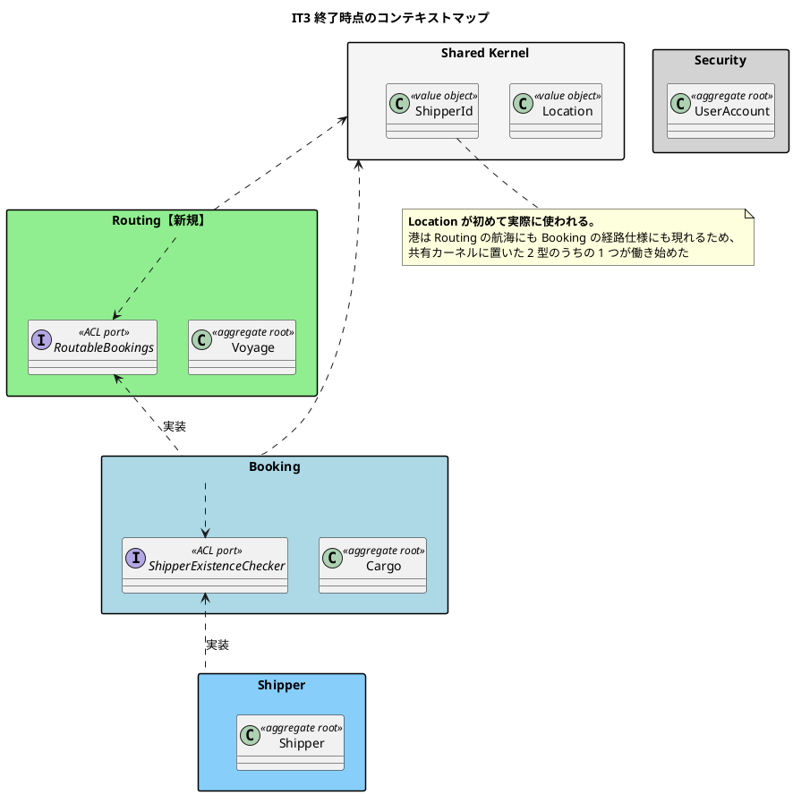
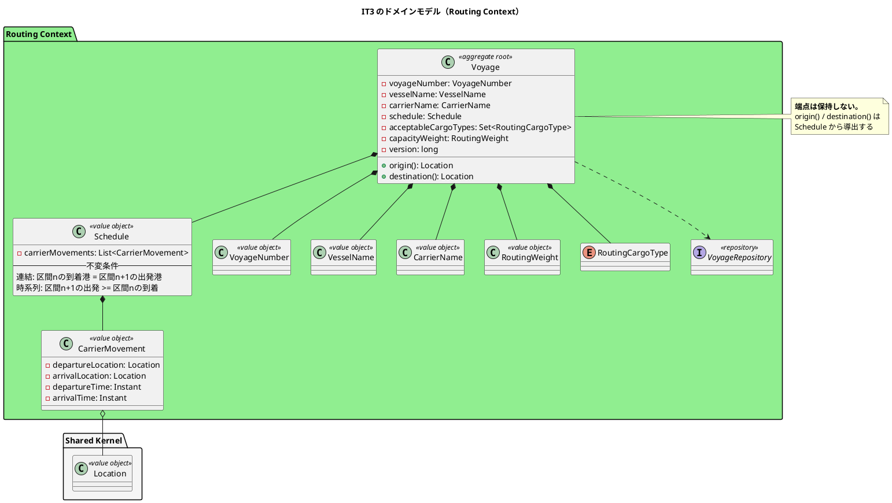

# 第 4 章：IT3 航海スケジュールと経路設計への引き渡し

## このイテレーションのゴール

**航海スケジュールを登録・検索でき、予約を経路設計者に引き渡せるようにする。**

Routing Context の `Voyage` 集約と `Schedule` の連結制約を確立し、次のイテレーションで行う経路候補算出の入力を揃えます。`ROLE_ROUTER`（経路設計者）に開く最初の画面ができる回でもあります。

**そして局面が変わります。** IT1・IT2 は序盤（アウトサイドイン＝画面から作る）でしたが、IT3 からは中盤（インサイドアウト＝ドメインから作る）です。

### このイテレーション終了時点のコンテキストマップ



## 扱うユーザーストーリー

| ID | ストーリー | SP |
| :--- | :--- | ---: |
| US24 | 航海スケジュールを新規登録する | 3 |
| US07 | 航海スケジュールを検索する | 3 |
| US06 | 予約情報を経路設計者に引き渡す | 2 |
| | **合計** | **8** |

US24 が US07 / US08 の前提です。航海スケジュールが存在しなければ、検索も経路候補算出もできません。

## 前イテレーションからの引き継ぎ

IT2 の教訓「前提が揃う前にロールへ機能を開放しない」を受け、**画面を開く前にロール別の到達性を確認する**手順を計画に入れました。結果としてこの回では別の抜け方をします（後述）。

## 実装

### 局面が変わる — アウトサイドインからインサイドアウトへ

`development_strategy.md` は、イテレーションの局面ごとに TDD の入口を切り替えると定めています。

| 局面 | イテレーション | 入口 | なぜ |
| :--- | :--- | :--- | :--- |
| 序盤 | IT1〜IT2 | **アウトサイドイン**（画面から） | 端から端まで通すことが目的。層の接続が主な不確実性 |
| 中盤 | IT3〜IT6 | **インサイドアウト**（ドメインから） | 業務ルールが主な不確実性。**画面から作ると規則の穴に気づけない** |

このイテレーションで、その切り替えの意味がすぐに実証されます。

### 行をまたぐ制約は、ドメインでしか守れない

航海スケジュールは運送区間（`CarrierMovement`）の並びです。並びには 2 つの制約があります。

```java
/**
 * 航海スケジュール。時系列に連なる運送区間の並び。
 *
 * <p>本クラスが守るのは<strong>区間をまたぐ 2 つの制約</strong>である。
 *
 * <ol>
 *   <li><strong>連結</strong>: 区間 n の到着港 = 区間 n+1 の出発港。違えば貨物は途中で消える</li>
 *   <li><strong>時系列</strong>: 区間 n+1 の出発 ≧ 区間 n の到着。着く前に次の船は出ない</li>
 * </ol>
 *
 * <p><strong>どちらも DB の CHECK 制約では守れない。</strong> 1 行の中で完結せず
 * 行をまたぐためである。**ここで守らなければ、どこでも守られない。**
 */
public record Schedule(List<CarrierMovement> carrierMovements) {

    public Schedule {
        if (carrierMovements == null || carrierMovements.isEmpty()) {
            throw new IllegalArgumentException("航海スケジュールは 1 つ以上の運送区間を持ちます");
        }
        carrierMovements = List.copyOf(carrierMovements);
        validate(carrierMovements);
    }

    private static void validate(List<CarrierMovement> movements) {
        for (int i = 1; i < movements.size(); i++) {
            CarrierMovement previous = movements.get(i - 1);
            CarrierMovement current = movements.get(i);

            if (!previous.arrivalLocation().equals(current.departureLocation())) {
                throw new IllegalArgumentException(
                        "運送区間がつながっていません: %s に到着した後 %s から出発しています"
                                .formatted(
                                        previous.arrivalLocation().unlocode(),
                                        current.departureLocation().unlocode()));
            }
            // 同時刻の乗り継ぎは認める（接続時間 0 は運用上ありうる）
            if (current.departureTime().isBefore(previous.arrivalTime())) {
                throw new IllegalArgumentException(
                        "前の区間の到着より前に出発しています: %s 到着 %s、次の出発 %s"
                                .formatted(
                                        previous.arrivalLocation().unlocode(),
                                        previous.arrivalTime(),
                                        current.departureTime()));
            }
        }
    }
}
```

**画面から作っていたら、この 2 つには気づきません。** フォームの入力検証は 1 項目ずつ見るもので、「前の区間の到着港」との突き合わせは自然には出てきません。DB の CHECK 制約も 1 行の中でしか働きません。

ふりかえりはこう記録しています。

> 画面から作っていたら気づかないまま「**貨物が途中で消えるスケジュール**」を登録できていた。局面が中盤に変わる意味が、最初のイテレーションで実感できた。

### 端点は保持せず、導出する

`Voyage` 集約の設計にも 1 つ判断があります。

```java
/**
 * 航海。Routing Context の集約ルート。
 *
 * <p>航海の端点（出発地・目的地）は {@link Schedule} から導く。**保持しない。**
 * 同じ事実を 2 か所に持つと、区間を足したときに端点だけ古いままになる。
 *
 * <p><strong>Setter を持たない。</strong> スケジュールの変更は US25 で、
 * 業務のことばで名づけた振る舞いとして追加する。
 */
public class Voyage {

    private final VoyageNumber voyageNumber;
    private final VesselName vesselName;
    private final CarrierName carrierName;
    private final Schedule schedule;
    private final Set<RoutingCargoType> acceptableCargoTypes;

    /** 積載可能重量。**容量が分からない便を作らない**ため必須である。 */
    private final RoutingWeight capacityWeight;
    private final long version;
```

「出発地」は業務のことばとしては存在しますが、**データとしては `Schedule` から導けます**。持たせると、区間を追加したときに端点だけ古いままになります。

`capacityWeight` を必須にしているのも同じ発想です。**容量が分からない便を作れてしまう**と、後の空き容量判定が「判定できない」ケースを持つことになります。

### このイテレーションのドメインモデル



### 予約の引き渡しは状態遷移として表す

US06「予約情報を経路設計者に引き渡す」は、`Cargo` の状態遷移そのものです。

```java
table.get(PRELIMINARY).put(BookingCommandType.ASSIGN_TO_ROUTING, ROUTE_PROPOSED);
```

引き渡し先の Routing が「まだ経路が付いていない予約」を一覧するために、Routing → Booking の ACL ポート（`RoutableBookings`）を新設します。IT2 の ACL は識別子の照会でしたが、今回は**一覧の取得**です。それでも渡すのは Routing が必要とする項目だけで、`Cargo` 集約そのものは渡しません。

## DDD の観点

### 戦略的 DDD

**BC が 3 つになり、ACL ポートが双方向に立ちました。**

| 向き | ポート | 渡すもの |
| :--- | :--- | :--- |
| Booking → Shipper | `ShipperExistenceChecker` | 存在の有無・荷主 ID |
| Routing → Booking | `RoutableBookings` | 経路未割当の予約の一覧（表示に要る項目だけ） |

「双方向」といっても循環ではありません。**用途が違う 2 本のポート**です。ただしこの後、Booking → Routing のポートも立つことになり、循環が実際に問題になります（ADR-012、第 9 章）。

このイテレーションで初めて **共有カーネルの `Location` が働きました**。港は Routing の航海にも Booking の経路仕様にも現れます。共有カーネルに置く 2 型を `Location` と `ShipperId` に絞った判断（ADR-005）が、ここで正しかったことが確かめられます。

### 戦術的 DDD

このイテレーションの主役は **値オブジェクトが不変条件を守る**という戦術です。

| 道具立て | 実装 |
| :--- | :--- |
| 集約ルート | `Voyage` |
| **不変条件を持つ値オブジェクト** | `Schedule`（連結・時系列） |
| 値オブジェクト | `CarrierMovement` / `VoyageNumber` / `VesselName` / `CarrierName` / `RoutingWeight` |
| リポジトリ | `VoyageRepository` |

`Schedule` は「区間のリスト」という技術的には `List` で足りるものに、**業務名と不変条件を与えた**型です。`List<CarrierMovement>` のまま持ち回れば、つながっていない並びをいつでも作れます。

もう 1 つの戦術が **導出可能な値を保持しない**（`Voyage.origin()`）ことです。集約が持つ状態を最小にすると、不整合の起きる場所が減ります。

### ユビキタス言語

**「航海（Voyage）」「運送区間（CarrierMovement）」「航海スケジュール（Schedule）」は業務のことばそのままです。** Eclipse Cargo Tracker の語彙を引き継いでいます。

このイテレーションで注意深く扱われているのが、**エラーメッセージのことば**です。

```java
"運送区間がつながっていません: %s に到着した後 %s から出発しています"
"前の区間の到着より前に出発しています: %s 到着 %s、次の出発 %s"
```

`IllegalArgumentException("invalid schedule")` ではありません。**何が業務上おかしいのかを、業務のことばで書いています。** ユビキタス言語は、利用者が読む文字列にも及びます。

**一方で、ことばが時差にやられました。** 「期限」は利用者の暦の上の日付ですが、サーバの標準時（UTC）で判断していたため、**日本時間の 0〜9 時に当日着の予約が拒否される**という不具合が出ました。「当日」ということばが、実装では別の意味になっていた例です。

## 設計判断

| 判断 | 内容 |
| :--- | :--- |
| 行をまたぐ制約は値オブジェクトで守る | DB の CHECK 制約では守れない |
| 航海の端点は導出する | 同じ事実を 2 か所に持たない |
| 積載可能重量を必須にする | 容量が分からない便を作らせない |
| 業務日付は業務タイムゾーンで判断する | UTC で判断すると時差の分だけ当日を取りこぼす |

## このイテレーションの学び

計画どおり 8SP を完了。**実バグを 3 件見つけました。いずれも「テストは緑なのに動かない」種類です。**

| 見つけたもの | 見つかり方 |
| :--- | :--- |
| 日本時間 0〜9 時に当日着の予約が拒否される | 日付をまたいだ時刻に作業していて落ちた |
| 港マスタが空で航海を 1 件も登録できない | 計画時の突合 |
| `LATERAL` を H2 が解釈できず画面が 500 | キャプチャを撮ろうとして発覚 |

3 つ目は**方言差**です。本番の PostgreSQL では緑、ローカルの H2 だけが落ちます。マイグレーションの `common` に方言を漏らさない運用（第 3 章）は守っていましたが、**クエリの側には同じ運用がありませんでした**。

そして、到達性の抜けがまた形を変えて出ます。

> **経路割り当て待ち一覧から予約の内容を確認できなかった。** IT2 の教訓に従ってロール別の到達性（開けるか・開けないか）は確かめたが、**「開いた画面から次に何ができるか」は別の観点**であり、抜けていた。

| IT | 抜けた観点 |
| :--- | :--- |
| IT2 | ロールがその画面を**開けるか** |
| IT3 | 開いた画面から**次に何ができるか** |

この系列は IT5 まで続きます。**同じ主題の変奏が 4 回**繰り返されたことが、後に受入基準の書き方そのものを見直すきっかけになります。

---

- 前: [第 3 章：IT2 Cargo 集約と最初の ACL ポート](03-iteration-02.md)
- 次: [第 5 章：IT4 経路候補算出](05-iteration-04.md)
