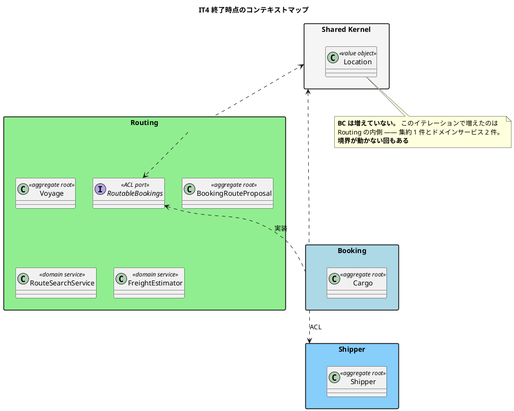
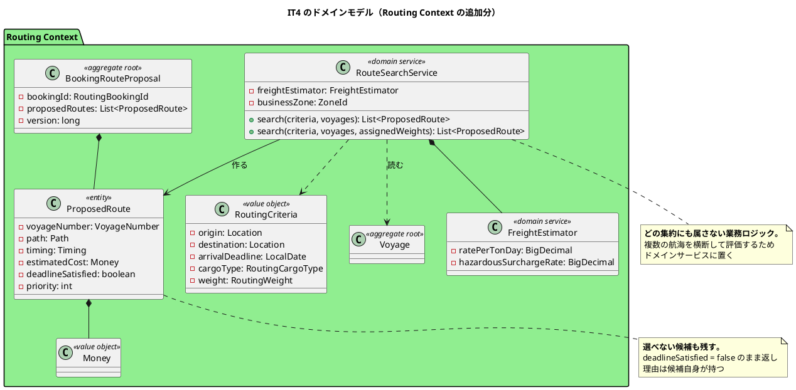
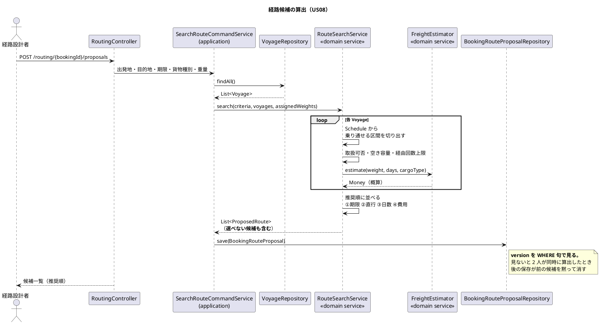

# 第 5 章：IT4 経路候補算出

## このイテレーションのゴール

**予約 1 件に対して、期限内に到達できる経路の候補を自動で算出し、推奨順に提示する。**

US08 は 8SP で、全 36 ストーリー中の最大です。**単独で 1 イテレーションを割り当てました。**

### このイテレーション終了時点のコンテキストマップ



## 扱うユーザーストーリー

| ID | ストーリー | SP |
| :--- | :--- | ---: |
| US08 | 経路候補を算出する | 8 |

受入基準は 4 項目です。

| 受入基準 | 実現 |
| :--- | :--- |
| 航海スケジュール検索結果と出発地・目的地・期限を入力として経路候補が自動算出される | `RouteSearchService` |
| 寄港地の接続可能性が評価される | 途中の港から乗る・途中の港で降りるを含む |
| 経路候補ごとに所要日数・経由港・費用・航海番号が表示される | 費用は**概算**（ADR-008） |
| 経路候補が推奨順に並べられて提示される | ①期限 ②直行 ③日数 ④費用 |

## 前イテレーションからの引き継ぎ

IT3 の Try から「修正した層の鏡像を探す」（ある層で直した問題が別の層にもないか確かめる）を計画に入れました。この回では層をまたぐ形では守れましたが、**同じ層の中の別の入口**では守れません（IT5 の P2）。

## 実装

### ドメインサービスをどこに置くか

経路探索は `Voyage` にも `Cargo` にも属しません。**複数の航海を横断して評価する**処理であり、どの集約の責務でもないからです。

戦術的 DDD の答えは**ドメインサービス**で、置き場は `routing/domain/model` の直下です。

```java
/**
 * 経路候補を探す（US08）。
 *
 * <p>探すのは<strong>1 つの航海の中で、出発地から目的地までを乗り通せる区間</strong>で
 * ある。途中の港から乗ることも、途中の港で降りることもできる。
 * 複数の航海を乗り継ぐ経路は本システムでは扱わない
 * （{@code proposed_route} が航海番号を 1 つだけ持つことに対応する）。
 *
 * <p><strong>打ち切りの条件を持つ。</strong> 経由回数の上限を超える候補は作らない。
 * 上限が無いと、港と航海が増えるほど候補が増え、経路設計者は選べなくなる。
 */
public class RouteSearchService {

    private final FreightEstimator freightEstimator;

    /**
     * 業務のタイムゾーン。<strong>期限は利用者の暦の上の日付である。</strong>
     * サーバの標準時で判断すると、時差の分だけ「期限当日」を取りこぼす。
     */
    private final ZoneId businessZone;
```

**`ZoneId` を注入している**点に注目してください。IT3 で見つかった「日本時間 0〜9 時に当日着の予約が拒否される」の対策が、ドメインサービスの構築時引数として現れています。業務タイムゾーンは設定であってドメインの外の事情ですが、**判断はドメインの中で行う**ため、値だけを注入します。

**スコープの明示も設計です。** 「複数の航海を乗り継ぐ経路は扱わない」と Javadoc に書き、その根拠をテーブル定義（`proposed_route` が航海番号を 1 つだけ持つ）に結びつけています。できないことを書くのは、後から「なぜできないのか」を調べる人のためです。

### 推奨順は 4 段階、費用は最後

```java
/**
 * 条件に合う候補を推奨順で返す。
 *
 * <p>推奨順は ①期限を満たす候補が先 ②直行が先 ③所要日数の短い順
 * ④概算費用の安い順である。<strong>概算である費用は最後の基準に留める</strong>
 * （ADR-008）。精度の低い数字を順位の主軸にしない。
 */
public List<ProposedRoute> search(RoutingCriteria criteria, List<Voyage> voyages) {
```

費用が 4 番目なのは、**その数字が概算だから**です。

```java
/**
 * 概算費用の算出（ADR-008）。
 *
 * <p><strong>実際の運賃ではない。</strong> 本システムは運賃表も港間の距離も持たない。
 * 材料が無いことを認めた上で、持っている値（重量・所要日数）から目安を出す。
 *
 * <p>単価と割増率は<strong>設定値として外から与える</strong>。ソースを変えずに
 * 調整できることが、この式が暫定であることの証拠になる。
 */
public final class FreightEstimator {
```

**「材料が無いことを認めた上で目安を出す」** という書き方が、このプロジェクトの一貫した態度です。精度の低い値を、精度が高いかのように使わない。順位の主軸にしないという設計判断が、そのまま比較器の順序に現れています。

### 選べない候補も消さない

```java
/**
 * 経路候補 1 件（US08）。
 *
 * <p><strong>選べない候補も残す</strong>（{@code domain-model.md} ビジネスルール 6）。
 * 一覧から消すと「なぜあの便が出てこないのか」を利用者が確認できなくなり、
 * 存在しない便を探し続けることになる。選べない理由は候補自身が持つ。
 */
public final class ProposedRoute {

    private final VoyageNumber voyageNumber;
    private final Path path;
    private final Timing timing;
    private final Money estimatedCost;
    private final Handling handling;
    private final boolean deadlineSatisfied;
    private final int priority;
```

`deadlineSatisfied` を持ち、**期限を満たさない候補も返します**。フィルタで落とすほうが実装は簡単ですが、利用者は「出てこない理由」を知る手段を失います。

`Path` / `Timing` / `Handling` という入れ子のレコードでフィールドをまとめている点も、Checkstyle のパラメータ数上限が設計の改善を促した例です（第 7 章で再度出てきます）。

### このイテレーションのドメインモデル



### 経路候補算出の流れ



## DDD の観点

### 戦略的 DDD

**このイテレーションで境界は動きません。** BC は 3 つのまま、ACL ポートも増えていません。

戦略的 DDD の観点で書くべきことは 1 つだけです。**Routing が中核ドメインであることが、このイテレーションで明確になりました。** 経路探索は他のどの BC にも属さず、外部サービスにも委ねません（ADR-006 が外部連携を採らないと決めています）。8SP を単独で投じたことが、そのままドメインの重心を示しています。

「境界が動かない回もある」というのは重要な観察です。**DDD の話が毎回コンテキストマップの話になるわけではありません。** この回は完全に境界の内側の話です。

### 戦術的 DDD

**ドメインサービスとエンティティが初めて登場した回**です。

| 道具立て | 実装 | なぜその道具か |
| :--- | :--- | :--- |
| **ドメインサービス** | `RouteSearchService` / `FreightEstimator` | どの集約にも属さない業務ロジック。複数の航海を横断する |
| 集約ルート | `BookingRouteProposal` | 予約 1 件に対する候補の集まり。一貫性の単位 |
| **エンティティ** | `ProposedRoute` | 集約の内部にあり、集約ルート経由でのみ操作する |
| 値オブジェクト | `RoutingCriteria` / `Money` / `Path` / `Timing` | |

`ProposedRoute` が値オブジェクトではなく**エンティティ**なのは、候補ごとに同一性（どの候補を選んだか）があるためです。同じ内容の候補が 2 つあっても、選択の対象としては別物です。

ドメインサービスに `ZoneId` と単価を**注入している**ことにも意味があります。ドメインサービスはステートレスであるべきですが、**業務の判断に必要な設定**は構築時に固定します。`@Value` で読むのではなく、`infrastructure/config` が組み立てて渡します。ドメインは Spring を知りません。

### ユビキタス言語

**「経路候補（ProposedRoute）」「推奨順（priority）」「概算費用（estimatedCost）」** はいずれも経路設計者のことばです。

このイテレーションで特徴的なのは、**ことばで「精度」を表明している**ことです。

- `estimatedCost` — `cost` ではなく `estimated`。**概算であることが型の名前に入っている**
- `FreightEstimator` — `FreightCalculator` ではない。計算ではなく見積もり
- `deadlineSatisfied` — 「期限を満たすか」であって「選べるか」ではない

`Calculator` と名づけていたら、後から「なぜこの金額が請求額と違うのか」という問いが必ず出ます。**ことばが精度の約束をしている**わけです。実際の請求額は IT13 の Billing Context が別に算出します（第 14 章）。

## 設計判断

| 判断 | 内容 |
| :--- | :--- |
| 経路探索はドメインサービスに置く | どの集約にも属さない |
| 費用は推奨順の第 4 基準に留める（ADR-008） | 概算を順位の主軸にしない |
| 選べない候補も返す | 消すと「出てこない理由」が分からなくなる |
| 経由回数に上限を置く | 上限が無いと候補が増えて選べなくなる |
| 業務タイムゾーンを注入する | IT3 の時差バグの再発防止 |

## このイテレーションの学び

8SP を完了。**実バグを 2 件見つけました。どちらも「置いた気になっている装置」です。**

| 内容 | 症状 |
| :--- | :--- |
| `booking_route_proposal` の `version` を `WHERE` で見ていなかった | 2 人が同時に算出すると、後の保存が前の候補を黙って消す |
| 読み戻しで貨物種別を落としていた | 危険物の予約に、扱えない便が「選択可」として並ぶ |

どちらも**保存のときだけ効く／宣言だけある**という共通点があります。ふりかえりは原因をこう書いています。

> **新しい集約を作るとき、既存集約の書き方を見に行かなかった**ことが原因である（`shipper` には楽観的ロックの正しい書き方がすでにあった）。

**同じプロジェクトの中に正しい書き方があるのに、参照しなかった**。これは 1 人開発でも起きます。

そして到達性の抜けが 3 回目です。

> **経路設計者が予約詳細から「一覧に戻る」を押すと 403 になった。** 新しく作った画面の出口は確かめたが、**共有画面の中に元からあるリンク**は数えていなかった。

| IT | 抜けた観点 |
| :--- | :--- |
| IT2 | ロールがその画面を**開けるか** |
| IT3 | 開いた画面から**次に何ができるか** |
| IT4 | 置いてあるボタンを**実際に押せるか** |

一方で、うまく働いたこともあります。**ArchUnit が設計の誤りを実際に捕まえました。** 新しい集約を書いている途中で、ドメイン層から他 BC の型を参照しようとしてビルドが落ちています。**設計判断を人の注意力ではなく検査が守った**例です。

---

- 前: [第 4 章：IT3 航海スケジュールと経路設計への引き渡し](04-iteration-03.md)
- 次: [第 6 章：IT5 経路の確定と予約への紐付け](06-iteration-05.md)
