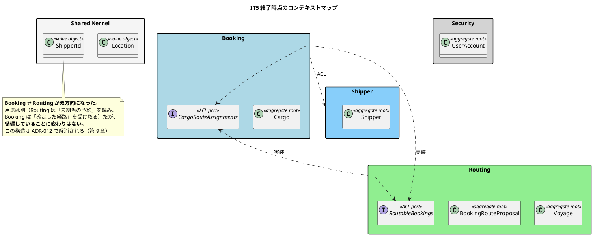
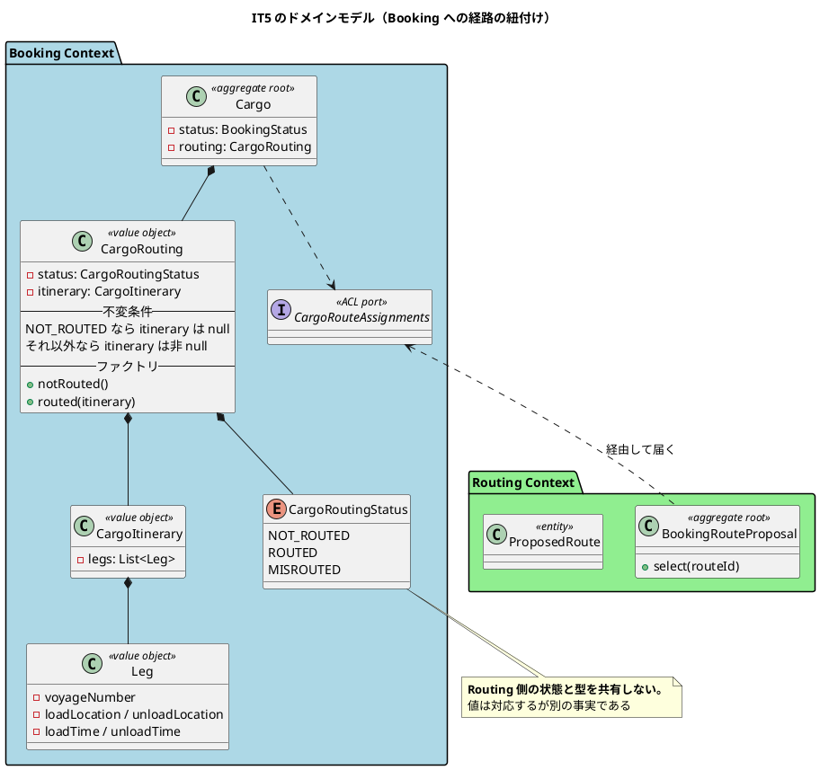
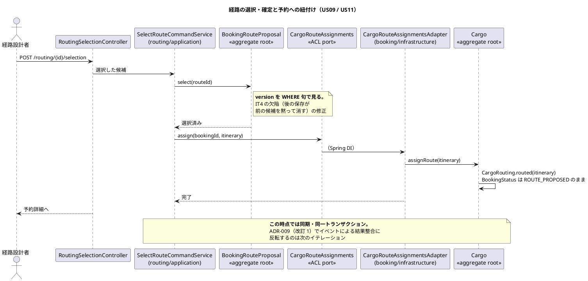

# 第 6 章：IT5 経路の確定と予約への紐付け

## このイテレーションのゴール

**算出した候補から経路を 1 件選んで確定し、予約に紐付けられるようにする。**

これで **Release 0.2 が完成**します。予約 → 引き渡し → 候補算出 → 確定 → 紐付けが一本つながり、次のイテレーションの「予約確定・追跡番号・荷役」へ進める状態になります。

### このイテレーション終了時点のコンテキストマップ



## 扱うユーザーストーリー

| ID | ストーリー | SP |
| :--- | :--- | ---: |
| US09 | 経路を選択・確定する | 3 |
| US11 | 経路情報を予約に紐付ける | 2 |
| US33 | ロックされたアカウントを解除する | 2 |
| | **合計** | **7** |

US33 は IT1 のマニュアルが先に約束してしまった機能です（第 2 章）。荷役が入る IT6 の前に手当てします。ロックの自動解除を 30 分待つあいだ、その担当者は作業できません。**輸送は待ってくれないため、待ち時間がそのまま業務の停止時間になります。**

## 前イテレーションからの引き継ぎ

IT4 の Try から、**楽観的ロックの書き方を既存集約に合わせる**ことを計画に入れました。IT4 で `version` を `WHERE` 句に入れ忘れた反省です。

さらに **IT4 で先送りにした空き容量の判定**を、今回は「壊すと赤になる」形で実装します。

## 実装

### 型で不正な組み合わせを作らせない

このイテレーションで最も見どころのある戦術がこれです。

貨物に経路を紐付けるとき、素朴に書けば `Cargo` に 2 つのフィールドを足すことになります。

```java
private final CargoRoutingStatus routingStatus;   // NOT_ROUTED / ROUTED
private final CargoItinerary itinerary;           // 区間の並び
```

この形は、**業務上あり得ない組み合わせを作れてしまいます**。「割り当て済なのに区間が無い」「区間はあるが未割り当て」の 2 通りです。

ひと組の値オブジェクトにまとめます。

```java
/**
 * 貨物の経路（状態と旅程のひと組）。
 *
 * <p><strong>状態と旅程を別々に持たない。</strong> 「割り当て済なのに区間が無い」
 * 「区間はあるが未割り当て」という組み合わせは業務上あり得ず、
 * 別々の項目にすると、その組み合わせを作れてしまう。
 */
public record CargoRouting(CargoRoutingStatus status, CargoItinerary itinerary) {

    public CargoRouting {
        if (status == null) {
            throw new IllegalArgumentException("経路状態は必須です");
        }
        if (status == CargoRoutingStatus.NOT_ROUTED && itinerary != null) {
            throw new IllegalArgumentException("未割り当ての貨物は旅程を持ちません");
        }
        if (status != CargoRoutingStatus.NOT_ROUTED && itinerary == null) {
            throw new IllegalArgumentException("割り当て済の貨物には旅程が必要です");
        }
    }

    /** 経路が割り当てられていない状態。 */
    public static CargoRouting notRouted() {
        return new CargoRouting(CargoRoutingStatus.NOT_ROUTED, null);
    }

    /** 経路が割り当てられた状態（US09 / US11）。 */
    public static CargoRouting routed(CargoItinerary itinerary) {
        return new CargoRouting(CargoRoutingStatus.ROUTED, itinerary);
    }
}
```

**静的ファクトリメソッドしか公開しない**ことで、正しい組み合わせだけが作られます。呼び出し側は `CargoRouting.routed(itinerary)` と書くだけで、状態と旅程の対応を気にしません。

> `misrouted(itinerary)` は IT11（誤配）で追加されたものです。**「旅程は残す。どの経路のはずだったかが分からないと、現在地からの再設計ができない」**という判断がそこに書かれています（第 12 章）。

### BC をまたいで型を共有しない

Routing にも「経路の状態」があり、Booking にも「貨物の経路状態」があります。値も対応します。**それでも型は分けます。**

```java
/**
 * 貨物の経路状態（US09 / US11）。
 *
 * <p><strong>Routing Context の状態とは別の型である。</strong> 値は対応するが、
 * 「経路提案の状態」と「貨物の経路状態」は別の事実である。提案が選択済みでも、
 * 貨物への反映が失敗すれば貨物は {@link #NOT_ROUTED} のままである。
 * BC をまたいで型を共有しない（ADR-005・ArchUnit ルール 4）。
 */
public enum CargoRoutingStatus {
    NOT_ROUTED("未割り当て", "bg-secondary"),
    ROUTED("割り当て済", "bg-success"),
    MISROUTED("誤配", "bg-danger");
```

**「値が同じだから 1 つにまとめる」は DRY ではありません。** 提案が選択済みでも貨物への反映が失敗すれば、貨物は未割り当てのままです。**2 つの事実が食い違いうることが、型を分ける理由**です。共有すると、片方の都合でもう片方が動きます。

### このイテレーションのドメインモデル



### 経路確定の流れ



## DDD の観点

### 戦略的 DDD

**Booking ⇄ Routing が双方向になりました。**

| 向き | ポート | 用途 |
| :--- | :--- | :--- |
| Routing → Booking | `RoutableBookings` | 経路未割当の予約を一覧する |
| Booking → Routing | `CargoRouteAssignments` | 確定した経路を貨物に反映する |

用途は別ですが、**依存としては循環しています**。この時点では ArchUnit も通り、動作も正しいため問題として顕在化しません。しかし BC を別モジュールに切り出そうとすると、この循環が壁になります。

**循環は ADR-012 で解消されます**（第 9 章）。そこでは「BC 間の依存の向きを一方通行に保つ」ことが決まり、逆向きの伝播はドメインイベントに置き換わります。**このイテレーションの構造が、後の設計変更の直接の動機になりました。**

戦略的 DDD の観点でもう 1 つ重要なのが、**型を共有しない判断**（`CargoRoutingStatus`）です。これは共有カーネルを最小に保つ（ADR-005）ことの実践であり、「似ているから共有する」という圧力に対する具体的な抵抗です。

### 戦術的 DDD

**値オブジェクトで不正な状態を表現不可能にする**、という戦術の最も分かりやすい例が出た回です。

| 道具立て | 実装 |
| :--- | :--- |
| **組にして不変条件を守る値オブジェクト** | `CargoRouting`（状態＋旅程） |
| 値オブジェクト | `CargoItinerary` / `Leg` |
| **静的ファクトリメソッド** | `CargoRouting.notRouted()` / `routed(itinerary)` |
| 楽観的ロック | `version` を `WHERE` 句に入れる（IT4 の返済） |

`CargoRouting` のパターンは覚えておく価値があります。**「片方が設定されているならもう片方も設定されていなければならない」という関係が現れたら、2 つのフィールドではなく 1 つの値オブジェクトにする。** コンパクトコンストラクタで組み合わせを検査し、ファクトリメソッドで正しい作り方だけを公開します。

Java には和型がないため、F# のような判別共用体で「不正な状態を表現不可能にする」ところまでは行けません。**検査を 1 か所に閉じ込めるのが、Java でできる最良の近似**です。

### ユビキタス言語

**「割り当て済（ROUTED）」「未割り当て（NOT_ROUTED）」** は経路設計者のことばです。表示名は `ui_design.md` の付録を正典としています。

```java
/**
 * 表示名は {@code ui_design.md} の付録（全 enum の日本語ラベルの正典）に揃える。
 * <strong>画面側で状態名を並べて分岐しない。</strong>
 */
```

**全 enum の日本語ラベルに正典を 1 つ置く**という運用が、この時期に確立しています。同じ状態が一覧・詳細・待ち一覧に出るため、表記がずれると利用者は別の状態だと思います。

ユビキタス言語の観点でこの回に起きた問題は、**同じ値を 2 通りに扱っていた**ことです（ふりかえり P5）。同じ概念に 2 つの表現があると、どちらが正しいかを判断する場所が無くなります。ことばの統一は、名前だけでなく**表現の統一**まで含みます。

## 設計判断

| 判断 | 内容 |
| :--- | :--- |
| 状態と旅程をひと組の値オブジェクトにする | 業務上あり得ない組み合わせを作らせない |
| BC をまたいで enum を共有しない | 値が対応しても別の事実 |
| 空き容量の判定を「壊すと赤になる」形で実装 | IT4 の先送りの返済 |

## このイテレーションの学び

7SP を完了し、**Release 0.2 が完成**。**安全装置を 11 件壊して赤を確認**しています（IT3 は 6 件、IT4 は 7 件）。

しかし到達性の抜けが 4 回目です。

> **経路を確定すると、経路割り当て画面が 404 になった。** 予約詳細には「経路を割り当て」ボタンが出たままで、押すと 404 になる。

| IT | 抜けた観点 |
| :--- | :--- |
| IT2 | ロールがその画面を**開けるか** |
| IT3 | 開いた画面から**次に何ができるか** |
| IT4 | 置いてあるボタンを**実際に押せるか** |
| IT5 | **操作を終えた後にもう一度開けるか** |

ふりかえりの結論が重要です。

> **受入基準には現れない。** 業務では当たり前の動き（確定した後にもう一度見たい）が、ストーリーの文には書かれない。

**受入基準を全部満たしても、業務は回らないことがある。** これは受入基準の書き方の問題であり、以降「毎朝どう使うか」から確かめる観点が加わります。

もう 1 つの学びは、修正の網羅性です。

> 算出（`/proposals`）には楽観的ロックの衝突処理を足したのに、**確定（`/selection`）には足していなかった**。同じ例外を投げる経路が他にないかを見ていない。

IT3 の Try「修正した層の鏡像を探す」は**層をまたぐ形**では守れていましたが、**同じ層の中の別の入口**は数えていませんでした。**教訓は、適用範囲まで書かないと守られません。**

---

- 前: [第 5 章：IT4 経路候補算出](05-iteration-04.md)
- 次: [第 7 章：IT6 予約確定・追跡番号・荷役記録](07-iteration-06.md)
