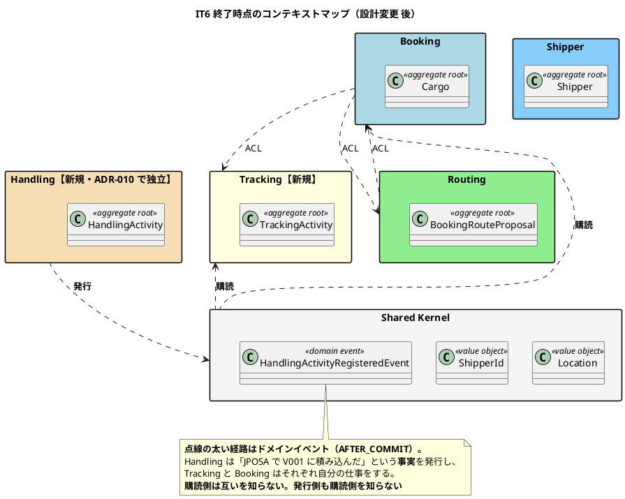
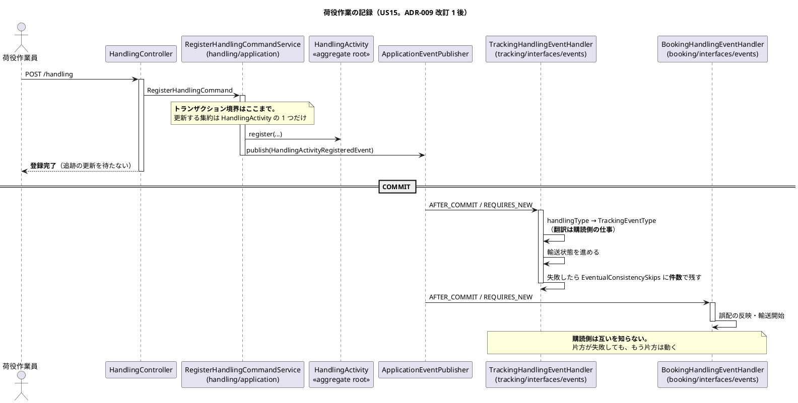
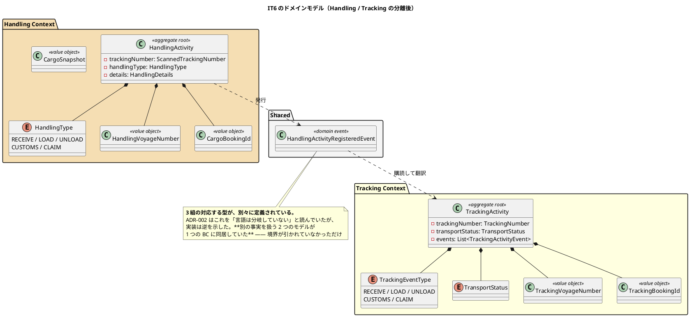

# 第 7 章：IT6 予約確定・追跡番号・荷役記録

## このイテレーションのゴール

**予約を確定し、追跡番号を発行し、荷役作業を記録できるようにする。**

これで **Release 1.0 が完成**します。「予約 → 経路 → 確定 → 追跡番号 → 荷役 → 輸送中」が一本つながり、E2E がその 1 本を 4 つのロールをまたいで通します。**ウォーキングスケルトンが端から端まで到達する回**です。

**本シリーズで最も設計が動いた章でもあります。** このイテレーションは 2 つの ADR を生み、そのうち 1 つは自分自身の過去の判断を反転させ、もう 1 つは BC の構成そのものを変えました。

### このイテレーション終了時点のコンテキストマップ



## 扱うユーザーストーリー

| ID | ストーリー | SP |
| :--- | :--- | ---: |
| US13 | 予約を確定する | 3 |
| US14 | 追跡番号を発行する | 2 |
| US15 | 荷役作業を記録する | 3 |
| | **合計** | **8** |

## 前イテレーションからの引き継ぎ

IT5 の Try から「同じ層の中の別の入口も数える」を計画に落としました。効いています（ふりかえり K1）。

## 実装

### まず素直に書いたら、集約を 3 つ同時に更新することになった

荷役作業の登録（US15）は、素直に実装すると次のようになります。

1. 荷役作業（`HandlingActivity`）を保存する
2. 追跡の輸送状態（`TrackingActivity`）を進める
3. 予約（`Cargo`）の状態を「輸送中」にする

**1 つのトランザクションで、2 つの BC・3 つの集約を書きます。**

これは動きます。テストも通ります。しかし DDD の原則から言えば逸脱です。**集約は一貫性の単位であり、1 トランザクションで更新する集約は 1 つ**が原則だからです。

当初の判断（ADR-009 の初版）は、この逸脱を「業務上あり得ない中間状態を作らないため」と正当化していました。

### レビューが設計の食い違いを暴いた

クローズ前のマルチパースペクティブレビューで、アーキテクト視点が指摘します。

> `architecture_backend.md` の「イベント駆動設計」節は、`ApplicationEventPublisher` と `@TransactionalEventListener(AFTER_COMMIT)` による結果整合を実装方針としてコード例つきで規定していた。**実装と設計書で故障モードがまるで違う。**

| 方式 | 荷役の登録が成功したとき |
| :--- | :--- |
| **結果整合** | 荷役は成功し、追跡の更新は後から起きる（あるいは失敗して起きない） |
| **同期・同一トランザクション** | 両方成功するか、両方起きないか |

ADR-009 は**判断を反転させます**。

> **改訂 1（2026-08-08）**: 当初は「BC 間 ACL は同期・同一トランザクションで呼ぶ」と決めた。**本改訂で判断を反転し、状態の伝播はドメインイベントによる結果整合とする。**
>
> 反転の理由は「**1 つの操作が 3 つの集約を 1 トランザクションで更新する形が、集約境界の原則からの逸脱として重すぎた**」ことである。当初案はその逸脱を「業務上あり得ない中間状態を作らないため」と正当化していたが、その代償として **BC 間の結合が強く、片方の遅延がもう片方を止める**構造を選んでいた。荷役は最も頻度の高い操作であり、**追跡や予約の都合で荷役の記録が失敗してはならない**。順序が逆だった。

**改訂前の記述は「代替案」の節に残しています。** 判断の経緯を追えるようにするためです。

### ドメインイベントで結果整合にする

発行側は事実だけを運びます。

```java
/**
 * 荷役作業が登録された（US15）。
 *
 * <p>Handling Context が発行し、Tracking Context と Booking Context が購読する。
 * <strong>購読側は互いを知らない。</strong> 追跡は輸送状態を進め、予約は誤配の反映と
 * 輸送開始を行うが、どちらも相手が何をするかを知らずに自分の仕事をする。
 *
 * <p><strong>運ぶのは起きた事実だけである。</strong> 「輸送状態を LOADED にせよ」ではなく
 * 「JPOSA で V001 に積み込んだ」を伝える。どう解釈するかは購読側が決める。
 * 命令を運ぶと、発行側が購読側の都合を知ることになる。
 */
public record HandlingActivityRegisteredEvent(
        UUID bookingId,
        String trackingNumber,
        String handlingType,
        Instant completionTime,
        String locationUnlocode,
        String voyageNumber,
        boolean misrouted) {
}
```

イベントは `shared/domain/event` に置きます。**共有カーネルに置いてよいのは `Location` と `ShipperId` だけ**（ADR-005）でしたが、イベントは別枠です。ArchUnit に専用のルールを足しています。

```java
static final ArchRule 共有イベントは事実を運ぶレコードのみ = ...
static final ArchRule 共有イベントのネストした型もレコード = ...
```

購読側は `interfaces/events` に置きます。

```java
/**
 * 荷役の登録を追跡に反映する（US15）。
 *
 * <p><strong>AFTER_COMMIT で受ける</strong>（ADR-009）。コミット前に動くと、荷役の登録が
 * 巻き戻ったときに追跡だけが進む。
 *
 * <p>荷役種別を追跡イベント種別へ翻訳するのはここである。値が同じでも
 * 「荷役として何をしたか」と「追跡の上で何が起きたか」は別の事実であり、
 * <strong>対応づけは受け取る側の仕事</strong>である。
 */
@Component
public class TrackingHandlingEventHandler {

    /** 購読者の名前。メトリクスのタグになる（運用手順書が参照する）。 */
    private static final String SUBSCRIBER = "tracking";

    /**
     * 追跡イベントを記録し、輸送状態を進める。
     *
     * <p><strong>失敗は数えられる場所に出す。</strong> 結果整合では利用者の画面に
     * 返せないため、ここが唯一「反映されなかった」ことを知る手段になる。
     * ログだけでは誰も見ないため、件数として残す（ADR-009 / IT6 追補 A1）。
     */
    @TransactionalEventListener(phase = TransactionPhase.AFTER_COMMIT)
    public void on(HandlingActivityRegisteredEvent event) {
```

**`AFTER_COMMIT` かつ `REQUIRES_NEW`** が組み合わせの要点です。コミット前に動けば、荷役の登録が巻き戻ったときに追跡だけが進みます。

### 荷役の記録の流れ



### そして BC の構成が変わる

ADR-009 の反転を受けて、もう 1 つの判断が動きます。

荷役は当初、Tracking Context の中のモジュール（`tracking/handling/`）として実装されていました（ADR-002）。その根拠は 3 つありましたが、**IT6 で実際に実装した結果、2 つの前提が崩れます**。

**根拠 2「独立 BC にすると結果整合という重い連携が必要になる」**：

> ADR-002 は「独立 BC ＝ 結果整合が必要」を前提とし、それを**避けるべきコスト**として扱っていた。しかし ADR-009（改訂 1）は、結果整合を**避けるものではなく選ぶもの**として決めた。
>
> **理由は、荷役が最も頻度の高い操作だから**である。ADR-002 はまさにその点を「独立 BC にしない理由」として挙げていたが、順序が逆だった。頻度が高く落としてはならない操作こそ、**他 BC の都合から切り離されるべき**である。
>
> **結果整合は独立 BC の代償ではなく、独立 BC を選ぶ理由の側にある。**

**根拠 3「荷役作業員と追跡管理者でユビキタス言語が分岐していない」**：

実装してみると、**言語は分岐していました**。

| 概念 | Handling | Tracking |
| :--- | :--- | :--- |
| 作業・出来事の種別 | `HandlingType`（受領・積込・荷降し・通関・引取） | `TrackingEventType`（同じ 5 値だが「追跡の上で何が起きたか」） |
| 航海番号 | `HandlingVoyageNumber` | `TrackingVoyageNumber` |
| 予約参照 | `CargoBookingId` | `TrackingBookingId` |

> **同じ BC の中にいながら 3 組の対応する型を別々に定義していた。** `TrackingEventType` の Javadoc は「荷役として何をしたかと、追跡の上で何が起きたかは**別の事実**である」と自ら述べている。
>
> **別の事実を扱う 2 つのモデルが 1 つの BC に同居していた。** これは統合されている状態ではなく、**境界が引かれていないだけ**である。

さらに、実装は名前の一致に依存した結合を持っていました。

```java
TrackingEventType.valueOf(handlingType.name())   // ← 分離を宣言しながら文字列で結合
```

**ADR-010 が ADR-002 を置き換え、Handling は独立した BC に昇格します。**

- `tracking/handling/` → `handling/` へパッケージを移動
- 状態の伝播はドメインイベント、問い合わせとコマンドは ACL ポート
- **ArchUnit の BC 集合に `handling` を追加** → BC 分離ルールが Handling と Tracking の間でも効くようになる
- テストの置き場も移す（**ルールはテストにも等しく効く**）
- **URL パス `/handling/*` は変更しない** — URL は利用者から見た業務の区切りであり、内部構成に追随させない

### このイテレーションのドメインモデル



## DDD の観点

### 戦略的 DDD

**このイテレーションは、本シリーズで最も戦略的 DDD が動いた回です。**

| 変化 | 内容 |
| :--- | :--- |
| BC が 3 → 5 に | Tracking が新設され、Handling が ADR-010 で独立 |
| **関係パターンが増えた** | ACL（同期）に加えて**公開ホストサービス相当のイベント**（非同期） |
| **境界の引き直し** | ADR-002 → ADR-010。**設計フェーズの判断が実装で覆った** |

戦略的 DDD の教科書的な手順は「まず境界を引き、それから実装する」です。**このプロジェクトはその順で進め、そして間違えました。**

間違いに気づいた手段が重要です。**「同じ概念に別々の型を 3 組定義していた」という実装上の事実**でした。ADR-002 は「ユビキタス言語が分岐していない」と判断していましたが、実際に書いてみると分岐していました。

> **別の事実を扱う 2 つのモデルが 1 つの BC に同居していた。** これは統合されている状態ではなく、**境界が引かれていないだけ**である。

これが本シリーズで繰り返し現れる主題です。**境界は机上では決まらず、動かして初めてずれが見える。**

もう 1 つ、**URL を内部構成に追随させない**という判断も戦略的です。`/handling/*` は利用者から見た業務の区切りであり、BC の構成が変わっても変えません。**内部のモデルの変化を、利用者の世界に漏らさない**という線引きです。

### 戦術的 DDD

**ドメインイベントが初めて登場しました。**

| 道具立て | 実装 |
| :--- | :--- |
| **ドメインイベント** | `HandlingActivityRegisteredEvent`（`shared/domain/event` のレコード） |
| **イベントハンドラ** | `TrackingHandlingEventHandler` / `BookingHandlingEventHandler`（`interfaces/events`） |
| 集約ルート | `HandlingActivity` / `TrackingActivity` |
| 値オブジェクト | `HandlingType` / `TrackingEventType` / `TransportStatus` / `TrackingNumber` ほか |

ドメインイベントの設計で守っている規則が 2 つあります。

**1. イベントは事実を運び、命令を運ばない**

> 「輸送状態を LOADED にせよ」ではなく「JPOSA で V001 に積み込んだ」を伝える。どう解釈するかは購読側が決める。**命令を運ぶと、発行側が購読側の都合を知ることになる。**

**2. 翻訳は購読側の仕事**

`handlingType` → `TrackingEventType` の対応づけは、購読側の `TrackingHandlingEventHandler` が行います。発行側が変換して渡すと、発行側が購読側のモデルを知ることになります。

そして戦術面の重要な帰結が、**トランザクション境界が集約 1 つに戻った**ことです。

| | 改訂前 | 改訂後 |
| :--- | :--- | :--- |
| 1 トランザクションで更新する集約 | 3（2 BC にまたがる） | **1** |
| 荷役の登録が失敗する条件 | 追跡・予約のロック競合でも失敗 | **Handling 自身の問題のときだけ** |

### ユビキタス言語

**このイテレーションは、ユビキタス言語が BC の境界を決めた回です。**

戦略的 DDD の節に書いたとおり、Handling の独立を決めた根拠の 1 つは「言語が分岐していた」ことでした。分岐の証拠は、コードそのものにありました。

```text
HandlingType          ⇄  TrackingEventType      （同じ 5 値だが別の事実）
HandlingVoyageNumber  ⇄  TrackingVoyageNumber
CargoBookingId        ⇄  TrackingBookingId
```

**同じ値を持つ 3 組の型が別々に定義されている**という事実は、「ここには 2 つのモデルがある」という強いシグナルです。DDD ではこれをコンテキストの境界の兆候として読みます。

**逆に、まとめようとした形跡もありました。**

```java
TrackingEventType.valueOf(handlingType.name())
```

Javadoc で「別の事実である」と宣言しながら、実装では文字列で結合していました。**宣言だけでは言語は分かれません。** ADR-010 で BC を分け、ArchUnit の BC 集合に `handling` を加えたことで、初めて検査が言語の分離を守るようになります。

## 設計判断

| ADR | 決めたこと |
| :--- | :--- |
| **ADR-009（改訂 1）** | BC 間の状態伝播はドメインイベントによる結果整合。**同期・同一トランザクションから反転** |
| **ADR-010** | Handling を独立 BC に昇格。**ADR-002 を置き換え** |

## このイテレーションの学び

8SP を完了し **Release 1.0 が完成**。コミット 19 本、**安全装置を 19 件壊して赤を確認**（IT5 は 11 件）。

しかしレビューで**高優先度 14 件**が見つかり、うち 8 件を本イテレーション内で修正、6 件を次以降へ送りました。完了報告はこう書いています。

> 5 視点のうち 3 視点が独立に同じ型の欠陥を指摘している — 「**安全装置を書いたが、その結果を誰も確かめていない／使っていない**」。

| 問題 | 内容 |
| :--- | :--- |
| **「壊して赤」の対象が偏っていた** | 判定は壊したが、**判定の結果が書かれる先**（別集約・別 BC・DB の列）を壊していなかった |
| **楽観的ロックの戻り値を 3 か所で捨てていた** | `boolean` を返すリポジトリ操作の戻り値を無視。**同期にした利点がそのまま失われる** |
| **発行が原子的でなかった** | 追跡番号の発行 |
| **設計ドキュメントの一部だけを更新した** | 実装した BC の数で確認していた |

そして、結果整合を選んだことの代償も正直に記録されています。

> ### P8. 結果整合にしたことで、失敗が利用者に返らなくなった
>
> 購読側で楽観的ロックが衝突しても、**ログにしか残らない**。同期のときは画面に「他の操作が先に行われました」と出せていた。
>
> **これは結果整合を選んだ以上、避けられない代償である。** 問題は代償そのものではなく、**ログを見る運用を用意していない**ことである。

対策として `EventualConsistencySkips` が入り、**失敗を件数として残す**ようになりました。ハンドラの Javadoc がその理由を書いています。

> **失敗は数えられる場所に出す。** 結果整合では利用者の画面に返せないため、ここが唯一「反映されなかった」ことを知る手段になる。**ログだけでは誰も見ないため、件数として残す。**

Try にも同じ趣旨が残りました。

> **結果整合にした経路には、失敗を見る手段を必ず用意する。** ログに出すだけでは「誰も見ない場所に置いた」のと同じ。

**設計の選択には代償があり、代償を選んだなら、その代償を見る手段まで作って初めて選んだことになる。** このイテレーションの最大の学びです。

---

- 前: [第 6 章：IT5 経路の確定と予約への紐付け](06-iteration-05.md)
- 次: [第 8 章：IT7 追跡照会・引取・法人荷主](08-iteration-07.md)
