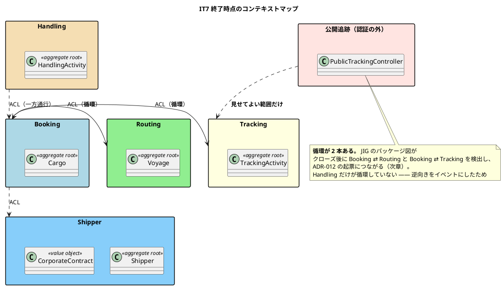
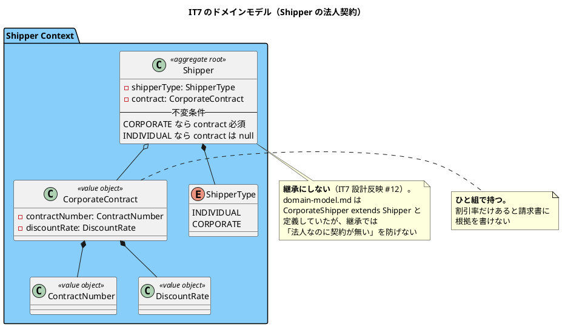

# 第 8 章：IT7 追跡照会・引取・法人荷主

## このイテレーションのゴール

**追跡番号から貨物の現在状況を照会でき、引取で配送を完了させ、法人荷主を契約条件つきで登録できるようにする。**

完了報告の一文がこのイテレーションの性格を言い当てています。

> **本 IT で「作った人以外が初めて使う」段階に入った。** IT1〜IT6 で作った画面はすべて社内ロール向けだった。US18 の公開追跡は**認証を持たない相手に見せる最初の画面**であり、見せてよい情報の範囲がそのまま設計上の制約になった。

### このイテレーション終了時点のコンテキストマップ



## 扱うユーザーストーリー

| ID | ストーリー | SP |
| :--- | :--- | ---: |
| US18 | 追跡情報を照会する | 3 |
| US16 | 引取作業を記録する | 3 |
| US03 | 法人荷主を登録する | 2 |
| | **合計** | **8** |

## 前イテレーションからの引き継ぎ

IT6 の Try 10 件を計画に落としました。とくに **T1「壊して赤は入口と出口の両方で回す」** と **T10「結果整合にした経路には失敗を見る手段を必ず用意する」** です。**返済枠 5 件をすべて完済**しており、IT2 から 6 イテレーション連続で「余力次第」にせず時間で確保する運用が守られています。

## 実装

### 継承をやめて、値オブジェクトのひと組にする

US03（法人荷主）は、設計ドキュメントでは継承として定義されていました。

```text
domain-model.md:  CorporateShipper extends Shipper
```

**実装では判断を変えています。**

```java
/**
 * 法人契約（US03）。契約番号と契約割引率の<strong>ひと組</strong>。
 *
 * <p>別々に持つと、成り立たない組み合わせを作れる。
 *
 * <ul>
 *   <li>割引率はあるが契約番号が無い（<strong>割引の根拠を請求書に書けない</strong>）</li>
 *   <li>契約番号はあるが割引率が無い（割引 0% なのか未設定なのか分からない）</li>
 * </ul>
 *
 * <p><strong>{@code domain-model.md} は {@code CorporateShipper} を
 * {@code Shipper} のサブタイプとして定義していたが、本 IT で判断を変えた</strong>
 * （IT7 設計反映 #12）。{@code Shipper} は {@code final} かつ不変であり、
 * 継承すると「法人なのに契約が無い」「個人なのに契約がある」組み合わせを
 * 型で防げなくなる。<strong>値としてひと組で持つほうが、不正な状態を作れない。</strong>
 */
public record CorporateContract(ContractNumber contractNumber, DiscountRate discountRate) {
```

そして `Shipper` 側で、種別と契約の整合を守ります。

```java
/**
 * 種別と契約の整合を守る。
 *
 * <p><strong>「法人なのに契約が無い」と「個人なのに契約がある」の両方を弾く。</strong>
 * 前者は割引の根拠を請求書に書けず、後者は個人に存在しないはずの契約が付く。
 * DB の {@code chk_shipper_corporate_contract} と同じ不変条件である。
 */
private static void requireConsistent(ShipperType type, CorporateContract contract) {
    if (type == ShipperType.CORPORATE && contract == null) {
        throw new IllegalArgumentException("法人荷主には契約番号と契約割引率が必要です");
    }
    if (type == ShipperType.INDIVIDUAL && contract != null) {
        throw new IllegalArgumentException("個人荷主に法人契約は指定できません");
    }
}
```

**IT5 の `CargoRouting`（第 6 章）と同じ形**です。「片方があるならもう片方もある」という関係を、2 つのフィールドではなく 1 つの値オブジェクトで表します。継承では表現できません — サブタイプがあっても、そのサブタイプのフィールドが `null` である状態を型は防げないからです。

**不変条件は DB の CHECK 制約と対になっています。** 集約が守り、スキーマも守ります。

### 認証の外に見せる画面

US18 の公開追跡は、**認証を持たない相手に見せる最初の画面**です。設計上の制約は 2 つになります。

1. **見せてよい情報の範囲** — 荷主名・金額・内部の担当者は出さない
2. **総当たりへの耐性** — 追跡番号は推測できる形（日付＋連番）をしている

2 つ目には ADR-011（公開エンドポイントのレート制限）で対処します。ここで入れたレート制限は、後のイテレーションで**ヘルスチェックを巻き込む**という副作用を出します（横断的な防御はヘルスプローブを除外しなければならない）。

### 引取は「記録はできるが証明にならない」

US16（引取作業を記録する）は完了しました。**しかし完了報告は、完了させたことに条件を付けています。**

> ### P5. 引取確認が「記録はできるが証明にならない」状態で完了とした

引取記録は、提示された確認コードを**そのまま書き写すだけ**でした。照合する相手がシステムの中にありません。誰かが適当な値を入れても記録は残ります。

これを US35 として起票し、**5 イテレーション後の IT12 で決着します**（第 13 章）。

**重要なのは、完了させたうえで欠陥を名前で記録したこと**です。「完了だが証明にはならない」と書いておかなければ、次に読む人は引取が証明になっていると思います。

### このイテレーションのドメインモデル



## DDD の観点

### 戦略的 DDD

**BC は増えていませんが、境界の外側に新しい相手が現れました。** 認証を持たない一般利用者です。

DDD の用語では、公開追跡は Tracking Context の **公開ホストサービス**にあたります。ただし提供する形は API ではなく画面で、**渡す情報を絞ることが境界の防御そのもの**になります。

そしてこのイテレーションの終了後、**JIG のパッケージ図が 2 本の循環を検出します**。

```text
Booking ⇄ Routing
Booking ⇄ Tracking
```

面白いのは、**ArchUnit は緑だった**ことです。ArchUnit のルール 4 は ACL のパッケージを依存先とする参照を除外しているため、越境の存在は見えても循環は見えません。

> **JIG のほうが正直である。** ArchUnit の除外は「越境してよい場所」を宣言しているだけで、「循環していない」ことを主張していない。

**検査が緑であることと、設計が健全であることは別**です。この観察が ADR-012 につながります（次章）。

### 戦術的 DDD

| 道具立て | このイテレーションでの現れ方 |
| :--- | :--- |
| **値オブジェクトのひと組** | `CorporateContract`（契約番号＋割引率） |
| **継承の回避** | `Shipper` は `final`。サブタイプではなく値で種別の違いを表す |
| 不変条件の二重化 | 集約の `requireConsistent` と DB の `chk_shipper_corporate_contract` |

**継承をやめた判断**は、戦術的 DDD の実践として重要です。DDD の教科書は「エンティティの階層」を否定しませんが、**Java の継承では組み合わせの制約を型で表現できません**。

- `CorporateShipper extends Shipper` にすると、`contract` フィールドが `null` の `CorporateShipper` を作れます
- 値のひと組にすると、`CORPORATE` かつ `contract == null` はコンストラクタで弾かれます

「サブタイプにするか、値にするか」の判断基準は **「振る舞いが違うのか、データが違うのか」** です。法人荷主は個人荷主と違う振る舞いをしません。持っているデータが違うだけです。

### ユビキタス言語

**設計ドキュメントのことばと実装のことばが、初めて意図的に食い違った回**です。

`domain-model.md` は `CorporateShipper` という型名を持っていました。実装は `Shipper` ＋ `CorporateContract` にしました。**業務のことばとしては「法人荷主」は存在します**が、モデルとしては「法人契約を持つ荷主」として表現しています。

これは正典を無視したのではなく、**正典を更新した**ものです（IT7 設計反映 #12）。Javadoc に「本 IT で判断を変えた」と経緯まで書いています。**ことばを変えるなら、変えた記録を残す。**

一方、このイテレーションのふりかえりが挙げた最大の問題は、**ことばだけがあって実装が無い**形でした。

> ### P1. 「宣言はしたが実装が無い」形が 6 件出た（最も重い）

Javadoc・ADR・マニュアルに「〜する」と書きながら、そのコードが存在しない。**宣言はユビキタス言語の一部ですが、実装を伴わない宣言はことばの汚染です。** 読んだ人が「そうなっている」と信じるためです。

## 設計判断

| 判断 | 内容 |
| :--- | :--- |
| 法人荷主を継承で表さない | 型で不正な組み合わせを防げないため（設計反映 #12） |
| 公開画面に見せる情報を絞る | 認証を持たない相手が最初の利用者 |
| 公開エンドポイントにレート制限（ADR-011） | 追跡番号は推測できる形をしている |
| 引取は「証明にならない」と明記して完了 | US35 として起票（IT12 で決着） |

## このイテレーションの学び

8SP を完了、**返済枠 5 件を完済**、レビューの高優先度 9 件をすべてイテレーション内で対応しました。

しかし、共通していたのは 1 つの形です。

> **P1. 「宣言はしたが実装が無い」形が 6 件出た（最も重い）**

そして次の観察が、以降の運用を変えます。

> **P2. 前 IT のレビュー指摘が 2 件、そのまま再発した**
>
> **P4. 利用者代表の指摘が、他の視点より一貫して重かった**

利用者代表（業務の視点）の指摘が重いのは、**受入基準に書かれていない当たり前の動きを見ているから**です。第 6 章で見た「到達性の抜け」が 4 回続いたのと同じ理由です。

うまく働いたのは自動化です。

> **K4. 規律を人手から自動へ移した**

依存の更新確認を目視から `dependencyUpdates` タスクに移しました。**見落としても誰も気づかない規律は、いずれ守られなくなる。** その最初の実行結果は次のイテレーションで出ます —— **25 件の未更新**でした。

---

- 前: [第 7 章：IT6 予約確定・追跡番号・荷役記録](07-iteration-06.md)
- 次: [第 9 章：IT8 うまくいかなかったときを扱う](09-iteration-08.md)
