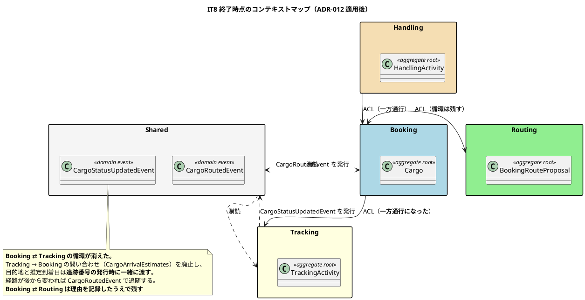
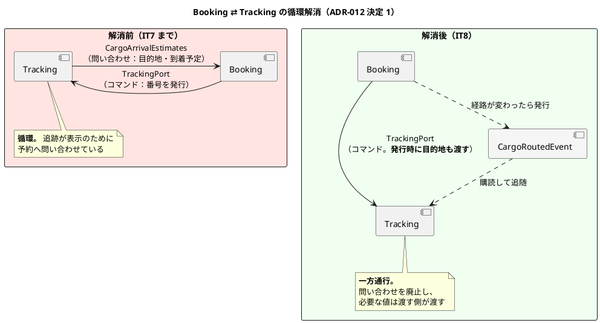
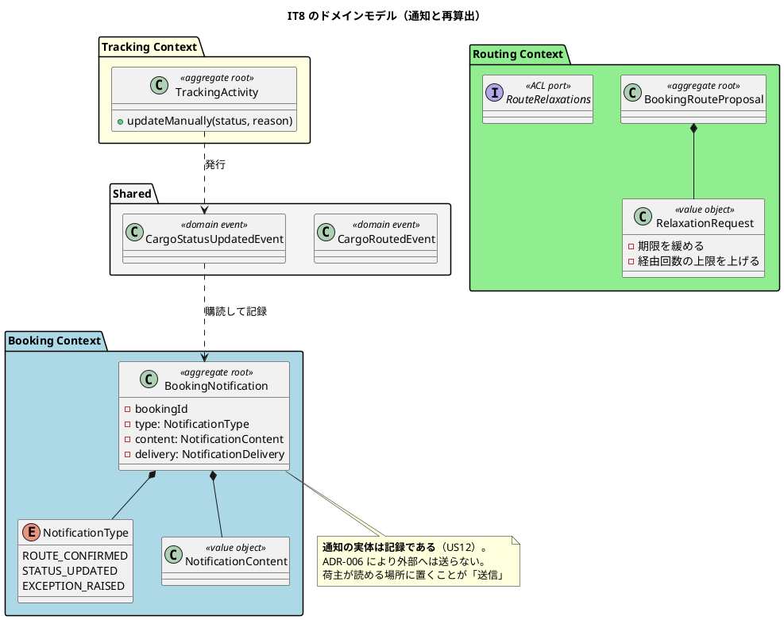

# 第 9 章：IT8 うまくいかなかったときを扱う

## このイテレーションのゴール

**候補が出なかった経路を条件を変えて出し直し、確定した経路を荷主に通知し、荷役では捕捉できない状態変化を追跡管理者が手で入れられるようにする。**

計画はこう書いています。

> **本 IT は「うまくいかなかったとき」を扱うイテレーションである。** IT1〜IT7 で作ったのは順調に進む道であり、候補ゼロ・伝え漏れ・荷役では拾えない状態はいずれも**業務が止まる側の事象**である。

そして設計面では、**前章で見つかった循環を実際に断ちます**（ADR-012）。

### このイテレーション終了時点のコンテキストマップ



## 扱うユーザーストーリー

| ID | ストーリー | SP |
| :--- | :--- | ---: |
| US17 | 貨物状態を手動更新する | 3 |
| US10 | 経路条件を調整して再算出する | 3 |
| US12 | 確定経路を荷主に通知する | 2 |
| | **合計** | **8** |

## 前イテレーションからの引き継ぎ

**返済枠 6 件を完済**（3 イテレーション目）。そして IT7 で自動化した依存更新の確認が、最初の実行で **25 件の未更新**を出します。

> **4 IT 続けていた運用が、確かめる手段を持たないまま形骸化していた。**

さらに、脆弱性対策で入れていたバージョンの上書きが **1 件、古い方へ固定していました**。`build.gradle` のコメント自身が「Boot が追いついたらこの上書きは削除すること。残すと今度は古い方に固定してしまう」と警告していたとおりのことが、上書きを入れた 1 イテレーション後に起きています。

## 実装

### 循環を断つ — ADR-012

前章の終わりで、JIG のパッケージ図が **Booking ⇄ Routing** と **Booking ⇄ Tracking** の循環を検出しました。

まず、循環が生まれる仕組みを理解する必要があります。

> 規約そのものが原因である。**ポートは呼ぶ側が定義し、アダプタは呼ばれる側が実装する**（ADR-005・ArchUnit ルール 4）。
>
> この配置では、A が B を呼ぶたびに**パッケージ B が A に依存する**。したがって A と B が互いに呼び合えば、**呼び出しの内容にかかわらず必ずパッケージ循環になる**。
>
> **アダプタの置き場所を変えても循環は消えない。** 依存を持つパッケージが入れ替わるだけである。

つまり **ACL の規約を守る限り、双方向に呼び合えば循環は避けられません**。断つには「呼び合うのをやめる」しかありません。

Handling だけが循環していない理由が、答えの形を示していました。

> Handling → Booking は `CargoSnapshots`（問い合わせ）1 本だけであり、逆向きの状態伝播は `HandlingActivityRegisteredEvent` で行っている（ADR-009）。**呼び出しが一方通行であるためパッケージ依存も一方通行になり、循環しない。**
>
> **これが本 ADR の答えの形である。**

### 断てるものと断てないもの

ADR-012 は 4 方向を 1 本ずつ検討します。

| 方向 | 断てるか | 理由 |
| :--- | :--- | :--- |
| Tracking → Booking（`CargoArrivalEstimates`） | **断てる** | 目的地と推定到着日は**追跡番号の発行時に一緒に渡せる**。その呼び出しは既に Booking → Tracking の向き。経路が変わったら `CargoRoutedEvent` で更新すればよい |
| Booking → Tracking（`TrackingPort`） | 断てない | **コマンドであり番号をその場で返す。** イベントにすると発行の可否と番号を利用者に返せない |
| Booking → Routing（`CargoRouteAssignments`） | 断てない | **コマンドである。** 戻り値（`NOT_FOUND` / `REJECTED` / `CONFLICTED`）を画面にそのまま返している。イベントにすると**拒否の理由を返せなくなる** |
| Routing → Booking（`VoyageCapacityPort`） | 断てない | **確定の瞬間の空き容量**であり、古い値では意味を持たない。結果整合にすると、この検査を入れた理由が消える |

決定は 2 段構えです。

1. **断てる循環は断つ** — `CargoArrivalEstimates` を廃止し、`CargoRoutedEvent` に置き換える
2. **断てない循環は理由を記録したうえでインフラ層に閉じ込める** — Booking ⇄ Routing は残す

> **Booking ⇄ Routing は、両方向とも ADR-009 の基準に照らして同期が正しい。** 循環を消すには、業務上必要な即時性を捨てるか、読み取りモデルを増やして複雑さを買うかのどちらかになる。

**「消せる循環だけを消し、残るものは名前をつけて残す」**という決着です。全部消すことを目標にしていません。

`CargoRoutedEvent` の Javadoc が、この判断をそのまま説明しています。

```java
/**
 * 貨物に経路が割り当てられた（US11 / ADR-012）。
 *
 * <p>Booking Context が発行し、Tracking Context が購読する。
 *
 * <p><strong>この経路が存在する理由は循環の解消である。</strong> 追跡は目的地と
 * 推定到着日を表示するが、それを Booking へ問い合わせると Tracking → Booking の
 * 参照が生まれ、Booking → Tracking（追跡番号の発行）と合わせて循環する（ADR-012）。
 *
 * <p>値は追跡番号の発行時に一緒に渡す。<strong>経路が後から変わったときに追随する
 * 手段が本イベントである。</strong> 発行時の受け渡しだけを実装すると、
 * 経路を変えても古い到着予定が残り続ける。
 */
```

### 循環解消の前後



### 手動更新もイベントで伝える

US17（貨物状態を手動更新する）の受入基準に「状態変更の種類に応じて荷主への通知が送信される」があります。

```java
/**
 * 貨物の輸送状態が手で更新された（US17）。
 *
 * <p>Tracking Context が発行し、Booking Context が購読して<strong>荷主への通知として
 * 記録する</strong>（US17 の受入基準「状態変更の種類に応じて荷主への通知が送信される」）。
 *
 * <p><strong>Tracking から Booking を呼ばない。</strong> 呼ぶと ADR-012 で消した
 * 循環が戻る。
 */
```

**同じイテレーションで消した循環を、同じイテレーションで戻さない**ための注意書きが、イベントの Javadoc に書かれています。

なお US12 で「通知の実体は記録である」という判断が確立しました。ADR-006 が外部連携を採らないと決めているため、**「送信」は「記録して荷主が読める場所に置く」ことを意味します**。

### このイテレーションのドメインモデル



## DDD の観点

### 戦略的 DDD

**このイテレーションは戦略的 DDD そのものです。**

ADR-012 が確立した規律を、ADR は 1 行にまとめています。

> **逆向きのポートを足す前に順方向を疑う。**

新しい連携が必要になったとき、素直に「こちらから問い合わせるポート」を足すと循環が増えます。**先に「その値を、既にある順方向の呼び出しで渡せないか」を考える。**

この規律には、DDD のコンテキストマッピングとしての意味があります。

| パターン | このプロジェクトでの選択 |
| :--- | :--- |
| **顧客／供給者**（同期・双方向） | 業務上その場で結果が要る場合のみ（コマンド・即時性のある問い合わせ） |
| **公開ホストサービス**（イベント・一方通行） | 状態の伝播はすべてこちら |

**「同期か非同期か」を、技術的な好みではなく「利用者に結果を返す必要があるか」で決めている**のが、このプロジェクトの一貫した基準です。ADR-009 が定め、ADR-012 が方向の問題に適用しました。

そして、**残した循環を名前で記録した**ことも戦略的な判断です。「Booking ⇄ Routing は残す。理由はこれこれ」と書いてあれば、次に触る人は「消し忘れ」ではなく「決めて残したもの」として扱えます。

### 戦術的 DDD

| 道具立て | このイテレーションでの現れ方 |
| :--- | :--- |
| **ドメインイベント** | `CargoRoutedEvent`（循環解消のために新設）・`CargoStatusUpdatedEvent` |
| 集約ルート | `BookingNotification`（通知の記録） |
| 値オブジェクト | `RelaxationRequest`（緩和条件）・`NotificationContent` |
| **網羅 switch** | 種別を増やした瞬間にコンパイルエラーで落ちる |

**網羅 switch** はふりかえりの Keep に挙がっています。

> **K4. 網羅 switch が、種別を増やした瞬間にコンパイルエラーで落ちた**

Java の `switch` 式で `default` を書かずに全ケースを列挙すると、enum に値を足したときにコンパイルが通りません。**「新しい状態を追加したら、対応を書き忘れる」という典型的な事故を、型システムが防ぎます。**

戦術的 DDD では列挙型で状態を表すことが多いため、この書き方は相性がよいものです。

### ユビキタス言語

**「通知」ということばの意味を、このイテレーションで定義しています。**

外部連携を採らない（ADR-006）ため、「荷主に通知が送信される」という受入基準を素直に読むとメール送信になりますが、実装できません。US12 で確立した解釈は **「通知の実体は記録である」** です。

これは受入基準のことばを曲げたのではなく、**「送信」が業務的に意味するもの（荷主が知ることができる状態にする）を実装可能な形に定義した**ものです。定義した以上、ADR とイベントの Javadoc に残します。

一方で、ふりかえりが最も重いと判定した問題は、またことばに関するものでした。

> **P1. 「宣言と実装の食い違い」が本 IT でも 5 件出た（最も重い）**
>
> IT7 で 6 件出した同じ形が、**自分で書いたばかりのコードに再び現れている**

そして受入基準そのものの取りこぼしもありました。

> **US17 の「状態変更の種類に応じて荷主への通知が送信される」は、当初実装が無かった。** 計画で「US12 の通知記録の仕組みに載せる」と**明示的にコミットしていたにもかかわらず**、テスターのレビューで気づくまで欠けていた。

**計画に書いたことは、実装したことではありません。** この 2 つを突き合わせる手段が必要だ、という認識が以降の運用（受入基準を正典から引用する、テストで名指しする）につながります。

## 設計判断

| ADR | 決めたこと |
| :--- | :--- |
| **ADR-012** | BC 間の依存を一方通行に保つ。断てる循環は断ち、断てないものは理由を記録して残す |

規律は 1 つ。**逆向きのポートを足す前に順方向を疑う。**

## このイテレーションの学び

8SP を完了（8 イテレーション連続で計画 = 実績）。**Booking ⇄ Tracking の循環が実際に消えました。**

学びは 2 つと明記されています。

| 学び | 内容 |
| :--- | :--- |
| **確かめる手段の無い運用は形骸化する** | 依存更新の確認を自動化した最初の実行で 25 件の未更新。4 イテレーション続けていた運用だった |
| **宣言と実装の食い違いが、書いた本人の同じ IT の中で起きる** | IT7 で 6 件、IT8 で 5 件。他人の書いたコードの問題ではない |

もう 1 つ、ArchUnit の新ルールについての Keep が重要です。

> **K5. ArchUnit の新ルールを、実装者以外が壊して確かめた**

ADR-012 のルール（ドメイン層とアプリケーション層は BC をまたがない）を追加した際、**実装者以外が違反を作って確かめています**。他 BC の ACL ポートを注入すると、既存のルール 4 は緑のまま**新ルールだけが赤**になることが確認されました。

**自分で書いた検査を自分で壊すと、通ると思っている壊し方しかしません。**

---

- 前: [第 8 章：IT7 追跡照会・引取・法人荷主](08-iteration-07.md)
- 次: [第 10 章：IT9 荷主セルフサービスと特殊貨物](10-iteration-09.md)
