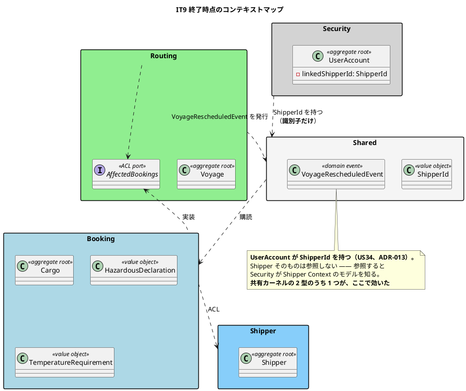
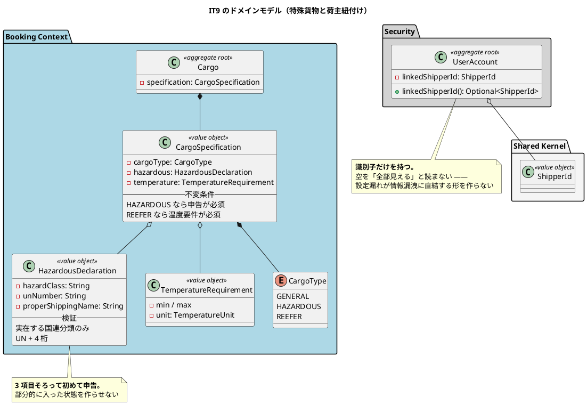

# 第 10 章：IT9 荷主セルフサービスと特殊貨物

## このイテレーションのゴール

**荷主が自分の貨物を自分で見られるようにし、特殊貨物を正しく預かり、変わったスケジュールを追える状態にする。**

このイテレーションは、**7 イテレーション積み上がった制約に決着をつける回**です。

### このイテレーション終了時点のコンテキストマップ



## 扱うユーザーストーリー

| ID | ストーリー | SP | 備考 |
| :--- | :--- | ---: | :--- |
| US34 | 荷主が自社の予約を照会する | 3 | 絞り込みは SQL。紐付けの無い荷主は 0 件。他社の予約は 404 |
| US05 | 危険物・冷凍貨物の予約を登録する | 3 | 申告の無い危険物は登録できない |
| US25 | 既存航海スケジュールを更新する | 2 | 差分確認・楽観的ロック・出港済み区間の保護 |
| | **合計** | **8** | |

## 前イテレーションからの引き継ぎ

**IT2 から 7 イテレーション積み上がった制約**があります。

> 貨物予約一覧を荷主に開放したとき、利用者アカウントと荷主を結びつける手段が無く他社の予約まで見えていた。**以来 4 か所で「US34 で紐付けを作ってから開放する」と書き続けてきた。**

US34 でその紐付けを作り、予約一覧を開放します。

## 実装

### 利用者アカウントと荷主を結びつける

```java
/**
 * 紐づく荷主（US34）。<strong>社内利用者では {@code null}</strong>。
 *
 * <p><strong>持つのは識別子だけである。</strong> {@code Shipper} を参照すると
 * Security が Shipper Context のモデルを知ることになる（ADR-005）。
 * {@code ShipperId} は共有カーネルであり、参照してよい 2 つの型のうちの 1 つである。
 */
private final ShipperId linkedShipperId;
```

そして、`Optional` で返すときの読み方を明示しています。

```java
/**
 * 紐づく荷主（US34）。<strong>社内利用者では空</strong>。
 *
 * <p><strong>空を「全部見える」と読まない。</strong> 荷主ロールで紐付けが無い場合は
 * 1 件も見えないのが正しい。**設定漏れが情報漏洩に直結する形を作らない。**
 */
public Optional<ShipperId> linkedShipperId() {
    return Optional.ofNullable(linkedShipperId);
}
```

**「空」の意味を間違えると情報漏洩になります。** `null` を「絞り込み条件なし」と解釈する実装は自然に書けてしまい、そのとき荷主は全社の予約を見ます。**設定漏れが安全側に倒れる**ように、空は 0 件と決めました。

### 紐付けができても、開けてよいとは限らない

このイテレーションで、もう 1 つ決着がついたことがあります。

> **同時に、追跡番号の末尾 4 桁検索は「開かない」と決めた** — **紐付けができたことは開放してよいという意味ではない。**

7 イテレーション「US34 ができたら」と書き続けた項目のうち、**1 つは「作らない」で決着**しました。ふりかえりも Keep として記録しています。

> **K4. 積み残しに「開かない」という決着をつけた**

**積み残しの決着は「実装する」だけではありません。** 「やらない」と決めて名前で記録すれば、それも決着です。決着させないまま残ると、毎イテレーション繰り越されて固定化します。

### 設計にあってスキーマに無い状態

US05（危険物・冷凍貨物）の実装で、**IT1 から 8 イテレーション残っていた乖離**が見つかります。

> **設計にあってスキーマに無い状態を解消した。** 危険物・温度管理の 6 列は `data-model.md` に IT1 から定義されていたが、**マイグレーションに存在しなかった。**

第 3 章で見た「テーブルはあるのに列が無い」の再発です。**序盤にデータモデルを引くアプローチの代償が、8 イテレーション後にもう一度現れました。**

`V21__cargo_special_handling.sql` で列を追加し、種別と申告の整合をドメインで守るようにします。

### 「入っている」だけでは申告にならない

危険物申告の値オブジェクトは、このプロジェクトで最も踏み込んだ検証を持ちます。

```java
/**
 * 危険物申告（US05）。
 *
 * <p><strong>3 項目そろって初めて申告である。</strong> どれか 1 つでも欠けると
 * 法的要件を満たさず、**申告の無い危険物を預かった**のと変わらない。
 * 部分的に入った状態を作らせないため、値オブジェクトとしてひと組で持つ。
 *
 * <p><strong>「入っている」だけでは申告にならない。</strong> 危険物クラスと UN 番号は
 * 輸送書類にそのまま載る。存在しないクラスや桁の欠けた番号を書いた書類は、
 * <strong>申告が無いのと同じ結果</strong>（積み込み拒否・税関で止まる）になる。
 */
public record HazardousDeclaration(
        String hazardClass, String unNumber, String properShippingName) {

    /**
     * 国連分類のクラスと区分（実在するものだけ）。
     *
     * <p><strong>正規表現で「数字.数字」を通さない。</strong> {@code 3.9} は形は
     * それらしいが存在しない。<strong>存在しないクラスを書いた輸送書類は、
     * 申告が無いのと同じ結果になる。</strong>
     */
    private static final java.util.Set<String> HAZARD_CLASSES = java.util.Set.of(
            "1", "1.1", "1.2", "1.3", "1.4", "1.5", "1.6",
            "2", "2.1", "2.2", "2.3",
            "3",
            "4", "4.1", "4.2", "4.3",
            "5", "5.1", "5.2",
            "6", "6.1", "6.2",
            "7", "8", "9");

    /** UN 番号は {@code UN} ＋ 4 桁。**桁が欠けた番号は別の物質を指す。** */
    private static final java.util.regex.Pattern UN_NUMBER =
            java.util.regex.Pattern.compile("UN\\d{4}");
```

**正規表現ではなく列挙にしている**点が判断です。`\d(\.\d)?` は形式としては正しく見えますが、`3.9` という存在しないクラスを通します。**業務のドメイン知識（国連分類に何が実在するか）を、そのまま集合として持ちました。**

「形式が正しい」と「業務上正しい」の差を、値オブジェクトが埋めています。

### このイテレーションのドメインモデル



## DDD の観点

### 戦略的 DDD

**共有カーネルに `ShipperId` を置いた判断（ADR-005・IT1）が、8 イテレーション後に効きました。**

Security が「この利用者はどの荷主か」を持つ必要が出たとき、選択肢は 3 つありました。

| 案 | 評価 |
| :--- | :--- |
| `Shipper` を参照する | **不可**。Security が Shipper Context のモデルを知る |
| ACL ポートで問い合わせる | 可能だが、認証のたびに越境が発生する |
| **`ShipperId` を持つ** | **採用**。共有カーネルの型であり、参照してよい |

共有カーネルを 2 型に絞ったことで、**「共有してよいもの」がはっきりしていた**わけです。識別子だけを共有し、モデルは共有しない。ADR-013 として記録されています。

もう 1 つ、Routing → Booking の ACL ポート（`AffectedBookings`）が増えています。運航変更が影響する予約の件数を知るためです。**問い合わせなので同期**、既存の Routing → Booking の向きに沿うため**循環は増えません**。ADR-012 の規律「逆向きのポートを足す前に順方向を疑う」が働いています。

### 戦術的 DDD

| 道具立て | このイテレーションでの現れ方 |
| :--- | :--- |
| **業務知識を持つ値オブジェクト** | `HazardousDeclaration`（実在する国連分類の集合を持つ） |
| 条件付き必須 | `CargoType` と申告・温度要件の整合 |
| 楽観的ロック | `Voyage` の更新（US25） |
| **不変条件の保護** | 出港済み区間は変更できない |

`HazardousDeclaration` は **値オブジェクトがドメイン知識の置き場になる**ことを示す好例です。「危険物クラスとして何が実在するか」は業務知識であり、フォームのバリデーションでも DB の制約でもなく、ドメインの型が持ちます。

US25（スケジュール更新）では、**変更してはいけない部分を守る**という戦術が入ります。出港済みの区間を書き換えられると、既に起きた事実が後から変わります。集約が拒否します。

### ユビキタス言語

**「申告」ということばが、このイテレーションで厳密に定義されました。**

日常語の「申告」は「入力されている」程度の意味に流れがちです。実装は違う定義を採ります。

> **3 項目そろって初めて申告である。** どれか 1 つでも欠けると法的要件を満たさず、**申告の無い危険物を預かった**のと変わらない。
>
> **「入っている」だけでは申告にならない。**

**業務のことばを、業務の結果（積み込み拒否・税関で止まる）から定義しています。** ユビキタス言語の精度は、こうやって上がります。

一方、ふりかえりが挙げた問題にも、ことばに関するものがあります。

> **P3. ドキュメントが実装より先に「そうなっている」と書いた**
>
> **P4. 認可の宣言が意図より広く一致した**

P4 は、Spring Security のパスパターンが意図より広い範囲にマッチしていたというものです。**「宣言」が意図を正確に表していなかった**わけで、設定もまたユビキタス言語の一部だという例です。

## 設計判断

| 判断 | 内容 |
| :--- | :--- |
| **ADR-013** | `UserAccount` は `ShipperId` だけを持つ。`Shipper` は参照しない |
| 空の紐付けは 0 件と読む | 設定漏れが情報漏洩に直結する形を作らない |
| 追跡番号の末尾 4 桁検索は開かない | 紐付けができたことは開放してよいという意味ではない |
| 危険物クラスは実在する値の集合で検査する | 正規表現は存在しないクラスを通す |

## このイテレーションの学び

8SP を完了（9 イテレーション連続 100%）。成果は 3 つと記録されています。

3 つ目が重要です。

> **「全緑」が到達点ではないことを 3 つの独立した経路が示した。** テスト 926 件・E2E 8 本・静的解析すべてが緑の状態から、**安全装置の破壊検証が 2 件、E2E とキャプチャ生成が 5 件、レビュー 5 視点が 9 件**の欠陥を出した。**合計 16 件はすべてクローズ前に解消した。**

**同じコードに 3 つの違う見方を当てると、違うものが見つかります。** 単体テストが緑であることは、そのコードが正しいことの一部の証拠にすぎません。

そのうち最も重い問題が、ドメインの守りの検証範囲でした。

> **P1. 集約の守りを単体で固定し、画面から踏んだときを確かめなかった**

集約が例外を投げることは単体テストで確認しましたが、**その例外が画面でどう見えるか**（500 エラーになっていないか）を確認していませんでした。**集約の単体テストは、利用者から見た壊れ方を判別しません。**

以降、「ドメインの `throw` には画面から踏むテストを対にする」が Try として定着します（IT10 の K4）。

もう 1 つ、繰り返し現れる問題も記録されています。

> **P7. 「余力次第」の返済枠が今回も繰り越された**

時間で確保した返済枠は完済されている一方、「余力次第」にした枠は繰り越されました。**IT2 で得た教訓（余力次第の枠は固定化する）が、範囲を限定して再発しています。**

---

- 前: [第 9 章：IT8 うまくいかなかったときを扱う](09-iteration-08.md)
- 次: [第 11 章：IT10 遅延・破損・紛失の例外処理](11-iteration-10.md)
