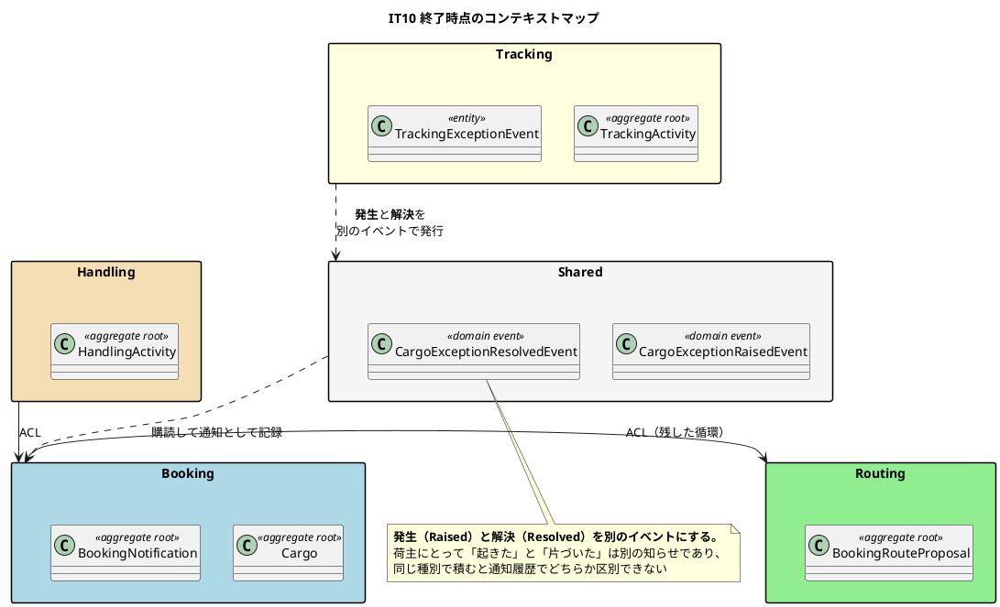
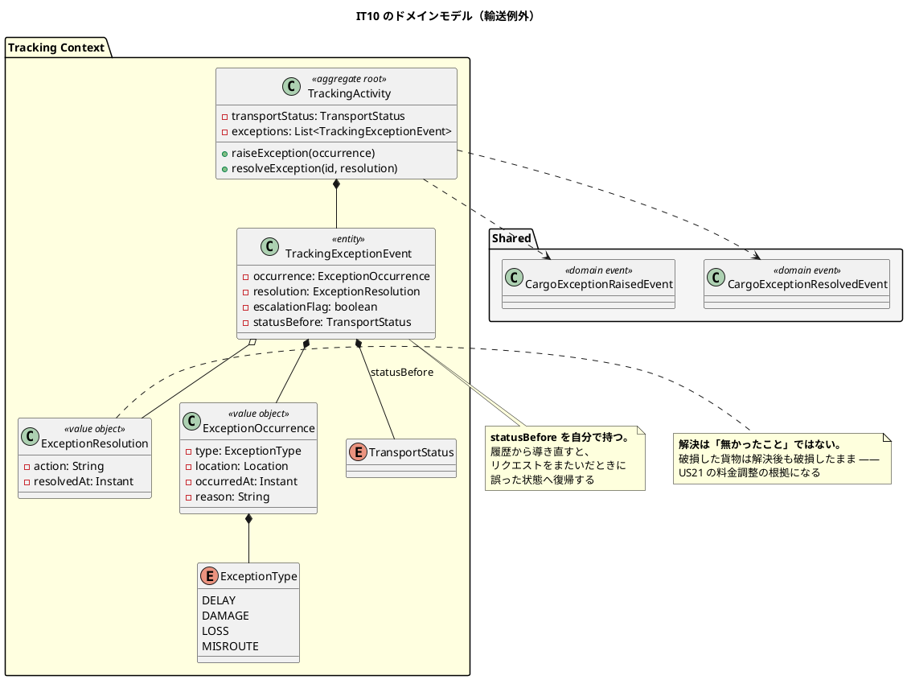
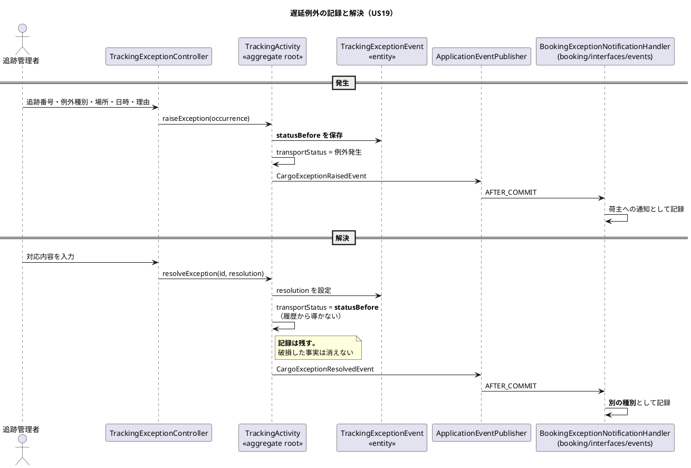

# 第 11 章：IT10 遅延・破損・紛失の例外処理

## このイテレーションのゴール

**輸送が計画どおりに進まなくなったとき、その事実を記録し、荷主に伝え、対応を追える状態にする。**

完了報告の書き出しがこのイテレーションを言い当てています。

> これまでの 9 イテレーションが作ってきたのは「うまくいく道」である。予約し、経路を割り当て、確定し、追跡番号を発行し、荷役を記録し、引き取る。IT10 で扱ったのは**その道から外れたとき** — 遅延・破損・紛失であり、**これらは国際輸送では日常的に起きる**。

### このイテレーション終了時点のコンテキストマップ



## 扱うユーザーストーリー

| ID | ストーリー | SP | 状態 |
| :--- | :--- | ---: | :--- |
| US19 | 遅延例外を処理する | 5 | 完了（受入基準 5 項目中 4 項目） |
| US20 | 破損・紛失例外を処理する | 5 | 完了（受入基準 5 項目すべて） |
| | **合計** | **10** | **初めての 10SP** |

10SP は「8SP が過小だった」ことを意味しません。**計画に先に書いた順序どおり、返済項目 1 件を落として達成しています。**

## 前イテレーションからの引き継ぎ

**返済枠 9 件をイテレーション序盤の 5 コミットで完済**しました。うち 1 件が印象的です。

> とくに C17（`data-model.md` の列が実スキーマにあるかの検査）は、**有効化した時点で 12 件の乖離を出した**。人が気づくのを 9 イテレーション待っていた乖離を、**機械が 1 回で見つけている**。

第 10 章で扱った「設計にあってスキーマに無い」問題（危険物の 6 列）は、人が偶然見つけたものでした。**検査に落とした瞬間、同種の乖離が 12 件出ました。**

## 実装

### 発生前の状態を、自分で持つ

例外が解決したとき、輸送状態は「例外発生前の状態」に戻ります。素直に実装すると、荷役イベントの履歴から導き直すことになります。

**そうしませんでした。**

```java
/**
 * 例外の発生と解決の記録（US19 / US20）。{@link TrackingActivity} の内部エンティティ。
 *
 * <p><strong>発生前の輸送状態を自分で持つ。</strong> 解決したときに戻る先を
 * 荷役イベントの履歴から導き直すと、ユニットテストが緑でも
 * <strong>リクエストをまたいだときに誤った状態へ復帰する</strong>
 * （{@code data-model.md} の {@code status_before} の注記）。
 *
 * <p><strong>解決は「無かったこと」ではない。</strong> 破損した貨物は解決後も
 * 破損したままであり、その事実は US21 の料金調整の根拠になる。
 * 解決が意味するのは<strong>対応が済んだこと</strong>だけである。
 */
public class TrackingExceptionEvent {

    private final long id;
    private final ExceptionOccurrence occurrence;
    private final boolean escalationFlag;
    private final TransportStatus statusBefore;
```

**第 2 章の `UserAccount`（ロック状態を持つ）と同じ判断です。** 履歴から再導出できるように見える状態でも、**それが不変条件に関わるなら永続化する**。

ふりかえりも Keep として記録しています。

> **K3. 発生前の状態を永続化する判断**

そしてもう 1 つ、**解決の意味を定義しています**。

> **解決は「無かったこと」ではない。** 破損した貨物は解決後も破損したままであり、その事実は US21 の料金調整の根拠になる。

これは 3 イテレーション後の Billing（第 14 章）で実際に使われます。**記録を消さない判断が、後のストーリーの前提になっています。**

### 発生と解決を別のイベントにする

```java
/**
 * 貨物の例外に対応が済んだ（US19「対応報告を送信できる」/ US20）。
 *
 * <p><strong>発生（{@link CargoExceptionRaisedEvent}）と分ける。</strong>
 * 荷主にとって「起きた」と「片づいた」は別の知らせであり、同じ種別で積むと
 * 通知履歴でどちらなのか区別できない。
 */
```

`CargoExceptionEvent(type, resolved: boolean)` という 1 つのイベントにまとめる設計も可能でした。**荷主から見て別の知らせなら、別のイベントにします。** 購読側がフラグで分岐する形にすると、通知履歴の一覧で区別できません。

イベントの設計は、**購読側が何をするかではなく、業務上どんな事実が起きたか**で決めます。

### ドメインの守りに、画面から踏むテストを対にする

IT9 の問題（集約の守りを単体で固定し、画面から踏んだときを確かめなかった）への対応が、このイテレーションで実行されました。

> **K4. ドメインの `throw` に画面から踏むテストを対にした（Try T1 の実行）**

集約が例外を投げるパスすべてに、**画面から同じ操作をして 500 にならないことを確かめるテスト**を対で置きます。ドメインの守りは、利用者から見て「拒否された」と分かる形で現れなければ、守っていることになりません。

### このイテレーションのドメインモデル



### 例外の発生から解決までの流れ



## DDD の観点

### 戦略的 DDD

**BC は増えず、境界も動きません。** イベントが 2 つ増えただけです。

戦略的に見るべきは、**イベントの粒度をどう決めたか**です。

| 選択肢 | 評価 |
| :--- | :--- |
| `CargoExceptionEvent(type, resolved)` 1 種類 | 購読側がフラグで分岐する。**通知履歴で区別できない** |
| **`Raised` と `Resolved` の 2 種類** | **採用**。業務上、別の知らせだから |

DDD のドメインイベントは「業務上意味のある出来事」を表します。**「例外に関する何かが起きた」は業務の出来事ではありません。** 「遅延が発生した」「遅延への対応が済んだ」が出来事です。

イベントの数を減らそうとすると、購読側にフラグの分岐が生まれ、**イベントが命令の運搬に近づきます**（第 7 章の「事実を運び命令を運ばない」の裏返し）。

### 戦術的 DDD

| 道具立て | このイテレーションでの現れ方 |
| :--- | :--- |
| **集約内部のエンティティ** | `TrackingExceptionEvent`（`TrackingActivity` の中） |
| 値オブジェクト | `ExceptionOccurrence` / `ExceptionResolution` / `ExceptionType` |
| **状態の永続化** | `statusBefore` を導出せず持つ |
| ドメインイベント | `CargoExceptionRaisedEvent` / `CargoExceptionResolvedEvent` |

`TrackingExceptionEvent` が**エンティティ**であることに注意してください。同じ内容の例外が 2 件あっても別物であり、解決の対象として一意に指せる必要があります。集約ルート `TrackingActivity` の外から直接触ることはできません。

**「導出できるものは持たない」の例外**がここにあります。第 4 章では `Voyage.origin()` を導出にしました。今回は `statusBefore` を持ちます。**基準は「導出元が変わりうるか」**です。`Schedule` は不変なので端点は安全に導出できますが、荷役の履歴は後から増えます。

### ユビキタス言語

**「解決」ということばを、業務の意味に合わせて定義した回**です。

日常語の「解決」は「問題が無くなった」ことを含意します。実装の定義は違います。

> **解決は「無かったこと」ではない。** 破損した貨物は解決後も破損したままであり、その事実は US21 の料金調整の根拠になる。**解決が意味するのは対応が済んだことだけである。**

この定義は、3 イテレーション後の Billing で料金調整の根拠として実際に参照されます。**ことばを正確に定義しておくと、後のストーリーで前提として使えます。**

一方、荷主が読む文面のことばでは失敗しています（IT11 で発覚）。

> **P4. 荷主が読む文面に「発生場所: null」が出ていた**

**利用者が読む文字列は、ユビキタス言語の最終的な出力**です。ドメインのことばがどれだけ正確でも、画面に `null` が出れば、利用者にとってのことばは壊れています。

## 設計判断

| 判断 | 内容 |
| :--- | :--- |
| 例外発生前の状態を永続化する | 履歴から導き直すとリクエストをまたいだとき誤る |
| 解決しても記録を残す | 破損の事実は料金調整の根拠になる |
| 発生と解決を別のイベントにする | 荷主にとって別の知らせ |

## このイテレーションの学び

初めての 10SP。**返済枠 9 件をイテレーション序盤の 5 コミットで完済。** そして最も重要な事実が完了報告に太字で書かれています。

> **安全装置 10 件を破壊検証し、全件が赤になった。それでもレビューは高優先度の欠陥を 10 件見つけた。壊れていた装置のうち 3 つは、破壊検証のリストに載せなかったものである。**

ふりかえりの P1 がこれです。

> **P1. 破壊検証を 10 件やって全件赤だったのに、検証しなかった装置が 3 つ壊れていた**

**破壊検証の網羅性が、自分でリストを作ることに依存していました。** 自分が「守れている」と思っている装置しかリストに載りません。

対策の Try は「**破壊検証のリストを自分で作らない**」です。次のイテレーションで機械的に数え上げる方式に変え、**結果が正反対になります**（第 12 章）。

他にも、繰り返しの形が記録されています。

| 問題 | 内容 |
| :--- | :--- |
| **P2. 「無いこと」だけを見るアサート** | 期待するものが出ることを確かめていない。**何も動かなくても緑になる** |
| **P3. 自分で書いた教訓を、書いた本人が同じ IT の中で繰り返した** | |
| **P5. 業務の現実に合わない制約を入れた** | 「未解決の例外は 1 件まで」。遅延と破損は同時に起きる |
| **P6. 「送った」を記録で満たす判断が、読む手段まで届いていなかった** | 通知を記録したが、荷主が読む画面が無い |

P5 と P6 は、どちらも**業務の現実**に関する問題です。技術的には正しく、テストも緑で、**業務では成り立ちません**。「毎朝どう使うか」から確かめる観点が、以降さらに重視されます。

---

- 前: [第 10 章：IT9 荷主セルフサービスと特殊貨物](10-iteration-09.md)
- 次: [第 12 章：IT11 誤配の再設計と通関申告](12-iteration-11.md)
