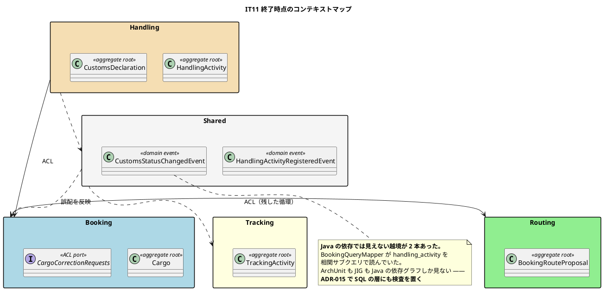
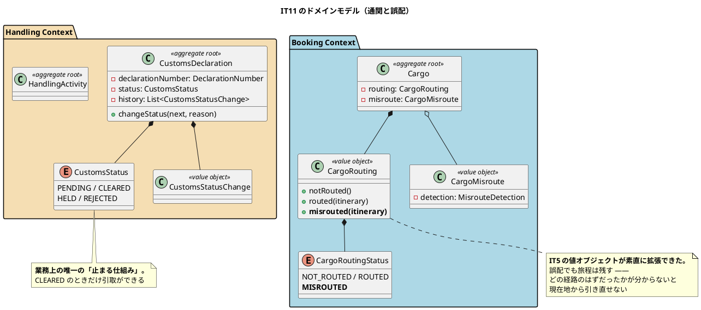

# 第 12 章：IT11 誤配の再設計と通関申告

## このイテレーションのゴール

**貨物が予定と違う場所へ行ってしまったときに組み直せるようにし、通関という「止まる仕組み」を業務に載せる。**

> IT10 が作ったのは「予定どおり進まなくなったことを記録して伝える」までで、IT11 が足したのは**その先**である。誤配は記録して終わりではなく**現在地から引き直さないと貨物は動かない**。通関は**下りるまで引き渡してはならない、業務上の唯一の「止まる仕組み」**である。

そしてこのイテレーションは、**検査をすり抜けた越境が見つかる回**でもあります（ADR-015）。

### このイテレーション終了時点のコンテキストマップ



## 扱うユーザーストーリー

| ID | ストーリー | SP | 状態 |
| :--- | :--- | ---: | :--- |
| US29 | 通関申告を登録・管理する | 5 | 完了（受入基準 8 項目すべて） |
| US28 | 誤配を検知して経路を再設計する | 5 | 完了（8 項目中 7 項目 + 1 項目が部分的） |
| | **合計** | **10** | **2 回続けて 10SP。今回は何も落としていない** |

計画は **US29 → US28** の順に進めています。IT10 とは逆に、**骨格ではなく「制約の少ないほう」を先に置く**という判断です。

## 前イテレーションからの引き継ぎ

**返済枠 7 件を序盤の 7 コミットで完済**（5 イテレーション連続）。うち 1 件は返済ではなく **IT10 で唯一残した受入基準の未達**で、ここで解消しています。

そして IT10 の Try T1（破壊検証のリストを自分で作らない）を実行します。

## 実装

### 通関は「止まる仕組み」

```java
/**
 * 通関状態（US29。{@code domain-model.md}）。
 *
 * <p><strong>通関は業務上の唯一の「止まる仕組み」である。</strong> 誤配も荷受人違いも
 * 「起きた事実」として記録するが、<strong>通関前の引き渡しは実行してはならない</strong>。
 */
public enum CustomsStatus {

    /** 審査中。申告を出した直後の状態。 */
    PENDING("審査中"),

    /** 通関済。**この状態でのみ引取ができる。** */
    CLEARED("通関済"),

    /** 留置。書類不備・検査などで税関に止められている。**保管料が発生する。** */
    HELD("留置"),

    /** 不可。通関が認められなかった。 */
    REJECTED("不可");
```

このシステムでは、ほとんどの異常は **記録するが止めません**。誤配も、荷受人違いも、事実として残して業務を進めます。**通関だけが例外**です。

**「何を止めて、何を止めないか」は業務の判断であり、その理由を型のドキュメントに書いています。** 各状態のコメントも業務的です（留置には「保管料が発生する」）。

### 誤配は旅程を残す

第 6 章で見た `CargoRouting` に、3 つ目の状態が加わります。

```java
/**
 * 誤配が確定した状態（US15 / US28）。
 *
 * <p><strong>旅程は残す。</strong> どの経路のはずだったかが分からないと、
 * 現在地からの再設計（US28）ができない。
 */
public static CargoRouting misrouted(CargoItinerary itinerary) {
    return new CargoRouting(CargoRoutingStatus.MISROUTED, itinerary);
}
```

**IT5 で作った値オブジェクトが、6 イテレーション後に素直に拡張できました。** 状態と旅程をひと組にしておいたおかげで、「誤配だが旅程はある」という新しい組み合わせを、不変条件を壊さずに追加できます。

コンパクトコンストラクタの条件（`NOT_ROUTED` 以外なら旅程が必須）は変えていません。

### 検査をすり抜けた越境

このイテレーションで、**ArchUnit を 1 件も破らずに BC 間の結合が増えました**。

> 予約詳細に「誤配を検知した場所と日時」を出すため、`BookingQueryMapper` が `handling_activity` を相関サブクエリで読んだ。**Java のクラスは 1 つも参照していないため、ArchUnit にも JIG にも映らなかった**（どちらも Java の依存グラフしか見ない）。
>
> クローズ前のレビューが指摘するまで、誰も気づかなかった。

「読むだけだから」で済ませられない理由が 3 つ挙げられています。

> - **Handling のテーブルを変えれば Booking の SQL が黙って壊れる。** 壊れるのは実行時であり、コンパイルも ArchUnit も通る
> - ADR-012 が「BC を別モジュールに切り出すとき、動かすのはアダプタだけで済む」と述べた主張は、**SQL の越境があると成立しない**
> - 検査が守っていないものを「守っている」と読む状態そのものが危うい。**ArchUnit が緑であることが、越境していないことの根拠にならない**

### SQL の層に検査を置く（ADR-015）

決定は `MapperTableOwnershipTest` の新設です。

> **`*Mapper.java` のソースを走査し、`FROM` / `JOIN` / `INTO` / `UPDATE` の直後のテーブル名を取り出して、そのマッパーが属する BC の持ち物かどうかを検査する。**

運用の決めごとが 4 つあります。

| 決めごと | 内容 |
| :--- | :--- |
| テーブルの所有 BC の正典 | `data-model.md`。テストはそれを書き写した表を持つ |
| 例外の扱い | 共有マスタ（`location`）と認証（`users` / `user_roles`）はどの BC からも読んでよい |
| やむを得ない越境 | `ALLOWED` に**理由とともに名前で**書く。黙って通さない |
| **フィクスチャの作り方** | **実コードの形で作る。** 「最小の違反例」だけだと、メタテストが緑でも実コードの違反を見逃す |

最後の 1 つは、検査を書くときの一般的な教訓です。相関サブクエリ・複数 JOIN・別名付きといった**実際にあった違反の形**をそのままフィクスチャにします。

さらに、**検査そのものを検査する**メタテストを置いています。

| 検査 | 何を守るか |
| :--- | :--- |
| マッパーは自分の BC のテーブルだけを触る | ADR の主目的 |
| 実コードの形の違反を検出できる | **検査そのものが働くこと** |
| 自分の BC のテーブルは違反にしない | **常に落ちる検査で緑にしない** |

### 名簿方式の弱点

ADR-015 には、後から追記された重要な注記があります。

> **名簿方式は、載っていないものを通すという反転した性質を持つ。** `handling_correction` が IT12 から 3 イテレーション漏れていた。**載せ忘れたものほど検査から漏れる。**

**許可リストで守る検査は、リストに載せ忘れたものを素通りさせます。** IT14 のレビューで「所有表に載っていないテーブルは赤にする」という検査が追加され、IT16 でそのメタテストが置かれました。

### このイテレーションのドメインモデル



## DDD の観点

### 戦略的 DDD

**このイテレーションは、境界の守り方についての章です。**

BC の構成は変わりません。変わったのは **「境界を守る検査が、どの層を見ているか」** という認識です。

| 層 | 検査 | 見ているもの |
| :--- | :--- | :--- |
| Java の型 | ArchUnit ルール 4 | クラスの参照 |
| Java のパッケージ | JIG | パッケージ依存・循環 |
| **SQL** | **`MapperTableOwnershipTest`（新設）** | **マッパーが触るテーブル** |

境界は Java の型システムだけでは守れません。**永続化層は BC の境界を素通りできる**からです。DDD の文脈では「テーブルにも所有 BC がある」という当たり前のことですが、**それを検査に落とすまでは守られていませんでした**。

そして ADR-012 の主張との関係が重要です。「BC を別モジュールに切り出すとき、動かすのはアダプタだけで済む」という設計上の約束は、**SQL の越境が 1 本でもあると成立しません**。**アーキテクチャの主張は、それを支える検査とセットでなければ主張になりません。**

### 戦術的 DDD

| 道具立て | このイテレーションでの現れ方 |
| :--- | :--- |
| 集約ルート | `CustomsDeclaration`（通関申告）・`CorrectionRequest` の前身 |
| **状態機械 ＋ 履歴** | `CustomsStatus` と `CustomsStatusChange` の並び |
| 値オブジェクトの拡張 | `CargoRouting.misrouted(itinerary)` |
| 値オブジェクト | `CargoMisroute` / `MisrouteDetection` / `DeclarationNumber` |

`CustomsDeclaration` は**状態の履歴を持つ集約**です。第 11 章の `TrackingExceptionEvent` と同じく、「今の状態」だけでなく「どう変わってきたか」を持ちます。留置された理由が読めなければ、業務は動きません。

**`CargoRouting` の拡張が、値オブジェクトの設計の良さを証明しています。** 6 イテレーション前に「状態と旅程をひと組で持つ」と決めたことで、新しい状態（誤配）の追加が、ファクトリメソッドを 1 つ足すだけで済みました。もし 2 つのフィールドを別々に持っていたら、`MISROUTED` かつ旅程が `null` という状態を防ぐ検査を、使う側すべてに書くことになります。

### ユビキタス言語

**「誤配」ということばが、状態としてモデルに入りました。**

興味深いのは、**誤配が経路の状態であって輸送の状態ではない**ことです。`CargoRoutingStatus.MISROUTED` であり、`TransportStatus` ではありません。貨物は動いています（輸送中）が、**予定していた経路から外れている**という別の軸の事実です。

**業務のことばを 1 つの軸にまとめず、意味の違う軸を分ける**のは、モデリングの基本的な判断です。

一方、ふりかえりの Problem はことばの精度に関するものが並びます。

> **P1. コメントが実装より強い保証を主張していた（3 件）**
>
> **P3. 「不可」がどこにも波及しなかった**
>
> **P6. マニュアルが実装より先に「保証」を書いた**

P3 が特に業務的です。`CustomsStatus.REJECTED`（不可）という状態を定義しましたが、**その状態になったとき、業務のどこにも影響が出ませんでした**。ことばはモデルに入ったが、**そのことばが意味する結果が実装されていない**わけです。

**列挙子を足すことと、その状態が業務で意味を持つことは別**です。

## 設計判断

| ADR | 決めたこと |
| :--- | :--- |
| **ADR-015** | BC 間の結合は SQL の層でも検査する。マッパーは自分の BC のテーブルだけを触る |

## このイテレーションの学び

10SP を 2 回続けて達成、**今回は何も落としていません**。そして最も重要な事実は、破壊検証の方式を変えた結果です。

> **IT10 の Try T1（破壊検証のリストを自分で作らない）を実行したら、IT10 とは正反対の結果が出た。**
>
> IT10 は「自分で選んだ 10 件が全部赤」で、選ばなかった 3 件が壊れていた。**IT11 は機械的に数え上げた 22 件のうち 3 件が空振りした。**
>
> **選び方を変えたら、見つかるものが変わった。**

| 方式 | 件数 | 結果 |
| :--- | ---: | :--- |
| 自分でリストを作る（IT10） | 10 | 全件赤。**しかしリスト外の 3 件が壊れていた** |
| 機械的に数え上げる（IT11） | 22 | **3 件が空振り**（＝壊れていた） |

**自分でリストを作ると、守れていると思っているものしか載りません。** 機械的に数え上げると、確かめようと思わなかったものが混ざります。

もう 1 つ、検査についての Keep が印象的です。

> **K3. 検査が、指摘より多くの越境を見つけた（C28 / ADR-015）**

レビューは 1 件の越境を指摘しました。**検査を書いて走らせたら、指摘より多くの越境が見つかりました。** 人の目は 1 件を見つけ、検査は全件を見つけます。

そして「やらなかったこと」の扱いも記録されています。

> **K2. やらなかったものを名前で記録した**

第 10 章の「開かないと決めた」と同じです。**やらない判断も、名前をつければ決着です。**

---

- 前: [第 11 章：IT10 遅延・破損・紛失の例外処理](11-iteration-10.md)
- 次: [第 13 章：IT12 引取確認コードと引取記録の訂正](13-iteration-12.md)
