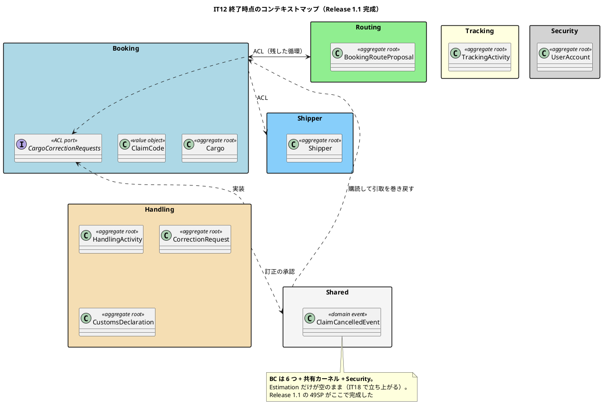
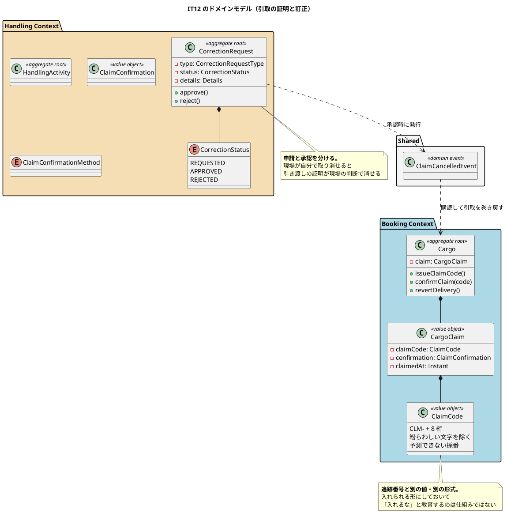
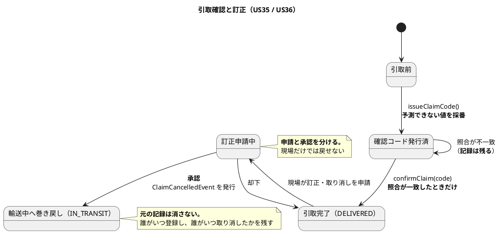

# 第 13 章：IT12 引取確認コードと引取記録の訂正

## このイテレーションのゴール

**「渡した」「受け取っていない」の争いに、システムが答えられるようにする。**

**IT12 で Release 1.1（49SP）が完成**します。そしてこのイテレーションは、**5〜6 イテレーション前の引き継ぎを回収する回**です。

| ストーリー | いつ起票されたか |
| :--- | :--- |
| US35（引取確認コード） | **IT7** の「記録はできるが証明にならない」判定から 5 イテレーション後 |
| US36（引取記録の訂正） | **IT6** のレビュー H11 が US 化を求めてから 6 イテレーション後 |

### このイテレーション終了時点のコンテキストマップ



## 扱うユーザーストーリー

| ID | ストーリー | SP | 受入基準 |
| :--- | :--- | ---: | :--- |
| US35 | 引取確認コードを採番して照合する | 3 | 5/5 |
| US36 | 引取記録を訂正・取り消しする | 2 | 5/5 |
| | **合計** | **5** | |

**返済枠がストーリー本体と同じ規模（27h / 30h）**でしたが、8 タスク 12 件をすべて返し、1 つも落としていません。3 イテレーション繰り越していた項目にも決着がつきました。

## 実装

### 記録を証明に変える

IT7 の引取記録は、提示された確認コードをそのまま書き写すだけでした。照合する相手がシステムの中にありません。

```java
/**
 * 引取確認コード（US35）。
 *
 * <p>IT7 の引取記録は<strong>提示された値をそのまま書き写すだけ</strong>で、
 * 照合する相手がシステムの中に無かった。<strong>記録はできるが証明にならない。</strong>
 *
 * <p><strong>追跡番号とは別の値である。</strong> 追跡番号は荷主が取引先へ転送する
 * ことを前提にした「合鍵」であり（公開追跡は認証を持たない相手に見せる）、
 * <strong>それを知っているだけで引き取れてはならない</strong>。
 *
 * <p><strong>形式も別にする。</strong> {@code TRK-} に似せると、現場が取り違えて
 * 追跡番号を入力する。<strong>入れられる形にしておいて「入れるな」と教育するのは、
 * 仕組みではない。</strong>
 *
 * <p><strong>採番は予測できない値にする。</strong> 追跡番号は日付＋連番であり
 * 推測できる形をしている。同じ作り方にすると、1 つ知るだけで隣の貨物も引き取れる。
 */
public record ClaimCode(String value) {

    /** {@code CLM-} ＋ 8 桁（数字と大文字）。**追跡番号と見分けがつく形にする。** */
    private static final java.util.regex.Pattern FORMAT =
            java.util.regex.Pattern.compile("CLM-[0-9A-Z]{8}");

    /** 採番に使う文字。**紛らわしい文字を外す** — 電話・紙で伝わる値である。 */
    private static final String ALPHABET = "23456789ABCDEFGHJKLMNPQRSTUVWXYZ";

    private static final int LENGTH = 8;
```

この値オブジェクトには、**4 つの独立した判断**が入っています。

| 判断 | 理由 |
| :--- | :--- |
| 追跡番号と別の値にする | 追跡番号は転送される前提の「合鍵」。知っているだけで引き取れてはならない |
| **形式も別にする** | `TRK-` に似せると現場が取り違える。**入れられる形にして「入れるな」と教育するのは仕組みではない** |
| 予測できない採番にする | 日付＋連番だと 1 つ知れば隣も引き取れる |
| **紛らわしい文字を外す** | `0` / `O` / `1` / `I` を除く。**電話・紙で伝わる値である** |

最後の 1 つが、業務システムらしい判断です。この値は画面だけで完結せず、**電話で読み上げられ、紙に印刷され、手で入力されます**。その物理的な現実が、アルファベットの選択に現れています。

### 申請と承認を分ける

US36（引取記録の訂正・取り消し）は、権限の設計そのものです。

```java
/**
 * 引取記録の訂正・取り消し申請（US36）。
 *
 * <p>引取は輸送の終点であり、<strong>誤登録をそのままにすると貨物が届いていないのに
 * 配送完了として扱われる</strong>。
 *
 * <p><strong>申請と承認を分ける。</strong> 現場が自分で取り消せると、
 * 引き渡しの証明（US35）が現場の判断で消せることになる。
 *
 * <p><strong>元の記録は消さない。</strong> 誰がいつ何を登録し、誰がいつ取り消したかが
 * 読めなくなると、事故時に経緯を追えない。
 */
public class CorrectionRequest {
```

**同じイテレーションで作った証明（US35）を、同じイテレーションで壊さない**ための設計です。現場が自分で取り消せるなら、確認コードの照合には意味がありません。

そして**元の記録は消しません**。訂正は上書きではなく、新しい事実の追加です。

### Checkstyle が設計の合図を出す

`CorrectionRequest` の内部レコードに、面白いコメントがあります。

```java
/**
 * 申請の中身（種別・理由・訂正で置き換える値）。
 *
 * <p><strong>ひと組で持つ。</strong> 引数を並べると、13 個目で Checkstyle が
 * 止めた。<strong>制限に当たったのは合図である</strong>
 * （{@code Cargo.reconstruct} で同じ判断をした）。
 */
```

**Checkstyle のパラメータ数上限が、設計の改善を促しました。** 引数が 13 個になるのは「まとまるべきものがまとまっていない」証拠です。制限を緩めるのではなく、**値オブジェクトに切り出す合図として読みました**。

同じ判断が IT6 でも記録されています（ふりかえり K3「Checkstyle のパラメータ数上限が設計の改善を促した」）。**静的解析のルールが、DDD の設計判断のきっかけになる**という関係です。

### このイテレーションのドメインモデル



### 引取と訂正の状態遷移



## DDD の観点

### 戦略的 DDD

**Release 1.1 が完成し、BC の構成が確定しました。** 6 つの BC ＋ 共有カーネル ＋ Security サブドメイン。Estimation だけが `package-info.java` のみの空パッケージのまま残ります（IT18 で立ち上がります）。

このイテレーションで増えた越境は 1 本、Booking → Handling の `CargoCorrectionRequests`（訂正申請の照会）です。**既存の Handling → Booking と逆向き**ですが、状態の伝播は `ClaimCancelledEvent` で行っているため、**ADR-012 の規律に沿っています**。

第 9 章で見た「逆向きのポートを足す前に順方向を疑う」が、6 イテレーション後も守られていることが確認できます。

### 戦術的 DDD

| 道具立て | このイテレーションでの現れ方 |
| :--- | :--- |
| **業務の物理的現実を持つ値オブジェクト** | `ClaimCode`（電話・紙で伝わる） |
| 集約ルート | `CorrectionRequest`（申請と承認の状態機械） |
| 値オブジェクトのひと組 | `CargoClaim`（コード＋確認＋日時） |
| ドメインイベント | `ClaimCancelledEvent` |
| **入れ子レコードによる引数のまとめ** | `CorrectionRequest.Details` |

`ClaimCode` は**値オブジェクトが業務の物理的な文脈を持つ**例です。DDD の値オブジェクトは「値が等しければ同じ」という技術的な性質で説明されがちですが、実際の設計判断は**その値が業務でどう扱われるか**から来ます。

- 電話で読み上げられる → 紛らわしい文字を外す
- 追跡番号と並んで入力される → 形式を別にする
- 引き渡しの証明になる → 予測できない値にする

**3 つとも「値が等しければ同じ」からは導けません。**

### ユビキタス言語

**「証明」ということばが、5 イテレーションかけて実装に届いた回**です。

IT7 の完了報告は「引取確認が**記録はできるが証明にならない**状態で完了とした」と書きました。「記録」と「証明」を区別することばを、そのときに用意しています。

そして IT12 で「照合する相手」を作り、記録が証明になりました。**ことばで差を名指ししておいたから、5 イテレーション後に何を作るべきかが明確だった**わけです。

もう 1 つ、`ClaimCode` の Javadoc の一文が、このプロジェクトの設計哲学を凝縮しています。

> **入れられる形にしておいて「入れるな」と教育するのは、仕組みではない。**

これは値オブジェクトの設計原則そのものです。**「してはいけないこと」を型で不可能にする。** 教育や運用ルールに頼るのは、仕組みを作っていないことと同じだ、という立場です。

一方で、ことばの失敗も記録されています。

> とくに「**訂正を承認しても記録が直らない**」は、**マニュアルが実装より多くを主張していた**形であり、IT11 の Problem がドキュメントで再発した。

**マニュアルが約束したことを、実装が果たしていませんでした。** 第 2 章（IT1）でロック解除を先に約束したのと同じ形が、11 イテレーション後にも起きています。

## 設計判断

| 判断 | 内容 |
| :--- | :--- |
| 確認コードは追跡番号と別の値・別の形式にする | 追跡番号は転送される前提の合鍵 |
| 採番は予測できない値にする | 連番だと 1 つ知れば隣も引き取れる |
| 紛らわしい文字を採番の文字集合から外す | 電話・紙で伝わる値である |
| 訂正は申請と承認を分ける | 証明を現場の判断で消せなくする |
| 元の記録は消さない | 事故時に経緯を追えなくなる |

## このイテレーションの学び

5SP を完了し **Release 1.1（49SP）が完成**。コミット 27 本、返済枠 12 件を完済。

しかし全緑からの発見が 4 イテレーション連続で続きます。

> **クローズ前の自己レビューが高優先度 3 件を見つけた。** 全緑の状態からの発見は **4 イテレーション連続**である。

Keep には検査の成果が並びます。

| Keep | 内容 |
| :--- | :--- |
| **K2. 数え上げてから壊し、作った直後に壊した** | IT11 で確立した方式の継続。**作った直後**に壊すのが追加分 |
| **K3. 検査が、指摘より多くの越境を見つけた** | ADR-015 の `MapperTableOwnershipTest` が働いた |
| **K4. Checkstyle が 3 回、設計の合図を出した** | 引数 13 個・パラメータ数上限 |
| **K5. E2E が、ユニットと統合をすり抜けた欠陥を見つけた** | |

K5 は、テストピラミッドの各層が違うものを見ているという実例です。**ユニットも統合も緑で、E2E だけが落ちる欠陥がある。**

そして次のリリースへの申し送りとして、**Release 2.0（精算）**の準備が始まります。Billing Context は 3 つの ACL ポート（`ShipperDiscountPort` / `TrackingStatusPort` / `BookingSettlementPort`）を新設する、**BC 間の越境が最も多いリリース**になります（第 14 章）。

---

- 前: [第 12 章：IT11 誤配の再設計と通関申告](12-iteration-11.md)
- 次: [第 14 章：IT13 Billing Context の立ち上げと金額の丸め](14-iteration-13.md)
