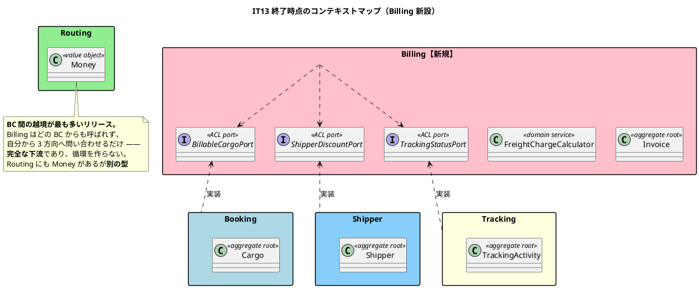
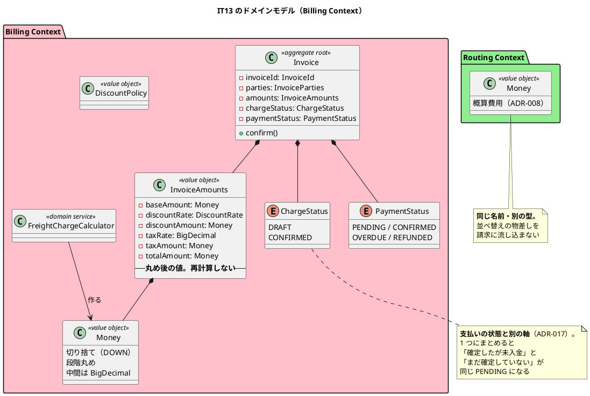
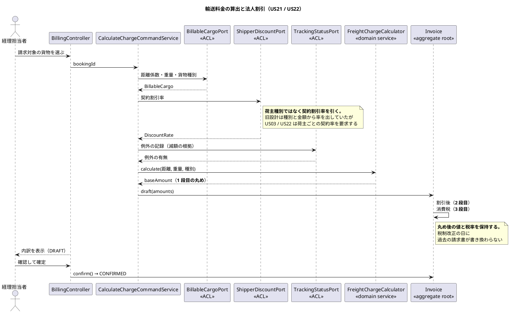

# 第 14 章：IT13 Billing Context の立ち上げと金額の丸め

## このイテレーションのゴール

**「いくら請求するか」をシステムが答えられるようにする。**

> v1.1.0 は予約から引取までを通したが、**その先が無かった**。引取が済んだ貨物は「配送完了」のまま止まり、経理担当者にはダッシュボードのカードすら無かった。

**Release 2.0 の最初のイテレーション**であり、**Billing Context を新規に立ち上げる唯一のリリース**の入口です。

### このイテレーション終了時点のコンテキストマップ



## 扱うユーザーストーリー

| ID | ストーリー | SP |
| :--- | :--- | ---: |
| US21 | 輸送料金を算出する | 3 |
| US22 | 法人割引を適用する | 3 |
| | **合計** | **6** |

## 前イテレーションからの引き継ぎ

局面の選び方について、計画に明示的な判断が書かれています。

> **中盤（IT3〜IT6）と同じ条件なので、同じ選択をする。** 金額の丸めを画面から下ろすと、必ず表示都合（カンマ区切り・切り上げ表示）が規則に混ざる。

**局面の名前ではなく、そのときの条件でアプローチを選ぶ**（ふりかえり K1）。IT13 は「終盤」に位置しますが、業務ルールが主な不確実性なのでインサイドアウトを採ります。

## 実装

### 金額の丸めを仕様として固定する

このイテレーションで最も重要な型が `Money` です。

```java
/**
 * 請求で扱う金額（US21。{@code domain-model.md}「金額の丸め規則」）。
 *
 * <p><strong>金額計算は法的・会計的な争いの対象になりうる。</strong> 丸めの規則と
 * 適用順序を仕様として固定する。順序が決まっていないと、
 * <strong>同じ入力でも実装者によって請求額が変わる</strong>。
 *
 * <table>
 *   <caption>丸め規則</caption>
 *   <tr><td>丸めモード</td><td>切り捨て（{@link RoundingMode#DOWN}）。
 *       <strong>荷主に不利な方向へ丸めない</strong></td></tr>
 *   <tr><td>丸めの単位</td><td>通貨の最小単位。<strong>最小通貨単位の整数で保持する</strong></td></tr>
 *   <tr><td>適用箇所</td><td>基本料金・割引後料金・消費税額の<strong>それぞれで丸める</strong>
 *       （段階丸め）。総額での一括丸めは行わない</td></tr>
 *   <tr><td>中間計算</td><td>丸める直前まで {@code BigDecimal} で保持する。
 *       {@code double} を使わない</td></tr>
 * </table>
 *
 * <p><strong>Routing の {@code Money} とは別の型である。</strong> 概算費用（ADR-008）は
 * 経路候補の並べ替え用であり、請求額ではない。BC をまたいで型を共有すると、
 * <strong>並べ替えの物差しが請求に流れ込む</strong>（ADR-005）。
 */
public record Money(BigDecimal value, String currency) {

    /**
     * 中間計算のスケール。
     *
     * <p><strong>丸める直前までは落とさない。</strong> 途中で丸めると、
     * 段階丸めの各段で二重に丸めたのと同じ結果になる。
     */
    private static final int CALC_SCALE = 10;
```

**丸めモードに理由が書いてあります。** 「切り捨て」は技術的な選択ではなく、**荷主に不利な方向へ丸めない**という業務上の判断です。

そして、**Routing にも `Money` があります**。同じ名前、同じ構造ですが、**別の型**です。第 6 章で見た `CargoRoutingStatus` と同じ判断で、共有すると「並べ替えの物差しが請求に流れ込む」ことになります。

### 設計書の計算例が、規則の必要性を示していなかった

このイテレーションの Keep に、地味ですが重要なものがあります。

> **K2. 設計書の計算例が「順序を決める必要性」を示せないことに気づいた**
>
> 例（100,003 円）では**段階丸めと一括丸めの結果が一致する**。実際にずれる値を探して固定した（**100,007 円で 1 円ずれる**）。

設計ドキュメントは「段階丸めを行う」と定め、計算例を載せていました。**しかしその例では、規則を守らなくても同じ答えになります。**

**「例が規則を説明していても、規則の必要性を示しているとは限らない」**わけです。ずれる値を探してテストに固定しました。

### 概算の式を請求に使わない

第 5 章で見た `FreightEstimator`（概算）と、このイテレーションの `FreightChargeCalculator`（請求）は**別のドメインサービス**です。

```java
/**
 * 基本料金を算出するドメインサービス（US21）。
 *
 * <p><strong>基本料金 = 距離係数 × 重量（kg） × 貨物種別係数</strong>
 * （{@code domain-model.md}「金額の丸め規則」）。
 *
 * <p><strong>ADR-008 の概算式を使わない。</strong> 概算は経路候補の並べ替え用であり、
 * 荷主に見せた瞬間に請求額として読まれるため画面にも出していない
 * （{@code ui_design.md}）。<strong>並べ替えの物差しを請求に使ってはならない。</strong>
 *
 * <p><strong>算出した時点で丸める</strong>（段階丸めの 1 段目）。丸めずに次段へ渡すと、
 * 割引と消費税の丸めが二重にずれる。
 */
public final class FreightChargeCalculator {
```

第 5 章で「ことばが精度の約束をしている」と書きました（`Estimator` と `Calculator`）。**9 イテレーション後、その約束が実際に守られています。**

引数の検証にも業務の意味が入ります。

```java
/**
 * @param distanceFactor 距離係数。<strong>0 は「運んでいない」であり請求できない</strong>
 * @param weightKg       重量（kg）。<strong>0 は入力の誤りである</strong>
 */
```

### 丸め後の値を保持し、再計算しない

```java
/**
 * 精算書が保持する金額のひと組（US21 / US22）。
 *
 * <p>6 つはいずれも<strong>1 回の算出で同時に決まり、確定後は一緒に動かない</strong>。
 * ばらばらに持ち回ると、片方だけを更新した状態が作れてしまう。
 *
 * <p><strong>丸め後の値である。</strong> 再計算で導出しない。税率もここに持つ —
 * <strong>金額だけでは根拠を再現できない</strong>。
 *
 * @param taxRate 消費税率。<strong>税制が変わっても発行済みの根拠が再現できる</strong>
 */
public record InvoiceAmounts(
        Money baseAmount,
        DiscountRate discountRate,
        Money discountAmount,
        BigDecimal taxRate,
        Money taxAmount,
        Money totalAmount) {
```

**税率を請求書ごとに保持する**のが要点です。税率を設定値から読んで再計算する設計だと、**税制改正の日に過去の請求書が書き換わります**。完了報告はこれをテストで固定したと明記しています。

第 4 章では「導出できるものは持たない」（`Voyage.origin()`）、第 11 章では「導出元が変わるなら持つ」（`statusBefore`）と判断しました。ここは 3 例目で、**「過去の事実として固定すべきものは持つ」**です。

### 料金の状態と支払いの状態を分ける（ADR-017）

`Invoice` の状態設計にも判断があります。

> `domain-model.md` の `Invoice` が持つ状態は `PaymentStatus` だけである。これは**支払いの状態**であり、料金そのものの状態ではない。
>
> `PaymentStatus` を流用して料金の確定を表そうとすると、次の 2 つが同じ `PENDING` になる。
>
> - 料金を確定したが、まだ入金されていない
> - 料金がまだ確定していない（経理担当者が確認中）

`ChargeStatus`（DRAFT / CONFIRMED）を別の軸として足しました。**第 12 章の「誤配は経路の状態であって輸送の状態ではない」と同じ形**です。意味の違う軸を 1 つの列挙にまとめません。

### このイテレーションのドメインモデル



### 料金算出の流れ



## DDD の観点

### 戦略的 DDD

**Billing は完全な下流の BC です。** どの BC からも呼ばれず、自分から 3 方向へ問い合わせるだけ。

| ポート | 相手 | 取るもの |
| :--- | :--- | :--- |
| `BillableCargoPort` | Booking | 請求対象の貨物（距離係数・重量・種別） |
| `ShipperDiscountPort` | Shipper | 契約割引率 |
| `TrackingStatusPort` | Tracking | 輸送状態・例外の記録 |

**この構造は循環を作りません。** 一方通行だからです。ADR-012 の規律に照らせば理想的な形で、**BC を後から足すときに、下流として足すのが最も安全**だという実例になっています。

`ShipperDiscountPort` には設計の是正が含まれています。旧設計の `DiscountPolicy.calculateRate(shipperType, amount)` は荷主種別と金額から割引率を算出する形でしたが、**US03 / US22 が要求する「荷主ごとの契約割引率」を参照していませんでした**。第 8 章で作った `CorporateContract` が、6 イテレーション後にここで使われます。

### 戦術的 DDD

| 道具立て | このイテレーションでの現れ方 |
| :--- | :--- |
| **仕様を Javadoc の表で持つ値オブジェクト** | `Money`（丸め規則の 4 項目） |
| **ひと組で持つ値オブジェクト** | `InvoiceAmounts`（6 つの金額と税率） |
| ドメインサービス | `FreightChargeCalculator` |
| 集約ルート | `Invoice` |
| **軸の分離** | `ChargeStatus` と `PaymentStatus` |

`InvoiceAmounts` の Javadoc に、値オブジェクトを作る判断の 3 番目の型が出てきます。

> 6 つはいずれも**1 回の算出で同時に決まり、確定後は一緒に動かない**。ばらばらに持ち回ると、片方だけを更新した状態が作れてしまう。

これまでに出た「ひと組で持つ」の理由を並べると次のようになります。

| 例 | 理由 |
| :--- | :--- |
| `CargoRouting`（IT5） | 片方があるならもう片方もある |
| `CorporateContract`（IT7） | 片方だけでは業務上の意味を成さない |
| `HazardousDeclaration`（IT9） | 3 項目そろって初めて申告 |
| **`InvoiceAmounts`（IT13）** | **同時に決まり、一緒に動く** |

そして `Money` は、**Javadoc に仕様表を持つ**という珍しい形をしています。金額の丸めは法的・会計的な争いの対象になりうるため、「なぜこの丸めか」を型のドキュメントに固定しました。

### ユビキタス言語

**「概算（Estimate）」と「請求（Charge）」の区別が、9 イテレーションを越えて維持されました。**

IT4 で `FreightEstimator` と名づけ、`estimatedCost` というフィールド名にしたことが、IT13 で `FreightChargeCalculator` を**別に作る**判断につながっています。もし IT4 で `FreightCalculator` と名づけていたら、IT13 で「既にあるものを使えばよい」となった可能性が高いはずです。

**名前が、9 イテレーション後の設計判断を守りました。**

一方、ふりかえりが挙げた最も重い問題も、ことばと実装の関係です。

> **P2. 自分で書いた運用要件が実装で成立していなかった**
>
> 「料金調整は例外の記録を見ながら判断する」と書きながら、**経理担当者は予約詳細を開けなかった**。

> **P3. コメントが主張する守りが実在しない形が 3 IT 連続で再発した**

**書いた本人が、3 イテレーション連続で同じ形を作っています。** これが IT16〜IT17 の「整流」局面（第 17・18 章）の直接の動機になります。

## 設計判断

| ADR | 決めたこと |
| :--- | :--- |
| **ADR-016** | 明細テーブルを作らず、料金調整を精算書の列で持つ（第 1 章で触れた `invoice_line_item` の件） |
| **ADR-017** | 料金の状態（`ChargeStatus`）を支払いの状態と分ける |
| — | 丸めは切り捨て・段階丸め・丸め後の値と税率を保持 |
| — | 概算の式（ADR-008）を請求に使わない |

## このイテレーションの学び

6SP を完了。**検査が設計の合図を 11 回出し、すべて回避せず構造を直しました**（K3）。Checkstyle のパラメータ数上限が `InvoiceAmounts` を生んだのがその 1 つです。

しかし全緑からの発見が 5 イテレーション連続です。

> **全緑の状態からレビューが高優先度を 13 件見つけた。5 イテレーション連続である。うち最も重いのは 2 件で、どちらも「作ったつもり」の形だった。**
>
> - **画面に出す金額の内訳が足し算として成立していなかった**（3 視点が独立に指摘）。集約は正しく計算していたが、**表示用の型が計算を作り直していた**
> - 自分で書いた運用要件が実装で成立していなかった

1 つ目が示唆的です。**集約は正しかった。** しかし表示用の View が独自に計算していたため、画面の内訳が合いませんでした。**ドメインが正しいことは、利用者が正しい数字を見ることを保証しません。**

第 3 章で `BookingStatus` について書いた「同じ規則を 2 か所に書くと、必ず片方だけが更新される」が、金額で再現した形です。

---

- 前: [第 13 章：IT12 引取確認コードと引取記録の訂正](13-iteration-12.md)
- 次: [第 15 章：IT14 請求から入金確認までを閉じる](15-iteration-14.md)
