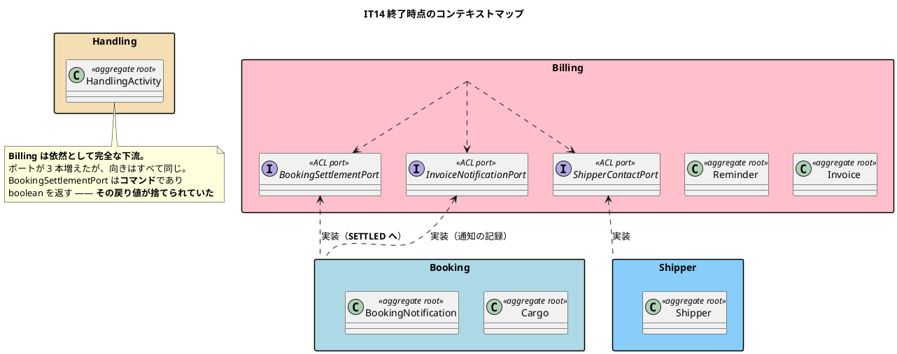
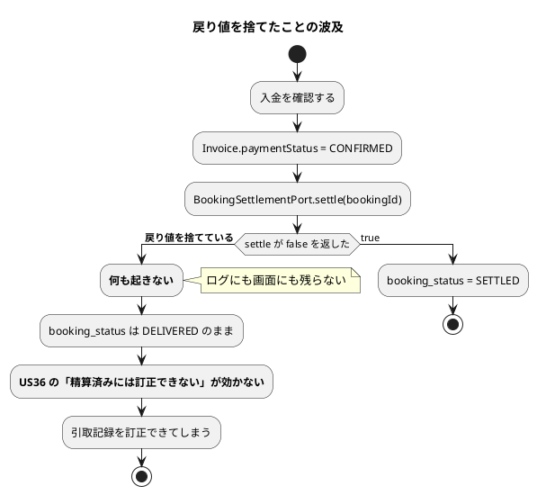
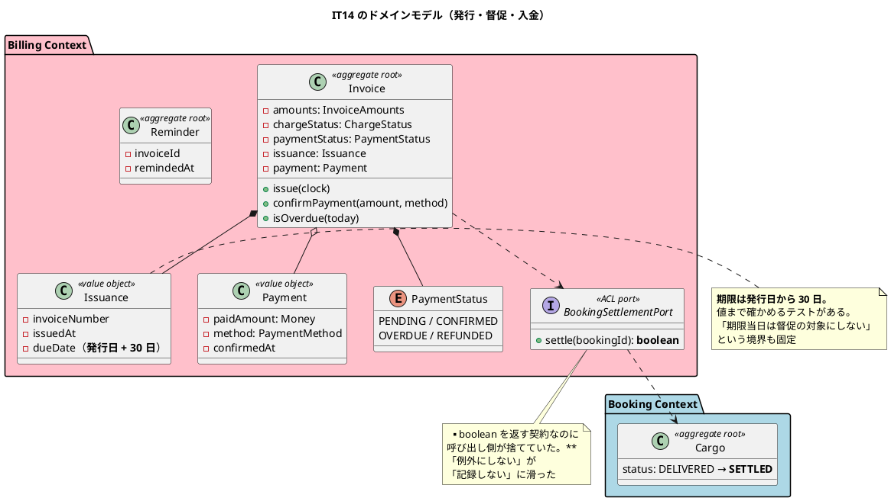
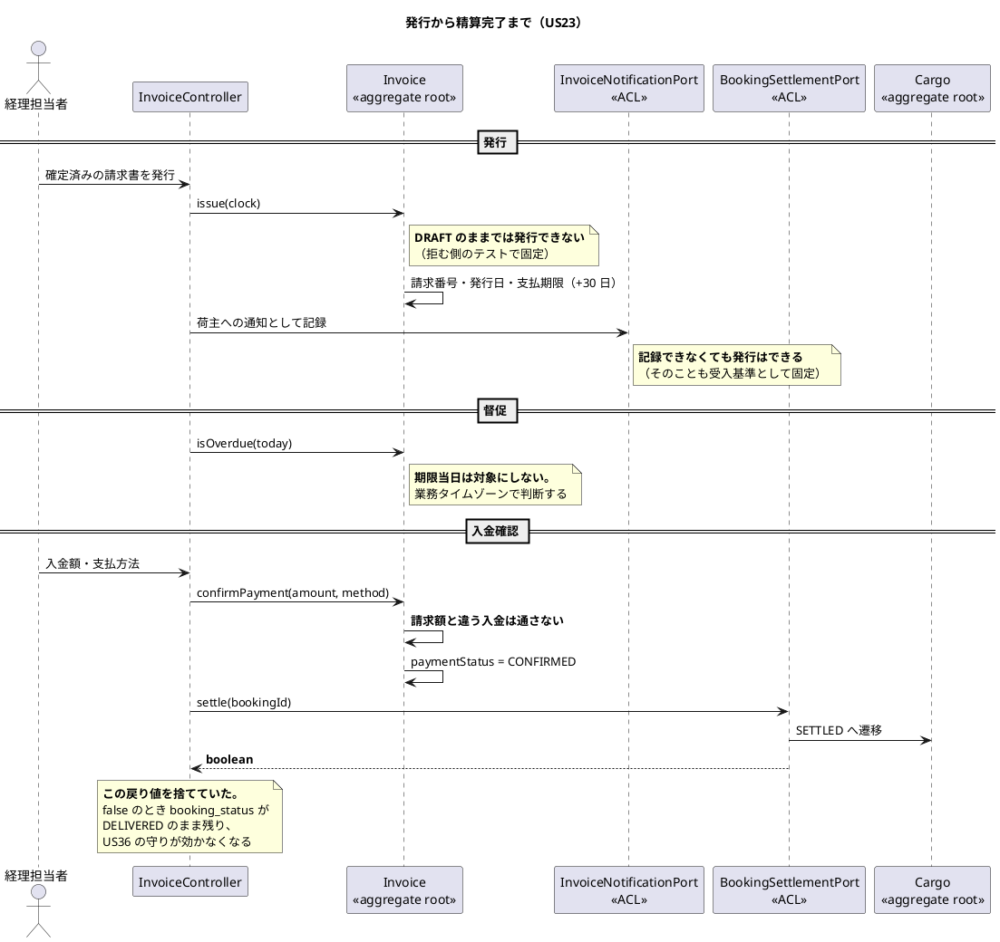

# 第 15 章：IT14 請求から入金確認までを閉じる

## このイテレーションのゴール

**「請求した」で終わらせず、「入金を確認して閉じる」まで通す。**

> 経理担当者は請求対象の確認 → 料金の算出 → 確定 → 請求書の発行 → 督促 → 入金の確認まで、**画面だけで月次の業務を回せる**。

計画は局面の選び方も明示しています。

> **終盤（IT7〜IT12）と同じ条件なので、同じ選択をする。** 業務シナリオ「発行 → 通知 → 入金確認 → 精算完了」を受け入れテストで束ね、そこから内側を埋める（アウトサイドイン）。

### このイテレーション終了時点のコンテキストマップ

## 扱うユーザーストーリー

| ID | ストーリー | SP |
| :--- | :--- | ---: |
| US23 | 精算を処理する | 5 |

## 前イテレーションからの引き継ぎ

**IT13 レビューの返済枠 8 タスク（10 件）を完済**し、IT13 で送った高優先度 4 件に決着をつけました。

| # | 内容 |
| :--- | :--- |
| C1 | 請求対象一覧に引取日（`cargo.claimed_at` を荷役の作業日時から記録） |
| C2 | 請求書一覧に件数と合計（絞り込みに追随） |
| C3 | 請求書詳細に「この貨物の例外」（減額の根拠） |
| C4 | 請求の読み取りの **N+1 を解く**（問い合わせ回数で測る） |
| C6 | **法人判定を割引率から切り離す**（率 0% の法人が個人になっていた） |

C6 が業務的です。**割引率が 0% の法人が、判定上「個人」になっていました。** 第 8 章で `CorporateContract` をひと組にしたのは「割引 0% なのか未設定なのか分からない」を避けるためでしたが、**判定のほうが率を見ていた**わけです。

## 実装

### 受入基準とテストを 1 対 1 で対応させる

このイテレーションの完了報告は、受入基準ごとに**実行したテスト名**を書いています。しかも「拒む側」を必ず対にしています。

| 受入基準 | 実行したテスト |
| :--- | :--- |
| 「確定」状態の輸送料金をもとに精算書を発行できる | `確定から発行して入金を確認すると予約が精算済みになる` ／ **拒む側**: `下書きの請求書は画面からも発行できない` |
| 精算書に請求番号・請求金額・支払い期限が含まれる | 同上 ＋ `支払期限は発行日から三十日後になる`（**値まで確かめる**） |
| 精算書が荷主にメール通知される（ADR-006 により記録） | `発行すると荷主への通知が記録される` ／ **残せない側**: `通知を残せなくても発行はできる` |
| 決済機関との連携により入金確認ができる | `確定から発行して入金を確認すると…` ／ **拒む側**: `請求額と違う入金は画面からも通らない` |
| 支払い期限超過時、経理担当者に未払い通知が送信される | `期限を過ぎた請求書が督促の一覧とカードに出る` ／ **境界**: `期限当日は督促の対象にしない` |

**「できる」を確かめるテストと「できない」を確かめるテストを対にする**運用が、ここで完成しています。第 12 章の Keep「開けないことと開けることを対で書いた」の発展形です。

境界のテスト（`期限当日は督促の対象にしない`）が入っているのも重要です。**「期限を過ぎた」の意味を、日付の境界で固定しています。**

### 「例外にしない」が「記録しない」に滑る

このイテレーション最大の発見が、ふりかえりの P1 です。

> ### P1. 「例外にしない」が「記録しない」に滑っていた（最大の発見）
>
> `settle` / `notifyIssued` はどちらも `boolean` を返す契約なのに、**呼び出し側が戻り値を捨てていた**。結果として「入金確認済みだが予約が `SETTLED` にならなかった請求書」がログにも画面にも残らない。
>
> **US36 の「精算済みには訂正・取り消しできない」は `booking_status` に依存している**ため、この不整合が起きた予約は**精算後も訂正できてしまう**。
>
> 「できなかったことを例外にしない」という判断自体は正しい。**そこから「だから何もしない」へ滑ったこと**が問題で、これは自分では気づけなかった（レビューで初めて出た）。

構造を追うと重さが分かります。

**第 7 章（IT6）の「楽観的ロックの戻り値を 3 か所で捨てていた」と同じ形**です。8 イテレーション後に、別の場所で再現しました。

重要なのは、**判断自体は正しかった**ことです。「相手 BC の更新に失敗しても、こちらの操作は例外にしない」は結果整合の考え方に沿います。**滑ったのは、そこから「何も記録しない」へ進んだところ**です。

これが記憶として残されます — **「例外にしない」は「記録しない」ではない**。

### 「ADR に書いた」と「守られている」の間

このイテレーションでは、もう 1 つ ADR に関する問題が出ます。

> ### P3. ADR に書いた不変条件を、また DB 制約にしていなかった

「また」とあるとおり、繰り返しです。**ADR に「必ず〜する」と書いても、そのための検査を同じ変更で入れなければ守られません。**

同じ主題は次のイテレーションでさらに深刻な形で現れます（第 16 章の P1）。

### このイテレーションのドメインモデル

### 精算の流れ

## DDD の観点

### 戦略的 DDD

**Billing のポートが 3 本増えましたが、向きはすべて同じ**です。Billing → 他 BC の一方通行が保たれています。

ふりかえりの Keep に、規律が守られたことが記録されています。

> **K5. ポートは使う側の BC が持つ、を守った**

第 3 章（IT2）で確立した「ポートを定義するのは利用側」が、12 イテレーション後も守られています。**規約が長持ちするのは、ArchUnit がそれを検査しているからです。**

一方、`BookingSettlementPort` の設計には考えどころがあります。これは**コマンド**（Booking の状態を変える）であり、ADR-009 の基準では「利用者に結果を返す必要があるならコマンド、そうでなければイベント」でした。

- 経理担当者は入金確認の結果をその場で知りたい → コマンドで正しい
- **ただし `boolean` の戻り値を扱わなければ、コマンドにした意味がない**

**同期を選んだのに戻り値を捨てるのは、結果整合の悪いところだけを取った状態**です（失敗が伝わらず、しかも結合は強い）。

### 戦術的 DDD

| 道具立て | このイテレーションでの現れ方 |
| :--- | :--- |
| 値オブジェクトのひと組 | `Issuance`（請求番号＋発行日＋支払期限）・`Payment` |
| 集約ルート | `Reminder`（督促の記録） |
| **境界の判定を集約に置く** | `Invoice.isOverdue(today)` |
| ACL ポート（コマンド） | `BookingSettlementPort.settle(): boolean` |

`isOverdue(today)` が集約のメソッドである点が要点です。「期限を過ぎているか」の判定を SQL や画面に書くと、**期限当日の扱いが場所ごとにずれます**。集約が判断し、テストが境界を固定します。

そして「今日」を引数で受けます。**集約が `LocalDate.now()` を呼ばない**のは、テストで境界を確かめられなくなるからです。

### ユビキタス言語

**「精算完了」ということばが、2 つの BC にまたがって同期する回**です。

- Billing: `PaymentStatus.CONFIRMED`（入金を確認した）
- Booking: `BookingStatus.SETTLED`（精算完了）

**この 2 つが食い違うと、US36 の「精算済みには訂正・取り消しできない」が効きません。** 第 6 章で「BC をまたいで型を共有しない」と決めましたが、**共有しない代わりに、同期させる責任が生まれます**。その同期を担うのが `BookingSettlementPort` であり、戻り値を捨てた瞬間に同期が壊れました。

**型を分けることは正しい判断ですが、分けたなら整合を保つ経路を守り切る必要があります。**

もう 1 つ、ことばの規則を破った記録があります。

> **P6. 利用者に見せる語の規則を、規則を書いた本人が破った**

第 3 章で確立した「列挙子名を利用者に見せない（`displayName()` を通す）」という規則です。**規則を書いた本人が、11 イテレーション後に破りました。**

## 設計判断

| 判断 | 内容 |
| :--- | :--- |
| **ADR-018** | 部分入金を扱わない |
| **ADR-019** | 期限超過は画面を開いたときに判定する |
| — | 支払期限は発行日から 30 日（値をテストで固定） |
| — | 請求額と違う入金は通さない |

## このイテレーションの学び

5SP を完了し、返済枠 10 件を完済。**破壊検証 6 件がすべて赤**（K2）。品質ゲートは Bug 0 / Vulnerability 0 / Code Smell 0。

それでもレビューは高 18 件を出しました（**6 イテレーション連続**）。

| 問題 | 内容 |
| :--- | :--- |
| **P1. 「例外にしない」が「記録しない」に滑っていた** | 最大の発見。**自分では気づけなかった** |
| **P2. テストが CI の時間帯でだけ落ちる** | DB の `CURRENT_DATE`（UTC）とアプリの業務タイムゾーン（JST）が混在。**同じイテレーションの中で `Clock` を注入していたテストがあったのに、新しく書いたテストには及ばなかった** |
| **P3. ADR に書いた不変条件を、また DB 制約にしていなかった** | |
| **P5. 「実装しなかった守り」の数え上げに漏れがあった** | |
| **P6. 利用者に見せる語の規則を、規則を書いた本人が破った** | |

P2 は、第 4 章（IT3）の時差バグと同じ根です。**業務タイムゾーンの判断を 1 か所に寄せたはずが、新しく書くコードには自動的には及びません。**

ここまでで見えてくる形があります。

> **「規則を決めた」ことは、「規則が守られる」ことを意味しない。**

- ADR に書いた → 守られない（P3、次章の P1）
- 教訓として記録した → 同じ IT の中で再発（P2）
- 規則を書いた本人が破る（P6）

**守らせているのは、常に検査です。** この認識が IT16〜IT17 の整流局面（第 17・18 章）につながります。

---

- 前: [第 14 章：IT13 Billing Context の立ち上げと金額の丸め](14-iteration-13.md)
- 次: [第 16 章：IT15 輸送中キャンセルの承認](16-iteration-15.md)
