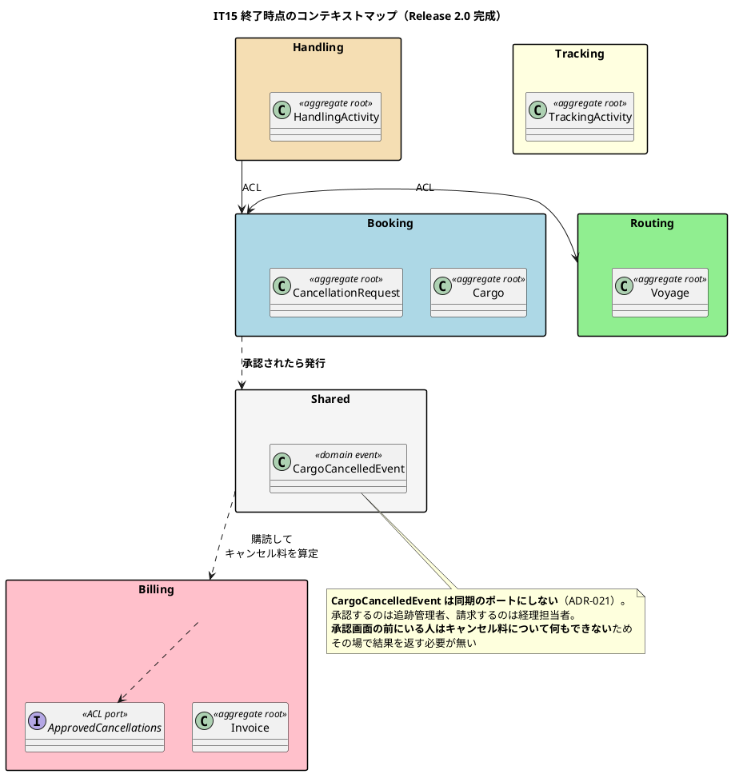
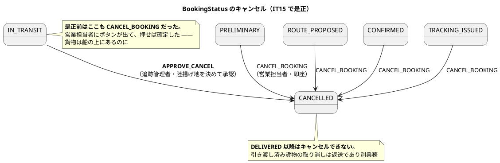
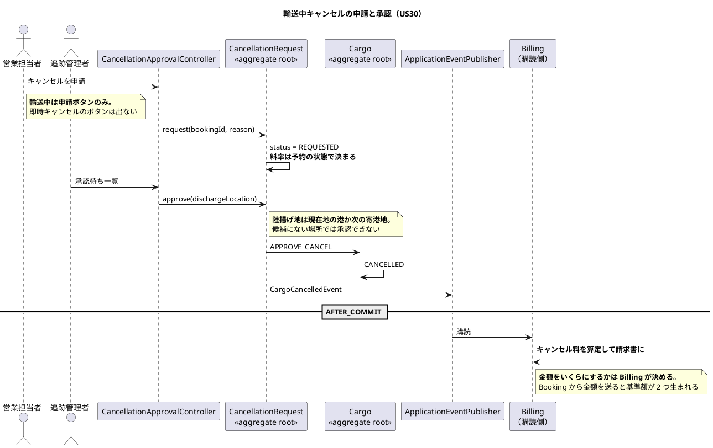
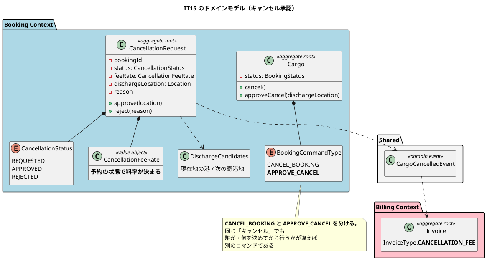

# 第 16 章：IT15 輸送中キャンセルの承認

## このイテレーションのゴール

**輸送中の貨物を、営業担当者の一存で消せなくする。**

計画の書き出しが、このストーリーの業務的な意味を説明しています。

> **貨物は船の上にある。** どこで降ろすかを決めないままキャンセルすると、貨物が宙に浮き、**荷役の現場は行き先の無い荷物を抱える**。

**これで Release 2.0 が完成**します。そして本イテレーションの中心は、機能追加ではなく **「コメントが仕様を語りながら実装が守っていない」欠陥の是正**です。

### このイテレーション終了時点のコンテキストマップ



## 扱うユーザーストーリー

| ID | ストーリー | SP |
| :--- | :--- | ---: |
| US30 | 輸送中の予約キャンセルを承認する | 5 |

## 前イテレーションからの引き継ぎ

着手前の検証で、**「このまま作ると受入基準に到達できない」構造的な穴が 3 件**見つかりました。先行して直しています。

| # | 穴 | 何が起きていたか |
| :--- | :--- | :--- |
| **X1** | `invoice.booking_id` が UNIQUE | 輸送料金の請求書がある予約に 2 枚目が入らず、**キャンセル料を請求する手段が無かった** |

第 1 章で書いた「序盤にデータモデルを引く」ことの代償が、ここでも出ています。V1 で作った一意制約が、15 イテレーション後のストーリーを塞いでいました。`V103__drop_invoice_booking_unique.sql` で外しています。

ふりかえりは Keep として記録しています。

> **K1. 着手前の検証が「作っても届かない」を 3 件見つけた**

**着手前に受入基準とスキーマ・実装を突き合わせる**運用（IT4 で始まった）が、11 イテレーション後も効いています。

## 実装

### コメントが仕様を語り、表がそれを守っていなかった

第 3 章で見た `BookingStatus` の遷移表を思い出してください。このイテレーションで、**表のコメントと表の中身が食い違っていること**が分かりました。

> 遷移表のコメントは「#9 輸送開始前のキャンセル。#10 輸送中のキャンセル（承認を伴う）」と書きながら、**表の中身は #9 と #10 を同じループで登録していた**。
>
> 画面は `cancellable` でボタンを出し、押せば確定する。つまり**輸送中の貨物を営業担当者がボタン 1 つで消せた**。

是正後のコードには、二度と同じことが起きないよう理由が書かれています。

```java
// #9 輸送開始前のキャンセル。**営業担当者の操作で即座に確定する。**
// DELIVERED 以降はキャンセルできない（引き渡し済み貨物の取り消しは返送であり別業務）
for (BookingStatus cancellable :
        new BookingStatus[] {PRELIMINARY, ROUTE_PROPOSED, CONFIRMED, TRACKING_ISSUED}) {
    table.get(cancellable).put(BookingCommandType.CANCEL_BOOKING, CANCELLED);
}

// #10 輸送中のキャンセル（承認を伴う。US30）。
// **#9 と同じループに入れてはならない。** 同じループに入れると、
// 輸送中の貨物を営業担当者がボタン 1 つで消せてしまう。
// 貨物は船の上にあり、**どこで降ろすかを決めないままキャンセルすると
// 荷役の現場は行き先の無い荷物を抱える**
table.get(IN_TRANSIT).put(BookingCommandType.APPROVE_CANCEL, CANCELLED);
```

そして述語も分けます。

```java
/**
 * 即座にキャンセルできるか（遷移表 #9。輸送開始前）。
 *
 * <p><strong>判断はここ 1 か所に置く。</strong> 画面のボタン出し分けも
 * 集約の検査も本述語を呼ぶ。<strong>輸送中は {@code false} である</strong> —
 * 押せない操作を見せない。
 */
public boolean canCancelImmediately() {
    return canTransitionBy(BookingCommandType.CANCEL_BOOKING);
}
```

**`CANCEL_BOOKING` と `APPROVE_CANCEL` を別のコマンドにした**ことが解決の形です。同じ「キャンセル」でも、**誰が・何を決めてから行うか**が違えば別のコマンドです。

### 状態遷移の是正



### 承認のワークフローを集約にする



### イベントは事実を運び、金額は運ばない

```java
/**
 * 輸送中の予約キャンセルが承認された（US30）。
 *
 * <p><strong>同期のポートにしない</strong>（ADR-021）。承認するのは追跡管理者、
 * 請求するのは経理担当者である。<strong>承認画面の前にいる人は
 * キャンセル料について何もできない</strong>ため、その場で結果を返す必要が無い。
 *
 * <p><strong>Booking から Billing を呼ばない</strong>（ADR-012）。運ぶのは起きた事実で
 * あり命令ではない。「キャンセル料を請求せよ」ではなく「キャンセルされた」を伝え、
 * <strong>金額をいくらにするかは Billing が決める</strong>
 * （金額の正典は Billing にある。Booking から金額を送ると基準額が 2 つ生まれる）。
 */
```

**同期か非同期かの判断基準が、ここでは「画面の前にいる人が、その結果で何かできるか」**になっています。ADR-009 が定めた基準の、より業務に近い言い換えです。

ADR-021 は「**BC 横断の状態変更は、失敗がどこに出るかを名指しする**」ことを定めています。第 7 章の教訓（結果整合を選んだなら、失敗を見る手段を作る）が ADR として一般化されました。

### このイテレーションのドメインモデル



## DDD の観点

### 戦略的 DDD

**Release 2.0 が完成し、7 BC のうち 6 つが立ちました。**

このイテレーションで確立した越境の判断基準が、ADR-021 として残ります。

> **BC 横断の状態変更は、失敗がどこに出るかを名指しする。**

同期／非同期の選択基準が、3 段階で洗練されてきました。

| ADR | 基準 |
| :--- | :--- |
| ADR-009（IT6） | 状態の伝播はイベント、コマンド・問い合わせは同期 |
| ADR-012（IT8） | 逆向きのポートを足す前に順方向を疑う |
| **ADR-021（IT15）** | **失敗がどこに出るかを名指しする** |

そして `CargoCancelledEvent` の Javadoc が、**イベントに何を載せないか**を明示しています。

> **金額をいくらにするかは Billing が決める**（金額の正典は Billing にある。Booking から金額を送ると基準額が 2 つ生まれる）。

**「正典はどの BC にあるか」を意識してイベントの中身を決める**のは、戦略的 DDD の実践です。金額の正典が Billing にあるなら、Booking はキャンセル料を計算してはいけません。

### 戦術的 DDD

| 道具立て | このイテレーションでの現れ方 |
| :--- | :--- |
| 集約ルート | `CancellationRequest`（申請と承認の状態機械） |
| **コマンドの分割** | `CANCEL_BOOKING` と `APPROVE_CANCEL` |
| 値オブジェクト | `CancellationFeeRate`（予約の状態で決まる）・`DischargeCandidates` |
| ドメインイベント | `CargoCancelledEvent` |

**コマンドを分けた**ことが要点です。状態遷移表で `IN_TRANSIT → CANCELLED` という遷移自体は存在しますが、**その遷移を起こせるコマンドが違います**。

これは第 13 章の `CorrectionRequest`（申請と承認を分ける）と同じ形です。**「誰が実行してよいか」が違う操作は、別のコマンドとしてモデルに現れます。**

`CancellationFeeRate` が「予約の状態で料率が決まる」値オブジェクトである点も業務的です。輸送がどこまで進んだかでキャンセル料が変わるという業務ルールを、値オブジェクトが持ちます。

### ユビキタス言語

**「キャンセル」という 1 つのことばが、2 つの業務操作を指していました。**

- 輸送開始前のキャンセル — 営業担当者が即座に確定する
- 輸送中のキャンセル — 追跡管理者が陸揚げ地を決めて承認する

**コメントはこの 2 つを区別していました**（#9 と #10）。しかし**実装は 1 つのコマンドで扱っていました**。ことばの上では分かれていて、コードの上では分かれていない状態です。

第 7 章（IT6）で Handling を独立させた根拠は「**別の事実を扱う 2 つのモデルが 1 つの BC に同居していた**」ことでした。今回はその小さい版で、**別の操作が 1 つのコマンドに同居していた**わけです。

そしてふりかえりの P1 が、このプロジェクトを通しての最も重い発見の 1 つです。

> ### P1. ADR に「必ず守る」と書いた規則を、コードの半分が守っていなかった（最大の発見）
>
> ADR-009 の規則 2 は「購読側は新しいトランザクションで書く（`REQUIRES_NEW`）」と明記している。**自分が足した購読先サービスは素の `@Transactional` だった。**
>
> それだけなら「新入りの見落とし」で済むが、**検査を書いた瞬間、同じ違反が既存に 5 本あることが分かった**。5 本が宣言していて 5 本が宣言していない — つまり**ADR を書いた後も、半分は守られないまま増え続けていた**。
>
> **「ADR に書いた」と「守られている」の間に何も無かった。**

**ADR-009 は IT6 で書かれました。9 イテレーションのあいだ、半分守られていませんでした。**

そして重要なのは、**テストは緑だった**ことです。

> テストが緑なのは Spring の内部挙動に依存しているためであり、**依存していること自体が危うい**。

## 設計判断

| ADR | 決めたこと |
| :--- | :--- |
| **ADR-020** | キャンセル料は請求書の種別（`InvoiceType`）で表す |
| **ADR-021** | BC 横断の状態変更は、失敗がどこに出るかを名指しする |

## このイテレーションの学び

5SP を完了し **Release 2.0 が完成**。破壊検証 8 件がすべて赤、品質ゲートは Bug 0 / Vulnerability 0 / Code Smell 0。

しかし全緑からレビューが高 5 件（**7 イテレーション連続**）。

| 問題 | 内容 |
| :--- | :--- |
| **P1. ADR に「必ず守る」と書いた規則を、コードの半分が守っていなかった** | 最大の発見。ADR-009 の `REQUIRES_NEW` |
| **P2. 自分の catch が、自分のデバッグを 30 分止めた** | ID 解析の `try` をリポジトリの読み出しまで広げていた。集約の復元が投げた例外が吸われ、画面には 404 だけ |
| **P3. C4（N+1）と同じ型を、C4 を返済した同じイテレーションで作った** | **待ち行列が伸びるほど遅くなる — いちばん混んでいるときに、いちばん遅い** |
| **P4. 名簿方式の検査が、名簿に無いものを素通りさせていた** | ADR-015 の `handling_correction` が 3 イテレーション漏れていた |

P2 の教訓は簡潔です — **catch は解析だけを囲む**。

```text
findCargo で「形式の違う ID を例外にしない」ための try を、
リポジトリの読み出しまで広げていた。
→ 集約の復元が投げた IllegalArgumentException が吸われ、
  画面には 404「予約が見つかりません」だけが出た。ログにも何も残らない。
→ catch を狭めた瞬間に 1 分で直った。
```

そして P1 と P4 を合わせると、次の 2 つのイテレーション（整流局面）でやるべきことが決まります。

| 発見 | やるべきこと |
| :--- | :--- |
| ADR に書いた規則が半分守られていない | **宣言を全件洗い出し、検査に落とす**（IT16） |
| 名簿方式は載せ忘れを素通りさせる | **未登録を赤にする**（IT16） |
| 返済が繰り越されている | **数え上げて返す**（IT17） |

**Release 2.0 が完成した時点で、機能ではなく規律の負債が可視化された**わけです。次章から 2 イテレーション、新規ストーリーを止めて整流に充てます。

---

- 前: [第 15 章：IT14 請求から入金確認までを閉じる](15-iteration-14.md)
- 次: [第 17 章：IT16 宣言した規則を検査に落とす](17-iteration-16.md)
