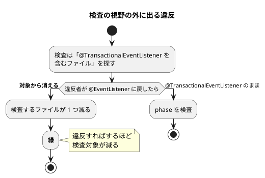
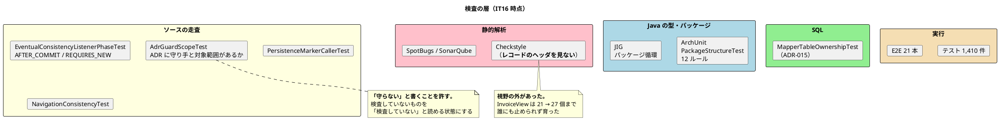

# 第 17 章：IT16 宣言した規則を検査に落とす

## このイテレーションのゴール

**荷役の現場に「手配した」が届き、宣言した規則が検査で守られる状態にする。**

**新規ストーリーを持たない初めてのイテレーション**です。計画 SP は 0 としています。

前章（IT15）で、「ADR に書いた規則をコードの半分が守っていなかった」ことが分かりました。**その一般化がこのイテレーションの主題**です。

> **本イテレーションの中心は「宣言されているのに、対象に届いていない規則」の是正である。** ADR 19 件に守り手を書き出したところ、**検査の無い規則が 13 件**見つかった。

## 扱う対象

| 種別 | 内容 |
| :--- | :--- |
| 受入基準の未達 | US30 の陸揚げ地が荷役作業員に届いていなかった 1 件 |
| 返済枠 | C1〜C10（**10 件すべて完了**） |
| ふりかえり Try | T1〜T6（**6 件すべて完了**） |

**落としたものは 0** です。

## 実装

### 宣言に「守り手」と「対象範囲」を書かせる

ADR 全件に、次の表を書く運用を入れました。

```markdown
## 何がどこで守るか

| 守るもの | 守り手 | 対象範囲（何を見ているか） |
| :--- | :--- | :--- |
| マッパーは自分の BC のテーブルだけを触る | `MapperTableOwnershipTest` | 本番の `*Mapper.java` に書かれた SQL 文字列のみ |
| `invoice_line_item` を使わない | **守らない。** | **検査の外。** テーブルは残っており、マッパーから引いても落ちない |
```

**3 列目の「対象範囲」が効きます。** 「守り手」だけだと「テストがある」で安心してしまいますが、**そのテストが何を見ているか**を書くと、視野の外が見えます。

そして **「守らない」と書くことを許しています**。検査の無い 13 件のうち、構造的に重い 2 件に検査を書き、残りは**「守り手: 守らない」と名前で残しました**（ふりかえり K4）。

**すべてを検査に落とすのが目的ではありません。** 検査していないものを「検査していない」と読める状態にすることが目的です。

### 規則が対象に届いていなかった 3 つの形

ふりかえりの P3 が、このイテレーションの核心です。

| # | 規則 | なぜ届かなかったか |
| :--- | :--- | :--- |
| 1 | ADR-009 の規則 1（購読は `AFTER_COMMIT`） | 既存の検査が `@TransactionalEventListener` を含むファイルだけを探していた。**素の `@EventListener` に戻すと対象から消えて緑になる** |
| 2 | Checkstyle の `ParameterNumber`（7 個まで） | **レコードのヘッダを見ない**。`InvoiceView` は 21 → 27 個まで誰にも止められずに育った |
| 3 | ADR-003「SQL を検証する唯一の場所」 | `*RepositoryTest` の基底を差し替えても何も落ちなかった |

> **宣言はされているのに、対象が検査の視野の外にある。** 3 件とも別の理由で起きており、共通するのは**「規則を書いた人が、その規則が届く範囲を確かめていない」**ことである。

1 番目が典型的です。**違反を作ると検査の対象から外れる**という構造をしています。`@TransactionalEventListener` を `@EventListener` に戻す（＝規則違反）と、そのファイルは検査の対象ですらなくなり、**緑のまま通ります**。



**「対象を絞り込む条件」が「違反の内容」と重なっていると、検査は働きません。**

### 記録された負債は実態の 5〜10 分の 1 だった

ふりかえりが最大の発見と位置づけたのは、**負債の数え方**です。

> ### P1. 記録された負債は、実態の 5 分の 1 から 10 分の 1 だった（最大の発見）
>
> | 項目 | 引き継ぎの記録 | 実測 |
> | :--- | :--- | :--- |
> | C2（テストの貨物準備） | 7 クラス | **39 クラス・41 箇所** |
> | C3（ビューの引数） | 2 件 | **21 件・最大 35 要素** |
>
> **どちらも「落とす判断」がその小さい数字の上に立っていた。** C2 は IT14・IT15 と 2 度落とされ、C3 も同様である。「5 → 7 クラスに増えた」という記録を見て「まだ小さい」と判断していた。
>
> **数え方が違えば、落とす判断の前提も違う。**

**負債を落とす（先送りする）判断は、負債の大きさの見積もりに依存します。** その見積もりが 5〜10 分の 1 だったなら、落とす判断そのものが誤りだったことになります。

以降、返済枠には**実測値を添える**運用になります（Try T1）。

### 検査を書く作業が、最も多く誤りを生んだ

皮肉な結果も記録されています。

> ### P2. 検査を書く作業が、最も多く誤りを生んだ
>
> | 誤りの種類 | 回数 |
> | :--- | ---: |
> | **自己参照**（検査が自分を違反として数える） | 3 |
> | 品質ゲート違反（Checkstyle 2・SpotBugs 1） | 3 |
> | **名簿方式の穴**（T4 で戒めた形を、T4 の後に自作した） | 1 |
> | 走査条件の絞りすぎ | 1 |
>
> とくに重いのは名簿方式である。`PersistenceMarkerCallerTest` は「版を進めるメソッド」を名前の一覧で持っていた。**別名で足したものは検査の外側に生まれる** — T4 でまさにそれを戒めた直後だった。
>
> **守るものを増やすと、守られる対象も増える。**

**検査もコードであり、検査にも欠陥があります。** そして「名簿方式は載せ忘れを素通りさせる」という第 12 章の教訓を、**それを戒めた直後に自分で作りました**。

### 読み取り側の規則をどこに置くか（ADR-022）

このイテレーションで新設した ADR が 1 つあります。

> IT16 で荷降し手配の一覧を実装した。`MyBatisHandlingQueryService.findPendingDischarges` が次の 3 つを 1 つのメソッドで行っていた。
>
> 1. ACL ポート（`ApprovedCancellations`）から承認済みの手配を受け取る
> 2. 自分のマッパーで「すでに降ろした予約」をまとめて引く
> 3. **どれを出すか・どうまとめるかを判断する**

決定は分離です。

| 何を | どこに |
| :--- | :--- |
| **業務の判断**（どれを出すか・どうまとめるか） | **application 層の純粋な関数** |
| **問い合わせ**（何回・どの SQL で引くか） | infrastructure の実装クラス |

ふりかえりの Keep が理由を端的に書いています。

> **K3. 規則を DB 無しで壊せる場所に置く（ADR-022）**

**判断が infrastructure にあると、その判断を壊すテストに DB が要ります。** application の純粋な関数にすれば、単体テストで境界を確かめられます。

CQRS の読み取り側は「ただの SQL」に見えますが、**そこにも業務の判断が混ざります**。

### このイテレーションの検査の地図



## DDD の観点

### 戦略的 DDD

**境界は動きません。** このイテレーションが扱うのは、**境界を守る仕組みそのもの**です。

DDD の文脈で言えば、これは **モデルの整合性を保つ手段**の話です。境界づけられたコンテキストは「モデルが一貫している範囲」ですが、**一貫性は宣言では保たれません**。

このプロジェクトが 16 イテレーションかけて到達した認識は次のとおりです。

| 段階 | 認識 |
| :--- | :--- |
| IT1 | 規則を ArchUnit に書く |
| IT6 | ArchUnit の緑は「越境してよい場所の宣言」であって循環の不在ではない |
| IT11 | Java の依存グラフは SQL の越境を見ない（ADR-015） |
| **IT16** | **宣言された規則が、対象に届いているかを確かめる** |

**「検査があるか」から「検査が何を見ているか」へ**、問いが 1 段深くなっています。

### 戦術的 DDD

このイテレーションで新しい集約や値オブジェクトは増えません。代わりに **既存の構造を整える**作業が入ります。

| 作業 | 内容 |
| :--- | :--- |
| C2 | テストの貨物準備ヘルパー **41 箇所 → 支援クラス 1 箇所** |
| C3 | `InvoiceView` の引数 **27 → 6 グループ**（テンプレート 71 箇所は無変更） |
| ADR-022 | 読み取り側の判断を application 層の純粋な関数へ |

C3 が戦術的 DDD の実践です。**引数 27 個は「まとまるべきものがまとまっていない」**という信号で、第 13 章・第 14 章と同じ「Checkstyle が設計の合図を出す」形です。

ただし今回は**信号が届いていませんでした**。Checkstyle の `ParameterNumber` はレコードのヘッダを見ないため、21 個から 27 個まで誰にも止められずに育ちました。**合図を出す仕組み自体に視野の穴があった**わけです。

### ユビキタス言語

**このイテレーションは、ドキュメントのことばを実装に届かせる作業です。**

ADR は設計判断を記録する文書ですが、**記録は実装を変えません**。ADR に「守り手」と「対象範囲」の欄を強制することで、**「この判断は何によって守られているか」を書かないと ADR が完成しない**状態にしました。

そして「守らない」と書けるようにしたのが、この運用の実務的なところです。

- すべてを検査に落とす → できない（コストが見合わない規則がある）
- 検査の無いものを黙って残す → 読んだ人が守られていると誤解する
- **「守らない」と書く** → 誤解しない

**ことばの正確さは、「守っている」と言えないときに「守っていない」と書けるかで決まります。**

## 設計判断

| ADR | 決めたこと |
| :--- | :--- |
| **ADR-022** | 読み取り側の「規則」は application 層に置き、「問い合わせ」は infrastructure に残す |
| — | ADR 全件に「守り手」と「対象範囲」を書く。検査が無ければ「守らない」と明記する |
| — | 返済枠には実測値を添える |

## このイテレーションの学び

返済枠 10 件・Try 6 件をすべて完了、**落としたものは 0**。テスト 1,410 件・E2E 21 本すべて緑。

Keep も Problem も、検査についての観察が並びます。

| 種別 | 内容 |
| :--- | :--- |
| **K1** | 途中レビューが、**そのイテレーション自身の違反**を捕まえた |
| **K2** | 破壊検証が**空振りを 3 回**見つけた |
| **K4** | 検査の無い規則を「守らない」と名前で残した |
| **P1** | 記録された負債は実態の 5〜10 分の 1 |
| **P2** | 検査を書く作業が最も多く誤りを生んだ |
| **P3** | 宣言された規則が対象に届いていない形を 3 度見た |
| **P4** | 自動化が US22 の保証を静かに消しかけた |

P4 も示唆的です。テストの共通化スクリプトが、**法人／割引率の引数を黙って落としました**。判定が「リテラルの `CORPORATE`」しか見ておらず、`corporate ? "CORPORATE" : "INDIVIDUAL"` という書き方を拾えなかったためです。

> **全緑を確認せずに進んでいれば、割引のテストが「個人荷主として通る」形で緑になっていた。**

**リファクタリングの自動化が、テストの意味を静かに変えることがあります。** バッチごとにテストを回していたから気づきました。

---

- 前: [第 16 章：IT15 輸送中キャンセルの承認](16-iteration-15.md)
- 次: [第 18 章：IT17 数え上げた負債を返す](18-iteration-17.md)
