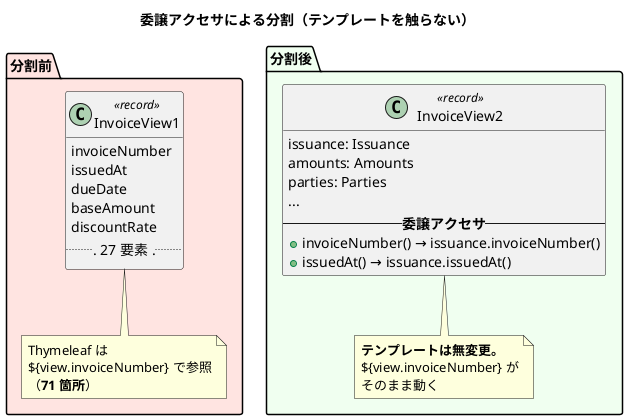

# 第 18 章：IT17 数え上げた負債を返す

## このイテレーションのゴール

**IT16 で数え上げた負債を返し、整流局面を終わらせる。**

整流の 2 回目・最終回です。新規ストーリーはありません（SP 0）。

前章で「記録された負債は実態の 5〜10 分の 1 だった」ことが分かりました。**このイテレーションは、着手時に数え直すところから始まります。**

## 扱う対象

| 種別 | 件数 |
| :--- | ---: |
| 返済枠（A1・R1〜R10） | 11 件すべて完了 |
| ふりかえり Try（T1〜T6） | 6 件すべて完了 |

局面の完了条件である `NOT_SPLIT_YET`（分割の据え置き）と `NOT_MEASURED_YET`（計測の据え置き）は**両方とも空**になり、**空を保つ検査**を付けました。

## 実装

### 着手時に数え直すと、記録が小さい

IT16 の Try T1（返済枠に実測値を添える）を実行した結果です。

| # | 内容 | 記録 | **実測（着手時）** |
| :--- | :--- | :--- | :--- |
| R8 | 走査する検査の共通化 | 8 本 | **10 本** |
| R2 | 所有表が 2 か所にある | — | **40 テーブル超** |
| T4 | ADR の守り手に対象範囲 | — | **21 件** |
| R6 | レコードの分割 | — | **20 件・最大 34 要素** |
| R7 | 列の多い一覧 | **1 画面** | **13 テンプレート** |

R7 が顕著です。**1 画面だと思っていたものが 13 テンプレートありました。**

ふりかえりの Keep はこう書いています。

> **K1. 着手時に数え直す（IT16 の Try T1）**

**返済枠を書いた時点の数字は、返済に着手する時点では古くなっています。** 対象が増えている場合もあれば、数え方が甘かった場合もあります。

### 返済の手順そのものが実害を見つける

完了報告の一節が、このイテレーションの性格を表しています。

> **返済の過程で 3 件の実害を発見し、直した。**
>
> 1. **本物の N+1**（訂正の承認待ち一覧。1 行ごとに荷役を開いていた）
> 2. **画面に押せないボタンが出ていた**（A1 の副作用。追跡管理者が押すと 403）
> 3. **「検査で固定した」と書いた検査が入っていなかった**（文章だけが残っていた）
>
> いずれも「返済のついでに見つけた」ものではなく、**返済の手順そのものが見つけさせた**。**計測を書いたから N+1 が見え、5 視点でレビューしたからボタンが見え、破壊検証を全数やったから欠けた検査が見えた。**

3 番目が、このプロジェクトを通しての主題の極まった形です。

> ### P1. 「検査で固定した」と書きながら、検査が入っていなかった

**完了報告に「検査で固定した」と書いた文章だけが残り、検査は存在しませんでした。** 破壊検証を全数やって初めて分かっています。

### 検査を共通化し、自己除外を既定にする

第 17 章の P2 で「検査が自分を違反として数える」誤りが 3 回起きました。走査する検査が 10 本になったこともあり、共通基盤に寄せます。

| 返済 | 内容 |
| :--- | :--- |
| R8 | `SourceScan` へ集約。**自己除外を既定に** |
| R9 | 走査時のコメント・リテラル除外。`code()` / `text()` を選べるように |

**R9 が重要です。** ソースを文字列として走査する検査は、**コメントの中の記述を違反として拾います**。逆に「コメントも含めて検査したい」場合もあります（ADR の記述を確かめるなど）。**どちらを見るかを選べる形**にしました。

### 正典が 2 か所にある問題を、両方向で検査する

ADR-015 の所有表は、`data-model.md`（正典）と検査コード（名簿）の 2 か所にありました。

> **R2**: 正典を読んで突き合わせる検査。**両方向で赤**

**片方だけ直したら赤になる**検査です。正典に足して名簿に足さなければ赤、名簿に足して正典に足さなくても赤。

ADR-015 に追記されたコメントが、この検査の必要性を説明しています。

> **「正典は `data-model.md`」と書きながら、`data-model.md` に所有表が無かった。** 所有者を示していたのは検査コードの `OWNER` だけであり、**正典と名指しされた側が空白**だった。

**「正典はこれだ」と書くことと、正典に中身があることは別**です。

### レコードを分割し、テンプレートを触らない

R6（レコードの分割）は 20 件・最大 34 要素ありました。第 17 章で `InvoiceView` を 27 → 6 グループにしたのと同じ作業を全件に広げます。

ふりかえりの Keep に、実務的な工夫が記録されています。

> **K4. 委譲アクセサでテンプレートを触らずにレコードを分割する**

**構造を直しつつ、利用側を変えない。** リファクタリングの基本ですが、テンプレートエンジンが相手のときは特に効きます（テンプレートはコンパイル時に検査されないため、書き換えの誤りが実行時まで出ません）。

### 一覧の問い合わせ回数を計測する

R5（一覧の問い合わせ回数の計測）で、**6 件すべてを計測し、N+1 を 1 件発見・修正**しています。

第 16 章の P3 が「C4（N+1）と同じ型を、C4 を返済した同じイテレーションで作った」でした。**目視では繰り返し見落とすため、計測に変えました。**

> **待ち行列が伸びるほど遅くなる — いちばん混んでいるときに、いちばん遅い。**

### 緊急度に「期限」を作らない

R1（荷降し手配の緊急度）に、業務的な判断が入っています。

> **R1**: 荷降し手配の緊急度 → 待ち日数と「滞留」。**期限は作らない**

**業務に存在しない期限を、システムが勝手に作らない**という判断です。待ち日数を出して「滞留している」と示すことはできますが、「◯ 日以内に処理すべき」という期限は業務が決めることであり、実装が発明するものではありません。

### 列を隠さない

R7（列の多い一覧）も同じ性格の判断です。

> **R7**: 列の多い一覧 → 全件横スクロール。**列は隠さない**

画面が狭いとき、列を隠す（レスポンシブに折りたたむ）実装は一般的です。**しかし業務の一覧では、隠された列があることに気づけません。** 横スクロールにして、全部見えるようにしました。

## DDD の観点

### 戦略的 DDD

**境界は動きません。** このイテレーションが整えたのは、**モデルの読みやすさ**です。

`domain/model` を構成要素ごとに分ける判断（ADR-024）は次のイテレーションですが、その前段としてレコードの分割・検査の共通化・正典の一元化が行われています。

戦略的 DDD の観点で書くべきことは、**「整流」という局面を設けたこと自体**です。

| 局面 | イテレーション | 何をするか |
| :--- | :--- | :--- |
| 序盤 | IT1〜IT2 | アウトサイドイン |
| 中盤 | IT3〜IT6 | インサイドアウト |
| 終盤 | IT7〜IT12 | アウトサイドイン |
| 精算 | IT13〜IT15 | 条件で選ぶ |
| **整流** | **IT16〜IT17** | **新規ストーリーを止めて、規律の負債を返す** |
| 出荷と是正 | IT18〜IT20 | |

**2 イテレーション（10%）を、新機能ゼロで規律に充てています。** これができたのは、負債が「数えられる形」で記録されていたからです。数えられない負債は、返す計画も立てられません。

### 戦術的 DDD

| 作業 | 戦術的 DDD との関係 |
| :--- | :--- |
| レコードの分割（20 件） | 値オブジェクトの粒度を整える |
| ADR-022 の適用（読み取り側の規則を application へ） | ドメインの判断を infrastructure から引き上げる |
| 検査の共通化 | 設計規則の実行可能性を保つ |

**「20 件のレコードを分割する」は、DDD の作業に見えないかもしれません。** しかし 34 要素のレコードは、**まとまるべき概念が名前を持っていない**状態です。分割の過程で `Issuance` / `Amounts` / `Parties` といった名前が生まれます。

**リファクタリングがモデルを育てる**という、XP と DDD の接点がここにあります。

### ユビキタス言語

**「据え置き」を数えられる形にしたことが、このイテレーションのことばの成果**です。

`NOT_SPLIT_YET`（分割の据え置き）と `NOT_MEASURED_YET`（計測の据え置き）という名前の表を作り、**そこに載っているものを返済し、空になったら空を保つ検査を付けました**。

| 状態 | 意味 |
| :--- | :--- |
| 表に載っている | **意図して据え置いている**（返す予定がある） |
| 表が空 | **据え置きは無い** |
| 表に無いのに未対応 | **見落とし**（検査が赤にする） |

**「まだやっていない」を名前のある状態にすると、忘れられなくなります。** 第 10 章の「開かないと決めた」、第 12 章の「やらなかったものを名前で記録した」と同じ発想の、仕組み化された形です。

## 設計判断

| 判断 | 内容 |
| :--- | :--- |
| 走査する検査は `SourceScan` に集約し、自己除外を既定にする | 検査が自分を違反として数える誤りが 3 回起きた |
| 正典と名簿は両方向で突き合わせる | 片方だけ直したら赤になる |
| ADR 全件に「対象範囲」欄を設け、空欄を赤にする | 検査の視野を明示する |
| 緊急度に期限を作らない | 業務に存在しない期限を発明しない |
| 一覧の列は隠さない | 隠された列があることに気づけない |

## このイテレーションの学び

返済 11 件・Try 6 件をすべて完了。**落としたものは無し。** `NOT_SPLIT_YET` / `NOT_MEASURED_YET` は空になり、空を保つ検査が付きました。

Keep が示すのは、手順の力です。

| Keep | 内容 |
| :--- | :--- |
| **K1. 着手時に数え直す** | 記録は着手時点では古い |
| **K2. 破壊検証を機械的に全数実施する** | 自分で選ばない |
| **K3. 規則を DB 無しで壊せる場所に置く** | ADR-022 |
| **K4. 委譲アクセサでテンプレートを触らずに分割する** | |

Problem も、検査を書く作業に集中しています。

| Problem | 内容 |
| :--- | :--- |
| **P1. 「検査で固定した」と書きながら、検査が入っていなかった** | |
| **P2. A1 で開いた画面のボタンを、ロールで出し分けていなかった** | **第 6 章から続く到達性の系列の再演** |
| **P3. `check` を飛ばして `test` だけで進めた** | |
| **P4. 検査を書く途中で「何も見ない検査」を 2 度作った** | |
| **P5. テストの独立性を 2 度踏んだ** | |

P4 の「何も見ない検査」は、第 2 章で戒めた `allowEmptyShould(true)` と同じ形です。**対象が 0 件の検査は緑になります。** 17 イテレーション目にも 2 度作っています。

そして P2 は、**IT2 から続く到達性の系列**の再演です。

| IT | 抜けた観点 |
| :--- | :--- |
| IT2 | ロールがその画面を開けるか |
| IT3 | 開いた画面から次に何ができるか |
| IT4 | 置いてあるボタンを実際に押せるか |
| IT5 | 操作を終えた後にもう一度開けるか |
| **IT17** | **新しくロールに開いた画面の中のボタンを、そのロールで押せるか** |

**15 イテレーション後に、同じ主題が形を変えて現れています。** 受入基準に現れない観点は、繰り返し抜けます。

---

- 前: [第 17 章：IT16 宣言した規則を検査に落とす](17-iteration-16.md)
- 次: [第 19 章：IT18 Estimation Context の立ち上げ](19-iteration-18.md)
