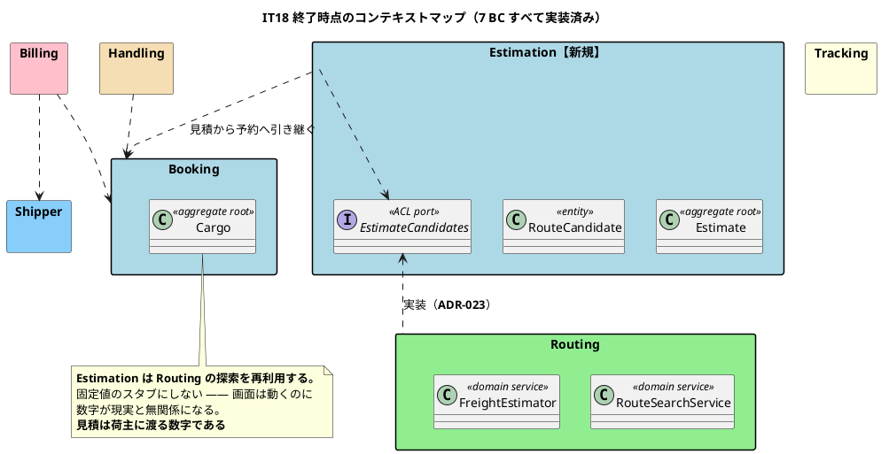
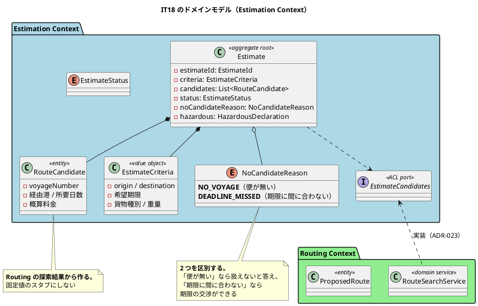
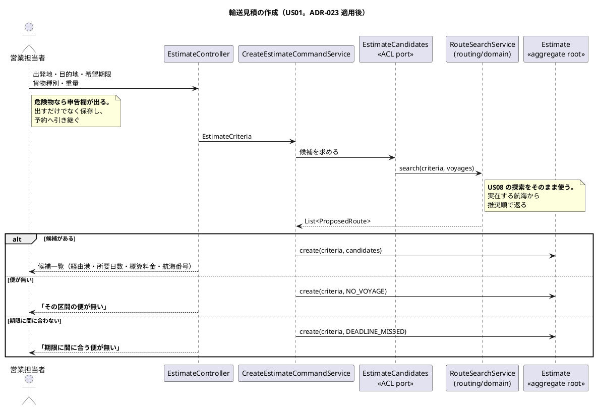

# 第 19 章：IT18 Estimation Context の立ち上げ

## このイテレーションのゴール

**営業担当者が輸送条件から概算を作り、その内容のまま予約へ進めるようにする。**

**最後の未実装 BC を立ち上げる回**です。

> `package-info.java` だけのパッケージは無くなり、`release_scope.md` の「未割当」も空になった。**US01〜US36 のすべてがどれかのリリースに属し、実装済みである。**

US01（輸送見積を作成する）は**最初のユーザーストーリー番号**でありながら、**18 回目のイテレーションで実装されました**。

### このイテレーション終了時点のコンテキストマップ

## 扱うユーザーストーリー

| ID | ストーリー | SP |
| :--- | :--- | ---: |
| US01 | 輸送見積を作成する | 5 |

受入基準 6 件すべてを達成しています。

## 前イテレーションからの引き継ぎ

IT17 の Try T6（着手前に正典の食い違いを決着させる）を実行しました。

> **正典が食い違っていた。着手前に決着させた。**

## 実装

### 「将来の外部サービス」は来ない（ADR-023）

`domain-model.md` の Estimation Context には、こう書かれていました。

> ルート候補はスタブ実装（固定値）で生成される。将来、外部ルーティングサービスとの連携時に置換予定

**この記述は、Routing にまだ探索が無かった時期のものです。** 着手前の検証で、2 つの前提が崩れていることが分かりました。

| 前提 | 実際 |
| :--- | :--- |
| 将来、外部ルーティングサービスと連携する | **来ない。** ADR-006 が外部システムと HTTP 連携しないと決めている |
| Routing に本物の探索が無い | **ある。** US08（IT4）の `RouteSearchService` が実在する航海から候補を返す |

そして判断の理由が業務的です。

> **固定値を返す見積は、画面は動くのに数字が現実と無関係である。** 見積は荷主に渡る数字であり、営業担当者はそれを見て予算と納期を伝える。**実在しない便の所要日数と費用を「概算」として提示することになる。**

ACL ポートで Routing の探索に繋ぎました。

**「スタブのままにする」という選択肢もありました。** リリース計画には、決着の結果で SP が変わることまで書かれています。

> 決着が「スタブのまま」になった場合、SP は 3 に下がります。逆に Estimation 側に独自の探索を作る判断になれば 8 です。**5SP はこの決着が第 1 案どおりになる前提の数字です。**

**着手前に決着させることを、見積もりの前提として明示しています。**

### 「便が無い」と「期限に間に合わない」を区別する

受入基準 5「期限に間に合うルートが無い場合、その旨が通知される」の実装に、業務的な判断が入っています。

| 状況 | 意味 |
| :--- | :--- |
| **便が無い** | その区間を運ぶ航海そのものが存在しない |
| **期限に間に合わない** | 航海はあるが、希望期限に届かない |

営業担当者にとって、この 2 つは全く違う情報です。前者なら「その区間は扱えない」と答え、後者なら「期限を延ばせませんか」と交渉できます。

第 5 章（IT4）の「選べない候補も残す」— 「なぜあの便が出てこないのか」を利用者が確認できるようにする — と同じ発想です。

### 危険物の申告を引き継ぐ

受入基準 6「危険物の場合、申告情報の入力フォームが表示される」を、**出し分けだけで終わらせていません**。

> 出し分け＋**保存して予約へ引き継ぐ**

第 10 章（IT9）で作った `HazardousDeclaration`（3 項目そろって初めて申告）を、見積の段階で入力し、予約に引き継ぎます。**見積で申告した内容を、予約でもう一度打ち込ませない**という業務上の配慮です。

### このイテレーションのドメインモデル

### 見積作成の流れ

## DDD の観点

### 戦略的 DDD

**7 つ目の BC が立ち、コンテキストマップが完成しました。**

Estimation の位置づけには特徴があります。

| 観点 | 内容 |
| :--- | :--- |
| 上流／下流 | **完全な下流**（Routing に問い合わせるだけ） |
| 関係パターン | 顧客／供給者 ＋ 腐敗防止層 |
| 循環 | **作らない** |

第 14 章の Billing と同じ形です。**後から足す BC は下流として足すのが最も安全**という観察が、2 度確認されました。

そして ADR-023 は、**設計ドキュメントの記述が古くなる**という問題の典型例です。

> この記述は **Routing にまだ探索が無かった時期**のものである。

`domain-model.md` の記述は、書かれた時点では正しいものでした。**14 イテレーション後に前提が変わり、記述だけが残りました。** 気づいたのは着手前の突合（IT17 の Try T6）です。

**正典は放っておくと古くなります。** そして古い正典に従って実装すると、**正典に従ったのに間違ったもの**ができます。

### 戦術的 DDD

| 道具立て | このイテレーションでの現れ方 |
| :--- | :--- |
| 集約ルート | `Estimate` |
| エンティティ | `RouteCandidate`（集約の内側） |
| 値オブジェクト | `EstimateCriteria` / `HazardousDeclaration`（Booking から再利用ではなく Estimation 側の型） |
| **理由を持つ列挙** | `NoCandidateReason`（`NO_VOYAGE` / `DEADLINE_MISSED`） |
| ACL ポート | `EstimateCandidates` |

`Estimate` と `BookingRouteProposal`（第 5 章）は、構造がよく似ています。集約ルートが候補のリストを持ち、候補はエンティティです。**しかし別の BC の別の集約**です。

「似ているから共通化する」を避けるのは、第 6 章の `CargoRoutingStatus` から一貫した判断です。**見積の候補と経路提案の候補は、業務上の意味も寿命も違います**（見積の候補は提案であり、経路提案の候補は割り当ての対象です）。

`NoCandidateReason` は、**「無い」に理由を持たせた列挙**です。空のリストを返すだけだと、なぜ空なのかが分かりません。

### ユビキタス言語

**「概算」ということばが、14 イテレーションを越えて一貫しました。**

| IT | 型 | ことば |
| :--- | :--- | :--- |
| IT4 | `FreightEstimator` / `estimatedCost` | 概算（並べ替え用） |
| IT13 | `FreightChargeCalculator` | 請求（法的・会計的に確定した金額） |
| **IT18** | **`Estimate`（Routing の概算を使う）** | **概算（荷主に提示する目安）** |

IT18 の見積は IT4 の概算式を使います。**これは正しい流用です** — どちらも「確定していない目安」だからです。IT13 の請求は別の式を使います。

**ことばが一貫していたおかげで、どれを流用してよくてどれがだめかが判断できました。**

そして「便が無い」と「期限に間に合わない」の区別も、ことばの精度の問題です。両方を「候補がありません」で済ませると、営業担当者は次の行動を決められません。

## 設計判断

| ADR | 決めたこと |
| :--- | :--- |
| **ADR-023** | 見積のルート候補は Routing の探索から作る（固定値のスタブにしない） |

## このイテレーションの学び

5SP を完了、受入基準 6 件すべて達成。**最後の未実装 BC が立ちました。**

しかし失敗は 1 点に集約されています。

> **この IT の失敗は「入力させたものを捨てていた」ことに集約される。** 2 件あり、**どちらも作った本人には見えなかった**。

| # | 内容 | 見つけた人 |
| :--- | :--- | :--- |
| 1 | 危険物の申告欄を出しながら**保存していなかった** | 自分（受入基準の突合時） |
| 2 | 貨物種別を変えると**入力済みの内容が全部消えた** | クローズ前レビュー |

2 番目の重さが記録されています。

> マニュアルの操作手順どおりに操作すると、**荷主と電話しながら打ち込んだ内容が種別選択の瞬間に全部消える**。テストは「危険物欄が出るか」しか見ておらず、**他の欄が残っているかを見ていなかった**。

**テストは「出るか」を確かめ、「消えないか」を確かめていませんでした。** 第 11 章の P2「『無いこと』だけを見るアサート」の裏返しです。

そして、記録と実測のずれが 5 度目です。

| 項目 | 記録 | 実測 | 倍率 |
| :--- | ---: | ---: | ---: |
| C2（貨物フィクスチャ・IT16） | 7 | 39 | 5.6 |
| C3（レコード・IT16） | 2 | 21 | 10.5 |
| R7（列の多い一覧・IT17） | 1 | 13 | 13 |
| **C1（委譲アクセサ・IT18）** | **34** | **249** | **7.3** |

> **着手時に数え直す習慣は効いている**（毎回ここで気づく）。効いていないのは**記録するときの数え方**である。

**手順を追加しても、根の問題は残ります。** 「着手時に数え直す」は対症療法であり、「記録するときに正しく数える」は解決していません。

そして IT18 の Keep に、負債の扱いについての新しい観察があります。

> **K4. 育つ負債を「育たない負債」に変えた**

C1（委譲アクセサ 249 個）は全部は返せませんでした。**39 個を返し、残り 210 個を上限で固定**しています。検査で「これ以上増やせない」状態にすると、**返せない負債でも育たなくなります**。

この考え方が、最後のイテレーションの主題になります（第 21 章）。

---

- 前: [第 18 章：IT17 数え上げた負債を返す](18-iteration-17.md)
- 次: [第 20 章：IT19 正典に届いていない実装を返す](20-iteration-19.md)
