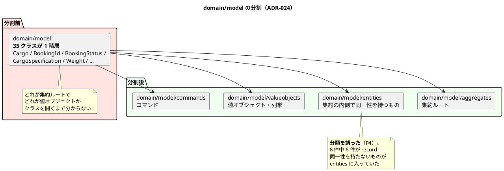

# 第 20 章：IT19 正典に届いていない実装を返す

## このイテレーションのゴール

**Release 2.1 を出荷済みとして確定させ、正典に届いていない実装と、人の記憶に預けている規律を返す。**

**全 36 ユーザーストーリーが実装完了した後の最初のイテレーション**です。新規ストーリーはありません（SP 0）。

局面の名前は **「出荷と是正」**。達成は「出荷の確定」と「返済枠・Try の完了数」で測ります。

## 扱う対象

| 種別 | 内容 |
| :--- | :--- |
| 出荷 | `java/take-6/v2.1.0` タグ・CHANGELOG・リリース完了報告書 |
| 正典未達 | `ui_design.md` に書いてあって実装に無かった 2 件 |
| 返済枠・Try | 予定 11 件すべて完了 ＋ 計画外 2 件 |

| 指標 | 値 |
| :--- | :--- |
| テスト数 | **1,558**（Java 1,537 ＋ E2E 21） |
| 新規 ADR | 1 件（ADR-024。累計 25 ファイル） |
| レビュー指摘 | 高 11 / 中 20 / 低 8（**高 11 件すべて対応**） |
| 工数 | 計画 75h に対し実績 91h（**計画外が 16h**） |

## 実装

### 正典に書いてあって実装に無かったもの

`ui_design.md` は UI の正典です。そこに書かれていて実装が無いものが 2 件見つかりました。

| # | 正典 | 実装前 |
| :--- | :--- | :--- |
| C3 | `ui_design.md:1791` `[同じ条件で再見積]` を提示する | **文言だけで導線が無い** |
| C4 | `ui_design.md:1760` 出発地・目的地・作成日範囲・状態で絞り込む | **絞り込みが無い** |

**行番号まで示している**点に注目してください。「正典に書いてある」ではなく「正典のこの行に書いてある」という粒度で突き合わせています。

第 19 章の ADR-023（正典の記述が古かった）とは逆方向の乖離です。

| 方向 | 例 |
| :--- | :--- |
| **正典が古く、実装が正しい** | ADR-023（スタブの記述。IT18） |
| **正典が正しく、実装が届いていない** | C3 / C4（IT19） |

**どちらも「正典と実装を突き合わせる」ことでしか見つかりません。**

### ドメインモデルを構成要素ごとに分ける（ADR-024）

このイテレーションで、パッケージ構成の最後の変更が入ります。

> 各 BC の `domain/model` は 1 つのパッケージにすべてを入れていた。実測で **140 クラス**あり、最大の Booking は **35 クラスが 1 階層に並んでいた**。
>
> パッケージを開いたとき、**どれが集約ルートでどれが値オブジェクトなのかは、クラスを開くまで分からない**。JIG のパッケージ図でも 1 つの箱になり、構成要素の別が読み取れない。

本シリーズの第 1 章で示したパッケージ構成は、**この ADR が適用された後の形**です。

### 分割の代償を ADR に書く

ふりかえりの Keep に、記録の姿勢が現れています。

> **K4. 分割の代償を隠さず ADR に書き、レビューで訂正した**

パッケージを分けると、**同じ集約の内部で相互参照する型が別パッケージになり、可視性を緩めざるを得ません**。ADR-024 はその代償を書き、「誰がどのメソッドを呼んでよいか」の契約を表にしました。

**ただしその契約は、この時点では検査になっていません。** コメントに書いただけです。それが次のイテレーションの主目的になります（第 21 章）。

### 検査を足すイテレーションなのに、検査に穴があった

ふりかえりの P1 が、第 17 章の P2（検査を書く作業が最も多く誤りを生んだ）の再演です。

| 検査 | 穴 |
| :--- | :--- |
| H2 スモークの載せ忘れ | **型単位でしか見ておらず、メソッド 6 件を素通り** |
| ADR-022 の規則の置き場 | **数値リテラルしか拾わず、定数比較は素通り**。移設先の `DeadlineUrgency` がまさにその形 |
| 型名の照合 | 部分一致で、接尾辞が重なる型を見分けられない |

そして原因の分析が鋭いものです。

> **「2 回続けて外したなら方式の問題」と書いて方式を変えたのに、新しい方式の粒度が事故の粒度と合っていなかった。** IT17・IT18 で外したのは「**新しいサービス**」だったが、次に増えるのは「**新しいメソッド**」である。

**検査の粒度が、事故の粒度と一致していなければ働きません。** 型単位で見る検査は、メソッドが増える形の事故を捕まえません。

### 「名前で記録した」と書きながら、記録が無かった

このイテレーションの Problem で、最も皮肉なものです。

> ### P5. 「名前で記録した」と書きながら、記録が無かった
>
> ADR-024 は 2 か所で「次のイテレーションで ArchUnit ルールに落とす（**名前で記録した**）」と書いていたが、**`docs/development/` を grep しても 1 件もヒットしなかった**。
>
> **ADR 本文が最も強い言葉で戒めている形を、その ADR 自身が踏んでいた。**

第 10 章・第 12 章で「やらないことを名前で記録する」を Keep として積み上げてきました。**その運用を参照した文が、記録なしに書かれています。**

### 分類を誤り、ADR の主張を自分で打ち消した

もう 1 件、モデリングに直接関わる問題です。

> ### P4. 分類を最初に誤り、ADR の主張を自分で打ち消した
>
> ADR-024 は「**集約ルートの数が目に見える**」ことを利得に挙げながら、**識別子を `aggregates` に同居させたため数が読めなくなり**、本文の「Booking は 4」も誤りだった。`entities` も **8 件中 6 件が record**（同一性を持たない）だった。
>
> **参照実装の構成をそのまま写したことが原因である。** 参照実装が `BookingId` を `aggregates` に置いているのを、**意味を確かめずに真似た**。

**戦術的 DDD の分類を、意味ではなく形で真似ると、分類の目的が失われます。**

- `BookingId` は識別子であり、値オブジェクトです（同一性を持たない）
- `entities` に入れた 8 件のうち 6 件が `record` — **`record` は値による等価性を持つため、エンティティではありません**

分類の目的は「開いたときに構成要素が読み取れること」でした。**誤分類はその目的をそのまま損ないます。**

## DDD の観点

### 戦略的 DDD

**このイテレーションで BC の構成は完成形になりました。** 7 BC ＋ 共有カーネル ＋ Security サブドメイン。

戦略的な変更ではなく、**構造の可読性**の改善が入りました。ADR-024 のパッケージ分割は、**コンテキストの内側の地図を読めるようにする**作業です。

DDD の観点で言えば、これは「**モデルを伝える手段**」の話です。パッケージ構成は、コードを読む人への最初の説明になります。35 クラスが 1 階層に並んでいる状態は、**モデルの構造を何も伝えていません**。

### 戦術的 DDD

**戦術的 DDD の分類そのものが、このイテレーションの主題です。**

| 分類 | 定義 | このイテレーションでの誤り |
| :--- | :--- | :--- |
| 集約ルート | 一貫性の単位の入口 | 識別子を同居させ、数が読めなくなった |
| エンティティ | **同一性を持つ** | `record` を 6 件入れた（値による等価性） |
| 値オブジェクト | 値が等しければ同じ | |
| コマンド | ユースケースへの入力 | |

**分類を間違えると、分類した意味が消えます。** そして間違いの原因が「参照実装をそのまま写した」ことでした。

DDD のパターンは形が似ていても、**その型が業務上どう振る舞うか**で分類が決まります。`BookingId` が `aggregates` にあるかどうかは、参照実装がどうしているかではなく、**識別子が同一性を持つか**で決まります。

これは第 8 章（法人荷主を継承にしない）と同じ判断の型です。**形ではなく意味で決める。**

### ユビキタス言語

**このイテレーションは、正典と実装の突き合わせが主題です。**

| 突き合わせ | 見つかったもの |
| :--- | :--- |
| `ui_design.md` ↔ 実装 | 正典にあって実装に無いもの 2 件 |
| ADR-024 の主張 ↔ ADR-024 の分類 | 主張を自分で打ち消していた |
| ADR-024 の「名前で記録した」 ↔ `docs/development/` | **記録が無かった** |

**3 つとも、ドキュメントが実装や他のドキュメントとずれた形です。**

このプロジェクトが 19 イテレーションを通して繰り返し出会ってきた問題が、ここで一覧になっています。

| IT | 形 |
| :--- | :--- |
| IT1 | マニュアルが実装に無い機能を約束した |
| IT7 | 「宣言はしたが実装が無い」6 件 |
| IT8 | 「宣言と実装の食い違い」5 件 |
| IT11 | コメントが実装より強い保証を主張した 3 件 |
| IT12 | マニュアルが実装より多くを主張した |
| IT15 | ADR の規則をコードの半分が守っていなかった |
| IT16 | 宣言された規則が対象に届いていない 3 件 |
| IT18 | 正典の記述が古かった（ADR-023） |
| **IT19** | **正典にあって実装に無い 2 件・ADR が自分の主張を打ち消した・「記録した」と書いて記録が無かった** |

**19 イテレーションのうち 9 回、同じ形が現れています。**

## 設計判断

| ADR | 決めたこと |
| :--- | :--- |
| **ADR-024** | ドメインモデルを構成要素ごとのパッケージに分ける（aggregates / entities / valueobjects / commands） |

## このイテレーションの学び

予定 11 件をすべて完了、加えて計画外 2 件。**Release 2.1 を v2.1.0 として出荷確定。**

Keep には、レビューの価値が記録されています。

> **K3. 5 視点のレビューが「作った本人には見えない」ものを 11 件出した**

そして Keep の 1 番目が、検査を書く順序についての学びです。

> **K1. 実コードの違反を探してから検査を書いた**

第 12 章（ADR-015）の「フィクスチャは実コードの形で作る」の一般化です。**先に実コードの違反を探すと、検査がどんな形を捕まえるべきかが分かります。**

Problem には、テストの空振りが 4 件記録されています。

> - `contains("120")` は HTML 全体でほぼ常に真（**寸法・個数を捨てても緑**）
> - 再見積リンクのクエリ文字列を誰も見ていない（**href を書き換えても緑**）
> - 貨物種別はセレクトのため `value=` では見えない
> - 未知の状態を渡すと「有効で絞る」に化ける
>
> **どれも「テストがある」状態だった。**

そして P3 が、検査そのものが走らない形です。

> Javadoc だけを変えるとバイトコードが変わらず `compileJava` が UP-TO-DATE になり、**検査そのものが走らないまま緑**になった。破壊検証をしていなければ気づかなかった。

**ソースを読む検査は、ソースを入力として宣言しなければ、Gradle のインクリメンタルビルドに飛ばされます。** 検査を書くことと、検査が走ることは別です。

最後に、負債の扱いについての Try が記録されます。これが最終イテレーションの方針になります。

> **落とす順序は見積もりでなく「次の IT で対象が増えるか」で決める。**

---

- 前: [第 19 章：IT18 Estimation Context の立ち上げ](19-iteration-18.md)
- 次: [第 21 章：IT20 育つ負債を止める](21-iteration-20.md)
