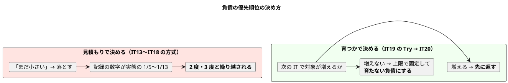
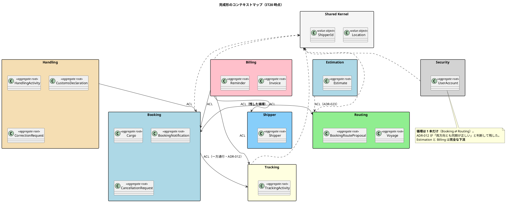

# 第 21 章：IT20 育つ負債を止める

## このイテレーションのゴール

**育つ負債 2 件を止め、正典に残った未判断を決着させ、見積一覧を毎朝使える形にする。**

最後のイテレーションです。新規ストーリーはありません（SP 0）。達成は **「育つ負債を止めたか」** と **「未判断を減らしたか」** で測ります。

| 指標 | 値 |
| :--- | :--- |
| テスト数 | **1,578**（IT19 比 **+20**） |
| 行カバレッジ / 分岐 | 92.9% / 72.9% |
| 変更規模 | 95 ファイル・+1,835 / -264 |
| 新規 ADR | 1 件（ADR-025） |
| レビュー指摘 | 高 10 / 中 14 / 低 12（**高 10 件すべて対応**） |

## 実装

### 「育つ負債」という考え方

第 19 章の Try で決めた方針を実行します。

> **落とす順序は見積もりでなく「次の IT で対象が増えるか」で決める。**

| # | 内容 | 実装前 | 結果 |
| :--- | :--- | :--- | :--- |
| **D5** | ADR-024 の契約を検査にする | **検査の外**（コメントに書いただけ） | **完了**。`EntityEncapsulationTest` |
| **D1** | `Cargo` の行数 | **500 行・猶予 0**（上限ちょうど） | **完了**。**485 行・猶予 15 行** |

D1 の緊急性が、ふりかえりに書かれています。

> **`Cargo` は猶予 0 行だった。** 次に 1 メソッド足せば Checkstyle が赤になる状態であり、**「余力があれば」に回していれば IT21 の最初の変更が止まっていた**。

**負債の大きさではなく、「次に何かしたときに何が起きるか」で優先順位を決める**という基準です。

第 19 章の C1（委譲アクセサ 249 個）で採った「39 個を返し、残り 210 個を上限で固定する」も、この考え方です。**返せない負債でも、育たなくすることはできます。**

### 規則を一般化せずに検査へ落とす

D5（ADR-024 の契約を検査にする）の実装に、重要な判断があります。

> **K2. 規則を一般化せずに検査へ落とした**
>
> D5 は「集約ルート以外は呼べない」と書けば **3 行で済んだ**。**そう書かなかった。**
>
> ADR-024 が定めているのは**メソッドごとに呼んでよい相手を書き分けた表**であり、一般化すると `ProposedRoute.of` を集約ルートへ移すことになって**探索と提案の分離が壊れる**。
>
> **（型・メソッド・呼んでよい相手）の 3 つ組**で書いたことで、`ExceptionOccurrence.raise` や `commandService.resolve` を誤検知せず、**設計も変えずに代償を返せた**。

**検査を単純にするために設計を歪めない**、という判断です。「集約ルート以外は呼べない」という一般則のほうが検査は書きやすいのですが、それは ADR が定めた契約ではありません。

**検査は設計に合わせるものであって、設計を検査に合わせるものではありません。**

### 新しく足した安全装置に、過去の失敗が 3 種類再現した

このイテレーションの最も重い発見です。

> ### P1. 新しく足した安全装置そのものに、過去の失敗が 3 種類再現した
>
> | 装置 | 再現した失敗 | 由来 |
> | :--- | :--- | :--- |
> | `EntityEncapsulationTest` | **メソッド参照を素通り**（形が違えば通る） | 「緑のテストと壊れ方の設計は別物」 |
> | `EntityEncapsulationTest` | 契約表が**文字列の名簿**で、実在を誰も確かめていない | 「検査は未登録を素通りさせない」（ADR-015 で 3 IT 素通り） |
> | `RecentBusinessTime` | 真夜中の順序崩れを**直しきれていなかった**（01:00 で逆転） | 「安全装置は破るテストで固定する」 |
> | `CargoMisrouteTest` | テスト名と検証内容が矛盾し、**欠陥を固定していた** | 「コメントは仕様として読み実装と突き合わせる」 |

そして原因の分析が、第 20 章の P1 の続きになっています。

> IT19 のふりかえり Try T1「検査を書くときは**過去に起きた事故の粒度で Red を作る**」は、**型とメソッドの粒度までは効いた**。**呼び出しの形（直接呼び出し / メソッド参照 / リフレクション）の粒度には届かなかった。**

| IT | 検査の粒度 | 事故の粒度 |
| :--- | :--- | :--- |
| IT19 | 型 | **メソッド** |
| **IT20** | 型・メソッド | **呼び出しの形** |

**粒度を 1 段細かくするたびに、さらに 1 段細かい事故が出ます。** 20 イテレーション目でもこの追いかけっこは終わっていません。

4 番目の `CargoMisrouteTest` が特に重い形です。**テスト名と検証内容が矛盾し、欠陥を固定していました。** テストが「守っているつもりのもの」と「実際に守っているもの」が違い、しかも**テストが緑**です。

### レビューアがコードを書いて確かめた

Keep に、レビューの質についての観察があります。

> **K3. レビューアが実際にコードを書いて確かめた**
>
> tester が 3 種類のプローブを実際に書いて走らせ、**メソッド参照の素通り**と**真夜中の順序崩れ**を実測で示した。どちらも読むだけでは見つからず、こちらの「破壊検証で 4 メソッドすべて赤を確認した」という報告と**矛盾しない形で潜んでいた**。
>
> **「壊して赤」を実演したレビューは、意見ではなく事実を持ってくる。**

**報告と矛盾しない形で潜んでいた**というのが要点です。「4 メソッドすべて赤を確認した」は嘘ではありません。**しかし直接呼び出しでは赤になり、メソッド参照では素通りしました。**

### 検査は同型の既存欠陥を掘り出す

> **K4. 検査を足したことで、別の既存欠陥が芋づるで出た**
>
> キャプチャの重複検査（md5）を入れたところ、**レビューが指摘した 1 組に加えて既存の 2 組が即座に出た**。
>
> **検査は「今回の欠陥」を止めるだけでなく、同型の既存欠陥を掘り出す。** 手で数えていたら 3 組目は見つからなかった。

第 12 章の K3（検査が指摘より多くの越境を見つけた）と同じ観察です。**人は 1 件を見つけ、検査は全件を見つけます。**

### 2 リリース残っていた未判断を決着させる

`release_scope.md` は多通貨を「保留。Release 2.0 の料金設計時に判断する」と書いていました。**Release 2.0 も 2.1 も出荷済みで、判断されないまま 2 リリースが過ぎていました。**

ADR-025 は、実測から始めます。

| 対象 | 実測 | 数えた方法 |
| :--- | ---: | :--- |
| `domain-model.md` の「多通貨対応」の記述 | **1 か所** | `grep -n 多通貨 docs/design/domain-model.md` |
| DB の通貨列（相異なる列名） | **9 個** | `grep -rho "[a-z_]*_currency" …` |
| 通貨を跨ぐ演算の扱い | `requireSameCurrency` で**拒む** | `Money.java:87` |

> **「多通貨対応」と書いてあるが、対応してはいない。** 実装がしているのは「異なる通貨どうしの足し算・引き算を例外で止める」ことだけであり、**換算レートも、レートの有効期間も、表示通貨の選択も存在しない**。
>
> **この状態は「多通貨を保留している」のではなく、「単一通貨で動いている」。** 記述だけが別のことを言っている。

**決定は「日本円（JPY）単一とする」**。実装を変えるのではなく、**実装が既にそうであることを認める**判断です。

**数え方まで書いている**のが、IT16 以降の運用（返済枠に実測値を添える）の定着形です。

### 20 イテレーションを経たドメインモデル

## DDD の観点

### 戦略的 DDD

**境界は完成しました。** 最後のイテレーションで動いたのは、境界ではなく **境界を守る検査の粒度**です。

20 イテレーションを通しての戦略的 DDD の軌跡は次のとおりです。

| IT | 出来事 |
| :--- | :--- |
| IT1 | 共有カーネルを 2 型に限る（ADR-005）。Security を支援サブドメインに（ADR-007） |
| IT2 | 最初の ACL ポート。ポートは利用側が定義する |
| IT6 | **Handling が独立（ADR-010）。同期から結果整合へ反転（ADR-009 改訂 1）** |
| IT8 | **循環を断つ（ADR-012）。断てないものは名前で残す** |
| IT11 | SQL の層にも検査を置く（ADR-015） |
| IT15 | 越境の失敗がどこに出るかを名指しする（ADR-021） |
| IT18 | 最後の BC が立つ。正典の記述が古かった（ADR-023） |
| **IT20** | **未判断の決着（ADR-025）** |

**境界は 6 回動きました**（新設 7 回・統合の解消 1 回・循環の解消 1 回）。設計フェーズで引いた境界が、そのまま最後まで残ったわけではありません。

### 戦術的 DDD

このイテレーションで直したのは、**集約の大きさ**と**カプセル化の契約**です。

| 対象 | 内容 |
| :--- | :--- |
| `Cargo` の行数 | 500 行 → **485 行**（Checkstyle の上限に対する猶予を作る） |
| ADR-024 の契約 | （型・メソッド・呼んでよい相手）の 3 つ組で検査 |

`Cargo` が 500 行まで育ったことには意味があります。**Booking Context の中核集約であり、20 イテレーションのあいだ機能が積み重なりました**（予約・経路・確定・追跡番号・誤配・引取・確認コード・キャンセル）。

**上限に当たったこと自体が、分割を検討すべき信号**です。ただしこのイテレーションでは分割せず、猶予を作るに留めています。**分割は設計判断であり、時間切れ間際に行うものではない**という判断です。

### ユビキタス言語

**ADR-025 は、ことばと実装のずれを「実装に合わせて」解消した唯一の例**です。

これまでの是正は、ほぼすべて「ドキュメントが正しく、実装が届いていない」形でした。ADR-025 は逆です。

> **「多通貨対応」と書いてあるが、対応してはいない。** …**この状態は「多通貨を保留している」のではなく、「単一通貨で動いている」。記述だけが別のことを言っている。**

**実装が既に決めていたことを、ことばが認めていませんでした。** 「保留」ということばは「まだ決めていない」を意味しますが、実際には決まっていました（決めた記録が無かっただけです）。

**判断されないまま 2 リリースが過ぎた「保留」は、保留ではありません。**

## 設計判断

| ADR | 決めたこと |
| :--- | :--- |
| **ADR-025** | 本システムの通貨は日本円（JPY）単一とする |

## このイテレーションの学び

計画 9 タスクのうち 8 タスクを完了。**育つ負債 2 件を止め、未判断を決着させました。**

Keep は、負債と検査についての到達点です。

| Keep | 内容 |
| :--- | :--- |
| **K1. 育つ負債を「次の IT で対象が増えるか」で先に返した** | `Cargo` は猶予 0 行だった |
| **K2. 規則を一般化せずに検査へ落とした** | 検査のために設計を歪めない |
| **K3. レビューアが実際にコードを書いて確かめた** | 意見ではなく事実 |
| **K4. 検査を足したことで、別の既存欠陥が芋づるで出た** | |

Problem は、20 イテレーション目でも同じ形が続くことを示します。

| Problem | 内容 |
| :--- | :--- |
| **P1. 新しく足した安全装置そのものに、過去の失敗が 3 種類再現した** | |
| **P2. U4 が、U5 が解こうとした問題を新しく作った** | 3 視点が独立に同じ箇所を指した |
| **P3. 「是正はタスク 7」と書いたまま、タスク 7 を完了にした** | |
| **P4. マニュアルのキャプチャが 1 枚も更新されていなかった** | |
| **P5. 記録と実測のずれが 10・11 度目** | |

P5 が示すとおり、**「記録するときの数え方」は 20 イテレーションかけても解決していません**。着手時に数え直す習慣は定着しましたが、根の問題は残ったままです。

そして P1 が、このプロジェクトの最後の学びです。

> **検査を書けば守られる。ただし、その検査自身が守られているかは、また別の検査が要る。**

---

- 前: [第 20 章：IT19 正典に届いていない実装を返す](20-iteration-19.md)
- 次: [第 22 章：20 イテレーションで積み上がったもの](22-conclusion.md)
