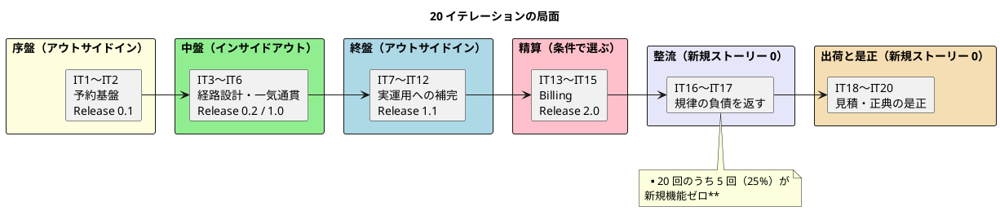
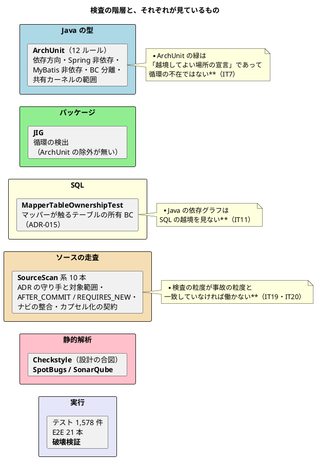

# 第 22 章：20 イテレーションで積み上がったもの

20 イテレーション、36 ユーザーストーリー、117 ストーリーポイント。実装 553 ファイル、テスト 1,578 件、ADR 25 本。v2.1.0 として出荷済み。

この章では、時系列を離れて **何が積み上がり、何が積み残ったか**を見ます。

## 実績

| 項目 | 値 |
| :--- | :--- |
| イテレーション | 20（うち新規ストーリー無しが 5 回） |
| ユーザーストーリー | US01〜US36（117SP） |
| 境界づけられたコンテキスト | 7 ＋ 共有カーネル ＋ Security サブドメイン |
| ADR | 25 本（うち 2 本が過去の ADR を置き換え／改訂） |
| 実装 | 553 ファイル |
| テスト | 1,578 件（Java 1,537 ＋ E2E 21） |
| 行カバレッジ / 分岐 | 92.9% / 72.9% |
| Flyway マイグレーション | `common` だけで V41 |

### イテレーションごとの局面



## 境界は 6 回動いた

設計フェーズで引いた境界が、そのまま最後まで残ったわけではありません。

| IT | 境界の変化 | きっかけ |
| :--- | :--- | :--- |
| IT1 | Shipper / Security / 共有カーネル | 設計どおり |
| IT2 | Booking。**最初の ACL** | 設計どおり |
| IT3 | Routing | 設計どおり |
| IT6 | Tracking。**Handling が独立**（ADR-010 が ADR-002 を置換） | **実装したら言語が分岐していた** |
| IT8 | **Booking ⇄ Tracking の循環を断つ**（ADR-012） | **JIG がクローズ後に検出** |
| IT13 | Billing | 設計どおり |
| IT18 | Estimation。**Routing の探索に接続**（ADR-023） | **正典の記述が古かった** |

**設計どおりに立った BC が 4 つ、実装が設計を変えたものが 3 つ**です。

そして、変えた根拠はいずれも**実装から出てきました**。

| 変更 | 根拠 |
| :--- | :--- |
| Handling の独立 | 同じ BC の中に、対応する 3 組の型が別々に定義されていた |
| 循環の解消 | JIG のパッケージ図。ArchUnit は緑だった |
| Estimation の接続先 | 「将来の外部サービス」は ADR-006 で来ないと決まっていた |

**境界は机上では決まらず、動かして初めてずれが見えます。**

## 戦術的 DDD で繰り返し効いたもの

### 「ひと組で持つ」値オブジェクト

本シリーズで最も繰り返し現れた戦術です。

| 値オブジェクト | IT | ひと組にした理由 |
| :--- | :--- | :--- |
| `CargoRouting` | IT5 | 「割り当て済なのに区間が無い」を作らせない |
| `CorporateContract` | IT7 | 割引率だけでは請求書に根拠を書けない |
| `HazardousDeclaration` | IT9 | **3 項目そろって初めて申告** |
| `InvoiceAmounts` | IT13 | 同時に決まり、確定後は一緒に動く |
| `Issuance` / `Payment` | IT14 | |
| `CorrectionRequest.Details` | IT12 | Checkstyle が引数 13 個で止めた |

判断の型は 1 つです。**「片方だけが設定されている状態が業務上あり得ない」なら、2 つのフィールドではなく 1 つの値オブジェクトにする。**

そして `CargoRouting` は、6 イテレーション後（IT11）に `misrouted(itinerary)` を足すだけで拡張できました。**最初にひと組にしておいた設計が、後から効きます。**

### 状態を導出せず持つ

| 対象 | IT | 判断 |
| :--- | :--- | :--- |
| `UserAccount.failedAttempts` | IT1 | 認証ログから数え直さない |
| `TrackingExceptionEvent.statusBefore` | IT10 | 荷役の履歴から導き直さない |
| `InvoiceAmounts`（丸め後の値と税率） | IT13 | 再計算しない |

一方、**導出したもの**もあります。

| 対象 | IT | 判断 |
| :--- | :--- | :--- |
| `Voyage.origin()` / `destination()` | IT3 | `Schedule` から導く |

**基準は「導出元が後から変わるか」**です。`Schedule` は不変なので安全に導出でき、荷役の履歴は増え、税率は改正されます。

### BC をまたいで型を共有しない

| 対 | IT |
| :--- | :--- |
| `CargoRoutingStatus`（Booking）と Routing の経路状態 | IT5 |
| `HandlingType` と `TrackingEventType` | IT6 |
| Billing の `Money` と Routing の `Money` | IT13 |

**値が対応していても、別の事実なら別の型**です。共有すると、片方の都合でもう片方が動きます。

そして IT6 では、**この分離が BC の境界を決める根拠になりました**。

## 同期と非同期の判断基準

3 つの ADR を経て洗練されました。

| ADR | IT | 基準 |
| :--- | :--- | :--- |
| ADR-009（改訂 1） | IT6 | 状態の伝播はイベント。コマンド・問い合わせは同期 |
| ADR-012 | IT8 | **逆向きのポートを足す前に順方向を疑う** |
| ADR-021 | IT15 | **失敗がどこに出るかを名指しする** |

最終的な形は、**「画面の前にいる人が、その結果で何かできるか」**です。

```java
/**
 * <p><strong>同期のポートにしない</strong>（ADR-021）。承認するのは追跡管理者、
 * 請求するのは経理担当者である。<strong>承認画面の前にいる人は
 * キャンセル料について何もできない</strong>ため、その場で結果を返す必要が無い。
 */
```

**技術的な好みではなく、業務の役割分担で決めています。**

## 検査の階層

このプロジェクトが 20 イテレーションで積み上げた、最も特徴的な資産です。



各層は、前の層が見ていないものを見ています。**そしてどの層も、それが見ていないものがあります。**

## 効かなかったもの

### 宣言だけでは守られない

19 イテレーションのうち **9 回**、同じ形が現れました。

| IT | 形 |
| :--- | :--- |
| IT1 | マニュアルが実装に無い機能を約束した |
| IT7 | 「宣言はしたが実装が無い」6 件 |
| IT8 | 「宣言と実装の食い違い」5 件 |
| IT11 | コメントが実装より強い保証を主張した 3 件 |
| IT12 | マニュアルが実装より多くを主張した |
| IT15 | **ADR の規則をコードの半分が守っていなかった**（9 IT のあいだ） |
| IT16 | 宣言された規則が対象に届いていない 3 件 |
| IT18 | 正典の記述が古かった |
| IT19 | 正典にあって実装に無い 2 件・**ADR が自分の主張を打ち消した**・「記録した」と書いて記録が無かった |

**ADR に書いても守られません。コメントに書いても守られません。マニュアルに書くと、むしろ嘘になります。**

対策として IT16 で「ADR に守り手と対象範囲を書く」運用を入れ、「守らない」と書くことを許しました。**すべてを検査に落とすのではなく、検査していないものを検査していないと読める状態にする**という決着です。

### 記録するときの数え方

**20 イテレーションかけても解決していません。**

| 項目 | 記録 | 実測 | 倍率 |
| :--- | ---: | ---: | ---: |
| C2（貨物フィクスチャ） | 7 | 39 | 5.6 |
| C3（レコード） | 2 | 21 | 10.5 |
| R7（列の多い一覧） | 1 | 13 | 13 |
| C1（委譲アクセサ） | 34 | 249 | 7.3 |

> **着手時に数え直す習慣は効いている**（毎回ここで気づく）。効いていないのは**記録するときの数え方**である。

そして小さい数字の上に「落とす（先送りする）判断」が立っていました。**負債の見積もりが 5〜13 倍ずれるなら、先送りの判断そのものが誤りです。**

最終的な対処は、見積もりをやめることでした。

> **落とす順序は見積もりでなく「次の IT で対象が増えるか」で決める。**

### 受入基準に現れない観点

**到達性の抜けが 5 回**繰り返されました。

| IT | 抜けた観点 |
| :--- | :--- |
| IT2 | ロールがその画面を**開けるか** |
| IT3 | 開いた画面から**次に何ができるか** |
| IT4 | 置いてあるボタンを**実際に押せるか** |
| IT5 | **操作を終えた後にもう一度開けるか** |
| IT17 | 新しく開いた画面の中のボタンを、そのロールで押せるか |

> **受入基準には現れない。** 業務では当たり前の動き（確定した後にもう一度見たい）が、ストーリーの文には書かれない。

**受入基準を全部満たしても、業務は回らないことがあります。**

### 全緑は到達点ではない

**7 イテレーション連続で、全緑の状態からレビューが高優先度の欠陥を出しました。**

| IT | 全緑からの発見 |
| :--- | ---: |
| IT9 | 16 件（3 つの独立した経路から） |
| IT10 | 10 件 |
| IT12 | 3 件 |
| IT13 | 13 件 |
| IT14 | 18 件 |
| IT15 | 5 件 |
| IT19 | 11 件 |

IT9 の完了報告が、この現象を最もよく説明しています。

> テスト 926 件・E2E 8 本・静的解析すべてが緑の状態から、**安全装置の破壊検証が 2 件、E2E とキャプチャ生成が 5 件、レビュー 5 視点が 9 件**の欠陥を出した。

**同じコードに違う見方を当てると、違うものが見つかります。**

## Spring Boot で DDD を書くために

20 イテレーションの実績から、再現できる形にまとめます。

### 最初に決めて、最後まで変えなかったこと

| 決めごと | 効果 |
| :--- | :--- |
| **1 トップレベルパッケージ = 1 BC** | ArchUnit が検査できる形。BC が増えても構成が読める |
| **ドメインは POJO**（Spring も MyBatis も知らない） | フレームワークの都合で設計が歪まない |
| **共有カーネルは 2 型だけ**（ADR-005） | 「みんなが使うもの置き場」にならない |
| **ポートは利用側が定義し、提供側が実装する** | 上流のことばが下流に侵食しない |
| **JPA を採らない**（ADR-004） | 集約の形が O/R マッパーに引っ張られない |

**この 5 つは 20 イテレーションを通して一度も変わっていません。**

### 最初に決めたが、変えたこと

| 決めごと | 変更 |
| :--- | :--- |
| Handling は Tracking の一部（ADR-002） | **独立 BC へ**（ADR-010・IT6） |
| BC 間 ACL は同期・同一トランザクション（ADR-009 初版） | **結果整合へ反転**（ADR-009 改訂 1・IT6） |
| `CorporateShipper extends Shipper` | **値オブジェクトのひと組へ**（IT7） |
| 見積のルート候補はスタブ | **Routing の探索へ**（ADR-023・IT18） |
| `domain/model` は 1 パッケージ | **構成要素ごとに分割**（ADR-024・IT19） |

**変えた記録が残っていることが重要です。** ADR-009 は改訂前の記述を「代替案」の節に残し、ADR-010 は ADR-002 を「置き換える」と明記しています。

### 検査を書くときに守ること

20 イテレーションで積み上がった経験則です。

| 経験則 | 由来 |
| :--- | :--- |
| **`allowEmptyShould(true)` を使わない** | 対象 0 件の検査は緑になる（IT1） |
| **違反を作って赤になることを確かめる** | 「入れたつもり」の安全装置が 4 件（IT1） |
| **破壊検証のリストを自分で作らない** | 自分で選ぶと守れていると思うものしか載らない（IT10 → IT11） |
| **実コードの違反を探してから検査を書く** | 最小の違反例だけだと実コードを見逃す（IT11・IT19） |
| **名簿方式は未登録を素通りさせる** | `handling_correction` が 3 IT 漏れた（IT11 → IT16） |
| **検査の粒度を事故の粒度に合わせる** | 型 → メソッド → 呼び出しの形（IT19 → IT20） |
| **検査のために設計を歪めない** | 3 行の一般則ではなく 3 つ組で書く（IT20） |
| **ソースを読む検査は、ソースを入力に宣言する** | でないとインクリメンタルビルドに飛ばされる（IT19） |

### 負債の扱い方

| 経験則 | 由来 |
| :--- | :--- |
| **返済枠を時間として最初に確保する** | 「余力次第」は繰り越されて固定化する（IT1 → IT2） |
| **返済枠には実測値を添える** | 記録は実態の 1/5〜1/13（IT16） |
| **着手時に数え直す** | 記録は着手時点では古い（IT17） |
| **落とす順序は「次の IT で対象が増えるか」で決める** | 見積もりは当てにならない（IT19 → IT20） |
| **返せない負債は上限で固定して育たなくする** | 委譲アクセサ 249 個（IT18） |
| **やらないことを名前で記録する** | 決着は「実装する」だけではない（IT9・IT11） |

## 最後に

本シリーズが 20 章にわたって記録したのは、**設計が正しかった物語ではありません**。

- 境界は 3 回引き直しました
- 判断を 1 回反転させました（同期 → 結果整合）
- ADR に書いた規則が、9 イテレーションのあいだ半分守られていませんでした
- 負債の記録は、実態の 5〜13 分の 1 でした
- 全緑の状態から、7 イテレーション連続で高優先度の欠陥が出ました

そして 20 イテレーション目に、こう書かれています。

> **新しく足した安全装置そのものに、過去の失敗が 3 種類再現した。**

**DDD は「正しく設計する方法」ではなく、「間違いに気づける形で作る方法」です。**

境界を引くから、越境が見えます。ことばを揃えるから、ずれが見えます。集約を分けるから、不変条件がどこにあるかが分かります。そして検査に落とすから、**守られていないことが赤になります**。

この実装が最終的に手にしたのは、完璧な設計ではなく、**間違ったときに気づく手段の階層**でした。

---

- 前: [第 21 章：IT20 育つ負債を止める](21-iteration-20.md)
- [シリーズ概要へ戻る](index.md)

## 関連シリーズ

同じ実装（`java/take-6`）を別の軸で扱っています。

| シリーズ | 軸 |
| :--- | :--- |
| [実践 AI 駆動開発](../ai-driven-development/index.md) | 誰が・どうやって書いたか（開発プロセス） |
| [XP によるドメイン駆動設計の実践](../xp-domain-driven-design/index.md) | どの規律がモデルを動かしたか |
| [エンタープライズアーキテクチャの 4 観点](../enterprise-architecture/index.md) | 完成した構造の断面 |
