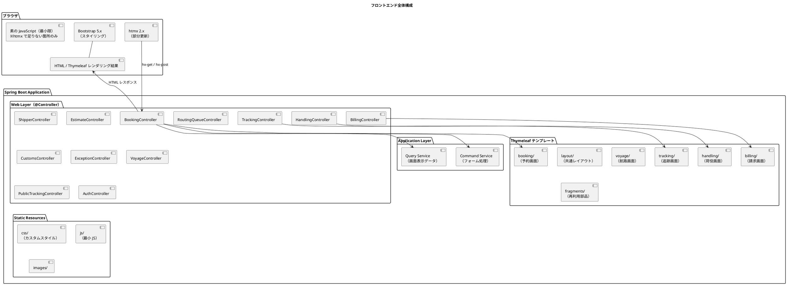
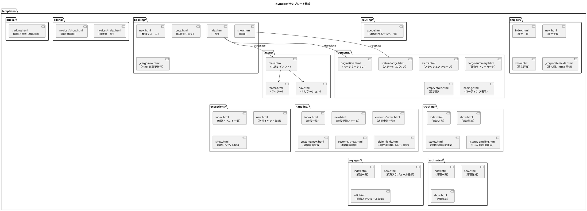
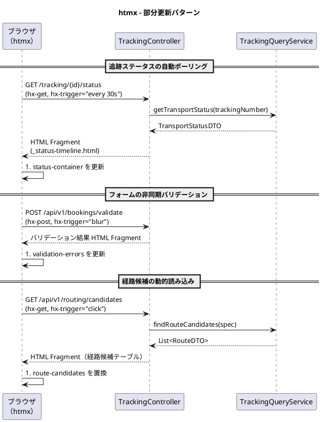
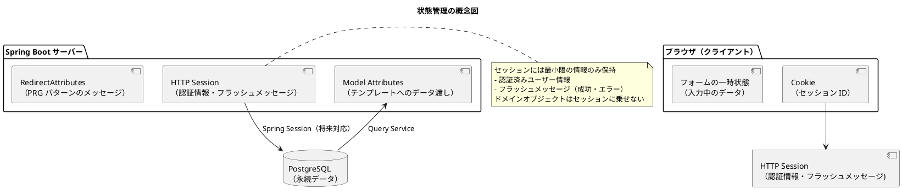

# フロントエンドアーキテクチャ - 国際貨物輸送管理システム

## 概要

本ドキュメントでは、国際貨物輸送管理システムのフロントエンドアーキテクチャを定義する。
業務系 Web システムとして、**Thymeleaf による SSR（サーバーサイドレンダリング）** を基本とし、
部分的な動的更新に **htmx 2.x** を組み合わせることで、シンプルかつ保守性の高い UI を実現する。

## アーキテクチャパターン選択

### SSR + htmx の選定理由

| 評価軸 | SPA（React/Vue） | **SSR + htmx（採用）** |
| :--- | :--- | :--- |
| 実装複雑度 | 高（フロントエンドビルドパイプライン、状態管理が必要） | **低**（Spring Boot に統合、追加ビルド不要） |
| SEO / アクセシビリティ | 追加対応が必要 | **容易**（HTML がサーバーで生成される） |
| リアルタイム更新 | 容易（WebSocket / SSE） | **htmx で部分更新**（十分な要件を満たす） |
| 開発者体験（バックエンド重視） | フロント専門知識が必要 | **Java エンジニアが一貫して開発可能** |
| 初期表示速度 | 遅い（JS バンドルの読み込み） | **速い**（HTML を直接レスポンス） |

本システムは業務系 Web アプリケーションであり、画面数は限定的で、リアルタイム更新要件も荷物追跡ステータスの部分更新が主である。
SPA の複雑さを導入するメリットがなく、Spring Boot との統合が容易な **Thymeleaf + htmx** を採用する。

## 全体構成



## 画面構成

画面一覧・画面遷移図・各画面のワイヤーフレームは [UI 設計](ui_design.md) を参照。

- 画面一覧：[UI 設計 - 画面一覧](ui_design.md#画面一覧)
- 画面遷移図：[UI 設計 - 画面遷移図](ui_design.md#画面遷移図)
- 画面詳細設計：[UI 設計 - 画面詳細設計](ui_design.md#画面詳細設計)

## コンポーネント設計方針

### Thymeleaf テンプレート構成



### Thymeleaf テンプレート設計原則

| 原則 | 内容 |
| :--- | :--- |
| **レイアウト継承** | `th:replace` / `th:insert` で共通レイアウト（`layout/main.html`）を適用する |
| **フラグメント分離** | 再利用可能な UI 部品は `fragments/` に切り出す |
| **htmx 用フラグメント** | 部分更新対象の HTML は `_prefix` 付きフラグメントとして定義する |
| **フォームオブジェクト** | フォームデータは専用のフォームオブジェクト（`BookCargoForm`）でバインドする |
| **DTO の使用** | テンプレートに渡すデータは Query Service からの DTO を使用する。ドメインモデルを直接渡さない |

## htmx による動的更新

### htmx 適用パターン



### htmx 使用ガイドライン

| ユースケース | htmx 属性 | 説明 |
| :--- | :--- | :--- |
| **フォーム送信（非同期）** | `hx-post`, `hx-target`, `hx-swap` | フォーム送信後に特定領域のみ更新 |
| **ステータスポーリング** | `hx-get`, `hx-trigger="every 30s"` | 追跡ステータスを定期取得 |
| **インクリメンタル検索** | `hx-get`, `hx-trigger="input changed delay:300ms"` | 検索フォームの入力に応じて結果を更新 |
| **確認ダイアログ** | `hx-confirm` | 削除・キャンセル操作前の確認ポップアップ |
| **ローディング表示** | `hx-indicator` | リクエスト中のスピナー表示 |
| **ページネーション** | `hx-get`, `hx-target` | ページ切り替えを部分更新で実現 |

### htmx コントローラー設計

htmx からのリクエストは `HX-Request: true` ヘッダーで識別する。
通常のページリクエストと htmx リクエストを同一エンドポイントで処理する場合は、
フラグメントのみを返すか全ページを返すかを `@RequestHeader("HX-Request")` で判定する。

```java
@GetMapping("/tracking/{trackingNumber}/status")
public String getTrackingStatus(
    @PathVariable String trackingNumber,
    @RequestHeader(value = "HX-Request", required = false) boolean isHtmxRequest,
    Model model
) {
    model.addAttribute("status", trackingQueryService.getStatus(trackingNumber));
    // htmx リクエストの場合はフラグメントのみ返す
    if (isHtmxRequest) {
        return "tracking/_status-timeline :: statusTimeline";
    }
    return "tracking/show";
}
```

## 状態管理

### サーバーサイド状態管理

SSR アーキテクチャでは、アプリケーション状態はサーバー側で管理する。
ブラウザ側では最小限のセッション情報のみを保持する。



### PRG パターン（Post-Redirect-Get）

フォーム送信後は必ず PRG パターンを適用し、ブラウザのリロードによる二重送信を防ぐ。

| 操作 | フロー |
| :--- | :--- |
| 予約登録成功 | `POST /bookings` → `redirect:/bookings/{bookingId}` |
| 荷役登録成功 | `POST /handling` → `redirect:/handling` |
| 経路割り当て成功 | `POST /bookings/{id}/route` → `redirect:/bookings/{id}` |

成功・エラーメッセージは `RedirectAttributes.addFlashAttribute()` で渡し、
`fragments/alerts.html` フラグメントで表示する。

## セキュリティ考慮

### CSRF 対策

Spring Security の CSRF 保護が自動的に有効になる。
Thymeleaf と Spring Security を組み合わせることで、
`<form>` タグに自動的に CSRF トークンが埋め込まれる。

```html
<!-- Thymeleaf の form は自動的に CSRF トークンを含む -->
<form th:action="@{/bookings}" th:method="post" th:object="${bookCargoForm}">
  <!-- Spring Security が _csrf hidden field を自動付与 -->
</form>
```

htmx の `hx-post` / `hx-put` / `hx-delete` 使用時は、CSRF トークンをリクエストヘッダーに含める。

```html
<!-- meta タグに CSRF トークンを埋め込む -->
<meta name="_csrf" th:content="${_csrf.token}"/>
<meta name="_csrf_header" th:content="${_csrf.headerName}"/>

<!-- htmx のグローバル設定で CSRF ヘッダーを自動送信 -->
<script>
  document.addEventListener('htmx:configRequest', (event) => {
    const csrfToken = document.querySelector('meta[name="_csrf"]').content;
    const csrfHeader = document.querySelector('meta[name="_csrf_header"]').content;
    event.detail.headers[csrfHeader] = csrfToken;
  });
</script>
```

### 入力検証

フォームの入力検証は 2 段階で行う。

| 段階 | 実装 | 内容 |
| :--- | :--- | :--- |
| **クライアントサイド** | HTML5 / Bootstrap バリデーション | `required`, `pattern` 属性による即時フィードバック |
| **サーバーサイド** | Spring Validation（`@Valid`） | Bean Validation アノテーションで詳細なビジネスルール検証 |

サーバーサイドバリデーションエラーは `BindingResult` で受け取り、
Thymeleaf の `th:errors` でフィールドごとにエラーメッセージを表示する。

### XSS 対策

Thymeleaf の `th:text` は HTML エスケープを自動的に行う。
HTML をそのまま出力する `th:utext` は原則として使用しない。
ユーザー入力を HTML として出力する場合は、DOMPurify 等でサニタイズする。

## ディレクトリ構成

```
apps/cargo-tracker/src/main/
├── java/com/example/cargotracker/
│   ├── booking/
│   │   └── infrastructure/
│   │       └── web/
│   │           ├── BookingController.java      # Thymeleaf 画面用
│   │           └── BookingRestController.java  # htmx / API 用
│   ├── tracking/
│   │   └── infrastructure/
│   │       └── web/
│   │           └── TrackingController.java
│   └── (各コンテキスト同様)
│
└── resources/
    ├── templates/
    │   ├── layout/
    │   │   ├── main.html               # 共通レイアウト
    │   │   └── nav.html                # ナビゲーション
    │   ├── fragments/
    │   │   ├── alerts.html             # フラッシュメッセージ
    │   │   ├── pagination.html         # ページネーション
    │   │   └── status-badge.html       # ステータスバッジ
    │   ├── booking/
    │   │   ├── index.html
    │   │   ├── new.html
    │   │   ├── show.html
    │   │   ├── route.html
    │   │   └── _cargo-row.html         # htmx 部分更新用フラグメント
    │   ├── tracking/
    │   │   ├── index.html
    │   │   ├── show.html
    │   │   └── _status-timeline.html   # htmx 部分更新用フラグメント
    │   ├── handling/
    │   │   ├── index.html
    │   │   └── new.html
    │   ├── billing/
    │   │   └── invoices/
    │   │       ├── index.html
    │   │       └── show.html
    │   └── auth/
    │       └── login.html
    └── static/
        ├── css/
        │   └── custom.css              # カスタムスタイル（Bootstrap 上書き）
        ├── js/
        │   └── app.js                  # htmx 設定・最小 JS
        └── images/
```
