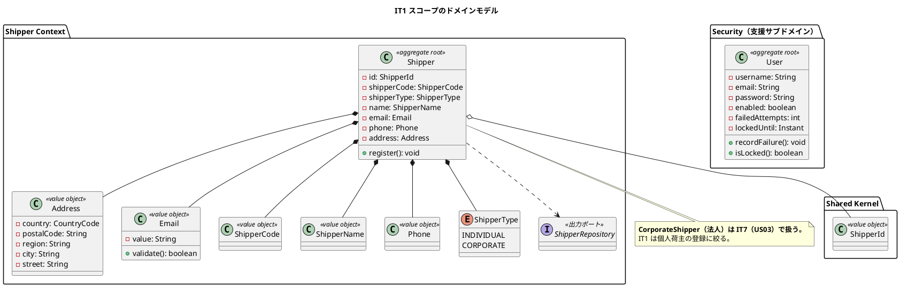
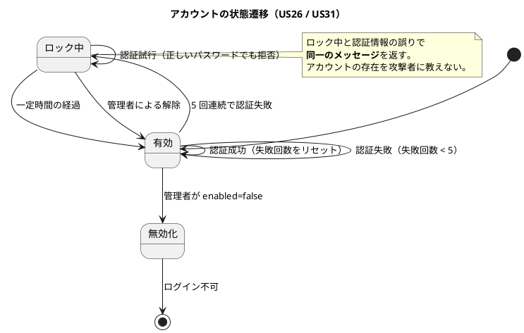
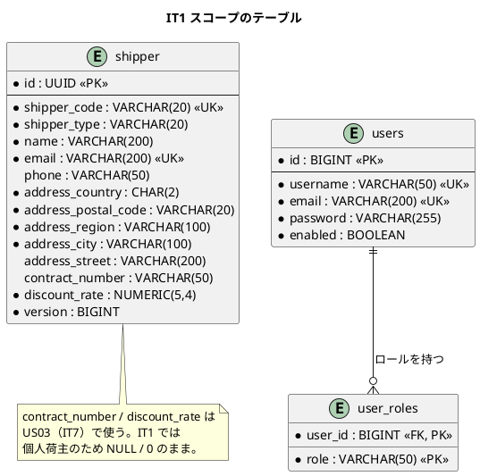
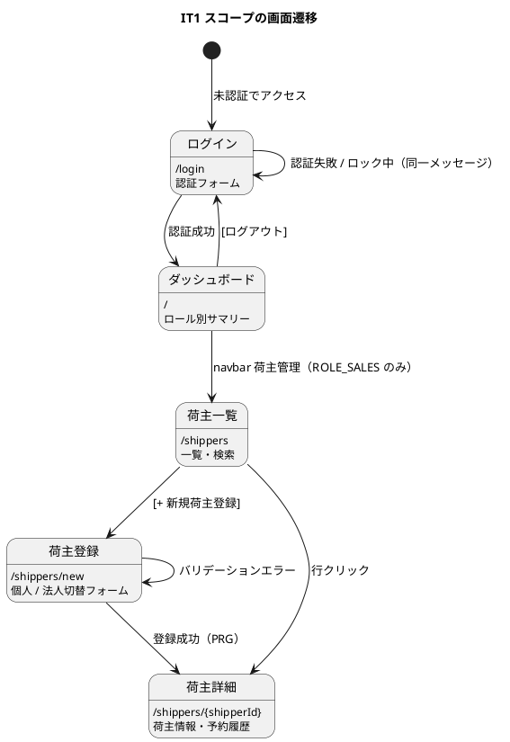

# イテレーション 1 計画

## 概要

| 項目 | 内容 |
|------|------|
| **イテレーション** | IT1 |
| **リリース** | Release 0.1 予約基盤 |
| **ゴール** | 認証と荷主登録で「画面 → ドメイン → DB」を貫通させ、**ウォーキングスケルトン**を立ち上げる |
| **目標 SP** | 9 |
| **GitHub Milestone** | [java/take-6] Release 0.1 予約基盤 |

---

## ゴール

### イテレーション終了時の達成状態

1. **ウォーキングスケルトンが通っている**: ログインして荷主を登録し、一覧で確認できる。Thymeleaf → Controller → Application → Domain → MyBatis → PostgreSQL が 1 本つながる
2. **RBAC の骨格ができている**: `SecurityConfig` により、ロールに応じた画面の出し分けと 403 が機能する
3. **ArchUnit のルールが実効化されている**: 対象クラスが 0 件で無効化していたルールを、実装の追加にあわせて有効にする

### 成功基準

- [x] ログインしてダッシュボードが表示される（US26）
- [x] ログアウトでセッションが破棄され、ブラウザバックで業務画面に戻れない（US27）
- [x] 5 回連続の認証失敗でアカウントがロックされ、**正しいパスワードでも拒否される**（US31）
- [x] 荷主を登録し、一覧・詳細で確認できる（US02）
- [x] `./gradlew check` が緑（Checkstyle / SpotBugs / テスト）
- [x] **ArchUnit のルール 1・2・3 を有効化し、違反を実際に検出できることを確認する**（ルール 6 も前倒しで有効化した）
- [x] Heroku 開発環境にデプロイし、ログイン画面が表示される
- [x] ユーザーマニュアル（ログイン・荷主登録）が `/manual/` で閲覧できる

> **カバレッジ閾値の有効化は IT1 では行いません。** 実装量が少ない段階で全体 75% を強制すると、閾値を満たすためのテストを書くことになります。IT2 終了時に実測を見て有効化します。

---

## ユーザーストーリー

### 対象ストーリー

| ID | ユーザーストーリー | SP | 優先度 | Issue |
|----|-------------------|----|----|------|
| US26 | システムにログインする | 3 | 必須 | [#480](https://github.com/k2works/case-study-cargo-tracker/issues/480) |
| US27 | システムからログアウトする | 1 | 必須 | [#481](https://github.com/k2works/case-study-cargo-tracker/issues/481) |
| US31 | 認証失敗が続いたアカウントを保護する | 2 | 必須 | [#482](https://github.com/k2works/case-study-cargo-tracker/issues/482) |
| US02 | 荷主を登録する | 3 | 必須 | [#483](https://github.com/k2works/case-study-cargo-tracker/issues/483) |
| **合計** | | **9** | | |

### なぜこの 4 件か

- **US26 / US27 / US31 は全機能の前提**です。認証が無い状態では、以降のどの画面もロール別の確認ができません
- **US02 は US04（貨物予約登録）の前提**です。荷主 ID を作る手段が無ければ予約フローが成立しません（レビュー H3 で「業務が止まる欠落」と指摘された箇所）
- **US04 は IT2 に分離**しました。IT1 は認証基盤・Thymeleaf レイアウト・MyBatis マッパーの初出が同時に発生するため、**地ならしの分を見込んで 9SP に抑えています**

---

## 設計（IT1 スコープ）

上流設計から本イテレーションの範囲だけを抜き出したものです。**正典は各設計ドキュメント**であり、ここは実装時に参照する範囲を絞った写しです。

### ドメインモデル図（Shipper Context + Security）

> **`CorporateShipper` と `ContractNumber` / `DiscountRate` は IT1 の対象外**です（US03 は IT7）。ただしテーブルの列と CHECK 制約は `V1__init.sql` に存在します。

### 状態遷移図（アカウントロック）

IT1 で状態を持つのは**アカウントのロック状態**のみです。荷主は状態を持ちません。

### ER 図（IT1 スコープ）

> **アカウントロックの状態を保持する列が `users` にありません。** `failed_attempts` と `locked_until` が必要です（下記「設計への反映が必要」を参照）。

### 画面遷移図（IT1 スコープ）

---

## 設計への反映が必要（当該 IT で対応）

検証（`validating-iteration-plan`）で見つかった、**設計ドキュメント側の欠落**です。IT1 の実装とあわせて設計にも反映します。

| # | 内容 | 対応 |
| :--- | :--- | :--- |
| 1 | ✅ `users` テーブルにアカウントロックの状態を保持する列が無い | `failed_attempts INTEGER NOT NULL DEFAULT 0` と `locked_until TIMESTAMPTZ` を `data-model.md` に追加し、`V2__account_lock.sql` を作成する。**ロック状態を導出で持つと、リクエストをまたいだ時に誤判定する** |
| 2 | ✅ `domain-model.md` に Security（支援サブドメイン）の記述が無い | `UserAccount` 集約とロックの不変条件を「9. Security サブドメイン」として追記済み。`data-model.md` は Security を支援サブドメインとして扱っているのに、ドメインモデル側に対応する記述が無い |
| 3 | ✅ `Address` が単一文字列・任意だった | **修正済み**（本計画の作成時に `domain-model.md` を 5 項目構成・番地以外必須に更新） |
| 4 | ✅ 認証・認可を共有カーネル（`shared`）に置いていた | ADR-005 は共有カーネルを `Location` / `ShipperId` の 2 要素に限っている。`UserAccount` / `Role` を支援サブドメイン `security` へ移し、**ArchUnit ルール 6 を IT1 で前倒し有効化**した（違反を実際に検出できることを確認済み）。`architecture_backend.md` / `test_strategy.md` / ADR-005 を同時更新 |

---

## 技術タスク

### 地ならし（このイテレーションでのみ発生する）

| タスク | 内容 |
| :--- | :--- |
| `SecurityConfig` | フォーム認証・RBAC・CSRF・`/actuator/health` と `/public/**` の除外 |
| 共通レイアウト | `layout/main.html`・`nav.html`・`fragments/alerts.html`（`architecture_frontend.md`） |
| MyBatis の初期設定 | `UUIDTypeHandler`・マッパー XML の配置規約 |
| Testcontainers 基底クラス | `PostgreSQLIntegrationTestBase`（シングルトンコンテナ） |
| 認可マトリクステスト | `AuthorizationMatrixTest`（`test_strategy.md` §3.5） |

### ユーザーマニュアル（US26 / US02 の画面を伴うため計上する）

**IT1 は画面を伴うイテレーションです。** マニュアル更新を計画時に見積もっておかないと、クローズ時に計画外の作業として現れ、締めが遅れるか更新自体が飛ばされます。

| タスク | 内容 |
| :--- | :--- |
| `docs/manual/` の初期構成 | `index.md`（目次）・`login.md`（ログイン / ログアウト）・`shipper.md`（荷主登録） |
| 画面キャプチャ | ログイン画面・ダッシュボード・荷主一覧・荷主登録・荷主詳細の 5 点 |
| 生成の確認 | `npx gulp manual:build` で HTML を生成し、`npx gulp deploy:docs` で `/manual/` に配信されることを確認する |

> 現在 `/manual/` は「未作成」のプレースホルダを配信しています。**IT1 で初めて実体が入ります。**

### ArchUnit ルールの有効化

実装が入るため、対象クラスが 0 件で無効化していたルールを有効にします。

| ルール | 対象 |
| :--- | :--- |
| 1. ドメイン層 → インフラ層の依存禁止 | `shipper` / `shared` の domain |
| 2. ドメイン層の Spring アノテーション禁止 | 同上 |
| 3. アプリケーション層 → インフラ層の直接参照禁止 | `shipper` の application |

> **有効化のたびに、違反を実際に検出できることを確認します。** `allowEmptyShould(true)` で通すことはしません。何も検査していないルールを緑にすると、実装が入った後も検査されていないことに気づけなくなります。

---

## 完了の定義（DoD）

各ストーリーは以下をすべて満たしたときに完了とします。**条件は書き写さず、正典を引用します。**

| 項目 | 正典 |
| :--- | :--- |
| 受け入れ基準 | [ユーザーストーリー](../requirements/user_story.md) の該当 US |
| テストレベルと責務 | [テスト戦略](../design/test_strategy.md) §1.3 / §3 |
| 品質ゲート（Checkstyle / SpotBugs） | [テスト戦略](../design/test_strategy.md) §6.2 |
| 画面仕様・ロール別の到達性 | [UI 設計](../design/ui_design.md) |
| ドメインの不変条件 | [ドメインモデル設計](../design/domain-model.md) |

加えて、本イテレーション固有の条件:

- [x] **ロール別・状態別の到達性を確認する**（`NavigationReachabilityTest`。導線が消えたときに落ちることを確認済み）。「そのロールが navbar / ダッシュボードから当該画面に到達できるか」（`ui_design.md` の DoD）
- [x] **Repository のテストは Testcontainers で書く**。H2 では書かない（ADR-003）
- [x] Heroku 開発環境にデプロイして動作を確認する（`npx gulp deploy:dev`）
- [x] **ユーザーマニュアルを更新し、`/manual/` に配信されることを確認する**（`npx gulp deploy:docs`）

---

## リスク

| リスク | 影響 | 対応 |
| :--- | :--- | :--- |
| 認証の地ならしが想定より膨らむ | IT1 が未達になる | US02 を IT2 に送る。**認証 3 件を優先する**（以降すべての前提であるため） |
| ベロシティ 12SP が過大 | 以降の計画が総崩れになる | **IT1 の実績が最初の検証**。未達ならベロシティを実績値に置き換えて IT2 以降を再計算する |
| ArchUnit の有効化で既存コードが落ちる | 実装が止まる | 骨格のみでクラスが少ない今のうちに有効化する。**後になるほど直す量が増える** |

---

## 参照

- [リリース計画](release_plan.md) — SP とイテレーション配分
- [リリーススコープ定義](release_scope.md) — スコープの正典と依存順序
- [ユーザーストーリー](../requirements/user_story.md) — US 採番の正典
- [テスト戦略](../design/test_strategy.md) — テストレベルと品質基準
- [アプリケーション開発環境セットアップ手順書](../operation/アプリケーション開発環境セットアップ手順書.md)
