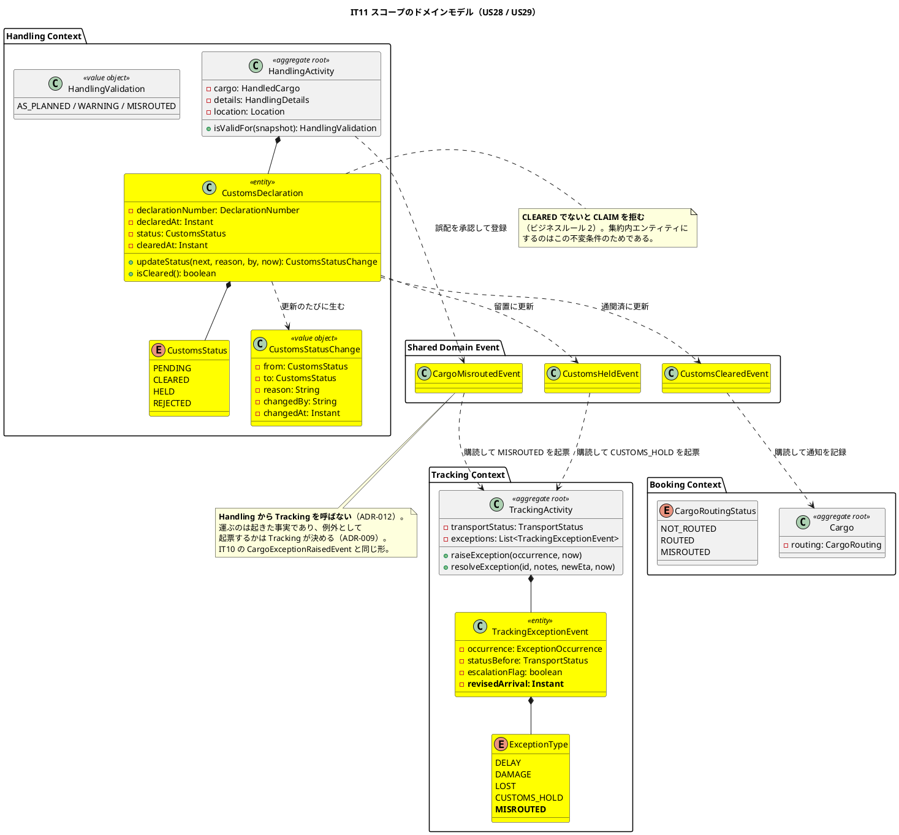
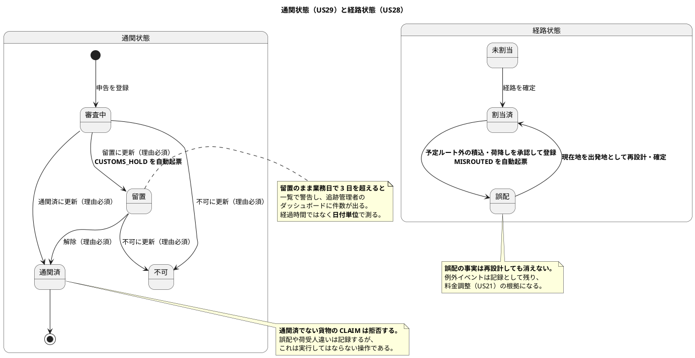
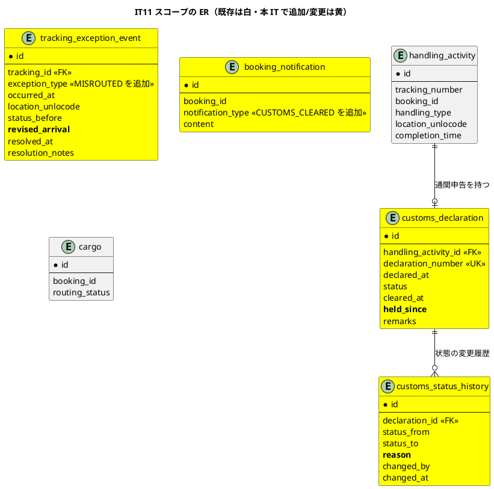
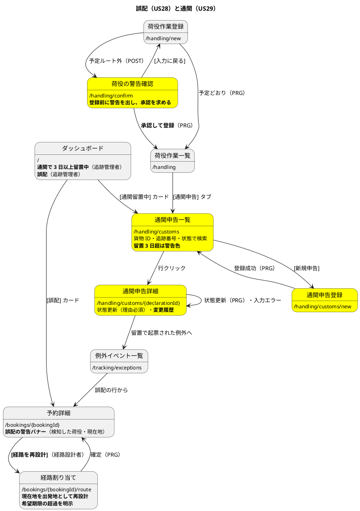

# イテレーション 11 計画

## 概要

| 項目 | 内容 |
| :--- | :--- |
| イテレーション | IT11 |
| リリース | 1.1 実運用補完 |
| 期間 | 2026-08-09 〜 2026-08-10（10 営業日相当） |
| 局面 | **終盤**（`development_strategy.md`。アプローチ: アウトサイドイン） |
| 計画 SP | **10SP**（US28 5SP / US29 5SP） |
| 前提 | IT10 クローズ済み（累計 81SP / 81SP、10 IT 連続で計画 = 実績。ベロシティ平均 8.10） |

---

## ゴール

**貨物が予定と違う場所へ行ってしまったときに組み直せるようにし、通関という「止まる仕組み」を業務に載せる。**

IT10 で扱ったのは「予定どおり進まなくなったことを**記録して伝える**」ことだった。IT11 で扱うのは、そこから先の 2 つである。ひとつは**組み直す**こと（誤配は記録して終わりではなく、現在地から目的地までの経路を引き直さないと貨物は動かない）。もうひとつは**止める**こと（通関は、下りるまで引き渡してはならないという業務上の唯一の「止まる仕組み」である）。

---

## 前イテレーションの学びの反映（ふりかえり Try）

IT10 のふりかえり（`retrospective-10.md`）の Try 8 件を、本計画のタスクと DoD に落とす。

| Try | 内容 | 本計画への反映 |
| :--- | :--- | :--- |
| **T1** | **破壊検証のリストを自分で作らない。** 新規の `throw` / 拒否条件 / SQL の `WHERE` 条件 / 認可規則を**機械的に数え上げる** | **タスク 4-3 を「数え上げてから検証する」に変える。** DoD の安全装置の表は**着手前に埋めない**（実装後に数え上げた結果で埋める）。やらなかったものは名前で記録する |
| **T2** | 認可のテストは「開けないこと」と「開けること」を**対で**書く | タスク 3-5。**ロール × URL × 期待ステータスの表**を DoD に置く |
| **T3** | 「無いこと」を見るアサートの前に、必ず「開けたこと」を見る | タスク 3・4 の進め方。DoD に条項 |
| **T4** | マイグレーションのコメントに「読み戻す側の責務」を書いたら、**その IT のうちに読み戻すテストを書く**（旧形式の行を直接 INSERT して読む） | タスク 2-1。**V23 で `NULL` 可にする列があるため本 IT で必ず起きる** |
| **T5** | 受入基準の指差し確認は**括弧の中まで読む** | タスク 5-0。US28 の「（場所・日時）」「その差分が明示され」、US29 の「（日時・変更者・理由）」が対象 |
| **T6** | 実装上の都合で業務に制約を入れるときは、**利用者代表の視点で先に検討する** | リスク 4。「〜だから〜できない」と書いたコメントは検討の合図 |
| **T7** | 「記録で満たす」と判断したら、**その記録を読む人・画面・権限**を同じ IT で確かめる | **C20 の返済そのもの**（タスク 0-2）。US29 の通関完了通知も同じ扱い |
| **T8** | 返済枠は IT 序盤の独立コミットで先に着手する（4 IT 連続） | **タスク 0 を最初に置く** |

---

## 返済枠（タスク 0。**序盤に先に着手する**）

IT10 のふりかえりで持ち越した C18〜C27、IT10 で落とした C9、IT9 から 2 IT 繰り越している C6〜C16 を、**優先順位を付け直して**扱う。

### 返すもの

| # | 内容 | 由来 | 扱い |
| :--- | :--- | :--- | :--- |
| **C18** | **新しい到着予定日を構造化して持ち、追跡の到着予定に反映する** | **US19 の受入基準の未達**（IT10） | **返済ではなく残タスクである。** 最初に返す。解決フォームに日付を持たせ、`tracking_activity.estimated_arrival` を更新する |
| C20 | 通知の本文を画面で読めるようにし、追跡担当者と荷主に開放する | IT10 レビュー H（T7） | **返す。** 「記録で満たす」（ADR-006）が建前に劣化するのを止める。**US29 の通関完了通知も同じ経路に乗る**ため、本 IT で返すのが最も安い |
| C21 | **未解決の例外を複数持てるようにする**（復帰先は最初に起票された例外に固定） | IT10 レビュー H9 | **返す。US28 / US29 が新しい例外種別を 2 つ自動起票するため、1 件制限のままだと業務が回らない**（誤配の対応中に通関留置が起きる） |
| C19 | 管理者がエスカレーションの判断に必要な情報へ到達できるようにする | IT10 レビュー H | **返す。** 貨物の要約と解決済みの確認 |
| **C9** | 日程が変わった区間に印を出し、遅延例外の登録へ導く | **IT10 で計画どおり落としたもの** | **返す。「余力次第」にしない**（`retrospective-10.md` で明記した約束） |
| C7 | 更新確定後のフラッシュに影響件数が残らない | IT9 レビュー | 返す（小） |
| C8 | 荷主の予約詳細に一覧へ戻る導線・追跡へのリンクが無い | IT9 レビュー | 返す（小） |
| C23 | ドキュメントの穴（港のコメント・項目表・章冒頭の一覧） | IT10 レビュー 中 | 返す（タスク 5 に含める） |
| C25 | ダッシュボード寄与の ADR 化と、ArchUnit の抜け道（名前ベース・`shared.domain.event`・`security`） | IT10 レビュー 中 | **返す。** IT10 で「この拡張点は ADR 化していない」と自分で書いた。**設計図の向きを変えたら ADR** |

### 返さないもの（**理由を明記する**）

| # | 内容 | 理由 |
| :--- | :--- | :--- |
| C6 | 温度の境界・危険物クラスの妥当性・C10 の秒単位の境界 | US05 の追検証。**IT12（5SP・US35 / US36）に送る。** 2 IT 繰り越したことを認めたうえで、IT12 の返済枠に**名前で**書く |
| C11 / C16 | 荷主の紐付けを画面で確認する手段と、ADR-013 の手順書 | **画面を 1 つ足す判断が要る**。C11 が決まらないと C16 の手順書の対象が変わる。**IT12 で 2 件同時に扱う** |
| C12 | US05 受入基準 3 が E2E 1 本だけで支えられている | IT12（C6 と同じ US05 の追検証） |
| C22 / C24 / C26 / C27 | テストの穴・入力の使い勝手・不要な受け渡し・重複の整理 | 中／低。**本 IT のスコープと重なる範囲のみ**（通関・誤配に関わるもの）を実装中に併せて返し、残りは IT12 へ送る |

> **C6 / C11 / C12 / C16 は IT9 から 2 IT 繰り越している。** 3 IT 目に入る前に、
> **IT12 の返済枠へ名前で送る**ことをここで確定させる。「余力次第」とは書かない
> （[ADR-008 が IT6〜IT8 で 3 回繰り越された](retrospective-9.md)のと同じ形にしない）。

---

## 対象ユーザーストーリー

| ID | ユーザーストーリー | SP | 優先度 | Issue |
| :--- | :--- | :--- | :--- | :--- |
| US28 | 誤配を検知して経路を再設計する | 5 | 必須 | [#504](https://github.com/k2works/case-study-cargo-tracker/issues/504) |
| US29 | 通関申告を登録・管理する | 5 | 必須 | [#505](https://github.com/k2works/case-study-cargo-tracker/issues/505) |
| | **合計** | **10** | | |

> マイルストーンは 2 件とも `[java/take-6] Release 1.1 実運用補完`、ラベルは `it11` である。
> **java/take-6 には GitHub Project を作っていない。** イテレーションの割り当ては
> `it11` ラベルとマイルストーンで表す。

### 実装順序

**US29 → US28** の順に進める。**IT10 とは逆に、骨格ではなく「制約の少ないほう」を先に置く。**

US29 の通関申告は、既存の `handling_activity` にぶら下がる**独立した記録**であり、既存の集約をほとんど動かさない。一方 US28 は、荷役の登録経路（`HandlingController`）・予約の経路状態（`CargoRouting`）・経路の再算出（`RouteProposal`）・例外の起票（`TrackingActivity`）の **4 つの BC にまたがる**。

**US29 で「例外を自動起票する」形（`CUSTOMS_HOLD`）を先に確立し、US28 の `MISROUTED` を同じ形で載せる。** 逆順にすると、最も広い変更を、自動起票の作法が定まらないまま設計することになる。

### 受入基準

受入基準の正典は [ユーザーストーリー](../requirements/user_story.md) である。**本計画に書き写さず引用する。**

- US28: [US28 の受入基準](../requirements/user_story.md#us28-誤配を検知して経路を再設計する)
- US29: [US29 の受入基準](../requirements/user_story.md#us29-通関申告を登録管理する)

### 受入基準のうち解釈が要るもの（**括弧の中まで読む**。T5）

| 内容 | 扱い | 理由 |
| :--- | :--- | :--- |
| US28「登録**前に**警告が表示される」「警告を**承認して**登録すると」 | **2 段階にする。** 確認画面を挟み、承認のトークンを持って POST する | **現状は登録後に警告を出している**（`HandlingActivity.isValidFor` は保存後の判定）。「登録前」は順序の要求であり、文言だけでは満たせない |
| US28「例外種別『誤配』の例外イベントが**自動**起票される」 | **満たす。** `ExceptionType` に `MISROUTED` を追加し、荷役の登録からドメインイベントで起票する（ADR-009 / ADR-012） | Handling から Tracking を直接呼ばない。**起きた事実を運び、起票するかは Tracking が決める** |
| US28「再設計後の到着予定が当初の希望期限を超える場合、**その差分が明示され**、荷主への通知内容に含まれる」 | **満たす。** 超過日数を計算して画面と通知本文の両方に出す | 括弧ではないが**「明示され」は表示の要求**である。通知に入れるだけでは画面で見えない |
| US28「誤配の事実は解決後も**記録として残り**、料金調整の根拠として参照できる」 | **満たす（参照までを本 IT の範囲とする）。** 解決しても例外イベントは消えず、予約詳細から読める | 料金調整そのものは US21（Billing）であり本 IT の対象外。**根拠として読めるところまで**が US28 の責務 |
| US29「通関状態が『通関済』になると、荷主・荷受人に通関完了が**通知される**」 | **記録として満たす**（ADR-006）。`BookingNotification` に `CUSTOMS_CLEARED` を足す | 通知の実体は記録である（US12 / IT8）。**C20 で本文を画面から読めるようにするのと同じ IT で行う**（T7） |
| US29「更新時は理由の入力が必須で、**監査ログに記録される**」＋「変更履歴（日時・変更者・理由）が申告詳細から**参照できる**」 | **監査ログとは別に、履歴テーブルを持つ。** `customs_status_history` を新設する | **監査ログはアプリのログであり、画面から参照できない。** 「参照できる」を満たすには永続化した履歴が要る（設計反映 #5） |
| US29「『留置』のまま **3 日を超えた**申告」 | **業務タイムゾーンの日付単位で判定する**（`Clock` 相対） | UTC の経過時間で測ると時差の分だけ境界がずれる（[業務日付は UTC で判断しない](retrospective-8.md)） |
| US29「通関状態が『通関済』でない貨物に対する引き取り（CLAIM）荷役は**拒否**される」 | **拒否する。** 警告ではない | 誤配・荷受人違いは「起きた事実」として記録するが、**通関前の引き渡しは業務として実行してはならない**。`domain-model.md` のビジネスルール 2 が既に決めている |

---

## 設計への反映が必要（当該 IT で対応）

着手前の突合で見つかった差分。**当該 IT で設計ドキュメントに反映する。**

| # | 対象 | 内容 | 反映先 |
| :--- | :--- | :--- | :--- |
| 1 | `domain-model.md` / マイグレーション | **`ExceptionType` に `MISROUTED`（誤配）が無い**（DELAY / DAMAGE / LOST / CUSTOMS_HOLD の 4 つ）。US28 の受入基準「例外種別『誤配』」を満たせない | `domain-model.md` 要素表・列挙型、V23 |
| 2 | `domain-model.md` | **ビジネスルール 4「CUSTOMS_HOLD は税関システムから自動登録される」は ADR-006（外部連携しない）と矛盾する。** IT10 の設計反映 #7 で「US29 / IT11 の範囲として書き直す」と決めた持ち越し | `domain-model.md`（「通関状態を留置に更新したときに自動起票する」に書き直す） |
| 3 | `data-model.md` / マイグレーション | **`customs_declaration.handling_activity_id` が `NOT NULL`** である。US29 は「**追跡番号**・申告番号・申告日時を入力して登録できる」と書いており、**通関の荷役作業が先に無いと申告を登録できない**形になっている | 実装方針を決めて `data-model.md` に注記（後述） |
| 4 | `data-model.md` / マイグレーション | **通関状態の変更履歴を保持するテーブルが無い。** US29「変更履歴（日時・変更者・理由）が申告詳細から参照できる」を満たせない | `customs_status_history` を新設（V23）・`data-model.md` |
| 5 | `data-model.md` | `customs_declaration` に**理由（`remarks`）はあるが、更新のたびに上書きされる**。履歴を持つなら理由は履歴側が持つ | `data-model.md` |
| 6 | `booking_notification` の CHECK | `CUSTOMS_CLEARED` が制約に無い（V22 で 5 種別まで） | V23 |
| 7 | `ui_design.md` | **通関申告の一覧・登録・詳細の画面が定義済み**（`/handling/customs`）だが、**「留置 3 日超」の警告表示の見せ方**が書かれていない。ダッシュボードのカードは定義済み | `ui_design.md` |
| 8 | `ui_design.md` | **荷役登録の「登録前の警告と承認」の画面が定義されていない**（現状は登録後のフラッシュ） | `ui_design.md` 画面遷移図・荷役作業登録 |
| 9 | `non_functional.md` | ROLE_HANDLER / ROLE_TRACKER の権限範囲に通関状態の更新が無い | `non_functional.md` §4.1 |
| 10 | ADR | **ダッシュボードの件数を各 BC が `@ControllerAdvice` で載せる拡張点**（IT10 で確立・ADR 化していない。C25） | **ADR を起票する**（後述） |
| 11 | `data-model.md` | `tracking_exception_event` に**新しい到着予定日の列が無い**（C18） | V23・`data-model.md` |
| 12 | `test_strategy.md` | US28 のテスト対象が **`Cargo#isOnExpectedRoute()` / `RoutingController`** と書かれているが、**実装は `HandlingActivity.isValidFor` と `BookingController` の経路割り当て**である（IT6 で確定済み）。**存在しないクラスをテスト対象として指している** | `test_strategy.md` §ストーリー別テスト対象 |

### 設計反映 #1 の方針（**誤配の呼び名を分岐させない**）

**名前は `MISROUTED` に揃える。** 誤配はすでに 2 か所で `MISROUTED` と呼ばれている（`CargoRoutingStatus.MISROUTED` / `HandlingValidation.Outcome.MISROUTED`）。ここだけ `MISDIRECTED` のような別語を当てると、**同じ業務概念に 2 つの名前ができる**。BC が違っても、業務の言葉が違うわけではない（ユビキタス言語の分岐を作らない）。

### 設計反映 #3 の方針（**通関申告と荷役作業の関係**）

`customs_declaration.handling_activity_id NOT NULL` を**維持する**。US29 の「追跡番号を入力して登録」は、**入力の形**であって保存の形ではない。

- 画面は追跡番号を受け取る
- アプリケーションは、その貨物の**通関（CUSTOMS）荷役**を引き当てる
- 引き当たらなければ「先に通関の荷役を登録してください」と**理由を示して拒む**

**列を NULL 可に緩めない。** 申告は「どの荷役でどの貨物を通したか」の記録であり、貨物に紐づかない申告は業務上あり得ない。`data-model.md` に**この判断を注記する**（列定義だけ見ると「入力と保存がずれている」ように読めるため）。

---

## 設計（IT11 スコープ）

### ドメインモデル図

### 状態遷移図（IT11 スコープ）

### ER 図（IT11 スコープ）

> **`customs_declaration` は V1 で作成済みだが、一度も使われていない**（実測。
> Java 側に `CustomsDeclaration` は存在しない）。**IT10 の C17 で入れた
> 「`data-model.md` の列が実スキーマにあるか」の検査は一方向であり、
> 「スキーマにあるが実装が無い」は捕まえない。** 本 IT で初めて使う。
>
> V23 で足すのは 3 つ。`customs_status_history`（新設）・
> `customs_declaration.held_since`（3 日判定の起点）・
> `tracking_exception_event.revised_arrival`（C18）。
> あわせて `exception_type` の値に `MISROUTED` を、
> `booking_notification.notification_type` の CHECK に `CUSTOMS_CLEARED` を足す。

> **`revised_arrival` は NULL 可にする**（IT10 までに起票された例外には無い）。
> **T4 により、旧形式の行を直接 INSERT して読み戻すテストを本 IT で書く。**
> IT10 では V22 のコメントと Java の実装が同じ日に矛盾したままコミットされた。

### 画面遷移図（IT11 スコープ）

---

## タスク分解

### 0. 返済枠（**最初に着手する**。T8。4 IT 連続）

| # | タスク | 見積 |
| :--- | :--- | :--- |
| 0-1 | **C18: 新しい到着予定日を構造化して持ち、追跡の到着予定に反映する**（**US19 の受入基準の未達**。V23 の列追加を含む） | 3.5h |
| 0-2 | **C20: 通知の本文を画面で読めるようにし、追跡担当者と荷主に開放する**（T7） | 2.5h |
| 0-3 | **C21: 未解決の例外を複数持てるようにする**（復帰先は**最初に起票された例外**の `statusBefore` に固定） | 3.0h |
| 0-4 | C19: 管理者がエスカレーションの判断に要る情報へ到達できるようにする | 1.5h |
| 0-5 | **C9: 日程が変わった区間に印を出し、遅延例外の登録へ導く**（IT10 で落としたもの） | 3.0h |
| 0-6 | C7 / C8: フラッシュの影響件数・荷主の予約詳細の導線 | 1.5h |
| 0-7 | **C25: ダッシュボード寄与の拡張点を ADR 化**し、ArchUnit の抜け道（名前ベース・`shared.domain.event`・`security`）を塞ぐ | 2.5h |
| | **小計** | **17.5h** |

> **0-3（C21）を US29 より前に置く。** 通関留置が `CUSTOMS_HOLD` を自動起票するため、
> 1 件制限のままだと「誤配の対応中は通関留置を起票できない」という形になる。
> **実装上の都合を業務の制約にしない**（T6）。

### 1. 受け入れテスト（赤）とドメイン

| # | タスク | 見積 |
| :--- | :--- | :--- |
| 1-1 | US28 / US29 の受け入れテストを**赤で**書く（受入基準に 1:1。**括弧の中も 1 項目として書く**。T5） | 4.0h |
| 1-2 | `CustomsDeclaration` / `CustomsStatus` / `CustomsStatusChange`。**理由の無い更新を拒む**・**通関済からは戻さない** | 3.5h |
| 1-3 | **`HandlingActivity` の CLAIM が通関済を要求する**（ビジネスルール 2。**警告ではなく拒否**） | 2.0h |
| 1-4 | `ExceptionType.MISROUTED` の追加。**画面から登録できる種別と、自動起票だけの種別を列挙型が区別する** | 1.5h |
| 1-5 | 留置 3 日超の判定（**業務タイムゾーンの日付単位**・`Clock` 相対） | 1.5h |
| | **小計** | **12.5h** |

> **テストデータの港は既存テストが使っていないものを選ぶ**（IT9 T7）。
> **日時は `Clock` 相対で作る。絶対日付を書かない**（IT9 T6）。

### 2. 永続化

| # | タスク | 見積 |
| :--- | :--- | :--- |
| 2-1 | `V23`（`customs_status_history` 新設・`held_since`・`revised_arrival`・CHECK 2 件）＋**旧形式の行を直接 INSERT して読み戻すテスト**（T4） | 2.5h |
| 2-2 | 通関申告の読み書き（集約全体で保存）と Testcontainers のテスト | 3.0h |
| 2-3 | 通関申告一覧のクエリ（貨物 ID・追跡番号・状態で検索。**留置 3 日超を SQL で絞る**。N+1 を作らない） | 2.5h |
| 2-4 | ドメインイベント 3 種（`CargoMisroutedEvent` / `CustomsHeldEvent` / `CustomsClearedEvent`）と購読側 | 3.0h |
| | **小計** | **11.0h** |

### 3. アプリケーションと画面（アウトサイドインの主戦場）

| # | タスク | 見積 |
| :--- | :--- | :--- |
| 3-1 | 通関申告の一覧・登録（PRG。**通関の荷役が無ければ理由を示して拒む**） | 3.5h |
| 3-2 | 通関申告詳細（状態更新・理由必須・**変更履歴の表示**） | 3.0h |
| 3-3 | ダッシュボードの**通関留置カード**と**誤配カード**（追跡管理者） | 1.5h |
| 3-4 | **荷役登録の 2 段階化**（登録前の警告 → 承認して登録）。誤配の自動起票 | 3.5h |
| 3-5 | 予約詳細の**誤配バナー**（検知した荷役・現在地）と `[経路を再設計]` | 2.5h |
| 3-6 | **現在地を出発地とした再設計**と**希望期限の超過の明示**（画面と通知の両方） | 3.0h |
| 3-7 | 認可。**「開けないこと」と「開けること」をロール × URL × 期待ステータスの表で対に書く**（T2） | 2.0h |
| | **小計** | **19.0h** |

### 4. E2E とテスト

| # | タスク | 見積 |
| :--- | :--- | :--- |
| 4-1 | E2E: 通関申告 → 留置（例外の自動起票）→ 通関済 → 引取できる | 3.0h |
| 4-2 | E2E: 予定ルート外の積込 → 警告を承認 → 誤配 → 現在地から再設計 | 3.0h |
| 4-3 | **T1: 新規の `throw` / 拒否条件 / SQL の `WHERE` / 認可規則を機械的に数え上げ、全件を破壊検証する。** やらなかったものは名前で記録する | 4.0h |
| 4-4 | **T3: 「無いこと」を見るアサートの前に「開けたこと」を見る**（既存分も含めて棚卸し） | 1.5h |
| 4-5 | **IT10 の 4-4（未実施）: E2E の操作を 1 本ずつ外して赤になることを確かめる** | 1.5h |
| | **小計** | **13.0h** |

### 5. ドキュメント

| # | タスク | 見積 |
| :--- | :--- | :--- |
| 5-0 | **T5: 正典の受入基準を 1 行ずつ指差す（括弧の中も 1 項目として数える）** | 1.0h |
| 5-1 | 設計ドキュメントの反映（12 件）＋ C23（ドキュメントの穴） | 4.0h |
| 5-2 | **マニュアル更新**（**08-荷役管理に通関の節を追加**・07-追跡管理に誤配を追記・04-貨物予約に再設計を追記）＋キャプチャ再生成 | 4.5h |
| 5-3 | 用語集・付録 B・索引 3 点同期 | 2.0h |
| | **小計** | **11.5h** |

**合計見積: 84.5h**（うち返済枠 17.5h）

> **IT10（73.5h）より 11h 多い。** 返済枠が 10.0h → 17.5h に増えたためである
> （C18 は返済ではなく US19 の残タスクであり、落とせない）。
> **超過が見えたときに落とす順序は、リスク 2 に先に書く。**

---

## ADR

| # | 判断 | 起票要否 |
| :--- | :--- | :--- |
| 1 | 誤配・通関留置・通関完了を BC 間のドメインイベントで伝える | **起票しない。** ADR-009 / ADR-012 の適用であり、IT10 の例外イベントと同じ形 |
| 2 | 通関完了通知を記録で満たす | **起票しない。** ADR-006 の適用 |
| 3 | `customs_declaration.handling_activity_id` を `NOT NULL` のまま維持する（入力は追跡番号・保存は荷役） | **起票しない。** `data-model.md` に注記する。**列定義だけ見るとずれて読めるため、判断を残す** |
| 4 | **ダッシュボードの件数を各 BC が `@ControllerAdvice` で載せる拡張点**（C25） | **ADR を起票する。** IT10 で確立したが記録していない。**`shared` が全 BC のクエリサービスを参照する形を避ける**という依存の向きの判断であり、ADR-012 の系列にある。**設計図の向きを変えたら ADR** |
| 5 | 通関状態の変更履歴を監査ログと別に永続化する | **ADR は起こさず `data-model.md` に理由を書く。** 「ログは画面から読めない」という単純な帰結であり、選択肢の比較にならない |

---

## スケジュール

| 日 | 内容 |
| :--- | :--- |
| 1-2 | タスク 0（返済枠 17.5h。**C18 → C21 → C9 の順**） |
| 3-4 | タスク 1（受け入れテストを赤にしてからドメイン。US29 が先） |
| 5 | タスク 2（永続化） |
| 6-8 | タスク 3（アプリケーションと画面。US29 → US28） |
| 9 | タスク 4（E2E と破壊検証。**数え上げてから壊す**） |
| 10 | タスク 5（ドキュメント）・クローズ準備 |

---

## リスクと対策

| # | リスク | 影響 | 対策 |
| :--- | :--- | :--- | :--- |
| 1 | **US28 が 4 つの BC にまたがる**（Handling / Booking / Routing / Tracking） | 大（見積もりが崩れる） | **US29 を先に実装し、自動起票の作法を確立してから US28 に入る**。BC 間は必ずドメインイベント（ADR-009 / ADR-012）。**直接呼び出しを書かない** |
| 2 | 10SP ＋ 返済枠 17.5h でベロシティ（8SP）を大きく超える | 中 | **超過が見えた時点で落とす順序を先に決める**: **0-4（C19）→ 0-6（C7 / C8）→ 4-4（棚卸し）**の順。**C18 / C21 / C9 と US28 / US29 の受入基準は落とさない**（C18 は受入基準の未達、C9 は「余力次第にしない」と約束したもの） |
| 3 | **`customs_declaration` は 11 IT 使われていない**。実装して初めて設計の齟齬が出る | 中 | **タスク 1-2 の前に列と業務の突合を終える**（設計反映 #3〜#5 で 3 件の齟齬が既に出ている）。**「スキーマにあるが実装が無い」は C17 の検査が捕まえない**ことを記録する |
| 4 | **実装上の都合を業務の制約にする**（IT10 の P5 の再発） | 中 | **「〜だから〜できない」と書いたコメントを検討の合図とする**（T6）。とくに「通関の荷役が無いと申告できない」は業務として正しいか**利用者代表の視点で先に検討する** |
| 5 | 破壊検証のリストを自分で作ってしまう（IT10 の P1 の再発） | 大 | **タスク 4-3 で機械的に数え上げてからリストを作る。** DoD の安全装置の表は**着手前に埋めない** |
| 6 | 誤配の 2 段階化が既存の荷役登録（US15 / US16）を壊す | 中 | **予定どおりの登録は 1 段階のまま**にする。承認を挟むのは警告・誤配のときだけ。既存 E2E（`critical-path.spec.js`）が緑であることで守る |

---

## 完了条件

### デモ項目

1. 通関申告を**追跡番号で**登録できる（初期状態は「審査中」）
2. 通関の荷役が無い貨物では、**理由を示して拒む**
3. 状態を「留置」に更新すると、**例外種別「税関保留」が自動起票される**
4. 「留置」のまま 3 日を超えると、**一覧で警告色になり、ダッシュボードに件数が出る**
5. 通関済でない貨物の**引取が拒否され、現在の通関状態が示される**
6. 通関済に更新すると、**荷主・荷受人への通知が記録され、その本文が画面で読める**（C20）
7. 申告詳細から**変更履歴（日時・変更者・理由）が読める**
8. 予定ルート外の積込で、**登録前に警告が出る**。承認して登録すると経路状態が「誤配」になり、**例外種別「誤配」が自動起票される**
9. 予約詳細に**誤配のバナー**が出て、検知した荷役と現在地が読める
10. `[経路を再設計]` から、**現在地を出発地とした**経路候補が算出される
11. 再設計後の到着が希望期限を超える場合、**その差分が画面と通知の両方に出る**
12. **誤配の事実は解決後も記録として残り、予約詳細から読める**
13. **未解決の例外を複数持てる**（誤配の対応中に通関留置を起票できる）（C21）
14. 例外の解決で**新しい到着予定日を入力すると、追跡照会の到着予定が更新される**（C18）
15. 航海スケジュールが変わった区間に印が出て、**そこから遅延例外の登録へ行ける**（C9）

### 完了の定義（DoD）

#### 機能

- [ ] US28 / US29 の受入基準（**正典を 1 行ずつ指差して確認。括弧の中も 1 項目として数える**。T5）
- [ ] デモ項目 15 件が動作する
- [ ] **C18 の決着**（US19 の受入基準の未達が解消する）
- [ ] **C9 の決着**（IT10 で落としたものを返す）

#### 終盤の完了条件（`development_strategy.md`）

- [ ] 業務シナリオが通しで動作する
- [ ] E2E のクリティカルパス（既存 10 本）＋本 IT の 2 本が緑
- [ ] ArchUnit のルールがすべて有効・緑（**C25 で塞いだ抜け道を含む**）

#### 品質

- [ ] `./gradlew check` が緑（Checkstyle 0 / SpotBugs 0 / ArchUnit / JaCoCo レイヤー別）
- [ ] CI が緑・SonarQube Quality Gate が PASS（Bug 0 / Vulnerability 0 / Code Smell 0 / 重複 3% 未満 / 新規コードのカバレッジ 80% 以上）

#### 主張とテスト

- [ ] 「〜しない」「〜に限る」と書いたコメントに、それを破るテストが同じコミットにある
- [ ] **マイグレーションのコメントに「読み戻す側の責務」を書いたら、旧形式の行を直接 INSERT して読むテストを同じ IT で書く**（T4）
- [ ] ドメインに足した `throw` すべてに、**画面から踏むテストが対**になっている

#### 安全装置（T1。**着手前にリストを作らない**）

**この表は実装後に埋める。** 新規の `throw` / `if` による拒否 / SQL の `WHERE` 条件 / 認可規則を**機械的に数え上げ**、その全件を対象にする。**数が多くて全件やれないなら、やらなかったものを名前で記録する。**

| # | 装置 | 数え上げ元 | 壊し方 | 結果 |
| :--- | :--- | :--- | :--- | :--- |
| | （実装後に記入） | | | |

#### 認可（T2。**開けないことと開けることを対で書く**）

| ロール | URL | 期待 |
| :--- | :--- | :--- |
| （実装時に埋める。**403 だけを並べない**） | | |

#### 到達性（ロール別・状態別・**発生時点**）

- [ ] 荷役作業員が通関申告の登録へ到達できる
- [ ] 追跡管理者がダッシュボードから**通関留置**と**誤配**へ到達できる
- [ ] **誤配の予約から経路の再設計へ到達できる**（状態軸）
- [ ] **通関留置で起票された例外から、その申告へ戻れる**（往復）
- [ ] 画面の案内文が指す先を、その文を読むロールで実際に開ける
- [ ] **「無いこと」を見るアサートの前に「開けたこと」を見ている**（T3）

#### ドキュメント

- [ ] 設計への反映 12 件を完了（**ADR を 1 件起票する**。C25）
- [ ] **マニュアルを更新**（08-荷役管理に通関の節・07-追跡管理に誤配・04-貨物予約に再設計）＋キャプチャを生成 spec で再生成
- [ ] 早見表に足した行の文言が**実際に画面に出ることを確認**
- [ ] 用語集・付録 B・索引 3 点を同期

---

## 実績（開発フェーズ）

### 受入基準の指差し確認（T5。**括弧の中も 1 項目として数える**）

正典（`user_story.md`）を 1 行ずつ読み、括弧の中まで確かめた。**2 件の漏れが出た。**

| ストーリー | 受入基準 | 結果 |
| :--- | :--- | :--- |
| US28 | 登録前に警告が表示される | ✅ 確認画面を挟む |
| US28 | 承認して登録すると経路状態が「誤配」・例外種別「誤配」が自動起票 | ✅ |
| US28 | バナーに検知した荷役（**場所・日時**）と貨物の現在地 | ✅ 場所と現在地は同じ値である（最後の荷役の場所）ため 1 か所に出す |
| US28 | **現在地を出発地とした**経路割り当てへ遷移 | ✅ **表示だけでなく探索も現在地から**（指差し確認より前に、テストが食い違いを見つけた） |
| US28 | 目的地と希望期限は元の予約から引き継がれる | ✅ |
| US28 | 到着が希望期限を超える場合、**差分が明示され、通知内容に含まれる** | ✅ 画面と通知本文の両方 |
| US28 | 例外一覧に表示され、**解決フォームから対応内容を記録できる** | ✅ **指差し確認で気づいて追検証した**（自動起票の例外を解決する経路を試していなかった） |
| US28 | 誤配の事実は解決後も記録として残り、**料金調整の根拠として参照できる** | ⚠️ 記録は残り、解決済みを含む一覧で読める。**料金調整そのものは US21（Release 2.0）** |
| US29 | 追跡番号・申告番号・申告日時で登録（**初期状態は「審査中」**） | ✅ |
| US29 | 通関済・留置・不可に更新。**理由必須・監査ログに記録** | ✅ |
| US29 | 通関済でない貨物の引取は拒否され、**現在の通関状態が提示される** | ✅ |
| US29 | 通関済になると**荷主・荷受人**に通知される | ✅ **指差し確認で漏れが出た。** 荷主にしか記録していなかった |
| US29 | 留置で「税関保留」が自動起票される | ✅ |
| US29 | 3 日超は一覧で警告表示され、**追跡管理者のダッシュボードに件数** | ✅ |
| US29 | 一覧を**貨物 ID**・追跡番号・通関状態で検索 | ✅ |
| US29 | 変更履歴（**日時・変更者・理由**）が申告詳細から参照できる | ✅ |

> **括弧の中を読んで 2 件見つかった。** US29 の「荷主・荷受人に」は
> 荷主にしか送っておらず、US28 の「解決フォームから対応内容を記録できる」は
> 自動起票された例外を解決する経路を一度も試していなかった。
> IT10 で未達になったのも括弧の中である（「新しい到着予定日」）。

### 安全装置の破壊検証（T1。**着手前にリストを作らない**）

IT11 の差分から機械的に数え上げた。**throw 15 件・拒否の return 8 件・
SQL の絞り込み 20 件・認可規則 15 件。**

代表 8 件＋開発中の 13 件を壊し、**3 件が空振りした**。

| # | 装置 | 結果 |
| :--- | :--- | :--- |
| 1 | 新しい到着予定日の読み戻し（C18） | 赤 |
| 2 | 通知履歴のロール開放（C20） | 赤 |
| 3 | 未解決が残るうちは状態を戻さない（C21） | 赤 |
| 4 | 復帰先を最初の例外に固定（C21） | 赤 |
| 5 | 貨物の要約の受け渡し（C19） | 赤 |
| 6 | 日程が変わった区間の印（C9） | 赤 |
| 7 | `shared.application` の完全修飾名（C25） | 赤 |
| 8 | `shared.domain.event` は record のみ（C25） | 赤 |
| 9 | ダッシュボード advice の結びつき | 赤 |
| 10 | 通関済でなければ引取を許さない | 赤 |
| 11 | 誤配の探索は現在地から | 赤 |
| 12 | 承認していなければ登録しない | 赤 |
| 13 | 誤配のときだけ自動起票する | 赤 |
| 14 | 通関の認可規則の順序 | 赤 |
| 15 | 通関済からは戻せない | 赤 |
| 16 | 同じ状態への更新を拒む | 赤 |
| 17 | 通関の荷役が無ければ拒む | 赤 |
| 18 | 留置の日数判定（HELD 以外は数えない） | 赤 |
| 19 | 期限の超過日数は予約の期限と比べる | 赤 |
| 20 | **理由を必須にする検査** | **空振り → 検査が集約と値オブジェクトの 2 か所にあった。1 か所に寄せて赤** |
| 21 | **申告の重複登録を拒む** | **空振り → 通る道を試していなかった。テストを足して赤** |
| 22 | **通関の荷役だけを引き当てる** | **空振り → 荷役が 0 件の場合しか試しておらず、種別の条件を外しても緑。テストを足して赤** |

**やらなかったもの**（名前で記録する）: SQL の `WHERE` 20 件のうち、
一覧の絞り込み（`status` / `keyword`）と ID による単純な取得は壊していない。
前者は検索のテストが通る道を押さえており、後者は取得できなければ
どのテストも成立しないためである。

### E2E の逆検証（IT10 で未実施だった 4-4）

| 外した操作 | 結果 |
| :--- | :--- |
| 通関: 通関済への更新 | 赤 |
| 誤配: 承認の操作 | 赤 |

---

## 更新履歴

| 日付 | 版 | 内容 |
| :--- | :--- | :--- |
| 2026-08-09 | 1.0 | 初版作成（IT11 開始準備） |

---

## 参照

- [リリース計画](release_plan.md) / [開発戦略](development_strategy.md)
- [IT10 ふりかえり](retrospective-10.md) / [IT10 完了報告書](iteration_report-10.md) / [IT10 実装レビュー](../review/IT10実装_review_20260809.md)
- [ユーザーストーリー](../requirements/user_story.md) / [ドメインモデル](../design/domain-model.md) / [データモデル](../design/data-model.md) / [UI 設計](../design/ui_design.md)
- [ADR-006](../adr/006-external-integration-internal-simulation.md) / [ADR-009](../adr/009-domain-events-for-cross-context-propagation.md) / [ADR-012](../adr/012-cross-context-dependency-direction.md)
