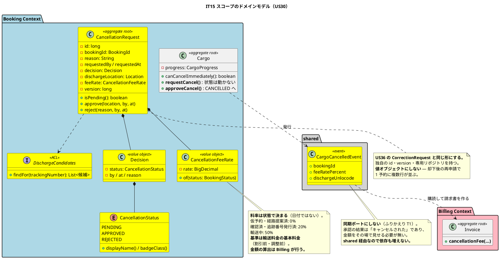
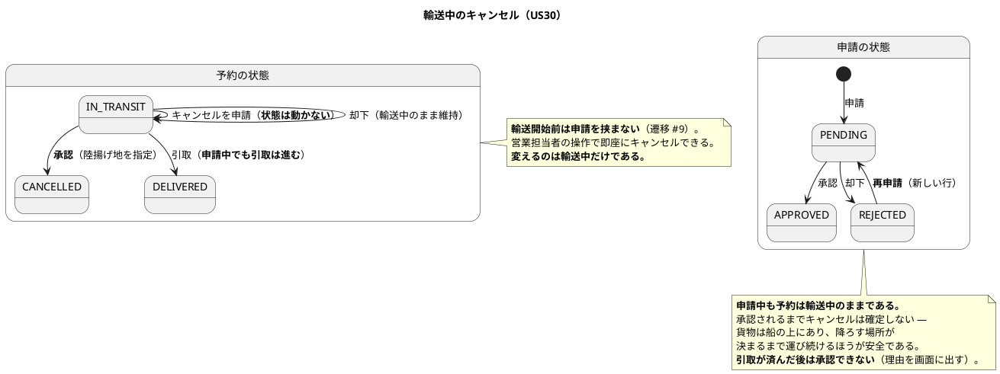
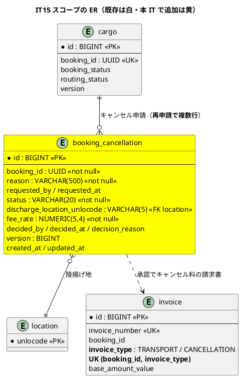
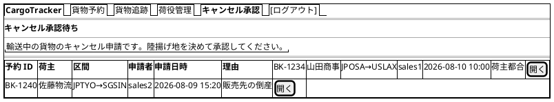
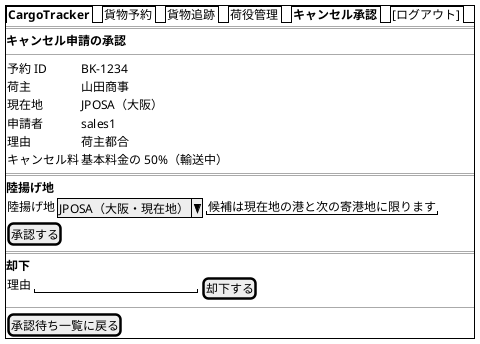
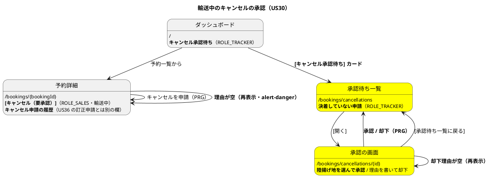

# イテレーション 15 計画

## 概要

| 項目 | 内容 |
| :--- | :--- |
| イテレーション | IT15 |
| リリース | 2.0 精算（**本 IT で完成する**） |
| 期間 | 2026-08-10 〜（10 営業日相当） |
| 局面 | **精算**（`development_strategy.md`。アプローチ: **アウトサイドイン**） |
| 計画 SP | **5SP**（US30 5SP） |
| 前提 | IT14 クローズ済み（累計 107SP / 107SP、14 IT 連続で計画 = 実績。ベロシティ平均 7.64） |

---

## ゴール

**輸送中の貨物を、営業担当者の一存で消せなくする。**

いまの実装は、**輸送中（`IN_TRANSIT`）の予約を営業担当者がボタン 1 つでキャンセルできる**。`BookingStatus` の遷移表がコメントで「#9 輸送開始前のキャンセル。#10 輸送中のキャンセル（承認を伴う）」と書きながら、**表の中身は #9 と #10 を同じループで登録している**。画面（`booking/detail.html`）は `cancellable()` でボタンを出し、押すと確定する。

**貨物は船の上にある。** どこで降ろすかを決めないままキャンセルすると、貨物が宙に浮き、荷役の現場は行き先の無い荷物を抱える。

本 IT で、輸送中のキャンセルを**申請 → 追跡管理者の承認（陸揚げ地の指定）**に変える。承認するとキャンセル料が算定されて請求書になり、却下すると輸送中のまま維持される。

> **コメントが仕様を語りながら実装が守っていない典型例である**（`feedback_comments-are-specs-verify-them` と同型）。
> IT14 のふりかえり P6 と同じ形が、今度は**遷移表**で見つかった。

---

## なぜアウトサイドインか

`development_strategy.md` の局面表を**本 IT の開始準備で直した**（精算局面を「IT13 はインサイドアウト、IT14・IT15 はアウトサイドイン」に）。3 IT 中 2 IT が「逸脱」するなら、局面とアプローチを 1 対 1 に固定していたことのほうが誤りである。

| 条件 | IT13（インサイドアウト） | 本 IT |
| :--- | :--- | :--- |
| 集約 | Billing にゼロから作る | **`Cargo` も `Invoice` も既にある**。申請のエンティティを足す |
| 金額の計算 | 丸め規則を確定させる | **キャンセル料は既存の `Money` と丸め規則に乗る** |
| 新規 ACL ポート | 2 つ同時 | **1 本**（陸揚げ地の候補を読む Booking → Tracking）。**状態の伝播はイベントにする**（ポートを足さない） |
| 主眼 | 金額の正しさ | **誰が何を承認して初めて確定するか**（業務の流れ） |

**条件が終盤（IT7〜IT12）および IT14 と同じなので、同じ選択をする。**

> **例外が 1 つある。キャンセル料の料率だけは先にドメインで固める。**
> 料率は金額を決める規則であり、**画面から下ろすと表示都合が混ざる**（IT13 で丸め規則に対して下したのと同じ判断）。

---

## 5SP をどう使うか

| 区分 | SP / 見積 | 内容 |
| :--- | :--- | :--- |
| ストーリー | 5SP / 約 34h | US30（**先行して直す構造的な穴を含む**） |
| **返済枠** | — / 約 25h | **IT14 レビューの高 5 件・中 2 件・低 1 件・スコープ外 1 件＋ IT14 計画から送られた 2 件＋ M9** |

**ベロシティ 7.64 に対して 5SP である。** 差の分をまるごと返済に充てる（Try T8。10 IT 連続）。

> **Release 2.0 の最後のイテレーションである。送り先が無い。**
> **返すか、リリース後の課題として起票して閉じるか**のどちらかであり、
> 「余力次第」にはしない（`feedback_debt-allowance-defer-antipattern`）。
> **合計見積が 10 営業日を超えるため、落とす順序を先に決める**（リスク 7）。

---

## 前イテレーションの学びの反映（ふりかえり Try）

| Try | 本計画への落とし込み |
| :--- | :--- |
| T1: **戻り値を持つポートは、呼び出し側が使っているかを実装時に確かめる** | **状態の伝播はイベントにする**（設計反映 #11）。新設する ACL ポートは陸揚げ地の候補を読む 1 本だけで、**戻り値をそのまま画面に出す**。タスク 0-1 で `settle` / `notifyIssued` も含めて ADR にまとめる |
| T2: **日付・時刻を含むテストは「TZ=UTC で 24 時間ずらしても緑か」を自問する** | 料率は**状態**で決まり日付では決まらない。申請日時・承認日時を扱うため、**DB の `CURRENT_DATE` を比較に使わない**。DoD に `TZ=UTC ./gradlew check` |
| T3: **ADR に「〜として使う」と書いたら「どこが守るか」を 1 行書く** | 本 IT の ADR には**守り手の欄**（DB 制約 / ドメイン / テスト / 守らない）を必ず入れる |
| T4: **Javadoc の主張はその経路を 1 本テストで踏む。踏めないなら書き換える** | タスク 4-2 で**主張が到達可能かまで確かめる** |
| T5: **画面に文字列を足したら既存の用語規則を grep で確かめる** | **「キャンセル」（予約）と「取り消し」（引取記録の US36）は別物である。** イベント名も対象にする（既存に `ClaimCancelledEvent` があり語が衝突する） |
| T6: **レビューを実装の途中で 1 度入れる** | **タスク 3 の完了時点で `developing-review` を 1 度回す** |

---

## 着手前の検証で見つかった構造的な穴（**タスク 1 より前に直す**）

開始準備の 2 段の検証で、**このまま作ると受入基準に到達できない**ものが 3 件見つかった。

| # | 穴 | 何が起きるか | 対処 |
| :--- | :--- | :--- | :--- |
| **X1** | **`invoice.booking_id` が UNIQUE**（V1。「UNIQUE 制約で二重請求を防止する」） | **キャンセル料の請求書を作れない。** 輸送料金の請求書が既にある予約には 2 枚目が入らない。デモ項目 10 が構造的に到達不能 | `invoice_type`（`TRANSPORT` / `CANCELLATION`）を足し、UK を `(booking_id, invoice_type)` にする。**ADR に残す**（二重請求の防止は保ったままにする） |
| **X2** | **`/bookings/**` が ROLE_SALES 限定**（`SecurityConfig`）。`/bookings/cancellations/{id}` は 2 セグメントで `GET /bookings/*` に一致しない | **追跡管理者が承認画面を開けず 403 になる。** `SecurityConfig` が「順序が要である」と 3 回注意書きしている既知の罠 | `/bookings/**` より**前**に `/bookings/cancellations` 系を宣言する。**認可テストで TRACKER の GET / POST と他ロールの 403 を固定する** |
| **X3** | **キャンセルしても船腹が解放されない。** 空き容量は `routing_status = 'ROUTED'` だけで数えており、`booking_status = CANCELLED` を除外していない（`VoyageMapper.findAssignedWeights`） | UC22 の成功保証「確保していた船腹が解放される」が**実装で成立していない**。キャンセルした予約が便の枠を占め続ける | 空き容量の集計から**キャンセル済みを除く**。**先に壊して赤にしてから直す** |

---

## 対象ユーザーストーリー

| ID | ユーザーストーリー | SP | 優先度 | Issue |
| :--- | :--- | :--- | :--- | :--- |
| US30 | 輸送中の予約キャンセルを承認する | 5 | **必須**（BV / C / KA / RR がすべて「高」） | [#514](https://github.com/k2works/case-study-cargo-tracker/issues/514) |

> マイルストーンは `[java/take-6] Release 2.0 精算`（#52）、ラベルは `it15` である。

### 受入基準

受入基準の正典は [ユーザーストーリー](../requirements/user_story.md) である。**本計画に書き写さず引用する。**

- US30: [US30 の受入基準](../requirements/user_story.md#us30-輸送中の予約キャンセルを承認する)

### 受入基準のうち解釈が要るもの（**括弧の中まで読む**）

| 内容 | 扱い | 理由 |
| :--- | :--- | :--- |
| 「輸送開始前の予約は**営業担当者の操作で即座にキャンセルできる**」 | **現状を維持する**（遷移 #9） | すでに動いている。**変えるのは輸送中だけ**である |
| 「輸送中では営業担当者には**申請ボタンのみ**が表示される」 | **`[キャンセル]` を出さない。** 押せない操作を見せない | いまは押せてしまう。**これが本 IT の中心の穴である** |
| 「申請は追跡管理者に**通知され**、承認待ちの一覧に表示される」 | **承認待ち一覧＋ダッシュボードのカード**で届ける。**通知種別は足さない** | **US36 の先例に倣う。** `NotificationType` は**荷主向け**の通知記録であり、社内の承認依頼を混ぜると `INVOICE_ISSUED` 等の意味（荷主に伝えた事実）が壊れる |
| 「荷主に**通知される**」（承認時）／「却下理由が申請者と荷主に**通知される**」 | **荷主向けの通知種別を 2 つ足す**（承認・却下）。ADR-006 により外部へは送らない | こちらは**荷主向け**であり `NotificationType` の趣旨に合う。**申請時は足さない**（荷主にはまだ何も確定していない） |
| 「追跡管理者は**陸揚げ地（現在地の港または次の寄港地）**を指定して承認できる」 | **選べる港を絞る。** 自由入力にしない。**現在地は Tracking、次の寄港地は Booking の旅程から取る** | 船の上にある貨物を降ろせる場所は限られる。**自由入力は「降ろせない港」を選べてしまう** |
| 「承認すると**指定した陸揚げ地への荷降しが手配され**」 | **陸揚げ地を荷役の予定として記録し、荷役の一覧に出す**（実際の手配は業務。ADR-006） | 「手配した」を**現場が読める場所**に置かないと、荷役は何も知らないまま |
| 「**キャンセル料が発生する場合**、状態に応じた料率で算定され、精算に引き渡される」 | **料率は状態で決まる**（後述）。**引き渡し = キャンセル料の請求書を作る**（X1 の対処が前提） | UC22 の拡張 4a1 は「UC17 に引き渡す」と書くが、UC17 は輸送料金の算出である。**輸送していない料金を輸送料金として出せない**ため、請求書の種別を分ける |
| 「申請・承認・却下の**履歴**（日時・実行者・理由）が予約詳細から参照できる」 | **申請ごとに 1 行残す。** 却下も残す。**US36 の訂正申請の欄とは分けて出す** | 却下したことも経緯である。**予約詳細に「訂正・取り消しの申請」と「キャンセルの申請」が並ぶ** — 見出しで区別する |
| **船腹の解放**（UC22 の成功保証） | **X3 で直す**（キャンセル済みを空き容量の集計から除く） | 「解放する処理」は無く、**集計の条件が抜けていただけ**である |
| **返送** | **作らない** | `DELIVERED` 以降のキャンセルは返送であり別業務 |

### キャンセル料の料率（**本 IT で決める。ADR に残す**）

| 予約状態 | 料率 | 根拠 |
| :--- | :--- | :--- |
| `PRELIMINARY` / `ROUTE_PROPOSED` | 0% | 経路も便も押さえていない |
| `CONFIRMED` / `TRACKING_ISSUED` | 20% | 便を押さえており、空けた枠は他へ売れない |
| `IN_TRANSIT` | 50% | **すでに運んでいる。** 陸揚げと戻しの費用が別途かかる |

**基準額は輸送料金の基本料金（割引前・調整前）とする。**

- **割引は適用しない。** 割引は「運びきったこと」への取引条件であり、運びきらなかった輸送に適用する理由が無い
- **料金調整（減額・補償）も適用しない。** 調整は起きた例外への対応であり、キャンセルの料率とは別の話である
- **基準額は Billing が算出する**（`FreightChargeCalculator`）。Booking から金額を送らない — **金額の正典は Billing である**（送ると 2 つの基準額が生まれる）

**この判断を ADR に残す。**

---

## 設計への反映が必要（当該 IT で対応）

| # | 対象 | 内容 | 反映先 |
| :--- | :--- | :--- | :--- |
| 1 | `BookingStatus` | **`IN_TRANSIT` が他の状態と同じ扱いで `CANCELLED` へ遷移できる。** 受入基準 2 に反する | 実装（遷移表・コマンドを分ける）・`domain-model.md` |
| 2 | `domain-model.md` | **キャンセル申請のエンティティ・列挙型・料率が要素表に無い** | `domain-model.md` の要素表 |
| 3 | `domain-model.md` | **ユビキタス言語表に「キャンセル申請」が無い**（US36 の「訂正・取り消し申請」と区別する） | `domain-model.md` のユビキタス言語表 |
| 4 | `domain-model.md` | **`CargoCancelledEvent` がドメインイベント表に無い**（既存 5 件を列挙する正典） | `domain-model.md` のドメインイベント表 |
| 5 | `domain-model.md` | **BC 間 ACL ポート一覧に陸揚げ地候補のポートが無い** | `domain-model.md` の ACL ポート表 |
| 6 | `data-model.md` | **キャンセル申請のテーブルが無い**。`invoice` に種別の列が無い（X1） | `data-model.md`・マイグレーション |
| 7 | `data-model.md` | **ADR-015 の所有表の正典が `data-model.md` に存在しない**（実体はテストの `OWNER` だけ） | `data-model.md` に**新設**する（C8 は「突合」ではなく「新設」） |
| 8 | `data-model.md` | `booking_notification.notification_type` の許容値が二重管理 | `data-model.md`・マイグレーション |
| 9 | `ui_design.md` | **承認待ち一覧・承認の画面が画面一覧に無い**（ワイヤーフレームも）。**予約詳細の申請履歴欄も無い** | `ui_design.md` |
| 10 | `ui_design.md` | **ボタン出し分け表の `IN_TRANSIT` 行が「操作ボタンなし」で US30 と矛盾**（箇条書きとの二系統） | `ui_design.md` |
| 11 | `ui_design.md` | ナビゲーション構成表に承認待ち一覧が無い（ROLE_TRACKER） | `ui_design.md`・navbar・ダッシュボード |
| 12 | `non_functional.md` | ROLE_TRACKER の権限範囲に**キャンセルの承認**が無い | `non_functional.md` §4.1 |
| 13 | `test_strategy.md` | US30 のテスト方針。**E2E は既存 spec に足す**（§3.4 の「3 本がすべて」） | `test_strategy.md` |
| 14 | `architecture_backend.md` | 実装状況の `booking/` / `billing/` を更新する | `architecture_backend.md` |
| 15 | `system_usecase.md` | UC22 の拡張 4a1「UC17 に引き渡す」の解釈（請求書の種別を分ける） | `system_usecase.md` または解釈表に明記 |

### 設計反映 #4 の方針（**依存の向きを増やさない**）

**キャンセル料の算定は Billing のドメインである**（金額の規則）。Booking がそれを同期で呼ぶと、いまは Billing → Booking の一方通行である向きに**逆向きが増える**。

採る形:

- **Booking はキャンセルの事実だけを持つ**（申請・承認・陸揚げ地・料率の区分）
- **Booking が `CargoCancelledEvent` を発行する**（`shared/domain/event/`）
- **Billing が購読し、基準額を自分で算出してキャンセル料の請求書を作る**（ADR-009 の結果整合）

**これは IT14 のふりかえり T1 の適用である。** 「戻り値を使わない同期ポートは、同期である必要がない」。承認の結果は「キャンセルされた」であり、**金額をその場で画面に出す必要が無い**。

> **イベントは `shared` を経由するため、パッケージの依存は増えない。**
> **`settle` / `notifyIssued` も同じ形にするかはタスク 0-1 で決める**（3 本まとめて 1 本の ADR にできる）。

---

## 設計（IT15 スコープ）

### ドメインモデル図

### 状態遷移図（IT15 スコープ）

### ER 図（IT15 スコープ）

> **`booking_cancellation` は Booking が所有する。** `booking_id` は **UUID を持つ**
> （`booking_notification` / `booking_route_proposal` と同じ形。参照整合性は書き込み側で保証する）。
> **陸揚げ地は `location.unlocode` の FK**（ADR-005 の共有カーネル）。
> **率は `NUMERIC(5,4)`**（`discount_rate` / `tax_rate` と同じ）。**監査カラムを付ける。**
>
> **決着していない申請は 1 予約 1 件まで**（部分ユニーク索引で守る。ADR-018 と同型で口約束にしない）。
>
> **`invoice` の UK を `(booking_id, invoice_type)` に変える**（X1）。二重請求の防止は保つ。

### 画面一覧（`ui_design.md` へ反映する）

| 画面 | URL | 説明 | 表示ロール | 関連 US |
| :--- | :--- | :--- | :--- | :--- |
| キャンセル承認待ち | `/bookings/cancellations` | **決着していないキャンセル申請の一覧**。古い順（待たせている申請から） | ROLE_TRACKER（参照は ROLE_SALES も） | US30 |
| キャンセル承認 | `/bookings/cancellations/{id}` | 申請の内容と**陸揚げ地の選択**。承認 / 却下 | ROLE_TRACKER | US30 |

#### ワイヤーフレーム（承認待ち一覧）

#### ワイヤーフレーム（承認）

### 画面遷移図（IT15 スコープ）

> **承認・却下の後は承認待ち一覧へ戻す。** 追跡管理者は続けて複数件を捌く。
> **予約詳細へ戻すと、そこから一覧へ戻れない**（`/bookings` は ROLE_SALES / ROLE_SHIPPER のみ）。
> `feedback_shared-screen-links-per-role` の型である。

### インタラクション（既存規約に従う）

| 項目 | 方式 |
| :--- | :--- |
| フォーム送信後の遷移 | **PRG**（申請・承認・却下とも） |
| フィードバック | `alert-success` / `alert-warning` / `alert-danger` |
| 確認ダイアログ | 申請・承認・却下に付ける。**E2E では `page.on('dialog', accept)` を張る** |
| 陸揚げ地の選択 | **プルダウン**（現在地の港と次の寄港地に限る）。自由入力にしない |
| 承認待ち一覧の絞り込み | **持たない**（決着していない申請だけを古い順に出す。US36 の `corrections.html` と同じ） |
| バリデーション | 理由未入力は**同じ画面に戻して `alert-danger`**（自己ループ） |
| URL の規約 | **US36 に倣う**: `POST /bookings/cancellations/{id}/approval` / `/rejection` |

---

## タスク分解

### 0. 先行して直す穴と返済枠（**最初に着手する**）

| # | タスク | 見積 |
| :--- | :--- | :--- |
| 0-0 | **X1: `invoice_type` を足し UK を `(booking_id, invoice_type)` に変える**＋ADR。**これが無いとデモ項目 10 に到達できない** | 3.0h |
| 0-1 | **T1 の適用: 状態の伝播をイベントに寄せる判断を ADR にまとめる**（`settle` / `notifyIssued` / `CargoCancelled`） | 3.0h |
| 0-2 | **C1: 請求書一覧に期間（発行日）と荷主の絞り込み** | 3.5h |
| 0-3 | **C2: 「確定・未発行」の絞り込み＋ダッシュボードに「発行待ち」のカード** | 3.0h |
| 0-4 | **C3: 督促対象から荷主の連絡先への導線＋督促の記録** | 4.0h |
| 0-5 | **C4: テストの貨物準備ヘルパーの重複を解消**（5 クラス → 1 つの支援クラス） | 3.0h |
| 0-6 | **C5 / C7: 完全修飾名を import に寄せる＋請求書詳細から予約詳細への導線** | 2.5h |
| 0-7 | **C6: `markPersisted()` の呼び出し元を ArchUnit で限定＋破壊テスト** | 2.0h |
| 0-8 | **C8: ADR-015 の所有表を `data-model.md` に新設**＋`handling_correction` の未登録を直す＋**OWNER に無いテーブルを素通りさせない**（検査の穴） | 2.5h |
| 0-9 | **C9 / M9: 一覧の並び順と「◯ 日超過」＋`InvoiceView` の引数整理の残り** | 2.0h |
| | **小計** | **28.5h** |

### 1. ドメイン（**料率と申請だけ先に固める**）

| # | タスク | 見積 |
| :--- | :--- | :--- |
| 1-1 | `CancellationFeeRate`（状態から料率）。**基準は基本料金・割引も調整も適用しない** | 2.5h |
| 1-2 | `CancellationRequest`（**エンティティ**。US36 の `CorrectionRequest` と同型）＋`Decision`＋`CancellationStatus`。**理由必須・二重承認の拒否・申請者本人の承認拒否はドメインが守る** | 3.5h |
| 1-3 | `Cargo` の遷移: **`CANCEL_BOOKING` から `IN_TRANSIT` を外し、`APPROVE_CANCEL` を足す**。既存テストが落ちることを先に確かめる | 3.0h |
| 1-4 | **陸揚げ地の妥当性**（候補に含まれることを集約が守る） | 2.0h |
| | **小計** | **11.0h** |

### 2. イベント・ポート・永続化

| # | タスク | 見積 |
| :--- | :--- | :--- |
| 2-1 | `CargoCancelledEvent`＋Billing 側の購読（**基準額は Billing が算出**）。**イベントを足したら `./gradlew test` をフルで回す** | 3.5h |
| 2-2 | `DischargeCandidates`（Booking → Tracking。現在地）＋旅程からの次の寄港地。**戻り値をそのまま画面に出す** | 2.5h |
| 2-3 | `booking_cancellation` テーブル（**決着していない申請は 1 件まで**を部分ユニークで守る）＋リポジトリ | 3.0h |
| 2-4 | **X3: 空き容量の集計からキャンセル済みを除く**（先に壊して赤にする） | 2.0h |
| 2-5 | Testcontainers のテスト（再申請・二重承認の拒否・履歴の並び・部分ユニーク） | 2.5h |
| | **小計** | **13.5h** |

### 3. アプリケーションと画面

| # | タスク | 見積 |
| :--- | :--- | :--- |
| 3-1 | 申請（PRG）＋**輸送中は `[キャンセル]` を出さない** | 2.5h |
| 3-2 | 承認待ち一覧＋承認・却下（**陸揚げ地はプルダウン**。`/approval` `/rejection`） | 3.5h |
| 3-3 | **X2: `SecurityConfig` に `/bookings/cancellations` 系を `/bookings/**` より前に置く**＋認可テスト | 2.0h |
| 3-4 | ダッシュボードのカード（`@ControllerAdvice`。ADR-014）＋navbar＋**ナビゲーション整合の検査** | 2.0h |
| 3-5 | 荷主への通知（**承認・却下の 2 種別**）＋予約詳細に**キャンセル申請の履歴**（US36 の欄と分ける） | 2.5h |
| 3-6 | 陸揚げ地を**荷役の一覧に出す**（手配が現場に届く） | 2.0h |
| 3-7 | **タスク 3 完了時点で `developing-review` を 1 度回す**（Try T6） | 2.0h |
| | **小計** | **16.5h** |

### 4. テストと検証

| # | タスク | 見積 |
| :--- | :--- | :--- |
| 4-1 | **E2E: 輸送中の申請 → 承認 → キャンセル確定 → キャンセル料の請求書**（**既存 spec に足す**。§3.4 の 3 本制約） | 3.0h |
| 4-2 | **T4: 守りを数え上げ、主張が到達可能かまで確かめる** | 2.5h |
| 4-3 | **T2: 組み合わせを数え上げる**（申請中の引取・却下後の再申請・承認済みの再承認・輸送開始前の即時キャンセル） | 2.5h |
| 4-4 | **破壊検証**（料率・陸揚げ地の妥当性・承認の権限・本人の承認拒否・即時キャンセルの封鎖・船腹の解放） | 3.0h |
| 4-5 | **`TZ=UTC ./gradlew check`** | 1.0h |
| | **小計** | **12.0h** |

### 5. ドキュメント

| # | タスク | 見積 |
| :--- | :--- | :--- |
| 5-1 | 設計ドキュメントの反映（15 件） | 5.0h |
| 5-2 | **マニュアルに輸送中キャンセルの申請と承認を追記**＋**キャプチャ再生成** | 3.5h |
| 5-3 | 用語集・索引の同期＋`mkdocs build` の新規警告 0。**「キャンセル」と「取り消し」の使い分けを用語集に明記**（T5） | 2.0h |
| 5-4 | **Release 2.0 の完了報告書**（`creating-release-report`） | 2.5h |
| | **小計** | **13.0h** |

**合計見積: 94.5h**（うち返済枠 28.5h）

---

## ADR

| # | 判断 | 起票要否 |
| :--- | :--- | :--- |
| 1 | **キャンセル料の料率を状態で決め、基準を基本料金（割引前・調整前）とし、算定は Billing が行う** | **起票する。** 金額の規則であり、後から変えると過去のキャンセル料と食い違う。**守り手: ドメイン（`CancellationFeeRate`）＋テスト** |
| 2 | **BC 間の状態伝播をイベントに寄せる**（`settle` / `notifyIssued` / `CargoCancelled`） | **起票する**（タスク 0-1）。判断基準は「**呼び出し側が戻り値を使っているか**」。**守り手: ArchUnit（同期ポートの新設を検知）＋レビュー** |
| 3 | **請求書に種別を持たせ、二重請求の防止を `(booking_id, invoice_type)` で守る** | **起票する**（X1）。V1 が「UNIQUE で二重請求を防止する」と明記した制約を変えるため。**守り手: DB の UK** |
| 4 | 決着していない申請は 1 件まで | **起票しない。** ADR-018 と同型。**守り手: DB の部分ユニーク索引**（`data-model.md` に書く） |
| 5 | 陸揚げ地を現在地の港と次の寄港地に限る | **起票しない。** 受入基準がそう書いている。**守り手: 集約**（`domain-model.md` に書く） |

---

## スケジュール

| 日 | 内容 |
| :--- | :--- |
| 1 | タスク 0-0・0-1（**構造的な穴と ADR。ここが通らないと後が全部詰まる**） |
| 2-4 | タスク 0-2〜0-9（返済枠） |
| 5-6 | タスク 1（料率と申請をドメインで固める） |
| 7 | タスク 2（イベント・ポート・永続化） |
| 8-9 | タスク 3（アプリケーションと画面）。**3 完了時点でレビューを 1 度回す** |
| 10 | タスク 4・5（E2E・破壊検証・ドキュメント・**Release 2.0 の完了報告書**） |

---

## リスクと対策

| # | リスク | 影響 | 対策 |
| :--- | :--- | :--- | :--- |
| 1 | **`invoice.booking_id` の UK でキャンセル料の請求書が作れない**（X1） | 大 | **タスク 0-0 で最初に直す。** デモ項目 10 が到達不能になる |
| 2 | **`/bookings/**` の認可規則で追跡管理者が承認画面を開けない**（X2） | 大 | **タスク 3-3 で規則の順序を明示。** 認可テストで TRACKER の GET / POST を固定する（この罠は 3 回目である） |
| 3 | **輸送中の即時キャンセルを塞ぐと既存のテストが落ちる** | 中 | **落ちることが正しい。** `CargoTest.キャンセル可否の判定が遷移表と一致する` と `BookingStatusTransitionTest` が「IN_TRANSIT → CANCELLED」を固定している。**業務に合わせて直す**（コマンドを分ける） |
| 4 | 陸揚げ地の候補が**現在地から取れない** | 中 | 現在地は Tracking、次の寄港地は旅程（`leg`）。**取れないなら旅程の残りの寄港地に限る**と決めて明記する |
| 5 | **キャンセル料 0% のとき請求書を作るか** | 中 | **作らない。** 0 円の請求書は送る相手がいない。**「発生する場合」と受入基準が書いている** |
| 6 | 申請中に引取が完了する | 小 | **引取は進む。** 承認は「キャンセルできる状態でない」として拒み、理由を画面に出す |
| 7 | **合計 94.5h が 10 営業日（約 80h）を超える** | 大 | **落とす順序を先に決める**: 0-9 → 0-8 → 3-6 → 0-6。**X1 / X2 / X3 と US30 の受入基準は落とさない**。落としたものは**リリース後の課題として起票する** |

### 実績: 落としたもの（**名前で記録する**）

| # | 内容 | 扱い |
| :--- | :--- | :--- |
| 0-5（C4） | テストの貨物準備ヘルパーの重複を解消（5 クラス → 1 つの支援クラス） | **落とした。** リリース後の課題として起票する。IT15 でさらに 2 クラス増えたため、返済の価値は上がっている |
| 0-6（C5 / C7） | 完全修飾名を import に寄せる＋請求書詳細から予約詳細への導線 | **落とした。** 予定した落とす順序どおり |
| 0-7（C6） | `markPersisted()` の呼び出し元を ArchUnit で限定 | **落とした。** ADR-021 の名簿で「状態を変える経路」を構造的に止める仕組みは入れたため、優先度が下がった |
| 0-8（C8） | ADR-015 の所有表を `data-model.md` に新設 | **部分的に実施。** 新テーブル 2 件（`invoice_reminder` / `booking_cancellation`）は `data-model.md` と `MapperTableOwnershipTest` の両方に登録した。**表そのものの新設は落とした** |
| 0-9（C9 / M9） | 一覧の並び順と「◯ 日超過」＋`InvoiceView` の引数整理 | **落とした。** 予定した落とす順序どおり。**`InvoiceView` は逆に 1 つ増えた**（C3 の連絡先を引くため）ので、返済の価値は上がっている |
| 3-6 | 陸揚げ地を荷役の一覧に出す | **落とした。** 承認の記録は予約詳細と通知に残るが、**荷役の現場には届いていない**。リリース後の課題として起票する |
| 3-7 | 実装の途中でレビューを 1 度回す（Try T6） | **落とした。** クローズ時のレビューで代替する |

---

## 完了条件

### デモ項目

1. **輸送中の予約に `[キャンセル]` が出ない**（営業担当者には申請ボタンのみ）
2. 輸送開始前の予約は**従来どおり即座にキャンセルできる**
3. **理由を入れないと申請できない**
4. 申請が**追跡管理者のダッシュボードのカードに出る**
5. **カードから承認待ち一覧へ到達できる**
6. 追跡管理者が**陸揚げ地を選んで承認できる**（自由入力ではない）
7. **承認するとキャンセルが確定する**（`CANCELLED`）
8. **却下すると輸送中のまま維持される**
9. **却下の理由が予約詳細から読める**
10. **キャンセル料が状態に応じた料率で算定され、請求書になる**（種別が分かれている）
11. **申請・承認・却下の履歴が予約詳細から参照できる**（US36 の欄と区別できる）
12. **追跡管理者以外は承認できない**（403）。**申請者本人も承認できない**
13. `DELIVERED` 以降はキャンセルできない
14. **キャンセルすると便の空き容量が戻る**（X3）
15. **陸揚げ地が荷役の一覧に出る**（手配が現場に届く）
16. **請求書一覧を期間と荷主で絞れる**（C1）
17. **確定したまま発行していない請求書を見つけられる**（C2）
18. **督促対象から荷主の連絡先へ行ける**（C3）

### 完了の定義（DoD）

#### 機能

- [x] US30 の受入基準（**受入基準ごとに「その道を実行したテスト」を名指しする**）

| 受入基準 | 実行したテスト |
| :--- | :--- |
| 輸送開始前は営業担当者の操作で即座にキャンセルできる | `CargoTest.仮受付の予約はキャンセルできる` |
| 輸送中では営業担当者には申請ボタンのみが表示される | `CancellationApprovalTest.輸送中の予約には即時キャンセルのボタンが出ず申請だけが出る` ／ 拒む側: `CargoTest.輸送中は即座にキャンセルできず承認が要る` |
| 申請は追跡管理者に届き、承認待ちの一覧に表示される | `CancellationApprovalTest.追跡管理者はカードとナビから承認待ち一覧へ行ける` ／ `NavigationConsistencyTest.追跡管理者のナビにキャンセル承認が出る` |
| 追跡管理者は陸揚げ地（現在地の港または次の寄港地）を指定して承認できる | `CancellationApprovalTest.申請してから承認するとキャンセルが確定する` ／ 拒む側: `候補にない陸揚げ地では承認できない`・`CancellationRequestTest.候補にない陸揚げ地は指定できない` |
| 承認すると指定した陸揚げ地への荷降しが手配され、荷主に通知される | `CancellationApprovalTest.承認と却下は荷主への通知として残る`（**荷役の一覧への表示は落とした**。3-6） |
| 却下すると輸送中のまま維持され、却下理由が申請者と荷主に通知される | `CancellationApprovalTest.却下すると輸送中のまま維持され理由が予約詳細から読める`・`承認と却下は荷主への通知として残る` |
| キャンセル料が発生する場合、状態に応じた料率で算定され、精算に引き渡される | `CancellationApprovalTest.承認するとキャンセル料の請求書ができる` ／ 料率: `CancellationRequestTest.予約の状態で料率が決まる` ／ 0 円を作らない側: `InvoiceTest.料率がゼロならキャンセル料の請求書は作れない` |
| 申請・承認・却下の履歴（日時・実行者・理由）が予約詳細から参照できる | `CancellationApprovalTest.却下すると輸送中のまま維持され理由が予約詳細から読める` ／ 並び: `CancellationRequestRepositoryTest.却下したあとは改めて申請できる` |
| （UC22 の成功保証）確保していた船腹が解放される | `VoyageRepositoryTest.キャンセルした予約は割当済み重量に数えない` |
- [x] デモ項目 18 件のうち **17 件**が動作する（**15「陸揚げ地が荷役の一覧に出る」だけが未達**。落とした 3-6 に対応する）
- [x] **先行して直す穴 3 件（X1 / X2 / X3）を直した**
- [x] **返済枠のうち 0-0〜0-4 を返した**（落とした 5 件は上表に名前で記録した）

#### 精算局面の完了条件（`development_strategy.md`）

- [x] 精算までの業務シナリオが通しで動作する（E2E 21 本緑）
- [x] **丸め後の金額が永続化され、税率を変えても発行済み請求書の金額が変わらない**（IT13 で確立）
- [x] ArchUnit の全ルールと ADR-015 の検査が緑（`invoice_reminder` / `booking_cancellation` を所有表に登録済み）
- [ ] **ROLE_BILLING の月次業務が定義され、締めと督促が画面で回せる。** **請求書の一括発行は本 IT で作らない**（1 件ずつの発行で回せることを確認し、一括の要求が出たら起票する）

#### 品質

- [x] `./gradlew check` が緑
- [x] **`TZ=UTC ./gradlew check` が緑**
- [x] CI が緑（Backend CI 実行 31443914641。コミット 200b91a4a）
- [ ] SonarQube Quality Gate が PASS（**クローズ時に確認する**）

#### 主張とテスト

- [x] **T1: 新設した ACL ポートは問い合わせ 2 本だけであり、状態の伝播はイベントにした**（ADR-021。名簿で構造的に守る）
- [x] **T4: Javadoc の主張を実装と突き合わせた**（`findCargo` の catch が復元の例外を「見つからない」に言い換えていたのを是正）
- [x] **T2: 組み合わせを数え上げた**（申請中の引取・却下後の再申請・決着済みの再決定・輸送開始前の即時キャンセル・輸送中以外の承認）
- [x] **T5: 「キャンセル」と「取り消し」の使い分けを用語集に明記した**（`CancellationStatus` と `CorrectionStatus`、画面の見出しも分けた）
- [ ] **T6: タスク 3 完了時点でレビューを 1 度回した** — **落とした**（クローズ時のレビューで代替する）
- [x] **破壊検証を 8 件行い、すべて赤になった**（空振り 0）

#### 安全装置（**着手前にリストを作らない**）

**実装後に数え上げた結果で埋める。** やらなかったものは名前で記録する。

| # | 装置 | 数え上げ元 | 壊し方 | 結果 |
| :--- | :--- | :--- | :--- | :--- |
| 1 | 輸送中は営業担当者の操作でキャンセルできない | 遷移表 #9 / #10 の分離 | `CANCEL_BOOKING` の登録に `IN_TRANSIT` を戻す | **赤 6 件** |
| 2 | 陸揚げ地は候補の中からしか選べない | 受入基準 3 | `CancellationRequest.approve` の候補検査を外す | **赤 4 件** |
| 3 | 申請した本人は承認できない | US36 の先例 | 申請者と承認者の一致検査を外す | **赤 3 件** |
| 4 | キャンセルすると船腹が戻る | UC22 の成功保証（X3） | 空き容量の集計から `booking_status <> 'CANCELLED'` を外す | **赤 3 件** |
| 5 | 料率は予約の状態で決まる | 受入基準 4 | 仮予約・経路提案済も 50% にする | **赤 4 件** |
| 6 | キャンセル料に割引を適用しない | 受入基準 4 の解釈 | `cancellationFee` に法人割引を通す | **赤 3 件** |
| 7 | 期間の絞り込みを業務のタイムゾーンで切る（C1） | 返済枠 | `startOf` を UTC に戻す | **赤 1 件** |
| 8 | 状態を変える ACL ポートは名簿に載る（ADR-021） | Try T1 | 名簿から `settle` を外す | **赤 1 件** |

**空振り 0。** 8 件すべてが赤になった。

#### 到達性（ロール別・状態別・**発生時点**）

- [x] 追跡管理者がダッシュボードから**承認待ち一覧**へ到達できる（navbar とカードの両方）
- [x] **追跡管理者が承認画面を開き、承認・却下の POST が通る**（X2。403 にならない）
- [x] **承認・却下の後、承認待ち一覧へ戻れる**（予約詳細で行き止まりにしない）
- [x] **輸送中の予約から申請を開けること**を確認した（状態軸の到達性）
- [x] **輸送開始前の予約からは申請ではなく即時キャンセルが開けること**を確認した
- [x] **`DELIVERED` 以降ではどちらも開けないこと**を確認した
- [x] **入口があるロールに「利用できる機能はありません」と併記されない**

#### ドキュメント

- [x] 設計への反映を完了（**15 件中 13 件**。`data-model.md` の所有表の新設と `booking_notification` の二重管理の解消は落とした）
- [x] **ADR を 2 件起票**（ADR-020 請求書の種別 / ADR-021 状態を変えるポートの名簿）。**料率の ADR は起票しなかった** — 料率表は `domain-model.md` の要素表と `CancellationFeeRate` の javadoc が正典であり、構造の判断ではないため
- [x] **マニュアルに 4.7（申請）と 7.10（承認）を追記**＋**キャプチャを 3 枚生成**
- [x] 用語集を同期（「キャンセル申請」と「訂正・取り消し申請」の使い分けを明記）。`mkdocs build` の新規警告 0
- [ ] **Release 2.0 の完了報告書を作成した** — **クローズ時に作成する**

---

## 更新履歴

| 日付 | 内容 |
| :--- | :--- |
| 2026-08-10 | 初版作成（`opening-iteration` のステップ 2） |
| 2026-08-11 | **実装の実績を反映**: 安全装置 8 件の破壊検証の結果を記入。落とした返済枠（0-5 / 0-6 / 0-7 / 0-8 / 0-9）と 3-6 をリリース後の課題として記録 |
| 2026-08-10 | **検証（ステップ 3・4）の指摘を反映**: 構造的な穴 3 件（X1〜X3）を先行タスクに、`CancellationRequest` をエンティティへ、社内通知を通知種別から一覧＋カードへ、画面一覧とワイヤーフレームを追加、返済枠に M9 と IT14 送りの 2 件を追加、開発戦略の局面表を修正 |

---

## 関連ドキュメント

- [リリース計画](release_plan.md)
- [開発戦略](development_strategy.md)
- [IT14 ふりかえり](retrospective-14.md)
- [IT14 実装レビュー](../review/IT14実装_review_20260810.md)
- [ユーザーストーリー US30](../requirements/user_story.md#us30-輸送中の予約キャンセルを承認する)
- [ドメインモデル設計](../design/domain-model.md)
- [ADR-009 BC 間の状態伝播はドメインイベントによる結果整合で行う](../adr/009-domain-events-for-cross-context-propagation.md)
- [ADR-012 BC 間の依存の向きを一方通行に保つ](../adr/012-cross-context-dependency-direction.md)
- [ADR-014 ダッシュボードのカードは各コンテキストが寄せる](../adr/014-dashboard-contribution-by-context.md)
- [ADR-015 BC 間の結合は SQL の層でも検査する](../adr/015-mapper-sql-table-ownership.md)
