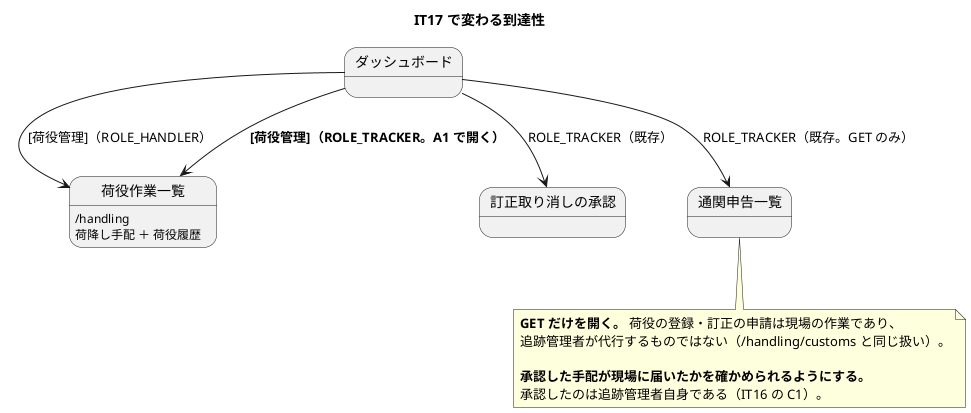

# イテレーション 17 計画

## 概要

| 項目 | 内容 |
| :--- | :--- |
| **対象** | IT16 引き継ぎの返済枠 R1〜R10 ＋ **決着していない判断 A1**（認可） |
| **計画 SP** | **0**（新規ユーザーストーリーを持たない。IT16 と同じ） |
| **局面** | **整流**（IT16 に続く 2 回目） |
| **主アプローチ** | **アウトサイドイン**（既存の是正であり、新しい業務規則を作らない） |
| **期間** | 10 営業日 |
| **前提** | IT16 クローズ済み（US30 の受入基準を充足。Open Issue 0 件） |

> **整流局面が 2 回続く。** `development_strategy.md` は「整流が毎リリース必要になるなら、
> それは各イテレーションの DoD が働いていないということである」と書いた。
> **その警告は正しかった** — IT16 で数えたら、記録された負債は実態の 5〜10 分の 1 だった。
>
> **IT17 は「数え終わった負債を返す」回である。** IT16 で発見と計測を済ませ、
> 縮む表として検査に登録してある。**増やせば落ちる状態で引き渡されている。**

---

## ゴール

**IT16 で数え上げた負債を返し、整流局面を終わらせる。**

1. **正典の食い違いを決着させる**（A1。着手前に決めた — IT16 の Try T6）
2. **育つ負債を返す** — レコード 20 件（R6）・計測 6 件（R5）
3. **検査どうしの重複を解消する**（R8。**Rule of Three を大きく超えている**）
4. **縮む表を空にする** — `NOT_SPLIT_YET` と `NOT_MEASURED_YET`

---

## 前イテレーションの学びの反映（ふりかえり Try）

`retrospective-16.md` の Try 6 件を、本 IT のタスクと成功基準に落とす。

| # | Try | 本 IT での落とし方 |
| :--- | :--- | :--- |
| T1 | 返済枠を送るときは実測値を添える | **本計画の対象表がそうなっている**。加えて着手前に数え直したところ、**R8 は 8 本ではなく 10 本**だった（下記）。**送られた実測値も、着手時にもう一度数える** |
| T2 | ソースを走査する検査は、まず自分を除外する | **タスク 1**（R8）。共通の走査と除外を支援クラスに置き、10 本がそれを使う |
| T3 | 名簿を書く前に「コードから導けないか」を問う | **タスク 1・3**。`NOT_MEASURED_YET` / `NOT_SPLIT_YET` は**空にすることが目的**である |
| T4 | 規則を書いたら「どこまで届くか」を書く | **タスク 2**。ADR の守り手欄に**検査の対象範囲**を追記する |
| T5 | 機械的な一括変換をしたら、落ちた情報を数える | **タスク 3**（R6）。レコード分割は変換前後で要素数を突き合わせる |
| T6 | 正典が食い違ったら、決着させるまで次の IT に持ち込まない | **着手前に決着させた**（A1。下記） |

### 着手前に数え直した結果（Try T1）

| # | IT16 が送った実測 | IT17 着手時の実測 | 差 |
| :--- | :--- | :--- | :--- |
| R8 | 検査 8 本 | **10 本** | **+2**（`CrossContextPortPolicyTest` / `EventualConsistencyPropagationTest` も同じ形を持っていた） |
| R5 | 6 件 | 6 件 | — |
| R6 | 20 件 | 20 件 | — |

> **送られた実測値も、着手時にもう一度数える。** IT16 は「新設した検査 8 本」を数えており、
> **既存の同型の検査 2 本を勘定に入れていなかった**。数え方の枠が違えば、数も違う。

---

## 対象

### A1: 荷役作業一覧の認可を決着させる（**着手前に決めた**）

| 出典 | これまでの内容 |
| :--- | :--- |
| `ui_design.md` の画面一覧 | 荷役作業一覧の表示ロールは **`ROLE_HANDLER, ROLE_TRACKER`** |
| `SecurityConfig.handlingRules` | `/handling` は **`ROLE_HANDLER` のみ** |

**`ui_design.md` を正とし、追跡管理者に GET を開く。**

判断の根拠は次のとおり。

- 追跡管理者は**訂正・取り消しの承認**（US36）と**キャンセルの承認**（US30）を行う立場であり、`/handling/corrections` と `/handling/customs` には**既に GET で入れる**
- **荷降し手配は追跡管理者自身が承認した結果である**（IT16 の C1）。承認した手配が現場に届いたかを確かめられないのは、`notice-must-lead-to-action` の裏返しになる
- `ui_design.md` は長く `ROLE_HANDLER, ROLE_TRACKER` と定めており、**実装が後から狭めた形**である

**GET だけを開く。** 荷役の登録・訂正の申請は現場の作業であり、追跡管理者が代行するものではない（`/handling/customs` と同じ扱い）。

### 返済枠（**実測値を添える** — IT16 の Try T1）

| # | 内容 | 実測 | 育つか |
| :--- | :--- | :--- | :--- |
| R8 | **検査の共通部分を支援クラスへ寄せる** | **10 本** | **育つ**（検査を足すたびに増える） |
| R6 | **レコードの分割** | **20 件・最大 35 要素**（`BookingView`） | **育つ**（列を足すたびに増える） |
| R5 | **問い合わせ回数を計測していないクエリサービス** | **6 件** | **育つ**（一覧を足すたびに増える） |
| R2 | 所有表が `data-model.md` と検査の 2 か所にある | 2 か所・40 テーブル超 | 育たない（突き合わせる検査で固定できる） |
| R9 | 正規表現によるソース走査の誤検知 | 10 本すべて | 育たない（R8 と同時に直る） |
| R3 | 荷降し手配の合成が infrastructure の実装クラスにある | 1 か所 | 育たない |
| R1 | 荷降し手配に期限の手がかりが無い | 1 画面 | 育たない |
| R7 | 請求書一覧が 9 列になった | 9 列 | 育たない |
| R10 | マニュアル 8.8 のキャプチャが 1 件のみの一覧 | 1 枚 | 育たない |
| R4 | `ui_design.md` のロール列の書式 | 1 行 | 育たない（**A1 の決着で戻す**） |

---

## 設計（IT17 スコープ）

### ドメインモデル図

**省略する。** 本 IT はドメインモデルを変えない。R3（合成の置き場）はクエリサービスの実装を application 層へ動かす検討であり、集約・値オブジェクト・ポートの構成は変わらない。

正典は `domain-model.md` である。

### 状態遷移図

**省略する。** 新しい状態も遷移も作らない。

### ER 図

**省略する。** スキーマを変えない（マイグレーションは 0 本）。R2 は `data-model.md` の所有表と検査を突き合わせる作業であり、テーブルそのものは触らない。

### 画面（IT17 スコープ）

新規画面は無い。**既存 3 画面の表示と認可を変える。**

| 画面 | パス | 変更内容 | 対象 |
| :--- | :--- | :--- | :--- |
| 荷役作業一覧 | `/handling` | **追跡管理者に GET を開く**／荷降し手配に期限の手がかりを足す | A1 / R1 |
| 請求書一覧 | `/billing/invoices` | 9 列の見え方を確かめ、狭い画面で読めるようにする | R7 |
| （マニュアル） | `docs/manual` 8.8 | キャプチャを複数件・危険物バッジ付きで撮り直す | R10 |

#### 画面遷移図（IT17 スコープ）

**ナビゲーション整合性（絶対項目）**: A1 で追跡管理者に開くため、**navbar とダッシュボードのカードに `ROLE_TRACKER` の出し分けを足す**。`DashboardEntryRoles` の名簿と `NavigationConsistencyTest` の両方で整合を確かめる（IT16 で「名簿 → カード」の逆方向の検査も入れてある）。

---

## タスク分解

**育つ負債を先に返す**（IT16 の Try T5）。A1 は着手前に決めたため、**最初に実装して食い違いを消す**。

### 0. A1: 認可を決着させる — 4h（**完了** `6bf7d11d4`）

- `SecurityConfig.handlingRules` で `/handling` の GET を `ROLE_TRACKER` にも開く
- navbar とダッシュボードのカードに出し分けを足す
- `ui_design.md` の書式を通常に戻す（R4）
- **テストで固定する**: 追跡管理者が荷役作業一覧を開け、**荷降し手配が読める**。ただし**登録・申請はできない**（403）
- **成功基準**: 正典が 1 つになり、検査が守っている

### 1. R8 / R9: 検査の共通部分を支援クラスへ寄せる — 10h（**完了** `7fa5ef1bb`）

- 10 本の検査が持つ「ソースを走査する」「自分を除外する」「メタテストを書く」を支援クラスへ
- **自分の除外を支援クラスの既定にする**（IT16 で 3 度踏んだ。Try T2）
- あわせて**コメント・文字列リテラルの中を走査対象から外す**（R9）
- **成功基準**: 検査を 1 本足すときに書く走査コードが 0 行。**自己参照を書き忘れても起きない**

### 2. R2 / T4: 所有表を突き合わせ、ADR に届く範囲を書く — 5h（**完了** `31e08bd6a`）

- `data-model.md` の所有表と `MapperTableOwnershipTest.OWNER` を**突き合わせる検査**を書く（R2）
- ADR の守り手欄に**検査の対象範囲**を追記する（Try T4）。例: 「`@TransactionalEventListener` を含むファイルだけを見る」
- **成功基準**: 2 か所がずれたら赤。ADR の守り手にすべて範囲が書かれている

### 3. R6: レコードを分割する（**育つ負債**） — 16h（**完了** 20/20。`8364e30cd` 〜 `202ea6119`）

- `NOT_SPLIT_YET` の **20 件**を意味のまとまりに分ける。**委譲アクセサを残し、テンプレートは触らない**（IT16 の `InvoiceView` と同じ形）
- **変換前後で要素数を突き合わせる**（Try T5）
- **成功基準**: `NOT_SPLIT_YET` が**空**になる

### 4. R5: 一覧の問い合わせ回数を計測する（**育つ負債**） — 10h（**完了** `ddffec066`。**N+1 を 1 件発見・修正**）

- `NOT_MEASURED_YET` の **6 件**に `QueryCounter` テストを足す
- **N+1 が見つかったら SQL の絞り込みへ寄せる**
- **成功基準**: `NOT_MEASURED_YET` が**空**になる

### 5. R3: 荷降し手配の合成の置き場 — 3h（**完了** `de2c8fb6d`。ADR-022 を起票）

- ACL ポートと自分のマッパーの合成が infrastructure の実装クラスにある。application 層へ動かせるかを検討する
- **動かさない判断でもよい。** その場合は**理由を書く**（ArchUnit ルール 3 との関係）

### 6. R1 / R7 / R10: 画面とマニュアル — 8h（**完了** `0ad5f2c71` / `4b7f91877`。**R7 は 1 画面 → 実測 13 テンプレート**）

| # | 内容 | 見積 |
| :--- | :--- | :--- |
| R1 | 荷降し手配に期限の手がかり | 3h |
| R7 | 請求書一覧の 9 列を狭い画面で読めるように | 3h |
| R10 | マニュアル 8.8 のキャプチャを複数件・危険物バッジ付きで | 2h |

### 7. 途中レビュー（IT16 の T6 を継続） — 3h（**完了** `0ac213380`。要修正 2 / 許容 3）

- タスク 3 完了時点で `developing-review` を回す。**IT16 で実を結んだ**（自身の T3 違反を捕まえた）

### 8. 品質ゲートと破壊検証 — 8h（**完了** `1f04556a0` / `4a1a07fe2`。**「書いたつもりの検査」を 1 件発見**）

- `./gradlew check` ／ **`TZ=UTC ./gradlew check`** ／ E2E ／ SonarQube
- **安全装置を数え上げてから壊す**（着手前にリストを作らない）

### 9. ドキュメント — 6h（**完了**）

- `ui_design.md`（A1 / R4 / R1 / R7）・`data-model.md`（R2）・ADR の守り手に範囲（T4）
- ふりかえり・完了報告書はクローズ時

**合計 73h**（10 営業日 = 80h）。**余白は 7h。** IT16 は 81h を見積もって超過したが、**発見と計測が済んでいる分だけ本 IT は読みやすい**。

---

## スケジュール

10 営業日。**タスク番号は上記「タスク分解」に対応する。**

### Week 1（Day 1-5）

| Day | 内容 | 見積 |
| :--- | :--- | :--- |
| Day 1 | タスク 0（A1 の認可決着）4h ＋ タスク 1 前半（支援クラスの新設）4h | 8h |
| Day 2 | タスク 1 後半（10 本を 1 本ずつ移す。R8 / R9） | 6h |
| Day 3 | タスク 2（所有表の突き合わせと ADR の対象範囲。R2 / T4）5h ＋ タスク 3 着手 3h | 8h |
| Day 4 | タスク 3（レコード分割。大きい順に `BookingView` 35 → `CancellationView` 19 →） | 8h |
| Day 5 | タスク 3（続き） | 8h |

### Week 2（Day 6-10）

| Day | 内容 | 見積 |
| :--- | :--- | :--- |
| Day 6 | タスク 3 完了 ＋ **タスク 7（途中レビュー）** | 5h ／ 3h |
| Day 7 | タスク 4（計測 6 件。R5） | 8h |
| Day 8 | タスク 4 完了 2h ＋ タスク 5（合成の置き場。R3）3h ＋ タスク 6 着手 3h | 8h |
| Day 9 | タスク 6（画面とマニュアル。R1 / R7 / R10）5h ＋ タスク 8 着手 3h | 8h |
| Day 10 | タスク 8（品質ゲートと破壊検証）5h ＋ タスク 9（ドキュメント）3h | 8h |

> **合計 73h に対して 80h であり、余白は 7h ある。** IT16 は 81h を見積もって
> 超過したが、**本 IT は発見と計測が済んでいる**分だけ読みやすい。
> ただし**着手時の数え直しで R8 が 8 → 10 に増えている**（Try T1）。
> 同じことが R6・R5 で起きたら、落とす順序を先に見直す。

---

## 落とす順序（**先に決めておく**）

超過が見えた時点で、**下から落とす**。

| 順序 | 落とすもの | 理由 |
| :--- | :--- | :--- |
| 1 | R10（マニュアルのキャプチャ） | 図が 1 枚あり、説明とは一致している。**足りないのは分かりやすさである** |
| 2 | R7（請求書一覧の 9 列） | 読めないと分かったわけではない。**確かめていないだけ**である |
| 3 | R3（合成の置き場） | 「動かさない判断でもよい」と決めてある。**理由を書けば返済になる** |
| 4 | R1（手配の期限） | 受入基準の外。要求が出てから足すと IT16 で決めた |
| — | **A1 は落とさない** | **着手前に決着させた判断である**（Try T6）。持ち越すと同じ場所でつまずく |
| — | **R6・R5・R8 は落とさない** | **育つ負債**。落とすと次の IT でさらに大きくなる |
| — | **途中レビューは落とさない** | IT16 で実を結んだ。**落とすと IT14・IT15 の形に戻る** |

---

## リスクと対策

| リスク | 影響 | 対策 |
| :--- | :--- | :--- |
| **R6（20 件）が 16h で終わらない** | 育つ負債が残る | **1 件ずつ分ける**（IT16 の C2 の教訓）。大きい順（`BookingView` 35 → `CancellationView` 19 → …）に返し、**途中で止めても大きいものが減っている**状態にする |
| **R8 の共通化が 10 本すべてを揺らす** | 広範囲の赤 | **支援クラスを先に作り、1 本ずつ移す。** 全部を一度に書き換えない |
| **着手時の数え直しでさらに増える** | 見積もりが崩れる | **R8 は既に 8 → 10 に増えていた。** タスク着手時に毎回数え直し、増えていたら**落とす順序を先に見直す** |
| **A1 の認可変更が他の画面に波及する** | 想定外の 403 / 開放 | **GET だけを開く。** `/handling/customs` の既存規則と同じ形にし、規則の順序（IT10・IT15 で 2 度踏んだ）を検査で確かめる |

---

## 完了条件

### デモ項目

1. **追跡管理者が荷役作業一覧を開ける**（A1）
2. **追跡管理者は荷役を登録できない**（403。GET だけを開く）
3. **追跡管理者が自分の承認した荷降し手配を確認できる**
4. **ダッシュボードと navbar に追跡管理者の入口が出る**
5. **レコードの要素が 7 個を超えるものが無い**（`NOT_SPLIT_YET` が空）
6. **一覧を返すクエリサービスすべてに計測がある**（`NOT_MEASURED_YET` が空）
7. **検査を 1 本足すときに走査コードを書かない**（R8）
8. **所有表がずれたら赤になる**（R2）
9. 荷降し手配に期限の手がかりが出る（R1）
10. 請求書一覧が狭い画面でも読める（R7）

### 完了の定義（DoD）

**条件は書き写さず、正典を引用する。**

#### 機能

- [x] **A1 の決着が実装と両文書に反映されている**
  - 正典: `ui_design.md` の画面一覧「荷役作業一覧」の表示ロール
  - 検査: 追跡管理者が開けること・**登録はできないこと**の両方
- [x] デモ項目 10 件がすべて動作する
- [x] **落としたものは名前で記録する**（**落としたものは無い**。R1〜R10・A1・T1〜T6 をすべて返した）

#### 局面の完了条件

- [x] 正典: `development_strategy.md` の「整流（IT16）」の節
- [x] **`NOT_SPLIT_YET` と `NOT_MEASURED_YET` が空である** — 整流局面を終わらせる条件（**両方とも空を保つ検査つき**）

#### 品質

- [x] `./gradlew check` が緑
- [x] **`TZ=UTC ./gradlew check` が緑**（`--rerun-tasks` で全件実行）
- [x] E2E が緑（21 件）
- [x] SonarQube Quality Gate が PASS（new_violations 0 / new_coverage 87.1% / 重複 0.22%）
- [x] **CI が緑**（`53df8a1f2`。4 ジョブすべて success）
- [x] 全体カバレッジ: 命令 91.9% / 行 92.5% / 分岐 71.9%

#### 主張とテスト（Try の検証）

- [x] **T1: 着手時に数え直した**（R8 は 8 → 10、**R7 は 1 → 13** だった）
- [x] **T2: 自分の除外が支援クラスの既定になっている**（`SourceScan`）
- [x] **T3: `NOT_*` の表が空になった**（名簿を最後の手段にする）
- [x] **T4: ADR の守り手にすべて対象範囲が書かれている**（21 件。空欄を赤にする検査つき）
- [x] **T5: レコード分割で変換前後の要素数を突き合わせた**（委譲アクセサで画面の名前を保ち、テンプレートは無変更）
- [x] **T6: 正典の食い違いを着手前に決着させた**（A1）
- [x] **破壊検証で空振り 0**。ただし**「書いたつもりで入っていない検査」を 1 件発見した**（R5 の「表が空である」）。同型を止める検査（`SelfLinkResolvesTest`）を足した

#### 安全装置（**着手前にリストを作らない**）

実装後に数え上げた結果で埋める。

| 安全装置 | 何を止めるか | 破壊検証 |
| :--- | :--- | :--- |
| `SourceScan` の自己除外（既定） | 検査が自分のフィクスチャを違反として数える | 除外を外すと赤 |
| `MapperTableOwnershipTest.所有表は正典と一致する` | 正典と名簿の食い違い | 両方向で赤 |
| `AdrGuardScopeTest` | 守り手の対象範囲が空欄のまま残る | 「—」に戻すと赤 |
| `RecordComponentCountTest.据え置きの表は空である` | 据え置きが再び始まる | 1 行足すと赤 |
| `ListQueryMeasurementTest.据え置きの表は空である` | 同上（計測） | 1 行足すと赤 |
| `WideTableReadabilityTest` | 列の多い一覧が狭い画面で潰れる | `table-responsive` を外すと赤 |
| `SelfLinkResolvesTest` | **書いたつもりの検査**が文章だけ残る | 参照先を改名すると赤 |
| `ListQueryEfficiencyTest` | 一覧の問い合わせが件数に比例する | 1 件ずつ引く形に戻すと赤 |
| `DischargeOrderSelectionTest` | 降ろし済みが手配に残る | 絞り込みを外すと赤 |

**やらなかったもの**: 無し。

#### 到達性（ロール別・状態別・発生時点）

- [x] **追跡管理者がダッシュボード・navbar の両方から荷役作業一覧へ到達できる**
- [x] **荷役作業員の到達性が変わっていない**
- [x] **追跡管理者が荷役登録・訂正申請へ進めない**（403）

#### ドキュメント

- [x] `ui_design.md` の書式を通常に戻した（R4）。あわせて**待ち日数（R1）と横スクロール（R7）**を反映した
- [x] `data-model.md` の所有表と検査が突き合わされている（R2）
- [x] ADR の守り手に対象範囲が書かれている（T4。21 件）。**ADR-022 を新規に起票**（R3）
- [x] **マニュアル 8.8 のキャプチャを撮り直した**（R10。2 件・危険物バッジ・待ち列が写っている）
- [x] `mkdocs build` の新規警告 0（変更前後とも 15 件で同数）

---

## 更新履歴

| 日付 | 内容 |
| :--- | :--- |
| 2026-08-11 | 初版作成（`opening-iteration` のステップ 2）。**A1（認可）を着手前に決着させた**（IT16 の Try T6）。着手時の数え直しで **R8 が 8 → 10 本**であることが判明 |
| 2026-08-11 | **クローズ前レビュー（5 視点）で高優先度 1 件**を発見・対応（A1 の副作用。追跡管理者に押すと 403 になるボタンが出ていた）。低優先度 3 件も対応し、中 3 件・低 4 件を引き継ぎに記名した |
| 2026-08-11 | タスク 0〜9 を完了。**落としたものは無い**。R7 は記録「1 画面」に対し**実測 13 テンプレート**だった。R5 の返済中に**本物の N+1 を 1 件発見**（訂正の承認待ち一覧）。品質ゲートで**「書いたつもりで入っていない検査」を 1 件発見**し、同型を止める検査を足した。ADR-022 を起票 |

---

## 関連ドキュメント

- [リリース計画](release_plan.md)
- [開発戦略](development_strategy.md)
- [IT16 ふりかえり](retrospective-16.md)
- [IT16 完了報告書](iteration_report-16.md)
- [IT16 実装レビュー（途中）](../review/IT16実装_review_20260811.md)
- [IT16 クローズ前レビュー](../review/IT16クローズ_review_20260811.md)
- [UI 設計](../design/ui_design.md)
- [ADR-015 BC 間の結合は SQL の層でも検査する](../adr/015-mapper-sql-table-ownership.md)
